<!-- GENERATED FILE — 請編輯 docs/tractatus/corpus/*.yaml，不要直接修改本檔。 -->
# 《邏輯哲學論》× Akashic-Library 逐條對照

> 欄位順序固定為：德文原文、Ogden／Ramsey 1922、Pears／McGuinness 版本參照、臺灣正體中文工作譯文。

## 正典 metadata

- 獻詞：Dem Andenken meines Freundes DAVID H. PINSENT gewidmet
- 題辭：. . . und alles, was man weiss, nicht bloss rauschen und brausen gehört hat, lässt sich in drei Worten sagen.（Kürnberger）

## 來源版本

- <code>de</code>（original／inline）：Ludwig Wittgenstein, Logisch-philosophische Abhandlung, 1922. — <a href="https://raw.githubusercontent.com/wittgenstein-project/wittgenstein-published-works/1e69298e1e026512da6fdbe203e73fb3ab35d126/markdown/german/Logisch-philosophische%20Abhandlung/Logisch-philosophische%20Abhandlung.md">來源</a>
- <code>en_ogden_ramsey_1922</code>（translation／inline）：Ludwig Wittgenstein, Tractatus Logico-Philosophicus, trans. F. P. Ramsey, ed. C. K. Ogden (Kegan Paul, 1922). — <a href="https://raw.githubusercontent.com/wittgenstein-project/wittgenstein-published-works/1e69298e1e026512da6fdbe203e73fb3ab35d126/markdown/english/Tractatus%20Logico-Philosophicus%20(English)/Tractatus%20Logico-Philosophicus%20(English).md">來源</a>
- <code>en_pears_mcguinness</code>（translation／external_reference）：Ludwig Wittgenstein, Tractatus Logico-Philosophicus, trans. D. F. Pears and B. F. McGuinness, 2nd ed. (Routledge, 2001), ISBN 9780415254083. — <a href="https://www.routledge.com/Tractatus-Logico-Philosophicus/Wittgenstein/p/book/9780415254083">來源</a>

## 序言

<table>
<thead>
<tr>
<th scope="col">德文原文</th>
<th scope="col">Ogden／Ramsey 1922</th>
<th scope="col">Pears／McGuinness</th>
<th scope="col">臺灣正體中文</th>
</tr>
</thead>
<tbody>
<tr id="proposition-preface-1">
<td colspan="4"><strong>preface.1</strong></td>
</tr>
<tr id="segment-preface-1-a">
<td lang="de">Dieses Buch wird vielleicht nur der verstehen, der die Gedanken, die darin ausgedrückt sind – oder doch ähnliche Gedanken – schon selbst einmal gedacht hat.</td>
<td lang="en">This book will perhaps only be understood by those who have themselves already thought the thoughts which are expressed in it—or similar thoughts.</td>
<td lang="en"><em>外部版本參照：</em> Ludwig Wittgenstein, Tractatus Logico-Philosophicus, trans. D. F. Pears and B. F. McGuinness, 2nd ed. (Routledge, 2001), ISBN 9780415254083.；命題 <code>Preface paragraph 1</code>；<a href="https://www.routledge.com/Tractatus-Logico-Philosophicus/Wittgenstein/p/book/9780415254083">來源</a></td>
<td lang="zh-Hant">這本書也許只有這樣的人才會理解：他自己已經想過書中所表達的思想——或至少想過類似的思想。 <small><strong>哲學解讀：</strong> 理解被描述為讀者親自走過相近思想歷程後的辨認；這不是以神祕資格排除讀者，而是說本書不會從外部逐步灌輸其觀看方式。</small></td>
</tr>
<tr id="segment-preface-1-b">
<td lang="de">– Es ist also kein Lehrbuch.</td>
<td lang="en">It is therefore not a text-book.</td>
<td lang="en"><em>外部版本參照：</em> Ludwig Wittgenstein, Tractatus Logico-Philosophicus, trans. D. F. Pears and B. F. McGuinness, 2nd ed. (Routledge, 2001), ISBN 9780415254083.；命題 <code>Preface paragraph 1</code>；<a href="https://www.routledge.com/Tractatus-Logico-Philosophicus/Wittgenstein/p/book/9780415254083">來源</a></td>
<td lang="zh-Hant">——所以它不是一本教科書。 <small><strong>哲學解讀：</strong> 這句否定作品的教科書體裁：它企圖澄清既有困惑，而不是按章節教授一套可照表操課的學說。</small></td>
</tr>
<tr id="segment-preface-1-c">
<td lang="de">– Sein Zweck wäre erreicht, wenn es Einem, der es mit Verständnis liest Vergnügen bereitete.</td>
<td lang="en">Its object would be attained if there were one person who read it with understanding and to whom it afforded pleasure.</td>
<td lang="en"><em>外部版本參照：</em> Ludwig Wittgenstein, Tractatus Logico-Philosophicus, trans. D. F. Pears and B. F. McGuinness, 2nd ed. (Routledge, 2001), ISBN 9780415254083.；命題 <code>Preface paragraph 1</code>；<a href="https://www.routledge.com/Tractatus-Logico-Philosophicus/Wittgenstein/p/book/9780415254083">來源</a></td>
<td lang="zh-Hant">——只要有一位讀者能帶著理解閱讀它，並從中得到愉悅，它的目的就算達成。 <small><strong>哲學解讀：</strong> 成功標準是至少一位讀者獲得理解與愉悅的質性轉變，而不是銷量、普遍同意或一套外部可量測的教學成果。</small></td>
</tr>
<tr class="project-relations">
<td colspan="4">
<strong>Akashic 專案關係</strong>
<ul>
<li><code>not_applicable</code> — Akashic 不要求使用者先具有某種思想經驗，也不把閱讀愉悅當成系統正確性的條件。 <small>理由：序言談的是作者期待的讀者與作品目的；把這種閱讀條件硬套成軟體前置條件或驗收指標，會混淆哲學閱讀與工程行為。</small>
</li>
</ul>
</td>
</tr>
<tr id="proposition-preface-2">
<td colspan="4"><strong>preface.2</strong></td>
</tr>
<tr id="segment-preface-2-a">
<td lang="de">Das Buch behandelt die philosophischen Probleme und zeigt – wie ich glaube – dass die Fragestellung dieser Probleme auf dem Missverständnis der Logik unserer Sprache beruht.</td>
<td lang="en">The book deals with the problems of philosophy and shows, as I believe, that the method of formulating these problems rests on the misunderstanding of the logic of our language.</td>
<td lang="en"><em>外部版本參照：</em> Ludwig Wittgenstein, Tractatus Logico-Philosophicus, trans. D. F. Pears and B. F. McGuinness, 2nd ed. (Routledge, 2001), ISBN 9780415254083.；命題 <code>Preface paragraph 2</code>；<a href="https://www.routledge.com/Tractatus-Logico-Philosophicus/Wittgenstein/p/book/9780415254083">來源</a></td>
<td lang="zh-Hant">這本書處理哲學問題，並且——如我所相信的——顯示：這些問題的提問方式奠基於對我們語言邏輯的誤解。 <small><strong>哲學解讀：</strong> 診斷針對問題的形成方式，而不只針對某個答案真假；若困難源自語言邏輯的誤讀，哲學工作便可能是澄清並使問題消解。</small></td>
</tr>
<tr id="segment-preface-2-b">
<td lang="de">Man könnte den ganzen Sinn des Buches etwa in die Worte fassen: Was sich überhaupt sagen lässt, lässt sich klar sagen; und wovon man nicht reden kann, darüber muss man schweigen.</td>
<td lang="en">Its whole meaning could be summed up somewhat as follows: What can be said at all can be said clearly; and whereof one cannot speak thereof one must be silent.</td>
<td lang="en"><em>外部版本參照：</em> Ludwig Wittgenstein, Tractatus Logico-Philosophicus, trans. D. F. Pears and B. F. McGuinness, 2nd ed. (Routledge, 2001), ISBN 9780415254083.；命題 <code>Preface paragraph 2</code>；<a href="https://www.routledge.com/Tractatus-Logico-Philosophicus/Wittgenstein/p/book/9780415254083">來源</a></td>
<td lang="zh-Hant">本書的全部意旨大致可概括為：凡是完全能說的，都能清楚地說；而對於不能談論之事，就必須保持沉默。 <small><strong>哲學解讀：</strong> 清楚言說與沉默標出有意義命題的界線；這不是禁止保存未知資料、情感或價值，而是要求別把無法形成命題意義的東西偽裝成可陳述知識。</small></td>
</tr>
<tr class="project-relations">
<td colspan="4">
<strong>Akashic 專案關係</strong>
<ul>
<li><code>analogy_only</code> / <code>meta_elucidation</code> — Akashic 以明確 schema、型別與驗證器約束可表達內容，並在哲學文件中承認語言界線。 <small>理由：這是精確表達的工程類比，不表示驗證通過就等於解決哲學問題，也不把無法入 schema 的內容判成沒有價值。</small>
<ul>
<li><code>docs/design-principles-and-philosophy.md</code>（heading：<code>## 17. Frege 與維根斯坦：精確語言與語言界線</code>）— 本節明載精確語言與語言界線對 Akashic 的雙重紀律。</li>
</ul>
</li>
</ul>
</td>
</tr>
<tr id="proposition-preface-3">
<td colspan="4"><strong>preface.3</strong></td>
</tr>
<tr id="segment-preface-3-a">
<td lang="de">Das Buch will also dem Denken eine Grenze ziehen, oder vielmehr – nicht dem Denken, sondern dem Ausdruck der Gedanken: Denn um dem Denken eine Grenze zu ziehen, müssten wir beide Seiten dieser Grenze denken können (wir müssten also denken können, was sich nicht denken lässt).</td>
<td lang="en">The book will, therefore, draw a limit to thinking, or rather—not to thinking, but to the expression of thoughts; for, in order to draw a limit to thinking we should have to be able to think both sides of this limit (we should therefore have to be able to think what cannot be thought).</td>
<td lang="en"><em>外部版本參照：</em> Ludwig Wittgenstein, Tractatus Logico-Philosophicus, trans. D. F. Pears and B. F. McGuinness, 2nd ed. (Routledge, 2001), ISBN 9780415254083.；命題 <code>Preface paragraph 3</code>；<a href="https://www.routledge.com/Tractatus-Logico-Philosophicus/Wittgenstein/p/book/9780415254083">來源</a></td>
<td lang="zh-Hant">因此，本書要為思想劃出一道界線；或者更確切地說——不是為思想，而是為思想的表達劃界：因為若要為思想劃界，我們就必須能思考這道界線的兩側（也就是必須能思考不可被思考之物）。 <small><strong>哲學解讀：</strong> 直接替思想本身劃界會陷入自我挫敗，因為辨認界外就已要求思考界外；因此可行的工作轉向檢視思想何時能取得有意義的語言表達。</small></td>
</tr>
<tr class="project-relations">
<td colspan="4">
<strong>Akashic 專案關係</strong>
<ul>
<li><code>analogy_only</code> / <code>shown_constraint</code> — Akashic 只替可由既有 schema 表達與驗證的紀錄劃定系統邊界，不宣稱替人的思考劃界。 <small>理由：型別與 schema 能顯示系統目前可表達什麼，卻不能證成其邊界就是思想或世界的邊界；對應僅止於表達限制。</small>
<ul>
<li><code>docs/design-principles-and-philosophy.md</code>（heading：<code>## 17. Frege 與維根斯坦：精確語言與語言界線</code>）— 本節區分形式語言的精確性與實際使用所顯示的語言界線。</li>
</ul>
</li>
</ul>
</td>
</tr>
<tr id="proposition-preface-4">
<td colspan="4"><strong>preface.4</strong></td>
</tr>
<tr id="segment-preface-4-a">
<td lang="de">Die Grenze wird also nur in der Sprache gezogen werden können und was jenseits der Grenze liegt, wird einfach Unsinn sein.</td>
<td lang="en">The limit can, therefore, only be drawn in language and what lies on the other side of the limit will be simply nonsense.</td>
<td lang="en"><em>外部版本參照：</em> Ludwig Wittgenstein, Tractatus Logico-Philosophicus, trans. D. F. Pears and B. F. McGuinness, 2nd ed. (Routledge, 2001), ISBN 9780415254083.；命題 <code>Preface paragraph 4</code>；<a href="https://www.routledge.com/Tractatus-Logico-Philosophicus/Wittgenstein/p/book/9780415254083">來源</a></td>
<td lang="zh-Hant">因此，界線只能在語言中劃出；而界線彼端之物將只是無意義。 <small><strong>哲學解讀：</strong> 此處的 Unsinn 是缺乏可形成命題意義的語言位置，不等同於經驗上為假、荒唐可笑或尚未被資料庫收錄。</small></td>
</tr>
<tr class="project-relations">
<td colspan="4">
<strong>Akashic 專案關係</strong>
<ul>
<li><code>analogy_only</code> / <code>shown_constraint</code> — Akashic 讓 schema 顯示目前能合法表示的內容，同時明載未被表示者不因此不存在。 <small>理由：驗證失敗只表示內容不符合這套資料語言，不能推出界外內容在世界中毫無意義；這項保留避免把工程界線膨脹成形上學界線。</small>
<ul>
<li><code>docs/design-principles-and-philosophy.md</code>（heading：<code>## 18. 圖書館不能等同於世界</code>）— 本節明言世界與有意義生活超出圖書館目前能保存的事實。</li>
</ul>
</li>
</ul>
</td>
</tr>
<tr id="proposition-preface-5">
<td colspan="4"><strong>preface.5</strong></td>
</tr>
<tr id="segment-preface-5-a">
<td lang="de">Wieweit meine Bestrebungen mit denen anderer Philosophen zusammenfallen, will ich nicht beurteilen.</td>
<td lang="en">How far my efforts agree with those of other philosophers I will not decide.</td>
<td lang="en"><em>外部版本參照：</em> Ludwig Wittgenstein, Tractatus Logico-Philosophicus, trans. D. F. Pears and B. F. McGuinness, 2nd ed. (Routledge, 2001), ISBN 9780415254083.；命題 <code>Preface paragraph 5</code>；<a href="https://www.routledge.com/Tractatus-Logico-Philosophicus/Wittgenstein/p/book/9780415254083">來源</a></td>
<td lang="zh-Hant">我的努力在多大程度上與其他哲學家的努力相合，我不打算判斷。 <small><strong>哲學解讀：</strong> 作者暫不替自己的工作安排哲學史位置；這是對比較工作的節制，不等於否認思想之間確實可能有重疊或差異。</small></td>
</tr>
<tr id="segment-preface-5-b">
<td lang="de">Ja, was ich hier geschrieben habe macht im Einzelnen überhaupt nicht den Anspruch auf Neuheit; und darum gebe ich auch keine Quellen an, weil es mir gleichgültig ist, ob das was ich gedacht habe, vor mir schon ein anderer gedacht hat.</td>
<td lang="en">Indeed what I have here written makes no claim to novelty in points of detail; and therefore I give no sources, because it is indifferent to me whether what I have thought has already been thought before me by another.</td>
<td lang="en"><em>外部版本參照：</em> Ludwig Wittgenstein, Tractatus Logico-Philosophicus, trans. D. F. Pears and B. F. McGuinness, 2nd ed. (Routledge, 2001), ISBN 9780415254083.；命題 <code>Preface paragraph 5</code>；<a href="https://www.routledge.com/Tractatus-Logico-Philosophicus/Wittgenstein/p/book/9780415254083">來源</a></td>
<td lang="zh-Hant">事實上，我在此所寫的細節根本不宣稱新穎；因此我也不列來源，因為在我之前是否已有別人想過我所想的，對我而言無關緊要。 <small><strong>哲學解讀：</strong> 不主張細節新穎與不列來源是作者在此自述的優先次序；它既不證明思想沒有前例，也不能成為後來校勘或學術語料省略來源的通則。</small></td>
</tr>
<tr class="project-relations">
<td colspan="4">
<strong>Akashic 專案關係</strong>
<ul>
<li><code>intentional_nonconformance</code> / <code>declared_nonconformance</code> — Akashic 的《邏輯哲學論》語料刻意不沿用序言的『不列來源』做法，而要求版本、快照與權利狀態可稽核。 <small>理由：作者對思想優先權的淡然不能取代專案對逐字來源與重製權的責任；因此此處是有理由的明確不遵循。</small>
<ul>
<li><code>docs/tractatus/README.md</code>（heading：<code>## 來源與權利</code>）— 本節固定版本、revision、digest 與外部參照的權利界線。</li>
</ul>
</li>
</ul>
</td>
</tr>
<tr id="proposition-preface-6">
<td colspan="4"><strong>preface.6</strong></td>
</tr>
<tr id="segment-preface-6-a">
<td lang="de">Nur das will ich erwähnen, dass ich den grossartigen Werken Freges und den Arbeiten meines Freundes Herrn Bertrand Russell einen grossen Teil der Anregung zu meinen Gedanken schulde.</td>
<td lang="en">I will only mention that to the great works of Frege and the writings of my friend Bertrand Russell I owe in large measure the stimulation of my thoughts.</td>
<td lang="en"><em>外部版本參照：</em> Ludwig Wittgenstein, Tractatus Logico-Philosophicus, trans. D. F. Pears and B. F. McGuinness, 2nd ed. (Routledge, 2001), ISBN 9780415254083.；命題 <code>Preface paragraph 6</code>；<a href="https://www.routledge.com/Tractatus-Logico-Philosophicus/Wittgenstein/p/book/9780415254083">來源</a></td>
<td lang="zh-Hant">我只想提到：我的思想有很大一部分啟發，得自弗雷格的偉大著作，以及我的朋友伯特蘭・羅素先生的工作。 <small><strong>哲學解讀：</strong> 這句補上具名的思想債務：即使作者不做逐項來源考證，弗雷格與羅素仍是理解本書問題背景的重要脈絡。</small></td>
</tr>
<tr class="project-relations">
<td colspan="4">
<strong>Akashic 專案關係</strong>
<ul>
<li><code>not_applicable</code> — 弗雷格與羅素對維根斯坦的思想啟發是一項哲學史陳述，不是 Akashic 的執行期不變條件。 <small>理由：專案文件可以保存這項來源脈絡，但若把某位思想家的影響力直接映射成資料模型或程式行為，會把歷史關係誤說成工程同一性。</small>
</li>
</ul>
</td>
</tr>
<tr id="proposition-preface-7">
<td colspan="4"><strong>preface.7</strong></td>
</tr>
<tr id="segment-preface-7-a">
<td lang="de">Wenn diese Arbeit einen Wert hat, so besteht er in Zweierlei.</td>
<td lang="en">If this work has a value it consists in two things.</td>
<td lang="en"><em>外部版本參照：</em> Ludwig Wittgenstein, Tractatus Logico-Philosophicus, trans. D. F. Pears and B. F. McGuinness, 2nd ed. (Routledge, 2001), ISBN 9780415254083.；命題 <code>Preface paragraph 7</code>；<a href="https://www.routledge.com/Tractatus-Logico-Philosophicus/Wittgenstein/p/book/9780415254083">來源</a></td>
<td lang="zh-Hant">如果這部作品有價值，那麼它的價值有兩方面。 <small><strong>哲學解讀：</strong> 作者先區分兩種價值，為後文把表達品質與思想真理分開評估建立結構。</small></td>
</tr>
<tr id="segment-preface-7-b">
<td lang="de">Erstens darin, dass in ihr Gedanken ausgedrückt sind, und dieser Wert wird umso grösser sein, je besser die Gedanken ausgedrückt sind.</td>
<td lang="en">First that in it thoughts are expressed, and this value will be the greater the better the thoughts are expressed.</td>
<td lang="en"><em>外部版本參照：</em> Ludwig Wittgenstein, Tractatus Logico-Philosophicus, trans. D. F. Pears and B. F. McGuinness, 2nd ed. (Routledge, 2001), ISBN 9780415254083.；命題 <code>Preface paragraph 7</code>；<a href="https://www.routledge.com/Tractatus-Logico-Philosophicus/Wittgenstein/p/book/9780415254083">來源</a></td>
<td lang="zh-Hant">第一，在於其中表達了思想；而思想表達得越好，這項價值就越大。 <small><strong>哲學解讀：</strong> 思想是否被表達，以及被表達得多精確，本身構成第一種價值；這使語句形式不是可忽略的外包裝。</small></td>
</tr>
<tr id="segment-preface-7-c">
<td lang="de">Je mehr der Nagel auf den Kopf getroffen ist.</td>
<td lang="en">The more the nail has been hit on the head.</td>
<td lang="en"><em>外部版本參照：</em> Ludwig Wittgenstein, Tractatus Logico-Philosophicus, trans. D. F. Pears and B. F. McGuinness, 2nd ed. (Routledge, 2001), ISBN 9780415254083.；命題 <code>Preface paragraph 7</code>；<a href="https://www.routledge.com/Tractatus-Logico-Philosophicus/Wittgenstein/p/book/9780415254083">來源</a></td>
<td lang="zh-Hant">也就是越能一針見血。 <small><strong>哲學解讀：</strong> 『把釘子打中頭部』是命中問題要害的譬喻，衡量的是表達的準確與切中，而不是篇幅或修辭華麗。</small></td>
</tr>
<tr id="segment-preface-7-d">
<td lang="de">– Hier bin ich mir bewusst, weit hinter dem Möglichen zurückgeblieben zu sein.</td>
<td lang="en">—Here I am conscious that I have fallen far short of the possible.</td>
<td lang="en"><em>外部版本參照：</em> Ludwig Wittgenstein, Tractatus Logico-Philosophicus, trans. D. F. Pears and B. F. McGuinness, 2nd ed. (Routledge, 2001), ISBN 9780415254083.；命題 <code>Preface paragraph 7</code>；<a href="https://www.routledge.com/Tractatus-Logico-Philosophicus/Wittgenstein/p/book/9780415254083">來源</a></td>
<td lang="zh-Hant">——在這一點上，我自知遠遠未達到原可達成的程度。 <small><strong>哲學解讀：</strong> 作者對第一種價值作自我限縮：即使相信思想內容，也承認現有表達沒有窮盡可能的清晰度。</small></td>
</tr>
<tr id="segment-preface-7-e">
<td lang="de">Einfach darum, weil meine Kraft zur Bewältigung der Aufgabe zu gering ist.</td>
<td lang="en">Simply because my powers are insufficient to cope with the task.</td>
<td lang="en"><em>外部版本參照：</em> Ludwig Wittgenstein, Tractatus Logico-Philosophicus, trans. D. F. Pears and B. F. McGuinness, 2nd ed. (Routledge, 2001), ISBN 9780415254083.；命題 <code>Preface paragraph 7</code>；<a href="https://www.routledge.com/Tractatus-Logico-Philosophicus/Wittgenstein/p/book/9780415254083">來源</a></td>
<td lang="zh-Hant">原因很簡單：我的能力不足以完成這項任務。 <small><strong>哲學解讀：</strong> 不足被歸於執行者的有限能力，而不是把未完成的表達反過來宣稱為問題本身不可澄清。</small></td>
</tr>
<tr id="segment-preface-7-f">
<td lang="de">– Mögen andere kommen und es besser machen.</td>
<td lang="en">—May others come and do it better.</td>
<td lang="en"><em>外部版本參照：</em> Ludwig Wittgenstein, Tractatus Logico-Philosophicus, trans. D. F. Pears and B. F. McGuinness, 2nd ed. (Routledge, 2001), ISBN 9780415254083.；命題 <code>Preface paragraph 7</code>；<a href="https://www.routledge.com/Tractatus-Logico-Philosophicus/Wittgenstein/p/book/9780415254083">來源</a></td>
<td lang="zh-Hant">——但願後來有人能做得更好。 <small><strong>哲學解讀：</strong> 邀請後來者改進，讓作品保持可校訂性；這與下一段對思想真理的強烈確信形成刻意張力。</small></td>
</tr>
<tr class="project-relations">
<td colspan="4">
<strong>Akashic 專案關係</strong>
<ul>
<li><code>partial</code> / <code>meta_elucidation</code> — Akashic 的語料格式把原文、工作譯文與哲學解讀分欄，使表達品質可以逐句校訂，也容許後來者做得更好。 <small>理由：可追溯欄位與逐句對齊落實了可複核、可改進的一部分精神；它們仍無法機械判定某個哲學表達是否真正一針見血。</small>
<ul>
<li><code>docs/tractatus/README.md</code>（heading：<code>## YAML 編輯契約</code>）— 本節要求原文單位、工作譯文與逐句解讀分開保存。</li>
</ul>
</li>
</ul>
</td>
</tr>
<tr id="proposition-preface-8">
<td colspan="4"><strong>preface.8</strong></td>
</tr>
<tr id="segment-preface-8-a">
<td lang="de">Dagegen scheint mir die *Wahrheit* der hier mitgeteilten Gedanken unantastbar und definitiv.</td>
<td lang="en">On the other hand the *truth* of the thoughts communicated here seems to me unassailable and definitive.</td>
<td lang="en"><em>外部版本參照：</em> Ludwig Wittgenstein, Tractatus Logico-Philosophicus, trans. D. F. Pears and B. F. McGuinness, 2nd ed. (Routledge, 2001), ISBN 9780415254083.；命題 <code>Preface paragraph 8</code>；<a href="https://www.routledge.com/Tractatus-Logico-Philosophicus/Wittgenstein/p/book/9780415254083">來源</a></td>
<td lang="zh-Hant">然而，我認為此處傳達的思想之真理是不可動搖而且確定的。 <small><strong>哲學解讀：</strong> 語氣從上一段對表達不足的自省轉為對思想內容的極強確信；『在我看來』仍標明這是作者自評，而不是讀者無須檢驗的證明。</small></td>
</tr>
<tr id="segment-preface-8-b">
<td lang="de">Ich bin also der Meinung, die Probleme im Wesentlichen endgültig gelöst zu haben.</td>
<td lang="en">I am, therefore, of the opinion that the problems have in essentials been finally solved.</td>
<td lang="en"><em>外部版本參照：</em> Ludwig Wittgenstein, Tractatus Logico-Philosophicus, trans. D. F. Pears and B. F. McGuinness, 2nd ed. (Routledge, 2001), ISBN 9780415254083.；命題 <code>Preface paragraph 8</code>；<a href="https://www.routledge.com/Tractatus-Logico-Philosophicus/Wittgenstein/p/book/9780415254083">來源</a></td>
<td lang="zh-Hant">因此，我認為這些問題在本質上已獲得最終解決。 <small><strong>哲學解讀：</strong> 所謂最終解決針對哲學問題的本質形態，承接前文將其根源診斷為語言邏輯的誤解；它不是宣稱所有經驗問題或人生難題皆已回答。</small></td>
</tr>
<tr id="segment-preface-8-c">
<td lang="de">Und wenn ich mich hierin nicht irre, so besteht nun der Wert dieser Arbeit zweitens darin, dass sie zeigt, wie wenig damit getan ist, dass diese Probleme gelöst sind.</td>
<td lang="en">And if I am not mistaken in this, then the value of this work secondly consists in the fact that it shows how little has been done when these problems have been solved.</td>
<td lang="en"><em>外部版本參照：</em> Ludwig Wittgenstein, Tractatus Logico-Philosophicus, trans. D. F. Pears and B. F. McGuinness, 2nd ed. (Routledge, 2001), ISBN 9780415254083.；命題 <code>Preface paragraph 8</code>；<a href="https://www.routledge.com/Tractatus-Logico-Philosophicus/Wittgenstein/p/book/9780415254083">來源</a></td>
<td lang="zh-Hant">而且，如果我在這一點上沒有弄錯，那麼這部作品的第二種價值就在於：它顯示出，即使這些問題已經解決，所成就的仍然多麼少。 <small><strong>哲學解讀：</strong> 第二種價值帶有反高潮：即便哲學困惑能被澄清，世界、生活與價值也不因此由一套命題代為完成。</small></td>
</tr>
<tr class="project-relations">
<td colspan="4">
<strong>Akashic 專案關係</strong>
<ul>
<li><code>intentional_nonconformance</code> / <code>declared_nonconformance</code> — Akashic 刻意不把任何現行 schema 或哲學對照宣稱為不可動搖、最終完成。 <small>理由：專案要求版本內規則明確，同時讓 ontology 保持可演化；這直接拒絕把本次語料或現況實作升格為終局真理。</small>
<ul>
<li><code>docs/design-principles-and-philosophy.md</code>（heading：<code>## 12. Schema 可以在版本內封閉，但不能宣稱窮盡未來</code>）— 本節要求現行 schema 可驗證，但不得宣稱已完成世界的最終分類。</li>
</ul>
</li>
</ul>
</td>
</tr>
</tbody>
</table>

## 命題 1

<table>
<thead>
<tr>
<th scope="col">德文原文</th>
<th scope="col">Ogden／Ramsey 1922</th>
<th scope="col">Pears／McGuinness</th>
<th scope="col">臺灣正體中文</th>
</tr>
</thead>
<tbody>
<tr id="proposition-1">
<td colspan="4"><strong>1</strong></td>
</tr>
<tr id="segment-1-a">
<td lang="de">Die Welt ist alles, was der Fall ist.</td>
<td lang="en">The world is everything that is the case.</td>
<td lang="en"><em>外部版本參照：</em> Ludwig Wittgenstein, Tractatus Logico-Philosophicus, trans. D. F. Pears and B. F. McGuinness, 2nd ed. (Routledge, 2001), ISBN 9780415254083.；命題 <code>1</code>；<a href="https://www.routledge.com/Tractatus-Logico-Philosophicus/Wittgenstein/p/book/9780415254083">來源</a></td>
<td lang="zh-Hant">世界是所有實情。 <small><strong>哲學解讀：</strong> 『世界』在此不先被界定為物件容器，而由一切實際成立者來界定；was der Fall ist 指向『情況確實如此』，不是單純存在物的集合。</small></td>
</tr>
<tr class="project-relations">
<td colspan="4">
<strong>Akashic 專案關係</strong>
<ul>
<li><code>analogy_only</code> / <code>meta_elucidation</code> — Akashic 把世界當作記錄工作的視野，卻不把任何版本的館藏宣稱為世界本身。 <small>理由：專案可以追溯對實情的主張，但有限、可修訂的圖書館不可能成為『所有實情』；這只能是界定自我限制的哲學類比。</small>
<ul>
<li><code>docs/design-principles-and-philosophy.md</code>（heading：<code>## 18. 圖書館不能等同於世界</code>）— 本節明載 Akashic 不以收錄所有真理或成為世界完整副本為目標。</li>
</ul>
</li>
</ul>
</td>
</tr>
<tr id="proposition-1-1">
<td colspan="4"><strong>1.1</strong></td>
</tr>
<tr id="segment-1-1-a">
<td lang="de">Die Welt ist die Gesamtheit der Tatsachen, nicht der Dinge.</td>
<td lang="en">The world is the totality of facts, not of things.</td>
<td lang="en"><em>外部版本參照：</em> Ludwig Wittgenstein, Tractatus Logico-Philosophicus, trans. D. F. Pears and B. F. McGuinness, 2nd ed. (Routledge, 2001), ISBN 9780415254083.；命題 <code>1.1</code>；<a href="https://www.routledge.com/Tractatus-Logico-Philosophicus/Wittgenstein/p/book/9780415254083">來源</a></td>
<td lang="zh-Hant">世界是事實的總體，而不是事物的總體。 <small><strong>哲學解讀：</strong> 命題把重心從有哪些東西移到東西如何配置而形成事實；同一批事物若關係不同，世界的情形也不同。</small></td>
</tr>
<tr class="project-relations">
<td colspan="4">
<strong>Akashic 專案關係</strong>
<ul>
<li><code>partial</code> / <code>structural_invariant</code> — Akashic 的規範模型要求以事態、關係與主張表達世界如何成立，而不只保存一份 entity 清單。 <small>理由：relation／assertion record 落實了『不只是事物』的結構方向；但專案仍保存 entity 作穩定指涉，也不聲稱館藏等於全部事實，因此只能算部分實現。</small>
<ul>
<li><code>docs/design-principles-and-philosophy.md</code>（heading：<code>## 2. 世界的基本可記錄單位是事態，而不是欄位集合</code>）— 本節以 Entity、state of affairs／assertion 與來源脈絡區分事物和事態。</li>
</ul>
</li>
</ul>
</td>
</tr>
<tr id="proposition-1-11">
<td colspan="4"><strong>1.11</strong></td>
</tr>
<tr id="segment-1-11-a">
<td lang="de">Die Welt ist durch die Tatsachen bestimmt und dadurch, dass es *alle* Tatsachen sind.</td>
<td lang="en">The world is determined by the facts, and by these being *all* the facts.</td>
<td lang="en"><em>外部版本參照：</em> Ludwig Wittgenstein, Tractatus Logico-Philosophicus, trans. D. F. Pears and B. F. McGuinness, 2nd ed. (Routledge, 2001), ISBN 9780415254083.；命題 <code>1.11</code>；<a href="https://www.routledge.com/Tractatus-Logico-Philosophicus/Wittgenstein/p/book/9780415254083">來源</a></td>
<td lang="zh-Hant">世界由事實所決定，也由這些就是全部事實所決定。 <small><strong>哲學解讀：</strong> 不只每項成立的事實重要，『全部』所形成的完備界線也重要；若尚漏掉一項事實，所界定的就還不是整個世界。</small></td>
</tr>
<tr class="project-relations">
<td colspan="4">
<strong>Akashic 專案關係</strong>
<ul>
<li><code>intentional_nonconformance</code> / <code>declared_nonconformance</code> — Akashic 刻意不宣稱館藏已包含決定世界所需的全部事實。 <small>理由：命題中的 *alle* 是完備性條件；Akashic 接受未觀察、未說出與未收錄的事實，因此有限 release 不會以封閉總體自居。</small>
<ul>
<li><code>docs/design-principles-and-philosophy.md</code>（heading：<code>## 18. 圖書館不能等同於世界</code>）— 本節列出未觀察、未說出或未留下紀錄的事件，並拒絕完整世界副本目標。</li>
</ul>
</li>
</ul>
</td>
</tr>
<tr id="proposition-1-12">
<td colspan="4"><strong>1.12</strong></td>
</tr>
<tr id="segment-1-12-a">
<td lang="de">Denn, die Gesamtheit der Tatsachen bestimmt, was der Fall ist und auch, was alles nicht der Fall ist.</td>
<td lang="en">For the totality of facts determines both what is the case, and also all that is not the case.</td>
<td lang="en"><em>外部版本參照：</em> Ludwig Wittgenstein, Tractatus Logico-Philosophicus, trans. D. F. Pears and B. F. McGuinness, 2nd ed. (Routledge, 2001), ISBN 9780415254083.；命題 <code>1.12</code>；<a href="https://www.routledge.com/Tractatus-Logico-Philosophicus/Wittgenstein/p/book/9780415254083">來源</a></td>
<td lang="zh-Hant">因為事實的總體既決定何者是實情，也決定一切何者不是實情。 <small><strong>哲學解讀：</strong> 若事實總體真正完備，它同時劃定正面成立與未成立的全部可能；『沒有列入』只有在這種封閉總體中才足以支持否定。</small></td>
</tr>
<tr class="project-relations">
<td colspan="4">
<strong>Akashic 專案關係</strong>
<ul>
<li><code>intentional_nonconformance</code> / <code>declared_nonconformance</code> — Akashic 對館藏採非封閉理解：找不到一筆紀錄，不得直接推成相應事實不成立。 <small>理由：專案明載未知不等於不存在，也承認未留下紀錄的事件；因此不把資料缺席冒充命題所說的完備否定。</small>
<ul>
<li><code>docs/design-principles-and-philosophy.md</code>（heading：<code>## 19. 檔案倫理</code>）— 本節明列『世界可以超出目前 schema；未知不等於不存在』。</li>
<li><code>Sources/AkashicProposition/Projection.swift</code>（symbol：<code>evaluate</code>）— `evaluate(in:)` 對投射結果執行 authored 的開放世界求值。</li>
<li><code>Tests/AkashicPropositionTests/PropositionTests.swift</code>（test：<code>testAbsenceIsUndeterminedNotFalse</code>）— 測試確認缺少支持資料時維持 undetermined，而非推論為假。</li>
</ul>
</li>
</ul>
<strong>歷史脈絡</strong>
<ul>
<li><code>commit</code> <code>e16c6f6e6d77f7cfe7e9d66323aecb174917872c</code> — <code>retained</code>：e16c6f6 以 authored absence 回 undetermined 的可執行行為，保留並加強本筆非封閉世界判定。</li>
</ul>
</td>
</tr>
<tr id="proposition-1-13">
<td colspan="4"><strong>1.13</strong></td>
</tr>
<tr id="segment-1-13-a">
<td lang="de">Die Tatsachen im logischen Raum sind die Welt.</td>
<td lang="en">The facts in logical space are the world.</td>
<td lang="en"><em>外部版本參照：</em> Ludwig Wittgenstein, Tractatus Logico-Philosophicus, trans. D. F. Pears and B. F. McGuinness, 2nd ed. (Routledge, 2001), ISBN 9780415254083.；命題 <code>1.13</code>；<a href="https://www.routledge.com/Tractatus-Logico-Philosophicus/Wittgenstein/p/book/9780415254083">來源</a></td>
<td lang="zh-Hant">邏輯空間中的事實就是世界。 <small><strong>哲學解讀：</strong> 『邏輯空間』是事實得以成立或不成立的可能性整體，不是物理容器；世界由這個空間中實際成立的事實構成。</small></td>
</tr>
<tr class="project-relations">
<td colspan="4">
<strong>Akashic 專案關係</strong>
<ul>
<li><code>not_applicable</code> — Akashic 沒有可誠實等同於《邏輯哲學論》之邏輯空間的專案構件。 <small>理由：schema、索引或圖形檢視都只是有限工程表示；把它們稱作容納一切可能事實的邏輯空間，會把實用資料結構硬套成形上學架構。</small>
</li>
</ul>
</td>
</tr>
<tr id="proposition-1-2">
<td colspan="4"><strong>1.2</strong></td>
</tr>
<tr id="segment-1-2-a">
<td lang="de">Die Welt zerfällt in Tatsachen.</td>
<td lang="en">The world divides into facts.</td>
<td lang="en"><em>外部版本參照：</em> Ludwig Wittgenstein, Tractatus Logico-Philosophicus, trans. D. F. Pears and B. F. McGuinness, 2nd ed. (Routledge, 2001), ISBN 9780415254083.；命題 <code>1.2</code>；<a href="https://www.routledge.com/Tractatus-Logico-Philosophicus/Wittgenstein/p/book/9780415254083">來源</a></td>
<td lang="zh-Hant">世界分解為事實。 <small><strong>哲學解讀：</strong> 『分解』指出世界可依成立的事實加以分析，而不是先以一團不可分的整體呈現；後續命題將進一步說明事實的結構。</small></td>
</tr>
<tr class="project-relations">
<td colspan="4">
<strong>Akashic 專案關係</strong>
<ul>
<li><code>partial</code> / <code>structural_invariant</code> — Akashic 把可記錄內容拆成具有來源與脈絡的事態、關係或主張，而不是只保存一份整體敘述。 <small>理由：獨立記錄讓事實性主張得以個別追溯與修訂，與分析成事實有結構類似；但這只是資料建模策略，不證明世界本身必然如此分解。</small>
<ul>
<li><code>docs/design-principles-and-philosophy.md</code>（heading：<code>## 2. 世界的基本可記錄單位是事態，而不是欄位集合</code>）— 本節把 state of affairs／assertion 定為表達世界如何成立的記錄單位。</li>
</ul>
</li>
</ul>
</td>
</tr>
<tr id="proposition-1-21">
<td colspan="4"><strong>1.21</strong></td>
</tr>
<tr id="segment-1-21-a">
<td lang="de">Eines kann der Fall sein oder nicht der Fall sein und alles übrige gleich bleiben.</td>
<td lang="en">Any one can either be the case or not be the case, and everything else remain the same.</td>
<td lang="en"><em>外部版本參照：</em> Ludwig Wittgenstein, Tractatus Logico-Philosophicus, trans. D. F. Pears and B. F. McGuinness, 2nd ed. (Routledge, 2001), ISBN 9780415254083.；命題 <code>1.21</code>；<a href="https://www.routledge.com/Tractatus-Logico-Philosophicus/Wittgenstein/p/book/9780415254083">來源</a></td>
<td lang="zh-Hant">任一項事實都可能成立或不成立，而其餘一切仍保持不變。 <small><strong>哲學解讀：</strong> 本句主張各項事實在邏輯上可彼此獨立：某一者成立與否，本身不迫使其他一切隨之改變；它並不否認經驗世界中的因果關聯。</small></td>
</tr>
<tr class="project-relations">
<td colspan="4">
<strong>Akashic 專案關係</strong>
<ul>
<li><code>not_applicable</code> — Akashic 不保證任一紀錄所述事實可在其餘一切完全不變時獨立成立或不成立。 <small>理由：檔案可分開寫入、欄位可局部修改或 Git 可產生分支，都只是工程操作性；它們不能充當事實之邏輯獨立性的證據，硬套會混淆儲存隔離與形上學可能性。</small>
</li>
</ul>
</td>
</tr>
</tbody>
</table>

## 命題 2

<table>
<thead>
<tr>
<th scope="col">德文原文</th>
<th scope="col">Ogden／Ramsey 1922</th>
<th scope="col">Pears／McGuinness</th>
<th scope="col">臺灣正體中文</th>
</tr>
</thead>
<tbody>
<tr id="proposition-2">
<td colspan="4"><strong>2</strong></td>
</tr>
<tr id="segment-2-a">
<td lang="de">Was der Fall ist, die Tatsache, ist das Bestehen von Sachverhalten.</td>
<td lang="en">What is the case, the fact, is the existence of atomic facts.</td>
<td lang="en"><em>外部版本參照：</em> Ludwig Wittgenstein, Tractatus Logico-Philosophicus, trans. D. F. Pears and B. F. McGuinness, 2nd ed. (Routledge, 2001), ISBN 9780415254083.；命題 <code>2</code>；<a href="https://www.routledge.com/Tractatus-Logico-Philosophicus/Wittgenstein/p/book/9780415254083">來源</a></td>
<td lang="zh-Hant">事情之所以如此，即事實，就是事態的成立。 <small><strong>哲學解讀：</strong> 本句把 Tatsache（事實）分析為 Sachverhalte（事態）的成立；Ogden／Ramsey 的 atomic facts 在此對應 Sachverhalte，不應與上位的 Tatsache 混作同一術語。</small></td>
</tr>
<tr class="project-relations">
<td colspan="4">
<strong>Akashic 專案關係</strong>
<ul>
<li><code>analogy_only</code> / <code>meta_elucidation</code> — Akashic 的設計文件借用事態／事實之分，作為區分可表現配置與實際成立內容的概念工具。 <small>理由：這是明載來源的工程詮釋，不表示專案重建了《邏輯哲學論》的完整本體論。</small>
<ul>
<li><code>docs/explainers/logical-picture-future-and-questions.md</code>（heading：<code>### 1.2 Tatsache 與 Sachverhalt 不宜混譯</code>）— 此節明確區分 Tatsache／事實與 Sachverhalt／事態。</li>
</ul>
</li>
</ul>
</td>
</tr>
<tr id="proposition-2-01">
<td colspan="4"><strong>2.01</strong></td>
</tr>
<tr id="segment-2-01-a">
<td lang="de">Der Sachverhalt ist eine Verbindung von Gegenständen. (Sachen, Dingen.)</td>
<td lang="en">An atomic fact is a combination of objects (entities, things).</td>
<td lang="en"><em>外部版本參照：</em> Ludwig Wittgenstein, Tractatus Logico-Philosophicus, trans. D. F. Pears and B. F. McGuinness, 2nd ed. (Routledge, 2001), ISBN 9780415254083.；命題 <code>2.01</code>；<a href="https://www.routledge.com/Tractatus-Logico-Philosophicus/Wittgenstein/p/book/9780415254083">來源</a></td>
<td lang="zh-Hant">事態是對象（物、事物）的結合。 <small><strong>哲學解讀：</strong> Sachverhalt 譯為「事態」，Gegenstände 譯為「對象」；Ogden／Ramsey 在此以 atomic fact 與 entities 譯出，但其 entity 並非 Akashic 資料模型中的 entity。</small></td>
</tr>
<tr class="project-relations">
<td colspan="4">
<strong>Akashic 專案關係</strong>
<ul>
<li><code>rejected</code> / <code>refusal</code> — Akashic 明確拒絕把自己的 entity 記錄等同於本句的簡單對象。 <small>理由：Akashic entity 是有欄位、來源與變更史的複合記錄；若把它冒充 Tractatus 的 Gegenstand，會抹去兩者的型別與哲學層級差異。</small>
<ul>
<li><code>docs/explainers/logical-picture-future-and-questions.md</code>（heading：<code>### 質疑一：Akashic entity 不是《邏輯哲學論》的 simple object</code>）— 此節逐字明載兩者不相等。</li>
</ul>
</li>
</ul>
</td>
</tr>
<tr id="proposition-2-011">
<td colspan="4"><strong>2.011</strong></td>
</tr>
<tr id="segment-2-011-a">
<td lang="de">Es ist dem Ding wesentlich, der Bestandteil eines Sachverhaltes sein zu können.</td>
<td lang="en">It is essential to a thing that it can be a constituent part of an atomic fact.</td>
<td lang="en"><em>外部版本參照：</em> Ludwig Wittgenstein, Tractatus Logico-Philosophicus, trans. D. F. Pears and B. F. McGuinness, 2nd ed. (Routledge, 2001), ISBN 9780415254083.；命題 <code>2.011</code>；<a href="https://www.routledge.com/Tractatus-Logico-Philosophicus/Wittgenstein/p/book/9780415254083">來源</a></td>
<td lang="zh-Hant">一個物能成為某個事態的構成部分，乃是它的本質。 <small><strong>哲學解讀：</strong> 對象並非先有一個完全孤立的本質，再偶然進入事態；可結合性已屬於它之所以是該對象的條件。</small></td>
</tr>
<tr class="project-relations">
<td colspan="4">
<strong>Akashic 專案關係</strong>
<ul>
<li><code>not_applicable</code> — 本專案沒有把任何資料型別宣告為必然能進入事態的 Tractatus 簡單對象。 <small>理由：Akashic 的型別可因規格演進而增加或移除關係欄位，這種可修改的工程能力不能充當本句所說的本質可能性。</small>
</li>
</ul>
</td>
</tr>
<tr id="proposition-2-012">
<td colspan="4"><strong>2.012</strong></td>
</tr>
<tr id="segment-2-012-a">
<td lang="de">In der Logik ist nichts zufällig: Wenn das Ding im Sachverhalt vorkommen *kann*, so muss die Möglichkeit des Sachverhaltes im Ding bereits präjudiziert sein.</td>
<td lang="en">In logic nothing is accidental: if a thing *can* occur in an atomic fact the possibility of that atomic fact must already be prejudged in the thing.</td>
<td lang="en"><em>外部版本參照：</em> Ludwig Wittgenstein, Tractatus Logico-Philosophicus, trans. D. F. Pears and B. F. McGuinness, 2nd ed. (Routledge, 2001), ISBN 9780415254083.；命題 <code>2.012</code>；<a href="https://www.routledge.com/Tractatus-Logico-Philosophicus/Wittgenstein/p/book/9780415254083">來源</a></td>
<td lang="zh-Hant">在邏輯中沒有任何事情是偶然的：如果一個物能出現在事態中，那麼該事態的可能性必已由這個物預先決定。 <small><strong>哲學解讀：</strong> 這裡的「預先決定」不是時間上的預測，而是邏輯形式的內在限制：某種結合若可能，其可能性不能事後外加於對象。</small></td>
</tr>
<tr class="project-relations">
<td colspan="4">
<strong>Akashic 專案關係</strong>
<ul>
<li><code>not_applicable</code> — Akashic 的 schema 相容性不是本句所主張的對象內在邏輯可能性。 <small>理由：schema 規則是可修訂的人造規範，不能據此斷言資料實體內含一切可能事態；硬套會把工程約定誤當邏輯必然性。</small>
</li>
</ul>
</td>
</tr>
<tr id="proposition-2-0121">
<td colspan="4"><strong>2.0121</strong></td>
</tr>
<tr id="segment-2-0121-a">
<td lang="de">Es erschiene gleichsam als Zufall, wenn dem Ding, das allein für sich bestehen könnte, nachträglich eine Sachlage passen würde.</td>
<td lang="en">It would, so to speak, appear as an accident, when to a thing that could exist alone on its own account, subsequently a state of affairs could be made to fit.</td>
<td lang="en"><em>外部版本參照：</em> Ludwig Wittgenstein, Tractatus Logico-Philosophicus, trans. D. F. Pears and B. F. McGuinness, 2nd ed. (Routledge, 2001), ISBN 9780415254083.；命題 <code>2.0121</code>；<a href="https://www.routledge.com/Tractatus-Logico-Philosophicus/Wittgenstein/p/book/9780415254083">來源</a></td>
<td lang="zh-Hant">假如一個能夠獨自存在的物，事後才碰巧適合某種狀況，那看來就彷彿是偶然的。 <small><strong>哲學解讀：</strong> 反事實式的開頭排除兩階段圖像：不能先有邏輯上全然孤立的物，再把可結合的形式偶然黏上去。</small></td>
</tr>
<tr id="segment-2-0121-b">
<td lang="de">Wenn die Dinge in Sachverhalten vorkommen können, so muss dies schon in ihnen liegen.</td>
<td lang="en">If things can occur in atomic facts, this possibility must already lie in them.</td>
<td lang="en"><em>外部版本參照：</em> Ludwig Wittgenstein, Tractatus Logico-Philosophicus, trans. D. F. Pears and B. F. McGuinness, 2nd ed. (Routledge, 2001), ISBN 9780415254083.；命題 <code>2.0121</code>；<a href="https://www.routledge.com/Tractatus-Logico-Philosophicus/Wittgenstein/p/book/9780415254083">來源</a></td>
<td lang="zh-Hant">如果事物能出現在事態中，這種可能性必定早已存在於它們之中。 <small><strong>哲學解讀：</strong> 「存在於其中」指對象的內在形式，而非某筆資料預先列舉了所有未來關係。</small></td>
</tr>
<tr id="segment-2-0121-c">
<td lang="de">\(Etwas Logisches kann nicht nur-möglich sein.</td>
<td lang="en">\(A logical entity cannot be merely possible.</td>
<td lang="en"><em>外部版本參照：</em> Ludwig Wittgenstein, Tractatus Logico-Philosophicus, trans. D. F. Pears and B. F. McGuinness, 2nd ed. (Routledge, 2001), ISBN 9780415254083.；命題 <code>2.0121</code>；<a href="https://www.routledge.com/Tractatus-Logico-Philosophicus/Wittgenstein/p/book/9780415254083">來源</a></td>
<td lang="zh-Hant">邏輯性的東西不能只是「可能如此」而已。 <small><strong>哲學解讀：</strong> 邏輯可能性不是事後可有可無的偶然屬性；一旦某種形式在邏輯上可能，它就已位於可思的邏輯空間內。</small></td>
</tr>
<tr id="segment-2-0121-d">
<td lang="de">Die Logik handelt von jeder Möglichkeit und alle Möglichkeiten sind ihre Tatsachen.)</td>
<td lang="en">Logic treats of every possibility, and all possibilities are its facts.)</td>
<td lang="en"><em>外部版本參照：</em> Ludwig Wittgenstein, Tractatus Logico-Philosophicus, trans. D. F. Pears and B. F. McGuinness, 2nd ed. (Routledge, 2001), ISBN 9780415254083.；命題 <code>2.0121</code>；<a href="https://www.routledge.com/Tractatus-Logico-Philosophicus/Wittgenstein/p/book/9780415254083">來源</a></td>
<td lang="zh-Hant">邏輯處理每一種可能性，而所有可能性都是它的事實。 <small><strong>哲學解讀：</strong> 邏輯的範圍涵蓋一切可能配置；這裡的「事實」不是只指實際世界已發生或資料庫已記錄的事件。</small></td>
</tr>
<tr id="segment-2-0121-e">
<td lang="de">Wie wir uns räumliche Gegenstände überhaupt nicht ausserhalb des Raumes, zeitliche nicht ausserhalb der Zeit denken können, so können wir uns *keinen* Gegenstand ausserhalb der Möglichkeit seiner Verbindung mit anderen denken.</td>
<td lang="en">Just as we cannot think of spatial objects at all apart from space, or temporal objects apart from time, so we cannot think of *any* object apart from the possibility of its connexion with other things.</td>
<td lang="en"><em>外部版本參照：</em> Ludwig Wittgenstein, Tractatus Logico-Philosophicus, trans. D. F. Pears and B. F. McGuinness, 2nd ed. (Routledge, 2001), ISBN 9780415254083.；命題 <code>2.0121</code>；<a href="https://www.routledge.com/Tractatus-Logico-Philosophicus/Wittgenstein/p/book/9780415254083">來源</a></td>
<td lang="zh-Hant">正如我們根本無法在空間之外思考空間對象，也無法在時間之外思考時間對象，我們同樣無法在一個對象與其他對象結合的可能性之外思考任何對象。 <small><strong>哲學解讀：</strong> 空間與時間是類比：可結合空間之於一般對象，如空間之於空間對象；這不是說每個對象都實際與其他對象結合。</small></td>
</tr>
<tr id="segment-2-0121-f">
<td lang="de">Wenn ich mir den Gegenstand im Verbande des Sachverhalts denken kann, so kann ich ihn nicht ausserhalb der *Möglichkeit* dieses Verbandes denken.</td>
<td lang="en">If I can think of an object in the context of an atomic fact, I cannot think of it apart from the *possibility* of this context.</td>
<td lang="en"><em>外部版本參照：</em> Ludwig Wittgenstein, Tractatus Logico-Philosophicus, trans. D. F. Pears and B. F. McGuinness, 2nd ed. (Routledge, 2001), ISBN 9780415254083.；命題 <code>2.0121</code>；<a href="https://www.routledge.com/Tractatus-Logico-Philosophicus/Wittgenstein/p/book/9780415254083">來源</a></td>
<td lang="zh-Hant">如果我能在事態的結合中思考一個對象，我就不能在這種結合的可能性之外思考它。 <small><strong>哲學解讀：</strong> 句尾再次區分實際結合與結合的可能性；本段談的是形式條件，不是已成立的關係清單。</small></td>
</tr>
<tr class="project-relations">
<td colspan="4">
<strong>Akashic 專案關係</strong>
<ul>
<li><code>not_applicable</code> — Akashic 不宣稱其 entity 在型別內部預含一切可形成關係的邏輯空間。 <small>理由：專案的關係能力由可變的 schema 與版本規格界定；把這種設計範圍當成對象不可分離的邏輯形式，會同時誤述原典與程式。</small>
</li>
</ul>
</td>
</tr>
<tr id="proposition-2-0122">
<td colspan="4"><strong>2.0122</strong></td>
</tr>
<tr id="segment-2-0122-a">
<td lang="de">Das Ding ist selbständig, insofern es in allen *möglichen* Sachlagen vorkommen kann, aber diese Form der Selbständigkeit ist eine Form des Zusammenhangs mit dem Sachverhalt, eine Form der Unselbständigkeit.</td>
<td lang="en">The thing is independent, in so far as it can occur in all *possible* circumstances, but this form of independence is a form of connexion with the atomic fact, a form of dependence.</td>
<td lang="en"><em>外部版本參照：</em> Ludwig Wittgenstein, Tractatus Logico-Philosophicus, trans. D. F. Pears and B. F. McGuinness, 2nd ed. (Routledge, 2001), ISBN 9780415254083.；命題 <code>2.0122</code>；<a href="https://www.routledge.com/Tractatus-Logico-Philosophicus/Wittgenstein/p/book/9780415254083">來源</a></td>
<td lang="zh-Hant">一個物之所以獨立，在於它能出現在所有可能的狀況中；但這種獨立形式正是一種與事態的聯繫，也就是一種不獨立的形式。 <small><strong>哲學解讀：</strong> 獨立與依存在此不是矛盾：對象不依賴某一個實際事態，卻不能脫離進入事態的形式可能性。</small></td>
</tr>
<tr id="segment-2-0122-b">
<td lang="de">(Es ist unmöglich, dass Worte in zwei verschiedenen Weisen auftreten, allein und im Satz.)</td>
<td lang="en">(It is impossible for words to occur in two different ways, alone and in the proposition.)</td>
<td lang="en"><em>外部版本參照：</em> Ludwig Wittgenstein, Tractatus Logico-Philosophicus, trans. D. F. Pears and B. F. McGuinness, 2nd ed. (Routledge, 2001), ISBN 9780415254083.；命題 <code>2.0122</code>；<a href="https://www.routledge.com/Tractatus-Logico-Philosophicus/Wittgenstein/p/book/9780415254083">來源</a></td>
<td lang="zh-Hant">（語詞不可能以兩種不同方式出現：既能單獨出現，又能在命題中出現。） <small><strong>哲學解讀：</strong> 括號例子預告語詞的邏輯角色由命題脈絡界定；它不是替 Akashic 的字串欄位提出語法規則。</small></td>
</tr>
<tr class="project-relations">
<td colspan="4">
<strong>Akashic 專案關係</strong>
<ul>
<li><code>not_applicable</code> — 資料記錄可否單獨存在與本句的對象獨立性不是同一問題。 <small>理由：Akashic 記錄的引用與驗證規則是工程生命週期的一部分，無法證成對象對所有可能事態的超驗依存關係。</small>
</li>
</ul>
</td>
</tr>
<tr id="proposition-2-0123">
<td colspan="4"><strong>2.0123</strong></td>
</tr>
<tr id="segment-2-0123-a">
<td lang="de">Wenn ich den Gegenstand kenne, so kenne ich auch sämtliche Möglichkeiten seines Vorkommens in Sachverhalten.</td>
<td lang="en">If I know an object, then I also know all the possibilities of its occurrence in atomic facts.</td>
<td lang="en"><em>外部版本參照：</em> Ludwig Wittgenstein, Tractatus Logico-Philosophicus, trans. D. F. Pears and B. F. McGuinness, 2nd ed. (Routledge, 2001), ISBN 9780415254083.；命題 <code>2.0123</code>；<a href="https://www.routledge.com/Tractatus-Logico-Philosophicus/Wittgenstein/p/book/9780415254083">來源</a></td>
<td lang="zh-Hant">如果我認識一個對象，我也就認識它出現在事態中的全部可能性。 <small><strong>哲學解讀：</strong> 認識對象在此包含掌握其形式可能性，不只是取得一組外在描述。</small></td>
</tr>
<tr id="segment-2-0123-b">
<td lang="de">\(Jede solche Möglichkeit muss in der Natur des Gegenstandes liegen.)</td>
<td lang="en">\(Every such possibility must lie in the nature of the object.)</td>
<td lang="en"><em>外部版本參照：</em> Ludwig Wittgenstein, Tractatus Logico-Philosophicus, trans. D. F. Pears and B. F. McGuinness, 2nd ed. (Routledge, 2001), ISBN 9780415254083.；命題 <code>2.0123</code>；<a href="https://www.routledge.com/Tractatus-Logico-Philosophicus/Wittgenstein/p/book/9780415254083">來源</a></td>
<td lang="zh-Hant">（每一種這樣的可能性都必須存在於對象的本性之中。） <small><strong>哲學解讀：</strong> 括號句把可能性定位為內在性質，排除由後來經驗偶然增補的讀法。</small></td>
</tr>
<tr id="segment-2-0123-c">
<td lang="de">Es kann nicht nachträglich eine neue Möglichkeit gefunden werden.</td>
<td lang="en">A new possibility cannot subsequently be found.</td>
<td lang="en"><em>外部版本參照：</em> Ludwig Wittgenstein, Tractatus Logico-Philosophicus, trans. D. F. Pears and B. F. McGuinness, 2nd ed. (Routledge, 2001), ISBN 9780415254083.；命題 <code>2.0123</code>；<a href="https://www.routledge.com/Tractatus-Logico-Philosophicus/Wittgenstein/p/book/9780415254083">來源</a></td>
<td lang="zh-Hant">事後不可能發現一種新的可能性。 <small><strong>哲學解讀：</strong> 若後來才出現真正新的邏輯可能性，就表示先前並未認識該對象；這不是否認經驗上發現新事實。</small></td>
</tr>
<tr class="project-relations">
<td colspan="4">
<strong>Akashic 專案關係</strong>
<ul>
<li><code>not_applicable</code> — Akashic 不保證認識一筆 entity 就已知道它能參與的全部未來關係。 <small>理由：專案允許知識與 schema 演進；這種開放性與本句對完整形式知識的要求不同，不能假稱已符合。</small>
</li>
</ul>
</td>
</tr>
<tr id="proposition-2-01231">
<td colspan="4"><strong>2.01231</strong></td>
</tr>
<tr id="segment-2-01231-a">
<td lang="de">Um einen Gegenstand zu kennen, muss ich zwar nicht seine externen – aber ich muss alle seine internen Eigenschaften kennen.</td>
<td lang="en">In order to know an object, I must know not its external but all its internal qualities.</td>
<td lang="en"><em>外部版本參照：</em> Ludwig Wittgenstein, Tractatus Logico-Philosophicus, trans. D. F. Pears and B. F. McGuinness, 2nd ed. (Routledge, 2001), ISBN 9780415254083.；命題 <code>2.01231</code>；<a href="https://www.routledge.com/Tractatus-Logico-Philosophicus/Wittgenstein/p/book/9780415254083">來源</a></td>
<td lang="zh-Hant">要認識一個對象，我固然不必知道它的外在性質，卻必須知道它所有的內在性質。 <small><strong>哲學解讀：</strong> 內在性質決定對象能進入哪些形式關係；外在性質則取決於它實際出現於何種事態。</small></td>
</tr>
<tr class="project-relations">
<td colspan="4">
<strong>Akashic 專案關係</strong>
<ul>
<li><code>not_applicable</code> — Akashic 的欄位分類沒有實作本句的內在／外在性質二分。 <small>理由：資料欄位與關係可由版本規格調整，且不等於 Tractatus 對簡單對象的內在形式分析。</small>
</li>
</ul>
</td>
</tr>
<tr id="proposition-2-0124">
<td colspan="4"><strong>2.0124</strong></td>
</tr>
<tr id="segment-2-0124-a">
<td lang="de">Sind alle Gegenstände gegeben, so sind damit auch alle *möglichen* Sachverhalte gegeben.</td>
<td lang="en">If all objects are given, then thereby are all *possible* atomic facts also given.</td>
<td lang="en"><em>外部版本參照：</em> Ludwig Wittgenstein, Tractatus Logico-Philosophicus, trans. D. F. Pears and B. F. McGuinness, 2nd ed. (Routledge, 2001), ISBN 9780415254083.；命題 <code>2.0124</code>；<a href="https://www.routledge.com/Tractatus-Logico-Philosophicus/Wittgenstein/p/book/9780415254083">來源</a></td>
<td lang="zh-Hant">若所有對象都已給定，那麼所有可能事態也隨之給定。 <small><strong>哲學解讀：</strong> 因對象連同其形式可能性一起給定，可能事態的全域便不需額外的實質材料；這不表示每個事態都成立。</small></td>
</tr>
<tr class="project-relations">
<td colspan="4">
<strong>Akashic 專案關係</strong>
<ul>
<li><code>not_applicable</code> — 即使 Akashic 收錄所有目前 entity，也不會因此窮盡所有可能關係或事態。 <small>理由：專案的實體集合不完整且 schema 可擴充，故以資料庫封閉性類比本句會做出沒有依據的全知宣稱。</small>
</li>
</ul>
</td>
</tr>
<tr id="proposition-2-013">
<td colspan="4"><strong>2.013</strong></td>
</tr>
<tr id="segment-2-013-a">
<td lang="de">Jedes Ding ist, gleichsam, in einem Raume möglicher Sachverhalte.</td>
<td lang="en">Every thing is, as it were, in a space of possible atomic facts.</td>
<td lang="en"><em>外部版本參照：</em> Ludwig Wittgenstein, Tractatus Logico-Philosophicus, trans. D. F. Pears and B. F. McGuinness, 2nd ed. (Routledge, 2001), ISBN 9780415254083.；命題 <code>2.013</code>；<a href="https://www.routledge.com/Tractatus-Logico-Philosophicus/Wittgenstein/p/book/9780415254083">來源</a></td>
<td lang="zh-Hant">每一個物都彷彿處在一個由可能事態構成的空間裡。 <small><strong>哲學解讀：</strong> 「空間」是可能結合的邏輯空間，不是儲存位置或資料索引。</small></td>
</tr>
<tr id="segment-2-013-b">
<td lang="de">Diesen Raum kann ich mir leer denken, nicht aber das Ding ohne den Raum.</td>
<td lang="en">I can think of this space as empty, but not of the thing without the space.</td>
<td lang="en"><em>外部版本參照：</em> Ludwig Wittgenstein, Tractatus Logico-Philosophicus, trans. D. F. Pears and B. F. McGuinness, 2nd ed. (Routledge, 2001), ISBN 9780415254083.；命題 <code>2.013</code>；<a href="https://www.routledge.com/Tractatus-Logico-Philosophicus/Wittgenstein/p/book/9780415254083">來源</a></td>
<td lang="zh-Hant">我可以設想這個空間是空的，卻不能設想那個物沒有這個空間。 <small><strong>哲學解讀：</strong> 可以沒有任何實際成立的配置，卻不能有一個完全沒有可配置形式的對象。</small></td>
</tr>
<tr class="project-relations">
<td colspan="4">
<strong>Akashic 專案關係</strong>
<ul>
<li><code>not_applicable</code> — Akashic 的查詢空間或儲存目錄不是本句的可能事態空間。 <small>理由：前者是可變的技術設施，後者是對象可思性的形式條件；把兩者等同會造成類別錯誤。</small>
</li>
</ul>
</td>
</tr>
<tr id="proposition-2-0131">
<td colspan="4"><strong>2.0131</strong></td>
</tr>
<tr id="segment-2-0131-a">
<td lang="de">Der räumliche Gegenstand muss im unendlichen Raume liegen.</td>
<td lang="en">A spatial object must lie in infinite space.</td>
<td lang="en"><em>外部版本參照：</em> Ludwig Wittgenstein, Tractatus Logico-Philosophicus, trans. D. F. Pears and B. F. McGuinness, 2nd ed. (Routledge, 2001), ISBN 9780415254083.；命題 <code>2.0131</code>；<a href="https://www.routledge.com/Tractatus-Logico-Philosophicus/Wittgenstein/p/book/9780415254083">來源</a></td>
<td lang="zh-Hant">空間對象必須位於無限空間之中。 <small><strong>哲學解讀：</strong> 例子說明對象種類帶著其可變化維度；空間對象不能脫離空間形式。</small></td>
</tr>
<tr id="segment-2-0131-b">
<td lang="de">(Der Raumpunkt ist eine Argumentstelle.)</td>
<td lang="en">(A point in space is an argument place.)</td>
<td lang="en"><em>外部版本參照：</em> Ludwig Wittgenstein, Tractatus Logico-Philosophicus, trans. D. F. Pears and B. F. McGuinness, 2nd ed. (Routledge, 2001), ISBN 9780415254083.；命題 <code>2.0131</code>；<a href="https://www.routledge.com/Tractatus-Logico-Philosophicus/Wittgenstein/p/book/9780415254083">來源</a></td>
<td lang="zh-Hant">（空間中的點是一個論元位置。） <small><strong>哲學解讀：</strong> 把點稱作論元位置，強調它在可能配置中的形式角色，而非一塊最小物質。</small></td>
</tr>
<tr id="segment-2-0131-c">
<td lang="de">Der Fleck im Gesichtsfeld muss zwar nicht rot sein, aber eine Farbe muss er haben: er hat sozusagen den Farbenraum um sich.</td>
<td lang="en">A speck in a visual field need not be red, but it must have a colour; it has, so to speak, a colour space round it.</td>
<td lang="en"><em>外部版本參照：</em> Ludwig Wittgenstein, Tractatus Logico-Philosophicus, trans. D. F. Pears and B. F. McGuinness, 2nd ed. (Routledge, 2001), ISBN 9780415254083.；命題 <code>2.0131</code>；<a href="https://www.routledge.com/Tractatus-Logico-Philosophicus/Wittgenstein/p/book/9780415254083">來源</a></td>
<td lang="zh-Hant">視野中的斑點固然不必是紅色，卻必須具有某種顏色；可以說，它周圍環繞著色彩空間。 <small><strong>哲學解讀：</strong> 特定色彩是偶然的，但「有某種色彩」是該例中不能省去的形式維度。</small></td>
</tr>
<tr id="segment-2-0131-d">
<td lang="de">Der Ton muss *eine* Höhe haben, der Gegenstand des Tastsinnes *eine* Härte u. s. w.</td>
<td lang="en">A tone must have *a* pitch, the object of the sense of touch *a* hardness, etc.</td>
<td lang="en"><em>外部版本參照：</em> Ludwig Wittgenstein, Tractatus Logico-Philosophicus, trans. D. F. Pears and B. F. McGuinness, 2nd ed. (Routledge, 2001), ISBN 9780415254083.；命題 <code>2.0131</code>；<a href="https://www.routledge.com/Tractatus-Logico-Philosophicus/Wittgenstein/p/book/9780415254083">來源</a></td>
<td lang="zh-Hant">一個音必須具有某種音高，觸覺的對象必須具有某種硬度，等等。 <small><strong>哲學解讀：</strong> 音高與硬度延伸同一論點：可選的值與必須有一個值的形式要求要分開。</small></td>
</tr>
<tr class="project-relations">
<td colspan="4">
<strong>Akashic 專案關係</strong>
<ul>
<li><code>not_applicable</code> — Akashic 的欄位型別限制不等同於本句以色彩、音高與硬度說明的對象形式。 <small>理由：欄位型別是專案可修訂的表示規則；沒有證據可把它提升為感知對象不可脫離的邏輯空間。</small>
</li>
</ul>
</td>
</tr>
<tr id="proposition-2-014">
<td colspan="4"><strong>2.014</strong></td>
</tr>
<tr id="segment-2-014-a">
<td lang="de">Die Gegenstände enthalten die Möglichkeit aller Sachlagen.</td>
<td lang="en">Objects contain the possibility of all states of affairs.</td>
<td lang="en"><em>外部版本參照：</em> Ludwig Wittgenstein, Tractatus Logico-Philosophicus, trans. D. F. Pears and B. F. McGuinness, 2nd ed. (Routledge, 2001), ISBN 9780415254083.；命題 <code>2.014</code>；<a href="https://www.routledge.com/Tractatus-Logico-Philosophicus/Wittgenstein/p/book/9780415254083">來源</a></td>
<td lang="zh-Hant">對象包含所有狀況的可能性。 <small><strong>哲學解讀：</strong> 這裡的 Sachlagen 是對象可能排列成的狀況；「包含」表示形式容許條件，不是對象內存了一份情境資料表。</small></td>
</tr>
<tr class="project-relations">
<td colspan="4">
<strong>Akashic 專案關係</strong>
<ul>
<li><code>not_applicable</code> — Akashic entity 不被視為內含所有可能狀況的簡單對象。 <small>理由：其 entity 是有限且可演進的記錄，無法承擔「所有可能性」這項本體論主張。</small>
</li>
</ul>
</td>
</tr>
<tr id="proposition-2-0141">
<td colspan="4"><strong>2.0141</strong></td>
</tr>
<tr id="segment-2-0141-a">
<td lang="de">Die Möglichkeit seines Vorkommens in Sachverhalten, ist die Form des Gegenstandes.</td>
<td lang="en">The possibility of its occurrence in atomic facts is the form of the object.</td>
<td lang="en"><em>外部版本參照：</em> Ludwig Wittgenstein, Tractatus Logico-Philosophicus, trans. D. F. Pears and B. F. McGuinness, 2nd ed. (Routledge, 2001), ISBN 9780415254083.；命題 <code>2.0141</code>；<a href="https://www.routledge.com/Tractatus-Logico-Philosophicus/Wittgenstein/p/book/9780415254083">來源</a></td>
<td lang="zh-Hant">一個對象出現在事態中的可能性，就是該對象的形式。 <small><strong>哲學解讀：</strong> 形式不是外觀，而是對象能在何種事態中出現的可能性總體；Ogden 的 atomic facts 在本句仍對應 Sachverhalten。</small></td>
</tr>
<tr class="project-relations">
<td colspan="4">
<strong>Akashic 專案關係</strong>
<ul>
<li><code>not_applicable</code> — Akashic 沒有將 entity 的 decoder 或 schema 宣告為 Tractatus 對象的形式。 <small>理由：decoder 描述可接受的資料形狀，但可隨版本變更；本句則把形式當作對象本身的邏輯可能性，兩者不可直接等同。</small>
</li>
</ul>
</td>
</tr>
<tr id="proposition-2-02">
<td colspan="4"><strong>2.02</strong></td>
</tr>
<tr id="segment-2-02-a">
<td lang="de">Der Gegenstand ist einfach.</td>
<td lang="en">The object is simple.</td>
<td lang="en"><em>外部版本參照：</em> Ludwig Wittgenstein, Tractatus Logico-Philosophicus, trans. D. F. Pears and B. F. McGuinness, 2nd ed. (Routledge, 2001), ISBN 9780415254083.；命題 <code>2.02</code>；<a href="https://www.routledge.com/Tractatus-Logico-Philosophicus/Wittgenstein/p/book/9780415254083">來源</a></td>
<td lang="zh-Hant">對象是簡單的。 <small><strong>哲學解讀：</strong> 「簡單」意指不能再由其他對象組成；它是圖像論論證所需的分析終點，不等於軟體中的小型記錄。</small></td>
</tr>
<tr class="project-relations">
<td colspan="4">
<strong>Akashic 專案關係</strong>
<ul>
<li><code>rejected</code> / <code>refusal</code> — Akashic 不把任何 entity 型別宣告為不可再分析的簡單對象。 <small>理由：專案 entity 具有多個欄位、來源與歷史，是明顯的複合記錄；若以實作上的最小單位替代哲學上的簡單性，會產生錯誤同一化。</small>
<ul>
<li><code>docs/explainers/logical-picture-future-and-questions.md</code>（heading：<code>### 質疑一：Akashic entity 不是《邏輯哲學論》的 simple object</code>）— 專案文件明確拒絕 entity 與 simple object 的等同。</li>
</ul>
</li>
</ul>
</td>
</tr>
<tr id="proposition-2-0201">
<td colspan="4"><strong>2.0201</strong></td>
</tr>
<tr id="segment-2-0201-a">
<td lang="de">Jede Aussage über Komplexe lässt sich in eine Aussage über deren Bestandteile und in diejenigen Sätze zerlegen, welche die Komplexe vollständig beschreiben.</td>
<td lang="en">Every statement about complexes can be analysed into a statement about their constituent parts, and into those propositions which completely describe the complexes.</td>
<td lang="en"><em>外部版本參照：</em> Ludwig Wittgenstein, Tractatus Logico-Philosophicus, trans. D. F. Pears and B. F. McGuinness, 2nd ed. (Routledge, 2001), ISBN 9780415254083.；命題 <code>2.0201</code>；<a href="https://www.routledge.com/Tractatus-Logico-Philosophicus/Wittgenstein/p/book/9780415254083">來源</a></td>
<td lang="zh-Hant">每一個關於複合體的陳述，都能分析成關於其構成部分的陳述，以及那些完整描述該複合體的命題。 <small><strong>哲學解讀：</strong> 複合體不是額外的簡單對象；談論它要能展開為構成部分與完整描述其組合的命題。</small></td>
</tr>
<tr class="project-relations">
<td colspan="4">
<strong>Akashic 專案關係</strong>
<ul>
<li><code>not_applicable</code> — Akashic 沒有保證每一筆複合記錄都能依本句所要求的方式完全分析。 <small>理由：序列化欄位雖可拆解，卻不等於哲學上窮盡複合體的構成與描述；把可解析性當成完整分析會過度宣稱。</small>
</li>
</ul>
</td>
</tr>
<tr id="proposition-2-021">
<td colspan="4"><strong>2.021</strong></td>
</tr>
<tr id="segment-2-021-a">
<td lang="de">Die Gegenstände bilden die Substanz der Welt.</td>
<td lang="en">Objects form the substance of the world.</td>
<td lang="en"><em>外部版本參照：</em> Ludwig Wittgenstein, Tractatus Logico-Philosophicus, trans. D. F. Pears and B. F. McGuinness, 2nd ed. (Routledge, 2001), ISBN 9780415254083.；命題 <code>2.021</code>；<a href="https://www.routledge.com/Tractatus-Logico-Philosophicus/Wittgenstein/p/book/9780415254083">來源</a></td>
<td lang="zh-Hant">對象構成世界的實體。 <small><strong>哲學解讀：</strong> Substanz（實體）在此是世界無論事實如何變化都保有的形式基底，不是資料庫實體類別。</small></td>
</tr>
<tr id="segment-2-021-b">
<td lang="de">Darum können sie nicht zusammengesetzt sein.</td>
<td lang="en">Therefore they cannot be compound.</td>
<td lang="en"><em>外部版本參照：</em> Ludwig Wittgenstein, Tractatus Logico-Philosophicus, trans. D. F. Pears and B. F. McGuinness, 2nd ed. (Routledge, 2001), ISBN 9780415254083.；命題 <code>2.021</code>；<a href="https://www.routledge.com/Tractatus-Logico-Philosophicus/Wittgenstein/p/book/9780415254083">來源</a></td>
<td lang="zh-Hant">因此，對象不能是複合的。 <small><strong>哲學解讀：</strong> 若作為基底的對象仍可分解，固定形式還會依賴更深層構件，因而不能完成這段論證的工作。</small></td>
</tr>
<tr class="project-relations">
<td colspan="4">
<strong>Akashic 專案關係</strong>
<ul>
<li><code>rejected</code> / <code>refusal</code> — Akashic 不把其 entity 集合當作世界的不可分實體。 <small>理由：Akashic entity 是可分解且可修訂的文件記錄；專案只借用部分圖像論直覺，不接受這項形上學同一。</small>
<ul>
<li><code>docs/explainers/logical-picture-future-and-questions.md</code>（heading：<code>### 質疑一：Akashic entity 不是《邏輯哲學論》的 simple object</code>）— 文件明載 Akashic entity 並非 Tractatus 的簡單對象。</li>
</ul>
</li>
</ul>
</td>
</tr>
<tr id="proposition-2-0211">
<td colspan="4"><strong>2.0211</strong></td>
</tr>
<tr id="segment-2-0211-a">
<td lang="de">Hätte die Welt keine Substanz, so würde, ob ein Satz Sinn hat, davon abhängen, ob ein anderer Satz wahr ist.</td>
<td lang="en">If the world had no substance, then whether a proposition had sense would depend on whether another proposition was true.</td>
<td lang="en"><em>外部版本參照：</em> Ludwig Wittgenstein, Tractatus Logico-Philosophicus, trans. D. F. Pears and B. F. McGuinness, 2nd ed. (Routledge, 2001), ISBN 9780415254083.；命題 <code>2.0211</code>；<a href="https://www.routledge.com/Tractatus-Logico-Philosophicus/Wittgenstein/p/book/9780415254083">來源</a></td>
<td lang="zh-Hant">如果世界沒有實體，那麼一個命題是否有意義，就會取決於另一個命題是否為真。 <small><strong>哲學解讀：</strong> 命題的意義必須能先於偶然真假而確定；否則是否描繪了一種可能狀況，竟要等待另一事實成立才知道。</small></td>
</tr>
<tr class="project-relations">
<td colspan="4">
<strong>Akashic 專案關係</strong>
<ul>
<li><code>not_applicable</code> — Akashic 的記錄可解析性不被當作本句所論證的世界實體。 <small>理由：格式有效與內容真假在專案中確實分層，但這項工程區分不足以證明世界必有 Tractatus 意義下的簡單實體。</small>
</li>
</ul>
</td>
</tr>
<tr id="proposition-2-0212">
<td colspan="4"><strong>2.0212</strong></td>
</tr>
<tr id="segment-2-0212-a">
<td lang="de">Es wäre dann unmöglich, ein Bild der Welt (wahr oder falsch) zu entwerfen.</td>
<td lang="en">It would then be impossible to form a picture of the world (true or false).</td>
<td lang="en"><em>外部版本參照：</em> Ludwig Wittgenstein, Tractatus Logico-Philosophicus, trans. D. F. Pears and B. F. McGuinness, 2nd ed. (Routledge, 2001), ISBN 9780415254083.；命題 <code>2.0212</code>；<a href="https://www.routledge.com/Tractatus-Logico-Philosophicus/Wittgenstein/p/book/9780415254083">來源</a></td>
<td lang="zh-Hant">那麼，要構成一幅世界的圖像（無論真假）就會是不可能的。 <small><strong>哲學解讀：</strong> 圖像必須在比較現實之前已有確定意義，才能真或假；若其構成依賴別的偶然真理，就無法先形成可比較的圖像。</small></td>
</tr>
<tr class="project-relations">
<td colspan="4">
<strong>Akashic 專案關係</strong>
<ul>
<li><code>analogy_only</code> / <code>meta_elucidation</code> — Akashic 文件同樣區分格式良好的 assertion 與其真值裁決。 <small>理由：此類比只說明「可表現」先於「已判真」，並不承諾專案的記錄就是 Tractatus 世界圖像。</small>
<ul>
<li><code>docs/explainers/logical-picture-future-and-questions.md</code>（heading：<code>## 2. logical picture 的最小結構</code>）— 此節明載真假是圖像與現實比較後的結果。</li>
<li><code>Sources/AkashicProposition/Question.swift</code>（symbol：<code>Assertion</code>）— `Assertion` 將來源立場與 typed proposition 一併保存。</li>
<li><code>Sources/AkashicProposition/Question.swift</code>（symbol：<code>adjudicate</code>）— `adjudicate` 只讓符合 stance 與求值條件的主張升格為事實。</li>
<li><code>Tests/AkashicPropositionTests/PropositionTests.swift</code>（test：<code>testAdjudicationRefusesUndetermined</code>）— 測試確認 undetermined assertion 不得升格為事實。</li>
</ul>
</li>
</ul>
<strong>歷史脈絡</strong>
<ul>
<li><code>commit</code> <code>e16c6f6e6d77f7cfe7e9d66323aecb174917872c</code> — <code>retained</code>：e16c6f6 以 assertion 與裁決拒絕的分層，為本筆既有組合關係補上現行直接證據；原判定不變。</li>
</ul>
</td>
</tr>
<tr id="proposition-2-022">
<td colspan="4"><strong>2.022</strong></td>
</tr>
<tr id="segment-2-022-a">
<td lang="de">Es ist offenbar, dass auch eine von der wirklichen noch so verschieden gedachte Welt Etwas – eine Form – mit der wirklichen gemein haben muss.</td>
<td lang="en">It is clear that however different from the real one an imagined world may be, it must have something—a form—in common with the real world.</td>
<td lang="en"><em>外部版本參照：</em> Ludwig Wittgenstein, Tractatus Logico-Philosophicus, trans. D. F. Pears and B. F. McGuinness, 2nd ed. (Routledge, 2001), ISBN 9780415254083.；命題 <code>2.022</code>；<a href="https://www.routledge.com/Tractatus-Logico-Philosophicus/Wittgenstein/p/book/9780415254083">來源</a></td>
<td lang="zh-Hant">顯然，無論設想中的世界與現實世界多麼不同，它都必須與現實世界共有某種東西——一種形式。 <small><strong>哲學解讀：</strong> 可想像的差異仍發生在共同形式之內；否則那個「世界」就無法被當作現實可能不同的方式來理解。</small></td>
</tr>
<tr class="project-relations">
<td colspan="4">
<strong>Akashic 專案關係</strong>
<ul>
<li><code>not_applicable</code> — Akashic 沒有以分支、fixture 或替代資料集實作本句的可能世界共同形式。 <small>理由：軟體分支與測試資料是人工版本或樣本，不是完整世界；把它們當作 possible world 會擴張原典與專案的主張。</small>
</li>
</ul>
</td>
</tr>
<tr id="proposition-2-023">
<td colspan="4"><strong>2.023</strong></td>
</tr>
<tr id="segment-2-023-a">
<td lang="de">Diese feste Form besteht eben aus den Gegenständen.</td>
<td lang="en">This fixed form consists of the objects.</td>
<td lang="en"><em>外部版本參照：</em> Ludwig Wittgenstein, Tractatus Logico-Philosophicus, trans. D. F. Pears and B. F. McGuinness, 2nd ed. (Routledge, 2001), ISBN 9780415254083.；命題 <code>2.023</code>；<a href="https://www.routledge.com/Tractatus-Logico-Philosophicus/Wittgenstein/p/book/9780415254083">來源</a></td>
<td lang="zh-Hant">這個固定形式正是由對象構成。 <small><strong>哲學解讀：</strong> 對象提供所有可能世界共有的固定形式，實際差異則由對象的不同配置形成。</small></td>
</tr>
<tr class="project-relations">
<td colspan="4">
<strong>Akashic 專案關係</strong>
<ul>
<li><code>not_applicable</code> — 專案不把其 entity inventory 宣告為所有可能世界共有的固定形式。 <small>理由：inventory 會隨研究與匯入變動，且 entity 並非簡單對象；因此沒有可靠的直接對照。</small>
</li>
</ul>
</td>
</tr>
<tr id="proposition-2-0231">
<td colspan="4"><strong>2.0231</strong></td>
</tr>
<tr id="segment-2-0231-a">
<td lang="de">Die Substanz der Welt *kann* nur eine Form und keine materiellen Eigenschaften bestimmen.</td>
<td lang="en">The substance of the world *can* only determine a form and not any material properties.</td>
<td lang="en"><em>外部版本參照：</em> Ludwig Wittgenstein, Tractatus Logico-Philosophicus, trans. D. F. Pears and B. F. McGuinness, 2nd ed. (Routledge, 2001), ISBN 9780415254083.；命題 <code>2.0231</code>；<a href="https://www.routledge.com/Tractatus-Logico-Philosophicus/Wittgenstein/p/book/9780415254083">來源</a></td>
<td lang="zh-Hant">世界的實體只能決定形式，不能決定任何質料性質。 <small><strong>哲學解讀：</strong> 作為固定基底的實體只能限定可配置的形式；若也決定特定質料性質，偶然事實便被預先固定。</small></td>
</tr>
<tr id="segment-2-0231-b">
<td lang="de">Denn diese werden erst durch die Sätze dargestellt – erst durch die Konfiguration der Gegenstände gebildet.</td>
<td lang="en">For these are first presented by the propositions—first formed by the configuration of the objects.</td>
<td lang="en"><em>外部版本參照：</em> Ludwig Wittgenstein, Tractatus Logico-Philosophicus, trans. D. F. Pears and B. F. McGuinness, 2nd ed. (Routledge, 2001), ISBN 9780415254083.；命題 <code>2.0231</code>；<a href="https://www.routledge.com/Tractatus-Logico-Philosophicus/Wittgenstein/p/book/9780415254083">來源</a></td>
<td lang="zh-Hant">因為質料性質只有透過命題才被表現，也只有透過對象的配置才形成。 <small><strong>哲學解讀：</strong> 具體性質屬於對象如何實際配置，而命題表現這些配置；它們不是孤立對象自帶的顏色或內容。</small></td>
</tr>
<tr class="project-relations">
<td colspan="4">
<strong>Akashic 專案關係</strong>
<ul>
<li><code>not_applicable</code> — Akashic 的 schema／資料區分不能直接充當本句的形式／質料區分。 <small>理由：schema 與資料都是工程產物且會演進；沒有證據可將其提升為世界實體與質料性質的形上學結構。</small>
</li>
</ul>
</td>
</tr>
<tr id="proposition-2-0232">
<td colspan="4"><strong>2.0232</strong></td>
</tr>
<tr id="segment-2-0232-a">
<td lang="de">Beiläufig gesprochen: Die Gegenstände sind farblos.</td>
<td lang="en">Roughly speaking: objects are colourless.</td>
<td lang="en"><em>外部版本參照：</em> Ludwig Wittgenstein, Tractatus Logico-Philosophicus, trans. D. F. Pears and B. F. McGuinness, 2nd ed. (Routledge, 2001), ISBN 9780415254083.；命題 <code>2.0232</code>；<a href="https://www.routledge.com/Tractatus-Logico-Philosophicus/Wittgenstein/p/book/9780415254083">來源</a></td>
<td lang="zh-Hant">粗略地說：對象是無色的。 <small><strong>哲學解讀：</strong> 「無色」是對前句的簡寫：簡單對象不以某個實際配置才有的質料性質作為其固定形式。</small></td>
</tr>
<tr class="project-relations">
<td colspan="4">
<strong>Akashic 專案關係</strong>
<ul>
<li><code>not_applicable</code> — Akashic entity 的顯示色彩或內容欄位與本句的「無色對象」沒有可靠對應。 <small>理由：本句在說形式與質料性質的界線，不是在規定介面樣式或資料欄位；套用到視覺呈現會誤導。</small>
</li>
</ul>
</td>
</tr>
<tr id="proposition-2-0233">
<td colspan="4"><strong>2.0233</strong></td>
</tr>
<tr id="segment-2-0233-a">
<td lang="de">Zwei Gegenstände von der gleichen logischen Form sind – abgesehen von ihren externen Eigenschaften – von einander nur dadurch unterschieden, dass sie verschieden sind.</td>
<td lang="en">Two objects of the same logical form are—apart from their external properties—only differentiated from one another in that they are different.</td>
<td lang="en"><em>外部版本參照：</em> Ludwig Wittgenstein, Tractatus Logico-Philosophicus, trans. D. F. Pears and B. F. McGuinness, 2nd ed. (Routledge, 2001), ISBN 9780415254083.；命題 <code>2.0233</code>；<a href="https://www.routledge.com/Tractatus-Logico-Philosophicus/Wittgenstein/p/book/9780415254083">來源</a></td>
<td lang="zh-Hant">兩個具有相同邏輯形式的對象——撇開它們的外在性質——彼此唯一的區別就在於它們是不同的對象。 <small><strong>哲學解讀：</strong> 若形式與外在性質均不足以描述差異，剩下的是純粹數目上的不同；句子把可描述性與同一性問題推到極限。</small></td>
</tr>
<tr class="project-relations">
<td colspan="4">
<strong>Akashic 專案關係</strong>
<ul>
<li><code>not_applicable</code> — Akashic 的 UUID 同一性不是本句所說的簡單對象數目差異。 <small>理由：UUID 是系統指定且有歷史規則的識別機制；它不能證成形上學上不可描述的純粹殊異。</small>
</li>
</ul>
</td>
</tr>
<tr id="proposition-2-02331">
<td colspan="4"><strong>2.02331</strong></td>
</tr>
<tr id="segment-2-02331-a">
<td lang="de">Entweder ein Ding hat Eigenschaften, die kein anderes hat, dann kann man es ohneweiteres durch eine Beschreibung aus den anderen herausheben, und darauf hinweisen; oder aber, es gibt mehrere Dinge, die ihre sämtlichen Eigenschaften gemeinsam haben, dann ist es überhaupt unmöglich auf eines von ihnen zu zeigen.</td>
<td lang="en">Either a thing has properties which no other has, and then one can distinguish it straight away from the others by a description and refer to it; or, on the other hand, there are several things which have the totality of their properties in common, and then it is quite impossible to point to any one of them.</td>
<td lang="en"><em>外部版本參照：</em> Ludwig Wittgenstein, Tractatus Logico-Philosophicus, trans. D. F. Pears and B. F. McGuinness, 2nd ed. (Routledge, 2001), ISBN 9780415254083.；命題 <code>2.02331</code>；<a href="https://www.routledge.com/Tractatus-Logico-Philosophicus/Wittgenstein/p/book/9780415254083">來源</a></td>
<td lang="zh-Hant">一個物若具有其他任何物都沒有的性質，我們便能毫不費力地用描述把它從其他物中區分出來並指向它；反之，若有數個物共享其全部性質，就根本不可能指向其中任何一個。 <small><strong>哲學解讀：</strong> 這個二分檢驗描述能否挑出個體：有獨有性質即可描述性指認；完全不可分者則不能靠性質選定其中一個。</small></td>
</tr>
<tr id="segment-2-02331-b">
<td lang="de">Denn, ist das Ding durch nichts hervorgehoben, so kann ich es nicht hervorheben, denn sonst ist es eben hervorgehoben.</td>
<td lang="en">For if a thing is not distinguished by anything, I cannot distinguish it—for otherwise it would be distinguished.</td>
<td lang="en"><em>外部版本參照：</em> Ludwig Wittgenstein, Tractatus Logico-Philosophicus, trans. D. F. Pears and B. F. McGuinness, 2nd ed. (Routledge, 2001), ISBN 9780415254083.；命題 <code>2.02331</code>；<a href="https://www.routledge.com/Tractatus-Logico-Philosophicus/Wittgenstein/p/book/9780415254083">來源</a></td>
<td lang="zh-Hant">因為，如果一個物沒有任何突出之處，我就無法把它突出出來；否則它就已經有所突出。 <small><strong>哲學解讀：</strong> 末句以反證收束：任何成功的指認本身都會提供區別，與「毫無區別」的前提衝突。</small></td>
</tr>
<tr class="project-relations">
<td colspan="4">
<strong>Akashic 專案關係</strong>
<ul>
<li><code>not_applicable</code> — Akashic 的去重、授權名稱與 UUID 規則不實作本句的不可辨識對象論。 <small>理由：專案允許以來源、歷史與識別碼區分記錄；這些制度性標記正是本句抽象掉的外在差異，故不能硬套。</small>
</li>
</ul>
</td>
</tr>
<tr id="proposition-2-024">
<td colspan="4"><strong>2.024</strong></td>
</tr>
<tr id="segment-2-024-a">
<td lang="de">Die Substanz ist das, was unabhängig von dem was der Fall ist, besteht.</td>
<td lang="en">Substance is what exists independently of what is the case.</td>
<td lang="en"><em>外部版本參照：</em> Ludwig Wittgenstein, Tractatus Logico-Philosophicus, trans. D. F. Pears and B. F. McGuinness, 2nd ed. (Routledge, 2001), ISBN 9780415254083.；命題 <code>2.024</code>；<a href="https://www.routledge.com/Tractatus-Logico-Philosophicus/Wittgenstein/p/book/9780415254083">來源</a></td>
<td lang="zh-Hant">實體就是不依賴事情實際如何而持存的東西。 <small><strong>哲學解讀：</strong> 實體提供跨越所有偶然事實的固定基底；「持存」不是指檔案永續保存，而是邏輯上不隨何者成立而改變。</small></td>
</tr>
<tr class="project-relations">
<td colspan="4">
<strong>Akashic 專案關係</strong>
<ul>
<li><code>not_applicable</code> — Akashic 的持久化儲存不是本句的世界實體。 <small>理由：檔案是否存在依賴硬體、版本與維護，並不獨立於一切實際情況；以 durability 類比 substance 會混淆技術與形上學。</small>
</li>
</ul>
</td>
</tr>
<tr id="proposition-2-025">
<td colspan="4"><strong>2.025</strong></td>
</tr>
<tr id="segment-2-025-a">
<td lang="de">Sie ist Form und Inhalt.</td>
<td lang="en">It is form and content.</td>
<td lang="en"><em>外部版本參照：</em> Ludwig Wittgenstein, Tractatus Logico-Philosophicus, trans. D. F. Pears and B. F. McGuinness, 2nd ed. (Routledge, 2001), ISBN 9780415254083.；命題 <code>2.025</code>；<a href="https://www.routledge.com/Tractatus-Logico-Philosophicus/Wittgenstein/p/book/9780415254083">來源</a></td>
<td lang="zh-Hant">它是形式與內容。 <small><strong>哲學解讀：</strong> 代名詞承接實體：對象既構成世界共享的形式，也提供事態配置所需的內容。</small></td>
</tr>
<tr class="project-relations">
<td colspan="4">
<strong>Akashic 專案關係</strong>
<ul>
<li><code>not_applicable</code> — 專案的 schema 與 YAML 內容二分不等於本句的實體之形式與內容。 <small>理由：軟體兩層可以獨立改版並互相遷移，無法據此建立對象作為世界 substance 的主張。</small>
</li>
</ul>
</td>
</tr>
<tr id="proposition-2-0251">
<td colspan="4"><strong>2.0251</strong></td>
</tr>
<tr id="segment-2-0251-a">
<td lang="de">Raum, Zeit und Farbe (Färbigkeit) sind Formen der Gegenstände.</td>
<td lang="en">Space, time and colour (colouredness) are forms of objects.</td>
<td lang="en"><em>外部版本參照：</em> Ludwig Wittgenstein, Tractatus Logico-Philosophicus, trans. D. F. Pears and B. F. McGuinness, 2nd ed. (Routledge, 2001), ISBN 9780415254083.；命題 <code>2.0251</code>；<a href="https://www.routledge.com/Tractatus-Logico-Philosophicus/Wittgenstein/p/book/9780415254083">來源</a></td>
<td lang="zh-Hant">空間、時間與色彩（有色性）是對象的形式。 <small><strong>哲學解讀：</strong> 這些不是某個特定位置、時刻或顏色，而是相應對象能取得具體值的形式維度。</small></td>
</tr>
<tr class="project-relations">
<td colspan="4">
<strong>Akashic 專案關係</strong>
<ul>
<li><code>not_applicable</code> — Akashic 的時間欄位或色彩顯示不被宣告為 Tractatus 對象的形式。 <small>理由：時間資料是專案的描述內容，介面色彩則是呈現選擇；兩者均不足以支持本句的形式本體論。</small>
</li>
</ul>
</td>
</tr>
<tr id="proposition-2-026">
<td colspan="4"><strong>2.026</strong></td>
</tr>
<tr id="segment-2-026-a">
<td lang="de">Nur wenn es Gegenstände gibt, kann es eine feste Form der Welt geben.</td>
<td lang="en">Only if there are objects can there be a fixed form of the world.</td>
<td lang="en"><em>外部版本參照：</em> Ludwig Wittgenstein, Tractatus Logico-Philosophicus, trans. D. F. Pears and B. F. McGuinness, 2nd ed. (Routledge, 2001), ISBN 9780415254083.；命題 <code>2.026</code>；<a href="https://www.routledge.com/Tractatus-Logico-Philosophicus/Wittgenstein/p/book/9780415254083">來源</a></td>
<td lang="zh-Hant">只有在有對象的情況下，世界才可能具有固定形式。 <small><strong>哲學解讀：</strong> 固定形式不是脫離其承載者的抽象格子；在本體系中，它由簡單對象及其結合可能性提供。</small></td>
</tr>
<tr class="project-relations">
<td colspan="4">
<strong>Akashic 專案關係</strong>
<ul>
<li><code>not_applicable</code> — Akashic 的型別集合不被視為世界固定形式的必要存在條件。 <small>理由：型別是專案治理下可變動的記法；沒有可靠證據可把它與簡單對象所構成的世界形式等同。</small>
</li>
</ul>
</td>
</tr>
<tr id="proposition-2-027">
<td colspan="4"><strong>2.027</strong></td>
</tr>
<tr id="segment-2-027-a">
<td lang="de">Das Feste, das Bestehende und der Gegenstand sind Eins.</td>
<td lang="en">The fixed, the existent and the object are one.</td>
<td lang="en"><em>外部版本參照：</em> Ludwig Wittgenstein, Tractatus Logico-Philosophicus, trans. D. F. Pears and B. F. McGuinness, 2nd ed. (Routledge, 2001), ISBN 9780415254083.；命題 <code>2.027</code>；<a href="https://www.routledge.com/Tractatus-Logico-Philosophicus/Wittgenstein/p/book/9780415254083">來源</a></td>
<td lang="zh-Hant">固定者、持存者與對象乃是一體。 <small><strong>哲學解讀：</strong> 三個稱呼指向同一邏輯角色：對象是不隨實際配置改變、使世界形式保持固定的成分。</small></td>
</tr>
<tr class="project-relations">
<td colspan="4">
<strong>Akashic 專案關係</strong>
<ul>
<li><code>not_applicable</code> — 專案沒有任何記錄同時承擔固定者、持存者與簡單對象的角色。 <small>理由：Akashic 記錄可修訂、合併或遷移，與本句所說的不變基底相反。</small>
</li>
</ul>
</td>
</tr>
<tr id="proposition-2-0271">
<td colspan="4"><strong>2.0271</strong></td>
</tr>
<tr id="segment-2-0271-a">
<td lang="de">Der Gegenstand ist das Feste, Bestehende; die Konfiguration ist das Wechselnde, Unbeständige.</td>
<td lang="en">The object is the fixed, the existent; the configuration is the changing, the variable.</td>
<td lang="en"><em>外部版本參照：</em> Ludwig Wittgenstein, Tractatus Logico-Philosophicus, trans. D. F. Pears and B. F. McGuinness, 2nd ed. (Routledge, 2001), ISBN 9780415254083.；命題 <code>2.0271</code>；<a href="https://www.routledge.com/Tractatus-Logico-Philosophicus/Wittgenstein/p/book/9780415254083">來源</a></td>
<td lang="zh-Hant">對象是固定而持存的；配置則是變動而不持久的。 <small><strong>哲學解讀：</strong> 句子把固定材料與可變排列分開：可能世界的差異在配置，而不是每次都換掉構成形式的對象。</small></td>
</tr>
<tr class="project-relations">
<td colspan="4">
<strong>Akashic 專案關係</strong>
<ul>
<li><code>not_applicable</code> — Akashic 的 entity／relation 區分不等於固定對象／可變配置。 <small>理由：entity 與 relation 記錄本身都可隨證據修訂，且 entity 是複合記錄；因此只能看到表面相似，不能建立可靠對應。</small>
</li>
</ul>
</td>
</tr>
<tr id="proposition-2-0272">
<td colspan="4"><strong>2.0272</strong></td>
</tr>
<tr id="segment-2-0272-a">
<td lang="de">Die Konfiguration der Gegenstände bildet den Sachverhalt.</td>
<td lang="en">The configuration of the objects forms the atomic fact.</td>
<td lang="en"><em>外部版本參照：</em> Ludwig Wittgenstein, Tractatus Logico-Philosophicus, trans. D. F. Pears and B. F. McGuinness, 2nd ed. (Routledge, 2001), ISBN 9780415254083.；命題 <code>2.0272</code>；<a href="https://www.routledge.com/Tractatus-Logico-Philosophicus/Wittgenstein/p/book/9780415254083">來源</a></td>
<td lang="zh-Hant">對象的配置形成事態。 <small><strong>哲學解讀：</strong> 事態不是對象清單，而是對象以特定方式配置；Ogden／Ramsey 的 atomic fact 在此仍翻譯 Sachverhalt，而非 Tatsache。</small></td>
</tr>
<tr class="project-relations">
<td colspan="4">
<strong>Akashic 專案關係</strong>
<ul>
<li><code>analogy_only</code> / <code>structural_invariant</code> — Akashic 的哲學文件把 relation／assertion 視為元素配置，藉此避免把 entity 清單當成完整事態。 <small>理由：這是結構類比；Akashic entity 並非簡單對象，relation record 也不因此成為原典意義下的 Sachverhalt。</small>
<ul>
<li><code>docs/design-principles-and-philosophy.md</code>（heading：<code>## 14. 早期維根斯坦：圖書館作為世界的圖像</code>）— 此節明列 Entity、Relation／assertion 與可能事態圖像的受限對照。</li>
</ul>
</li>
</ul>
</td>
</tr>
<tr id="proposition-2-03">
<td colspan="4"><strong>2.03</strong></td>
</tr>
<tr id="segment-2-03-a">
<td lang="de">Im Sachverhalt hängen die Gegenstände ineinander, wie die Glieder einer Kette.</td>
<td lang="en">In the atomic fact objects hang one in another, like the links of a chain.</td>
<td lang="en"><em>外部版本參照：</em> Ludwig Wittgenstein, Tractatus Logico-Philosophicus, trans. D. F. Pears and B. F. McGuinness, 2nd ed. (Routledge, 2001), ISBN 9780415254083.；命題 <code>2.03</code>；<a href="https://www.routledge.com/Tractatus-Logico-Philosophicus/Wittgenstein/p/book/9780415254083">來源</a></td>
<td lang="zh-Hant">在事態中，對象彼此扣連，如同鏈條的環節。 <small><strong>哲學解讀：</strong> 鏈條比喻強調對象不是靠額外黏著物集合，而是彼此的特定聯結本身構成事態。</small></td>
</tr>
<tr class="project-relations">
<td colspan="4">
<strong>Akashic 專案關係</strong>
<ul>
<li><code>analogy_only</code> / <code>structural_invariant</code> — Akashic 的關係記錄以端點角色表現項目如何聯結，而非只把項目放進無結構清單。 <small>理由：這只類比「關係配置承載意義」；端點 entity 仍不是 Tractatus 的簡單對象。</small>
<ul>
<li><code>docs/explainers/logical-picture-future-and-questions.md</code>（heading：<code>## 3. 維根斯坦自己的例子，以及它們對 Akashic 的意義</code>）— 此節以端點、relation 與方向說明配置的工程意義。</li>
</ul>
</li>
</ul>
</td>
</tr>
<tr id="proposition-2-031">
<td colspan="4"><strong>2.031</strong></td>
</tr>
<tr id="segment-2-031-a">
<td lang="de">Im Sachverhalt verhalten sich die Gegenstände in bestimmter Art und Weise zueinander.</td>
<td lang="en">In the atomic fact the objects are combined in a definite way.</td>
<td lang="en"><em>外部版本參照：</em> Ludwig Wittgenstein, Tractatus Logico-Philosophicus, trans. D. F. Pears and B. F. McGuinness, 2nd ed. (Routledge, 2001), ISBN 9780415254083.；命題 <code>2.031</code>；<a href="https://www.routledge.com/Tractatus-Logico-Philosophicus/Wittgenstein/p/book/9780415254083">來源</a></td>
<td lang="zh-Hant">在事態中，對象以某種確定方式彼此相關。 <small><strong>哲學解讀：</strong> 事態的內容取決於相關方式，而非僅取決於有哪些對象；換一種排列便是另一個可能事態。</small></td>
</tr>
<tr class="project-relations">
<td colspan="4">
<strong>Akashic 專案關係</strong>
<ul>
<li><code>analogy_only</code> / <code>structural_invariant</code> — Akashic 以具角色與方向的 relation／assertion 表現項目之間的確定關係。 <small>理由：此對照限於配置須有結構；它不主張資料關係已滿足 Tractatus 對事態的全部條件。</small>
<ul>
<li><code>docs/explainers/logical-picture-future-and-questions.md</code>（heading：<code>## 3. 維根斯坦自己的例子，以及它們對 Akashic 的意義</code>）— 此節說明端點、relation、方向與時間如何使配置可判讀。</li>
<li><code>Sources/AkashicProposition/Proposition.swift</code>（symbol：<code>Proposition</code>）— `Proposition` 宣告 typed authored 命題的封閉結構。</li>
<li><code>Tests/AkashicPropositionTests/PropositionTests.swift</code>（test：<code>testDirectionIsPartOfIdentity</code>）— 測試確認交換 person／work 方向會形成不同命題。</li>
</ul>
</li>
</ul>
<strong>歷史脈絡</strong>
<ul>
<li><code>commit</code> <code>e16c6f6e6d77f7cfe7e9d66323aecb174917872c</code> — <code>retained</code>：e16c6f6 以具方向的 typed Proposition 補強本筆配置順序的既有解讀；原判定不變。</li>
</ul>
</td>
</tr>
<tr id="proposition-2-032">
<td colspan="4"><strong>2.032</strong></td>
</tr>
<tr id="segment-2-032-a">
<td lang="de">Die Art und Weise, wie die Gegenstände im Sachverhalt zusammenhängen, ist die Struktur des Sachverhaltes.</td>
<td lang="en">The way in which objects hang together in the atomic fact is the structure of the atomic fact.</td>
<td lang="en"><em>外部版本參照：</em> Ludwig Wittgenstein, Tractatus Logico-Philosophicus, trans. D. F. Pears and B. F. McGuinness, 2nd ed. (Routledge, 2001), ISBN 9780415254083.；命題 <code>2.032</code>；<a href="https://www.routledge.com/Tractatus-Logico-Philosophicus/Wittgenstein/p/book/9780415254083">來源</a></td>
<td lang="zh-Hant">對象在事態中聯結的方式，就是該事態的結構。 <small><strong>哲學解讀：</strong> 結構不是對象之外的另一個成分，而是對象實際如何聯結；Ogden 的 atomic fact 仍指 Sachverhalt。</small></td>
</tr>
<tr class="project-relations">
<td colspan="4">
<strong>Akashic 專案關係</strong>
<ul>
<li><code>analogy_only</code> / <code>structural_invariant</code> — Akashic 的關係形狀保留端點、角色與方向，使聯結方式能成為可檢查的結構。 <small>理由：工程結構只提供受限類比；它不把 entity 宣稱為 simple object，也不證明每筆記錄都是事態。</small>
<ul>
<li><code>docs/explainers/logical-picture-future-and-questions.md</code>（heading：<code>## 3. 維根斯坦自己的例子，以及它們對 Akashic 的意義</code>）— 此節具體說明符號配置與關係結構。</li>
<li><code>Sources/AkashicProposition/Proposition.swift</code>（symbol：<code>arguments</code>）— `arguments` 依角色順序輸出 person 與 work 端點。</li>
<li><code>Tests/AkashicPropositionTests/PropositionTests.swift</code>（test：<code>testDirectionIsPartOfIdentity</code>）— 測試確認交換 person／work 方向會形成不同命題。</li>
</ul>
</li>
</ul>
<strong>歷史脈絡</strong>
<ul>
<li><code>commit</code> <code>e16c6f6e6d77f7cfe7e9d66323aecb174917872c</code> — <code>retained</code>：e16c6f6 以 ordered arguments 與方向身分測試補強本筆構造關係；原判定不變。</li>
</ul>
</td>
</tr>
<tr id="proposition-2-033">
<td colspan="4"><strong>2.033</strong></td>
</tr>
<tr id="segment-2-033-a">
<td lang="de">Die Form ist die Möglichkeit der Struktur.</td>
<td lang="en">The form is the possibility of the structure.</td>
<td lang="en"><em>外部版本參照：</em> Ludwig Wittgenstein, Tractatus Logico-Philosophicus, trans. D. F. Pears and B. F. McGuinness, 2nd ed. (Routledge, 2001), ISBN 9780415254083.；命題 <code>2.033</code>；<a href="https://www.routledge.com/Tractatus-Logico-Philosophicus/Wittgenstein/p/book/9780415254083">來源</a></td>
<td lang="zh-Hant">形式是結構的可能性。 <small><strong>哲學解讀：</strong> 形式界定哪些結構可能；結構則是某種可能性在特定事態中的實現，兩者不可混為同一層。</small></td>
</tr>
<tr class="project-relations">
<td colspan="4">
<strong>Akashic 專案關係</strong>
<ul>
<li><code>analogy_only</code> / <code>meta_elucidation</code> — Akashic 文件以 schema／ontology 作為哪些記錄結構可表現的工程限制。 <small>理由：schema 的確限制可接受形狀，但它是可修改的規格，不是世界與圖像共享之邏輯形式的直接實作。</small>
<ul>
<li><code>docs/design-principles-and-philosophy.md</code>（heading：<code>## 14. 早期維根斯坦：圖書館作為世界的圖像</code>）— 此節把 schema／ontology 列為可表現形式，並說明類比界線。</li>
</ul>
</li>
</ul>
</td>
</tr>
<tr id="proposition-2-034">
<td colspan="4"><strong>2.034</strong></td>
</tr>
<tr id="segment-2-034-a">
<td lang="de">Die Struktur der Tatsache besteht aus den Strukturen der Sachverhalte.</td>
<td lang="en">The structure of the fact consists of the structures of the atomic facts.</td>
<td lang="en"><em>外部版本參照：</em> Ludwig Wittgenstein, Tractatus Logico-Philosophicus, trans. D. F. Pears and B. F. McGuinness, 2nd ed. (Routledge, 2001), ISBN 9780415254083.；命題 <code>2.034</code>；<a href="https://www.routledge.com/Tractatus-Logico-Philosophicus/Wittgenstein/p/book/9780415254083">來源</a></td>
<td lang="zh-Hant">事實的結構由各事態的結構構成。 <small><strong>哲學解讀：</strong> Tatsache（事實）與 Sachverhalte（事態）在同句清楚分層：整體事實的結構取決於其中成立之事態的結構。</small></td>
</tr>
<tr class="project-relations">
<td colspan="4">
<strong>Akashic 專案關係</strong>
<ul>
<li><code>analogy_only</code> / <code>meta_elucidation</code> — Akashic 文件保留事實與事態的術語區分，避免用一個 fact 詞彙壓平兩層。 <small>理由：這是概念與翻譯上的採納，不代表專案已形式化全體事實如何由事態結構組成。</small>
<ul>
<li><code>docs/explainers/logical-picture-future-and-questions.md</code>（heading：<code>### 1.2 Tatsache 與 Sachverhalt 不宜混譯</code>）— 此節明確定義 Tatsache＝事實、Sachverhalt＝事態。</li>
</ul>
</li>
</ul>
</td>
</tr>
<tr id="proposition-2-04">
<td colspan="4"><strong>2.04</strong></td>
</tr>
<tr id="segment-2-04-a">
<td lang="de">Die Gesamtheit der bestehenden Sachverhalte ist die Welt.</td>
<td lang="en">The totality of existent atomic facts is the world.</td>
<td lang="en"><em>外部版本參照：</em> Ludwig Wittgenstein, Tractatus Logico-Philosophicus, trans. D. F. Pears and B. F. McGuinness, 2nd ed. (Routledge, 2001), ISBN 9780415254083.；命題 <code>2.04</code>；<a href="https://www.routledge.com/Tractatus-Logico-Philosophicus/Wittgenstein/p/book/9780415254083">來源</a></td>
<td lang="zh-Hant">所有成立事態的總體就是世界。 <small><strong>哲學解讀：</strong> 世界由哪些事態成立來界定，而不是由對象清單界定；Ogden 的 existent atomic facts 在此對應 bestehende Sachverhalte。</small></td>
</tr>
<tr class="project-relations">
<td colspan="4">
<strong>Akashic 專案關係</strong>
<ul>
<li><code>analogy_only</code> / <code>meta_elucidation</code> — Akashic 的設計原則以事實／事態的總體，而非事物清單，說明其記錄觀。 <small>理由：這是文件中的結構直覺；有限的研究圖書館不等於世界，也不宣稱已收錄所有成立事態。</small>
<ul>
<li><code>docs/design-principles-and-philosophy.md</code>（heading：<code>## 14. 早期維根斯坦：圖書館作為世界的圖像</code>）— 此節明載世界不是事物清單，而是事實／事態總體。</li>
</ul>
</li>
</ul>
</td>
</tr>
<tr id="proposition-2-05">
<td colspan="4"><strong>2.05</strong></td>
</tr>
<tr id="segment-2-05-a">
<td lang="de">Die Gesamtheit der bestehenden Sachverhalte bestimmt auch, welche Sachverhalte nicht bestehen.</td>
<td lang="en">The totality of existent atomic facts also determines which atomic facts do not exist.</td>
<td lang="en"><em>外部版本參照：</em> Ludwig Wittgenstein, Tractatus Logico-Philosophicus, trans. D. F. Pears and B. F. McGuinness, 2nd ed. (Routledge, 2001), ISBN 9780415254083.；命題 <code>2.05</code>；<a href="https://www.routledge.com/Tractatus-Logico-Philosophicus/Wittgenstein/p/book/9780415254083">來源</a></td>
<td lang="zh-Hant">所有成立事態的總體也決定哪些事態不成立。 <small><strong>哲學解讀：</strong> 在完整邏輯空間中，實際成立者的總體同時劃定未成立者；這裡預設的是完整世界描述，不是有限觀察。</small></td>
</tr>
<tr class="project-relations">
<td colspan="4">
<strong>Akashic 專案關係</strong>
<ul>
<li><code>not_applicable</code> — Akashic 現有記錄不會藉由已收錄事態推定所有未收錄事態皆不成立。 <small>理由：圖書館的知識是開放且可能缺漏的；closed-world 推論會把「尚未記錄」誤寫成「不成立」，違反專案的知識界線。</small>
</li>
</ul>
</td>
</tr>
<tr id="proposition-2-06">
<td colspan="4"><strong>2.06</strong></td>
</tr>
<tr id="segment-2-06-a">
<td lang="de">Das Bestehen und Nichtbestehen von Sachverhalten ist die Wirklichkeit.</td>
<td lang="en">The existence and non-existence of atomic facts is the reality.</td>
<td lang="en"><em>外部版本參照：</em> Ludwig Wittgenstein, Tractatus Logico-Philosophicus, trans. D. F. Pears and B. F. McGuinness, 2nd ed. (Routledge, 2001), ISBN 9780415254083.；命題 <code>2.06</code>；<a href="https://www.routledge.com/Tractatus-Logico-Philosophicus/Wittgenstein/p/book/9780415254083">來源</a></td>
<td lang="zh-Hant">事態的成立與不成立就是實在。 <small><strong>哲學解讀：</strong> Wirklichkeit（實在）包含正面的成立與負面的不成立，不只是目前被肯定的事實集合。</small></td>
</tr>
<tr id="segment-2-06-b">
<td lang="de">\(Das Bestehen von Sachverhalten nennen wir auch eine positive, das Nichtbestehen eine negative Tatsache.)</td>
<td lang="en">\(The existence of atomic facts we also call a positive fact, their non-existence a negative fact.)</td>
<td lang="en"><em>外部版本參照：</em> Ludwig Wittgenstein, Tractatus Logico-Philosophicus, trans. D. F. Pears and B. F. McGuinness, 2nd ed. (Routledge, 2001), ISBN 9780415254083.；命題 <code>2.06</code>；<a href="https://www.routledge.com/Tractatus-Logico-Philosophicus/Wittgenstein/p/book/9780415254083">來源</a></td>
<td lang="zh-Hant">（我們也把事態的成立稱為正面事實，把事態的不成立稱為負面事實。） <small><strong>哲學解讀：</strong> 括號句界定正面／負面事實；它再次要求把 Sachverhalt 的成立狀態與 Tatsache 的層次分開。</small></td>
</tr>
<tr class="project-relations">
<td colspan="4">
<strong>Akashic 專案關係</strong>
<ul>
<li><code>analogy_only</code> / <code>meta_elucidation</code> — Akashic 的說明文件以 assertion、truth status、evidence 與 adjudication 分層，避免把可描述內容直接當作已成立事實。 <small>理由：專案只有知識表述與裁決機制的類比，並不宣稱資料庫窮盡實在中的成立與不成立。</small>
<ul>
<li><code>docs/explainers/logical-picture-future-and-questions.md</code>（heading：<code>## 3. 維根斯坦自己的例子，以及它們對 Akashic 的意義</code>）— 此節明列 well-formed assertion、truth status、evidence 與 adjudication。</li>
<li><code>Sources/AkashicProposition/Question.swift</code>（symbol：<code>Assertion</code>）— `Assertion` 將來源立場與 typed proposition 一併保存。</li>
<li><code>Sources/AkashicProposition/Question.swift</code>（symbol：<code>AcceptedFact</code>）— `AcceptedFact` 與一般 assertion 分型，避免未裁決內容冒充事實。</li>
<li><code>Tests/AkashicPropositionTests/PropositionTests.swift</code>（test：<code>testAdjudicationRefusesUndetermined</code>）— 測試確認 undetermined assertion 不得升格為事實。</li>
</ul>
</li>
</ul>
<strong>歷史脈絡</strong>
<ul>
<li><code>commit</code> <code>e16c6f6e6d77f7cfe7e9d66323aecb174917872c</code> — <code>retained</code>：e16c6f6 將 assertion 與 accepted fact 分型，並拒絕未定內容升格；本筆既有界線判定保留。</li>
</ul>
</td>
</tr>
<tr id="proposition-2-061">
<td colspan="4"><strong>2.061</strong></td>
</tr>
<tr id="segment-2-061-a">
<td lang="de">Die Sachverhalte sind von einander unabhängig.</td>
<td lang="en">Atomic facts are independent of one another.</td>
<td lang="en"><em>外部版本參照：</em> Ludwig Wittgenstein, Tractatus Logico-Philosophicus, trans. D. F. Pears and B. F. McGuinness, 2nd ed. (Routledge, 2001), ISBN 9780415254083.；命題 <code>2.061</code>；<a href="https://www.routledge.com/Tractatus-Logico-Philosophicus/Wittgenstein/p/book/9780415254083">來源</a></td>
<td lang="zh-Hant">各事態彼此獨立。 <small><strong>哲學解讀：</strong> 獨立性意指一個事態是否成立本身不以邏輯必然性決定另一事態是否成立；這不是說經驗事件沒有因果關聯。</small></td>
</tr>
<tr class="project-relations">
<td colspan="4">
<strong>Akashic 專案關係</strong>
<ul>
<li><code>intentional_nonconformance</code> / <code>declared_nonconformance</code> — Akashic 不把所有記錄事態設計成彼此獨立。 <small>理由：引用、身分、時間與證據規則會讓記錄彼此受限制；專案刻意保存這些依存關係，而不假裝每筆 assertion 都可任意組合。</small>
<ul>
<li><code>docs/design-principles-and-philosophy.md</code>（heading：<code>## 14. 早期維根斯坦：圖書館作為世界的圖像</code>）— 該節將 relation／assertion 與 schema／ontology 都列入專案的表現結構。</li>
</ul>
</li>
</ul>
</td>
</tr>
<tr id="proposition-2-062">
<td colspan="4"><strong>2.062</strong></td>
</tr>
<tr id="segment-2-062-a">
<td lang="de">Aus dem Bestehen oder Nichtbestehen eines Sachverhaltes kann nicht auf das Bestehen oder Nichtbestehen eines anderen geschlossen werden.</td>
<td lang="en">From the existence or non-existence of an atomic fact we cannot infer the existence or non-existence of another.</td>
<td lang="en"><em>外部版本參照：</em> Ludwig Wittgenstein, Tractatus Logico-Philosophicus, trans. D. F. Pears and B. F. McGuinness, 2nd ed. (Routledge, 2001), ISBN 9780415254083.；命題 <code>2.062</code>；<a href="https://www.routledge.com/Tractatus-Logico-Philosophicus/Wittgenstein/p/book/9780415254083">來源</a></td>
<td lang="zh-Hant">不能從一個事態的成立或不成立，推論另一個事態的成立或不成立。 <small><strong>哲學解讀：</strong> 這是邏輯獨立性的推論結果：沒有額外命題或經驗法則時，一個基本事態的真值不蘊涵另一個。</small></td>
</tr>
<tr class="project-relations">
<td colspan="4">
<strong>Akashic 專案關係</strong>
<ul>
<li><code>intentional_nonconformance</code> / <code>declared_nonconformance</code> — Akashic 允許在明示規則與證據下，從記錄推導或限制其他記錄。 <small>理由：專案不是簡單事態的真值演算；引用完整性、時間一致性與裁決流程需要跨記錄推論，因此刻意不採用無條件獨立性。</small>
<ul>
<li><code>docs/design-principles-and-philosophy.md</code>（heading：<code>## 14. 早期維根斯坦：圖書館作為世界的圖像</code>）— 該節呈現 Evidence／adjudication 作為圖像與世界的比較機制。</li>
</ul>
</li>
</ul>
</td>
</tr>
<tr id="proposition-2-063">
<td colspan="4"><strong>2.063</strong></td>
</tr>
<tr id="segment-2-063-a">
<td lang="de">Die gesamte Wirklichkeit ist die Welt.</td>
<td lang="en">The total reality is the world.</td>
<td lang="en"><em>外部版本參照：</em> Ludwig Wittgenstein, Tractatus Logico-Philosophicus, trans. D. F. Pears and B. F. McGuinness, 2nd ed. (Routledge, 2001), ISBN 9780415254083.；命題 <code>2.063</code>；<a href="https://www.routledge.com/Tractatus-Logico-Philosophicus/Wittgenstein/p/book/9780415254083">來源</a></td>
<td lang="zh-Hant">整個實在就是世界。 <small><strong>哲學解讀：</strong> 本句把前述成立與不成立事態所構成的完整實在，與「世界」收束為同一範圍。</small></td>
</tr>
<tr class="project-relations">
<td colspan="4">
<strong>Akashic 專案關係</strong>
<ul>
<li><code>not_applicable</code> — Akashic-Library 不宣稱其 corpus 或 canonical store 就是整個實在或世界。 <small>理由：專案只保存有來源、有限且可修訂的研究記錄；將其總體等同世界會嚴重越過資料與知識邊界。</small>
</li>
</ul>
</td>
</tr>
<tr id="proposition-2-1">
<td colspan="4"><strong>2.1</strong></td>
</tr>
<tr id="segment-2-1-a">
<td lang="de">Wir machen uns Bilder der Tatsachen.</td>
<td lang="en">We make to ourselves pictures of facts.</td>
<td lang="en"><em>外部版本參照：</em> Ludwig Wittgenstein, Tractatus Logico-Philosophicus, trans. D. F. Pears and B. F. McGuinness, 2nd ed. (Routledge, 2001), ISBN 9780415254083.；命題 <code>2.1</code>；<a href="https://www.routledge.com/Tractatus-Logico-Philosophicus/Wittgenstein/p/book/9780415254083">來源</a></td>
<td lang="zh-Hant">我們為事實製作圖像。 <small><strong>哲學解讀：</strong> Bild 譯為「圖像」；它不只指視覺圖片，而是以可對應結構表現事實的模型。</small></td>
</tr>
<tr class="project-relations">
<td colspan="4">
<strong>Akashic 專案關係</strong>
<ul>
<li><code>analogy_only</code> / <code>meta_elucidation</code> — Akashic 的設計哲學把記錄理解為對可能事態的圖像式表現。 <small>理由：這是專案明載的結構直覺，不表示每一筆資料都是原典定義下完備的 Bild。</small>
<ul>
<li><code>docs/design-principles-and-philosophy.md</code>（heading：<code>## 14. 早期維根斯坦：圖書館作為世界的圖像</code>）— 此節明確陳述圖書館作為世界圖像的受限類比。</li>
</ul>
</li>
</ul>
</td>
</tr>
<tr id="proposition-2-11">
<td colspan="4"><strong>2.11</strong></td>
</tr>
<tr id="segment-2-11-a">
<td lang="de">Das Bild stellt die Sachlage im logischen Raume, das Bestehen und Nichtbestehen von Sachverhalten vor.</td>
<td lang="en">The picture presents the facts in logical space, the existence and non-existence of atomic facts.</td>
<td lang="en"><em>外部版本參照：</em> Ludwig Wittgenstein, Tractatus Logico-Philosophicus, trans. D. F. Pears and B. F. McGuinness, 2nd ed. (Routledge, 2001), ISBN 9780415254083.；命題 <code>2.11</code>；<a href="https://www.routledge.com/Tractatus-Logico-Philosophicus/Wittgenstein/p/book/9780415254083">來源</a></td>
<td lang="zh-Hant">圖像在邏輯空間中表現一種狀況，也就是事態的成立與不成立。 <small><strong>哲學解讀：</strong> Sachlage 在此指邏輯空間中的整體狀況；圖像同時劃出哪些事態成立、哪些不成立。英譯的 facts 壓縮了德文的術語層次。</small></td>
</tr>
<tr class="project-relations">
<td colspan="4">
<strong>Akashic 專案關係</strong>
<ul>
<li><code>analogy_only</code> / <code>semantic_operation</code> — Akashic 的 logical-picture 說明把記錄內容解作邏輯空間中的可能配置，而非只重畫已知事實。 <small>理由：專案使用此觀點整理 assertion 的意義與真值，但並未建立完整邏輯空間或封閉世界。</small>
<ul>
<li><code>docs/explainers/logical-picture-future-and-questions.md</code>（heading：<code>## 2. logical picture 的最小結構</code>）— 此節區分 picture 的 sense 與其後的現實比較。</li>
</ul>
</li>
</ul>
</td>
</tr>
<tr id="proposition-2-12">
<td colspan="4"><strong>2.12</strong></td>
</tr>
<tr id="segment-2-12-a">
<td lang="de">Das Bild ist ein Modell der Wirklichkeit.</td>
<td lang="en">The picture is a model of reality.</td>
<td lang="en"><em>外部版本參照：</em> Ludwig Wittgenstein, Tractatus Logico-Philosophicus, trans. D. F. Pears and B. F. McGuinness, 2nd ed. (Routledge, 2001), ISBN 9780415254083.；命題 <code>2.12</code>；<a href="https://www.routledge.com/Tractatus-Logico-Philosophicus/Wittgenstein/p/book/9780415254083">來源</a></td>
<td lang="zh-Hant">圖像是實在的模型。 <small><strong>哲學解讀：</strong> 模型之所以是 Bild，不在外觀相似，而在其元素與配置能依表現規則對應實在；Wirklichkeit 譯為「實在」，不縮成一筆已知事實。</small></td>
</tr>
<tr class="project-relations">
<td colspan="4">
<strong>Akashic 專案關係</strong>
<ul>
<li><code>analogy_only</code> / <code>structural_invariant</code> — Akashic 把 canonical record 視為可能事態的圖像式模型，並以證據與裁決同現實比較。 <small>理由：這是設計文件中的結構類比；canonical record 是複合且可修訂的資料模型，不是 Tractatus 圖像論的哲學實例證明。</small>
<ul>
<li><code>docs/design-principles-and-philosophy.md</code>（heading：<code>## 14. 早期維根斯坦：圖書館作為世界的圖像</code>）— 此節以 Record、Evidence／adjudication 說明圖像模型的工程借用。</li>
</ul>
</li>
</ul>
</td>
</tr>
<tr id="proposition-2-13">
<td colspan="4"><strong>2.13</strong></td>
</tr>
<tr id="segment-2-13-a">
<td lang="de">Den Gegenständen entsprechen im Bilde die Elemente des Bildes.</td>
<td lang="en">To the objects correspond in the picture the elements of the picture.</td>
<td lang="en"><em>外部版本參照：</em> Ludwig Wittgenstein, Tractatus Logico-Philosophicus, trans. D. F. Pears and B. F. McGuinness, 2nd ed. (Routledge, 2001), ISBN 9780415254083.；命題 <code>2.13</code>；<a href="https://www.routledge.com/Tractatus-Logico-Philosophicus/Wittgenstein/p/book/9780415254083">來源</a></td>
<td lang="zh-Hant">在圖像中，圖像的元素與對象相對應。 <small><strong>哲學解讀：</strong> 圖像要能描繪，至少須有元素間的對應；對應不是說元素在材質或外形上等同於對象。</small></td>
</tr>
<tr class="project-relations">
<td colspan="4">
<strong>Akashic 專案關係</strong>
<ul>
<li><code>analogy_only</code> / <code>structural_invariant</code> — Akashic 文件以圖像元素與世界中被指涉項目的對應，說明記錄為何不只是無意義字串。 <small>理由：專案 entity 只在這個受限圖示中充當表現元素；它仍不等於 Tractatus simple object。</small>
<ul>
<li><code>docs/explainers/logical-picture-future-and-questions.md</code>（heading：<code>## 2. logical picture 的最小結構</code>）— 此節的 Picture 結構逐項列出元素代表對象。</li>
</ul>
</li>
</ul>
</td>
</tr>
<tr id="proposition-2-131">
<td colspan="4"><strong>2.131</strong></td>
</tr>
<tr id="segment-2-131-a">
<td lang="de">Die Elemente des Bildes vertreten im Bild die Gegenstände.</td>
<td lang="en">The elements of the picture stand, in the picture, for the objects.</td>
<td lang="en"><em>外部版本參照：</em> Ludwig Wittgenstein, Tractatus Logico-Philosophicus, trans. D. F. Pears and B. F. McGuinness, 2nd ed. (Routledge, 2001), ISBN 9780415254083.；命題 <code>2.131</code>；<a href="https://www.routledge.com/Tractatus-Logico-Philosophicus/Wittgenstein/p/book/9780415254083">來源</a></td>
<td lang="zh-Hant">圖像的元素在圖像中代表對象。 <small><strong>哲學解讀：</strong> vertreten 是代表關係：元素在圖像內代理對象的角色，因而其排列才能表現對象的可能排列。</small></td>
</tr>
<tr class="project-relations">
<td colspan="4">
<strong>Akashic 專案關係</strong>
<ul>
<li><code>analogy_only</code> / <code>semantic_operation</code> — Akashic 的識別與引用機制讓記錄元素得以代表其所指項目。 <small>理由：這僅類比代表功能；識別碼與複合 entity 的制度性指涉，不是簡單圖像元素與簡單對象的直接同一。</small>
<ul>
<li><code>docs/explainers/logical-picture-future-and-questions.md</code>（heading：<code>## 2. logical picture 的最小結構</code>）— 此節明列 e1 represents object o1 的代表關係。</li>
</ul>
</li>
</ul>
</td>
</tr>
<tr id="proposition-2-14">
<td colspan="4"><strong>2.14</strong></td>
</tr>
<tr id="segment-2-14-a">
<td lang="de">Das Bild besteht darin, dass sich seine Elemente in bestimmter Art und Weise zu einander verhalten.</td>
<td lang="en">The picture consists in the fact that its elements are combined with one another in a definite way.</td>
<td lang="en"><em>外部版本參照：</em> Ludwig Wittgenstein, Tractatus Logico-Philosophicus, trans. D. F. Pears and B. F. McGuinness, 2nd ed. (Routledge, 2001), ISBN 9780415254083.；命題 <code>2.14</code>；<a href="https://www.routledge.com/Tractatus-Logico-Philosophicus/Wittgenstein/p/book/9780415254083">來源</a></td>
<td lang="zh-Hant">圖像就在於它的元素以某種確定方式彼此相關。 <small><strong>哲學解讀：</strong> 圖像不是元素的袋裝集合；使它成為圖像的是元素之間可辨識的配置方式。</small></td>
</tr>
<tr class="project-relations">
<td colspan="4">
<strong>Akashic 專案關係</strong>
<ul>
<li><code>analogy_only</code> / <code>structural_invariant</code> — Akashic 的 relation／assertion 形狀要求端點、角色與方向，讓元素配置而非元素清單承載意義。 <small>理由：這項結構對照受現有文件支持，但仍只是 picture-like 的工程功能，不是哲學同一。</small>
<ul>
<li><code>docs/explainers/logical-picture-future-and-questions.md</code>（heading：<code>## 3. 維根斯坦自己的例子，以及它們對 Akashic 的意義</code>）— 此節以 aRb 與端點／relation 結構說明配置。</li>
<li><code>Sources/AkashicProposition/Proposition.swift</code>（symbol：<code>Proposition</code>）— `Proposition` 宣告 typed authored 命題的封閉結構。</li>
<li><code>Tests/AkashicPropositionTests/PropositionTests.swift</code>（test：<code>testDirectionIsPartOfIdentity</code>）— 測試確認交換 person／work 方向會形成不同命題。</li>
</ul>
</li>
</ul>
<strong>歷史脈絡</strong>
<ul>
<li><code>commit</code> <code>e16c6f6e6d77f7cfe7e9d66323aecb174917872c</code> — <code>retained</code>：e16c6f6 以 typed authored proposition 的具方向結構補上現行證據；本筆 status 與解讀不變。</li>
</ul>
</td>
</tr>
<tr id="proposition-2-141">
<td colspan="4"><strong>2.141</strong></td>
</tr>
<tr id="segment-2-141-a">
<td lang="de">Das Bild ist eine Tatsache.</td>
<td lang="en">The picture is a fact.</td>
<td lang="en"><em>外部版本參照：</em> Ludwig Wittgenstein, Tractatus Logico-Philosophicus, trans. D. F. Pears and B. F. McGuinness, 2nd ed. (Routledge, 2001), ISBN 9780415254083.；命題 <code>2.141</code>；<a href="https://www.routledge.com/Tractatus-Logico-Philosophicus/Wittgenstein/p/book/9780415254083">來源</a></td>
<td lang="zh-Hant">圖像是一個事實。 <small><strong>哲學解讀：</strong> 圖像本身由實際存在且已配置的元素構成，所以它也是 Tatsache；它是否正確描繪另一事實，則是另一個問題。</small></td>
</tr>
<tr class="project-relations">
<td colspan="4">
<strong>Akashic 專案關係</strong>
<ul>
<li><code>analogy_only</code> / <code>meta_elucidation</code> — Akashic 文件指出一筆表現記錄本身也可成為被描述的第二階事態。 <small>理由：此類比說明記錄既是表現媒介也是現存人工物；它不將所有 YAML 檔案自動認定為真實世界的正確圖像。</small>
<ul>
<li><code>docs/explainers/logical-picture-future-and-questions.md</code>（heading：<code>## 3. 維根斯坦自己的例子，以及它們對 Akashic 的意義</code>）— 此節討論圖像作為檔案史中的第二階事態。</li>
</ul>
</li>
</ul>
</td>
</tr>
<tr id="proposition-2-15">
<td colspan="4"><strong>2.15</strong></td>
</tr>
<tr id="segment-2-15-a">
<td lang="de">Dass sich die Elemente des Bildes in bestimmter Art und Weise zu einander verhalten stellt vor, dass sich die Sachen so zu einander verhalten.</td>
<td lang="en">That the elements of the picture are combined with one another in a definite way, represents that the things are so combined with one another.</td>
<td lang="en"><em>外部版本參照：</em> Ludwig Wittgenstein, Tractatus Logico-Philosophicus, trans. D. F. Pears and B. F. McGuinness, 2nd ed. (Routledge, 2001), ISBN 9780415254083.；命題 <code>2.15</code>；<a href="https://www.routledge.com/Tractatus-Logico-Philosophicus/Wittgenstein/p/book/9780415254083">來源</a></td>
<td lang="zh-Hant">圖像元素以某種確定方式彼此相關，這件事表現了事物也以該種方式彼此相關。 <small><strong>哲學解讀：</strong> 描繪發生在兩個配置之間：圖像內的元素事實，依投射關係表現對象可能有的相應事實。</small></td>
</tr>
<tr id="segment-2-15-b">
<td lang="de">Dieser Zusammenhang der Elemente des Bildes heisse seine Struktur und ihre Möglichkeit seine Form der Abbildung.</td>
<td lang="en">This connexion of the elements of the picture is called its structure, and the possibility of this structure is called the form of representation of the picture.</td>
<td lang="en"><em>外部版本參照：</em> Ludwig Wittgenstein, Tractatus Logico-Philosophicus, trans. D. F. Pears and B. F. McGuinness, 2nd ed. (Routledge, 2001), ISBN 9780415254083.；命題 <code>2.15</code>；<a href="https://www.routledge.com/Tractatus-Logico-Philosophicus/Wittgenstein/p/book/9780415254083">來源</a></td>
<td lang="zh-Hant">我們把圖像元素的這種聯繫稱為圖像的結構，並把這種結構的可能性稱為圖像的描繪形式。 <small><strong>哲學解讀：</strong> 結構是實際元素聯繫，描繪形式則是此類結構何以可能並能對應現實的條件；兩層不可互換。</small></td>
</tr>
<tr class="project-relations">
<td colspan="4">
<strong>Akashic 專案關係</strong>
<ul>
<li><code>analogy_only</code> / <code>structural_invariant</code> — Akashic 以明示的端點配置與投射規則，讓記錄結構對應所主張的可能事態。 <small>理由：現有設計只在資料建模層採納這個最小結構；投射可能有損且 entity 並非簡單對象。</small>
<ul>
<li><code>docs/explainers/logical-picture-future-and-questions.md</code>（heading：<code>## 2. logical picture 的最小結構</code>）— 此節逐項列出 elements、configuration、projection rule 與 sense。</li>
<li><code>Sources/AkashicProposition/Projection.swift</code>（symbol：<code>project</code>）— `project(in:)` 依端點身分與角色方向建立投射。</li>
<li><code>Tests/AkashicPropositionTests/PropositionTests.swift</code>（test：<code>testFullyResolvedProjects</code>）— 測試確認已解析且方向正確的端點可以完成投射。</li>
<li><code>Tests/AkashicPropositionTests/PropositionTests.swift</code>（test：<code>testReversedArgumentsReportWrongEntityKind</code>）— 測試確認反轉端點時會因實體種類錯誤而拒絕投射。</li>
</ul>
</li>
</ul>
<strong>歷史脈絡</strong>
<ul>
<li><code>commit</code> <code>e16c6f6e6d77f7cfe7e9d66323aecb174917872c</code> — <code>retained</code>：e16c6f6 以具角色、具方向的 authored projector 提供現行實作證據；picture mapping 仍只標 analogy_only。</li>
</ul>
</td>
</tr>
<tr id="proposition-2-151">
<td colspan="4"><strong>2.151</strong></td>
</tr>
<tr id="segment-2-151-a">
<td lang="de">Die Form der Abbildung ist die Möglichkeit, dass sich die Dinge so zu einander verhalten, wie die Elemente des Bildes.</td>
<td lang="en">The form of representation is the possibility that the things are combined with one another as are the elements of the picture.</td>
<td lang="en"><em>外部版本參照：</em> Ludwig Wittgenstein, Tractatus Logico-Philosophicus, trans. D. F. Pears and B. F. McGuinness, 2nd ed. (Routledge, 2001), ISBN 9780415254083.；命題 <code>2.151</code>；<a href="https://www.routledge.com/Tractatus-Logico-Philosophicus/Wittgenstein/p/book/9780415254083">來源</a></td>
<td lang="zh-Hant">描繪形式，就是事物能夠如同圖像元素那樣彼此相關的可能性。 <small><strong>哲學解讀：</strong> 圖像與所描繪者不需共享材質，但必須可能共享相應配置；這項可能性使投射不只是任意聯想。</small></td>
</tr>
<tr class="project-relations">
<td colspan="4">
<strong>Akashic 專案關係</strong>
<ul>
<li><code>analogy_only</code> / <code>structural_invariant</code> — Akashic 的 schema 與投射規則限定哪些記錄配置能對應到主張內容。 <small>理由：工程規則提供可檢查的對應，但它們是局部且可改版的，不能宣稱等同一切圖像與實在共享的形式。</small>
<ul>
<li><code>docs/explainers/logical-picture-future-and-questions.md</code>（heading：<code>## 2. logical picture 的最小結構</code>）— 此節將 projection rule 列為圖像最小結構。</li>
<li><code>Sources/AkashicProposition/Projection.swift</code>（symbol：<code>project</code>）— `project(in:)` 依端點身分與角色方向建立投射。</li>
<li><code>Tests/AkashicPropositionTests/PropositionTests.swift</code>（test：<code>testFullyResolvedProjects</code>）— 測試確認已解析且方向正確的端點可以完成投射。</li>
<li><code>Tests/AkashicPropositionTests/PropositionTests.swift</code>（test：<code>testUnresolvedSymbolIsNotProjectable</code>）— 測試確認未解析字面值保持不可投射。</li>
</ul>
</li>
</ul>
<strong>歷史脈絡</strong>
<ul>
<li><code>commit</code> <code>e16c6f6e6d77f7cfe7e9d66323aecb174917872c</code> — <code>retained</code>：e16c6f6 以可成功及不可成功的 typed projection 補強本筆對應規則；原有類比層級不變。</li>
</ul>
</td>
</tr>
<tr id="proposition-2-1511">
<td colspan="4"><strong>2.1511</strong></td>
</tr>
<tr id="segment-2-1511-a">
<td lang="de">Das Bild ist *so* mit der Wirklichkeit verknüpft; es reicht bis zu ihr.</td>
<td lang="en">Thus the picture is linked with reality; it reaches up to it.</td>
<td lang="en"><em>外部版本參照：</em> Ludwig Wittgenstein, Tractatus Logico-Philosophicus, trans. D. F. Pears and B. F. McGuinness, 2nd ed. (Routledge, 2001), ISBN 9780415254083.；命題 <code>2.1511</code>；<a href="https://www.routledge.com/Tractatus-Logico-Philosophicus/Wittgenstein/p/book/9780415254083">來源</a></td>
<td lang="zh-Hant">圖像正是這樣與實在聯結；它一直延伸到實在。 <small><strong>哲學解讀：</strong> 「這樣」承接描繪形式：圖像藉元素對應與配置可能性觸及實在，而不是靠抽象相似感。</small></td>
</tr>
<tr class="project-relations">
<td colspan="4">
<strong>Akashic 專案關係</strong>
<ul>
<li><code>analogy_only</code> / <code>semantic_operation</code> — Akashic 以來源、識別與關係投射把記錄主張連回其所指涉的世界內容。 <small>理由：連回指涉對象仍依賴人為規則與證據，不保證記錄為真，也不證明共享完整邏輯形式。</small>
<ul>
<li><code>docs/explainers/logical-picture-future-and-questions.md</code>（heading：<code>## 2. logical picture 的最小結構</code>）— 此節以 projection rule 與 reality comparison 說明圖像如何觸及實在。</li>
<li><code>Sources/AkashicProposition/Proposition.swift</code>（symbol：<code>EntityRef</code>）— `EntityRef` 區分已解析 identity 與未解析字面值。</li>
<li><code>Sources/AkashicProposition/Projection.swift</code>（symbol：<code>project</code>）— `project(in:)` 依端點身分與角色方向建立投射。</li>
<li><code>Tests/AkashicPropositionTests/PropositionTests.swift</code>（test：<code>testFullyResolvedProjects</code>）— 測試確認已解析且方向正確的端點可以完成投射。</li>
</ul>
</li>
</ul>
<strong>歷史脈絡</strong>
<ul>
<li><code>commit</code> <code>e16c6f6e6d77f7cfe7e9d66323aecb174917872c</code> — <code>retained</code>：e16c6f6 以 EntityRef 與成功投射補強名稱端點的現行工程對應；原判定不變。</li>
</ul>
</td>
</tr>
<tr id="proposition-2-1512">
<td colspan="4"><strong>2.1512</strong></td>
</tr>
<tr id="segment-2-1512-a">
<td lang="de">Es ist wie ein Massstab an die Wirklichkeit angelegt.</td>
<td lang="en">It is like a scale applied to reality.</td>
<td lang="en"><em>外部版本參照：</em> Ludwig Wittgenstein, Tractatus Logico-Philosophicus, trans. D. F. Pears and B. F. McGuinness, 2nd ed. (Routledge, 2001), ISBN 9780415254083.；命題 <code>2.1512</code>；<a href="https://www.routledge.com/Tractatus-Logico-Philosophicus/Wittgenstein/p/book/9780415254083">來源</a></td>
<td lang="zh-Hant">它就像一把量尺貼在實在之上。 <small><strong>哲學解讀：</strong> 量尺比喻凸顯圖像有一套刻度與對應方式；比較結果取決於它如何套用於現實，而非圖像孤立自證。</small></td>
</tr>
<tr class="project-relations">
<td colspan="4">
<strong>Akashic 專案關係</strong>
<ul>
<li><code>analogy_only</code> / <code>semantic_operation</code> — Akashic 透過證據與裁決把格式良好的主張拿去同外部資料比較。 <small>理由：證據流程近似把量尺套向現實，但它具有不確定性與制度判斷，不能被說成中性的邏輯量測。</small>
<ul>
<li><code>docs/design-principles-and-philosophy.md</code>（heading：<code>## 14. 早期維根斯坦：圖書館作為世界的圖像</code>）— 此節把 Evidence／adjudication 描述為圖像與世界的比較機制。</li>
</ul>
</li>
</ul>
</td>
</tr>
<tr id="proposition-2-15121">
<td colspan="4"><strong>2.15121</strong></td>
</tr>
<tr id="segment-2-15121-a">
<td lang="de">Nur die äussersten Punkte der Teilstriche *berühren* den zu messenden Gegenstand.</td>
<td lang="en">Only the outermost points of the dividing lines *touch* the object to be measured.</td>
<td lang="en"><em>外部版本參照：</em> Ludwig Wittgenstein, Tractatus Logico-Philosophicus, trans. D. F. Pears and B. F. McGuinness, 2nd ed. (Routledge, 2001), ISBN 9780415254083.；命題 <code>2.15121</code>；<a href="https://www.routledge.com/Tractatus-Logico-Philosophicus/Wittgenstein/p/book/9780415254083">來源</a></td>
<td lang="zh-Hant">只有刻度線最外端的點才會*接觸*被測量的對象。 <small><strong>哲學解讀：</strong> 接觸不是整把尺與對象融為一體，而是特定對應點把表現結構連到所測內容；類比限制了「圖像像現實」的含混說法。</small></td>
</tr>
<tr class="project-relations">
<td colspan="4">
<strong>Akashic 專案關係</strong>
<ul>
<li><code>analogy_only</code> / <code>shown_constraint</code> — Akashic 的來源 locator 與識別參照只在明示接點上把記錄連到外部證據。 <small>理由：可解析 locator 類似有限接觸點，但技術引用不等於量尺比喻的完整邏輯關係。</small>
<ul>
<li><code>docs/design-principles-and-philosophy.md</code>（heading：<code>## 14. 早期維根斯坦：圖書館作為世界的圖像</code>）— 此節把證據與裁決列為圖像同世界比較的接點。</li>
</ul>
</li>
</ul>
</td>
</tr>
<tr id="proposition-2-1513">
<td colspan="4"><strong>2.1513</strong></td>
</tr>
<tr id="segment-2-1513-a">
<td lang="de">Nach dieser Auffassung gehört also zum Bilde auch noch die abbildende Beziehung, die es zum Bild macht.</td>
<td lang="en">According to this view the representing relation which makes it a picture, also belongs to the picture.</td>
<td lang="en"><em>外部版本參照：</em> Ludwig Wittgenstein, Tractatus Logico-Philosophicus, trans. D. F. Pears and B. F. McGuinness, 2nd ed. (Routledge, 2001), ISBN 9780415254083.；命題 <code>2.1513</code>；<a href="https://www.routledge.com/Tractatus-Logico-Philosophicus/Wittgenstein/p/book/9780415254083">來源</a></td>
<td lang="zh-Hant">依照這種看法，使它成為圖像的描繪關係也屬於圖像。 <small><strong>哲學解讀：</strong> 元素與配置尚不夠；哪些元素代表哪些對象的描繪關係也必須計入，否則同一排列可被任意解讀。</small></td>
</tr>
<tr class="project-relations">
<td colspan="4">
<strong>Akashic 專案關係</strong>
<ul>
<li><code>analogy_only</code> / <code>structural_invariant</code> — Akashic 的 picture-like 記錄需要明示投射規則，而不能只並列幾個值。 <small>理由：現有文件把投射規則列為必要條件；這證成工程類比，未證成所有記錄皆為哲學上的圖像。</small>
<ul>
<li><code>docs/explainers/logical-picture-future-and-questions.md</code>（heading：<code>## 2. logical picture 的最小結構</code>）— 此節把 projection rule 放在 Picture 結構內。</li>
<li><code>Sources/AkashicProposition/Projection.swift</code>（symbol：<code>project</code>）— `project(in:)` 依端點身分與角色方向建立投射。</li>
<li><code>Tests/AkashicPropositionTests/PropositionTests.swift</code>（test：<code>testUnresolvedSymbolIsNotProjectable</code>）— 測試確認未解析字面值保持不可投射。</li>
<li><code>Tests/AkashicPropositionTests/PropositionTests.swift</code>（test：<code>testReversedArgumentsReportWrongEntityKind</code>）— 測試確認反轉端點時會因實體種類錯誤而拒絕投射。</li>
</ul>
</li>
</ul>
<strong>歷史脈絡</strong>
<ul>
<li><code>commit</code> <code>e16c6f6e6d77f7cfe7e9d66323aecb174917872c</code> — <code>retained</code>：e16c6f6 以未解析與錯誤角色兩類投射拒絕補強本筆配置條件；原判定不變。</li>
</ul>
</td>
</tr>
<tr id="proposition-2-1514">
<td colspan="4"><strong>2.1514</strong></td>
</tr>
<tr id="segment-2-1514-a">
<td lang="de">Die abbildende Beziehung besteht aus den Zuordnungen der Elemente des Bildes und der Sachen.</td>
<td lang="en">The representing relation consists of the co-ordinations of the elements of the picture and the things.</td>
<td lang="en"><em>外部版本參照：</em> Ludwig Wittgenstein, Tractatus Logico-Philosophicus, trans. D. F. Pears and B. F. McGuinness, 2nd ed. (Routledge, 2001), ISBN 9780415254083.；命題 <code>2.1514</code>；<a href="https://www.routledge.com/Tractatus-Logico-Philosophicus/Wittgenstein/p/book/9780415254083">來源</a></td>
<td lang="zh-Hant">描繪關係由圖像元素與事物之間的各項對應構成。 <small><strong>哲學解讀：</strong> 描繪不是單一神祕關係，而可分析為元素到事物的逐項對應；這些對應共同支撐配置層的表現。</small></td>
</tr>
<tr class="project-relations">
<td colspan="4">
<strong>Akashic 專案關係</strong>
<ul>
<li><code>analogy_only</code> / <code>semantic_operation</code> — Akashic 透過識別參照、端點角色與欄位語意，明示記錄元素各自代表什麼。 <small>理由：這些制度性對應可稽核但可能修訂，僅能類比 abbildende Beziehung 的逐項結構。</small>
<ul>
<li><code>docs/explainers/logical-picture-future-and-questions.md</code>（heading：<code>## 2. logical picture 的最小結構</code>）— 此節逐項列出圖像元素與對象的代表對應。</li>
<li><code>Sources/AkashicProposition/Proposition.swift</code>（symbol：<code>EntityRef</code>）— `EntityRef` 區分已解析 identity 與未解析字面值。</li>
<li><code>Sources/AkashicProposition/Projection.swift</code>（symbol：<code>project</code>）— `project(in:)` 依端點身分與角色方向建立投射。</li>
<li><code>Tests/AkashicPropositionTests/PropositionTests.swift</code>（test：<code>testUnresolvedSymbolIsNotProjectable</code>）— 測試確認未解析字面值保持不可投射。</li>
</ul>
</li>
</ul>
<strong>歷史脈絡</strong>
<ul>
<li><code>commit</code> <code>e16c6f6e6d77f7cfe7e9d66323aecb174917872c</code> — <code>retained</code>：e16c6f6 讓 resolved key、unresolved literal 與角色投射成為可執行對應，保留本筆受限類比。</li>
</ul>
</td>
</tr>
<tr id="proposition-2-1515">
<td colspan="4"><strong>2.1515</strong></td>
</tr>
<tr id="segment-2-1515-a">
<td lang="de">Diese Zuordnungen sind gleichsam die Fühler der Bildelemente, mit denen das Bild die Wirklichkeit berührt.</td>
<td lang="en">These co-ordinations are as it were the feelers of its elements with which the picture touches reality.</td>
<td lang="en"><em>外部版本參照：</em> Ludwig Wittgenstein, Tractatus Logico-Philosophicus, trans. D. F. Pears and B. F. McGuinness, 2nd ed. (Routledge, 2001), ISBN 9780415254083.；命題 <code>2.1515</code>；<a href="https://www.routledge.com/Tractatus-Logico-Philosophicus/Wittgenstein/p/book/9780415254083">來源</a></td>
<td lang="zh-Hant">這些對應彷彿是圖像元素的觸角，圖像藉它們接觸實在。 <small><strong>哲學解讀：</strong> 觸角比喻把抽象對應具象化：圖像不直接變成現實，而以每一項代表關係伸向其所描繪者。</small></td>
</tr>
<tr class="project-relations">
<td colspan="4">
<strong>Akashic 專案關係</strong>
<ul>
<li><code>analogy_only</code> / <code>semantic_operation</code> — Akashic 的來源與識別參照可視為記錄元素接觸所指內容的有限工程接點。 <small>理由：接點使主張可追溯，卻不保證相符或真實；因此只採觸角比喻的稽核面向。</small>
<ul>
<li><code>docs/explainers/logical-picture-future-and-questions.md</code>（heading：<code>## 2. logical picture 的最小結構</code>）— 此節將 elements 與 projection rule 連到 reality comparison。</li>
</ul>
</li>
</ul>
</td>
</tr>
<tr id="proposition-2-16">
<td colspan="4"><strong>2.16</strong></td>
</tr>
<tr id="segment-2-16-a">
<td lang="de">Die Tatsache muss um Bild zu sein, etwas mit dem Abgebildeten gemeinsam haben.</td>
<td lang="en">In order to be a picture a fact must have something in common with what it pictures.</td>
<td lang="en"><em>外部版本參照：</em> Ludwig Wittgenstein, Tractatus Logico-Philosophicus, trans. D. F. Pears and B. F. McGuinness, 2nd ed. (Routledge, 2001), ISBN 9780415254083.；命題 <code>2.16</code>；<a href="https://www.routledge.com/Tractatus-Logico-Philosophicus/Wittgenstein/p/book/9780415254083">來源</a></td>
<td lang="zh-Hant">一個事實若要成為圖像，就必須與被描繪者共有某種東西。 <small><strong>哲學解讀：</strong> 因圖像本身也是事實，它若要描繪另一者，兩邊必須有可支撐對應的共同條件；純粹任意配對不夠。</small></td>
</tr>
<tr class="project-relations">
<td colspan="4">
<strong>Akashic 專案關係</strong>
<ul>
<li><code>analogy_only</code> / <code>structural_invariant</code> — Akashic 只在記錄與所表現內容具有可檢查結構對應時，採用 picture-like 的說法。 <small>理由：共同處來自 schema、角色與投射規則，但這些工程規則是局部約定，不能直接等同邏輯形式。</small>
<ul>
<li><code>docs/explainers/logical-picture-future-and-questions.md</code>（heading：<code>## 2. logical picture 的最小結構</code>）— 此節要求 configuration 與 projection rule，而不以表面相似作準。</li>
</ul>
</li>
</ul>
</td>
</tr>
<tr id="proposition-2-161">
<td colspan="4"><strong>2.161</strong></td>
</tr>
<tr id="segment-2-161-a">
<td lang="de">In Bild und Abgebildetem muss etwas identisch sein, damit das eine überhaupt ein Bild des anderen sein kann.</td>
<td lang="en">In the picture and the pictured there must be something identical in order that the one can be a picture of the other at all.</td>
<td lang="en"><em>外部版本參照：</em> Ludwig Wittgenstein, Tractatus Logico-Philosophicus, trans. D. F. Pears and B. F. McGuinness, 2nd ed. (Routledge, 2001), ISBN 9780415254083.；命題 <code>2.161</code>；<a href="https://www.routledge.com/Tractatus-Logico-Philosophicus/Wittgenstein/p/book/9780415254083">來源</a></td>
<td lang="zh-Hant">圖像與被描繪者之中必須有某種相同的東西，一方才可能真正成為另一方的圖像。 <small><strong>哲學解讀：</strong> 「相同」所指不是元素本身同一，而是讓兩種配置可對應的形式；後續命題會將它明確化為描繪形式與邏輯形式。</small></td>
</tr>
<tr class="project-relations">
<td colspan="4">
<strong>Akashic 專案關係</strong>
<ul>
<li><code>analogy_only</code> / <code>structural_invariant</code> — Akashic 的 canonical record 與衍生表示只有在轉換保留相關結構時，才被視為同一內容的不同表現。 <small>理由：這是可測的結構保存類比；不同資料格式共享的 schema 關係並非哲學上唯一且普遍的邏輯形式。</small>
<ul>
<li><code>docs/explainers/logical-picture-future-and-questions.md</code>（heading：<code>## 3. 維根斯坦自己的例子，以及它們對 Akashic 的意義</code>）— 此節以 canonical record 與衍生格式的結構保存說明對應條件。</li>
</ul>
</li>
</ul>
</td>
</tr>
<tr id="proposition-2-17">
<td colspan="4"><strong>2.17</strong></td>
</tr>
<tr id="segment-2-17-a">
<td lang="de">Was das Bild mit der Wirklichkeit gemein haben muss, um sie auf seine Art und Weise – richtig oder falsch – abbilden zu können, ist seine Form der Abbildung.</td>
<td lang="en">What the picture must have in common with reality in order to be able to represent it after its manner—rightly or falsely—is its form of representation.</td>
<td lang="en"><em>外部版本參照：</em> Ludwig Wittgenstein, Tractatus Logico-Philosophicus, trans. D. F. Pears and B. F. McGuinness, 2nd ed. (Routledge, 2001), ISBN 9780415254083.；命題 <code>2.17</code>；<a href="https://www.routledge.com/Tractatus-Logico-Philosophicus/Wittgenstein/p/book/9780415254083">來源</a></td>
<td lang="zh-Hant">圖像為了能依其自身方式——正確或錯誤地——描繪實在，而必須與實在共有的，就是它的描繪形式。 <small><strong>哲學解讀：</strong> 共同的描繪形式使真假皆可表現：錯誤圖像仍有形式與意義，只是其所表現狀況不符合實在。</small></td>
</tr>
<tr class="project-relations">
<td colspan="4">
<strong>Akashic 專案關係</strong>
<ul>
<li><code>analogy_only</code> / <code>structural_invariant</code> — Akashic 文件要求 picture-like 表示具有明確投射規則，且不把格式正確直接等同內容為真。 <small>理由：這與描繪形式的角色相似，但投射規則由專案設計且可能有損，故只標為類比。</small>
<ul>
<li><code>docs/explainers/logical-picture-future-and-questions.md</code>（heading：<code>## 2. logical picture 的最小結構</code>）— 此節同時列出 projection rule 與獨立的 reality comparison。</li>
</ul>
</li>
</ul>
</td>
</tr>
<tr id="proposition-2-171">
<td colspan="4"><strong>2.171</strong></td>
</tr>
<tr id="segment-2-171-a">
<td lang="de">Das Bild kann jede Wirklichkeit abbilden, deren Form es hat.</td>
<td lang="en">The picture can represent every reality whose form it has.</td>
<td lang="en"><em>外部版本參照：</em> Ludwig Wittgenstein, Tractatus Logico-Philosophicus, trans. D. F. Pears and B. F. McGuinness, 2nd ed. (Routledge, 2001), ISBN 9780415254083.；命題 <code>2.171</code>；<a href="https://www.routledge.com/Tractatus-Logico-Philosophicus/Wittgenstein/p/book/9780415254083">來源</a></td>
<td lang="zh-Hant">圖像能描繪任何它所具有其形式的實在。 <small><strong>哲學解讀：</strong> 圖像的描繪範圍由它具備何種形式決定；缺少相應形式的圖像不能跨域表現。</small></td>
</tr>
<tr id="segment-2-171-b">
<td lang="de">Das räumliche Bild alles Räumliche, das farbige alles Farbige, etc.</td>
<td lang="en">The spatial picture, everything spatial, the coloured, everything coloured, etc.</td>
<td lang="en"><em>外部版本參照：</em> Ludwig Wittgenstein, Tractatus Logico-Philosophicus, trans. D. F. Pears and B. F. McGuinness, 2nd ed. (Routledge, 2001), ISBN 9780415254083.；命題 <code>2.171</code>；<a href="https://www.routledge.com/Tractatus-Logico-Philosophicus/Wittgenstein/p/book/9780415254083">來源</a></td>
<td lang="zh-Hant">空間圖像能描繪一切空間事物，有色圖像能描繪一切有色事物，等等。 <small><strong>哲學解讀：</strong> 空間性與有色性是領域特定的描繪形式例子；它們不是所有圖像都必須共有的材質。</small></td>
</tr>
<tr class="project-relations">
<td colspan="4">
<strong>Akashic 專案關係</strong>
<ul>
<li><code>analogy_only</code> / <code>shown_constraint</code> — Akashic 的各種 export 只能保留其投射規則所涵蓋的內容面向。 <small>理由：衍生格式可能丟失 provenance、identity 或時間區分，故專案明確拒絕把任一表示視為可描繪所有內容。</small>
<ul>
<li><code>docs/explainers/logical-picture-future-and-questions.md</code>（heading：<code>## 3. 維根斯坦自己的例子，以及它們對 Akashic 的意義</code>）— 此節說明衍生格式只在投射保存相關結構時表現同一內容。</li>
</ul>
</li>
</ul>
</td>
</tr>
<tr id="proposition-2-172">
<td colspan="4"><strong>2.172</strong></td>
</tr>
<tr id="segment-2-172-a">
<td lang="de">Seine Form der Abbildung aber, kann das Bild nicht abbilden; es weist sie auf.</td>
<td lang="en">The picture, however, cannot represent its form of representation; it shows it forth.</td>
<td lang="en"><em>外部版本參照：</em> Ludwig Wittgenstein, Tractatus Logico-Philosophicus, trans. D. F. Pears and B. F. McGuinness, 2nd ed. (Routledge, 2001), ISBN 9780415254083.；命題 <code>2.172</code>；<a href="https://www.routledge.com/Tractatus-Logico-Philosophicus/Wittgenstein/p/book/9780415254083">來源</a></td>
<td lang="zh-Hant">然而，圖像不能描繪自己的描繪形式；它把這形式顯示出來。 <small><strong>哲學解讀：</strong> 圖像運用其形式來描繪，因而不能再站在同一形式之外把它當作一般對象描繪；形式在圖像能做什麼之中顯示。</small></td>
</tr>
<tr class="project-relations">
<td colspan="4">
<strong>Akashic 專案關係</strong>
<ul>
<li><code>analogy_only</code> / <code>shown_constraint</code> — Akashic 文件承認 schema 不能僅靠更多同層 schema 無限奠基自己的全部使用條件。 <small>理由：這是對「不能站到自身表現形式之外」的工程類比，不是宣稱程式限制與說／顯示區分完全相同。</small>
<ul>
<li><code>docs/design-principles-and-philosophy.md</code>（heading：<code>## 14. 早期維根斯坦：圖書館作為世界的圖像</code>）— 此節直接討論圖像不能站到自身表現形式之外。</li>
</ul>
</li>
</ul>
</td>
</tr>
<tr id="proposition-2-173">
<td colspan="4"><strong>2.173</strong></td>
</tr>
<tr id="segment-2-173-a">
<td lang="de">Das Bild stellt sein Objekt von ausserhalb dar (sein Standpunkt ist seine Form der Darstellung), darum stellt das Bild sein Objekt richtig oder falsch dar.</td>
<td lang="en">The picture represents its object from without (its standpoint is its form of representation), therefore the picture represents its object rightly or falsely.</td>
<td lang="en"><em>外部版本參照：</em> Ludwig Wittgenstein, Tractatus Logico-Philosophicus, trans. D. F. Pears and B. F. McGuinness, 2nd ed. (Routledge, 2001), ISBN 9780415254083.；命題 <code>2.173</code>；<a href="https://www.routledge.com/Tractatus-Logico-Philosophicus/Wittgenstein/p/book/9780415254083">來源</a></td>
<td lang="zh-Hant">圖像從外部表現其對象（它的立足點就是它的表現形式），因此圖像會正確或錯誤地表現其對象。 <small><strong>哲學解讀：</strong> 圖像有一個由表現形式決定的立足點，並不與對象合一；正因保持可比較距離，才有正確與錯誤之分。</small></td>
</tr>
<tr class="project-relations">
<td colspan="4">
<strong>Akashic 專案關係</strong>
<ul>
<li><code>analogy_only</code> / <code>meta_elucidation</code> — Akashic 將記錄視為帶有 schema、來源與知識狀態之立足點的表現，而非事物自身。 <small>理由：這種外部表現使錯誤與修訂可見，但它是資料治理上的類比，並非原典立足點概念的完整實作。</small>
<ul>
<li><code>docs/explainers/logical-picture-future-and-questions.md</code>（heading：<code>## 3. 維根斯坦自己的例子，以及它們對 Akashic 的意義</code>）— 此節區分 well-formed assertion、truth status、evidence 與 adjudication。</li>
</ul>
</li>
</ul>
</td>
</tr>
<tr id="proposition-2-174">
<td colspan="4"><strong>2.174</strong></td>
</tr>
<tr id="segment-2-174-a">
<td lang="de">Das Bild kann sich aber nicht ausserhalb seiner Form der Darstellung stellen.</td>
<td lang="en">But the picture cannot place itself outside of its form of representation.</td>
<td lang="en"><em>外部版本參照：</em> Ludwig Wittgenstein, Tractatus Logico-Philosophicus, trans. D. F. Pears and B. F. McGuinness, 2nd ed. (Routledge, 2001), ISBN 9780415254083.；命題 <code>2.174</code>；<a href="https://www.routledge.com/Tractatus-Logico-Philosophicus/Wittgenstein/p/book/9780415254083">來源</a></td>
<td lang="zh-Hant">但是，圖像不能把自己置於其表現形式之外。 <small><strong>哲學解讀：</strong> 任何描繪都已在某種形式中運作；試圖從完全無形式的外部描述該形式，仍會使用另一種表現方式。</small></td>
</tr>
<tr class="project-relations">
<td colspan="4">
<strong>Akashic 專案關係</strong>
<ul>
<li><code>analogy_only</code> / <code>shown_constraint</code> — Akashic 的 schema 與文件只能從既有記法中說明其表現邊界，不能取得完全無記法的觀點。 <small>理由：此限制可提醒專案避免無限後設奠基，但不表示所有 schema 問題都只能顯示、不能文件化。</small>
<ul>
<li><code>docs/design-principles-and-philosophy.md</code>（heading：<code>## 14. 早期維根斯坦：圖書館作為世界的圖像</code>）— 此節直接以 schema 類比不能站到自身表現形式之外。</li>
</ul>
</li>
</ul>
</td>
</tr>
<tr id="proposition-2-18">
<td colspan="4"><strong>2.18</strong></td>
</tr>
<tr id="segment-2-18-a">
<td lang="de">Was jedes Bild, welcher Form immer, mit der Wirklichkeit gemein haben muss, um sie überhaupt – richtig oder falsch – abbilden zu können, ist die logische Form, das ist, die Form der Wirklichkeit.</td>
<td lang="en">What every picture, of whatever form, must have in common with reality in order to be able to represent it at all—rightly or falsely—is the logical form, that is, the form of reality.</td>
<td lang="en"><em>外部版本參照：</em> Ludwig Wittgenstein, Tractatus Logico-Philosophicus, trans. D. F. Pears and B. F. McGuinness, 2nd ed. (Routledge, 2001), ISBN 9780415254083.；命題 <code>2.18</code>；<a href="https://www.routledge.com/Tractatus-Logico-Philosophicus/Wittgenstein/p/book/9780415254083">來源</a></td>
<td lang="zh-Hant">任何圖像，不論具有何種形式，為了根本能正確或錯誤地描繪實在，而必須與實在共有的，就是邏輯形式，也就是實在的形式。 <small><strong>哲學解讀：</strong> 空間、色彩等特定形式可以不同，但一切可描繪者仍須共享邏輯形式；否則連真假比較的共同空間都不存在。</small></td>
</tr>
<tr class="project-relations">
<td colspan="4">
<strong>Akashic 專案關係</strong>
<ul>
<li><code>analogy_only</code> / <code>meta_elucidation</code> — Akashic 以結構可投射性說明不同表示如何可能指向同一內容。 <small>理由：專案沒有證明或實作普遍的「實在形式」；它只在各 schema 與 export 邊界內檢查局部結構保存。</small>
<ul>
<li><code>docs/explainers/logical-picture-future-and-questions.md</code>（heading：<code>## 2. logical picture 的最小結構</code>）— 此節以 projection rule 說明結構對應的最低條件。</li>
</ul>
</li>
</ul>
</td>
</tr>
<tr id="proposition-2-181">
<td colspan="4"><strong>2.181</strong></td>
</tr>
<tr id="segment-2-181-a">
<td lang="de">Ist die Form der Abbildung die logische Form, so heisst das Bild das logische Bild.</td>
<td lang="en">If the form of representation is the logical form, then the picture is called a logical picture.</td>
<td lang="en"><em>外部版本參照：</em> Ludwig Wittgenstein, Tractatus Logico-Philosophicus, trans. D. F. Pears and B. F. McGuinness, 2nd ed. (Routledge, 2001), ISBN 9780415254083.；命題 <code>2.181</code>；<a href="https://www.routledge.com/Tractatus-Logico-Philosophicus/Wittgenstein/p/book/9780415254083">來源</a></td>
<td lang="zh-Hant">如果描繪形式就是邏輯形式，那麼這幅圖像就稱為邏輯圖像。 <small><strong>哲學解讀：</strong> 「邏輯圖像」不是另一種視覺媒材，而是以邏輯形式作為描繪形式、因而能表現可真可假的狀況之圖像。</small></td>
</tr>
<tr class="project-relations">
<td colspan="4">
<strong>Akashic 專案關係</strong>
<ul>
<li><code>analogy_only</code> / <code>meta_elucidation</code> — 專案文件使用 logical picture 一詞描述具元素、配置、投射規則與意義的工程模型。 <small>理由：文件同時明言這是受維根斯坦啟發的工程詮釋，不主張 Akashic 完整實作其理論。</small>
<ul>
<li><code>docs/explainers/logical-picture-future-and-questions.md</code>（heading：<code>## 2. logical picture 的最小結構</code>）— 此節直接定義專案所用 logical picture 的最小結構。</li>
</ul>
</li>
</ul>
</td>
</tr>
<tr id="proposition-2-182">
<td colspan="4"><strong>2.182</strong></td>
</tr>
<tr id="segment-2-182-a">
<td lang="de">Jedes Bild ist *auch* ein logisches.</td>
<td lang="en">Every picture is *also* a logical picture.</td>
<td lang="en"><em>外部版本參照：</em> Ludwig Wittgenstein, Tractatus Logico-Philosophicus, trans. D. F. Pears and B. F. McGuinness, 2nd ed. (Routledge, 2001), ISBN 9780415254083.；命題 <code>2.182</code>；<a href="https://www.routledge.com/Tractatus-Logico-Philosophicus/Wittgenstein/p/book/9780415254083">來源</a></td>
<td lang="zh-Hant">每一幅圖像也都是邏輯圖像。 <small><strong>哲學解讀：</strong> 任何真正能描繪的圖像都至少共享邏輯形式；「也」表示它還可能具有空間、色彩等更特殊的形式。</small></td>
</tr>
<tr id="segment-2-182-b">
<td lang="de">(Dagegen ist z. B. nicht jedes Bild ein räumliches.)</td>
<td lang="en">(On the other hand, for example, not every picture is spatial.)</td>
<td lang="en"><em>外部版本參照：</em> Ludwig Wittgenstein, Tractatus Logico-Philosophicus, trans. D. F. Pears and B. F. McGuinness, 2nd ed. (Routledge, 2001), ISBN 9780415254083.；命題 <code>2.182</code>；<a href="https://www.routledge.com/Tractatus-Logico-Philosophicus/Wittgenstein/p/book/9780415254083">來源</a></td>
<td lang="zh-Hant">（相反地，例如，並非每一幅圖像都是空間圖像。） <small><strong>哲學解讀：</strong> 括號例子區分普遍邏輯形式與特定媒介形式，避免把圖像限縮成視覺或空間相似物。</small></td>
</tr>
<tr class="project-relations">
<td colspan="4">
<strong>Akashic 專案關係</strong>
<ul>
<li><code>analogy_only</code> / <code>meta_elucidation</code> — Akashic 文件容許自然語言、YAML、圖形邊與表格在保留結構時具有 picture-like 功能。 <small>理由：不同載體的工程互換不證明它們都符合原典的完整邏輯形式；類比只涵蓋媒介不限於視覺圖像。</small>
<ul>
<li><code>docs/explainers/logical-picture-future-and-questions.md</code>（heading：<code>## 3. 維根斯坦自己的例子，以及它們對 Akashic 的意義</code>）— 此節比較自然語言、YAML relation、圖形邊與 SQL row。</li>
</ul>
</li>
</ul>
</td>
</tr>
<tr id="proposition-2-19">
<td colspan="4"><strong>2.19</strong></td>
</tr>
<tr id="segment-2-19-a">
<td lang="de">Das logische Bild kann die Welt abbilden.</td>
<td lang="en">The logical picture can depict the world.</td>
<td lang="en"><em>外部版本參照：</em> Ludwig Wittgenstein, Tractatus Logico-Philosophicus, trans. D. F. Pears and B. F. McGuinness, 2nd ed. (Routledge, 2001), ISBN 9780415254083.；命題 <code>2.19</code>；<a href="https://www.routledge.com/Tractatus-Logico-Philosophicus/Wittgenstein/p/book/9780415254083">來源</a></td>
<td lang="zh-Hant">邏輯圖像能描繪世界。 <small><strong>哲學解讀：</strong> 因邏輯圖像具有一切圖像與實在必須共有的邏輯形式，它原則上能表現世界可能如何。</small></td>
</tr>
<tr class="project-relations">
<td colspan="4">
<strong>Akashic 專案關係</strong>
<ul>
<li><code>analogy_only</code> / <code>meta_elucidation</code> — Akashic 的設計願景把圖書館看成世界的局部、可修訂圖像。 <small>理由：專案文件只說「作為世界的圖像」，不說它能完整描繪整個世界；有限來源與未知內容必須保留。</small>
<ul>
<li><code>docs/design-principles-and-philosophy.md</code>（heading：<code>## 14. 早期維根斯坦：圖書館作為世界的圖像</code>）— 此 heading 明載圖書館作為世界圖像的設計直覺。</li>
</ul>
</li>
</ul>
</td>
</tr>
<tr id="proposition-2-2">
<td colspan="4"><strong>2.2</strong></td>
</tr>
<tr id="segment-2-2-a">
<td lang="de">Das Bild hat mit dem Abgebildeten die logische Form der Abbildung gemein.</td>
<td lang="en">The picture has the logical form of representation in common with what it pictures.</td>
<td lang="en"><em>外部版本參照：</em> Ludwig Wittgenstein, Tractatus Logico-Philosophicus, trans. D. F. Pears and B. F. McGuinness, 2nd ed. (Routledge, 2001), ISBN 9780415254083.；命題 <code>2.2</code>；<a href="https://www.routledge.com/Tractatus-Logico-Philosophicus/Wittgenstein/p/book/9780415254083">來源</a></td>
<td lang="zh-Hant">圖像與被描繪者共有邏輯的描繪形式。 <small><strong>哲學解讀：</strong> 共同形式是圖像能對所描繪者有意義並可真可假的條件，不是兩者具有相同物質或外觀。</small></td>
</tr>
<tr class="project-relations">
<td colspan="4">
<strong>Akashic 專案關係</strong>
<ul>
<li><code>analogy_only</code> / <code>structural_invariant</code> — Akashic 以 schema 與投射規則維持記錄和主張內容之間的局部結構對應。 <small>理由：這些規則可失敗、可改版且各格式涵蓋不同，故不能宣稱已實作普遍邏輯形式。</small>
<ul>
<li><code>docs/explainers/logical-picture-future-and-questions.md</code>（heading：<code>## 2. logical picture 的最小結構</code>）— 此節用 configuration 與 projection rule 明示共享結構。</li>
</ul>
</li>
</ul>
</td>
</tr>
<tr id="proposition-2-201">
<td colspan="4"><strong>2.201</strong></td>
</tr>
<tr id="segment-2-201-a">
<td lang="de">Das Bild bildet die Wirklichkeit ab, indem es eine Möglichkeit des Bestehens und Nichtbestehens von Sachverhalten darstellt.</td>
<td lang="en">The picture depicts reality by representing a possibility of the existence and non-existence of atomic facts.</td>
<td lang="en"><em>外部版本參照：</em> Ludwig Wittgenstein, Tractatus Logico-Philosophicus, trans. D. F. Pears and B. F. McGuinness, 2nd ed. (Routledge, 2001), ISBN 9780415254083.；命題 <code>2.201</code>；<a href="https://www.routledge.com/Tractatus-Logico-Philosophicus/Wittgenstein/p/book/9780415254083">來源</a></td>
<td lang="zh-Hant">圖像藉由表現事態成立與不成立的一種可能性，來描繪實在。 <small><strong>哲學解讀：</strong> 圖像先提出實在可能如何，再由比較決定真假；它不只複製當下已知成立者。Ogden 的 atomic facts 仍對應 Sachverhalten。</small></td>
</tr>
<tr class="project-relations">
<td colspan="4">
<strong>Akashic 專案關係</strong>
<ul>
<li><code>analogy_only</code> / <code>semantic_operation</code> — Akashic 允許格式良好的 assertion 先表現一種可能配置，再另外保存真值狀態、證據與裁決。 <small>理由：這個分層與本句相似，但 assertion 是有來源的知識主張，不是對完整實在的無媒介描繪。</small>
<ul>
<li><code>docs/explainers/logical-picture-future-and-questions.md</code>（heading：<code>## 2. logical picture 的最小結構</code>）— 此節明確區分 depicts、obtains 與真假結果。</li>
<li><code>Sources/AkashicProposition/Question.swift</code>（symbol：<code>Assertion</code>）— `Assertion` 將來源立場與 typed proposition 一併保存。</li>
<li><code>Sources/AkashicProposition/Question.swift</code>（symbol：<code>adjudicate</code>）— `adjudicate` 只讓符合 stance 與求值條件的主張升格為事實。</li>
<li><code>Tests/AkashicPropositionTests/PropositionTests.swift</code>（test：<code>testAdjudicationAcceptsEstablishedAssertion</code>）— 測試確認 established assertion 在 holds 時可通過事實裁決。</li>
</ul>
</li>
</ul>
<strong>歷史脈絡</strong>
<ul>
<li><code>commit</code> <code>e16c6f6e6d77f7cfe7e9d66323aecb174917872c</code> — <code>retained</code>：e16c6f6 以 assertion 與成功裁決補強本筆既有事態比較類比；原判定不變。</li>
</ul>
</td>
</tr>
<tr id="proposition-2-202">
<td colspan="4"><strong>2.202</strong></td>
</tr>
<tr id="segment-2-202-a">
<td lang="de">Das Bild stellt eine mögliche Sachlage im logischen Raume dar.</td>
<td lang="en">The picture represents a possible state of affairs in logical space.</td>
<td lang="en"><em>外部版本參照：</em> Ludwig Wittgenstein, Tractatus Logico-Philosophicus, trans. D. F. Pears and B. F. McGuinness, 2nd ed. (Routledge, 2001), ISBN 9780415254083.；命題 <code>2.202</code>；<a href="https://www.routledge.com/Tractatus-Logico-Philosophicus/Wittgenstein/p/book/9780415254083">來源</a></td>
<td lang="zh-Hant">圖像在邏輯空間中表現一種可能狀況。 <small><strong>哲學解讀：</strong> Sachlage 譯為「狀況」，以免與技術詞 Sachverhalt／事態完全混同；重點是圖像的意義是一種邏輯上可能的配置，尚不以其實際成立為前提。</small></td>
</tr>
<tr class="project-relations">
<td colspan="4">
<strong>Akashic 專案關係</strong>
<ul>
<li><code>analogy_only</code> / <code>semantic_operation</code> — Akashic 可用帶時間與知識狀態的 assertion 表現未來或尚未裁決的可能事態。 <small>理由：這使未來內容在不預稱為真的情況下可被描述；專案同時拒絕把 Git branch 當成完整 possible world。</small>
<ul>
<li><code>docs/explainers/logical-picture-future-and-questions.md</code>（heading：<code>## 5. 質疑：未來還不是事實，logical picture 怎麼描繪它？</code>）— 此節以 2.202 說明未來 assertion 如何表現可能事態並延後真值裁決。</li>
</ul>
</li>
</ul>
<strong>歷史脈絡</strong>
<ul>
<li><code>commit</code> <code>4c74860</code> — <code>retained</code>：此 commit 建立 logical picture、未來命題與問句的解釋；main 保留其可能事態洞見，但不把 branch 當 possible world。</li>
</ul>
</td>
</tr>
<tr id="proposition-2-203">
<td colspan="4"><strong>2.203</strong></td>
</tr>
<tr id="segment-2-203-a">
<td lang="de">Das Bild enthält die Möglichkeit der Sachlage, die es darstellt.</td>
<td lang="en">The picture contains the possibility of the state of affairs which it represents.</td>
<td lang="en"><em>外部版本參照：</em> Ludwig Wittgenstein, Tractatus Logico-Philosophicus, trans. D. F. Pears and B. F. McGuinness, 2nd ed. (Routledge, 2001), ISBN 9780415254083.；命題 <code>2.203</code>；<a href="https://www.routledge.com/Tractatus-Logico-Philosophicus/Wittgenstein/p/book/9780415254083">來源</a></td>
<td lang="zh-Hant">圖像包含它所表現之狀況的可能性。 <small><strong>哲學解讀：</strong> 圖像的形式必須容許相應狀況，否則它無法給出那個狀況作為自己的意義；可能性內在於可描繪結構。</small></td>
</tr>
<tr class="project-relations">
<td colspan="4">
<strong>Akashic 專案關係</strong>
<ul>
<li><code>analogy_only</code> / <code>structural_invariant</code> — Akashic 的 assertion 形狀必須足以表現其端點、關係、時間與知識狀態所構成的可能內容。 <small>理由：schema 可檢查記法是否容許該內容，卻不證明內容成立，也不等同圖像所含的邏輯可能性。</small>
<ul>
<li><code>docs/explainers/logical-picture-future-and-questions.md</code>（heading：<code>## 5. 質疑：未來還不是事實，logical picture 怎麼描繪它？</code>）— 此節把未來內容建模為具 sense 的可能配置。</li>
</ul>
</li>
</ul>
</td>
</tr>
<tr id="proposition-2-21">
<td colspan="4"><strong>2.21</strong></td>
</tr>
<tr id="segment-2-21-a">
<td lang="de">Das Bild stimmt mit der Wirklichkeit überein oder nicht; es ist richtig oder unrichtig, wahr oder falsch.</td>
<td lang="en">The picture agrees with reality or not; it is right or wrong, true or false.</td>
<td lang="en"><em>外部版本參照：</em> Ludwig Wittgenstein, Tractatus Logico-Philosophicus, trans. D. F. Pears and B. F. McGuinness, 2nd ed. (Routledge, 2001), ISBN 9780415254083.；命題 <code>2.21</code>；<a href="https://www.routledge.com/Tractatus-Logico-Philosophicus/Wittgenstein/p/book/9780415254083">來源</a></td>
<td lang="zh-Hant">圖像與實在相符或不相符；它是正確或錯誤、為真或為假。 <small><strong>哲學解讀：</strong> 真假是圖像的意義同實在是否符合，而不是圖像能否被解析；錯誤圖像仍然是有意義的圖像。</small></td>
</tr>
<tr class="project-relations">
<td colspan="4">
<strong>Akashic 專案關係</strong>
<ul>
<li><code>analogy_only</code> / <code>semantic_operation</code> — Akashic 明確分開 schema validation 與 reality comparison／truth adjudication。 <small>理由：格式驗證只確保 picture candidate 可解析，不自動證明世界與它相符；這是專案實際採納的限制。</small>
<ul>
<li><code>docs/explainers/logical-picture-future-and-questions.md</code>（heading：<code>## 3. 維根斯坦自己的例子，以及它們對 Akashic 的意義</code>）— 此節以假圖像說明 schema validation 不等於真值。</li>
<li><code>Sources/AkashicProposition/Projection.swift</code>（symbol：<code>TruthValue</code>）— `TruthValue` 明列 holds、fails 與 undetermined。</li>
<li><code>Tests/AkashicPropositionTests/PropositionTests.swift</code>（test：<code>testSupportingEvidenceHolds</code>）— 測試確認 model 的正面作者配置可使 authored 求值為 holds。</li>
<li><code>Tests/AkashicPropositionTests/PropositionTests.swift</code>（test：<code>testAbsenceIsUndeterminedNotFalse</code>）— 測試確認缺少支持資料時維持 undetermined，而非推論為假。</li>
</ul>
</li>
</ul>
<strong>歷史脈絡</strong>
<ul>
<li><code>commit</code> <code>e16c6f6e6d77f7cfe7e9d66323aecb174917872c</code> — <code>retained</code>：e16c6f6 新增與構造驗證分離的 model valuation；因 model 不等於完整實在，本筆仍保留 analogy_only。</li>
</ul>
</td>
</tr>
<tr id="proposition-2-22">
<td colspan="4"><strong>2.22</strong></td>
</tr>
<tr id="segment-2-22-a">
<td lang="de">Das Bild stellt dar, was es darstellt, unabhängig von seiner Wahr- oder Falschheit, durch die Form der Abbildung.</td>
<td lang="en">The picture represents what it represents, independently of its truth or falsehood, through the form of representation.</td>
<td lang="en"><em>外部版本參照：</em> Ludwig Wittgenstein, Tractatus Logico-Philosophicus, trans. D. F. Pears and B. F. McGuinness, 2nd ed. (Routledge, 2001), ISBN 9780415254083.；命題 <code>2.22</code>；<a href="https://www.routledge.com/Tractatus-Logico-Philosophicus/Wittgenstein/p/book/9780415254083">來源</a></td>
<td lang="zh-Hant">圖像透過描繪形式表現它所表現的內容，而這與它為真或為假無關。 <small><strong>哲學解讀：</strong> 描繪形式先確定圖像的意義；真假則是既有意義與實在比較的後續結果。</small></td>
</tr>
<tr class="project-relations">
<td colspan="4">
<strong>Akashic 專案關係</strong>
<ul>
<li><code>analogy_only</code> / <code>structural_invariant</code> — Akashic 的 assertion 可先由結構取得可判讀內容，而真值與裁決另行保存。 <small>理由：工程分層與本句同向，但專案的語意依賴規格、來源與使用慣例，不是純粹邏輯形式的直接實作。</small>
<ul>
<li><code>docs/explainers/logical-picture-future-and-questions.md</code>（heading：<code>## 2. logical picture 的最小結構</code>）— 此節把 sense 與 reality comparison 分列。</li>
<li><code>Sources/AkashicProposition/Question.swift</code>（symbol：<code>Assertion</code>）— `Assertion` 將來源立場與 typed proposition 一併保存。</li>
<li><code>Sources/AkashicProposition/Question.swift</code>（symbol：<code>AcceptedFact</code>）— `AcceptedFact` 與一般 assertion 分型，避免未裁決內容冒充事實。</li>
<li><code>Tests/AkashicPropositionTests/PropositionTests.swift</code>（test：<code>testAdjudicationAcceptsEstablishedAssertion</code>）— 測試確認 established assertion 在 holds 時可通過事實裁決。</li>
</ul>
</li>
</ul>
<strong>歷史脈絡</strong>
<ul>
<li><code>commit</code> <code>e16c6f6e6d77f7cfe7e9d66323aecb174917872c</code> — <code>retained</code>：e16c6f6 以不同型別承載 Assertion 與 AcceptedFact，保留本筆 sense／truth 分層類比。</li>
</ul>
</td>
</tr>
<tr id="proposition-2-221">
<td colspan="4"><strong>2.221</strong></td>
</tr>
<tr id="segment-2-221-a">
<td lang="de">Was das Bild darstellt, ist sein Sinn.</td>
<td lang="en">What the picture represents is its sense.</td>
<td lang="en"><em>外部版本參照：</em> Ludwig Wittgenstein, Tractatus Logico-Philosophicus, trans. D. F. Pears and B. F. McGuinness, 2nd ed. (Routledge, 2001), ISBN 9780415254083.；命題 <code>2.221</code>；<a href="https://www.routledge.com/Tractatus-Logico-Philosophicus/Wittgenstein/p/book/9780415254083">來源</a></td>
<td lang="zh-Hant">圖像所表現的內容，就是它的意義。 <small><strong>哲學解讀：</strong> Sinn（意義）是圖像提出的可能狀況，不是它的真值；同一意義可以在符合實在時為真、不符合時為假。</small></td>
</tr>
<tr class="project-relations">
<td colspan="4">
<strong>Akashic 專案關係</strong>
<ul>
<li><code>analogy_only</code> / <code>semantic_operation</code> — Akashic 將 assertion 的內容與其 truth status 分層，讓未裁決或錯誤主張仍有可理解的意義。 <small>理由：這是知識模型的操作類比；專案不宣稱其 sense 欄位或資料結構窮盡哲學上的 Sinn。</small>
<ul>
<li><code>docs/explainers/logical-picture-future-and-questions.md</code>（heading：<code>## 2. logical picture 的最小結構</code>）— 此節把 sense 定義為被描繪的可能事態。</li>
<li><code>Sources/AkashicProposition/Question.swift</code>（symbol：<code>Assertion</code>）— `Assertion` 將來源立場與 typed proposition 一併保存。</li>
<li><code>Sources/AkashicProposition/Projection.swift</code>（symbol：<code>TruthValue</code>）— `TruthValue` 明列 holds、fails 與 undetermined。</li>
<li><code>Tests/AkashicPropositionTests/PropositionTests.swift</code>（test：<code>testAdjudicationRefusesUndetermined</code>）— 測試確認 undetermined assertion 不得升格為事實。</li>
</ul>
</li>
</ul>
<strong>歷史脈絡</strong>
<ul>
<li><code>commit</code> <code>e16c6f6e6d77f7cfe7e9d66323aecb174917872c</code> — <code>retained</code>：e16c6f6 以 assertion、truth value 與未定拒絕補強本筆真假分層；原 status 不變。</li>
</ul>
</td>
</tr>
<tr id="proposition-2-222">
<td colspan="4"><strong>2.222</strong></td>
</tr>
<tr id="segment-2-222-a">
<td lang="de">In der Übereinstimmung oder Nichtübereinstimmung seines Sinnes mit der Wirklichkeit, besteht seine Wahrheit oder Falschheit.</td>
<td lang="en">In the agreement or disagreement of its sense with reality, its truth or falsity consists.</td>
<td lang="en"><em>外部版本參照：</em> Ludwig Wittgenstein, Tractatus Logico-Philosophicus, trans. D. F. Pears and B. F. McGuinness, 2nd ed. (Routledge, 2001), ISBN 9780415254083.；命題 <code>2.222</code>；<a href="https://www.routledge.com/Tractatus-Logico-Philosophicus/Wittgenstein/p/book/9780415254083">來源</a></td>
<td lang="zh-Hant">圖像的意義與實在相符或不相符，就構成它的真或假。 <small><strong>哲學解讀：</strong> 真值不是附在圖像上的任意標籤，而由其已確定的意義同實在的比較關係構成。</small></td>
</tr>
<tr class="project-relations">
<td colspan="4">
<strong>Akashic 專案關係</strong>
<ul>
<li><code>analogy_only</code> / <code>semantic_operation</code> — Akashic 以 evidence 與 adjudication 支援主張內容同現實材料的比較。 <small>理由：裁決是可修訂且受來源限制的知識程序，不等於取得無誤的實在全貌；專案只採用分層比較的結構。</small>
<ul>
<li><code>docs/design-principles-and-philosophy.md</code>（heading：<code>## 14. 早期維根斯坦：圖書館作為世界的圖像</code>）— 此節把 Evidence／adjudication 明列為圖像與世界的比較機制。</li>
<li><code>Sources/AkashicProposition/Question.swift</code>（symbol：<code>adjudicate</code>）— `adjudicate` 只讓符合 stance 與求值條件的主張升格為事實。</li>
<li><code>Tests/AkashicPropositionTests/PropositionTests.swift</code>（test：<code>testAdjudicationAcceptsEstablishedAssertion</code>）— 測試確認 established assertion 在 holds 時可通過事實裁決。</li>
<li><code>Tests/AkashicPropositionTests/PropositionTests.swift</code>（test：<code>testAdjudicationRefusesUndetermined</code>）— 測試確認 undetermined assertion 不得升格為事實。</li>
</ul>
</li>
</ul>
<strong>歷史脈絡</strong>
<ul>
<li><code>commit</code> <code>e16c6f6e6d77f7cfe7e9d66323aecb174917872c</code> — <code>retained</code>：e16c6f6 以 holds 才能裁決為 AcceptedFact 的閘門，提供本筆可修訂比較程序的現行證據。</li>
</ul>
</td>
</tr>
<tr id="proposition-2-223">
<td colspan="4"><strong>2.223</strong></td>
</tr>
<tr id="segment-2-223-a">
<td lang="de">Um zu erkennen, ob das Bild wahr oder falsch ist, müssen wir es mit der Wirklichkeit vergleichen.</td>
<td lang="en">In order to discover whether the picture is true or false we must compare it with reality.</td>
<td lang="en"><em>外部版本參照：</em> Ludwig Wittgenstein, Tractatus Logico-Philosophicus, trans. D. F. Pears and B. F. McGuinness, 2nd ed. (Routledge, 2001), ISBN 9780415254083.；命題 <code>2.223</code>；<a href="https://www.routledge.com/Tractatus-Logico-Philosophicus/Wittgenstein/p/book/9780415254083">來源</a></td>
<td lang="zh-Hant">要辨認圖像為真或為假，我們必須把它與實在比較。 <small><strong>哲學解讀：</strong> 光理解圖像說了什麼還不夠判定真值；必須取得圖像之外的現實比較條件。</small></td>
</tr>
<tr class="project-relations">
<td colspan="4">
<strong>Akashic 專案關係</strong>
<ul>
<li><code>analogy_only</code> / <code>semantic_operation</code> — Akashic 要求以來源證據與裁決程序檢驗 assertion，而不從資料格式本身推出真值。 <small>理由：證據可能不完備且裁決可修訂，所以這只是可稽核比較的工程制度，不是保證觸及全部實在。</small>
<ul>
<li><code>docs/explainers/logical-picture-future-and-questions.md</code>（heading：<code>## 3. 維根斯坦自己的例子，以及它們對 Akashic 的意義</code>）— 此節以 truth status、evidence、adjudication 區分真值判定。</li>
<li><code>Sources/AkashicProposition/Projection.swift</code>（symbol：<code>evaluate</code>）— `evaluate(in:)` 對投射結果執行 authored 的開放世界求值。</li>
<li><code>Sources/AkashicProposition/Question.swift</code>（symbol：<code>adjudicate</code>）— `adjudicate` 只讓符合 stance 與求值條件的主張升格為事實。</li>
<li><code>Tests/AkashicPropositionTests/PropositionTests.swift</code>（test：<code>testAdjudicationAcceptsEstablishedAssertion</code>）— 測試確認 established assertion 在 holds 時可通過事實裁決。</li>
</ul>
</li>
</ul>
<strong>歷史脈絡</strong>
<ul>
<li><code>commit</code> <code>e16c6f6e6d77f7cfe7e9d66323aecb174917872c</code> — <code>retained</code>：e16c6f6 將 projection／evaluation 與 adjudication 串成分離步驟，保留本筆現實比較的工程類比。</li>
</ul>
</td>
</tr>
<tr id="proposition-2-224">
<td colspan="4"><strong>2.224</strong></td>
</tr>
<tr id="segment-2-224-a">
<td lang="de">Aus dem Bild allein ist nicht zu erkennen, ob es wahr oder falsch ist.</td>
<td lang="en">It cannot be discovered from the picture alone whether it is true or false.</td>
<td lang="en"><em>外部版本參照：</em> Ludwig Wittgenstein, Tractatus Logico-Philosophicus, trans. D. F. Pears and B. F. McGuinness, 2nd ed. (Routledge, 2001), ISBN 9780415254083.；命題 <code>2.224</code>；<a href="https://www.routledge.com/Tractatus-Logico-Philosophicus/Wittgenstein/p/book/9780415254083">來源</a></td>
<td lang="zh-Hant">單憑圖像本身，無法辨認它為真或為假。 <small><strong>哲學解讀：</strong> 圖像內部提供意義與真值條件，卻不提供現實是否符合的答案；這是語意完整與經驗證成的界線。</small></td>
</tr>
<tr class="project-relations">
<td colspan="4">
<strong>Akashic 專案關係</strong>
<ul>
<li><code>analogy_only</code> / <code>shown_constraint</code> — Akashic 的 schema validation 不會把可解析記錄自動升格為已證實事實。 <small>理由：驗證器只能檢查記法與內部限制，內容真值仍需要記錄外的來源、證據與裁決。</small>
<ul>
<li><code>docs/explainers/logical-picture-future-and-questions.md</code>（heading：<code>## 3. 維根斯坦自己的例子，以及它們對 Akashic 的意義</code>）— 此節明載 schema validation 不證明 reality agrees with assertion。</li>
<li><code>Sources/AkashicProposition/Question.swift</code>（symbol：<code>adjudicate</code>）— `adjudicate` 只讓符合 stance 與求值條件的主張升格為事實。</li>
<li><code>Tests/AkashicPropositionTests/PropositionTests.swift</code>（test：<code>testAdjudicationRefusesUndetermined</code>）— 測試確認 undetermined assertion 不得升格為事實。</li>
<li><code>Tests/AkashicPropositionTests/PropositionTests.swift</code>（test：<code>testQuestionedStanceCannotBecomeFact</code>）— 測試確認 questioned stance 不得升格為 AcceptedFact。</li>
</ul>
</li>
</ul>
<strong>歷史脈絡</strong>
<ul>
<li><code>commit</code> <code>e16c6f6e6d77f7cfe7e9d66323aecb174917872c</code> — <code>retained</code>：e16c6f6 以兩道 adjudication 閘門直接顯示構造或提問本身不能產生事實。</li>
</ul>
</td>
</tr>
<tr id="proposition-2-225">
<td colspan="4"><strong>2.225</strong></td>
</tr>
<tr id="segment-2-225-a">
<td lang="de">Ein a priori wahres Bild gibt es nicht.</td>
<td lang="en">There is no picture which is a priori true.</td>
<td lang="en"><em>外部版本參照：</em> Ludwig Wittgenstein, Tractatus Logico-Philosophicus, trans. D. F. Pears and B. F. McGuinness, 2nd ed. (Routledge, 2001), ISBN 9780415254083.；命題 <code>2.225</code>；<a href="https://www.routledge.com/Tractatus-Logico-Philosophicus/Wittgenstein/p/book/9780415254083">來源</a></td>
<td lang="zh-Hant">不存在先驗為真的圖像。 <small><strong>哲學解讀：</strong> 只要是圖像，其真值就取決於與實在的符合，而不能僅由圖像形式預先保證；邏輯必然式在後文另有不同地位。</small></td>
</tr>
<tr class="project-relations">
<td colspan="4">
<strong>Akashic 專案關係</strong>
<ul>
<li><code>analogy_only</code> / <code>shown_constraint</code> — Akashic 不把格式有效、匯入成功或搜尋命中視為內容先驗為真。 <small>理由：資料管線只能建立可處理的主張；真值仍需外部證據與裁決，避免把系統輸出冒充世界事實。</small>
<ul>
<li><code>docs/explainers/logical-picture-future-and-questions.md</code>（heading：<code>## 3. 維根斯坦自己的例子，以及它們對 Akashic 的意義</code>）— 此節明示格式驗證與 truth status 必須分離。</li>
<li><code>Sources/AkashicProposition/Proposition.swift</code>（symbol：<code>makeAuthored</code>）— `makeAuthored` 在便利建構邊界執行命題驗證。</li>
<li><code>Sources/AkashicProposition/Question.swift</code>（symbol：<code>adjudicate</code>）— `adjudicate` 只讓符合 stance 與求值條件的主張升格為事實。</li>
<li><code>Tests/AkashicPropositionTests/PropositionTests.swift</code>（test：<code>testAdjudicationRefusesUndetermined</code>）— 測試確認 undetermined assertion 不得升格為事實。</li>
</ul>
</li>
</ul>
<strong>歷史脈絡</strong>
<ul>
<li><code>commit</code> <code>e16c6f6e6d77f7cfe7e9d66323aecb174917872c</code> — <code>retained</code>：e16c6f6 明示合法命題建構與接受為事實是兩個不同邊界，保留本筆限制。</li>
</ul>
</td>
</tr>
</tbody>
</table>

## 命題 3

<table>
<thead>
<tr>
<th scope="col">德文原文</th>
<th scope="col">Ogden／Ramsey 1922</th>
<th scope="col">Pears／McGuinness</th>
<th scope="col">臺灣正體中文</th>
</tr>
</thead>
<tbody>
<tr id="proposition-3">
<td colspan="4"><strong>3</strong></td>
</tr>
<tr id="segment-3-a">
<td lang="de">Das logische Bild der Tatsachen ist der Gedanke.</td>
<td lang="en">The logical picture of the facts is the thought.</td>
<td lang="en"><em>外部版本參照：</em> Ludwig Wittgenstein, Tractatus Logico-Philosophicus, trans. D. F. Pears and B. F. McGuinness, 2nd ed. (Routledge, 2001), ISBN 9780415254083.；命題 <code>3</code>；<a href="https://www.routledge.com/Tractatus-Logico-Philosophicus/Wittgenstein/p/book/9780415254083">來源</a></td>
<td lang="zh-Hant">事實的邏輯圖像就是思想。 <small><strong>哲學解讀：</strong> 思想在此不是單純的心理事件，而是能以與事實共有的邏輯形式來描繪事實的圖像。</small></td>
</tr>
<tr class="project-relations">
<td colspan="4">
<strong>Akashic 專案關係</strong>
<ul>
<li><code>not_applicable</code> — Akashic 目前不主張命題 3 的哲學論旨具有直接的軟體實作對應。 <small>理由：命題 3 直接主張「事實的邏輯圖像就是思想。」，本卷並將其限制解讀為「思想在此不是單純的心理事件，而是能以與事實共有的邏輯形式來描繪事實的圖像。」。這裡處理思想、命題記號、投射或配置何以具有意義；Akashic 的檔案與欄位沒有因此取得相同的邏輯圖像地位。</small>
</li>
</ul>
</td>
</tr>
<tr id="proposition-3-001">
<td colspan="4"><strong>3.001</strong></td>
</tr>
<tr id="segment-3-001-a">
<td lang="de">„Ein Sachverhalt ist denkbar“ heisst: Wir können uns ein Bild von ihm machen.</td>
<td lang="en">“An atomic fact is thinkable”—means: we can imagine it.</td>
<td lang="en"><em>外部版本參照：</em> Ludwig Wittgenstein, Tractatus Logico-Philosophicus, trans. D. F. Pears and B. F. McGuinness, 2nd ed. (Routledge, 2001), ISBN 9780415254083.；命題 <code>3.001</code>；<a href="https://www.routledge.com/Tractatus-Logico-Philosophicus/Wittgenstein/p/book/9780415254083">來源</a></td>
<td lang="zh-Hant">「一個事態是可思的」意即：我們能為它形成一幅圖像。 <small><strong>哲學解讀：</strong> 可思性在此由可圖像化界定；重點是可能配置能被表現，不是它已經實際成立。</small></td>
</tr>
<tr class="project-relations">
<td colspan="4">
<strong>Akashic 專案關係</strong>
<ul>
<li><code>not_applicable</code> — Akashic 目前不主張命題 3.001 的哲學論旨具有直接的軟體實作對應。 <small>理由：命題 3.001 直接主張「「一個事態是可思的」意即：我們能為它形成一幅圖像。」，本卷並將其限制解讀為「可思性在此由可圖像化界定；重點是可能配置能被表現，不是它已經實際成立。」。這裡處理思想、命題記號、投射或配置何以具有意義；Akashic 的檔案與欄位沒有因此取得相同的邏輯圖像地位。</small>
</li>
</ul>
</td>
</tr>
<tr id="proposition-3-01">
<td colspan="4"><strong>3.01</strong></td>
</tr>
<tr id="segment-3-01-a">
<td lang="de">Die Gesamtheit der wahren Gedanken sind ein Bild der Welt.</td>
<td lang="en">The totality of true thoughts is a picture of the world.</td>
<td lang="en"><em>外部版本參照：</em> Ludwig Wittgenstein, Tractatus Logico-Philosophicus, trans. D. F. Pears and B. F. McGuinness, 2nd ed. (Routledge, 2001), ISBN 9780415254083.；命題 <code>3.01</code>；<a href="https://www.routledge.com/Tractatus-Logico-Philosophicus/Wittgenstein/p/book/9780415254083">來源</a></td>
<td lang="zh-Hant">真思想的總體是世界的一幅圖像。 <small><strong>哲學解讀：</strong> 每個真思想描繪一項成立的事態；其總體合成世界圖像，但仍不是世界本身。</small></td>
</tr>
<tr class="project-relations">
<td colspan="4">
<strong>Akashic 專案關係</strong>
<ul>
<li><code>not_applicable</code> — Akashic 目前不主張命題 3.01 的哲學論旨具有直接的軟體實作對應。 <small>理由：命題 3.01 直接主張「真思想的總體是世界的一幅圖像。」，本卷並將其限制解讀為「每個真思想描繪一項成立的事態；其總體合成世界圖像，但仍不是世界本身。」。這裡處理思想、命題記號、投射或配置何以具有意義；Akashic 的檔案與欄位沒有因此取得相同的邏輯圖像地位。</small>
</li>
</ul>
</td>
</tr>
<tr id="proposition-3-02">
<td colspan="4"><strong>3.02</strong></td>
</tr>
<tr id="segment-3-02-a">
<td lang="de">Der Gedanke enthält die Möglichkeit der Sachlage die er denkt.</td>
<td lang="en">The thought contains the possibility of the state of affairs which it thinks.</td>
<td lang="en"><em>外部版本參照：</em> Ludwig Wittgenstein, Tractatus Logico-Philosophicus, trans. D. F. Pears and B. F. McGuinness, 2nd ed. (Routledge, 2001), ISBN 9780415254083.；命題 <code>3.02</code>；<a href="https://www.routledge.com/Tractatus-Logico-Philosophicus/Wittgenstein/p/book/9780415254083">來源</a></td>
<td lang="zh-Hant">思想包含它所思之狀況的可能性。 <small><strong>哲學解讀：</strong> 思想的結構預先劃出它所描繪狀況的可能方式；這裡尚未判定該狀況實際成立。</small></td>
</tr>
<tr id="segment-3-02-b">
<td lang="de">Was denkbar ist, ist auch möglich.</td>
<td lang="en">What is thinkable is also possible.</td>
<td lang="en"><em>外部版本參照：</em> Ludwig Wittgenstein, Tractatus Logico-Philosophicus, trans. D. F. Pears and B. F. McGuinness, 2nd ed. (Routledge, 2001), ISBN 9780415254083.；命題 <code>3.02</code>；<a href="https://www.routledge.com/Tractatus-Logico-Philosophicus/Wittgenstein/p/book/9780415254083">來源</a></td>
<td lang="zh-Hant">凡可思者亦可能。 <small><strong>哲學解讀：</strong> 「可能」是邏輯上的可表現性，不是機率、可實作性或已獲證據支持。</small></td>
</tr>
<tr class="project-relations">
<td colspan="4">
<strong>Akashic 專案關係</strong>
<ul>
<li><code>not_applicable</code> — Akashic 目前不主張命題 3.02 的哲學論旨具有直接的軟體實作對應。 <small>理由：命題 3.02 直接主張「思想包含它所思之狀況的可能性。」，本卷並將其限制解讀為「思想的結構預先劃出它所描繪狀況的可能方式；這裡尚未判定該狀況實際成立。」。這裡處理思想、命題記號、投射或配置何以具有意義；Akashic 的檔案與欄位沒有因此取得相同的邏輯圖像地位。</small>
</li>
</ul>
</td>
</tr>
<tr id="proposition-3-03">
<td colspan="4"><strong>3.03</strong></td>
</tr>
<tr id="segment-3-03-a">
<td lang="de">Wir können nichts Unlogisches denken, weil wir sonst unlogisch denken müssten.</td>
<td lang="en">We cannot think anything unlogical, for otherwise we should have to think unlogically.</td>
<td lang="en"><em>外部版本參照：</em> Ludwig Wittgenstein, Tractatus Logico-Philosophicus, trans. D. F. Pears and B. F. McGuinness, 2nd ed. (Routledge, 2001), ISBN 9780415254083.；命題 <code>3.03</code>；<a href="https://www.routledge.com/Tractatus-Logico-Philosophicus/Wittgenstein/p/book/9780415254083">來源</a></td>
<td lang="zh-Hant">我們不能思考任何不合邏輯之物，否則我們就必須不合邏輯地思考。 <small><strong>哲學解讀：</strong> 邏輯不是思想可以任意違反的外加規則；能成為思想的表現本身已受邏輯形式約束。</small></td>
</tr>
<tr class="project-relations">
<td colspan="4">
<strong>Akashic 專案關係</strong>
<ul>
<li><code>not_applicable</code> — Akashic 目前不主張命題 3.03 的哲學論旨具有直接的軟體實作對應。 <small>理由：命題 3.03 直接主張「我們不能思考任何不合邏輯之物，否則我們就必須不合邏輯地思考。」，本卷並將其限制解讀為「邏輯不是思想可以任意違反的外加規則；能成為思想的表現本身已受邏輯形式約束。」。這裡處理思想、命題記號、投射或配置何以具有意義；Akashic 的檔案與欄位沒有因此取得相同的邏輯圖像地位。</small>
</li>
</ul>
</td>
</tr>
<tr id="proposition-3-031">
<td colspan="4"><strong>3.031</strong></td>
</tr>
<tr id="segment-3-031-a">
<td lang="de">Man sagte einmal, dass Gott alles schaffen könne, nur nichts, was den logischen Gesetzen zuwider wäre.</td>
<td lang="en">It used to be said that God could create everything, except what was contrary to the laws of logic.</td>
<td lang="en"><em>外部版本參照：</em> Ludwig Wittgenstein, Tractatus Logico-Philosophicus, trans. D. F. Pears and B. F. McGuinness, 2nd ed. (Routledge, 2001), ISBN 9780415254083.；命題 <code>3.031</code>；<a href="https://www.routledge.com/Tractatus-Logico-Philosophicus/Wittgenstein/p/book/9780415254083">來源</a></td>
<td lang="zh-Hant">曾有人說，上帝能創造一切，只不能創造違反邏輯法則之物。 <small><strong>哲學解讀：</strong> 這個傳統說法把邏輯限制表述成創造能力的例外，下一句則把焦點轉回可說性的界線。</small></td>
</tr>
<tr id="segment-3-031-b">
<td lang="de">– Wir könnten nämlich von einer „unlogischen“ Welt nicht *sagen*, wie sie aussähe.</td>
<td lang="en">The truth is, we could not *say* of an “unlogical” world how it would look.</td>
<td lang="en"><em>外部版本參照：</em> Ludwig Wittgenstein, Tractatus Logico-Philosophicus, trans. D. F. Pears and B. F. McGuinness, 2nd ed. (Routledge, 2001), ISBN 9780415254083.；命題 <code>3.031</code>；<a href="https://www.routledge.com/Tractatus-Logico-Philosophicus/Wittgenstein/p/book/9780415254083">來源</a></td>
<td lang="zh-Hant">——因為我們無法說出一個「不合邏輯」世界會是什麼樣子。 <small><strong>哲學解讀：</strong> 問題不是缺少一幅罕見世界的描述，而是「不合邏輯」使描述本身無法形成可理解的樣貌。</small></td>
</tr>
<tr class="project-relations">
<td colspan="4">
<strong>Akashic 專案關係</strong>
<ul>
<li><code>not_applicable</code> — Akashic 目前不主張命題 3.031 的哲學論旨具有直接的軟體實作對應。 <small>理由：命題 3.031 直接主張「曾有人說，上帝能創造一切，只不能創造違反邏輯法則之物。」，本卷並將其限制解讀為「這個傳統說法把邏輯限制表述成創造能力的例外，下一句則把焦點轉回可說性的界線。」。這裡處理思想、命題記號、投射或配置何以具有意義；Akashic 的檔案與欄位沒有因此取得相同的邏輯圖像地位。</small>
</li>
</ul>
</td>
</tr>
<tr id="proposition-3-032">
<td colspan="4"><strong>3.032</strong></td>
</tr>
<tr id="segment-3-032-a">
<td lang="de">Etwas „der Logik widersprechendes“ in der Sprache darstellen, kann man ebensowenig, wie in der Geometrie eine den Gesetzen des Raumes widersprechende Figur durch ihre Koordinaten darstellen; oder die Koordinaten eines Punktes angeben, welcher nicht existiert.</td>
<td lang="en">To present in language anything which “contradicts logic” is as impossible as in geometry to present by its co-ordinates a figure which contradicts the laws of space; or to give the co-ordinates of a point which does not exist.</td>
<td lang="en"><em>外部版本參照：</em> Ludwig Wittgenstein, Tractatus Logico-Philosophicus, trans. D. F. Pears and B. F. McGuinness, 2nd ed. (Routledge, 2001), ISBN 9780415254083.；命題 <code>3.032</code>；<a href="https://www.routledge.com/Tractatus-Logico-Philosophicus/Wittgenstein/p/book/9780415254083">來源</a></td>
<td lang="zh-Hant">在語言中表現「違反邏輯」之物，就如同在幾何學中以座標表現違反空間法則的圖形，或給出一個不存在之點的座標一樣不可能。 <small><strong>哲學解讀：</strong> 座標例子說明表現系統的構成規則同時界定其可表現範圍；違反規則的項目不是另一個合法內容。</small></td>
</tr>
<tr class="project-relations">
<td colspan="4">
<strong>Akashic 專案關係</strong>
<ul>
<li><code>not_applicable</code> — Akashic 目前不主張命題 3.032 的哲學論旨具有直接的軟體實作對應。 <small>理由：命題 3.032 直接主張「在語言中表現「違反邏輯」之物，就如同在幾何學中以座標表現違反空間法則的圖形，或給出一個不存在之點的座標一樣不可能。」，本卷並將其限制解讀為「座標例子說明表現系統的構成規則同時界定其可表現範圍；違反規則的項目不是另一個合法內容。」。這裡處理思想、命題記號、投射或配置何以具有意義；Akashic 的檔案與欄位沒有因此取得相同的邏輯圖像地位。</small>
</li>
</ul>
</td>
</tr>
<tr id="proposition-3-0321">
<td colspan="4"><strong>3.0321</strong></td>
</tr>
<tr id="segment-3-0321-a">
<td lang="de">Wohl können wir einen Sachverhalt räumlich darstellen, welcher den Gesetzen der Physik, aber keinen, der den Gesetzen der Geometrie zuwiderliefe.</td>
<td lang="en">We could present spatially an atomic fact which contradicted the laws of physics, but not one which contradicted the laws of geometry.</td>
<td lang="en"><em>外部版本參照：</em> Ludwig Wittgenstein, Tractatus Logico-Philosophicus, trans. D. F. Pears and B. F. McGuinness, 2nd ed. (Routledge, 2001), ISBN 9780415254083.；命題 <code>3.0321</code>；<a href="https://www.routledge.com/Tractatus-Logico-Philosophicus/Wittgenstein/p/book/9780415254083">來源</a></td>
<td lang="zh-Hant">我們固然能在空間中表現一個違反物理定律的事態，卻不能表現一個違反幾何法則的事態。 <small><strong>哲學解讀：</strong> 物理定律限制何者實際可能，幾何形式則限制何者能在該空間表現中成為一個有結構的可能性。</small></td>
</tr>
<tr class="project-relations">
<td colspan="4">
<strong>Akashic 專案關係</strong>
<ul>
<li><code>not_applicable</code> — Akashic 目前不主張命題 3.0321 的哲學論旨具有直接的軟體實作對應。 <small>理由：命題 3.0321 直接主張「我們固然能在空間中表現一個違反物理定律的事態，卻不能表現一個違反幾何法則的事態。」，本卷並將其限制解讀為「物理定律限制何者實際可能，幾何形式則限制何者能在該空間表現中成為一個有結構的可能性。」。這裡處理思想、命題記號、投射或配置何以具有意義；Akashic 的檔案與欄位沒有因此取得相同的邏輯圖像地位。</small>
</li>
</ul>
</td>
</tr>
<tr id="proposition-3-04">
<td colspan="4"><strong>3.04</strong></td>
</tr>
<tr id="segment-3-04-a">
<td lang="de">Ein a priori richtiger Gedanke wäre ein solcher, dessen Möglichkeit seine Wahrheit bedingte.</td>
<td lang="en">An a priori true thought would be one whose possibility guaranteed its truth.</td>
<td lang="en"><em>外部版本參照：</em> Ludwig Wittgenstein, Tractatus Logico-Philosophicus, trans. D. F. Pears and B. F. McGuinness, 2nd ed. (Routledge, 2001), ISBN 9780415254083.；命題 <code>3.04</code>；<a href="https://www.routledge.com/Tractatus-Logico-Philosophicus/Wittgenstein/p/book/9780415254083">來源</a></td>
<td lang="zh-Hant">一個先天地正確的思想，會是其可能性本身就保證其為真的思想。 <small><strong>哲學解讀：</strong> 此條提出極強的條件：若僅由思想可被形成便推出真，可能性與真理就必須重合。</small></td>
</tr>
<tr class="project-relations">
<td colspan="4">
<strong>Akashic 專案關係</strong>
<ul>
<li><code>not_applicable</code> — Akashic 目前不主張命題 3.04 的哲學論旨具有直接的軟體實作對應。 <small>理由：命題 3.04 直接主張「一個先天地正確的思想，會是其可能性本身就保證其為真的思想。」，本卷並將其限制解讀為「此條提出極強的條件：若僅由思想可被形成便推出真，可能性與真理就必須重合。」。這裡處理思想、命題記號、投射或配置何以具有意義；Akashic 的檔案與欄位沒有因此取得相同的邏輯圖像地位。</small>
</li>
</ul>
</td>
</tr>
<tr id="proposition-3-05">
<td colspan="4"><strong>3.05</strong></td>
</tr>
<tr id="segment-3-05-a">
<td lang="de">Nur so könnten wir a priori wissen, dass ein Gedanke wahr ist, wenn aus dem Gedanken selbst (ohne Vergleichsobjekt) seine Wahrheit zu erkennen wäre.</td>
<td lang="en">Only if we could know a priori that a thought is true if its truth was to be recognized from the thought itself (without an object of comparison).</td>
<td lang="en"><em>外部版本參照：</em> Ludwig Wittgenstein, Tractatus Logico-Philosophicus, trans. D. F. Pears and B. F. McGuinness, 2nd ed. (Routledge, 2001), ISBN 9780415254083.；命題 <code>3.05</code>；<a href="https://www.routledge.com/Tractatus-Logico-Philosophicus/Wittgenstein/p/book/9780415254083">來源</a></td>
<td lang="zh-Hant">唯有當一個思想的真能從思想本身辨認出來（毋須比較對象），我們才能先天地知道它為真。 <small><strong>哲學解讀：</strong> 通常思想必須與現實比較才判定真假；省略比較對象只可能發生在思想形式本身已排除為假的情況。</small></td>
</tr>
<tr class="project-relations">
<td colspan="4">
<strong>Akashic 專案關係</strong>
<ul>
<li><code>not_applicable</code> — Akashic 目前不主張命題 3.05 的哲學論旨具有直接的軟體實作對應。 <small>理由：命題 3.05 直接主張「唯有當一個思想的真能從思想本身辨認出來（毋須比較對象），我們才能先天地知道它為真。」，本卷並將其限制解讀為「通常思想必須與現實比較才判定真假；省略比較對象只可能發生在思想形式本身已排除為假的情況。」。這裡處理思想、命題記號、投射或配置何以具有意義；Akashic 的檔案與欄位沒有因此取得相同的邏輯圖像地位。</small>
</li>
</ul>
</td>
</tr>
<tr id="proposition-3-1">
<td colspan="4"><strong>3.1</strong></td>
</tr>
<tr id="segment-3-1-a">
<td lang="de">Im Satz drückt sich der Gedanke sinnlich wahrnehmbar aus.</td>
<td lang="en">In the proposition the thought is expressed perceptibly through the senses.</td>
<td lang="en"><em>外部版本參照：</em> Ludwig Wittgenstein, Tractatus Logico-Philosophicus, trans. D. F. Pears and B. F. McGuinness, 2nd ed. (Routledge, 2001), ISBN 9780415254083.；命題 <code>3.1</code>；<a href="https://www.routledge.com/Tractatus-Logico-Philosophicus/Wittgenstein/p/book/9780415254083">來源</a></td>
<td lang="zh-Hant">思想在命題中以可由感官感知的方式表達出來。 <small><strong>哲學解讀：</strong> 命題讓思想取得可聽或可見的載體；載體不是思想本身，卻使思想能被共同使用與檢驗。</small></td>
</tr>
<tr class="project-relations">
<td colspan="4">
<strong>Akashic 專案關係</strong>
<ul>
<li><code>not_applicable</code> — Akashic 目前不主張命題 3.1 的哲學論旨具有直接的軟體實作對應。 <small>理由：命題 3.1 直接主張「思想在命題中以可由感官感知的方式表達出來。」，本卷並將其限制解讀為「命題讓思想取得可聽或可見的載體；載體不是思想本身，卻使思想能被共同使用與檢驗。」。這裡處理思想、命題記號、投射或配置何以具有意義；Akashic 的檔案與欄位沒有因此取得相同的邏輯圖像地位。</small>
</li>
</ul>
</td>
</tr>
<tr id="proposition-3-11">
<td colspan="4"><strong>3.11</strong></td>
</tr>
<tr id="segment-3-11-a">
<td lang="de">Wir benützen das sinnlich wahrnehmbare Zeichen (Laut- oder Schriftzeichen etc.) des Satzes als Projektion der möglichen Sachlage.</td>
<td lang="en">We use the sensibly perceptible sign (sound or written sign, etc.) of the proposition as a projection of the possible state of affairs.</td>
<td lang="en"><em>外部版本參照：</em> Ludwig Wittgenstein, Tractatus Logico-Philosophicus, trans. D. F. Pears and B. F. McGuinness, 2nd ed. (Routledge, 2001), ISBN 9780415254083.；命題 <code>3.11</code>；<a href="https://www.routledge.com/Tractatus-Logico-Philosophicus/Wittgenstein/p/book/9780415254083">來源</a></td>
<td lang="zh-Hant">我們把命題中可由感官感知的記號（聲音記號、書寫記號等），用作可能狀況的投射。 <small><strong>哲學解讀：</strong> Zeichen 譯為「記號」：它是可感知的載體；記號只有經由投射關係，才把自身配置連到可能狀況。</small></td>
</tr>
<tr id="segment-3-11-b">
<td lang="de">Die Projektionsmethode ist das Denken des Satz-Sinnes.</td>
<td lang="en">The method of projection is the thinking of the sense of the proposition.</td>
<td lang="en"><em>外部版本參照：</em> Ludwig Wittgenstein, Tractatus Logico-Philosophicus, trans. D. F. Pears and B. F. McGuinness, 2nd ed. (Routledge, 2001), ISBN 9780415254083.；命題 <code>3.11</code>；<a href="https://www.routledge.com/Tractatus-Logico-Philosophicus/Wittgenstein/p/book/9780415254083">來源</a></td>
<td lang="zh-Hant">投射方法就是對命題意義的思考。 <small><strong>哲學解讀：</strong> Projektionsmethode 譯為「投射方法」；它不是單純的圖形轉換，而是把命題記號理解為具有某一意義的活動。</small></td>
</tr>
<tr class="project-relations">
<td colspan="4">
<strong>Akashic 專案關係</strong>
<ul>
<li><code>analogy_only</code> / <code>semantic_operation</code> — 專案文件以明確的 projection rule 說明記號配置如何對應到所描繪事態，作為投射方法的工程類比。 <small>理由：文件明載這是受維根斯坦啟發的工程詮釋；parser、schema 或轉換規則只顯式承擔部分投射工作，不等同於思想命題意義本身。</small>
<ul>
<li><code>docs/explainers/logical-picture-future-and-questions.md</code>（heading：<code>## 2. logical picture 的最小結構</code>）— 此節列出 elements、configuration、projection rule 與 sense 的分工。</li>
<li><code>Sources/AkashicProposition/Projection.swift</code>（symbol：<code>project</code>）— `project(in:)` 依端點身分與角色方向建立投射。</li>
<li><code>Tests/AkashicPropositionTests/PropositionTests.swift</code>（test：<code>testFullyResolvedProjects</code>）— 測試確認已解析且方向正確的端點可以完成投射。</li>
</ul>
</li>
</ul>
<strong>歷史脈絡</strong>
<ul>
<li><code>commit</code> <code>e16c6f6e6d77f7cfe7e9d66323aecb174917872c</code> — <code>retained</code>：e16c6f6 以已解析 authored 端點的成功投射補強本筆既有圖像類比；原 status 不變。</li>
</ul>
</td>
</tr>
<tr id="proposition-3-12">
<td colspan="4"><strong>3.12</strong></td>
</tr>
<tr id="segment-3-12-a">
<td lang="de">Das Zeichen, durch welches wir den Gedanken ausdrücken, nenne ich das Satzzeichen.</td>
<td lang="en">The sign through which we express the thought I call the propositional sign.</td>
<td lang="en"><em>外部版本參照：</em> Ludwig Wittgenstein, Tractatus Logico-Philosophicus, trans. D. F. Pears and B. F. McGuinness, 2nd ed. (Routledge, 2001), ISBN 9780415254083.；命題 <code>3.12</code>；<a href="https://www.routledge.com/Tractatus-Logico-Philosophicus/Wittgenstein/p/book/9780415254083">來源</a></td>
<td lang="zh-Hant">我把我們用來表達思想的記號稱為命題記號。 <small><strong>哲學解讀：</strong> Satzzeichen 是可感知且有結構的命題載體；本句先命名記號層，尚未把它等同於完整命題。</small></td>
</tr>
<tr id="segment-3-12-b">
<td lang="de">Und der Satz ist das Satzzeichen in seiner projektiven Beziehung zur Welt.</td>
<td lang="en">And the proposition is the propositional sign in its projective relation to the world.</td>
<td lang="en"><em>外部版本參照：</em> Ludwig Wittgenstein, Tractatus Logico-Philosophicus, trans. D. F. Pears and B. F. McGuinness, 2nd ed. (Routledge, 2001), ISBN 9780415254083.；命題 <code>3.12</code>；<a href="https://www.routledge.com/Tractatus-Logico-Philosophicus/Wittgenstein/p/book/9780415254083">來源</a></td>
<td lang="zh-Hant">而命題，就是命題記號處於它與世界的投射關係之中。 <small><strong>哲學解讀：</strong> 完整命題還包含記號如何對應世界的投射關係，故僅有字串或資料結構並不足夠。</small></td>
</tr>
<tr class="project-relations">
<td colspan="4">
<strong>Akashic 專案關係</strong>
<ul>
<li><code>analogy_only</code> / <code>structural_invariant</code> — Akashic 文件區分表示載體、配置與投射後的世界主張，類比命題記號必須置於投射關係中才成為命題。 <small>理由：這只說明專案文件如何避免把字串本身當成完整世界主張；它不宣稱 Akashic 資料模型就是《論考》的命題。</small>
<ul>
<li><code>docs/explainers/logical-picture-future-and-questions.md</code>（heading：<code>### 3.2 `aRb`：不是符號列，而是符號之間真的有配置</code>）— 此節明載符號配置、投射與世界層的區別。</li>
<li><code>Sources/AkashicProposition/Proposition.swift</code>（symbol：<code>Proposition</code>）— `Proposition` 宣告 typed authored 命題的封閉結構。</li>
<li><code>Sources/AkashicProposition/Projection.swift</code>（symbol：<code>project</code>）— `project(in:)` 依端點身分與角色方向建立投射。</li>
<li><code>Tests/AkashicPropositionTests/PropositionTests.swift</code>（test：<code>testFullyResolvedProjects</code>）— 測試確認已解析且方向正確的端點可以完成投射。</li>
</ul>
</li>
</ul>
<strong>歷史脈絡</strong>
<ul>
<li><code>commit</code> <code>e16c6f6e6d77f7cfe7e9d66323aecb174917872c</code> — <code>retained</code>：e16c6f6 以 typed proposition 與成功投射補強本筆配置投射的現行證據；原判定不變。</li>
</ul>
</td>
</tr>
<tr id="proposition-3-13">
<td colspan="4"><strong>3.13</strong></td>
</tr>
<tr id="segment-3-13-a">
<td lang="de">Zum Satz gehört alles, was zur Projektion gehört; aber nicht das Projizierte.</td>
<td lang="en">To the proposition belongs everything which belongs to the projection; but not what is projected.</td>
<td lang="en"><em>外部版本參照：</em> Ludwig Wittgenstein, Tractatus Logico-Philosophicus, trans. D. F. Pears and B. F. McGuinness, 2nd ed. (Routledge, 2001), ISBN 9780415254083.；命題 <code>3.13</code>；<a href="https://www.routledge.com/Tractatus-Logico-Philosophicus/Wittgenstein/p/book/9780415254083">來源</a></td>
<td lang="zh-Hant">一切屬於投射的，都屬於命題；但被投射者不屬於命題。 <small><strong>哲學解讀：</strong> 命題包含使投射成立的形式條件，卻不把它所描繪的世界項目當作自身零件。</small></td>
</tr>
<tr id="segment-3-13-b">
<td lang="de">Also die Möglichkeit des Projizierten, aber nicht dieses selbst.</td>
<td lang="en">Therefore the possibility of what is projected but not this itself.</td>
<td lang="en"><em>外部版本參照：</em> Ludwig Wittgenstein, Tractatus Logico-Philosophicus, trans. D. F. Pears and B. F. McGuinness, 2nd ed. (Routledge, 2001), ISBN 9780415254083.；命題 <code>3.13</code>；<a href="https://www.routledge.com/Tractatus-Logico-Philosophicus/Wittgenstein/p/book/9780415254083">來源</a></td>
<td lang="zh-Hant">因此，屬於命題的是被投射者的可能性，而不是被投射者本身。 <small><strong>哲學解讀：</strong> 命題給出狀況可能如何，而不把實際狀況搬入符號載體之中。</small></td>
</tr>
<tr id="segment-3-13-c">
<td lang="de">Im Satz ist also sein Sinn noch nicht enthalten, wohl aber die Möglichkeit ihn auszudrücken.</td>
<td lang="en">In the proposition, therefore, its sense is not yet contained, but the possibility of expressing it.</td>
<td lang="en"><em>外部版本參照：</em> Ludwig Wittgenstein, Tractatus Logico-Philosophicus, trans. D. F. Pears and B. F. McGuinness, 2nd ed. (Routledge, 2001), ISBN 9780415254083.；命題 <code>3.13</code>；<a href="https://www.routledge.com/Tractatus-Logico-Philosophicus/Wittgenstein/p/book/9780415254083">來源</a></td>
<td lang="zh-Hant">所以，命題尚未包含它的意義，卻包含表達該意義的可能性。 <small><strong>哲學解讀：</strong> 命題記號的結構提供表達意義的能力；具體意義仍取決於投射的使用。</small></td>
</tr>
<tr id="segment-3-13-d">
<td lang="de">\(„Der Inhalt des Satzes“ heisst der Inhalt des sinnvollen Satzes.)</td>
<td lang="en">\(“The content of the proposition” means the content of the significant proposition.)</td>
<td lang="en"><em>外部版本參照：</em> Ludwig Wittgenstein, Tractatus Logico-Philosophicus, trans. D. F. Pears and B. F. McGuinness, 2nd ed. (Routledge, 2001), ISBN 9780415254083.；命題 <code>3.13</code>；<a href="https://www.routledge.com/Tractatus-Logico-Philosophicus/Wittgenstein/p/book/9780415254083">來源</a></td>
<td lang="zh-Hant">（「命題的內容」意指有意義命題的內容。） <small><strong>哲學解讀：</strong> 括號限定避免把尚未建立意義的記號串也逕稱為有內容的命題。</small></td>
</tr>
<tr id="segment-3-13-e">
<td lang="de">Im Satz ist die Form seines Sinnes enthalten, aber nicht dessen Inhalt.</td>
<td lang="en">In the proposition the form of its sense is contained, but not its content.</td>
<td lang="en"><em>外部版本參照：</em> Ludwig Wittgenstein, Tractatus Logico-Philosophicus, trans. D. F. Pears and B. F. McGuinness, 2nd ed. (Routledge, 2001), ISBN 9780415254083.；命題 <code>3.13</code>；<a href="https://www.routledge.com/Tractatus-Logico-Philosophicus/Wittgenstein/p/book/9780415254083">來源</a></td>
<td lang="zh-Hant">命題包含其意義的形式，而不包含其內容。 <small><strong>哲學解讀：</strong> 形式是命題能表現某種可能配置的條件；內容則是依投射而被表現的那個配置。</small></td>
</tr>
<tr class="project-relations">
<td colspan="4">
<strong>Akashic 專案關係</strong>
<ul>
<li><code>not_applicable</code> — Akashic 目前不主張命題 3.13 的哲學論旨具有直接的軟體實作對應。 <small>理由：命題 3.13 直接主張「一切屬於投射的，都屬於命題；但被投射者不屬於命題。」，本卷並將其限制解讀為「命題包含使投射成立的形式條件，卻不把它所描繪的世界項目當作自身零件。」。這裡處理思想、命題記號、投射或配置何以具有意義；Akashic 的檔案與欄位沒有因此取得相同的邏輯圖像地位。</small>
</li>
</ul>
</td>
</tr>
<tr id="proposition-3-14">
<td colspan="4"><strong>3.14</strong></td>
</tr>
<tr id="segment-3-14-a">
<td lang="de">Das Satzzeichen besteht darin, dass sich seine Elemente, die Wörter, in ihm auf bestimmte Art und Weise zu einander verhalten.</td>
<td lang="en">The propositional sign consists in the fact that its elements, the words, are combined in it in a definite way.</td>
<td lang="en"><em>外部版本參照：</em> Ludwig Wittgenstein, Tractatus Logico-Philosophicus, trans. D. F. Pears and B. F. McGuinness, 2nd ed. (Routledge, 2001), ISBN 9780415254083.；命題 <code>3.14</code>；<a href="https://www.routledge.com/Tractatus-Logico-Philosophicus/Wittgenstein/p/book/9780415254083">來源</a></td>
<td lang="zh-Hant">命題記號在於：它的元素——詞語——以某種確定方式彼此相互關聯。 <small><strong>哲學解讀：</strong> 命題性不來自詞語被羅列，而來自詞語之間可辨認的配置。</small></td>
</tr>
<tr id="segment-3-14-b">
<td lang="de">Das Satzzeichen ist eine Tatsache.</td>
<td lang="en">The propositional sign is a fact.</td>
<td lang="en"><em>外部版本參照：</em> Ludwig Wittgenstein, Tractatus Logico-Philosophicus, trans. D. F. Pears and B. F. McGuinness, 2nd ed. (Routledge, 2001), ISBN 9780415254083.；命題 <code>3.14</code>；<a href="https://www.routledge.com/Tractatus-Logico-Philosophicus/Wittgenstein/p/book/9780415254083">來源</a></td>
<td lang="zh-Hant">命題記號是一項事實。 <small><strong>哲學解讀：</strong> 記號元素確實以某種方式排列，這個符號層的事實才能描繪世界層的可能事態。</small></td>
</tr>
<tr class="project-relations">
<td colspan="4">
<strong>Akashic 專案關係</strong>
<ul>
<li><code>partial</code> / <code>structural_invariant</code> — Akashic 以封閉、具名且有順序的 Proposition 結構承載 authored 命題元素的配置；現行實作只涵蓋一個 predicate。 <small>理由：命題 3.14 把命題記號理解為元素實際以確定方式關聯，而不是詞語清單。Proposition 的固定 arity、具名角色與 ordered arguments 直接保存這項配置差異；但 Swift value 並不因此成為原典所說的命題記號事實，故只標為 partial。</small>
<ul>
<li><code>Sources/AkashicProposition/Proposition.swift</code>（symbol：<code>Proposition</code>）— `Proposition` 宣告 typed authored 命題的封閉結構。</li>
<li><code>Tests/AkashicPropositionTests/PropositionTests.swift</code>（test：<code>testDirectionIsPartOfIdentity</code>）— 測試確認交換 person／work 方向會形成不同命題。</li>
<li><code>Sources/AkashicProposition/Projection.swift</code>（symbol：<code>PropositionModelValidationError</code>）— 模型元素若有重複 identity key，會在形成可求值配置前以 aggregate error 拒絕。</li>
<li><code>Tests/AkashicPropositionTests/PropositionTests.swift</code>（test：<code>testDuplicateEntryAndPersonKeysAreRejectedTogether</code>）— 測試確認 entry 與 person 兩類重複配置會一起被拒絕。</li>
</ul>
</li>
</ul>
<strong>歷史脈絡</strong>
<ul>
<li><code>commit</code> <code>e16c6f6e6d77f7cfe7e9d66323aecb174917872c</code> — <code>revised</code>：e16c6f6 以封閉、固定 arity 且具方向的 authored proposition，修訂先前無直接對應的判定；它仍不是完整命題記號理論。</li>
<li><code>issue</code> <code>https://github.com/PsychQuant/Akashic-Library/issues/205</code> — <code>revised</code>：本次變更已在所有 truth-bearing 邊界驗證公開 enum case，並拒絕重複 model key；issue history 繼續保留供 IDD 驗證，且本筆仍只主張受限 partial。</li>
</ul>
</td>
</tr>
<tr id="proposition-3-141">
<td colspan="4"><strong>3.141</strong></td>
</tr>
<tr id="segment-3-141-a">
<td lang="de">Der Satz ist kein Wörtergemisch. – (Wie das musikalische Thema kein Gemisch von Tönen.)</td>
<td lang="en">The proposition is not a mixture of words (just as the musical theme is not a mixture of tones).</td>
<td lang="en"><em>外部版本參照：</em> Ludwig Wittgenstein, Tractatus Logico-Philosophicus, trans. D. F. Pears and B. F. McGuinness, 2nd ed. (Routledge, 2001), ISBN 9780415254083.；命題 <code>3.141</code>；<a href="https://www.routledge.com/Tractatus-Logico-Philosophicus/Wittgenstein/p/book/9780415254083">來源</a></td>
<td lang="zh-Hant">命題不是詞語的混合物。（如同音樂主題不是音調的混合物。） <small><strong>哲學解讀：</strong> 德文把音樂類比另作一句，英譯嵌入同句，故採二對一；兩者都強調共同出現不等於有結構的命題。</small></td>
</tr>
<tr id="segment-3-141-b">
<td lang="de">Der Satz ist artikuliert.</td>
<td lang="en">The proposition is articulate.</td>
<td lang="en"><em>外部版本參照：</em> Ludwig Wittgenstein, Tractatus Logico-Philosophicus, trans. D. F. Pears and B. F. McGuinness, 2nd ed. (Routledge, 2001), ISBN 9780415254083.；命題 <code>3.141</code>；<a href="https://www.routledge.com/Tractatus-Logico-Philosophicus/Wittgenstein/p/book/9780415254083">來源</a></td>
<td lang="zh-Hant">命題是有節理的。 <small><strong>哲學解讀：</strong> 「有節理」表示構成部分及其關係可以分辨，與無結構的材料堆積相反。</small></td>
</tr>
<tr class="project-relations">
<td colspan="4">
<strong>Akashic 專案關係</strong>
<ul>
<li><code>partial</code> / <code>structural_invariant</code> — Akashic 的 authored proposition 不是無結構的 argument 集合：predicate、person role、work role 與順序由型別共同限定。 <small>理由：命題 3.141 以「有節理」對比詞語混合物。現行型別讓 arity 固定、角色具名，且交換 arguments 會得到不同命題；但它只證成 authored 的最小節理，不是一般命題組合論，故維持 partial。</small>
<ul>
<li><code>Sources/AkashicProposition/Proposition.swift</code>（symbol：<code>arguments</code>）— `arguments` 依角色順序輸出 person 與 work 端點。</li>
<li><code>Tests/AkashicPropositionTests/PropositionTests.swift</code>（test：<code>testWellFormedPropositionIsAccepted</code>）— 測試確認符合角色與格式的 authored 命題可被建構。</li>
<li><code>Tests/AkashicPropositionTests/PropositionTests.swift</code>（test：<code>testDirectionIsPartOfIdentity</code>）— 測試確認交換 person／work 方向會形成不同命題。</li>
<li><code>Sources/AkashicProposition/Projection.swift</code>（symbol：<code>PropositionModel</code>）— `PropositionModel` 只有在每個角色的 identity key 唯一時才形成可求值結構。</li>
<li><code>Tests/AkashicPropositionTests/PropositionTests.swift</code>（test：<code>testDuplicateEntryRejectionIsIndependentOfInputOrder</code>）— 測試確認相同結構衝突不因輸入排列順序而得到不同模型。</li>
</ul>
</li>
</ul>
<strong>歷史脈絡</strong>
<ul>
<li><code>commit</code> <code>e16c6f6e6d77f7cfe7e9d66323aecb174917872c</code> — <code>revised</code>：e16c6f6 讓 authored 的構成部分、順序與角色成為可檢查結構，因此把先前 not_applicable 修訂為受限 partial。</li>
<li><code>issue</code> <code>https://github.com/PsychQuant/Akashic-Library/issues/205</code> — <code>revised</code>：本次變更已補上公開建構旁路的語意邊界驗證與模型唯一性拒絕；issue history 繼續保留，但本筆仍不把 authored 結構誇大為完整邏輯句法。</li>
</ul>
</td>
</tr>
<tr id="proposition-3-142">
<td colspan="4"><strong>3.142</strong></td>
</tr>
<tr id="segment-3-142-a">
<td lang="de">Nur Tatsachen können einen Sinn ausdrücken, eine Klasse von Namen kann es nicht.</td>
<td lang="en">Only facts can express a sense, a class of names cannot.</td>
<td lang="en"><em>外部版本參照：</em> Ludwig Wittgenstein, Tractatus Logico-Philosophicus, trans. D. F. Pears and B. F. McGuinness, 2nd ed. (Routledge, 2001), ISBN 9780415254083.；命題 <code>3.142</code>；<a href="https://www.routledge.com/Tractatus-Logico-Philosophicus/Wittgenstein/p/book/9780415254083">來源</a></td>
<td lang="zh-Hant">只有事實能表達意義，一群名稱不能。 <small><strong>哲學解讀：</strong> 名稱清單欠缺元素間的配置；只有記號彼此構成一項事實時，才可能描繪另一項事態。</small></td>
</tr>
<tr class="project-relations">
<td colspan="4">
<strong>Akashic 專案關係</strong>
<ul>
<li><code>not_applicable</code> — Akashic 目前不主張命題 3.142 的哲學論旨具有直接的軟體實作對應。 <small>理由：命題 3.142 直接主張「只有事實能表達意義，一群名稱不能。」，本卷並將其限制解讀為「名稱清單欠缺元素間的配置；只有記號彼此構成一項事實時，才可能描繪另一項事態。」。這裡處理思想、命題記號、投射或配置何以具有意義；Akashic 的檔案與欄位沒有因此取得相同的邏輯圖像地位。</small>
</li>
</ul>
</td>
</tr>
<tr id="proposition-3-143">
<td colspan="4"><strong>3.143</strong></td>
</tr>
<tr id="segment-3-143-a">
<td lang="de">Dass das Satzzeichen eine Tatsache ist, wird durch die gewöhnliche Ausdrucksform der Schrift oder des Druckes verschleiert.</td>
<td lang="en">That the propositional sign is a fact is concealed by the ordinary form of expression, written or printed.</td>
<td lang="en"><em>外部版本參照：</em> Ludwig Wittgenstein, Tractatus Logico-Philosophicus, trans. D. F. Pears and B. F. McGuinness, 2nd ed. (Routledge, 2001), ISBN 9780415254083.；命題 <code>3.143</code>；<a href="https://www.routledge.com/Tractatus-Logico-Philosophicus/Wittgenstein/p/book/9780415254083">來源</a></td>
<td lang="zh-Hant">命題記號是一項事實，這一點被書寫或印刷的通常表達形式遮蔽了。 <small><strong>哲學解讀：</strong> 線性文字讓整個命題看似與單一詞同類，因而容易忽略字詞的實際排列也是一項結構事實。</small></td>
</tr>
<tr id="segment-3-143-b">
<td lang="de">Denn im gedruckten Satz z. B. sieht das Satzzeichen nicht wesentlich verschieden aus vom Wort.</td>
<td lang="en">\(For in the printed proposition, for example, the sign of a proposition does not appear essentially different from a word.</td>
<td lang="en"><em>外部版本參照：</em> Ludwig Wittgenstein, Tractatus Logico-Philosophicus, trans. D. F. Pears and B. F. McGuinness, 2nd ed. (Routledge, 2001), ISBN 9780415254083.；命題 <code>3.143</code>；<a href="https://www.routledge.com/Tractatus-Logico-Philosophicus/Wittgenstein/p/book/9780415254083">來源</a></td>
<td lang="zh-Hant">（例如，在印刷命題中，命題記號看來與詞並無本質差異。 <small><strong>哲學解讀：</strong> 印刷外觀把命題的結構排列偽裝成單一詞的形狀；視覺相似不等於邏輯角色相同。</small></td>
</tr>
<tr id="segment-3-143-c">
<td lang="de">\(So war es möglich, dass Frege den Satz einen zusammengesetzten Namen nannte.)</td>
<td lang="en">Thus it was possible for Frege to call the proposition a compounded name.)</td>
<td lang="en"><em>外部版本參照：</em> Ludwig Wittgenstein, Tractatus Logico-Philosophicus, trans. D. F. Pears and B. F. McGuinness, 2nd ed. (Routledge, 2001), ISBN 9780415254083.；命題 <code>3.143</code>；<a href="https://www.routledge.com/Tractatus-Logico-Philosophicus/Wittgenstein/p/book/9780415254083">來源</a></td>
<td lang="zh-Hant">因此，Frege 才可能把命題稱為複合名稱。） <small><strong>哲學解讀：</strong> Frege 的稱法在此是前述遮蔽所造成的哲學誤讀：可真假的結構不能降成一個較長名稱。</small></td>
</tr>
<tr class="project-relations">
<td colspan="4">
<strong>Akashic 專案關係</strong>
<ul>
<li><code>not_applicable</code> — Akashic 目前不主張命題 3.143 的哲學論旨具有直接的軟體實作對應。 <small>理由：命題 3.143 直接主張「命題記號是一項事實，這一點被書寫或印刷的通常表達形式遮蔽了。」，本卷並將其限制解讀為「線性文字讓整個命題看似與單一詞同類，因而容易忽略字詞的實際排列也是一項結構事實。」。這裡處理思想、命題記號、投射或配置何以具有意義；Akashic 的檔案與欄位沒有因此取得相同的邏輯圖像地位。</small>
</li>
</ul>
</td>
</tr>
<tr id="proposition-3-1431">
<td colspan="4"><strong>3.1431</strong></td>
</tr>
<tr id="segment-3-1431-a">
<td lang="de">Sehr klar wird das Wesen des Satzzeichens, wenn wir es uns, statt aus Schriftzeichen, aus räumlichen Gegenständen (etwa Tischen, Stühlen, Büchern) zusammengesetzt denken.</td>
<td lang="en">The essential nature of the propositional sign becomes very clear when we imagine it made up of spatial objects (such as tables, chairs, books) instead of written signs.</td>
<td lang="en"><em>外部版本參照：</em> Ludwig Wittgenstein, Tractatus Logico-Philosophicus, trans. D. F. Pears and B. F. McGuinness, 2nd ed. (Routledge, 2001), ISBN 9780415254083.；命題 <code>3.1431</code>；<a href="https://www.routledge.com/Tractatus-Logico-Philosophicus/Wittgenstein/p/book/9780415254083">來源</a></td>
<td lang="zh-Hant">若不把命題記號想成由書寫記號，而想成由空間物件（例如桌子、椅子、書）組成，命題記號的本質就會變得非常清楚。 <small><strong>哲學解讀：</strong> 換掉文字載體後，仍保留的是物件彼此的配置；這使「命題記號是一項事實」不再被字串外觀遮蔽。</small></td>
</tr>
<tr id="segment-3-1431-b">
<td lang="de">Die gegenseitige räumliche Lage dieser Dinge drückt dann den Sinn des Satzes aus.</td>
<td lang="en">The mutual spatial position of these things then expresses the sense of the proposition.</td>
<td lang="en"><em>外部版本參照：</em> Ludwig Wittgenstein, Tractatus Logico-Philosophicus, trans. D. F. Pears and B. F. McGuinness, 2nd ed. (Routledge, 2001), ISBN 9780415254083.；命題 <code>3.1431</code>；<a href="https://www.routledge.com/Tractatus-Logico-Philosophicus/Wittgenstein/p/book/9780415254083">來源</a></td>
<td lang="zh-Hant">這些東西彼此的空間位置，於是表達命題的意義。 <small><strong>哲學解讀：</strong> 表意者不是各物件孤立存在，而是它們被安排成的關係；該關係再依投射方法對應到事態。</small></td>
</tr>
<tr class="project-relations">
<td colspan="4">
<strong>Akashic 專案關係</strong>
<ul>
<li><code>analogy_only</code> / <code>structural_invariant</code> — 專案解說以桌子、椅子與書的配置說明：承載意義的是元素關係，而非單一載體外觀。 <small>理由：解說直接採用 3.1431 作哲學例子，再以 relation instance 作受限工程類比；它沒有把 Akashic entity 冒充簡單對象。</small>
<ul>
<li><code>docs/explainers/logical-picture-future-and-questions.md</code>（heading：<code>### 3.1 桌子、椅子與書：配置本身表達意義</code>）— 此節逐條說明空間配置與 Akashic 關係實例的類比界線。</li>
</ul>
</li>
</ul>
</td>
</tr>
<tr id="proposition-3-1432">
<td colspan="4"><strong>3.1432</strong></td>
</tr>
<tr id="segment-3-1432-a">
<td lang="de">Nicht: „Das komplexe Zeichen ‚*aRb*‘ sagt, dass *a* in der Beziehung *R* zu *b* steht“, sondern: *Dass* „*a*“ in einer gewissen Beziehung zu „*b*“ steht, sagt, *dass* *aRb*.</td>
<td lang="en">We must not say, “The complex sign ‘*aRb*’ says ‘*a* stands in relation *R* to *b*’”; but we must say, “*That* ‘*a*’ stands in a certain relation to ‘*b*’ says *that aRb*”.</td>
<td lang="en"><em>外部版本參照：</em> Ludwig Wittgenstein, Tractatus Logico-Philosophicus, trans. D. F. Pears and B. F. McGuinness, 2nd ed. (Routledge, 2001), ISBN 9780415254083.；命題 <code>3.1432</code>；<a href="https://www.routledge.com/Tractatus-Logico-Philosophicus/Wittgenstein/p/book/9780415254083">來源</a></td>
<td lang="zh-Hant">不應說：「複合記號『*aRb*』說 *a* 與 *b* 處於關係 *R*」；而應說：「『*a*』與『*b*』處於某種關係這件事，說出了 *aRb*。」 <small><strong>哲學解讀：</strong> 要點不是整串記號額外命名一項關係，而是記號 a 與 b 在命題記號中的實際配置，描繪了對象 a 與 b 的配置。</small></td>
</tr>
<tr class="project-relations">
<td colspan="4">
<strong>Akashic 專案關係</strong>
<ul>
<li><code>partial</code> / <code>semantic_operation</code> — Akashic 不把 authored(P,W) 保存成一個複合字串；P、W 的角色與配置由 typed proposition 表示，並由 project(in:) 分別投射到 Person 與 Entry。 <small>理由：3.1432 的要點是實際配置而非整串記號額外命名關係。現行 authored case 以具名位置保存配置，projector 又檢查方向與 entity kind；但這只是一個 predicate 的工程實例，不等同一般 aRb 圖像理論。</small>
<ul>
<li><code>docs/explainers/logical-picture-future-and-questions.md</code>（heading：<code>### 3.2 `aRb`：不是符號列，而是符號之間真的有配置</code>）— 此節直接討論 3.1432 與資料建模。</li>
<li><code>Sources/AkashicProposition/Projection.swift</code>（symbol：<code>project</code>）— `project(in:)` 先驗證命題語法，再依端點身分與角色方向建立投射。</li>
<li><code>Tests/AkashicPropositionTests/PropositionTests.swift</code>（test：<code>testReversedArgumentsReportWrongEntityKind</code>）— 測試確認反轉端點時會因實體種類錯誤而拒絕投射。</li>
<li><code>Tests/AkashicPropositionTests/PropositionTests.swift</code>（test：<code>testDirectEmptyLiteralIsRejectedAcrossSemanticOperations</code>）— 測試確認非法命題元素在 project 入口直接拋錯，不會偽裝成可投射配置或知識未定。</li>
</ul>
</li>
</ul>
<strong>歷史脈絡</strong>
<ul>
<li><code>commit</code> <code>e16c6f6e6d77f7cfe7e9d66323aecb174917872c</code> — <code>revised</code>：e16c6f6 將先前只有文件類比的端點配置落成 typed authored projection，因此關係升為 partial。</li>
<li><code>issue</code> <code>https://github.com/PsychQuant/Akashic-Library/issues/205</code> — <code>revised</code>：投射入口現已對非 canonical 命題 fail closed，evaluate／answer／adjudicate 也逐層傳遞同一錯誤；issue history 保留供後續 IDD 驗證。</li>
</ul>
</td>
</tr>
<tr id="proposition-3-144">
<td colspan="4"><strong>3.144</strong></td>
</tr>
<tr id="segment-3-144-a">
<td lang="de">Sachlagen kann man beschreiben, nicht *benennen*.</td>
<td lang="en">States of affairs can be described but not *named*.</td>
<td lang="en"><em>外部版本參照：</em> Ludwig Wittgenstein, Tractatus Logico-Philosophicus, trans. D. F. Pears and B. F. McGuinness, 2nd ed. (Routledge, 2001), ISBN 9780415254083.；命題 <code>3.144</code>；<a href="https://www.routledge.com/Tractatus-Logico-Philosophicus/Wittgenstein/p/book/9780415254083">來源</a></td>
<td lang="zh-Hant">狀況可以被描述，不能被命名。 <small><strong>哲學解讀：</strong> 描述以有結構的命題指出狀況如何；名稱只能代替對象，不能單獨承擔整個可真假的配置。</small></td>
</tr>
<tr id="segment-3-144-b">
<td lang="de">\(Namen gleichen Punkten, Sätze Pfeilen, sie haben Sinn.)</td>
<td lang="en">\(Names resemble points; propositions resemble arrows, they have sense.)</td>
<td lang="en"><em>外部版本參照：</em> Ludwig Wittgenstein, Tractatus Logico-Philosophicus, trans. D. F. Pears and B. F. McGuinness, 2nd ed. (Routledge, 2001), ISBN 9780415254083.；命題 <code>3.144</code>；<a href="https://www.routledge.com/Tractatus-Logico-Philosophicus/Wittgenstein/p/book/9780415254083">來源</a></td>
<td lang="zh-Hant">（名稱像點，命題像箭頭；命題具有意義。） <small><strong>哲學解讀：</strong> 點只標定所指，箭頭則帶有方向與結構；比喻用來凸顯命題超出單一命名的表現能力。</small></td>
</tr>
<tr class="project-relations">
<td colspan="4">
<strong>Akashic 專案關係</strong>
<ul>
<li><code>not_applicable</code> — Akashic 目前不主張命題 3.144 的哲學論旨具有直接的軟體實作對應。 <small>理由：命題 3.144 直接主張「狀況可以被描述，不能被命名。」，本卷並將其限制解讀為「描述以有結構的命題指出狀況如何；名稱只能代替對象，不能單獨承擔整個可真假的配置。」。這裡處理思想、命題記號、投射或配置何以具有意義；Akashic 的檔案與欄位沒有因此取得相同的邏輯圖像地位。</small>
</li>
</ul>
</td>
</tr>
<tr id="proposition-3-2">
<td colspan="4"><strong>3.2</strong></td>
</tr>
<tr id="segment-3-2-a">
<td lang="de">Im Satze kann der Gedanke so ausgedrückt sein, dass den Gegenständen des Gedankens Elemente des Satzzeichens entsprechen.</td>
<td lang="en">In propositions thoughts can be so expressed that to the objects of the thoughts correspond the elements of the propositional sign.</td>
<td lang="en"><em>外部版本參照：</em> Ludwig Wittgenstein, Tractatus Logico-Philosophicus, trans. D. F. Pears and B. F. McGuinness, 2nd ed. (Routledge, 2001), ISBN 9780415254083.；命題 <code>3.2</code>；<a href="https://www.routledge.com/Tractatus-Logico-Philosophicus/Wittgenstein/p/book/9780415254083">來源</a></td>
<td lang="zh-Hant">思想可以在命題中表達成：思想中的對象各有命題記號的元素與之對應。 <small><strong>哲學解讀：</strong> 命題的元素不是任意裝飾；它們在投射中分別代替思想所涉及的對象。</small></td>
</tr>
<tr class="project-relations">
<td colspan="4">
<strong>Akashic 專案關係</strong>
<ul>
<li><code>not_applicable</code> — Akashic 目前不主張命題 3.2 的哲學論旨具有直接的軟體實作對應。 <small>理由：命題 3.2 直接主張「思想可以在命題中表達成：思想中的對象各有命題記號的元素與之對應。」，本卷並將其限制解讀為「命題的元素不是任意裝飾；它們在投射中分別代替思想所涉及的對象。」。這裡處理名稱、簡單記號、分析與對象的表現關係；Akashic entity 不是《論考》的簡單對象，schema 分解也不是唯一的完整分析。</small>
</li>
</ul>
</td>
</tr>
<tr id="proposition-3-201">
<td colspan="4"><strong>3.201</strong></td>
</tr>
<tr id="segment-3-201-a">
<td lang="de">Diese Elemente nenne ich „einfache Zeichen“ und den Satz „vollständig analysiert“.</td>
<td lang="en">These elements I call “simple signs” and the proposition “completely analysed”.</td>
<td lang="en"><em>外部版本參照：</em> Ludwig Wittgenstein, Tractatus Logico-Philosophicus, trans. D. F. Pears and B. F. McGuinness, 2nd ed. (Routledge, 2001), ISBN 9780415254083.；命題 <code>3.201</code>；<a href="https://www.routledge.com/Tractatus-Logico-Philosophicus/Wittgenstein/p/book/9780415254083">來源</a></td>
<td lang="zh-Hant">我把這些元素稱為「簡單記號」，並把該命題稱為「完全分析的」。 <small><strong>哲學解讀：</strong> 完全分析是把命題分解到直接對應對象的簡單記號；這是《論考》的分析理想，不是一般檔案剖析的同義詞。</small></td>
</tr>
<tr class="project-relations">
<td colspan="4">
<strong>Akashic 專案關係</strong>
<ul>
<li><code>not_applicable</code> — Akashic 目前不主張命題 3.201 的哲學論旨具有直接的軟體實作對應。 <small>理由：命題 3.201 直接主張「我把這些元素稱為「簡單記號」，並把該命題稱為「完全分析的」。」，本卷並將其限制解讀為「完全分析是把命題分解到直接對應對象的簡單記號；這是《論考》的分析理想，不是一般檔案剖析的同義詞。」。這裡處理名稱、簡單記號、分析與對象的表現關係；Akashic entity 不是《論考》的簡單對象，schema 分解也不是唯一的完整分析。</small>
</li>
</ul>
</td>
</tr>
<tr id="proposition-3-202">
<td colspan="4"><strong>3.202</strong></td>
</tr>
<tr id="segment-3-202-a">
<td lang="de">Die im Satze angewandten einfachen Zeichen heissen Namen.</td>
<td lang="en">The simple signs employed in propositions are called names.</td>
<td lang="en"><em>外部版本參照：</em> Ludwig Wittgenstein, Tractatus Logico-Philosophicus, trans. D. F. Pears and B. F. McGuinness, 2nd ed. (Routledge, 2001), ISBN 9780415254083.；命題 <code>3.202</code>；<a href="https://www.routledge.com/Tractatus-Logico-Philosophicus/Wittgenstein/p/book/9780415254083">來源</a></td>
<td lang="zh-Hant">命題中所使用的簡單記號稱為名稱。 <small><strong>哲學解讀：</strong> 名稱在此是完全分析後的簡單記號，術語範圍比日常所說的人名或欄位名稱更窄。</small></td>
</tr>
<tr class="project-relations">
<td colspan="4">
<strong>Akashic 專案關係</strong>
<ul>
<li><code>not_applicable</code> — Akashic 目前不主張命題 3.202 的哲學論旨具有直接的軟體實作對應。 <small>理由：命題 3.202 直接主張「命題中所使用的簡單記號稱為名稱。」，本卷並將其限制解讀為「名稱在此是完全分析後的簡單記號，術語範圍比日常所說的人名或欄位名稱更窄。」。這裡處理名稱、簡單記號、分析與對象的表現關係；Akashic entity 不是《論考》的簡單對象，schema 分解也不是唯一的完整分析。</small>
</li>
</ul>
</td>
</tr>
<tr id="proposition-3-203">
<td colspan="4"><strong>3.203</strong></td>
</tr>
<tr id="segment-3-203-a">
<td lang="de">Der Name bedeutet den Gegenstand.</td>
<td lang="en">The name means the object.</td>
<td lang="en"><em>外部版本參照：</em> Ludwig Wittgenstein, Tractatus Logico-Philosophicus, trans. D. F. Pears and B. F. McGuinness, 2nd ed. (Routledge, 2001), ISBN 9780415254083.；命題 <code>3.203</code>；<a href="https://www.routledge.com/Tractatus-Logico-Philosophicus/Wittgenstein/p/book/9780415254083">來源</a></td>
<td lang="zh-Hant">名稱意指對象。 <small><strong>哲學解讀：</strong> 名稱的角色是指向對象；它不把對象的全部性質或內部結構包含在字樣裡。</small></td>
</tr>
<tr id="segment-3-203-b">
<td lang="de">Der Gegenstand ist seine Bedeutung.</td>
<td lang="en">The object is its meaning.</td>
<td lang="en"><em>外部版本參照：</em> Ludwig Wittgenstein, Tractatus Logico-Philosophicus, trans. D. F. Pears and B. F. McGuinness, 2nd ed. (Routledge, 2001), ISBN 9780415254083.；命題 <code>3.203</code>；<a href="https://www.routledge.com/Tractatus-Logico-Philosophicus/Wittgenstein/p/book/9780415254083">來源</a></td>
<td lang="zh-Hant">對象是名稱的指稱。 <small><strong>哲學解讀：</strong> Bedeutung 在此依名稱—對象關係譯作「指稱」，與命題的 Sinn／意義分開。</small></td>
</tr>
<tr id="segment-3-203-c">
<td lang="de">(„*A*“ ist dasselbe Zeichen wie „*A*“.)</td>
<td lang="en">(“*A*” is the same sign as “*A*”.)</td>
<td lang="en"><em>外部版本參照：</em> Ludwig Wittgenstein, Tractatus Logico-Philosophicus, trans. D. F. Pears and B. F. McGuinness, 2nd ed. (Routledge, 2001), ISBN 9780415254083.；命題 <code>3.203</code>；<a href="https://www.routledge.com/Tractatus-Logico-Philosophicus/Wittgenstein/p/book/9780415254083">來源</a></td>
<td lang="zh-Hant">（「*A*」與「*A*」是同一個記號。） <small><strong>哲學解讀：</strong> 括號只確認重複字樣為同一記號；不同脈絡中的符號角色仍須另由用法判定。</small></td>
</tr>
<tr class="project-relations">
<td colspan="4">
<strong>Akashic 專案關係</strong>
<ul>
<li><code>not_applicable</code> — Akashic 目前不主張命題 3.203 的哲學論旨具有直接的軟體實作對應。 <small>理由：命題 3.203 直接主張「名稱意指對象。」，本卷並將其限制解讀為「名稱的角色是指向對象；它不把對象的全部性質或內部結構包含在字樣裡。」。這裡處理名稱、簡單記號、分析與對象的表現關係；Akashic entity 不是《論考》的簡單對象，schema 分解也不是唯一的完整分析。</small>
</li>
</ul>
</td>
</tr>
<tr id="proposition-3-21">
<td colspan="4"><strong>3.21</strong></td>
</tr>
<tr id="segment-3-21-a">
<td lang="de">Der Konfiguration der einfachen Zeichen im Satzzeichen entspricht die Konfiguration der Gegenstände in der Sachlage.</td>
<td lang="en">To the configuration of the simple signs in the propositional sign corresponds the configuration of the objects in the state of affairs.</td>
<td lang="en"><em>外部版本參照：</em> Ludwig Wittgenstein, Tractatus Logico-Philosophicus, trans. D. F. Pears and B. F. McGuinness, 2nd ed. (Routledge, 2001), ISBN 9780415254083.；命題 <code>3.21</code>；<a href="https://www.routledge.com/Tractatus-Logico-Philosophicus/Wittgenstein/p/book/9780415254083">來源</a></td>
<td lang="zh-Hant">命題記號中簡單記號的配置，對應於狀況中對象的配置。 <small><strong>哲學解讀：</strong> 圖像關係依賴兩邊的結構對應，而非僅把每個記號逐一貼到對象上。</small></td>
</tr>
<tr class="project-relations">
<td colspan="4">
<strong>Akashic 專案關係</strong>
<ul>
<li><code>not_applicable</code> — Akashic 目前不主張命題 3.21 的哲學論旨具有直接的軟體實作對應。 <small>理由：命題 3.21 直接主張「命題記號中簡單記號的配置，對應於狀況中對象的配置。」，本卷並將其限制解讀為「圖像關係依賴兩邊的結構對應，而非僅把每個記號逐一貼到對象上。」。這裡處理名稱、簡單記號、分析與對象的表現關係；Akashic entity 不是《論考》的簡單對象，schema 分解也不是唯一的完整分析。</small>
</li>
</ul>
</td>
</tr>
<tr id="proposition-3-22">
<td colspan="4"><strong>3.22</strong></td>
</tr>
<tr id="segment-3-22-a">
<td lang="de">Der Name vertritt im Satz den Gegenstand.</td>
<td lang="en">In the proposition the name represents the object.</td>
<td lang="en"><em>外部版本參照：</em> Ludwig Wittgenstein, Tractatus Logico-Philosophicus, trans. D. F. Pears and B. F. McGuinness, 2nd ed. (Routledge, 2001), ISBN 9780415254083.；命題 <code>3.22</code>；<a href="https://www.routledge.com/Tractatus-Logico-Philosophicus/Wittgenstein/p/book/9780415254083">來源</a></td>
<td lang="zh-Hant">名稱在命題中代替對象。 <small><strong>哲學解讀：</strong> 代替功能只在命題脈絡內運作；名稱不是對象的縮小副本，也不把對象包含在字串裡。</small></td>
</tr>
<tr class="project-relations">
<td colspan="4">
<strong>Akashic 專案關係</strong>
<ul>
<li><code>not_applicable</code> — Akashic 目前不主張命題 3.22 的哲學論旨具有直接的軟體實作對應。 <small>理由：命題 3.22 直接主張「名稱在命題中代替對象。」，本卷並將其限制解讀為「代替功能只在命題脈絡內運作；名稱不是對象的縮小副本，也不把對象包含在字串裡。」。這裡處理名稱、簡單記號、分析與對象的表現關係；Akashic entity 不是《論考》的簡單對象，schema 分解也不是唯一的完整分析。</small>
</li>
</ul>
</td>
</tr>
<tr id="proposition-3-221">
<td colspan="4"><strong>3.221</strong></td>
</tr>
<tr id="segment-3-221-a">
<td lang="de">Die Gegenstände kann ich nur *nennen*.</td>
<td lang="en">Objects I can only *name*.</td>
<td lang="en"><em>外部版本參照：</em> Ludwig Wittgenstein, Tractatus Logico-Philosophicus, trans. D. F. Pears and B. F. McGuinness, 2nd ed. (Routledge, 2001), ISBN 9780415254083.；命題 <code>3.221</code>；<a href="https://www.routledge.com/Tractatus-Logico-Philosophicus/Wittgenstein/p/book/9780415254083">來源</a></td>
<td lang="zh-Hant">對象我只能加以命名。 <small><strong>哲學解讀：</strong> 名稱提供指涉位置，但不把對象本身轉成一串可以直接說出的內容。</small></td>
</tr>
<tr id="segment-3-221-b">
<td lang="de">Zeichen vertreten sie.</td>
<td lang="en">Signs represent them.</td>
<td lang="en"><em>外部版本參照：</em> Ludwig Wittgenstein, Tractatus Logico-Philosophicus, trans. D. F. Pears and B. F. McGuinness, 2nd ed. (Routledge, 2001), ISBN 9780415254083.；命題 <code>3.221</code>；<a href="https://www.routledge.com/Tractatus-Logico-Philosophicus/Wittgenstein/p/book/9780415254083">來源</a></td>
<td lang="zh-Hant">記號代替它們。 <small><strong>哲學解讀：</strong> 代替關係讓可感知記號在命題中站到對象的位置，並非宣稱兩者同一。</small></td>
</tr>
<tr id="segment-3-221-c">
<td lang="de">Ich kann nur *von* ihnen sprechen, *sie aussprechen* kann ich nicht.</td>
<td lang="en">I can only speak *of* them. I cannot *assert them*.</td>
<td lang="en"><em>外部版本參照：</em> Ludwig Wittgenstein, Tractatus Logico-Philosophicus, trans. D. F. Pears and B. F. McGuinness, 2nd ed. (Routledge, 2001), ISBN 9780415254083.；命題 <code>3.221</code>；<a href="https://www.routledge.com/Tractatus-Logico-Philosophicus/Wittgenstein/p/book/9780415254083">來源</a></td>
<td lang="zh-Hant">我只能談論它們，不能把它們本身說出來。 <small><strong>哲學解讀：</strong> 英譯把德文同一句拆成兩句，故採一對二；兩版都區分談論對象與把對象本身作為斷言。</small></td>
</tr>
<tr id="segment-3-221-d">
<td lang="de">Ein Satz kann nur sagen, *wie* ein Ding ist, nicht *was* es ist.</td>
<td lang="en">A proposition can only say *how* a thing is, not *what* it is.</td>
<td lang="en"><em>外部版本參照：</em> Ludwig Wittgenstein, Tractatus Logico-Philosophicus, trans. D. F. Pears and B. F. McGuinness, 2nd ed. (Routledge, 2001), ISBN 9780415254083.；命題 <code>3.221</code>；<a href="https://www.routledge.com/Tractatus-Logico-Philosophicus/Wittgenstein/p/book/9780415254083">來源</a></td>
<td lang="zh-Hant">命題只能說一個事物是如何，不能說它是什麼。 <small><strong>哲學解讀：</strong> 命題描繪對象的可能配置，而不把對象的形式本質當成另一項同類性質加以陳述。</small></td>
</tr>
<tr class="project-relations">
<td colspan="4">
<strong>Akashic 專案關係</strong>
<ul>
<li><code>not_applicable</code> — Akashic 目前不主張命題 3.221 的哲學論旨具有直接的軟體實作對應。 <small>理由：命題 3.221 直接主張「對象我只能加以命名。」，本卷並將其限制解讀為「名稱提供指涉位置，但不把對象本身轉成一串可以直接說出的內容。」。這裡處理名稱、簡單記號、分析與對象的表現關係；Akashic entity 不是《論考》的簡單對象，schema 分解也不是唯一的完整分析。</small>
</li>
</ul>
</td>
</tr>
<tr id="proposition-3-23">
<td colspan="4"><strong>3.23</strong></td>
</tr>
<tr id="segment-3-23-a">
<td lang="de">Die Forderung der Möglichkeit der einfachen Zeichen ist die Forderung der Bestimmtheit des Sinnes.</td>
<td lang="en">The postulate of the possibility of the simple signs is the postulate of the determinateness of the sense.</td>
<td lang="en"><em>外部版本參照：</em> Ludwig Wittgenstein, Tractatus Logico-Philosophicus, trans. D. F. Pears and B. F. McGuinness, 2nd ed. (Routledge, 2001), ISBN 9780415254083.；命題 <code>3.23</code>；<a href="https://www.routledge.com/Tractatus-Logico-Philosophicus/Wittgenstein/p/book/9780415254083">來源</a></td>
<td lang="zh-Hant">要求簡單記號的可能性，就是要求意義的確定性。 <small><strong>哲學解讀：</strong> 若分析永遠留下未定的複合指涉，命題在何種情況為真便不確定；簡單記號被提出來保障意義邊界。</small></td>
</tr>
<tr class="project-relations">
<td colspan="4">
<strong>Akashic 專案關係</strong>
<ul>
<li><code>not_applicable</code> — Akashic 目前不主張命題 3.23 的哲學論旨具有直接的軟體實作對應。 <small>理由：命題 3.23 直接主張「要求簡單記號的可能性，就是要求意義的確定性。」，本卷並將其限制解讀為「若分析永遠留下未定的複合指涉，命題在何種情況為真便不確定；簡單記號被提出來保障意義邊界。」。這裡處理名稱、簡單記號、分析與對象的表現關係；Akashic entity 不是《論考》的簡單對象，schema 分解也不是唯一的完整分析。</small>
</li>
</ul>
</td>
</tr>
<tr id="proposition-3-24">
<td colspan="4"><strong>3.24</strong></td>
</tr>
<tr id="segment-3-24-a">
<td lang="de">Der Satz, welcher vom Komplex handelt, steht in interner Beziehung zum Satze, der von dessen Bestandteil handelt.</td>
<td lang="en">A proposition about a complex stands in internal relation to the proposition about its constituent part.</td>
<td lang="en"><em>外部版本參照：</em> Ludwig Wittgenstein, Tractatus Logico-Philosophicus, trans. D. F. Pears and B. F. McGuinness, 2nd ed. (Routledge, 2001), ISBN 9780415254083.；命題 <code>3.24</code>；<a href="https://www.routledge.com/Tractatus-Logico-Philosophicus/Wittgenstein/p/book/9780415254083">來源</a></td>
<td lang="zh-Hant">論及複合體的命題，與論及其構成部分的命題處於內在關係。 <small><strong>哲學解讀：</strong> 複合體表現可依形式展開為構成部分的表現，兩種命題的關聯不是外加的偶然事實。</small></td>
</tr>
<tr id="segment-3-24-b">
<td lang="de">Der Komplex kann nur durch seine Beschreibung gegeben sein, und diese wird stimmen oder nicht stimmen.</td>
<td lang="en">A complex can only be given by its description, and this will either be right or wrong.</td>
<td lang="en"><em>外部版本參照：</em> Ludwig Wittgenstein, Tractatus Logico-Philosophicus, trans. D. F. Pears and B. F. McGuinness, 2nd ed. (Routledge, 2001), ISBN 9780415254083.；命題 <code>3.24</code>；<a href="https://www.routledge.com/Tractatus-Logico-Philosophicus/Wittgenstein/p/book/9780415254083">來源</a></td>
<td lang="zh-Hant">複合體只能由其描述給出，而描述可能正確或不正確。 <small><strong>哲學解讀：</strong> 描述提供複合體的真假條件，不需要先假定一個充當簡單名稱所指的複合對象。</small></td>
</tr>
<tr id="segment-3-24-c">
<td lang="de">Der Satz, in welchem von einem Komplex die Rede ist, wird, wenn dieser nicht existiert, nicht unsinnig, sondern einfach falsch sein.</td>
<td lang="en">The proposition in which there is mention of a complex, if this does not exist, becomes not nonsense but simply false.</td>
<td lang="en"><em>外部版本參照：</em> Ludwig Wittgenstein, Tractatus Logico-Philosophicus, trans. D. F. Pears and B. F. McGuinness, 2nd ed. (Routledge, 2001), ISBN 9780415254083.；命題 <code>3.24</code>；<a href="https://www.routledge.com/Tractatus-Logico-Philosophicus/Wittgenstein/p/book/9780415254083">來源</a></td>
<td lang="zh-Hant">若命題談到一個不存在的複合體，它不會成為無意義，而只會是假的。 <small><strong>哲學解讀：</strong> 不存在使描述不符合現實，卻不取消我們對何種情況會使該命題為真的理解。</small></td>
</tr>
<tr id="segment-3-24-d">
<td lang="de">Dass ein Satzelement einen Komplex bezeichnet, kann man aus einer Unbestimmtheit in den Sätzen sehen, worin es vorkommt.</td>
<td lang="en">That a propositional element signifies a complex can be seen from an indeterminateness in the propositions in which it occurs.</td>
<td lang="en"><em>外部版本參照：</em> Ludwig Wittgenstein, Tractatus Logico-Philosophicus, trans. D. F. Pears and B. F. McGuinness, 2nd ed. (Routledge, 2001), ISBN 9780415254083.；命題 <code>3.24</code>；<a href="https://www.routledge.com/Tractatus-Logico-Philosophicus/Wittgenstein/p/book/9780415254083">來源</a></td>
<td lang="zh-Hant">一個命題元素指示複合體，可從它所在命題中的某種未確定性看出。 <small><strong>哲學解讀：</strong> 複合表達保留不同構成方式的餘地，這種未確定性顯示它並非不可再分析的名稱。</small></td>
</tr>
<tr id="segment-3-24-e">
<td lang="de">Wir *wissen*, durch diesen Satz ist noch nicht alles bestimmt.</td>
<td lang="en">We *know* that everything is not yet determined by this proposition.</td>
<td lang="en"><em>外部版本參照：</em> Ludwig Wittgenstein, Tractatus Logico-Philosophicus, trans. D. F. Pears and B. F. McGuinness, 2nd ed. (Routledge, 2001), ISBN 9780415254083.；命題 <code>3.24</code>；<a href="https://www.routledge.com/Tractatus-Logico-Philosophicus/Wittgenstein/p/book/9780415254083">來源</a></td>
<td lang="zh-Hant">我們知道，這個命題尚未決定一切。 <small><strong>哲學解讀：</strong> 未決之處是描述仍容許多個值或配置，不是讀者缺少任意背景資料。</small></td>
</tr>
<tr id="segment-3-24-f">
<td lang="de">(Die Allgemeinheitsbezeichnung *enthält* ja ein Urbild.)</td>
<td lang="en">(The notation for generality *contains* a prototype.)</td>
<td lang="en"><em>外部版本參照：</em> Ludwig Wittgenstein, Tractatus Logico-Philosophicus, trans. D. F. Pears and B. F. McGuinness, 2nd ed. (Routledge, 2001), ISBN 9780415254083.；命題 <code>3.24</code>；<a href="https://www.routledge.com/Tractatus-Logico-Philosophicus/Wittgenstein/p/book/9780415254083">來源</a></td>
<td lang="zh-Hant">（全稱記法本來就包含一個原型。） <small><strong>哲學解讀：</strong> 括號指出一般性記法已規定可代入項目的形式，因此其未確定性仍有結構。</small></td>
</tr>
<tr id="segment-3-24-g">
<td lang="de">Die Zusammenfassung des Symbols eines Komplexes in ein einfaches Symbol kann durch eine Definition ausgedrückt werden.</td>
<td lang="en">The combination of the symbols of a complex in a simple symbol can be expressed by a definition.</td>
<td lang="en"><em>外部版本參照：</em> Ludwig Wittgenstein, Tractatus Logico-Philosophicus, trans. D. F. Pears and B. F. McGuinness, 2nd ed. (Routledge, 2001), ISBN 9780415254083.；命題 <code>3.24</code>；<a href="https://www.routledge.com/Tractatus-Logico-Philosophicus/Wittgenstein/p/book/9780415254083">來源</a></td>
<td lang="zh-Hant">把複合體的符號組合收束成一個簡單符號，可以用定義表達。 <small><strong>哲學解讀：</strong> 定義提供縮寫與展開規則，改變表面記法而不新增被描述的事態。</small></td>
</tr>
<tr class="project-relations">
<td colspan="4">
<strong>Akashic 專案關係</strong>
<ul>
<li><code>not_applicable</code> — Akashic 目前不主張命題 3.24 的哲學論旨具有直接的軟體實作對應。 <small>理由：命題 3.24 直接主張「論及複合體的命題，與論及其構成部分的命題處於內在關係。」，本卷並將其限制解讀為「複合體表現可依形式展開為構成部分的表現，兩種命題的關聯不是外加的偶然事實。」。這裡處理名稱、簡單記號、分析與對象的表現關係；Akashic entity 不是《論考》的簡單對象，schema 分解也不是唯一的完整分析。</small>
</li>
</ul>
</td>
</tr>
<tr id="proposition-3-25">
<td colspan="4"><strong>3.25</strong></td>
</tr>
<tr id="segment-3-25-a">
<td lang="de">Es gibt eine und nur eine vollständige Analyse des Satzes.</td>
<td lang="en">There is one and only one complete analysis of the proposition.</td>
<td lang="en"><em>外部版本參照：</em> Ludwig Wittgenstein, Tractatus Logico-Philosophicus, trans. D. F. Pears and B. F. McGuinness, 2nd ed. (Routledge, 2001), ISBN 9780415254083.；命題 <code>3.25</code>；<a href="https://www.routledge.com/Tractatus-Logico-Philosophicus/Wittgenstein/p/book/9780415254083">來源</a></td>
<td lang="zh-Hant">命題有且只有一種完全分析。 <small><strong>哲學解讀：</strong> 在《論考》的框架內，完全分析須揭示唯一的基本結構；這是哲學主張，不是所有自然語言剖析都已有唯一演算法。</small></td>
</tr>
<tr class="project-relations">
<td colspan="4">
<strong>Akashic 專案關係</strong>
<ul>
<li><code>not_applicable</code> — Akashic 目前不主張命題 3.25 的哲學論旨具有直接的軟體實作對應。 <small>理由：命題 3.25 直接主張「命題有且只有一種完全分析。」，本卷並將其限制解讀為「在《論考》的框架內，完全分析須揭示唯一的基本結構；這是哲學主張，不是所有自然語言剖析都已有唯一演算法。」。這裡處理名稱、簡單記號、分析與對象的表現關係；Akashic entity 不是《論考》的簡單對象，schema 分解也不是唯一的完整分析。</small>
</li>
</ul>
</td>
</tr>
<tr id="proposition-3-251">
<td colspan="4"><strong>3.251</strong></td>
</tr>
<tr id="segment-3-251-a">
<td lang="de">Der Satz drückt auf bestimmte, klar angebbare Weise aus, was er ausdrückt: Der Satz ist artikuliert.</td>
<td lang="en">The proposition expresses what it expresses in a definite and clearly specifiable way: the proposition is articulate.</td>
<td lang="en"><em>外部版本參照：</em> Ludwig Wittgenstein, Tractatus Logico-Philosophicus, trans. D. F. Pears and B. F. McGuinness, 2nd ed. (Routledge, 2001), ISBN 9780415254083.；命題 <code>3.251</code>；<a href="https://www.routledge.com/Tractatus-Logico-Philosophicus/Wittgenstein/p/book/9780415254083">來源</a></td>
<td lang="zh-Hant">命題以確定且可清楚指明的方式表達它所表達的內容：命題是有節理的。 <small><strong>哲學解讀：</strong> 意義的確定性要求命題元素及其關係可以指出；「有節理」再次排除無結構的詞語堆積。</small></td>
</tr>
<tr class="project-relations">
<td colspan="4">
<strong>Akashic 專案關係</strong>
<ul>
<li><code>not_applicable</code> — Akashic 目前不主張命題 3.251 的哲學論旨具有直接的軟體實作對應。 <small>理由：命題 3.251 直接主張「命題以確定且可清楚指明的方式表達它所表達的內容：命題是有節理的。」，本卷並將其限制解讀為「意義的確定性要求命題元素及其關係可以指出；「有節理」再次排除無結構的詞語堆積。」。這裡處理名稱、簡單記號、分析與對象的表現關係；Akashic entity 不是《論考》的簡單對象，schema 分解也不是唯一的完整分析。</small>
</li>
</ul>
</td>
</tr>
<tr id="proposition-3-26">
<td colspan="4"><strong>3.26</strong></td>
</tr>
<tr id="segment-3-26-a">
<td lang="de">Der Name ist durch keine Definition weiter zu zergliedern:</td>
<td lang="en">The name cannot be analysed further by any definition.</td>
<td lang="en"><em>外部版本參照：</em> Ludwig Wittgenstein, Tractatus Logico-Philosophicus, trans. D. F. Pears and B. F. McGuinness, 2nd ed. (Routledge, 2001), ISBN 9780415254083.；命題 <code>3.26</code>；<a href="https://www.routledge.com/Tractatus-Logico-Philosophicus/Wittgenstein/p/book/9780415254083">來源</a></td>
<td lang="zh-Hant">名稱不能再由任何定義分解。 <small><strong>哲學解讀：</strong> 定義只能展開衍生記號；到了名稱便不能再以另一組記號分析其指稱方式。</small></td>
</tr>
<tr id="segment-3-26-b">
<td lang="de">er ist ein Urzeichen.</td>
<td lang="en">It is a primitive sign.</td>
<td lang="en"><em>外部版本參照：</em> Ludwig Wittgenstein, Tractatus Logico-Philosophicus, trans. D. F. Pears and B. F. McGuinness, 2nd ed. (Routledge, 2001), ISBN 9780415254083.；命題 <code>3.26</code>；<a href="https://www.routledge.com/Tractatus-Logico-Philosophicus/Wittgenstein/p/book/9780415254083">來源</a></td>
<td lang="zh-Hant">它是原初記號。 <small><strong>哲學解讀：</strong> Urzeichen 譯為「原初記號」；這是《論考》分析終點的角色，不表示軟體中未拆欄位者就是簡單對象。</small></td>
</tr>
<tr class="project-relations">
<td colspan="4">
<strong>Akashic 專案關係</strong>
<ul>
<li><code>not_applicable</code> — Akashic 目前不主張命題 3.26 的哲學論旨具有直接的軟體實作對應。 <small>理由：命題 3.26 先說名稱不能再由定義分解，再把它定位為原初記號；這是《論考》分析終點的主張。Akashic entity 仍是可演化的工程紀錄，不能因某欄位目前未拆分，就冒充此處的簡單對象或原初記號。</small>
</li>
</ul>
</td>
</tr>
<tr id="proposition-3-261">
<td colspan="4"><strong>3.261</strong></td>
</tr>
<tr id="segment-3-261-a">
<td lang="de">Jedes definierte Zeichen bezeichnet *über* jene Zeichen, durch welche es definiert wurde; und die Definitionen weisen den Weg.</td>
<td lang="en">Every defined sign signifies *via* those signs by which it is defined, and the definitions show the way.</td>
<td lang="en"><em>外部版本參照：</em> Ludwig Wittgenstein, Tractatus Logico-Philosophicus, trans. D. F. Pears and B. F. McGuinness, 2nd ed. (Routledge, 2001), ISBN 9780415254083.；命題 <code>3.261</code>；<a href="https://www.routledge.com/Tractatus-Logico-Philosophicus/Wittgenstein/p/book/9780415254083">來源</a></td>
<td lang="zh-Hant">每個被定義的記號，都是經由用來定義它的那些記號而指示；定義則指出這條路徑。 <small><strong>哲學解讀：</strong> 衍生記號的指示方式可沿定義展開到較原初的記號，定義本身充當可追蹤的轉換規則。</small></td>
</tr>
<tr id="segment-3-261-b">
<td lang="de">Zwei Zeichen, ein Urzeichen, und ein durch Urzeichen definiertes, können nicht auf dieselbe Art und Weise bezeichnen.</td>
<td lang="en">Two signs, one a primitive sign, and one defined by primitive signs, cannot signify in the same way.</td>
<td lang="en"><em>外部版本參照：</em> Ludwig Wittgenstein, Tractatus Logico-Philosophicus, trans. D. F. Pears and B. F. McGuinness, 2nd ed. (Routledge, 2001), ISBN 9780415254083.；命題 <code>3.261</code>；<a href="https://www.routledge.com/Tractatus-Logico-Philosophicus/Wittgenstein/p/book/9780415254083">來源</a></td>
<td lang="zh-Hant">兩個記號——一個原初記號與一個由原初記號定義的記號——不能以同一方式指示。 <small><strong>哲學解讀：</strong> 即使最終關聯到相同對象，原初指稱與經定義展開的符號角色仍不相同。</small></td>
</tr>
<tr id="segment-3-261-c">
<td lang="de">Namen *kann* man nicht durch Definitionen auseinanderlegen. (Kein Zeichen, welches allein, selbständig eine Bedeutung hat.)</td>
<td lang="en">Names *cannot* be taken to pieces by definition (nor any sign which alone and independently has a meaning).</td>
<td lang="en"><em>外部版本參照：</em> Ludwig Wittgenstein, Tractatus Logico-Philosophicus, trans. D. F. Pears and B. F. McGuinness, 2nd ed. (Routledge, 2001), ISBN 9780415254083.；命題 <code>3.261</code>；<a href="https://www.routledge.com/Tractatus-Logico-Philosophicus/Wittgenstein/p/book/9780415254083">來源</a></td>
<td lang="zh-Hant">名稱不能由定義拆解。（任何單獨且獨立具有指稱的記號也不能。） <small><strong>哲學解讀：</strong> 英譯把德文括號納入同句，故採二對一；共同重點是直接指稱者不是定義縮寫。</small></td>
</tr>
<tr class="project-relations">
<td colspan="4">
<strong>Akashic 專案關係</strong>
<ul>
<li><code>not_applicable</code> — Akashic 目前不主張命題 3.261 的哲學論旨具有直接的軟體實作對應。 <small>理由：命題 3.261 直接主張「每個被定義的記號，都是經由用來定義它的那些記號而指示；定義則指出這條路徑。」，本卷並將其限制解讀為「衍生記號的指示方式可沿定義展開到較原初的記號，定義本身充當可追蹤的轉換規則。」。這裡處理名稱、簡單記號、分析與對象的表現關係；Akashic entity 不是《論考》的簡單對象，schema 分解也不是唯一的完整分析。</small>
</li>
</ul>
</td>
</tr>
<tr id="proposition-3-262">
<td colspan="4"><strong>3.262</strong></td>
</tr>
<tr id="segment-3-262-a">
<td lang="de">Was in den Zeichen nicht zum Ausdruck kommt, das zeigt ihre Anwendung.</td>
<td lang="en">What does not get expressed in the sign is shown by its application.</td>
<td lang="en"><em>外部版本參照：</em> Ludwig Wittgenstein, Tractatus Logico-Philosophicus, trans. D. F. Pears and B. F. McGuinness, 2nd ed. (Routledge, 2001), ISBN 9780415254083.；命題 <code>3.262</code>；<a href="https://www.routledge.com/Tractatus-Logico-Philosophicus/Wittgenstein/p/book/9780415254083">來源</a></td>
<td lang="zh-Hant">未在記號中表達出來的，由其應用顯示。 <small><strong>哲學解讀：</strong> 表面字形未明載的句法角色，會在記號實際可如何組合、替換與指示時顯現。</small></td>
</tr>
<tr id="segment-3-262-b">
<td lang="de">Was die Zeichen verschlucken, das spricht ihre Anwendung aus.</td>
<td lang="en">What the signs conceal, their application declares.</td>
<td lang="en"><em>外部版本參照：</em> Ludwig Wittgenstein, Tractatus Logico-Philosophicus, trans. D. F. Pears and B. F. McGuinness, 2nd ed. (Routledge, 2001), ISBN 9780415254083.；命題 <code>3.262</code>；<a href="https://www.routledge.com/Tractatus-Logico-Philosophicus/Wittgenstein/p/book/9780415254083">來源</a></td>
<td lang="zh-Hant">記號所吞沒的，由其應用說出。 <small><strong>哲學解讀：</strong> 記法省略的區別不必另藏在字串內；穩定的使用規則可以把它顯露出來。</small></td>
</tr>
<tr class="project-relations">
<td colspan="4">
<strong>Akashic 專案關係</strong>
<ul>
<li><code>not_applicable</code> — Akashic 目前不主張命題 3.262 的哲學論旨具有直接的軟體實作對應。 <small>理由：命題 3.262 直接主張「未在記號中表達出來的，由其應用顯示。」，本卷並將其限制解讀為「表面字形未明載的句法角色，會在記號實際可如何組合、替換與指示時顯現。」。這裡處理名稱、簡單記號、分析與對象的表現關係；Akashic entity 不是《論考》的簡單對象，schema 分解也不是唯一的完整分析。</small>
</li>
</ul>
</td>
</tr>
<tr id="proposition-3-263">
<td colspan="4"><strong>3.263</strong></td>
</tr>
<tr id="segment-3-263-a">
<td lang="de">Die Bedeutungen von Urzeichen können durch Erläuterungen erklärt werden.</td>
<td lang="en">The meanings of primitive signs can be explained by elucidations.</td>
<td lang="en"><em>外部版本參照：</em> Ludwig Wittgenstein, Tractatus Logico-Philosophicus, trans. D. F. Pears and B. F. McGuinness, 2nd ed. (Routledge, 2001), ISBN 9780415254083.；命題 <code>3.263</code>；<a href="https://www.routledge.com/Tractatus-Logico-Philosophicus/Wittgenstein/p/book/9780415254083">來源</a></td>
<td lang="zh-Hant">原初記號的指稱可以藉闡明來解釋。 <small><strong>哲學解讀：</strong> 闡明協助使用者掌握記號如何被用來指稱，卻不是用另一名稱取代同一問題。</small></td>
</tr>
<tr id="segment-3-263-b">
<td lang="de">Erläuterungen sind Sätze, welche die Urzeichen enthalten.</td>
<td lang="en">Elucidations are propositions which contain the primitive signs.</td>
<td lang="en"><em>外部版本參照：</em> Ludwig Wittgenstein, Tractatus Logico-Philosophicus, trans. D. F. Pears and B. F. McGuinness, 2nd ed. (Routledge, 2001), ISBN 9780415254083.；命題 <code>3.263</code>；<a href="https://www.routledge.com/Tractatus-Logico-Philosophicus/Wittgenstein/p/book/9780415254083">來源</a></td>
<td lang="zh-Hant">闡明是包含原初記號的命題。 <small><strong>哲學解讀：</strong> 解釋必須讓記號在有意義命題中實際運作，而非只提供孤立詞彙對照。</small></td>
</tr>
<tr id="segment-3-263-c">
<td lang="de">Sie können also nur verstanden werden, wenn die Bedeutungen dieser Zeichen bereits bekannt sind.</td>
<td lang="en">They can, therefore, only be understood when the meanings of these signs are already known.</td>
<td lang="en"><em>外部版本參照：</em> Ludwig Wittgenstein, Tractatus Logico-Philosophicus, trans. D. F. Pears and B. F. McGuinness, 2nd ed. (Routledge, 2001), ISBN 9780415254083.；命題 <code>3.263</code>；<a href="https://www.routledge.com/Tractatus-Logico-Philosophicus/Wittgenstein/p/book/9780415254083">來源</a></td>
<td lang="zh-Hant">因此，只有在這些記號的指稱已被知道時，闡明才能被理解。 <small><strong>哲學解讀：</strong> 闡明無法從零奠定全部指稱；理解仍預設使用者已能把記號連到其對象。</small></td>
</tr>
<tr class="project-relations">
<td colspan="4">
<strong>Akashic 專案關係</strong>
<ul>
<li><code>not_applicable</code> — Akashic 目前不主張命題 3.263 的哲學論旨具有直接的軟體實作對應。 <small>理由：命題 3.263 直接主張「原初記號的指稱可以藉闡明來解釋。」，本卷並將其限制解讀為「闡明協助使用者掌握記號如何被用來指稱，卻不是用另一名稱取代同一問題。」。這裡處理名稱、簡單記號、分析與對象的表現關係；Akashic entity 不是《論考》的簡單對象，schema 分解也不是唯一的完整分析。</small>
</li>
</ul>
</td>
</tr>
<tr id="proposition-3-3">
<td colspan="4"><strong>3.3</strong></td>
</tr>
<tr id="segment-3-3-a">
<td lang="de">Nur der Satz hat Sinn; nur im Zusammenhange des Satzes hat ein Name Bedeutung.</td>
<td lang="en">Only the proposition has sense; only in the context of a proposition has a name meaning.</td>
<td lang="en"><em>外部版本參照：</em> Ludwig Wittgenstein, Tractatus Logico-Philosophicus, trans. D. F. Pears and B. F. McGuinness, 2nd ed. (Routledge, 2001), ISBN 9780415254083.；命題 <code>3.3</code>；<a href="https://www.routledge.com/Tractatus-Logico-Philosophicus/Wittgenstein/p/book/9780415254083">來源</a></td>
<td lang="zh-Hant">只有命題具有意義；名稱只有在命題脈絡中才有指稱。 <small><strong>哲學解讀：</strong> 名稱的語意角色由它在可真假的命題配置中取得，孤立字樣不自帶完整用法。</small></td>
</tr>
<tr class="project-relations">
<td colspan="4">
<strong>Akashic 專案關係</strong>
<ul>
<li><code>not_applicable</code> — Akashic 目前不主張命題 3.3 的哲學論旨具有直接的軟體實作對應。 <small>理由：命題 3.3 直接主張「只有命題具有意義；名稱只有在命題脈絡中才有指稱。」，本卷並將其限制解讀為「名稱的語意角色由它在可真假的命題配置中取得，孤立字樣不自帶完整用法。」。這裡處理表達式、符號、用法與邏輯句法；專案的型別與使用規則只能作受限工程規範，不能冒充完整符號理論。</small>
</li>
</ul>
</td>
</tr>
<tr id="proposition-3-31">
<td colspan="4"><strong>3.31</strong></td>
</tr>
<tr id="segment-3-31-a">
<td lang="de">Jeden Teil des Satzes, der seinen Sinn charakterisiert, nenne ich einen Ausdruck (ein Symbol).</td>
<td lang="en">Every part of a proposition which characterizes its sense I call an expression (a symbol).</td>
<td lang="en"><em>外部版本參照：</em> Ludwig Wittgenstein, Tractatus Logico-Philosophicus, trans. D. F. Pears and B. F. McGuinness, 2nd ed. (Routledge, 2001), ISBN 9780415254083.；命題 <code>3.31</code>；<a href="https://www.routledge.com/Tractatus-Logico-Philosophicus/Wittgenstein/p/book/9780415254083">來源</a></td>
<td lang="zh-Hant">我把命題中每個刻畫其意義的部分稱為表達式（符號）。 <small><strong>哲學解讀：</strong> Symbol 譯為「符號」；它不是單純可感知的記號，而是命題中由有意義用法所界定的表達部分。</small></td>
</tr>
<tr id="segment-3-31-b">
<td lang="de">\(Der Satz selbst ist ein Ausdruck.)</td>
<td lang="en">\(The proposition itself is an expression.)</td>
<td lang="en"><em>外部版本參照：</em> Ludwig Wittgenstein, Tractatus Logico-Philosophicus, trans. D. F. Pears and B. F. McGuinness, 2nd ed. (Routledge, 2001), ISBN 9780415254083.；命題 <code>3.31</code>；<a href="https://www.routledge.com/Tractatus-Logico-Philosophicus/Wittgenstein/p/book/9780415254083">來源</a></td>
<td lang="zh-Hant">（命題本身也是一個表達式。） <small><strong>哲學解讀：</strong> 表達式可涵蓋整個命題，因此不是只指詞彙或最小構件。</small></td>
</tr>
<tr id="segment-3-31-c">
<td lang="de">Ausdruck ist alles, für den Sinn des Satzes wesentliche, was Sätze miteinander gemein haben können.</td>
<td lang="en">Expressions are everything—essential for the sense of the proposition—that propositions can have in common with one another.</td>
<td lang="en"><em>外部版本參照：</em> Ludwig Wittgenstein, Tractatus Logico-Philosophicus, trans. D. F. Pears and B. F. McGuinness, 2nd ed. (Routledge, 2001), ISBN 9780415254083.；命題 <code>3.31</code>；<a href="https://www.routledge.com/Tractatus-Logico-Philosophicus/Wittgenstein/p/book/9780415254083">來源</a></td>
<td lang="zh-Hant">表達式是命題之間可以共有、而且對命題意義而言重要的一切。 <small><strong>哲學解讀：</strong> 同一表達式由跨命題保持的意義特徵辨認，不由字形相同單獨決定。</small></td>
</tr>
<tr id="segment-3-31-d">
<td lang="de">Der Ausdruck kennzeichnet eine Form und einen Inhalt.</td>
<td lang="en">An expression characterizes a form and a content.</td>
<td lang="en"><em>外部版本參照：</em> Ludwig Wittgenstein, Tractatus Logico-Philosophicus, trans. D. F. Pears and B. F. McGuinness, 2nd ed. (Routledge, 2001), ISBN 9780415254083.；命題 <code>3.31</code>；<a href="https://www.routledge.com/Tractatus-Logico-Philosophicus/Wittgenstein/p/book/9780415254083">來源</a></td>
<td lang="zh-Hant">表達式刻畫一種形式與一項內容。 <small><strong>哲學解讀：</strong> 符號的角色同時限制它可進入何種命題形式，以及在那些形式中貢獻何種內容。</small></td>
</tr>
<tr class="project-relations">
<td colspan="4">
<strong>Akashic 專案關係</strong>
<ul>
<li><code>not_applicable</code> — Akashic 目前不主張命題 3.31 的哲學論旨具有直接的軟體實作對應。 <small>理由：命題 3.31 直接主張「我把命題中每個刻畫其意義的部分稱為表達式（符號）。」，本卷並將其限制解讀為「Symbol 譯為「符號」；它不是單純可感知的記號，而是命題中由有意義用法所界定的表達部分。」。這裡處理表達式、符號、用法與邏輯句法；專案的型別與使用規則只能作受限工程規範，不能冒充完整符號理論。</small>
</li>
</ul>
</td>
</tr>
<tr id="proposition-3-311">
<td colspan="4"><strong>3.311</strong></td>
</tr>
<tr id="segment-3-311-a">
<td lang="de">Der Ausdruck setzt die Formen aller Sätze voraus, in welchen er vorkommen kann.</td>
<td lang="en">An expression presupposes the forms of all propositions in which it can occur.</td>
<td lang="en"><em>外部版本參照：</em> Ludwig Wittgenstein, Tractatus Logico-Philosophicus, trans. D. F. Pears and B. F. McGuinness, 2nd ed. (Routledge, 2001), ISBN 9780415254083.；命題 <code>3.311</code>；<a href="https://www.routledge.com/Tractatus-Logico-Philosophicus/Wittgenstein/p/book/9780415254083">來源</a></td>
<td lang="zh-Hant">表達式預設它可能出現於其中的所有命題之形式。 <small><strong>哲學解讀：</strong> 理解表達式包含掌握其合法用法範圍，不只是辨認一段相同字樣。</small></td>
</tr>
<tr id="segment-3-311-b">
<td lang="de">Er ist das gemeinsame charakteristische Merkmal einer Klasse von Sätzen.</td>
<td lang="en">It is the common characteristic mark of a class of propositions.</td>
<td lang="en"><em>外部版本參照：</em> Ludwig Wittgenstein, Tractatus Logico-Philosophicus, trans. D. F. Pears and B. F. McGuinness, 2nd ed. (Routledge, 2001), ISBN 9780415254083.；命題 <code>3.311</code>；<a href="https://www.routledge.com/Tractatus-Logico-Philosophicus/Wittgenstein/p/book/9780415254083">來源</a></td>
<td lang="zh-Hant">它是一類命題共有的特徵。 <small><strong>哲學解讀：</strong> 共同特徵跨越多個具體命題，並由它們共享的符號角色確定。</small></td>
</tr>
<tr class="project-relations">
<td colspan="4">
<strong>Akashic 專案關係</strong>
<ul>
<li><code>not_applicable</code> — Akashic 目前不主張命題 3.311 的哲學論旨具有直接的軟體實作對應。 <small>理由：命題 3.311 直接主張「表達式預設它可能出現於其中的所有命題之形式。」，本卷並將其限制解讀為「理解表達式包含掌握其合法用法範圍，不只是辨認一段相同字樣。」。這裡處理表達式、符號、用法與邏輯句法；專案的型別與使用規則只能作受限工程規範，不能冒充完整符號理論。</small>
</li>
</ul>
</td>
</tr>
<tr id="proposition-3-312">
<td colspan="4"><strong>3.312</strong></td>
</tr>
<tr id="segment-3-312-a">
<td lang="de">Er wird also dargestellt durch die allgemeine Form der Sätze, die er charakterisiert.</td>
<td lang="en">It is therefore represented by the general form of the propositions which it characterizes.</td>
<td lang="en"><em>外部版本參照：</em> Ludwig Wittgenstein, Tractatus Logico-Philosophicus, trans. D. F. Pears and B. F. McGuinness, 2nd ed. (Routledge, 2001), ISBN 9780415254083.；命題 <code>3.312</code>；<a href="https://www.routledge.com/Tractatus-Logico-Philosophicus/Wittgenstein/p/book/9780415254083">來源</a></td>
<td lang="zh-Hant">所以，表達式由它所刻畫之命題的一般形式來表現。 <small><strong>哲學解讀：</strong> 一般形式把共享表達式保留下來，並抽離各命題不同的部分。</small></td>
</tr>
<tr id="segment-3-312-b">
<td lang="de">Und zwar wird in dieser Form der Ausdruck *konstant* und alles übrige *variabel* sein.</td>
<td lang="en">And in this form the expression is *constant* and everything else *variable*.</td>
<td lang="en"><em>外部版本參照：</em> Ludwig Wittgenstein, Tractatus Logico-Philosophicus, trans. D. F. Pears and B. F. McGuinness, 2nd ed. (Routledge, 2001), ISBN 9780415254083.；命題 <code>3.312</code>；<a href="https://www.routledge.com/Tractatus-Logico-Philosophicus/Wittgenstein/p/book/9780415254083">來源</a></td>
<td lang="zh-Hant">而在這個形式中，表達式將是常項，其餘一切則是變項。 <small><strong>哲學解讀：</strong> 常項標示被比較命題共有之處，變項則標示可替換的位置。</small></td>
</tr>
<tr class="project-relations">
<td colspan="4">
<strong>Akashic 專案關係</strong>
<ul>
<li><code>not_applicable</code> — Akashic 目前不主張命題 3.312 的哲學論旨具有直接的軟體實作對應。 <small>理由：命題 3.312 直接主張「所以，表達式由它所刻畫之命題的一般形式來表現。」，本卷並將其限制解讀為「一般形式把共享表達式保留下來，並抽離各命題不同的部分。」。這裡處理表達式、符號、用法與邏輯句法；專案的型別與使用規則只能作受限工程規範，不能冒充完整符號理論。</small>
</li>
</ul>
</td>
</tr>
<tr id="proposition-3-313">
<td colspan="4"><strong>3.313</strong></td>
</tr>
<tr id="segment-3-313-a">
<td lang="de">Der Ausdruck wird also durch eine Variable dargestellt, deren Werte die Sätze sind, die den Ausdruck enthalten.</td>
<td lang="en">An expression is thus presented by a variable, whose values are the propositions which contain the expression.</td>
<td lang="en"><em>外部版本參照：</em> Ludwig Wittgenstein, Tractatus Logico-Philosophicus, trans. D. F. Pears and B. F. McGuinness, 2nd ed. (Routledge, 2001), ISBN 9780415254083.；命題 <code>3.313</code>；<a href="https://www.routledge.com/Tractatus-Logico-Philosophicus/Wittgenstein/p/book/9780415254083">來源</a></td>
<td lang="zh-Hant">所以，表達式由一個變項來表現；該變項的值就是包含此表達式的命題。 <small><strong>哲學解讀：</strong> 變項在此代表一整類可能命題，其取值範圍由共享表達式界定。</small></td>
</tr>
<tr id="segment-3-313-b">
<td lang="de">\(Im Grenzfall wird die Variable zur Konstanten, der Ausdruck zum Satz.)</td>
<td lang="en">\(In the limiting case the variable becomes constant, the expression a proposition.)</td>
<td lang="en"><em>外部版本參照：</em> Ludwig Wittgenstein, Tractatus Logico-Philosophicus, trans. D. F. Pears and B. F. McGuinness, 2nd ed. (Routledge, 2001), ISBN 9780415254083.；命題 <code>3.313</code>；<a href="https://www.routledge.com/Tractatus-Logico-Philosophicus/Wittgenstein/p/book/9780415254083">來源</a></td>
<td lang="zh-Hant">（在極限情況下，變項成為常項，表達式成為命題。） <small><strong>哲學解讀：</strong> 若不再留下任何可變位置，一般形式就收斂為單一具體命題。</small></td>
</tr>
<tr id="segment-3-313-c">
<td lang="de">Ich nenne eine solche Variable „Satzvariable“.</td>
<td lang="en">I call such a variable a “propositional variable”.</td>
<td lang="en"><em>外部版本參照：</em> Ludwig Wittgenstein, Tractatus Logico-Philosophicus, trans. D. F. Pears and B. F. McGuinness, 2nd ed. (Routledge, 2001), ISBN 9780415254083.；命題 <code>3.313</code>；<a href="https://www.routledge.com/Tractatus-Logico-Philosophicus/Wittgenstein/p/book/9780415254083">來源</a></td>
<td lang="zh-Hant">我把這種變項稱為「命題變項」。 <small><strong>哲學解讀：</strong> 命題變項的值是命題，而非把一個資料欄位任意命名為 variable。</small></td>
</tr>
<tr class="project-relations">
<td colspan="4">
<strong>Akashic 專案關係</strong>
<ul>
<li><code>not_applicable</code> — Akashic 目前不主張命題 3.313 的哲學論旨具有直接的軟體實作對應。 <small>理由：命題 3.313 直接主張「所以，表達式由一個變項來表現；該變項的值就是包含此表達式的命題。」，本卷並將其限制解讀為「變項在此代表一整類可能命題，其取值範圍由共享表達式界定。」。這裡處理表達式、符號、用法與邏輯句法；專案的型別與使用規則只能作受限工程規範，不能冒充完整符號理論。</small>
</li>
</ul>
</td>
</tr>
<tr id="proposition-3-314">
<td colspan="4"><strong>3.314</strong></td>
</tr>
<tr id="segment-3-314-a">
<td lang="de">Der Ausdruck hat nur im Satz Bedeutung.</td>
<td lang="en">An expression has meaning only in a proposition.</td>
<td lang="en"><em>外部版本參照：</em> Ludwig Wittgenstein, Tractatus Logico-Philosophicus, trans. D. F. Pears and B. F. McGuinness, 2nd ed. (Routledge, 2001), ISBN 9780415254083.；命題 <code>3.314</code>；<a href="https://www.routledge.com/Tractatus-Logico-Philosophicus/Wittgenstein/p/book/9780415254083">來源</a></td>
<td lang="zh-Hant">表達式只有在命題中才有指稱。 <small><strong>哲學解讀：</strong> 表達式的功能由命題脈絡給出，孤立記號不足以確定其符號角色。</small></td>
</tr>
<tr id="segment-3-314-b">
<td lang="de">Jede Variable lässt sich als Satzvariable auffassen.</td>
<td lang="en">Every variable can be conceived as a propositional variable.</td>
<td lang="en"><em>外部版本參照：</em> Ludwig Wittgenstein, Tractatus Logico-Philosophicus, trans. D. F. Pears and B. F. McGuinness, 2nd ed. (Routledge, 2001), ISBN 9780415254083.；命題 <code>3.314</code>；<a href="https://www.routledge.com/Tractatus-Logico-Philosophicus/Wittgenstein/p/book/9780415254083">來源</a></td>
<td lang="zh-Hant">每個變項都可被理解為命題變項。 <small><strong>哲學解讀：</strong> 變項的取值可視為一類完整命題，因而應由命題形式來界定。</small></td>
</tr>
<tr id="segment-3-314-c">
<td lang="de">\(Auch der variable Name.)</td>
<td lang="en">(Including the variable name.)</td>
<td lang="en"><em>外部版本參照：</em> Ludwig Wittgenstein, Tractatus Logico-Philosophicus, trans. D. F. Pears and B. F. McGuinness, 2nd ed. (Routledge, 2001), ISBN 9780415254083.；命題 <code>3.314</code>；<a href="https://www.routledge.com/Tractatus-Logico-Philosophicus/Wittgenstein/p/book/9780415254083">來源</a></td>
<td lang="zh-Hant">（包括變項名稱。） <small><strong>哲學解讀：</strong> 即使名稱位置被變項化，它也仍在命題形式中取得角色；兩版原本段落界線不同，拆句後逐一對齊。</small></td>
</tr>
<tr class="project-relations">
<td colspan="4">
<strong>Akashic 專案關係</strong>
<ul>
<li><code>not_applicable</code> — Akashic 目前不主張命題 3.314 的哲學論旨具有直接的軟體實作對應。 <small>理由：命題 3.314 直接主張「表達式只有在命題中才有指稱。」，本卷並將其限制解讀為「表達式的功能由命題脈絡給出，孤立記號不足以確定其符號角色。」。這裡處理表達式、符號、用法與邏輯句法；專案的型別與使用規則只能作受限工程規範，不能冒充完整符號理論。</small>
</li>
</ul>
</td>
</tr>
<tr id="proposition-3-315">
<td colspan="4"><strong>3.315</strong></td>
</tr>
<tr id="segment-3-315-a">
<td lang="de">Verwandeln wir einen Bestandteil eines Satzes in eine Variable, so gibt es eine Klasse von Sätzen, welche sämtlich Werte des so entstandenen variablen Satzes sind.</td>
<td lang="en">If we change a constituent part of a proposition into a variable, there is a class of propositions which are all the values of the resulting variable proposition.</td>
<td lang="en"><em>外部版本參照：</em> Ludwig Wittgenstein, Tractatus Logico-Philosophicus, trans. D. F. Pears and B. F. McGuinness, 2nd ed. (Routledge, 2001), ISBN 9780415254083.；命題 <code>3.315</code>；<a href="https://www.routledge.com/Tractatus-Logico-Philosophicus/Wittgenstein/p/book/9780415254083">來源</a></td>
<td lang="zh-Hant">若把命題的一個構成部分改成變項，就會得到一類命題，它們全是所得變項命題的值。 <small><strong>哲學解讀：</strong> 第一次變項化把一個位置開放為取值範圍，從單一命題形成一類相關命題。</small></td>
</tr>
<tr id="segment-3-315-b">
<td lang="de">Diese Klasse hängt im allgemeinen noch davon ab, was wir, nach willkürlicher Übereinkunft, mit Teilen jenes Satzes meinen.</td>
<td lang="en">This class in general still depends on what, by arbitrary agreement, we mean by parts of that proposition.</td>
<td lang="en"><em>外部版本參照：</em> Ludwig Wittgenstein, Tractatus Logico-Philosophicus, trans. D. F. Pears and B. F. McGuinness, 2nd ed. (Routledge, 2001), ISBN 9780415254083.；命題 <code>3.315</code>；<a href="https://www.routledge.com/Tractatus-Logico-Philosophicus/Wittgenstein/p/book/9780415254083">來源</a></td>
<td lang="zh-Hant">這一類通常仍取決於我們依任意約定如何理解原命題的部分。 <small><strong>哲學解讀：</strong> 只抽換部分記號時，尚未移除語言共同體賦予其他記號的約定意義。</small></td>
</tr>
<tr id="segment-3-315-c">
<td lang="de">Verwandeln wir aber alle jene Zeichen, deren Bedeutung willkürlich bestimmt wurde, in Variable, so gibt es nun noch immer eine solche Klasse.</td>
<td lang="en">But if we change all those signs, whose meaning was arbitrarily determined, into variables, there always remains such a class.</td>
<td lang="en"><em>外部版本參照：</em> Ludwig Wittgenstein, Tractatus Logico-Philosophicus, trans. D. F. Pears and B. F. McGuinness, 2nd ed. (Routledge, 2001), ISBN 9780415254083.；命題 <code>3.315</code>；<a href="https://www.routledge.com/Tractatus-Logico-Philosophicus/Wittgenstein/p/book/9780415254083">來源</a></td>
<td lang="zh-Hant">但若把所有其指稱由任意約定決定的記號都改成變項，仍會剩下一類命題。 <small><strong>哲學解讀：</strong> 更徹底的變項化企圖排除個別字彙約定，同時保留命題可具有的共同結構。</small></td>
</tr>
<tr id="segment-3-315-d">
<td lang="de">Diese aber ist nun von keiner Übereinkunft abhängig, sondern nur noch von der Natur des Satzes.</td>
<td lang="en">But this is now no longer dependent on any agreement; it depends only on the nature of the proposition.</td>
<td lang="en"><em>外部版本參照：</em> Ludwig Wittgenstein, Tractatus Logico-Philosophicus, trans. D. F. Pears and B. F. McGuinness, 2nd ed. (Routledge, 2001), ISBN 9780415254083.；命題 <code>3.315</code>；<a href="https://www.routledge.com/Tractatus-Logico-Philosophicus/Wittgenstein/p/book/9780415254083">來源</a></td>
<td lang="zh-Hant">此時它不再依賴任何約定，只依賴命題的本性。 <small><strong>哲學解讀：</strong> 作者把剩餘共同性視為非任意形式；這是《論考》的哲學主張，不是資料模型可直接證成的事實。</small></td>
</tr>
<tr id="segment-3-315-e">
<td lang="de">Sie entspricht einer logischen Form – einem logischen Urbild.</td>
<td lang="en">It corresponds to a logical form, to a logical prototype.</td>
<td lang="en"><em>外部版本參照：</em> Ludwig Wittgenstein, Tractatus Logico-Philosophicus, trans. D. F. Pears and B. F. McGuinness, 2nd ed. (Routledge, 2001), ISBN 9780415254083.；命題 <code>3.315</code>；<a href="https://www.routledge.com/Tractatus-Logico-Philosophicus/Wittgenstein/p/book/9780415254083">來源</a></td>
<td lang="zh-Hant">它對應一種邏輯形式——一個邏輯原型。 <small><strong>哲學解讀：</strong> 邏輯原型是跨記法保持的可能結構，不能直接拿 Swift generic 或 schema template 充當。</small></td>
</tr>
<tr class="project-relations">
<td colspan="4">
<strong>Akashic 專案關係</strong>
<ul>
<li><code>not_applicable</code> — Akashic 目前不主張命題 3.315 的哲學論旨具有直接的軟體實作對應。 <small>理由：命題 3.315 直接主張「若把命題的一個構成部分改成變項，就會得到一類命題，它們全是所得變項命題的值。」，本卷並將其限制解讀為「第一次變項化把一個位置開放為取值範圍，從單一命題形成一類相關命題。」。這裡處理表達式、符號、用法與邏輯句法；專案的型別與使用規則只能作受限工程規範，不能冒充完整符號理論。</small>
</li>
</ul>
</td>
</tr>
<tr id="proposition-3-316">
<td colspan="4"><strong>3.316</strong></td>
</tr>
<tr id="segment-3-316-a">
<td lang="de">Welche Werte die Satzvariable annehmen darf, wird festgesetzt.</td>
<td lang="en">What values the propositional variable can assume *is* determined.</td>
<td lang="en"><em>外部版本參照：</em> Ludwig Wittgenstein, Tractatus Logico-Philosophicus, trans. D. F. Pears and B. F. McGuinness, 2nd ed. (Routledge, 2001), ISBN 9780415254083.；命題 <code>3.316</code>；<a href="https://www.routledge.com/Tractatus-Logico-Philosophicus/Wittgenstein/p/book/9780415254083">來源</a></td>
<td lang="zh-Hant">命題變項可以取哪些值，是由規定確定的。 <small><strong>哲學解讀：</strong> 變項的身分由其允許代入的命題範圍界定，不能只看變項字母。</small></td>
</tr>
<tr id="segment-3-316-b">
<td lang="de">Die Festsetzung der Werte *ist* die Variable.</td>
<td lang="en">The determination of the values *is* the variable.</td>
<td lang="en"><em>外部版本參照：</em> Ludwig Wittgenstein, Tractatus Logico-Philosophicus, trans. D. F. Pears and B. F. McGuinness, 2nd ed. (Routledge, 2001), ISBN 9780415254083.；命題 <code>3.316</code>；<a href="https://www.routledge.com/Tractatus-Logico-Philosophicus/Wittgenstein/p/book/9780415254083">來源</a></td>
<td lang="zh-Hant">對值的規定就是這個變項。 <small><strong>哲學解讀：</strong> 變項不是先存在再另附範圍；其取值規則構成它作為此變項的角色。</small></td>
</tr>
<tr class="project-relations">
<td colspan="4">
<strong>Akashic 專案關係</strong>
<ul>
<li><code>not_applicable</code> — Akashic 目前不主張命題 3.316 的哲學論旨具有直接的軟體實作對應。 <small>理由：命題 3.316 直接主張「命題變項可以取哪些值，是由規定確定的。」，本卷並將其限制解讀為「變項的身分由其允許代入的命題範圍界定，不能只看變項字母。」。這裡處理表達式、符號、用法與邏輯句法；專案的型別與使用規則只能作受限工程規範，不能冒充完整符號理論。</small>
</li>
</ul>
</td>
</tr>
<tr id="proposition-3-317">
<td colspan="4"><strong>3.317</strong></td>
</tr>
<tr id="segment-3-317-a">
<td lang="de">Die Festsetzung der Werte der Satzvariablen ist die *Angabe der Sätze*, deren gemeinsames Merkmal die Variable ist.</td>
<td lang="en">The determination of the values of the propositional variable is done by *indicating the propositions* whose common mark the variable is.</td>
<td lang="en"><em>外部版本參照：</em> Ludwig Wittgenstein, Tractatus Logico-Philosophicus, trans. D. F. Pears and B. F. McGuinness, 2nd ed. (Routledge, 2001), ISBN 9780415254083.；命題 <code>3.317</code>；<a href="https://www.routledge.com/Tractatus-Logico-Philosophicus/Wittgenstein/p/book/9780415254083">來源</a></td>
<td lang="zh-Hant">命題變項之值的規定，是指出以該變項為共同特徵的那些命題。 <small><strong>哲學解讀：</strong> 規定藉列示或刻畫一類命題，確立變項跨命題保持的共同位置。</small></td>
</tr>
<tr id="segment-3-317-b">
<td lang="de">Die Festsetzung ist eine Beschreibung dieser Sätze.</td>
<td lang="en">The determination is a description of these propositions.</td>
<td lang="en"><em>外部版本參照：</em> Ludwig Wittgenstein, Tractatus Logico-Philosophicus, trans. D. F. Pears and B. F. McGuinness, 2nd ed. (Routledge, 2001), ISBN 9780415254083.；命題 <code>3.317</code>；<a href="https://www.routledge.com/Tractatus-Logico-Philosophicus/Wittgenstein/p/book/9780415254083">來源</a></td>
<td lang="zh-Hant">這項規定是對這些命題的描述。 <small><strong>哲學解讀：</strong> 規定的對象是命題形式本身，而不是它們在世界中談論的事物。</small></td>
</tr>
<tr id="segment-3-317-c">
<td lang="de">Die Festsetzung wird also nur von Symbolen, nicht von deren Bedeutung handeln.</td>
<td lang="en">The determination will therefore deal only with symbols not with their meaning.</td>
<td lang="en"><em>外部版本參照：</em> Ludwig Wittgenstein, Tractatus Logico-Philosophicus, trans. D. F. Pears and B. F. McGuinness, 2nd ed. (Routledge, 2001), ISBN 9780415254083.；命題 <code>3.317</code>；<a href="https://www.routledge.com/Tractatus-Logico-Philosophicus/Wittgenstein/p/book/9780415254083">來源</a></td>
<td lang="zh-Hant">因此，這項規定只會處理符號，而不處理符號的指稱。 <small><strong>哲學解讀：</strong> 句法層的取值描述應依符號形態與用法完成，不把對象層的內容偷渡進來。</small></td>
</tr>
<tr id="segment-3-317-d">
<td lang="de">Und *nur* dies ist der Festsetzung wesentlich, *dass sie nur eine Beschreibung von Symbolen ist und nichts über das Bezeichnete aussagt*.</td>
<td lang="en">And *only* this is essential to the determination, *that it is only a description of symbols and asserts nothing about what is symbolized.*</td>
<td lang="en"><em>外部版本參照：</em> Ludwig Wittgenstein, Tractatus Logico-Philosophicus, trans. D. F. Pears and B. F. McGuinness, 2nd ed. (Routledge, 2001), ISBN 9780415254083.；命題 <code>3.317</code>；<a href="https://www.routledge.com/Tractatus-Logico-Philosophicus/Wittgenstein/p/book/9780415254083">來源</a></td>
<td lang="zh-Hant">而且，對規定而言唯一本質之處是：它只是對符號的描述，並未斷言任何被指示之物。 <small><strong>哲學解讀：</strong> 此句強化層次界線：描述表示式的範圍，不等於對其所表現世界作一項新主張。</small></td>
</tr>
<tr id="segment-3-317-e">
<td lang="de">Wie die Beschreibung der Sätze geschieht, ist unwesentlich.</td>
<td lang="en">The way in which we describe the propositions is not essential.</td>
<td lang="en"><em>外部版本參照：</em> Ludwig Wittgenstein, Tractatus Logico-Philosophicus, trans. D. F. Pears and B. F. McGuinness, 2nd ed. (Routledge, 2001), ISBN 9780415254083.；命題 <code>3.317</code>；<a href="https://www.routledge.com/Tractatus-Logico-Philosophicus/Wittgenstein/p/book/9780415254083">來源</a></td>
<td lang="zh-Hant">如何描述這些命題，並非本質。 <small><strong>哲學解讀：</strong> 不同列示方式只要保留相同取值範圍，就不改變變項的邏輯角色。</small></td>
</tr>
<tr class="project-relations">
<td colspan="4">
<strong>Akashic 專案關係</strong>
<ul>
<li><code>not_applicable</code> — Akashic 目前不主張命題 3.317 的哲學論旨具有直接的軟體實作對應。 <small>理由：命題 3.317 直接主張「命題變項之值的規定，是指出以該變項為共同特徵的那些命題。」，本卷並將其限制解讀為「規定藉列示或刻畫一類命題，確立變項跨命題保持的共同位置。」。這裡處理表達式、符號、用法與邏輯句法；專案的型別與使用規則只能作受限工程規範，不能冒充完整符號理論。</small>
</li>
</ul>
</td>
</tr>
<tr id="proposition-3-318">
<td colspan="4"><strong>3.318</strong></td>
</tr>
<tr id="segment-3-318-a">
<td lang="de">Den Satz fasse ich – wie Frege und Russell – als Funktion der in ihm enthaltenen Ausdrücke auf.</td>
<td lang="en">I conceive the proposition—like Frege and Russell—as a function of the expressions contained in it.</td>
<td lang="en"><em>外部版本參照：</em> Ludwig Wittgenstein, Tractatus Logico-Philosophicus, trans. D. F. Pears and B. F. McGuinness, 2nd ed. (Routledge, 2001), ISBN 9780415254083.；命題 <code>3.318</code>；<a href="https://www.routledge.com/Tractatus-Logico-Philosophicus/Wittgenstein/p/book/9780415254083">來源</a></td>
<td lang="zh-Hant">我如同 Frege 與 Russell，把命題理解為其中所含表達式的函數。 <small><strong>哲學解讀：</strong> 命題的整體意義隨其表達式而有系統地構成；此處的「函數」是邏輯分析概念，不是程式函式的直接定義。</small></td>
</tr>
<tr class="project-relations">
<td colspan="4">
<strong>Akashic 專案關係</strong>
<ul>
<li><code>not_applicable</code> — Akashic 目前不主張命題 3.318 的哲學論旨具有直接的軟體實作對應。 <small>理由：命題 3.318 直接主張「我如同 Frege 與 Russell，把命題理解為其中所含表達式的函數。」，本卷並將其限制解讀為「命題的整體意義隨其表達式而有系統地構成；此處的「函數」是邏輯分析概念，不是程式函式的直接定義。」。這裡處理表達式、符號、用法與邏輯句法；專案的型別與使用規則只能作受限工程規範，不能冒充完整符號理論。</small>
</li>
</ul>
</td>
</tr>
<tr id="proposition-3-32">
<td colspan="4"><strong>3.32</strong></td>
</tr>
<tr id="segment-3-32-a">
<td lang="de">Das Zeichen ist das sinnlich Wahrnehmbare am Symbol.</td>
<td lang="en">The sign is the part of the symbol perceptible by the senses.</td>
<td lang="en"><em>外部版本參照：</em> Ludwig Wittgenstein, Tractatus Logico-Philosophicus, trans. D. F. Pears and B. F. McGuinness, 2nd ed. (Routledge, 2001), ISBN 9780415254083.；命題 <code>3.32</code>；<a href="https://www.routledge.com/Tractatus-Logico-Philosophicus/Wittgenstein/p/book/9780415254083">來源</a></td>
<td lang="zh-Hant">記號是符號中可由感官感知的部分。 <small><strong>哲學解讀：</strong> Zeichen＝記號，指可見或可聽載體；Symbol＝符號，還包含記號在有意義使用中的邏輯角色，兩者不可混用。</small></td>
</tr>
<tr class="project-relations">
<td colspan="4">
<strong>Akashic 專案關係</strong>
<ul>
<li><code>analogy_only</code> / <code>meta_elucidation</code> — 專案文件以同一表面詞可承擔不同 predicate 角色的案例，類比說明記號與符號不可僅按字形混同。 <small>理由：這項文件紀律只要求依位置與用法辨認工程語意；它不把 Swift 字串或 YAML scalar 直接等同於 Zeichen 或 Symbol。</small>
<ul>
<li><code>docs/explainers/entity-vs-view.md</code>（heading：<code>## 表層文法騙人的地方</code>）— 此節具體拆分同一詞形所遮蔽的不同 predicate。</li>
</ul>
</li>
</ul>
</td>
</tr>
<tr id="proposition-3-321">
<td colspan="4"><strong>3.321</strong></td>
</tr>
<tr id="segment-3-321-a">
<td lang="de">Zwei verschiedene Symbole können also das Zeichen (Schriftzeichen oder Lautzeichen etc.) miteinander gemein haben – sie bezeichnen dann auf verschiedene Art und Weise.</td>
<td lang="en">Two different symbols can therefore have the sign (the written sign or the sound sign) in common—they then signify in different ways.</td>
<td lang="en"><em>外部版本參照：</em> Ludwig Wittgenstein, Tractatus Logico-Philosophicus, trans. D. F. Pears and B. F. McGuinness, 2nd ed. (Routledge, 2001), ISBN 9780415254083.；命題 <code>3.321</code>；<a href="https://www.routledge.com/Tractatus-Logico-Philosophicus/Wittgenstein/p/book/9780415254083">來源</a></td>
<td lang="zh-Hant">因此，兩個不同的符號可以共有同一個記號（書寫記號、聲音記號等）——它們此時以不同方式指示。 <small><strong>哲學解讀：</strong> 相同字形或聲音不保證相同符號；所屬命題脈絡與指示方式可以使其成為不同符號。</small></td>
</tr>
<tr class="project-relations">
<td colspan="4">
<strong>Akashic 專案關係</strong>
<ul>
<li><code>not_applicable</code> — Akashic 目前不主張命題 3.321 的哲學論旨具有直接的軟體實作對應。 <small>理由：命題 3.321 直接主張「因此，兩個不同的符號可以共有同一個記號（書寫記號、聲音記號等）——它們此時以不同方式指示。」，本卷並將其限制解讀為「相同字形或聲音不保證相同符號；所屬命題脈絡與指示方式可以使其成為不同符號。」。這裡處理表達式、符號、用法與邏輯句法；專案的型別與使用規則只能作受限工程規範，不能冒充完整符號理論。</small>
</li>
</ul>
</td>
</tr>
<tr id="proposition-3-322">
<td colspan="4"><strong>3.322</strong></td>
</tr>
<tr id="segment-3-322-a">
<td lang="de">Es kann nie das gemeinsame Merkmal zweier Gegenstände anzeigen, dass wir sie mit demselben Zeichen, aber durch zwei verschiedene *Bezeichnungsweisen* bezeichnen.</td>
<td lang="en">It can never indicate the common characteristic of two objects that we symbolize them with the same signs but by different *methods of symbolizing*.</td>
<td lang="en"><em>外部版本參照：</em> Ludwig Wittgenstein, Tractatus Logico-Philosophicus, trans. D. F. Pears and B. F. McGuinness, 2nd ed. (Routledge, 2001), ISBN 9780415254083.；命題 <code>3.322</code>；<a href="https://www.routledge.com/Tractatus-Logico-Philosophicus/Wittgenstein/p/book/9780415254083">來源</a></td>
<td lang="zh-Hant">我們用相同記號、卻以兩種不同的指示方式指示兩個對象，絕不能顯示這兩個對象的共同特徵。 <small><strong>哲學解讀：</strong> 共用字形只說明記法選擇，尤其當兩個用法屬於不同符號時，不能反推對象共有性質。</small></td>
</tr>
<tr id="segment-3-322-b">
<td lang="de">Denn das Zeichen ist ja willkürlich.</td>
<td lang="en">For the sign is arbitrary.</td>
<td lang="en"><em>外部版本參照：</em> Ludwig Wittgenstein, Tractatus Logico-Philosophicus, trans. D. F. Pears and B. F. McGuinness, 2nd ed. (Routledge, 2001), ISBN 9780415254083.；命題 <code>3.322</code>；<a href="https://www.routledge.com/Tractatus-Logico-Philosophicus/Wittgenstein/p/book/9780415254083">來源</a></td>
<td lang="zh-Hant">因為記號是任意的。 <small><strong>哲學解讀：</strong> 可感知載體可以依約定更換，所以它本身不是被指對象之內在共同性的證據。</small></td>
</tr>
<tr id="segment-3-322-c">
<td lang="de">Man könnte also auch zwei verschiedene Zeichen wählen, und wo bliebe dann das Gemeinsame in der Bezeichnung.</td>
<td lang="en">We could therefore equally well choose two different signs and where then would be what was common in the symbolization.</td>
<td lang="en"><em>外部版本參照：</em> Ludwig Wittgenstein, Tractatus Logico-Philosophicus, trans. D. F. Pears and B. F. McGuinness, 2nd ed. (Routledge, 2001), ISBN 9780415254083.；命題 <code>3.322</code>；<a href="https://www.routledge.com/Tractatus-Logico-Philosophicus/Wittgenstein/p/book/9780415254083">來源</a></td>
<td lang="zh-Hant">我們同樣可以選兩個不同記號，那麼指示中的共同之處又會在哪裡？ <small><strong>哲學解讀：</strong> 替換字形而不改變符號功能的思想實驗，逼使共同性轉向指示方式與結構來說明。</small></td>
</tr>
<tr class="project-relations">
<td colspan="4">
<strong>Akashic 專案關係</strong>
<ul>
<li><code>not_applicable</code> — Akashic 目前不主張命題 3.322 的哲學論旨具有直接的軟體實作對應。 <small>理由：命題 3.322 直接主張「我們用相同記號、卻以兩種不同的指示方式指示兩個對象，絕不能顯示這兩個對象的共同特徵。」，本卷並將其限制解讀為「共用字形只說明記法選擇，尤其當兩個用法屬於不同符號時，不能反推對象共有性質。」。這裡處理表達式、符號、用法與邏輯句法；專案的型別與使用規則只能作受限工程規範，不能冒充完整符號理論。</small>
</li>
</ul>
</td>
</tr>
<tr id="proposition-3-323">
<td colspan="4"><strong>3.323</strong></td>
</tr>
<tr id="segment-3-323-a">
<td lang="de">In der Umgangssprache kommt es ungemein häufig vor, dass dasselbe Wort auf verschiedene Art und Weise bezeichnet – also verschiedenen Symbolen angehört –, oder, dass zwei Wörter, die auf verschiedene Art und Weise bezeichnen, äusserlich in der gleichen Weise im Satze angewandt werden.</td>
<td lang="en">In the language of everyday life it very often happens that the same word signifies in two different ways—and therefore belongs to two different symbols—or that two words, which signify in different ways, are apparently applied in the same way in the proposition.</td>
<td lang="en"><em>外部版本參照：</em> Ludwig Wittgenstein, Tractatus Logico-Philosophicus, trans. D. F. Pears and B. F. McGuinness, 2nd ed. (Routledge, 2001), ISBN 9780415254083.；命題 <code>3.323</code>；<a href="https://www.routledge.com/Tractatus-Logico-Philosophicus/Wittgenstein/p/book/9780415254083">來源</a></td>
<td lang="zh-Hant">在日常語言中，同一個詞極常以不同方式指示——因而屬於不同符號；或者，兩個以不同方式指示的詞，在命題中表面上以相同方式使用。 <small><strong>哲學解讀：</strong> 自然語言的表面文法會遮蔽邏輯角色：同字可以是不同符號，不同字也可能呈現相同外觀位置。</small></td>
</tr>
<tr id="segment-3-323-b">
<td lang="de">So erscheint das Wort „ist“ als Kopula, als Gleichheitszeichen und als Ausdruck der Existenz; „existieren“ als intransitives Zeitwort wie „gehen“; „identisch“ als Eigenschaftswort; wir reden von *Etwas*, aber auch davon, dass *etwas* geschieht.</td>
<td lang="en">Thus the word “is” appears as the copula, as the sign of equality, and as the expression of existence; “to exist” as an intransitive verb like “to go”; “identical” as an adjective; we speak of *something* but also of the fact of *something* happening.</td>
<td lang="en"><em>外部版本參照：</em> Ludwig Wittgenstein, Tractatus Logico-Philosophicus, trans. D. F. Pears and B. F. McGuinness, 2nd ed. (Routledge, 2001), ISBN 9780415254083.；命題 <code>3.323</code>；<a href="https://www.routledge.com/Tractatus-Logico-Philosophicus/Wittgenstein/p/book/9780415254083">來源</a></td>
<td lang="zh-Hant">例如，「是」可作繫詞、等號與存在的表達；「存在」可像「走」一樣作不及物動詞；「同一的」可作形容詞；我們既談論某個東西，也談論某件事發生。 <small><strong>哲學解讀：</strong> 例子逐一拆開「是／存在／同一」的功能，說明日常詞形不能直接決定其符號類型。</small></td>
</tr>
<tr id="segment-3-323-c">
<td lang="de">\(Im Satze „Grün ist grün“ – wo das erste Wort ein Personenname, das letzte ein Eigenschaftswort ist – haben diese Worte nicht einfach verschiedene Bedeutung, sondern es sind *verschiedene Symbole*.)</td>
<td lang="en">\(In the proposition “Green is green”—where the first word is a proper name as the last an adjective—these words have not merely different meanings but they are *different symbols*.)</td>
<td lang="en"><em>外部版本參照：</em> Ludwig Wittgenstein, Tractatus Logico-Philosophicus, trans. D. F. Pears and B. F. McGuinness, 2nd ed. (Routledge, 2001), ISBN 9780415254083.；命題 <code>3.323</code>；<a href="https://www.routledge.com/Tractatus-Logico-Philosophicus/Wittgenstein/p/book/9780415254083">來源</a></td>
<td lang="zh-Hant">（在「綠是綠」這個命題中，第一個詞是人名，最後一個詞是形容詞；兩者不只指稱不同，而是不同的符號。） <small><strong>哲學解讀：</strong> 同一字樣「綠」因句法位置與用法不同而成為不同符號，正是記號相同不等於符號相同的人工檢查點。</small></td>
</tr>
<tr class="project-relations">
<td colspan="4">
<strong>Akashic 專案關係</strong>
<ul>
<li><code>partial</code> / <code>meta_elucidation</code> — Akashic 的設計文件已具體記錄：自然語言的同一個「隸屬」表面詞，實際涵蓋不同 predicate 與不同適用位置。 <small>理由：這直接支撐 3.323 所警告的表層文法歧義；目前支撐層是設計規範與分形狀欄位，不宣稱已建成無歧義的完整符號語言。</small>
<ul>
<li><code>docs/explainers/entity-vs-view.md</code>（heading：<code>## 表層文法騙人的地方</code>）— 此節逐列人員隸屬、機構隸屬與不存在的作品隸屬。</li>
</ul>
</li>
</ul>
</td>
</tr>
<tr id="proposition-3-324">
<td colspan="4"><strong>3.324</strong></td>
</tr>
<tr id="segment-3-324-a">
<td lang="de">So entstehen leicht die fundamentalsten Verwechslungen (deren die ganze Philosophie voll ist).</td>
<td lang="en">Thus there easily arise the most fundamental confusions (of which the whole of philosophy is full).</td>
<td lang="en"><em>外部版本參照：</em> Ludwig Wittgenstein, Tractatus Logico-Philosophicus, trans. D. F. Pears and B. F. McGuinness, 2nd ed. (Routledge, 2001), ISBN 9780415254083.；命題 <code>3.324</code>；<a href="https://www.routledge.com/Tractatus-Logico-Philosophicus/Wittgenstein/p/book/9780415254083">來源</a></td>
<td lang="zh-Hant">最根本的混淆很容易由此產生（整個哲學充滿這類混淆）。 <small><strong>哲學解讀：</strong> 哲學問題可能源於表面語法掩蓋符號差異，而不是源於一項待發現的世界事實。</small></td>
</tr>
<tr class="project-relations">
<td colspan="4">
<strong>Akashic 專案關係</strong>
<ul>
<li><code>not_applicable</code> — Akashic 目前不主張命題 3.324 的哲學論旨具有直接的軟體實作對應。 <small>理由：命題 3.324 直接主張「最根本的混淆很容易由此產生（整個哲學充滿這類混淆）。」，本卷並將其限制解讀為「哲學問題可能源於表面語法掩蓋符號差異，而不是源於一項待發現的世界事實。」。這裡處理表達式、符號、用法與邏輯句法；專案的型別與使用規則只能作受限工程規範，不能冒充完整符號理論。</small>
</li>
</ul>
</td>
</tr>
<tr id="proposition-3-325">
<td colspan="4"><strong>3.325</strong></td>
</tr>
<tr id="segment-3-325-a">
<td lang="de">Um diesen Irrtümern zu entgehen, müssen wir eine Zeichensprache verwenden, welche sie ausschliesst, indem sie nicht das gleiche Zeichen in verschiedenen Symbolen, und Zeichen, welche auf verschiedene Art bezeichnen, nicht äusserlich auf die gleiche Art verwendet.</td>
<td lang="en">In order to avoid these errors, we must employ a symbolism which excludes them, by not applying the same sign in different symbols and by not applying signs in the same way which signify in different ways.</td>
<td lang="en"><em>外部版本參照：</em> Ludwig Wittgenstein, Tractatus Logico-Philosophicus, trans. D. F. Pears and B. F. McGuinness, 2nd ed. (Routledge, 2001), ISBN 9780415254083.；命題 <code>3.325</code>；<a href="https://www.routledge.com/Tractatus-Logico-Philosophicus/Wittgenstein/p/book/9780415254083">來源</a></td>
<td lang="zh-Hant">為避免這些錯誤，我們必須使用一種排除它們的符號語言：不讓同一記號用於不同符號，也不讓以不同方式指示的記號在表面上以相同方式使用。 <small><strong>哲學解讀：</strong> 目標是讓表面記法可靠顯出符號角色，降低 3.323 所列的同形異用與異形同用混淆。</small></td>
</tr>
<tr id="segment-3-325-b">
<td lang="de">Eine Zeichensprache also, die der *logischen* Grammatik – der logischen Syntax – gehorcht.</td>
<td lang="en">A symbolism, that is to say, which obeys the rules of *logical* grammar—of logical syntax.</td>
<td lang="en"><em>外部版本參照：</em> Ludwig Wittgenstein, Tractatus Logico-Philosophicus, trans. D. F. Pears and B. F. McGuinness, 2nd ed. (Routledge, 2001), ISBN 9780415254083.；命題 <code>3.325</code>；<a href="https://www.routledge.com/Tractatus-Logico-Philosophicus/Wittgenstein/p/book/9780415254083">來源</a></td>
<td lang="zh-Hant">也就是一種服從邏輯文法——邏輯句法——的符號語言。 <small><strong>哲學解讀：</strong> logische Syntax 譯為「邏輯句法」；它不能直接等同於 Swift 型別系統或 YAML schema。</small></td>
</tr>
<tr id="segment-3-325-c">
<td lang="de">\(Die Begriffsschrift Frege’s und Russell’s ist eine solche Sprache, die allerdings noch nicht alle Fehler ausschliesst.)</td>
<td lang="en">\(The logical symbolism of Frege and Russell is such a language, which, however, does still not exclude all errors.)</td>
<td lang="en"><em>外部版本參照：</em> Ludwig Wittgenstein, Tractatus Logico-Philosophicus, trans. D. F. Pears and B. F. McGuinness, 2nd ed. (Routledge, 2001), ISBN 9780415254083.；命題 <code>3.325</code>；<a href="https://www.routledge.com/Tractatus-Logico-Philosophicus/Wittgenstein/p/book/9780415254083">來源</a></td>
<td lang="zh-Hant">（Frege 與 Russell 的概念文字是一種這樣的語言，但仍未排除所有錯誤。） <small><strong>哲學解讀：</strong> 形式化可以減少歧義，卻不保證完備無誤；括號句本身限制了工程類比可宣稱的程度。</small></td>
</tr>
<tr class="project-relations">
<td colspan="4">
<strong>Akashic 專案關係</strong>
<ul>
<li><code>analogy_only</code> / <code>structural_invariant</code> — 專案以封閉 schema、型別與 validation 降低表層記法誤用，僅作服從明文文法的工程類比。 <small>理由：專案文件明載 schema 只是 projection grammar 的顯式部分，並非 logical form；因此不得把型別檢查直接稱為《論考》的邏輯句法。</small>
<ul>
<li><code>docs/explainers/logical-picture-future-and-questions.md</code>（heading：<code>### 質疑三：schema 不等同於 logical form</code>）— 此節明確限定 schema 類比的上限。</li>
<li><code>Sources/AkashicProposition/Proposition.swift</code>（symbol：<code>PropositionError</code>）— `PropositionError` 明列構造階段可拒絕的格式錯誤。</li>
<li><code>Tests/AkashicPropositionTests/PropositionTests.swift</code>（test：<code>testMalformedKeyIsRejectedAtConstruction</code>）— 測試確認便利建構子拒絕格式錯誤的 canonical key。</li>
<li><code>Tests/AkashicPropositionTests/PropositionTests.swift</code>（test：<code>testDirectionIsPartOfIdentity</code>）— 測試確認交換 person／work 方向會形成不同命題。</li>
</ul>
</li>
</ul>
<strong>歷史脈絡</strong>
<ul>
<li><code>commit</code> <code>e16c6f6e6d77f7cfe7e9d66323aecb174917872c</code> — <code>retained</code>：e16c6f6 以具型別角色與構造錯誤提供新的工程文法證據，但不把 Swift 型別系統稱為原典邏輯句法。</li>
</ul>
</td>
</tr>
<tr id="proposition-3-326">
<td colspan="4"><strong>3.326</strong></td>
</tr>
<tr id="segment-3-326-a">
<td lang="de">Um das Symbol am Zeichen zu erkennen, muss man auf den sinnvollen Gebrauch achten.</td>
<td lang="en">In order to recognize the symbol in the sign we must consider the significant use.</td>
<td lang="en"><em>外部版本參照：</em> Ludwig Wittgenstein, Tractatus Logico-Philosophicus, trans. D. F. Pears and B. F. McGuinness, 2nd ed. (Routledge, 2001), ISBN 9780415254083.；命題 <code>3.326</code>；<a href="https://www.routledge.com/Tractatus-Logico-Philosophicus/Wittgenstein/p/book/9780415254083">來源</a></td>
<td lang="zh-Hant">要從記號辨認出符號，必須注意它的有意義使用。 <small><strong>哲學解讀：</strong> 辨認符號不能只比對字串；要看該記號在命題中如何組合、替換與指示。</small></td>
</tr>
<tr class="project-relations">
<td colspan="4">
<strong>Akashic 專案關係</strong>
<ul>
<li><code>partial</code> / <code>meta_elucidation</code> — 專案以欄位位置與載入器實際用法判定 `view` 在何處有意義，而不只比對標籤字串。 <small>理由：這支撐「依有意義使用辨認符號」的受限工程做法；它仍不是對所有自然語言符號的完備分析。</small>
<ul>
<li><code>docs/explainers/entity-vs-view.md</code>（heading：<code>### 維根斯坦真正用蘇格拉底舉的例子</code>）— 此節以標籤在不同位置的用法說明意義差異。</li>
</ul>
</li>
</ul>
</td>
</tr>
<tr id="proposition-3-327">
<td colspan="4"><strong>3.327</strong></td>
</tr>
<tr id="segment-3-327-a">
<td lang="de">Das Zeichen bestimmt erst mit seiner logisch-syntaktischen Verwendung zusammen eine logische Form.</td>
<td lang="en">The sign determines a logical form only together with its logical syntactic application.</td>
<td lang="en"><em>外部版本參照：</em> Ludwig Wittgenstein, Tractatus Logico-Philosophicus, trans. D. F. Pears and B. F. McGuinness, 2nd ed. (Routledge, 2001), ISBN 9780415254083.；命題 <code>3.327</code>；<a href="https://www.routledge.com/Tractatus-Logico-Philosophicus/Wittgenstein/p/book/9780415254083">來源</a></td>
<td lang="zh-Hant">記號只有連同其邏輯句法上的使用，才確定一種邏輯形式。 <small><strong>哲學解讀：</strong> 可感知記號本身不足以決定形式；其合法位置與操作方式共同確定它扮演的符號角色。</small></td>
</tr>
<tr class="project-relations">
<td colspan="4">
<strong>Akashic 專案關係</strong>
<ul>
<li><code>not_applicable</code> — Akashic 目前不主張命題 3.327 的哲學論旨具有直接的軟體實作對應。 <small>理由：命題 3.327 直接主張「記號只有連同其邏輯句法上的使用，才確定一種邏輯形式。」，本卷並將其限制解讀為「可感知記號本身不足以決定形式；其合法位置與操作方式共同確定它扮演的符號角色。」。這裡處理表達式、符號、用法與邏輯句法；專案的型別與使用規則只能作受限工程規範，不能冒充完整符號理論。</small>
</li>
</ul>
</td>
</tr>
<tr id="proposition-3-328">
<td colspan="4"><strong>3.328</strong></td>
</tr>
<tr id="segment-3-328-a">
<td lang="de">Wird ein Zeichen *nicht gebraucht*, so ist es bedeutungslos.</td>
<td lang="en">If a sign is *not necessary* then it is meaningless.</td>
<td lang="en"><em>外部版本參照：</em> Ludwig Wittgenstein, Tractatus Logico-Philosophicus, trans. D. F. Pears and B. F. McGuinness, 2nd ed. (Routledge, 2001), ISBN 9780415254083.；命題 <code>3.328</code>；<a href="https://www.routledge.com/Tractatus-Logico-Philosophicus/Wittgenstein/p/book/9780415254083">來源</a></td>
<td lang="zh-Hant">若一個記號不被使用，它便沒有指稱。 <small><strong>哲學解讀：</strong> 工作譯文依德文 *nicht gebraucht* 作「不被使用」；Ogden／Ramsey 的 *not necessary* 是版本差異，不能悄悄改寫原文。</small></td>
</tr>
<tr id="segment-3-328-b">
<td lang="de">Das ist der Sinn der Devise Occams.</td>
<td lang="en">That is the meaning of Occam’s razor.</td>
<td lang="en"><em>外部版本參照：</em> Ludwig Wittgenstein, Tractatus Logico-Philosophicus, trans. D. F. Pears and B. F. McGuinness, 2nd ed. (Routledge, 2001), ISBN 9780415254083.；命題 <code>3.328</code>；<a href="https://www.routledge.com/Tractatus-Logico-Philosophicus/Wittgenstein/p/book/9780415254083">來源</a></td>
<td lang="zh-Hant">這就是 Occam 格言的意義。 <small><strong>哲學解讀：</strong> 奧坎原則在此拒絕沒有任何符號作用的閒置記號，而不是一般性的程式效能準則。</small></td>
</tr>
<tr id="segment-3-328-c">
<td lang="de">\(Wenn sich alles so verhält als hätte ein Zeichen Bedeutung, dann hat es auch Bedeutung.)</td>
<td lang="en">\(If everything in the symbolism works as though a sign had meaning, then it has meaning.)</td>
<td lang="en"><em>外部版本參照：</em> Ludwig Wittgenstein, Tractatus Logico-Philosophicus, trans. D. F. Pears and B. F. McGuinness, 2nd ed. (Routledge, 2001), ISBN 9780415254083.；命題 <code>3.328</code>；<a href="https://www.routledge.com/Tractatus-Logico-Philosophicus/Wittgenstein/p/book/9780415254083">來源</a></td>
<td lang="zh-Hant">（若一切運作都如同某記號有指稱，那麼它也就有指稱。） <small><strong>哲學解讀：</strong> 指稱由整體符號實踐中的作用顯出，不必在有效作用之外再假定一個隱藏實體。</small></td>
</tr>
<tr class="project-relations">
<td colspan="4">
<strong>Akashic 專案關係</strong>
<ul>
<li><code>not_applicable</code> — Akashic 目前不主張命題 3.328 的哲學論旨具有直接的軟體實作對應。 <small>理由：命題 3.328 直接主張「若一個記號不被使用，它便沒有指稱。」，本卷並將其限制解讀為「工作譯文依德文 *nicht gebraucht* 作「不被使用」；Ogden／Ramsey 的 *not necessary* 是版本差異，不能悄悄改寫原文。」。這裡處理表達式、符號、用法與邏輯句法；專案的型別與使用規則只能作受限工程規範，不能冒充完整符號理論。</small>
</li>
</ul>
</td>
</tr>
<tr id="proposition-3-33">
<td colspan="4"><strong>3.33</strong></td>
</tr>
<tr id="segment-3-33-a">
<td lang="de">In der logischen Syntax darf nie die Bedeutung eines Zeichens eine Rolle spielen; sie muss sich aufstellen lassen, ohne dass dabei von der *Bedeutung* eines Zeichens die Rede wäre, sie darf *nur* die Beschreibung der Ausdrücke voraussetzen.</td>
<td lang="en">In logical syntax the meaning of a sign ought never to play a rôle; it must admit of being established without mention being thereby made of the *meaning* of a sign; it ought to presuppose *only* the description of the expressions.</td>
<td lang="en"><em>外部版本參照：</em> Ludwig Wittgenstein, Tractatus Logico-Philosophicus, trans. D. F. Pears and B. F. McGuinness, 2nd ed. (Routledge, 2001), ISBN 9780415254083.；命題 <code>3.33</code>；<a href="https://www.routledge.com/Tractatus-Logico-Philosophicus/Wittgenstein/p/book/9780415254083">來源</a></td>
<td lang="zh-Hant">在邏輯句法中，記號的指稱絕不可扮演任何角色；邏輯句法必須能在不談記號指稱的情況下建立，而且只可預設對表達式的描述。 <small><strong>哲學解讀：</strong> 此條要求句法規則保持在符號描述層，不能靠先偷看對象層語意才決定哪些組合合法。</small></td>
</tr>
<tr class="project-relations">
<td colspan="4">
<strong>Akashic 專案關係</strong>
<ul>
<li><code>not_applicable</code> — Akashic 目前不主張命題 3.33 的哲學論旨具有直接的軟體實作對應。 <small>理由：命題 3.33 直接主張「在邏輯句法中，記號的指稱絕不可扮演任何角色；邏輯句法必須能在不談記號指稱的情況下建立，而且只可預設對表達式的描述。」，本卷並將其限制解讀為「此條要求句法規則保持在符號描述層，不能靠先偷看對象層語意才決定哪些組合合法。」。這裡處理表達式、符號、用法與邏輯句法；專案的型別與使用規則只能作受限工程規範，不能冒充完整符號理論。</small>
</li>
</ul>
</td>
</tr>
<tr id="proposition-3-331">
<td colspan="4"><strong>3.331</strong></td>
</tr>
<tr id="segment-3-331-a">
<td lang="de">Von dieser Bemerkung sehen wir in Russell’s „Theory of types“ hinüber:</td>
<td lang="en">From this observation we get a further view—into Russell’s *Theory of Types*.</td>
<td lang="en"><em>外部版本參照：</em> Ludwig Wittgenstein, Tractatus Logico-Philosophicus, trans. D. F. Pears and B. F. McGuinness, 2nd ed. (Routledge, 2001), ISBN 9780415254083.；命題 <code>3.331</code>；<a href="https://www.routledge.com/Tractatus-Logico-Philosophicus/Wittgenstein/p/book/9780415254083">來源</a></td>
<td lang="zh-Hant">由此可進一步看 Russell 的「類型論」。 <small><strong>哲學解讀：</strong> 這句把前一命題的句法要求轉向 Russell 的案例，尚未把所有類型區分一概判錯。</small></td>
</tr>
<tr id="segment-3-331-b">
<td lang="de">Der Irrtum Russell’s zeigt sich darin, dass er bei der Aufstellung der Zeichenregeln von der Bedeutung der Zeichen reden musste.</td>
<td lang="en">Russell’s error is shown by the fact that in drawing up his symbolic rules he has to speak about the things his signs mean.</td>
<td lang="en"><em>外部版本參照：</em> Ludwig Wittgenstein, Tractatus Logico-Philosophicus, trans. D. F. Pears and B. F. McGuinness, 2nd ed. (Routledge, 2001), ISBN 9780415254083.；命題 <code>3.331</code>；<a href="https://www.routledge.com/Tractatus-Logico-Philosophicus/Wittgenstein/p/book/9780415254083">來源</a></td>
<td lang="zh-Hant">Russell 的錯誤顯現在：他建立記號規則時，不得不談論記號所指之物。 <small><strong>哲學解讀：</strong> 具體批評是規則層必須訴諸記號所指的事物，因而沒有只靠表達式形式建立邏輯句法。</small></td>
</tr>
<tr class="project-relations">
<td colspan="4">
<strong>Akashic 專案關係</strong>
<ul>
<li><code>not_applicable</code> — Akashic 目前不主張命題 3.331 的哲學論旨具有直接的軟體實作對應。 <small>理由：命題 3.331 以 Russell 類型論為案例，批評建立記號規則時仍須談所指之物；它針對句法規則混入對象層語意，不等於否定所有工程型別區分。Akashic 的型別與驗證規則因此不能冒充此處所要求的完整邏輯句法。</small>
</li>
</ul>
</td>
</tr>
<tr id="proposition-3-332">
<td colspan="4"><strong>3.332</strong></td>
</tr>
<tr id="segment-3-332-a">
<td lang="de">Kein Satz kann etwas über sich selbst aussagen, weil das Satzzeichen nicht in sich selbst enthalten sein kann, (das ist die ganze „Theory of types“).</td>
<td lang="en">No proposition can say anything about itself, because the propositional sign cannot be contained in itself (that is the “whole theory of types”).</td>
<td lang="en"><em>外部版本參照：</em> Ludwig Wittgenstein, Tractatus Logico-Philosophicus, trans. D. F. Pears and B. F. McGuinness, 2nd ed. (Routledge, 2001), ISBN 9780415254083.；命題 <code>3.332</code>；<a href="https://www.routledge.com/Tractatus-Logico-Philosophicus/Wittgenstein/p/book/9780415254083">來源</a></td>
<td lang="zh-Hant">任何命題都不能述說自身，因為命題記號不能包含於自身之中（這就是整個「類型論」）。 <small><strong>哲學解讀：</strong> 自我述說會要求同一命題記號同時作為完整表達與自身構件，混合了表示層次。</small></td>
</tr>
<tr class="project-relations">
<td colspan="4">
<strong>Akashic 專案關係</strong>
<ul>
<li><code>not_applicable</code> — Akashic 目前不主張命題 3.332 的哲學論旨具有直接的軟體實作對應。 <small>理由：命題 3.332 直接主張「任何命題都不能述說自身，因為命題記號不能包含於自身之中（這就是整個「類型論」）。」，本卷並將其限制解讀為「自我述說會要求同一命題記號同時作為完整表達與自身構件，混合了表示層次。」。這裡處理表達式、符號、用法與邏輯句法；專案的型別與使用規則只能作受限工程規範，不能冒充完整符號理論。</small>
</li>
</ul>
</td>
</tr>
<tr id="proposition-3-333">
<td colspan="4"><strong>3.333</strong></td>
</tr>
<tr id="segment-3-333-a">
<td lang="de">Eine Funktion kann darum nicht ihr eigenes Argument sein, weil das Funktionszeichen bereits das Urbild seines Arguments enthält und es sich nicht selbst enthalten kann.</td>
<td lang="en">A function cannot be its own argument, because the functional sign already contains the prototype of its own argument and it cannot contain itself.</td>
<td lang="en"><em>外部版本參照：</em> Ludwig Wittgenstein, Tractatus Logico-Philosophicus, trans. D. F. Pears and B. F. McGuinness, 2nd ed. (Routledge, 2001), ISBN 9780415254083.；命題 <code>3.333</code>；<a href="https://www.routledge.com/Tractatus-Logico-Philosophicus/Wittgenstein/p/book/9780415254083">來源</a></td>
<td lang="zh-Hant">函數不能成為它自己的論元，因為函數記號已包含其論元的原型，而它不能包含自身。 <small><strong>哲學解讀：</strong> 限制來自函數記號預先規定的論元形式；讓函數占據自己的論元位置會把不同邏輯角色壓成一層。</small></td>
</tr>
<tr id="segment-3-333-b">
<td lang="de">Nehmen wir nämlich an, die Funktion *F* (*fx*) könnte ihr eigenes Argument sein; dann gäbe es also einen Satz: „*F* (*F* (*fx*))“ und in diesem müssen die äussere Funktion *F* und die innere Funktion *F* verschiedene Bedeutungen haben, denn die innere hat die Form *ϕ*(*fx*), die äussere, die Form *ψ*(*ϕ*(*fx*)).</td>
<td lang="en">If, for example, we suppose that the function *F*(*fx*) could be its own argument, then there would be a proposition “*F*(*F*(*fx*))”, and in this the outer function *F* and the inner function *F* must have different meanings; for the inner has the form *ϕ*(*fx*), the outer the form *ψ*(*ϕ*(*fx*)).</td>
<td lang="en"><em>外部版本參照：</em> Ludwig Wittgenstein, Tractatus Logico-Philosophicus, trans. D. F. Pears and B. F. McGuinness, 2nd ed. (Routledge, 2001), ISBN 9780415254083.；命題 <code>3.333</code>；<a href="https://www.routledge.com/Tractatus-Logico-Philosophicus/Wittgenstein/p/book/9780415254083">來源</a></td>
<td lang="zh-Hant">例如，假定函數 *F*(*fx*) 能成為自己的論元，就會有命題「*F*(*F*(*fx*))」；其中外層函數 *F* 與內層函數 *F* 必須具有不同指稱，因為內層形式是 *ϕ*(*fx*)，外層形式是 *ψ*(*ϕ*(*fx*))。 <small><strong>哲學解讀：</strong> 內外兩個 F 占據不同形式位置，故相同字母遮蔽了不同符號角色；這不是一般程式呼叫堆疊的敘述。</small></td>
</tr>
<tr id="segment-3-333-c">
<td lang="de">Gemeinsam ist den beiden Funktionen nur der Buchstabe „*F* “, der aber allein nichts bezeichnet.</td>
<td lang="en">Common to both functions is only the letter “*F*”, which by itself signifies nothing.</td>
<td lang="en"><em>外部版本參照：</em> Ludwig Wittgenstein, Tractatus Logico-Philosophicus, trans. D. F. Pears and B. F. McGuinness, 2nd ed. (Routledge, 2001), ISBN 9780415254083.；命題 <code>3.333</code>；<a href="https://www.routledge.com/Tractatus-Logico-Philosophicus/Wittgenstein/p/book/9780415254083">來源</a></td>
<td lang="zh-Hant">兩函數共有的只有字母「*F*」，而該字母單獨並不指示任何東西。 <small><strong>哲學解讀：</strong> 共同記號不足以建立共同符號；脫離內外層用法的字母 F 沒有獨立決定函數角色。</small></td>
</tr>
<tr id="segment-3-333-d">
<td lang="de">Dies wird sofort klar, wenn wir statt „*F* (*F* (*u*))“ schreiben „(∃*ϕ*) : *F* (*ϕu*) *. ϕu* = *Fu*“.</td>
<td lang="en">This is at once clear, if instead of “*F*(*F*(*u*))” we write “(∃*ϕ*) : *F*(*ϕu*) . *ϕu* = *Fu*”.</td>
<td lang="en"><em>外部版本參照：</em> Ludwig Wittgenstein, Tractatus Logico-Philosophicus, trans. D. F. Pears and B. F. McGuinness, 2nd ed. (Routledge, 2001), ISBN 9780415254083.；命題 <code>3.333</code>；<a href="https://www.routledge.com/Tractatus-Logico-Philosophicus/Wittgenstein/p/book/9780415254083">來源</a></td>
<td lang="zh-Hant">若把「*F*(*F*(*u*))」改寫為「(∃*ϕ*) : *F*(*ϕu*) . *ϕu* = *Fu*」，這點立刻變得清楚。 <small><strong>哲學解讀：</strong> 改寫用變項分開函數位置，顯露原式以同一字母掩蓋的形式差異；公式是邏輯闡明，不是程式碼範例。</small></td>
</tr>
<tr id="segment-3-333-e">
<td lang="de">Hiermit erledigt sich Russell’s Paradox.</td>
<td lang="en">Herewith Russell’s paradox vanishes.</td>
<td lang="en"><em>外部版本參照：</em> Ludwig Wittgenstein, Tractatus Logico-Philosophicus, trans. D. F. Pears and B. F. McGuinness, 2nd ed. (Routledge, 2001), ISBN 9780415254083.；命題 <code>3.333</code>；<a href="https://www.routledge.com/Tractatus-Logico-Philosophicus/Wittgenstein/p/book/9780415254083">來源</a></td>
<td lang="zh-Hant">Russell 悖論由此得到處理。 <small><strong>哲學解讀：</strong> 結論把悖論診斷為符號層次混淆；專案只在 view／entity 界線採用受限類比。</small></td>
</tr>
<tr class="project-relations">
<td colspan="4">
<strong>Akashic 專案關係</strong>
<ul>
<li><code>partial</code> / <code>structural_invariant</code> — 專案明確拒絕讓 view 同時成為被選取的 entity 與選取工具，以避免同一項跨越兩個形式層次並匹配自身。 <small>理由：文件直接引用 3.333 論證這項層次禁令；它只支撐 view／entity 邊界，不推廣成程式函式不得遞迴或所有自我參照皆非法。</small>
<ul>
<li><code>docs/explainers/entity-vs-view.md</code>（heading：<code>## 形式概念與真正的概念</code>）— 此節直接說明 view 成為 entity 時會同時作為被選取者與選取工具。</li>
</ul>
</li>
</ul>
</td>
</tr>
<tr id="proposition-3-334">
<td colspan="4"><strong>3.334</strong></td>
</tr>
<tr id="segment-3-334-a">
<td lang="de">Die Regeln der logischen Syntax müssen sich von selbst verstehen, wenn man nur weiss, wie ein jedes Zeichen bezeichnet.</td>
<td lang="en">The rules of logical syntax must follow of themselves, if we only know how every single sign signifies.</td>
<td lang="en"><em>外部版本參照：</em> Ludwig Wittgenstein, Tractatus Logico-Philosophicus, trans. D. F. Pears and B. F. McGuinness, 2nd ed. (Routledge, 2001), ISBN 9780415254083.；命題 <code>3.334</code>；<a href="https://www.routledge.com/Tractatus-Logico-Philosophicus/Wittgenstein/p/book/9780415254083">來源</a></td>
<td lang="zh-Hant">只要知道每個記號如何指示，邏輯句法的規則就必須自行明白。 <small><strong>哲學解讀：</strong> 完整掌握記號的符號角色，應同時顯出其可合法組合方式；若還要外加所指物知識，句法描述便不純粹。</small></td>
</tr>
<tr class="project-relations">
<td colspan="4">
<strong>Akashic 專案關係</strong>
<ul>
<li><code>not_applicable</code> — Akashic 目前不主張命題 3.334 的哲學論旨具有直接的軟體實作對應。 <small>理由：命題 3.334 直接主張「只要知道每個記號如何指示，邏輯句法的規則就必須自行明白。」，本卷並將其限制解讀為「完整掌握記號的符號角色，應同時顯出其可合法組合方式；若還要外加所指物知識，句法描述便不純粹。」。這裡處理表達式、符號、用法與邏輯句法；專案的型別與使用規則只能作受限工程規範，不能冒充完整符號理論。</small>
</li>
</ul>
</td>
</tr>
<tr id="proposition-3-34">
<td colspan="4"><strong>3.34</strong></td>
</tr>
<tr id="segment-3-34-a">
<td lang="de">Der Satz besitzt wesentliche und zufällige Züge.</td>
<td lang="en">A proposition possesses essential and accidental features.</td>
<td lang="en"><em>外部版本參照：</em> Ludwig Wittgenstein, Tractatus Logico-Philosophicus, trans. D. F. Pears and B. F. McGuinness, 2nd ed. (Routledge, 2001), ISBN 9780415254083.；命題 <code>3.34</code>；<a href="https://www.routledge.com/Tractatus-Logico-Philosophicus/Wittgenstein/p/book/9780415254083">來源</a></td>
<td lang="zh-Hant">命題具有本質特徵與偶然特徵。 <small><strong>哲學解讀：</strong> 區分標準是某特徵是否關乎命題表達意義的能力，而不是它是否常見或方便。</small></td>
</tr>
<tr id="segment-3-34-b">
<td lang="de">Zufällig sind die Züge, die von der besonderen Art der Hervorbringung des Satzzeichens herrühren.</td>
<td lang="en">Accidental are the features which are due to a particular way of producing the propositional sign.</td>
<td lang="en"><em>外部版本參照：</em> Ludwig Wittgenstein, Tractatus Logico-Philosophicus, trans. D. F. Pears and B. F. McGuinness, 2nd ed. (Routledge, 2001), ISBN 9780415254083.；命題 <code>3.34</code>；<a href="https://www.routledge.com/Tractatus-Logico-Philosophicus/Wittgenstein/p/book/9780415254083">來源</a></td>
<td lang="zh-Hant">偶然特徵源於命題記號的特殊產生方式。 <small><strong>哲學解讀：</strong> 字體、聲音、媒材與編碼方式可更換，只要相關表現結構仍被保存。</small></td>
</tr>
<tr id="segment-3-34-c">
<td lang="de">Wesentlich diejenigen, welche allein den Satz befähigen, seinen Sinn auszudrücken.</td>
<td lang="en">Essential are those which alone enable the proposition to express its sense.</td>
<td lang="en"><em>外部版本參照：</em> Ludwig Wittgenstein, Tractatus Logico-Philosophicus, trans. D. F. Pears and B. F. McGuinness, 2nd ed. (Routledge, 2001), ISBN 9780415254083.；命題 <code>3.34</code>；<a href="https://www.routledge.com/Tractatus-Logico-Philosophicus/Wittgenstein/p/book/9780415254083">來源</a></td>
<td lang="zh-Hant">本質特徵則是唯有它們使命題能表達其意義。 <small><strong>哲學解讀：</strong> 移除本質特徵會破壞命題的投射能力，而非僅改變呈現外觀。</small></td>
</tr>
<tr class="project-relations">
<td colspan="4">
<strong>Akashic 專案關係</strong>
<ul>
<li><code>not_applicable</code> — Akashic 目前不主張命題 3.34 的哲學論旨具有直接的軟體實作對應。 <small>理由：命題 3.34 直接主張「命題具有本質特徵與偶然特徵。」，本卷並將其限制解讀為「區分標準是某特徵是否關乎命題表達意義的能力，而不是它是否常見或方便。」。這裡處理表達式、符號、用法與邏輯句法；專案的型別與使用規則只能作受限工程規範，不能冒充完整符號理論。</small>
</li>
</ul>
</td>
</tr>
<tr id="proposition-3-341">
<td colspan="4"><strong>3.341</strong></td>
</tr>
<tr id="segment-3-341-a">
<td lang="de">Das Wesentliche am Satz ist also das, was allen Sätzen, welche den gleichen Sinn ausdrücken können, gemeinsam ist.</td>
<td lang="en">The essential in a proposition is therefore that which is common to all propositions which can express the same sense.</td>
<td lang="en"><em>外部版本參照：</em> Ludwig Wittgenstein, Tractatus Logico-Philosophicus, trans. D. F. Pears and B. F. McGuinness, 2nd ed. (Routledge, 2001), ISBN 9780415254083.；命題 <code>3.341</code>；<a href="https://www.routledge.com/Tractatus-Logico-Philosophicus/Wittgenstein/p/book/9780415254083">來源</a></td>
<td lang="zh-Hant">因此，命題的本質，是所有能表達相同意義的命題所共有之物。 <small><strong>哲學解讀：</strong> 同一意義可以有不同表面記法，本質要在跨載體仍保存的表現結構中尋找。</small></td>
</tr>
<tr id="segment-3-341-b">
<td lang="de">Und ebenso ist allgemein das Wesentliche am Symbol das, was alle Symbole, die denselben Zweck erfüllen können, gemeinsam haben.</td>
<td lang="en">And in the same way in general the essential in a symbol is that which all symbols which can fulfil the same purpose have in common.</td>
<td lang="en"><em>外部版本參照：</em> Ludwig Wittgenstein, Tractatus Logico-Philosophicus, trans. D. F. Pears and B. F. McGuinness, 2nd ed. (Routledge, 2001), ISBN 9780415254083.；命題 <code>3.341</code>；<a href="https://www.routledge.com/Tractatus-Logico-Philosophicus/Wittgenstein/p/book/9780415254083">來源</a></td>
<td lang="zh-Hant">同樣地，一般而言，符號的本質，是所有能達成同一目的的符號所共有之物。 <small><strong>哲學解讀：</strong> 符號由其可履行的意義功能辨認；共同墨跡既非必要，也不足夠。</small></td>
</tr>
<tr class="project-relations">
<td colspan="4">
<strong>Akashic 專案關係</strong>
<ul>
<li><code>not_applicable</code> — Akashic 目前不主張命題 3.341 的哲學論旨具有直接的軟體實作對應。 <small>理由：命題 3.341 直接主張「因此，命題的本質，是所有能表達相同意義的命題所共有之物。」，本卷並將其限制解讀為「同一意義可以有不同表面記法，本質要在跨載體仍保存的表現結構中尋找。」。這裡處理表達式、符號、用法與邏輯句法；專案的型別與使用規則只能作受限工程規範，不能冒充完整符號理論。</small>
</li>
</ul>
</td>
</tr>
<tr id="proposition-3-3411">
<td colspan="4"><strong>3.3411</strong></td>
</tr>
<tr id="segment-3-3411-a">
<td lang="de">Man könnte also sagen: Der eigentliche Name ist das, was alle Symbole, die den Gegenstand bezeichnen, gemeinsam haben.</td>
<td lang="en">One could therefore say the real name is that which all symbols, which signify an object, have in common.</td>
<td lang="en"><em>外部版本參照：</em> Ludwig Wittgenstein, Tractatus Logico-Philosophicus, trans. D. F. Pears and B. F. McGuinness, 2nd ed. (Routledge, 2001), ISBN 9780415254083.；命題 <code>3.3411</code>；<a href="https://www.routledge.com/Tractatus-Logico-Philosophicus/Wittgenstein/p/book/9780415254083">來源</a></td>
<td lang="zh-Hant">因此可以說：真正的名稱，是所有指示該對象的符號所共有之物。 <small><strong>哲學解讀：</strong> 名稱的共同核心在跨不同載體仍保存的指稱角色，不在某一特定拼寫。</small></td>
</tr>
<tr id="segment-3-3411-b">
<td lang="de">Es würde sich so successive ergeben, dass keinerlei Zusammensetzung für den Namen wesentlich ist.</td>
<td lang="en">It would then follow, step by step, that no sort of composition was essential for a name.</td>
<td lang="en"><em>外部版本參照：</em> Ludwig Wittgenstein, Tractatus Logico-Philosophicus, trans. D. F. Pears and B. F. McGuinness, 2nd ed. (Routledge, 2001), ISBN 9780415254083.；命題 <code>3.3411</code>；<a href="https://www.routledge.com/Tractatus-Logico-Philosophicus/Wittgenstein/p/book/9780415254083">來源</a></td>
<td lang="zh-Hant">如此逐步可知，名稱的任何組成都不是本質的。 <small><strong>哲學解讀：</strong> 字母或聲音組成可以改變而維持指稱，因此不能把物理構成當作名稱的本質。</small></td>
</tr>
<tr class="project-relations">
<td colspan="4">
<strong>Akashic 專案關係</strong>
<ul>
<li><code>not_applicable</code> — Akashic 目前不主張命題 3.3411 的哲學論旨具有直接的軟體實作對應。 <small>理由：命題 3.3411 直接主張「因此可以說：真正的名稱，是所有指示該對象的符號所共有之物。」，本卷並將其限制解讀為「名稱的共同核心在跨不同載體仍保存的指稱角色，不在某一特定拼寫。」。這裡處理表達式、符號、用法與邏輯句法；專案的型別與使用規則只能作受限工程規範，不能冒充完整符號理論。</small>
</li>
</ul>
</td>
</tr>
<tr id="proposition-3-342">
<td colspan="4"><strong>3.342</strong></td>
</tr>
<tr id="segment-3-342-a">
<td lang="de">An unseren Notationen ist zwar etwas willkürlich, aber *das* ist nicht willkürlich: Dass, *wenn* wir etwas willkürlich bestimmt haben, dann etwas anderes der Fall sein muss.</td>
<td lang="en">In our notations there is indeed something arbitrary, but *this* is not arbitrary, namely that *if* we have determined anything arbitrarily, then something else *must* be the case.</td>
<td lang="en"><em>外部版本參照：</em> Ludwig Wittgenstein, Tractatus Logico-Philosophicus, trans. D. F. Pears and B. F. McGuinness, 2nd ed. (Routledge, 2001), ISBN 9780415254083.；命題 <code>3.342</code>；<a href="https://www.routledge.com/Tractatus-Logico-Philosophicus/Wittgenstein/p/book/9780415254083">來源</a></td>
<td lang="zh-Hant">我們的記法固然有任意之處，但以下這點並不任意：一旦我們任意規定某事，另一些事情就必須隨之成立。 <small><strong>哲學解讀：</strong> 約定可以選擇基本記號；選定後，由整套記法的關係產生的後果便不能再逐項任意決定。</small></td>
</tr>
<tr id="segment-3-342-b">
<td lang="de">(Dies hängt von dem *Wesen* der Notation ab.)</td>
<td lang="en">(This results from the *essence* of the notation.)</td>
<td lang="en"><em>外部版本參照：</em> Ludwig Wittgenstein, Tractatus Logico-Philosophicus, trans. D. F. Pears and B. F. McGuinness, 2nd ed. (Routledge, 2001), ISBN 9780415254083.；命題 <code>3.342</code>；<a href="https://www.routledge.com/Tractatus-Logico-Philosophicus/Wittgenstein/p/book/9780415254083">來源</a></td>
<td lang="zh-Hant">（這取決於記法的本質。） <small><strong>哲學解讀：</strong> 必然後果來自記法作為整體的構造與替換規則，不來自某個字形本身。</small></td>
</tr>
<tr class="project-relations">
<td colspan="4">
<strong>Akashic 專案關係</strong>
<ul>
<li><code>not_applicable</code> — Akashic 目前不主張命題 3.342 的哲學論旨具有直接的軟體實作對應。 <small>理由：命題 3.342 直接主張「我們的記法固然有任意之處，但以下這點並不任意：一旦我們任意規定某事，另一些事情就必須隨之成立。」，本卷並將其限制解讀為「約定可以選擇基本記號；選定後，由整套記法的關係產生的後果便不能再逐項任意決定。」。這裡處理表達式、符號、用法與邏輯句法；專案的型別與使用規則只能作受限工程規範，不能冒充完整符號理論。</small>
</li>
</ul>
</td>
</tr>
<tr id="proposition-3-3421">
<td colspan="4"><strong>3.3421</strong></td>
</tr>
<tr id="segment-3-3421-a">
<td lang="de">Eine besondere Bezeichnungsweise mag unwichtig sein, aber wichtig ist es immer, dass diese eine *mögliche* Bezeichnungsweise ist.</td>
<td lang="en">A particular method of symbolizing may be unimportant, but it is always important that this is a *possible* method of symbolizing.</td>
<td lang="en"><em>外部版本參照：</em> Ludwig Wittgenstein, Tractatus Logico-Philosophicus, trans. D. F. Pears and B. F. McGuinness, 2nd ed. (Routledge, 2001), ISBN 9780415254083.；命題 <code>3.3421</code>；<a href="https://www.routledge.com/Tractatus-Logico-Philosophicus/Wittgenstein/p/book/9780415254083">來源</a></td>
<td lang="zh-Hant">某種特定指示方式也許不重要，但它必須是一種可能的指示方式，這點總是重要。 <small><strong>哲學解讀：</strong> 哲學關注的不只是選了哪個字形，而是該記法是否能在邏輯結構中一致運作。</small></td>
</tr>
<tr id="segment-3-3421-b">
<td lang="de">Und so verhält es sich in der Philosophie überhaupt: Das Einzelne erweist sich immer wieder als unwichtig, aber die Möglichkeit jedes Einzelnen gibt uns einen Aufschluss über das Wesen der Welt.</td>
<td lang="en">And this happens as a rule in philosophy: The single thing proves over and over again to be unimportant, but the possibility of every single thing reveals something about the nature of the world.</td>
<td lang="en"><em>外部版本參照：</em> Ludwig Wittgenstein, Tractatus Logico-Philosophicus, trans. D. F. Pears and B. F. McGuinness, 2nd ed. (Routledge, 2001), ISBN 9780415254083.；命題 <code>3.3421</code>；<a href="https://www.routledge.com/Tractatus-Logico-Philosophicus/Wittgenstein/p/book/9780415254083">來源</a></td>
<td lang="zh-Hant">哲學中通常也是如此：個別事物一再顯得不重要，但每個個別事物的可能性會揭示世界本質的某些面向。 <small><strong>哲學解讀：</strong> 由個例轉向其可能條件，才讓分析觸及世界可被表現的形式，而不是蒐集偶然特徵。</small></td>
</tr>
<tr class="project-relations">
<td colspan="4">
<strong>Akashic 專案關係</strong>
<ul>
<li><code>not_applicable</code> — Akashic 目前不主張命題 3.3421 的哲學論旨具有直接的軟體實作對應。 <small>理由：命題 3.3421 直接主張「某種特定指示方式也許不重要，但它必須是一種可能的指示方式，這點總是重要。」，本卷並將其限制解讀為「哲學關注的不只是選了哪個字形，而是該記法是否能在邏輯結構中一致運作。」。這裡處理表達式、符號、用法與邏輯句法；專案的型別與使用規則只能作受限工程規範，不能冒充完整符號理論。</small>
</li>
</ul>
</td>
</tr>
<tr id="proposition-3-343">
<td colspan="4"><strong>3.343</strong></td>
</tr>
<tr id="segment-3-343-a">
<td lang="de">Definitionen sind Regeln der Übersetzung von einer Sprache in eine andere.</td>
<td lang="en">Definitions are rules for the translation of one language into another.</td>
<td lang="en"><em>外部版本參照：</em> Ludwig Wittgenstein, Tractatus Logico-Philosophicus, trans. D. F. Pears and B. F. McGuinness, 2nd ed. (Routledge, 2001), ISBN 9780415254083.；命題 <code>3.343</code>；<a href="https://www.routledge.com/Tractatus-Logico-Philosophicus/Wittgenstein/p/book/9780415254083">來源</a></td>
<td lang="zh-Hant">定義是從一種語言翻譯到另一種語言的規則。 <small><strong>哲學解讀：</strong> 定義在此提供保存指示關係的轉換，不只是為同一字串附上一段說明文字。</small></td>
</tr>
<tr id="segment-3-343-b">
<td lang="de">Jede richtige Zeichensprache muss sich in jede andere nach solchen Regeln übersetzen lassen:</td>
<td lang="en">Every correct symbolism must be translatable into every other according to such rules.</td>
<td lang="en"><em>外部版本參照：</em> Ludwig Wittgenstein, Tractatus Logico-Philosophicus, trans. D. F. Pears and B. F. McGuinness, 2nd ed. (Routledge, 2001), ISBN 9780415254083.；命題 <code>3.343</code>；<a href="https://www.routledge.com/Tractatus-Logico-Philosophicus/Wittgenstein/p/book/9780415254083">來源</a></td>
<td lang="zh-Hant">每一種正確的符號語言，都必須能依這類規則翻譯成任何另一種。 <small><strong>哲學解讀：</strong> 可翻譯性要求轉換時保存相關的符號結構與作用，不只是輸出另一種可解析格式。</small></td>
</tr>
<tr id="segment-3-343-c">
<td lang="de">*Dies* ist, was sie alle gemeinsam haben.</td>
<td lang="en">It is *this* which all have in common.</td>
<td lang="en"><em>外部版本參照：</em> Ludwig Wittgenstein, Tractatus Logico-Philosophicus, trans. D. F. Pears and B. F. McGuinness, 2nd ed. (Routledge, 2001), ISBN 9780415254083.；命題 <code>3.343</code>；<a href="https://www.routledge.com/Tractatus-Logico-Philosophicus/Wittgenstein/p/book/9780415254083">來源</a></td>
<td lang="zh-Hant">這就是它們共有之處。 <small><strong>哲學解讀：</strong> 共有者是受規則約束的可互譯結構，不是各種記法表面使用同一批字元。</small></td>
</tr>
<tr class="project-relations">
<td colspan="4">
<strong>Akashic 專案關係</strong>
<ul>
<li><code>analogy_only</code> / <code>semantic_operation</code> — 專案文件把 YAML、Swift value 與匯出格式的轉換規則視為不同表示間的目的限定投射。 <small>理由：只有保存 identity、provenance 與時間區分的轉換才支撐結構類比；一般序列化函式不因此等同於兩種正確符號語言之間的完整翻譯。</small>
<ul>
<li><code>docs/explainers/logical-picture-future-and-questions.md</code>（heading：<code>### 3.3 樂譜、唱片溝槽、聲波與音樂思想</code>）— 此節列出 YAML、Swift value 與匯出格式並明載可逆性限制。</li>
</ul>
</li>
</ul>
</td>
</tr>
<tr id="proposition-3-344">
<td colspan="4"><strong>3.344</strong></td>
</tr>
<tr id="segment-3-344-a">
<td lang="de">Das, was am Symbol bezeichnet, ist das Gemeinsame aller jener Symbole, durch die das erste den Regeln der logischen Syntax zufolge ersetzt werden kann.</td>
<td lang="en">What signifies in the symbol is what is common to all those symbols by which it can be replaced according to the rules of logical syntax.</td>
<td lang="en"><em>外部版本參照：</em> Ludwig Wittgenstein, Tractatus Logico-Philosophicus, trans. D. F. Pears and B. F. McGuinness, 2nd ed. (Routledge, 2001), ISBN 9780415254083.；命題 <code>3.344</code>；<a href="https://www.routledge.com/Tractatus-Logico-Philosophicus/Wittgenstein/p/book/9780415254083">來源</a></td>
<td lang="zh-Hant">符號中負責指示的，是所有能依邏輯句法規則取代原符號的那些符號之共同部分。 <small><strong>哲學解讀：</strong> 允許替換而不改變意義的範圍，顯出符號的功能核心；它不是由單一字形孤立決定。</small></td>
</tr>
<tr class="project-relations">
<td colspan="4">
<strong>Akashic 專案關係</strong>
<ul>
<li><code>not_applicable</code> — Akashic 目前不主張命題 3.344 的哲學論旨具有直接的軟體實作對應。 <small>理由：命題 3.344 直接主張「符號中負責指示的，是所有能依邏輯句法規則取代原符號的那些符號之共同部分。」，本卷並將其限制解讀為「允許替換而不改變意義的範圍，顯出符號的功能核心；它不是由單一字形孤立決定。」。這裡處理表達式、符號、用法與邏輯句法；專案的型別與使用規則只能作受限工程規範，不能冒充完整符號理論。</small>
</li>
</ul>
</td>
</tr>
<tr id="proposition-3-3441">
<td colspan="4"><strong>3.3441</strong></td>
</tr>
<tr id="segment-3-3441-a">
<td lang="de">Man kann z. B. das Gemeinsame aller Notationen für die Wahrheitsfunktionen so ausdrücken: Es ist ihnen gemeinsam, dass sich alle – z. B. – durch die Notation von „∼*p*“ („nicht *p*“) und „*p* ∨ *q*“ („*p* oder *q*“) *ersetzen lassen*.</td>
<td lang="en">We can, for example, express what is common to all notations for the truth-functions as follows: It is common to them that they all, for example, *can be replaced* by the notations of “\~*p*” (“not *p*”) and “*p* ∨ *q*” (“*p* or *q*”).</td>
<td lang="en"><em>外部版本參照：</em> Ludwig Wittgenstein, Tractatus Logico-Philosophicus, trans. D. F. Pears and B. F. McGuinness, 2nd ed. (Routledge, 2001), ISBN 9780415254083.；命題 <code>3.3441</code>；<a href="https://www.routledge.com/Tractatus-Logico-Philosophicus/Wittgenstein/p/book/9780415254083">來源</a></td>
<td lang="zh-Hant">例如，所有真值函數記法的共同之處，可以這樣表達：它們全都可由「∼*p*」（「非 *p*」）與「*p* ∨ *q*」（「*p* 或 *q*」）這類記法取代。 <small><strong>哲學解讀：</strong> 例子用可相互定義的基底說明記法表面不同，仍可能保存相同的真值函數能力。</small></td>
</tr>
<tr id="segment-3-3441-b">
<td lang="de">\(Hiermit ist die Art und Weise gekennzeichnet, wie eine spezielle mögliche Notation uns allgemeine Aufschlüsse geben kann.)</td>
<td lang="en">\(Herewith is indicated the way in which a special possible notation can give us general information.)</td>
<td lang="en"><em>外部版本參照：</em> Ludwig Wittgenstein, Tractatus Logico-Philosophicus, trans. D. F. Pears and B. F. McGuinness, 2nd ed. (Routledge, 2001), ISBN 9780415254083.；命題 <code>3.3441</code>；<a href="https://www.routledge.com/Tractatus-Logico-Philosophicus/Wittgenstein/p/book/9780415254083">來源</a></td>
<td lang="zh-Hant">（這也刻畫了：一種特定的可能記法，如何能給我們一般性的洞見。） <small><strong>哲學解讀：</strong> 具體基底之所以有哲學價值，不在它是唯一寫法，而在它展示整類記法共有的替換結構。</small></td>
</tr>
<tr class="project-relations">
<td colspan="4">
<strong>Akashic 專案關係</strong>
<ul>
<li><code>not_applicable</code> — Akashic 目前不主張命題 3.3441 的哲學論旨具有直接的軟體實作對應。 <small>理由：命題 3.3441 直接主張「例如，所有真值函數記法的共同之處，可以這樣表達：它們全都可由「∼*p*」（「非 *p*」）與「*p* ∨ *q*」（「*p* 或 *q*」）這類記法取代。」，本卷並將其限制解讀為「例子用可相互定義的基底說明記法表面不同，仍可能保存相同的真值函數能力。」。這裡處理表達式、符號、用法與邏輯句法；專案的型別與使用規則只能作受限工程規範，不能冒充完整符號理論。</small>
</li>
</ul>
</td>
</tr>
<tr id="proposition-3-3442">
<td colspan="4"><strong>3.3442</strong></td>
</tr>
<tr id="segment-3-3442-a">
<td lang="de">Das Zeichen des Komplexes löst sich auch bei der Analyse nicht willkürlich auf, so dass etwa seine Auflösung in jedem Satzgefüge eine andere wäre.</td>
<td lang="en">The sign of the complex is not arbitrarily resolved in the analysis, in such a way that its resolution would be different in every propositional structure.</td>
<td lang="en"><em>外部版本參照：</em> Ludwig Wittgenstein, Tractatus Logico-Philosophicus, trans. D. F. Pears and B. F. McGuinness, 2nd ed. (Routledge, 2001), ISBN 9780415254083.；命題 <code>3.3442</code>；<a href="https://www.routledge.com/Tractatus-Logico-Philosophicus/Wittgenstein/p/book/9780415254083">來源</a></td>
<td lang="zh-Hant">複合體的記號即使在分析中也不會任意分解，以致它在每個命題結構中都有不同的分解方式。 <small><strong>哲學解讀：</strong> 分析必須跨出現脈絡保持一致；若每次任意改拆，定義與替換就無法固定同一符號。</small></td>
</tr>
<tr class="project-relations">
<td colspan="4">
<strong>Akashic 專案關係</strong>
<ul>
<li><code>not_applicable</code> — Akashic 目前不主張命題 3.3442 的哲學論旨具有直接的軟體實作對應。 <small>理由：命題 3.3442 直接主張「複合體的記號即使在分析中也不會任意分解，以致它在每個命題結構中都有不同的分解方式。」，本卷並將其限制解讀為「分析必須跨出現脈絡保持一致；若每次任意改拆，定義與替換就無法固定同一符號。」。這裡處理表達式、符號、用法與邏輯句法；專案的型別與使用規則只能作受限工程規範，不能冒充完整符號理論。</small>
</li>
</ul>
</td>
</tr>
<tr id="proposition-3-4">
<td colspan="4"><strong>3.4</strong></td>
</tr>
<tr id="segment-3-4-a">
<td lang="de">Der Satz bestimmt einen Ort im logischen Raum.</td>
<td lang="en">The proposition determines a place in logical space:</td>
<td lang="en"><em>外部版本參照：</em> Ludwig Wittgenstein, Tractatus Logico-Philosophicus, trans. D. F. Pears and B. F. McGuinness, 2nd ed. (Routledge, 2001), ISBN 9780415254083.；命題 <code>3.4</code>；<a href="https://www.routledge.com/Tractatus-Logico-Philosophicus/Wittgenstein/p/book/9780415254083">來源</a></td>
<td lang="zh-Hant">命題在邏輯空間中確定一個位置。 <small><strong>哲學解讀：</strong> 命題劃出一種可能狀況的位置；定位本身尚未判定命題為真，仍須與現實比較。</small></td>
</tr>
<tr id="segment-3-4-b">
<td lang="de">Die Existenz dieses logischen Ortes ist durch die Existenz der Bestandteile allein verbürgt, durch die Existenz des sinnvollen Satzes.</td>
<td lang="en">the existence of this logical place is guaranteed by the existence of the constituent parts alone, by the existence of the significant proposition.</td>
<td lang="en"><em>外部版本參照：</em> Ludwig Wittgenstein, Tractatus Logico-Philosophicus, trans. D. F. Pears and B. F. McGuinness, 2nd ed. (Routledge, 2001), ISBN 9780415254083.；命題 <code>3.4</code>；<a href="https://www.routledge.com/Tractatus-Logico-Philosophicus/Wittgenstein/p/book/9780415254083">來源</a></td>
<td lang="zh-Hant">這個邏輯位置的存在，只由構成部分的存在、也就是有意義命題的存在所保證。 <small><strong>哲學解讀：</strong> 有意義命題的構成部分已足以給出一個可能位置；此處不是以該狀況實際成立來保證位置。</small></td>
</tr>
<tr class="project-relations">
<td colspan="4">
<strong>Akashic 專案關係</strong>
<ul>
<li><code>not_applicable</code> — Akashic 目前不主張命題 3.4 的哲學論旨具有直接的軟體實作對應。 <small>理由：命題 3.4 先說命題在邏輯空間中確定一個位置，再說有意義命題的構成部分已足以保證該位置可被給出；這不保證所描繪的狀況為真。Akashic 的索引位置是工程導覽結構，不具備同一哲學角色。</small>
</li>
</ul>
</td>
</tr>
<tr id="proposition-3-41">
<td colspan="4"><strong>3.41</strong></td>
</tr>
<tr id="segment-3-41-a">
<td lang="de">Das Satzzeichen und die logischen Koordinaten: Das ist der logische Ort.</td>
<td lang="en">The propositional sign and the logical co-ordinates: that is the logical place.</td>
<td lang="en"><em>外部版本參照：</em> Ludwig Wittgenstein, Tractatus Logico-Philosophicus, trans. D. F. Pears and B. F. McGuinness, 2nd ed. (Routledge, 2001), ISBN 9780415254083.；命題 <code>3.41</code>；<a href="https://www.routledge.com/Tractatus-Logico-Philosophicus/Wittgenstein/p/book/9780415254083">來源</a></td>
<td lang="zh-Hant">命題記號加上邏輯座標：這就是邏輯位置。 <small><strong>哲學解讀：</strong> 可感知記號必須連同其在整個可能性系統中的定位，才確定一個命題所表現的位置。</small></td>
</tr>
<tr class="project-relations">
<td colspan="4">
<strong>Akashic 專案關係</strong>
<ul>
<li><code>not_applicable</code> — Akashic 目前不主張命題 3.41 的哲學論旨具有直接的軟體實作對應。 <small>理由：命題 3.41 直接主張「命題記號加上邏輯座標：這就是邏輯位置。」，本卷並將其限制解讀為「可感知記號必須連同其在整個可能性系統中的定位，才確定一個命題所表現的位置。」。這裡處理命題在邏輯空間中的位置、座標或思想的可感知表達；專案索引與資料位置不具備同一哲學角色。</small>
</li>
</ul>
</td>
</tr>
<tr id="proposition-3-411">
<td colspan="4"><strong>3.411</strong></td>
</tr>
<tr id="segment-3-411-a">
<td lang="de">Der geometrische und der logische Ort stimmen darin überein, dass beide die Möglichkeit einer Existenz sind.</td>
<td lang="en">The geometrical and the logical place agree in that each is the possibility of an existence.</td>
<td lang="en"><em>外部版本參照：</em> Ludwig Wittgenstein, Tractatus Logico-Philosophicus, trans. D. F. Pears and B. F. McGuinness, 2nd ed. (Routledge, 2001), ISBN 9780415254083.；命題 <code>3.411</code>；<a href="https://www.routledge.com/Tractatus-Logico-Philosophicus/Wittgenstein/p/book/9780415254083">來源</a></td>
<td lang="zh-Hant">幾何位置與邏輯位置的共同點是：兩者都是某種存在的可能性。 <small><strong>哲學解讀：</strong> 位置不是先斷言某物存在，而是指定若它存在會落在哪一組可能條件中。</small></td>
</tr>
<tr class="project-relations">
<td colspan="4">
<strong>Akashic 專案關係</strong>
<ul>
<li><code>not_applicable</code> — Akashic 目前不主張命題 3.411 的哲學論旨具有直接的軟體實作對應。 <small>理由：命題 3.411 直接主張「幾何位置與邏輯位置的共同點是：兩者都是某種存在的可能性。」，本卷並將其限制解讀為「位置不是先斷言某物存在，而是指定若它存在會落在哪一組可能條件中。」。這裡處理命題在邏輯空間中的位置、座標或思想的可感知表達；專案索引與資料位置不具備同一哲學角色。</small>
</li>
</ul>
</td>
</tr>
<tr id="proposition-3-42">
<td colspan="4"><strong>3.42</strong></td>
</tr>
<tr id="segment-3-42-a">
<td lang="de">Obwohl der Satz nur einen Ort des logischen Raumes bestimmen darf, so muss doch durch ihn schon der ganze logische Raum gegeben sein.</td>
<td lang="en">Although a proposition may only determine one place in logical space, the whole logical space must already be given by it.</td>
<td lang="en"><em>外部版本參照：</em> Ludwig Wittgenstein, Tractatus Logico-Philosophicus, trans. D. F. Pears and B. F. McGuinness, 2nd ed. (Routledge, 2001), ISBN 9780415254083.；命題 <code>3.42</code>；<a href="https://www.routledge.com/Tractatus-Logico-Philosophicus/Wittgenstein/p/book/9780415254083">來源</a></td>
<td lang="zh-Hant">雖然一個命題只可確定邏輯空間中的一個位置，整個邏輯空間卻必須已由它一併給出。 <small><strong>哲學解讀：</strong> 理解一個位置要求同時掌握它與其他可能位置的系統關係，不能把命題意義孤立成單點。</small></td>
</tr>
<tr id="segment-3-42-b">
<td lang="de">\(Sonst würden durch die Verneinung, die logische Summe, das logische Produkt, etc. immer neue Elemente – in Koordination – eingeführt.)</td>
<td lang="en">\(Otherwise denial, the logical sum, the logical product, etc., would always introduce new elements—in co-ordination.)</td>
<td lang="en"><em>外部版本參照：</em> Ludwig Wittgenstein, Tractatus Logico-Philosophicus, trans. D. F. Pears and B. F. McGuinness, 2nd ed. (Routledge, 2001), ISBN 9780415254083.；命題 <code>3.42</code>；<a href="https://www.routledge.com/Tractatus-Logico-Philosophicus/Wittgenstein/p/book/9780415254083">來源</a></td>
<td lang="zh-Hant">（否則，否定、邏輯和、邏輯積等操作，每次都會引入彼此並列的新元素。） <small><strong>哲學解讀：</strong> 邏輯操作應在既有可能性空間中變換位置，而不是每次擴充新的對象種類。</small></td>
</tr>
<tr id="segment-3-42-c">
<td lang="de">\(Das logische Gerüst um das Bild herum bestimmt den logischen Raum.</td>
<td lang="en">\(The logical scaffolding round the picture determines the logical space.</td>
<td lang="en"><em>外部版本參照：</em> Ludwig Wittgenstein, Tractatus Logico-Philosophicus, trans. D. F. Pears and B. F. McGuinness, 2nd ed. (Routledge, 2001), ISBN 9780415254083.；命題 <code>3.42</code>；<a href="https://www.routledge.com/Tractatus-Logico-Philosophicus/Wittgenstein/p/book/9780415254083">來源</a></td>
<td lang="zh-Hant">（圖像周圍的邏輯鷹架確定邏輯空間。 <small><strong>哲學解讀：</strong> 「鷹架」指使命題可被否定與組合的整體形式關係，而不是圖像之外另有一件物體。</small></td>
</tr>
<tr id="segment-3-42-d">
<td lang="de">Der Satz durchgreift den ganzen logischen Raum.)</td>
<td lang="en">The proposition reaches through the whole logical space.)</td>
<td lang="en"><em>外部版本參照：</em> Ludwig Wittgenstein, Tractatus Logico-Philosophicus, trans. D. F. Pears and B. F. McGuinness, 2nd ed. (Routledge, 2001), ISBN 9780415254083.；命題 <code>3.42</code>；<a href="https://www.routledge.com/Tractatus-Logico-Philosophicus/Wittgenstein/p/book/9780415254083">來源</a></td>
<td lang="zh-Hant">命題貫穿整個邏輯空間。） <small><strong>哲學解讀：</strong> 即使只確定一個位置，命題的否定與組合可能性仍牽連整個空間；「貫穿」不是空間移動。</small></td>
</tr>
<tr class="project-relations">
<td colspan="4">
<strong>Akashic 專案關係</strong>
<ul>
<li><code>not_applicable</code> — Akashic 目前不主張命題 3.42 的哲學論旨具有直接的軟體實作對應。 <small>理由：命題 3.42 直接主張「雖然一個命題只可確定邏輯空間中的一個位置，整個邏輯空間卻必須已由它一併給出。」，本卷並將其限制解讀為「理解一個位置要求同時掌握它與其他可能位置的系統關係，不能把命題意義孤立成單點。」。這裡處理命題在邏輯空間中的位置、座標或思想的可感知表達；專案索引與資料位置不具備同一哲學角色。</small>
</li>
</ul>
</td>
</tr>
<tr id="proposition-3-5">
<td colspan="4"><strong>3.5</strong></td>
</tr>
<tr id="segment-3-5-a">
<td lang="de">Das angewandte, gedachte, Satzzeichen ist der Gedanke.</td>
<td lang="en">The applied, thought, propositional sign, is the thought.</td>
<td lang="en"><em>外部版本參照：</em> Ludwig Wittgenstein, Tractatus Logico-Philosophicus, trans. D. F. Pears and B. F. McGuinness, 2nd ed. (Routledge, 2001), ISBN 9780415254083.；命題 <code>3.5</code>；<a href="https://www.routledge.com/Tractatus-Logico-Philosophicus/Wittgenstein/p/book/9780415254083">來源</a></td>
<td lang="zh-Hant">被應用、被思考的命題記號，就是思想。 <small><strong>哲學解讀：</strong> 只有當命題記號實際依某種投射被理解時，它才不只是墨跡，而成為具有意義的思想。</small></td>
</tr>
<tr class="project-relations">
<td colspan="4">
<strong>Akashic 專案關係</strong>
<ul>
<li><code>not_applicable</code> — Akashic 目前不主張命題 3.5 的哲學論旨具有直接的軟體實作對應。 <small>理由：命題 3.5 直接主張「被應用、被思考的命題記號，就是思想。」，本卷並將其限制解讀為「只有當命題記號實際依某種投射被理解時，它才不只是墨跡，而成為具有意義的思想。」。這裡處理命題在邏輯空間中的位置、座標或思想的可感知表達；專案索引與資料位置不具備同一哲學角色。</small>
</li>
</ul>
</td>
</tr>
</tbody>
</table>

## 命題 4

<table>
<thead>
<tr>
<th scope="col">德文原文</th>
<th scope="col">Ogden／Ramsey 1922</th>
<th scope="col">Pears／McGuinness</th>
<th scope="col">臺灣正體中文</th>
</tr>
</thead>
<tbody>
<tr id="proposition-4">
<td colspan="4"><strong>4</strong></td>
</tr>
<tr id="segment-4-a">
<td lang="de">Der Gedanke ist der sinnvolle Satz.</td>
<td lang="en">The thought is the significant proposition.</td>
<td lang="en"><em>外部版本參照：</em> Ludwig Wittgenstein, Tractatus Logico-Philosophicus, trans. D. F. Pears and B. F. McGuinness, 2nd ed. (Routledge, 2001), ISBN 9780415254083.；命題 <code>4</code>；<a href="https://www.routledge.com/Tractatus-Logico-Philosophicus/Wittgenstein/p/book/9780415254083">來源</a></td>
<td lang="zh-Hant">思想就是有意義的命題。 <small><strong>哲學解讀：</strong> 此處的「思想」不是一閃即逝的心理事件，而是具有 Sinn（意義／意旨）、能表現某種情形的 Satz（命題）。</small></td>
</tr>
<tr class="project-relations">
<td colspan="4">
<strong>Akashic 專案關係</strong>
<ul>
<li><code>not_applicable</code> — Akashic 目前不宣稱直接實作命題 4 的哲學主張。 <small>理由：此命題的具體內容是：此處的「思想」不是一閃即逝的心理事件，而是具有 Sinn（意義／意旨）、能表現某種情形的 Satz（命題）。 專案現有檔案、schema 與查詢行為不足以證成同一主張，硬套對應會誤導。</small>
</li>
</ul>
</td>
</tr>
<tr id="proposition-4-001">
<td colspan="4"><strong>4.001</strong></td>
</tr>
<tr id="segment-4-001-a">
<td lang="de">Die Gesamtheit der Sätze ist die Sprache.</td>
<td lang="en">The totality of propositions is the language.</td>
<td lang="en"><em>外部版本參照：</em> Ludwig Wittgenstein, Tractatus Logico-Philosophicus, trans. D. F. Pears and B. F. McGuinness, 2nd ed. (Routledge, 2001), ISBN 9780415254083.；命題 <code>4.001</code>；<a href="https://www.routledge.com/Tractatus-Logico-Philosophicus/Wittgenstein/p/book/9780415254083">來源</a></td>
<td lang="zh-Hant">命題的總體就是語言。 <small><strong>哲學解讀：</strong> 語言在此由全部可形成意義的命題界定，不只是字彙、聲音或符號的清單。</small></td>
</tr>
<tr class="project-relations">
<td colspan="4">
<strong>Akashic 專案關係</strong>
<ul>
<li><code>not_applicable</code> — Akashic 目前不宣稱直接實作命題 4.001 的哲學主張。 <small>理由：此命題的具體內容是：語言在此由全部可形成意義的命題界定，不只是字彙、聲音或符號的清單。 專案現有檔案、schema 與查詢行為不足以證成同一主張，硬套對應會誤導。</small>
</li>
</ul>
</td>
</tr>
<tr id="proposition-4-002">
<td colspan="4"><strong>4.002</strong></td>
</tr>
<tr id="segment-4-002-a">
<td lang="de">Der Mensch besitzt die Fähigkeit Sprachen zu bauen, womit sich jeder Sinn ausdrücken lässt, ohne eine Ahnung davon zu haben, wie und was jedes Wort bedeutet. – Wie man auch spricht, ohne zu wissen, wie die einzelnen Laute hervorgebracht werden.</td>
<td lang="en">Man possesses the capacity of constructing languages, in which every sense can be expressed, without having an idea how and what each word means—just as one speaks without knowing how the single sounds are produced.</td>
<td lang="en"><em>外部版本參照：</em> Ludwig Wittgenstein, Tractatus Logico-Philosophicus, trans. D. F. Pears and B. F. McGuinness, 2nd ed. (Routledge, 2001), ISBN 9780415254083.；命題 <code>4.002</code>；<a href="https://www.routledge.com/Tractatus-Logico-Philosophicus/Wittgenstein/p/book/9780415254083">來源</a></td>
<td lang="zh-Hant">人具有建構語言的能力，任何意義都能藉此表達，而無須知道每個詞如何、意指什麼——正如人會說話卻不知道個別聲音如何產生。 <small><strong>哲學解讀：</strong> 語言使用能力先於一套明說的詞義理論；會說話不表示已能逐條說明聲音與詞如何運作。</small></td>
</tr>
<tr id="segment-4-002-b">
<td lang="de">Die Umgangssprache ist ein Teil des menschlichen Organismus und nicht weniger kompliziert als dieser.</td>
<td lang="en">Colloquial language is a part of the human organism and is not less complicated than it.</td>
<td lang="en"><em>外部版本參照：</em> Ludwig Wittgenstein, Tractatus Logico-Philosophicus, trans. D. F. Pears and B. F. McGuinness, 2nd ed. (Routledge, 2001), ISBN 9780415254083.；命題 <code>4.002</code>；<a href="https://www.routledge.com/Tractatus-Logico-Philosophicus/Wittgenstein/p/book/9780415254083">來源</a></td>
<td lang="zh-Hant">日常語言是人體有機體的一部分，其複雜程度不下於人體。 <small><strong>哲學解讀：</strong> 日常語言嵌入人的生活與實作，其複雜性不能縮成一張簡單詞彙表。</small></td>
</tr>
<tr id="segment-4-002-c">
<td lang="de">Es ist menschenunmöglich, die Sprachlogik aus ihr unmittelbar zu entnehmen.</td>
<td lang="en">From it it is humanly impossible to gather immediately the logic of language.</td>
<td lang="en"><em>外部版本參照：</em> Ludwig Wittgenstein, Tractatus Logico-Philosophicus, trans. D. F. Pears and B. F. McGuinness, 2nd ed. (Routledge, 2001), ISBN 9780415254083.；命題 <code>4.002</code>；<a href="https://www.routledge.com/Tractatus-Logico-Philosophicus/Wittgenstein/p/book/9780415254083">來源</a></td>
<td lang="zh-Hant">人不可能直接從中抽取語言邏輯。 <small><strong>哲學解讀：</strong> 不能由表面用法直接讀出語言邏輯；分析需要另外辨明符號角色與組合條件。</small></td>
</tr>
<tr id="segment-4-002-d">
<td lang="de">Die Sprache verkleidet den Gedanken. Und zwar so, dass man nach der äusseren Form des Kleides, nicht auf die Form des bekleideten Gedankens schliessen kann; weil die äussere Form des Kleides nach ganz anderen Zwecken gebildet ist, als danach, die Form des Körpers erkennen zu lassen.</td>
<td lang="en">Language disguises the thought; so that from the external form of the clothes one cannot infer the form of the thought they clothe, because the external form of the clothes is constructed with quite another object than to let the form of the body be recognized.</td>
<td lang="en"><em>外部版本參照：</em> Ludwig Wittgenstein, Tractatus Logico-Philosophicus, trans. D. F. Pears and B. F. McGuinness, 2nd ed. (Routledge, 2001), ISBN 9780415254083.；命題 <code>4.002</code>；<a href="https://www.routledge.com/Tractatus-Logico-Philosophicus/Wittgenstein/p/book/9780415254083">來源</a></td>
<td lang="zh-Hant">語言把思想包裹起來；人不能由衣服外形推知被包裹思想的形式，因為衣服外形依別的目的製成，不是為了顯示身體形狀。 <small><strong>哲學解讀：</strong> 「衣服」比喻警告：表面文法受溝通等多重目的塑造，不等於被表達思想的邏輯形式。</small></td>
</tr>
<tr id="segment-4-002-e">
<td lang="de">Die stillschweigenden Abmachungen zum Verständnis der Umgangssprache sind enorm kompliziert.</td>
<td lang="en">The silent adjustments to understand colloquial language are enormously complicated.</td>
<td lang="en"><em>外部版本參照：</em> Ludwig Wittgenstein, Tractatus Logico-Philosophicus, trans. D. F. Pears and B. F. McGuinness, 2nd ed. (Routledge, 2001), ISBN 9780415254083.；命題 <code>4.002</code>；<a href="https://www.routledge.com/Tractatus-Logico-Philosophicus/Wittgenstein/p/book/9780415254083">來源</a></td>
<td lang="zh-Hant">理解日常語言所依賴的默契極為複雜。 <small><strong>哲學解讀：</strong> 默契使日常理解成為可能，卻高度複雜；共同使用不保證背後有一條可直接抄出的簡單規則。</small></td>
</tr>
<tr class="project-relations">
<td colspan="4">
<strong>Akashic 專案關係</strong>
<ul>
<li><code>not_applicable</code> — Akashic 目前不宣稱直接實作命題 4.002 的哲學主張。 <small>理由：此命題的具體內容是：語言能力可以先於明說的語法理論；日常語言的表面形式受多重用途塑造，因而可能遮蔽思想的邏輯結構，不能把表面文法直接當成邏輯形式。 專案現有檔案、schema 與查詢行為不足以證成同一主張，硬套對應會誤導。</small>
</li>
</ul>
</td>
</tr>
<tr id="proposition-4-003">
<td colspan="4"><strong>4.003</strong></td>
</tr>
<tr id="segment-4-003-a">
<td lang="de">Die meisten Sätze und Fragen, welche über philosophische Dinge geschrieben worden sind, sind nicht falsch, sondern unsinnig.</td>
<td lang="en">Most propositions and questions, that have been written about philosophical matters, are not false, but senseless.</td>
<td lang="en"><em>外部版本參照：</em> Ludwig Wittgenstein, Tractatus Logico-Philosophicus, trans. D. F. Pears and B. F. McGuinness, 2nd ed. (Routledge, 2001), ISBN 9780415254083.；命題 <code>4.003</code>；<a href="https://www.routledge.com/Tractatus-Logico-Philosophicus/Wittgenstein/p/book/9780415254083">來源</a></td>
<td lang="zh-Hant">多數關於哲學事項而寫的命題與問題，不是錯誤，而是無意義。 <small><strong>哲學解讀：</strong> 這裡的「無意義」不是「答案為假」：有些哲學問句根本沒有形成可判真的命題。</small></td>
</tr>
<tr id="segment-4-003-b">
<td lang="de">Wir können daher Fragen dieser Art überhaupt nicht beantworten, sondern nur ihre Unsinnigkeit feststellen.</td>
<td lang="en">We cannot, therefore, answer questions of this kind at all, but only state their senselessness.</td>
<td lang="en"><em>外部版本參照：</em> Ludwig Wittgenstein, Tractatus Logico-Philosophicus, trans. D. F. Pears and B. F. McGuinness, 2nd ed. (Routledge, 2001), ISBN 9780415254083.；命題 <code>4.003</code>；<a href="https://www.routledge.com/Tractatus-Logico-Philosophicus/Wittgenstein/p/book/9780415254083">來源</a></td>
<td lang="zh-Hant">因此，我們完全不能回答這類問題，只能指出它們的無意義。 <small><strong>哲學解讀：</strong> 對未形成意義的問題，增加搜尋結果也不會產生答案；工作是指出它為何沒有合法的可能答案。</small></td>
</tr>
<tr id="segment-4-003-c">
<td lang="de">Die meisten Fragen und Sätze der Philosophen beruhen darauf, dass wir unsere Sprachlogik nicht verstehen.</td>
<td lang="en">Most questions and propositions of the philosophers result from the fact that we do not understand the logic of our language.</td>
<td lang="en"><em>外部版本參照：</em> Ludwig Wittgenstein, Tractatus Logico-Philosophicus, trans. D. F. Pears and B. F. McGuinness, 2nd ed. (Routledge, 2001), ISBN 9780415254083.；命題 <code>4.003</code>；<a href="https://www.routledge.com/Tractatus-Logico-Philosophicus/Wittgenstein/p/book/9780415254083">來源</a></td>
<td lang="zh-Hant">哲學家的多數問題與命題，都源自我們不理解自己語言的邏輯。 <small><strong>哲學解讀：</strong> 病灶在於誤解語言的邏輯，而非單純缺少資料；因此哲學澄清不同於資訊檢索。</small></td>
</tr>
<tr id="segment-4-003-d">
<td lang="de">\(Sie sind von der Art der Frage, ob das Gute mehr oder weniger identisch sei als das Schöne.)</td>
<td lang="en">\(They are of the same kind as the question whether the Good is more or less identical than the Beautiful.)</td>
<td lang="en"><em>外部版本參照：</em> Ludwig Wittgenstein, Tractatus Logico-Philosophicus, trans. D. F. Pears and B. F. McGuinness, 2nd ed. (Routledge, 2001), ISBN 9780415254083.；命題 <code>4.003</code>；<a href="https://www.routledge.com/Tractatus-Logico-Philosophicus/Wittgenstein/p/book/9780415254083">來源</a></td>
<td lang="zh-Hant">（它們就像問：善比美更同一，還是較不同一？） <small><strong>哲學解讀：</strong> 「善比美更同一嗎」把不適用的比較結構硬套到概念上，示範語法像問句、卻沒有清楚 truth condition。</small></td>
</tr>
<tr id="segment-4-003-e">
<td lang="de">Und es ist nicht verwunderlich, dass die tiefsten Probleme eigentlich *keine* Probleme sind.</td>
<td lang="en">And so it is not to be wondered at that the deepest problems are really *no* problems.</td>
<td lang="en"><em>外部版本參照：</em> Ludwig Wittgenstein, Tractatus Logico-Philosophicus, trans. D. F. Pears and B. F. McGuinness, 2nd ed. (Routledge, 2001), ISBN 9780415254083.；命題 <code>4.003</code>；<a href="https://www.routledge.com/Tractatus-Logico-Philosophicus/Wittgenstein/p/book/9780415254083">來源</a></td>
<td lang="zh-Hant">所以，最深的問題其實根本不是問題，也就不足為奇。 <small><strong>哲學解讀：</strong> 所謂最深問題的消解，是看出它未成為問題；不能把「查無結果」誤作這項哲學結論。</small></td>
</tr>
<tr class="project-relations">
<td colspan="4">
<strong>Akashic 專案關係</strong>
<ul>
<li><code>analogy_only</code> / <code>meta_elucidation</code> — Akashic 明確區分 query 與作出事實斷言的 proposition。 <small>理由：問句組織可判定的可能答案，並不因有問號就成為一幅真或假的圖像；這項區分可類比本命題對可回答與未形成意義之問題的檢查，但專案不把哲學問句一概判為無意義。</small>
<ul>
<li><code>docs/explainers/logical-picture-future-and-questions.md</code>（heading：<code>### 回應：問題是對 logical space 的切分操作</code>）— 此節說明問題以可能答案切分邏輯空間，而問題本身不是 fact。</li>
<li><code>Sources/AkashicProposition/Question.swift</code>（symbol：<code>YesNoQuestion</code>）— `YesNoQuestion` 保存待回答的 typed proposition。</li>
<li><code>Sources/AkashicProposition/Question.swift</code>（symbol：<code>Stance</code>）— `Stance` 區分 established 與 questioned 的來源立場。</li>
<li><code>Tests/AkashicPropositionTests/PropositionTests.swift</code>（test：<code>testQuestionedStanceCannotBecomeFact</code>）— 測試確認 questioned stance 不得升格為 AcceptedFact。</li>
</ul>
</li>
</ul>
<strong>歷史脈絡</strong>
<ul>
<li><code>commit</code> <code>e16c6f6e6d77f7cfe7e9d66323aecb174917872c</code> — <code>retained</code>：e16c6f6 使 questioned stance 與 fact acceptance 的區別可由型別與測試驗證，保留本筆問句澄清類比。</li>
</ul>
</td>
</tr>
<tr id="proposition-4-0031">
<td colspan="4"><strong>4.0031</strong></td>
</tr>
<tr id="segment-4-0031-a">
<td lang="de">Alle Philosophie ist „Sprachkritik“. (Allerdings nicht im Sinne Mauthners.)</td>
<td lang="en">All philosophy is “Critique of language” (but not at all in Mauthner’s sense).</td>
<td lang="en"><em>外部版本參照：</em> Ludwig Wittgenstein, Tractatus Logico-Philosophicus, trans. D. F. Pears and B. F. McGuinness, 2nd ed. (Routledge, 2001), ISBN 9780415254083.；命題 <code>4.0031</code>；<a href="https://www.routledge.com/Tractatus-Logico-Philosophicus/Wittgenstein/p/book/9780415254083">來源</a></td>
<td lang="zh-Hant">一切哲學都是「語言批判」（當然不是毛特納所說的意義）。 <small><strong>哲學解讀：</strong> 「語言批判」指澄清表達的邏輯界線；括註排除把它等同毛特納式的一般語言懷疑論。</small></td>
</tr>
<tr id="segment-4-0031-b">
<td lang="de">Russell’s Verdienst ist es, gezeigt zu haben, dass die scheinbare logische Form des Satzes nicht seine wirkliche sein muss.</td>
<td lang="en">Russell’s merit is to have shown that the apparent logical form of the proposition need not be its real form.</td>
<td lang="en"><em>外部版本參照：</em> Ludwig Wittgenstein, Tractatus Logico-Philosophicus, trans. D. F. Pears and B. F. McGuinness, 2nd ed. (Routledge, 2001), ISBN 9780415254083.；命題 <code>4.0031</code>；<a href="https://www.routledge.com/Tractatus-Logico-Philosophicus/Wittgenstein/p/book/9780415254083">來源</a></td>
<td lang="zh-Hant">羅素的功績在於顯示：命題表面的邏輯形式不必就是它真正的邏輯形式。 <small><strong>哲學解讀：</strong> 日常文法外觀可能遮蔽實際邏輯結構，因此不能把表面句法或 schema 直接當成 logical form。</small></td>
</tr>
<tr class="project-relations">
<td colspan="4">
<strong>Akashic 專案關係</strong>
<ul>
<li><code>not_applicable</code> — Akashic 目前不宣稱直接實作命題 4.0031 的哲學主張。 <small>理由：此命題的具體內容是：哲學工作被理解為揭露語句表面文法與實際邏輯結構的落差；這不等於只做文字校對。 專案現有檔案、schema 與查詢行為不足以證成同一主張，硬套對應會誤導。</small>
</li>
</ul>
</td>
</tr>
<tr id="proposition-4-01">
<td colspan="4"><strong>4.01</strong></td>
</tr>
<tr id="segment-4-01-a">
<td lang="de">Der Satz ist ein Bild der Wirklichkeit.</td>
<td lang="en">The proposition is a picture of reality.</td>
<td lang="en"><em>外部版本參照：</em> Ludwig Wittgenstein, Tractatus Logico-Philosophicus, trans. D. F. Pears and B. F. McGuinness, 2nd ed. (Routledge, 2001), ISBN 9780415254083.；命題 <code>4.01</code>；<a href="https://www.routledge.com/Tractatus-Logico-Philosophicus/Wittgenstein/p/book/9780415254083">來源</a></td>
<td lang="zh-Hant">命題是現實的圖像。 <small><strong>哲學解讀：</strong> Bild 應譯為「圖像」：命題藉其元素配置表現現實中的可能配置，不是把句子當照片。</small></td>
</tr>
<tr id="segment-4-01-b">
<td lang="de">Der Satz ist ein Modell der Wirklichkeit, so wie wir sie uns denken.</td>
<td lang="en">The proposition is a model of the reality as we think it is.</td>
<td lang="en"><em>外部版本參照：</em> Ludwig Wittgenstein, Tractatus Logico-Philosophicus, trans. D. F. Pears and B. F. McGuinness, 2nd ed. (Routledge, 2001), ISBN 9780415254083.；命題 <code>4.01</code>；<a href="https://www.routledge.com/Tractatus-Logico-Philosophicus/Wittgenstein/p/book/9780415254083">來源</a></td>
<td lang="zh-Hant">命題是我們所思考之現實的模型。 <small><strong>哲學解讀：</strong> 模型提供一種可與現實比較的結構；「如我們所思考」提醒這是表現出的可能情形，尚不等於已成立的事實。</small></td>
</tr>
<tr class="project-relations">
<td colspan="4">
<strong>Akashic 專案關係</strong>
<ul>
<li><code>analogy_only</code> / <code>meta_elucidation</code> — Akashic 文件以元素、配置與投射規則說明 record 的 picture-like 功能。 <small>理由：這項映射只解釋結構性表現，不宣稱每份 record 都是單一命題，也不把 Akashic 完整等同《邏輯哲學論》的圖像論。</small>
<ul>
<li><code>docs/explainers/logical-picture-future-and-questions.md</code>（heading：<code>## 2. logical picture 的最小結構</code>）— 此節明列 picture 的 elements、configuration、projection rule 與 sense。</li>
</ul>
</li>
</ul>
</td>
</tr>
<tr id="proposition-4-011">
<td colspan="4"><strong>4.011</strong></td>
</tr>
<tr id="segment-4-011-a">
<td lang="de">Auf den ersten Blick scheint der Satz – wie er etwa auf dem Papier gedruckt steht – kein Bild der Wirklichkeit zu sein, von der er handelt.</td>
<td lang="en">At the first glance the proposition—say as it stands printed on paper—does not seem to be picture of the reality of which it treats.</td>
<td lang="en"><em>外部版本參照：</em> Ludwig Wittgenstein, Tractatus Logico-Philosophicus, trans. D. F. Pears and B. F. McGuinness, 2nd ed. (Routledge, 2001), ISBN 9780415254083.；命題 <code>4.011</code>；<a href="https://www.routledge.com/Tractatus-Logico-Philosophicus/Wittgenstein/p/book/9780415254083">來源</a></td>
<td lang="zh-Hant">乍看之下，命題——例如印在紙上的樣子——似乎不是它所談現實的圖像。 <small><strong>哲學解讀：</strong> 紙面字形不像現實，並不能否定命題的圖像功能；Bild 的判準不是視覺相似。</small></td>
</tr>
<tr id="segment-4-011-b">
<td lang="de">Aber auch die Notenschrift scheint auf den ersten Blick kein Bild der Musik zu sein, und unsere Lautzeichen- (Buchstaben-)Schrift kein Bild unserer Lautsprache.</td>
<td lang="en">But nor does the musical score appear at first sight to be a picture of a musical piece; nor does our phonetic spelling (letters) seem to be a picture of our spoken language.</td>
<td lang="en"><em>外部版本參照：</em> Ludwig Wittgenstein, Tractatus Logico-Philosophicus, trans. D. F. Pears and B. F. McGuinness, 2nd ed. (Routledge, 2001), ISBN 9780415254083.；命題 <code>4.011</code>；<a href="https://www.routledge.com/Tractatus-Logico-Philosophicus/Wittgenstein/p/book/9780415254083">來源</a></td>
<td lang="zh-Hant">但樂譜乍看也不像音樂，我們的聲音符號（字母）書寫也不像口語。 <small><strong>哲學解讀：</strong> 樂譜與拼音文字提供反例：載體外觀可與所表現者不同，仍能依規則重建音樂或語音。</small></td>
</tr>
<tr id="segment-4-011-c">
<td lang="de">Und doch erweisen sich diese Zeichensprachen auch im gewöhnlichen Sinne als Bilder dessen, was sie darstellen.</td>
<td lang="en">And yet these symbolisms prove to be pictures—even in the ordinary sense of the word—of what they represent.</td>
<td lang="en"><em>外部版本參照：</em> Ludwig Wittgenstein, Tractatus Logico-Philosophicus, trans. D. F. Pears and B. F. McGuinness, 2nd ed. (Routledge, 2001), ISBN 9780415254083.；命題 <code>4.011</code>；<a href="https://www.routledge.com/Tractatus-Logico-Philosophicus/Wittgenstein/p/book/9780415254083">來源</a></td>
<td lang="zh-Hant">然而，這些符號語言即使按「圖像」一詞的日常意義來說，仍顯示為它們所表現之物的圖像。 <small><strong>哲學解讀：</strong> 符號語言之所以是圖像，在於符號配置可系統性對應所表現的配置，而非字形模仿對象。</small></td>
</tr>
<tr class="project-relations">
<td colspan="4">
<strong>Akashic 專案關係</strong>
<ul>
<li><code>not_applicable</code> — Akashic 目前不宣稱直接實作命題 4.011 的哲學主張。 <small>理由：此命題的具體內容是：是否為 picture 不由外觀相似判定，而由符號配置與被表現配置之間是否有可遵循的對應規則判定。 專案現有檔案、schema 與查詢行為不足以證成同一主張，硬套對應會誤導。</small>
</li>
</ul>
</td>
</tr>
<tr id="proposition-4-012">
<td colspan="4"><strong>4.012</strong></td>
</tr>
<tr id="segment-4-012-a">
<td lang="de">Offenbar ist, dass wir einen Satz von der Form „*aRb*“ als Bild empfinden.</td>
<td lang="en">It is obvious that we perceive a proposition of the form *aRb* as a picture.</td>
<td lang="en"><em>外部版本參照：</em> Ludwig Wittgenstein, Tractatus Logico-Philosophicus, trans. D. F. Pears and B. F. McGuinness, 2nd ed. (Routledge, 2001), ISBN 9780415254083.；命題 <code>4.012</code>；<a href="https://www.routledge.com/Tractatus-Logico-Philosophicus/Wittgenstein/p/book/9780415254083">來源</a></td>
<td lang="zh-Hant">顯然，我們會把「*aRb*」形式的命題感受為圖像。 <small><strong>哲學解讀：</strong> 在 *aRb* 中，名稱的位置與關係符號的結合直接展示一個可能的關係事態。</small></td>
</tr>
<tr id="segment-4-012-b">
<td lang="de">Hier ist das Zeichen offenbar ein Gleichnis des Bezeichneten.</td>
<td lang="en">Here the sign is obviously a likeness of the signified.</td>
<td lang="en"><em>外部版本參照：</em> Ludwig Wittgenstein, Tractatus Logico-Philosophicus, trans. D. F. Pears and B. F. McGuinness, 2nd ed. (Routledge, 2001), ISBN 9780415254083.；命題 <code>4.012</code>；<a href="https://www.routledge.com/Tractatus-Logico-Philosophicus/Wittgenstein/p/book/9780415254083">來源</a></td>
<td lang="zh-Hant">這裡，符號顯然是被指稱者的譬喻。 <small><strong>哲學解讀：</strong> 符號作為譬喻，指的是其結構角色可對應被指稱者，不是字母外形與對象相像。</small></td>
</tr>
<tr class="project-relations">
<td colspan="4">
<strong>Akashic 專案關係</strong>
<ul>
<li><code>analogy_only</code> / <code>structural_invariant</code> — Akashic 的解說以關係端點的實際配置，而非字串並排，類比 *aRb* 的圖像結構。 <small>理由：有型別與方向的 relation 可保存配置差異；但這仍是工程詮釋，不證明 Akashic schema 就是現實的 logical form。</small>
<ul>
<li><code>docs/explainers/logical-picture-future-and-questions.md</code>（heading：<code>### 3.2 `aRb`：不是符號列，而是符號之間真的有配置</code>）— 此節以端點、relation、方向與投射規則分析 *aRb*。</li>
<li><code>Sources/AkashicProposition/Proposition.swift</code>（symbol：<code>Proposition</code>）— `Proposition` 宣告 typed authored 命題的封閉結構。</li>
<li><code>Sources/AkashicProposition/Projection.swift</code>（symbol：<code>project</code>）— `project(in:)` 依端點身分與角色方向建立投射。</li>
<li><code>Tests/AkashicPropositionTests/PropositionTests.swift</code>（test：<code>testReversedArgumentsReportWrongEntityKind</code>）— 測試確認反轉端點時會因實體種類錯誤而拒絕投射。</li>
</ul>
</li>
</ul>
<strong>歷史脈絡</strong>
<ul>
<li><code>commit</code> <code>e16c6f6e6d77f7cfe7e9d66323aecb174917872c</code> — <code>retained</code>：e16c6f6 以 person／work 具名角色與方向檢查提供 aRb 配置類比的現行證據。</li>
</ul>
</td>
</tr>
<tr id="proposition-4-013">
<td colspan="4"><strong>4.013</strong></td>
</tr>
<tr id="segment-4-013-a">
<td lang="de">Und wenn wir in das Wesentliche dieser Bildhaftigkeit eindringen, so sehen wir, dass dieselbe durch *scheinbare Unregelmässigkeiten* (wie die Verwendung der ♯ und ♭ in der Notenschrift) *nicht* gestört wird.</td>
<td lang="en">And if we penetrate to the essence of this pictorial nature we see that this is not disturbed by *apparent irregularities* (like the use of ♯ and ♭ in the score).</td>
<td lang="en"><em>外部版本參照：</em> Ludwig Wittgenstein, Tractatus Logico-Philosophicus, trans. D. F. Pears and B. F. McGuinness, 2nd ed. (Routledge, 2001), ISBN 9780415254083.；命題 <code>4.013</code>；<a href="https://www.routledge.com/Tractatus-Logico-Philosophicus/Wittgenstein/p/book/9780415254083">來源</a></td>
<td lang="zh-Hant">若深入這種圖像性的本質，就會看見它不會被表面的不規則（如樂譜使用 ♯ 與 ♭）破壞。 <small><strong>哲學解讀：</strong> ♯、♭ 等表面不規則屬於記法慣例；只要投射規則穩定，就不會破壞圖像關係。</small></td>
</tr>
<tr id="segment-4-013-b">
<td lang="de">Denn auch diese Unregelmässigkeiten bilden das ab, was sie ausdrücken sollen; nur auf eine andere Art und Weise.</td>
<td lang="en">For these irregularities also picture what they are to express; only in another way.</td>
<td lang="en"><em>外部版本參照：</em> Ludwig Wittgenstein, Tractatus Logico-Philosophicus, trans. D. F. Pears and B. F. McGuinness, 2nd ed. (Routledge, 2001), ISBN 9780415254083.；命題 <code>4.013</code>；<a href="https://www.routledge.com/Tractatus-Logico-Philosophicus/Wittgenstein/p/book/9780415254083">來源</a></td>
<td lang="zh-Hant">因為這些不規則也描繪它們應表達的內容，只是方式不同。 <small><strong>哲學解讀：</strong> 不同記法可以用不同方式保存同一相關結構，因此規整外觀不是表現成功的必要條件。</small></td>
</tr>
<tr class="project-relations">
<td colspan="4">
<strong>Akashic 專案關係</strong>
<ul>
<li><code>not_applicable</code> — Akashic 目前不宣稱直接實作命題 4.013 的哲學主張。 <small>理由：此命題的具體內容是：局部記法不規則不必破壞表現，只要整體轉換規則仍保存相關結構；表面規整不是邏輯同構的必要條件。 專案現有檔案、schema 與查詢行為不足以證成同一主張，硬套對應會誤導。</small>
</li>
</ul>
</td>
</tr>
<tr id="proposition-4-014">
<td colspan="4"><strong>4.014</strong></td>
</tr>
<tr id="segment-4-014-a">
<td lang="de">Die Grammophonplatte, der musikalische Gedanke, die Notenschrift, die Schallwellen, stehen alle in jener abbildenden internen Beziehung zu einander, die zwischen Sprache und Welt besteht.</td>
<td lang="en">The gramophone record, the musical thought, the score, the waves of sound, all stand to one another in that pictorial internal relation, which holds between language and the world.</td>
<td lang="en"><em>外部版本參照：</em> Ludwig Wittgenstein, Tractatus Logico-Philosophicus, trans. D. F. Pears and B. F. McGuinness, 2nd ed. (Routledge, 2001), ISBN 9780415254083.；命題 <code>4.014</code>；<a href="https://www.routledge.com/Tractatus-Logico-Philosophicus/Wittgenstein/p/book/9780415254083">來源</a></td>
<td lang="zh-Hant">唱片、音樂思想、樂譜與聲波彼此都處在一種圖像式的內在關係中；語言與世界之間也有這種關係。 <small><strong>哲學解讀：</strong> 唱片紋路、聲波、樂譜與音樂思想能按規則互相轉換，示範語言與世界所需的內在表現關係。</small></td>
</tr>
<tr id="segment-4-014-b">
<td lang="de">Ihnen allen ist der logische Bau gemeinsam.</td>
<td lang="en">To all of them the logical structure is common.</td>
<td lang="en"><em>外部版本參照：</em> Ludwig Wittgenstein, Tractatus Logico-Philosophicus, trans. D. F. Pears and B. F. McGuinness, 2nd ed. (Routledge, 2001), ISBN 9780415254083.；命題 <code>4.014</code>；<a href="https://www.routledge.com/Tractatus-Logico-Philosophicus/Wittgenstein/p/book/9780415254083">來源</a></td>
<td lang="zh-Hant">它們共有同一邏輯構造。 <small><strong>哲學解讀：</strong> 跨媒介保持不變的是可對應的邏輯構造，而不是材料、感官形式或檔案格式。</small></td>
</tr>
<tr id="segment-4-014-c">
<td lang="de">\(Wie im Märchen die zwei Jünglinge, ihre zwei Pferde und ihre Lilien.</td>
<td lang="en">\(Like the two youths, their two horses and their lilies in the story.</td>
<td lang="en"><em>外部版本參照：</em> Ludwig Wittgenstein, Tractatus Logico-Philosophicus, trans. D. F. Pears and B. F. McGuinness, 2nd ed. (Routledge, 2001), ISBN 9780415254083.；命題 <code>4.014</code>；<a href="https://www.routledge.com/Tractatus-Logico-Philosophicus/Wittgenstein/p/book/9780415254083">來源</a></td>
<td lang="zh-Hant">（如童話裡兩位青年、他們的兩匹馬與兩朵百合。 <small><strong>哲學解讀：</strong> 人物、馬與花各自成對，提供同一關係樣式跨不同對象種類重現的例子。</small></td>
</tr>
<tr id="segment-4-014-d">
<td lang="de">Sie sind alle in gewissem Sinne Eins.)</td>
<td lang="en">They are all in a certain sense one.)</td>
<td lang="en"><em>外部版本參照：</em> Ludwig Wittgenstein, Tractatus Logico-Philosophicus, trans. D. F. Pears and B. F. McGuinness, 2nd ed. (Routledge, 2001), ISBN 9780415254083.；命題 <code>4.014</code>；<a href="https://www.routledge.com/Tractatus-Logico-Philosophicus/Wittgenstein/p/book/9780415254083">來源</a></td>
<td lang="zh-Hant">它們在某種意義上全是一體。） <small><strong>哲學解讀：</strong> 「一體」只指共享結構，不表示這些人物、動物與植物是同一實體或同一材料。</small></td>
</tr>
<tr class="project-relations">
<td colspan="4">
<strong>Akashic 專案關係</strong>
<ul>
<li><code>analogy_only</code> / <code>semantic_operation</code> — Akashic 文件把 canonical YAML、Swift value 與匯出格式視為可依規則轉換的不同表現。 <small>理由：只有保存相關身分、來源與時間結構的轉換才具有 picture-like 類比；有損匯出不因此與 canonical record 完全同一。</small>
<ul>
<li><code>docs/explainers/logical-picture-future-and-questions.md</code>（heading：<code>## 2. logical picture 的最小結構</code>）— 此節把 elements、configuration 與 projection rule 列為跨載體表現的必要條件。</li>
</ul>
</li>
</ul>
</td>
</tr>
<tr id="proposition-4-0141">
<td colspan="4"><strong>4.0141</strong></td>
</tr>
<tr id="segment-4-0141-a">
<td lang="de">Dass es eine allgemeine Regel gibt, durch die der Musiker aus der Partitur die Symphonie entnehmen kann, durch welche man aus der Linie auf der Grammophonplatte die Symphonie und nach der ersten Regel wieder die Partitur ableiten kann, darin besteht eben die innere Ähnlichkeit dieser scheinbar so ganz verschiedenen Gebilde.</td>
<td lang="en">In the fact that there is a general rule by which the musician is able to read the symphony out of the score, and that there is a rule by which one could reconstruct the symphony from the line on a gramophone record and from this again—by means of the first rule—construct the score, herein lies the internal similarity between these things which at first sight seem to be entirely different.</td>
<td lang="en"><em>外部版本參照：</em> Ludwig Wittgenstein, Tractatus Logico-Philosophicus, trans. D. F. Pears and B. F. McGuinness, 2nd ed. (Routledge, 2001), ISBN 9780415254083.；命題 <code>4.0141</code>；<a href="https://www.routledge.com/Tractatus-Logico-Philosophicus/Wittgenstein/p/book/9780415254083">來源</a></td>
<td lang="zh-Hant">有一條普遍規則，使音樂家能從總譜讀出交響曲；也能依規則從唱片紋路重建交響曲，再按第一條規則重建總譜。這正是這些外觀迥異構造之間的內在相似。 <small><strong>哲學解讀：</strong> 內在相似由可重複的往返轉換成立，不取決於總譜、聲音與唱片紋路在材質或外觀上相像。</small></td>
</tr>
<tr id="segment-4-0141-b">
<td lang="de">Und jene Regel ist das Gesetz der Projektion, welches die Symphonie in die Notensprache projiziert.</td>
<td lang="en">And the rule is the law of projection which projects the symphony into the language of the musical score.</td>
<td lang="en"><em>外部版本參照：</em> Ludwig Wittgenstein, Tractatus Logico-Philosophicus, trans. D. F. Pears and B. F. McGuinness, 2nd ed. (Routledge, 2001), ISBN 9780415254083.；命題 <code>4.0141</code>；<a href="https://www.routledge.com/Tractatus-Logico-Philosophicus/Wittgenstein/p/book/9780415254083">來源</a></td>
<td lang="zh-Hant">這條規則就是投射律，它把交響曲投射為樂譜語言。 <small><strong>哲學解讀：</strong> 投射律指定哪些結構關係在媒介轉換中必須保存，才使樂譜能表現交響曲。</small></td>
</tr>
<tr id="segment-4-0141-c">
<td lang="de">Sie ist die Regel der Übersetzung der Notensprache in die Sprache der Grammophonplatte.</td>
<td lang="en">It is the rule of translation of this language into the language of the gramophone record.</td>
<td lang="en"><em>外部版本參照：</em> Ludwig Wittgenstein, Tractatus Logico-Philosophicus, trans. D. F. Pears and B. F. McGuinness, 2nd ed. (Routledge, 2001), ISBN 9780415254083.；命題 <code>4.0141</code>；<a href="https://www.routledge.com/Tractatus-Logico-Philosophicus/Wittgenstein/p/book/9780415254083">來源</a></td>
<td lang="zh-Hant">它也是把樂譜語言翻譯成唱片語言的規則。 <small><strong>哲學解讀：</strong> 此處的翻譯是兩套表現系統之間的規則化轉換，不是逐字替換；同一內容可有不同載體。</small></td>
</tr>
<tr class="project-relations">
<td colspan="4">
<strong>Akashic 專案關係</strong>
<ul>
<li><code>analogy_only</code> / <code>semantic_operation</code> — Akashic 以明確 projection rule 說明不同載體如何保存一項主張的相關結構。 <small>理由：現有解析與匯出可作投射規則的工程類比，但未建立可逆的普遍表示律，也不能把 schema 直接稱為 logical form。</small>
<ul>
<li><code>docs/explainers/logical-picture-future-and-questions.md</code>（heading：<code>## 2. logical picture 的最小結構</code>）— 此節把 projection rule 列為 picture 的必要結構。</li>
</ul>
</li>
</ul>
</td>
</tr>
<tr id="proposition-4-015">
<td colspan="4"><strong>4.015</strong></td>
</tr>
<tr id="segment-4-015-a">
<td lang="de">Die Möglichkeit aller Gleichnisse, der ganzen Bildhaftigkeit unserer Ausdrucksweise, ruht in der Logik der Abbildung.</td>
<td lang="en">The possibility of all similes, of all the imagery of our language, rests on the logic of representation.</td>
<td lang="en"><em>外部版本參照：</em> Ludwig Wittgenstein, Tractatus Logico-Philosophicus, trans. D. F. Pears and B. F. McGuinness, 2nd ed. (Routledge, 2001), ISBN 9780415254083.；命題 <code>4.015</code>；<a href="https://www.routledge.com/Tractatus-Logico-Philosophicus/Wittgenstein/p/book/9780415254083">來源</a></td>
<td lang="zh-Hant">一切譬喻以及我們整套表達方式之圖像性的可能，都奠基於描繪的邏輯。 <small><strong>哲學解讀：</strong> 譬喻能運作，是因為表現與被表現者之間可建立結構對應；不是任何相似都自動具有圖像關係。</small></td>
</tr>
<tr class="project-relations">
<td colspan="4">
<strong>Akashic 專案關係</strong>
<ul>
<li><code>not_applicable</code> — Akashic 目前不宣稱直接實作命題 4.015 的哲學主張。 <small>理由：此命題的具體內容是：譬喻能運作，是因為表現與被表現者之間可建立結構對應；不是任何相似都自動具有圖像關係。 專案現有檔案、schema 與查詢行為不足以證成同一主張，硬套對應會誤導。</small>
</li>
</ul>
</td>
</tr>
<tr id="proposition-4-016">
<td colspan="4"><strong>4.016</strong></td>
</tr>
<tr id="segment-4-016-a">
<td lang="de">Um das Wesen des Satzes zu verstehen, denken wir an die Hieroglyphenschrift, welche die Tatsachen die sie beschreibt abbildet.</td>
<td lang="en">In order to understand the essence of the proposition, consider hieroglyphic writing, which pictures the facts it describes.</td>
<td lang="en"><em>外部版本參照：</em> Ludwig Wittgenstein, Tractatus Logico-Philosophicus, trans. D. F. Pears and B. F. McGuinness, 2nd ed. (Routledge, 2001), ISBN 9780415254083.；命題 <code>4.016</code>；<a href="https://www.routledge.com/Tractatus-Logico-Philosophicus/Wittgenstein/p/book/9780415254083">來源</a></td>
<td lang="zh-Hant">要理解命題的本質，可以想想象形文字：它描繪其所描述的事實。 <small><strong>哲學解讀：</strong> 象形文字讓描繪功能容易看見：符號組合按結構表現一項事實。</small></td>
</tr>
<tr id="segment-4-016-b">
<td lang="de">Und aus ihr wurde die Buchstabenschrift, ohne das Wesentliche der Abbildung zu verlieren.</td>
<td lang="en">And from it came the alphabet without the essence of the representation being lost.</td>
<td lang="en"><em>外部版本參照：</em> Ludwig Wittgenstein, Tractatus Logico-Philosophicus, trans. D. F. Pears and B. F. McGuinness, 2nd ed. (Routledge, 2001), ISBN 9780415254083.；命題 <code>4.016</code>；<a href="https://www.routledge.com/Tractatus-Logico-Philosophicus/Wittgenstein/p/book/9780415254083">來源</a></td>
<td lang="zh-Hant">字母文字由此發展而來，卻沒有失去描繪的本質。 <small><strong>哲學解讀：</strong> 字母文字即使不再肖似事物，仍能保留結構投射；圖像性不等於圖畫式外觀。</small></td>
</tr>
<tr class="project-relations">
<td colspan="4">
<strong>Akashic 專案關係</strong>
<ul>
<li><code>not_applicable</code> — Akashic 目前不宣稱直接實作命題 4.016 的哲學主張。 <small>理由：此命題的具體內容是：從象形到字母的外形變化不會消除表現功能；關鍵是結構與投射規則是否保留，而非符號是否長得像對象。 專案現有檔案、schema 與查詢行為不足以證成同一主張，硬套對應會誤導。</small>
</li>
</ul>
</td>
</tr>
<tr id="proposition-4-02">
<td colspan="4"><strong>4.02</strong></td>
</tr>
<tr id="segment-4-02-a">
<td lang="de">Dies sehen wir daraus, dass wir den Sinn des Satzzeichens verstehen, ohne dass er uns erklärt wurde.</td>
<td lang="en">This we see from the fact that we understand the sense of the propositional sign, without having had it explained to us.</td>
<td lang="en"><em>外部版本參照：</em> Ludwig Wittgenstein, Tractatus Logico-Philosophicus, trans. D. F. Pears and B. F. McGuinness, 2nd ed. (Routledge, 2001), ISBN 9780415254083.；命題 <code>4.02</code>；<a href="https://www.routledge.com/Tractatus-Logico-Philosophicus/Wittgenstein/p/book/9780415254083">來源</a></td>
<td lang="zh-Hant">我們無須別人解釋，就能理解命題符號的意義；由此可見上述關係。 <small><strong>哲學解讀：</strong> 理解命題符號表現何種可能情形，不必另附一個同義命題無限解釋；符號的使用與結構已讓 sense 可被掌握。</small></td>
</tr>
<tr class="project-relations">
<td colspan="4">
<strong>Akashic 專案關係</strong>
<ul>
<li><code>not_applicable</code> — Akashic 目前不宣稱直接實作命題 4.02 的哲學主張。 <small>理由：此命題的具體內容是：理解命題符號表現何種可能情形，不必另附一個同義命題無限解釋；符號的使用與結構已讓 sense 可被掌握。 專案現有檔案、schema 與查詢行為不足以證成同一主張，硬套對應會誤導。</small>
</li>
</ul>
</td>
</tr>
<tr id="proposition-4-021">
<td colspan="4"><strong>4.021</strong></td>
</tr>
<tr id="segment-4-021-a">
<td lang="de">Der Satz ist ein Bild der Wirklichkeit: Denn ich kenne die von ihm dargestellte Sachlage, wenn ich den Satz verstehe.</td>
<td lang="en">The proposition is a picture of reality, for I know the state of affairs presented by it, if I understand the proposition.</td>
<td lang="en"><em>外部版本參照：</em> Ludwig Wittgenstein, Tractatus Logico-Philosophicus, trans. D. F. Pears and B. F. McGuinness, 2nd ed. (Routledge, 2001), ISBN 9780415254083.；命題 <code>4.021</code>；<a href="https://www.routledge.com/Tractatus-Logico-Philosophicus/Wittgenstein/p/book/9780415254083">來源</a></td>
<td lang="zh-Hant">命題是現實的圖像：因為當我理解命題時，我便知道它所表現的事態。 <small><strong>哲學解讀：</strong> 理解命題便掌握它描繪哪一個可能事態；這項掌握尚未回答該事態是否實際成立。</small></td>
</tr>
<tr id="segment-4-021-b">
<td lang="de">Und den Satz verstehe ich, ohne dass mir sein Sinn erklärt wurde.</td>
<td lang="en">And I understand the proposition, without its sense having been explained to me.</td>
<td lang="en"><em>外部版本參照：</em> Ludwig Wittgenstein, Tractatus Logico-Philosophicus, trans. D. F. Pears and B. F. McGuinness, 2nd ed. (Routledge, 2001), ISBN 9780415254083.；命題 <code>4.021</code>；<a href="https://www.routledge.com/Tractatus-Logico-Philosophicus/Wittgenstein/p/book/9780415254083">來源</a></td>
<td lang="zh-Hant">而我理解命題，並不需要別人向我解釋它的意義。 <small><strong>哲學解讀：</strong> 命題的組合規則與已知成分可使 sense 顯現，無須再替整句附加一個外部意義標籤。</small></td>
</tr>
<tr class="project-relations">
<td colspan="4">
<strong>Akashic 專案關係</strong>
<ul>
<li><code>analogy_only</code> / <code>meta_elucidation</code> — Akashic 文件區分 picture 所表現的可能事態與其後的真假判定。 <small>理由：record 可讓人理解一項主張可能如何成立，卻不因可解析或可理解就自動為真；這只是對 sense／truth 區分的工程說明。</small>
<ul>
<li><code>docs/explainers/logical-picture-future-and-questions.md</code>（heading：<code>## 2. logical picture 的最小結構</code>）— 此節明載真假是 picture 與現實比較後的結果。</li>
</ul>
</li>
</ul>
</td>
</tr>
<tr id="proposition-4-022">
<td colspan="4"><strong>4.022</strong></td>
</tr>
<tr id="segment-4-022-a">
<td lang="de">Der Satz *zeigt* seinen Sinn.</td>
<td lang="en">The proposition *shows* its sense.</td>
<td lang="en"><em>外部版本參照：</em> Ludwig Wittgenstein, Tractatus Logico-Philosophicus, trans. D. F. Pears and B. F. McGuinness, 2nd ed. (Routledge, 2001), ISBN 9780415254083.；命題 <code>4.022</code>；<a href="https://www.routledge.com/Tractatus-Logico-Philosophicus/Wittgenstein/p/book/9780415254083">來源</a></td>
<td lang="zh-Hant">命題顯示它的意義。 <small><strong>哲學解讀：</strong> 命題的 Sinn 從其可表現的結構顯現，不是靠額外貼上一個「意義」欄位才獲得。</small></td>
</tr>
<tr id="segment-4-022-b">
<td lang="de">Der Satz *zeigt*, wie es sich verhält, *wenn* er wahr ist.</td>
<td lang="en">The proposition *shows* how things stand, *if* it is true.</td>
<td lang="en"><em>外部版本參照：</em> Ludwig Wittgenstein, Tractatus Logico-Philosophicus, trans. D. F. Pears and B. F. McGuinness, 2nd ed. (Routledge, 2001), ISBN 9780415254083.；命題 <code>4.022</code>；<a href="https://www.routledge.com/Tractatus-Logico-Philosophicus/Wittgenstein/p/book/9780415254083">來源</a></td>
<td lang="zh-Hant">命題顯示：如果它為真，情形會如何。 <small><strong>哲學解讀：</strong> 顯示的是 truth condition：世界必須如何才使命題為真，而不是命題目前是否已被接受。</small></td>
</tr>
<tr id="segment-4-022-c">
<td lang="de">Und er *sagt*, *dass* es sich so verhält.</td>
<td lang="en">And it *says*, that they do so stand.</td>
<td lang="en"><em>外部版本參照：</em> Ludwig Wittgenstein, Tractatus Logico-Philosophicus, trans. D. F. Pears and B. F. McGuinness, 2nd ed. (Routledge, 2001), ISBN 9780415254083.；命題 <code>4.022</code>；<a href="https://www.routledge.com/Tractatus-Logico-Philosophicus/Wittgenstein/p/book/9780415254083">來源</a></td>
<td lang="zh-Hant">而它說出：情形確實如此。 <small><strong>哲學解讀：</strong> 說出是對現實作斷言；這比符號僅能顯示其可能真實情形多了一項肯定，因此不能由搜尋命中取代。</small></td>
</tr>
<tr class="project-relations">
<td colspan="4">
<strong>Akashic 專案關係</strong>
<ul>
<li><code>intentional_nonconformance</code> / <code>declared_nonconformance</code> — Akashic 刻意不把搜尋命中或記錄存在當成 proposition 說出的內容為真。 <small>理由：搜尋只顯示字串或索引條件成立；truth condition 與對現實的斷言需要另行表示及裁決，不能由命中狀態取代。</small>
<ul>
<li><code>docs/explainers/why-akashic-is-not-just-google.md</code>（heading：<code>## 3. 最簡單的反例：搜尋到一個句子，不等於句子是真的</code>）— 此節以錯誤句子仍可被搜尋命中，明確分開 retrieval 與 truth。</li>
<li><code>Sources/AkashicProposition/Question.swift</code>（symbol：<code>Assertion</code>）— `Assertion` 將來源立場與 typed proposition 一併保存。</li>
<li><code>Sources/AkashicProposition/Question.swift</code>（symbol：<code>adjudicate</code>）— `adjudicate` 只讓符合 stance 與求值條件的主張升格為事實。</li>
<li><code>Tests/AkashicPropositionTests/PropositionTests.swift</code>（test：<code>testQuestionedStanceCannotBecomeFact</code>）— 測試確認 questioned stance 不得升格為 AcceptedFact。</li>
</ul>
</li>
</ul>
<strong>歷史脈絡</strong>
<ul>
<li><code>commit</code> <code>e16c6f6e6d77f7cfe7e9d66323aecb174917872c</code> — <code>retained</code>：e16c6f6 以 assertion 與 questioned stance 的裁決拒絕補強本筆命題使用界線；原判定不變。</li>
</ul>
</td>
</tr>
<tr id="proposition-4-023">
<td colspan="4"><strong>4.023</strong></td>
</tr>
<tr id="segment-4-023-a">
<td lang="de">Die Wirklichkeit muss durch den Satz auf ja oder nein fixiert sein.</td>
<td lang="en">The proposition determines reality to this extent, that one only needs to say “Yes” or “No” to it to make it agree with reality.</td>
<td lang="en"><em>外部版本參照：</em> Ludwig Wittgenstein, Tractatus Logico-Philosophicus, trans. D. F. Pears and B. F. McGuinness, 2nd ed. (Routledge, 2001), ISBN 9780415254083.；命題 <code>4.023</code>；<a href="https://www.routledge.com/Tractatus-Logico-Philosophicus/Wittgenstein/p/book/9780415254083">來源</a></td>
<td lang="zh-Hant">現實必須由命題固定為可答「是」或「否」。 <small><strong>哲學解讀：</strong> 命題必須把邏輯空間切成成立與不成立兩側；這是可判真假的 bipolarity，不是二元搜尋狀態。</small></td>
</tr>
<tr id="segment-4-023-b">
<td lang="de">Dazu muss sie durch ihn vollständig beschrieben werden.</td>
<td lang="en">Reality must therefore be completely described by the proposition.</td>
<td lang="en"><em>外部版本參照：</em> Ludwig Wittgenstein, Tractatus Logico-Philosophicus, trans. D. F. Pears and B. F. McGuinness, 2nd ed. (Routledge, 2001), ISBN 9780415254083.；命題 <code>4.023</code>；<a href="https://www.routledge.com/Tractatus-Logico-Philosophicus/Wittgenstein/p/book/9780415254083">來源</a></td>
<td lang="zh-Hant">為此，命題必須完整描述現實。 <small><strong>哲學解讀：</strong> 「完整」要求 truth condition 足以決定何時答是、何時答否，不是列盡現實的一切細節。</small></td>
</tr>
<tr id="segment-4-023-c">
<td lang="de">Der Satz ist die Beschreibung eines Sachverhaltes.</td>
<td lang="en">A proposition is the description of a fact.</td>
<td lang="en"><em>外部版本參照：</em> Ludwig Wittgenstein, Tractatus Logico-Philosophicus, trans. D. F. Pears and B. F. McGuinness, 2nd ed. (Routledge, 2001), ISBN 9780415254083.；命題 <code>4.023</code>；<a href="https://www.routledge.com/Tractatus-Logico-Philosophicus/Wittgenstein/p/book/9780415254083">來源</a></td>
<td lang="zh-Hant">命題是對一個事態的描述。 <small><strong>哲學解讀：</strong> 命題的描寫對象是一個可能事態，也就是對象可能如何配置。</small></td>
</tr>
<tr id="segment-4-023-d">
<td lang="de">Wie die Beschreibung einen Gegenstand nach seinen externen Eigenschaften, so beschreibt der Satz die Wirklichkeit nach ihren internen Eigenschaften.</td>
<td lang="en">As the description of an object describes it by its external properties so propositions describe reality by its internal properties.</td>
<td lang="en"><em>外部版本參照：</em> Ludwig Wittgenstein, Tractatus Logico-Philosophicus, trans. D. F. Pears and B. F. McGuinness, 2nd ed. (Routledge, 2001), ISBN 9780415254083.；命題 <code>4.023</code>；<a href="https://www.routledge.com/Tractatus-Logico-Philosophicus/Wittgenstein/p/book/9780415254083">來源</a></td>
<td lang="zh-Hant">正如描述依外在性質描述一個對象，命題依內在性質描述現實。 <small><strong>哲學解讀：</strong> 命題不是替現實添加外在標籤，而是以自身結構呈現現實可具有的內在配置。</small></td>
</tr>
<tr id="segment-4-023-e">
<td lang="de">Der Satz konstruiert eine Welt mit Hilfe eines logischen Gerüstes und darum kann man am Satz auch sehen, wie sich alles Logische verhält, *wenn* er wahr ist.</td>
<td lang="en">The proposition constructs a world with the help of a logical scaffolding, and therefore one can actually see in the proposition all the logical features possessed by reality *if* it is true.</td>
<td lang="en"><em>外部版本參照：</em> Ludwig Wittgenstein, Tractatus Logico-Philosophicus, trans. D. F. Pears and B. F. McGuinness, 2nd ed. (Routledge, 2001), ISBN 9780415254083.；命題 <code>4.023</code>；<a href="https://www.routledge.com/Tractatus-Logico-Philosophicus/Wittgenstein/p/book/9780415254083">來源</a></td>
<td lang="zh-Hant">命題藉邏輯鷹架構造一個世界，所以也能從命題看出：若它為真，一切邏輯關係將如何。 <small><strong>哲學解讀：</strong> 邏輯鷹架同時給出命題成立時的世界與其推論關係，因此 sense 包含可推導的結構。</small></td>
</tr>
<tr id="segment-4-023-f">
<td lang="de">Man kann aus einem falschen Satz *Schlüsse ziehen*.</td>
<td lang="en">One can *draw conclusions* from a false proposition.</td>
<td lang="en"><em>外部版本參照：</em> Ludwig Wittgenstein, Tractatus Logico-Philosophicus, trans. D. F. Pears and B. F. McGuinness, 2nd ed. (Routledge, 2001), ISBN 9780415254083.；命題 <code>4.023</code>；<a href="https://www.routledge.com/Tractatus-Logico-Philosophicus/Wittgenstein/p/book/9780415254083">來源</a></td>
<td lang="zh-Hant">人可以從一個假命題推出結論。 <small><strong>哲學解讀：</strong> 假命題仍有確定 truth condition，所以仍可參與推論；「為假」不能被誤作「無意義」。</small></td>
</tr>
<tr class="project-relations">
<td colspan="4">
<strong>Akashic 專案關係</strong>
<ul>
<li><code>partial</code> / <code>semantic_operation</code> — Akashic 以 YesNoQuestion 對 bounded atom／not expression 明列 yes、no、undetermined；holds 建立 subject 本身，fails 則建立 not(subject) 的 holds valuation，而不把問答壓成檢索 Bool。 <small>理由：4.023 要求命題劃出可答是或否的 truth condition。現行 slice 已有顯式否定、遞迴 trace 與可達 no：authored 只有在 canonical author-list witness 證成 exact ordered authors 且排除目標 person 時才為 fails；普通資料缺席仍是 undetermined。這只覆蓋一個 predicate 的窄幅 bipolarity，沒有多原子 binary operators、truth table 或等價判定，因此維持 partial。</small>
<ul>
<li><code>Sources/AkashicProposition/Question.swift</code>（symbol：<code>answerSpace</code>）— `answerSpace` 明列 yes、no 與 undetermined 三種答案。</li>
<li><code>Sources/AkashicProposition/Question.swift</code>（symbol：<code>EstablishedAnswer</code>）— `EstablishedAnswer` 只保存 truth 為 holds 的完整 expression valuation；no 以 `not(subject)` 建立自己的可主張內容。</li>
<li><code>Tests/AkashicPropositionTests/PropositionTests.swift</code>（test：<code>testAnswerSpaceIncludesUndetermined</code>）— 測試確認 yes-no 問句的答案空間保留 undetermined。</li>
<li><code>Tests/AkashicPropositionTests/AuthorshipCompletenessPropositionTests.swift</code>（test：<code>testCanonicalWitnessProducesNoAndExactNegativeFact</code>）— 測試從 canonical witness-backed fails 走到 no、`not(subject)` 的 holds valuation 及 exact negative AcceptedFact。</li>
<li><code>Tests/AkashicPropositionTests/NegationTests.swift</code>（test：<code>testUndeterminedAnswerHasNoEstablishedExpression</code>）— 測試確認沒有足夠證據時仍為 undetermined，且不捏造可主張的正負 expression。</li>
</ul>
</li>
</ul>
<strong>歷史脈絡</strong>
<ul>
<li><code>commit</code> <code>e16c6f6e6d77f7cfe7e9d66323aecb174917872c</code> — <code>revised</code>：e16c6f6 當時新增三值 yes-no answer space但尚未交付可證成的 no；後續 bounded negation 與 canonical witness 已補上該窄幅路徑，整體仍因公式能力邊界而維持 partial。</li>
<li><code>issue</code> <code>https://github.com/PsychQuant/Akashic-Library/issues/203</code> — <code>revised</code>：此 issue 所追蹤的顯式否定、witness-backed fails／no 與負向 fact 窄幅路徑已有直接實作證據；它不等於完整 bipolar truth-condition calculus。</li>
<li><code>issue</code> <code>https://github.com/PsychQuant/Akashic-Library/issues/204</code> — <code>retained</code>：binary operators、truth table 與 formula equivalence 不在本次 unary slice；保留既有 issue identity 作能力邊界。</li>
</ul>
</td>
</tr>
<tr id="proposition-4-024">
<td colspan="4"><strong>4.024</strong></td>
</tr>
<tr id="segment-4-024-a">
<td lang="de">Einen Satz verstehen, heisst, wissen was der Fall ist, wenn er wahr ist.</td>
<td lang="en">To understand a proposition means to know what is the case, if it is true.</td>
<td lang="en"><em>外部版本參照：</em> Ludwig Wittgenstein, Tractatus Logico-Philosophicus, trans. D. F. Pears and B. F. McGuinness, 2nd ed. (Routledge, 2001), ISBN 9780415254083.；命題 <code>4.024</code>；<a href="https://www.routledge.com/Tractatus-Logico-Philosophicus/Wittgenstein/p/book/9780415254083">來源</a></td>
<td lang="zh-Hant">理解一個命題，就是知道它為真時何者為實情。 <small><strong>哲學解讀：</strong> 理解命題就是知道世界必須如何才使它為真，也就是掌握其 truth condition。</small></td>
</tr>
<tr id="segment-4-024-b">
<td lang="de">\(Man kann ihn also verstehen, ohne zu wissen, ob er wahr ist.)</td>
<td lang="en">\(One can therefore understand it without knowing whether it is true or not.)</td>
<td lang="en"><em>外部版本參照：</em> Ludwig Wittgenstein, Tractatus Logico-Philosophicus, trans. D. F. Pears and B. F. McGuinness, 2nd ed. (Routledge, 2001), ISBN 9780415254083.；命題 <code>4.024</code>；<a href="https://www.routledge.com/Tractatus-Logico-Philosophicus/Wittgenstein/p/book/9780415254083">來源</a></td>
<td lang="zh-Hant">（因此即使不知道它是否為真，仍能理解它。） <small><strong>哲學解讀：</strong> 是否知道實際真值，與是否理解命題是兩件事；驗證不能取代 sense。</small></td>
</tr>
<tr id="segment-4-024-c">
<td lang="de">Man versteht ihn, wenn man seine Bestandteile versteht.</td>
<td lang="en">One understands it if one understands it constituent parts.</td>
<td lang="en"><em>外部版本參照：</em> Ludwig Wittgenstein, Tractatus Logico-Philosophicus, trans. D. F. Pears and B. F. McGuinness, 2nd ed. (Routledge, 2001), ISBN 9780415254083.；命題 <code>4.024</code>；<a href="https://www.routledge.com/Tractatus-Logico-Philosophicus/Wittgenstein/p/book/9780415254083">來源</a></td>
<td lang="zh-Hant">只要理解它的構成部分，就能理解它。 <small><strong>哲學解讀：</strong> 命題的理解具有組合性：掌握成分及其合法結合方式，便能理解整體。</small></td>
</tr>
<tr class="project-relations">
<td colspan="4">
<strong>Akashic 專案關係</strong>
<ul>
<li><code>intentional_nonconformance</code> / <code>declared_nonconformance</code> — Akashic 刻意區分可理解、可檢索與已判真三種狀態。 <small>理由：理解一項記錄只表示能掌握它所主張的情形；索引命中與館藏接受都不等於 world-relative truth。</small>
<ul>
<li><code>docs/explainers/why-akashic-is-not-just-google.md</code>（heading：<code>## 3. 最簡單的反例：搜尋到一個句子，不等於句子是真的</code>）— 此節直接示範可理解且可命中的句子仍可能為假。</li>
<li><code>Sources/AkashicProposition/Proposition.swift</code>（symbol：<code>Proposition</code>）— `Proposition` 宣告 typed authored 命題的封閉結構。</li>
<li><code>Sources/AkashicProposition/Projection.swift</code>（symbol：<code>evaluate</code>）— `evaluate(in:)` 對投射結果執行 authored 的開放世界求值。</li>
<li><code>Tests/AkashicPropositionTests/PropositionTests.swift</code>（test：<code>testAbsenceIsUndeterminedNotFalse</code>）— 測試確認缺少支持資料時維持 undetermined，而非推論為假。</li>
</ul>
</li>
</ul>
<strong>歷史脈絡</strong>
<ul>
<li><code>commit</code> <code>e16c6f6e6d77f7cfe7e9d66323aecb174917872c</code> — <code>retained</code>：e16c6f6 讓 proposition syntax 與 model valuation 分離，保留本筆不把可表達內容直接當真值的立場。</li>
</ul>
</td>
</tr>
<tr id="proposition-4-025">
<td colspan="4"><strong>4.025</strong></td>
</tr>
<tr id="segment-4-025-a">
<td lang="de">Die Übersetzung einer Sprache in eine andere geht nicht so vor sich, dass man jeden *Satz* der einen in einen *Satz* der anderen übersetzt, sondern nur die Satzbestandteile werden übersetzt.</td>
<td lang="en">The translation of one language into another is not a process of translating each proposition of the one into a proposition of the other, but only the constituent parts of propositions are translated.</td>
<td lang="en"><em>外部版本參照：</em> Ludwig Wittgenstein, Tractatus Logico-Philosophicus, trans. D. F. Pears and B. F. McGuinness, 2nd ed. (Routledge, 2001), ISBN 9780415254083.；命題 <code>4.025</code>；<a href="https://www.routledge.com/Tractatus-Logico-Philosophicus/Wittgenstein/p/book/9780415254083">來源</a></td>
<td lang="zh-Hant">把一種語言翻成另一種語言，不是把前者每個完整命題逐一換成後者命題，而是翻譯命題的構成部分。 <small><strong>哲學解讀：</strong> 翻譯必須保存可重新組成命題的成分與角色，不能只建立整句對整句的無結構查表。</small></td>
</tr>
<tr id="segment-4-025-b">
<td lang="de">\(Und das Wörterbuch übersetzt nicht nur Substantiva, sondern auch Zeit-, Eigenschafts- und Bindewörter etc.; und es behandelt sie alle gleich.)</td>
<td lang="en">\(And the dictionary does not only translate substantives but also adverbs and conjunctions, etc., and it treats them all alike.)</td>
<td lang="en"><em>外部版本參照：</em> Ludwig Wittgenstein, Tractatus Logico-Philosophicus, trans. D. F. Pears and B. F. McGuinness, 2nd ed. (Routledge, 2001), ISBN 9780415254083.；命題 <code>4.025</code>；<a href="https://www.routledge.com/Tractatus-Logico-Philosophicus/Wittgenstein/p/book/9780415254083">來源</a></td>
<td lang="zh-Hant">（字典不只翻名詞，也翻動詞、形容詞與連接詞等，並一視同仁地處理。） <small><strong>哲學解讀：</strong> 字典涵蓋多種詞類，說明翻譯單位不只指物名稱，也包括構成命題關係的其他符號。</small></td>
</tr>
<tr class="project-relations">
<td colspan="4">
<strong>Akashic 專案關係</strong>
<ul>
<li><code>not_applicable</code> — Akashic 目前不宣稱直接實作命題 4.025 的哲學主張。 <small>理由：此命題的具體內容是：跨語言對應須處理能重新組成命題的成分；這反對把翻譯理解成兩串完整句子的無結構替換。 專案現有檔案、schema 與查詢行為不足以證成同一主張，硬套對應會誤導。</small>
</li>
</ul>
</td>
</tr>
<tr id="proposition-4-026">
<td colspan="4"><strong>4.026</strong></td>
</tr>
<tr id="segment-4-026-a">
<td lang="de">Die Bedeutungen der einfachen Zeichen (der Wörter) müssen uns erklärt werden, dass wir sie verstehen.</td>
<td lang="en">The meanings of the simple signs (the words) must be explained to us, if we are to understand them.</td>
<td lang="en"><em>外部版本參照：</em> Ludwig Wittgenstein, Tractatus Logico-Philosophicus, trans. D. F. Pears and B. F. McGuinness, 2nd ed. (Routledge, 2001), ISBN 9780415254083.；命題 <code>4.026</code>；<a href="https://www.routledge.com/Tractatus-Logico-Philosophicus/Wittgenstein/p/book/9780415254083">來源</a></td>
<td lang="zh-Hant">簡單符號（詞）的意義必須有人向我們解釋，我們才能理解。 <small><strong>哲學解讀：</strong> 簡單符號本身不描繪事態，其指稱必須透過說明或使用先行建立。</small></td>
</tr>
<tr id="segment-4-026-b">
<td lang="de">Mit den Sätzen aber verständigen wir uns.</td>
<td lang="en">By means of propositions we explain ourselves.</td>
<td lang="en"><em>外部版本參照：</em> Ludwig Wittgenstein, Tractatus Logico-Philosophicus, trans. D. F. Pears and B. F. McGuinness, 2nd ed. (Routledge, 2001), ISBN 9780415254083.；命題 <code>4.026</code>；<a href="https://www.routledge.com/Tractatus-Logico-Philosophicus/Wittgenstein/p/book/9780415254083">來源</a></td>
<td lang="zh-Hant">但我們藉命題彼此溝通。 <small><strong>哲學解讀：</strong> 命題把已理解的符號組成新配置，因而能傳達一項可能情形，而不必逐詞重新說明。</small></td>
</tr>
<tr class="project-relations">
<td colspan="4">
<strong>Akashic 專案關係</strong>
<ul>
<li><code>not_applicable</code> — Akashic 目前不宣稱直接實作命題 4.026 的哲學主張。 <small>理由：此命題的具體內容是：簡單符號需要建立指稱，而完整命題可用這些已理解成分傳達情形；詞義說明與命題溝通扮演不同角色。 專案現有檔案、schema 與查詢行為不足以證成同一主張，硬套對應會誤導。</small>
</li>
</ul>
</td>
</tr>
<tr id="proposition-4-027">
<td colspan="4"><strong>4.027</strong></td>
</tr>
<tr id="segment-4-027-a">
<td lang="de">Es liegt im Wesen des Satzes, dass er uns einen *neuen* Sinn mitteilen kann.</td>
<td lang="en">It is essential to propositions, that they can communicate a *new* sense to us.</td>
<td lang="en"><em>外部版本參照：</em> Ludwig Wittgenstein, Tractatus Logico-Philosophicus, trans. D. F. Pears and B. F. McGuinness, 2nd ed. (Routledge, 2001), ISBN 9780415254083.；命題 <code>4.027</code>；<a href="https://www.routledge.com/Tractatus-Logico-Philosophicus/Wittgenstein/p/book/9780415254083">來源</a></td>
<td lang="zh-Hant">命題的本質在於：它能向我們傳達一個新的意義。 <small><strong>哲學解讀：</strong> 命題以既有符號的新配置表現先前未說出的可能情形；新 sense 來自組合，而非每次發明新詞。</small></td>
</tr>
<tr class="project-relations">
<td colspan="4">
<strong>Akashic 專案關係</strong>
<ul>
<li><code>not_applicable</code> — Akashic 目前不宣稱直接實作命題 4.027 的哲學主張。 <small>理由：此命題的具體內容是：命題以既有符號的新配置表現先前未說出的可能情形；新 sense 來自組合，而非每次發明新詞。 專案現有檔案、schema 與查詢行為不足以證成同一主張，硬套對應會誤導。</small>
</li>
</ul>
</td>
</tr>
<tr id="proposition-4-03">
<td colspan="4"><strong>4.03</strong></td>
</tr>
<tr id="segment-4-03-a">
<td lang="de">Ein Satz muss mit alten Ausdrücken einen neuen Sinn mitteilen.</td>
<td lang="en">A proposition must communicate a new sense with old words.</td>
<td lang="en"><em>外部版本參照：</em> Ludwig Wittgenstein, Tractatus Logico-Philosophicus, trans. D. F. Pears and B. F. McGuinness, 2nd ed. (Routledge, 2001), ISBN 9780415254083.；命題 <code>4.03</code>；<a href="https://www.routledge.com/Tractatus-Logico-Philosophicus/Wittgenstein/p/book/9780415254083">來源</a></td>
<td lang="zh-Hant">命題必須以舊有表達傳達新的意義。 <small><strong>哲學解讀：</strong> 新 sense 不是靠創造全新字彙，而由既有表達採取新的合法配置產生。</small></td>
</tr>
<tr id="segment-4-03-b">
<td lang="de">Der Satz teilt uns eine Sachlage mit, also muss er *wesentlich* mit der Sachlage zusammenhängen.</td>
<td lang="en">The proposition communicates to us a state of affairs, therefore it must be *essentially* connected with the state of affairs.</td>
<td lang="en"><em>外部版本參照：</em> Ludwig Wittgenstein, Tractatus Logico-Philosophicus, trans. D. F. Pears and B. F. McGuinness, 2nd ed. (Routledge, 2001), ISBN 9780415254083.；命題 <code>4.03</code>；<a href="https://www.routledge.com/Tractatus-Logico-Philosophicus/Wittgenstein/p/book/9780415254083">來源</a></td>
<td lang="zh-Hant">命題向我們傳達一個事態，所以它在本質上必須與該事態相連。 <small><strong>哲學解讀：</strong> 命題能傳達事態，預設其符號配置與可能事態之間已有投射關係。</small></td>
</tr>
<tr id="segment-4-03-c">
<td lang="de">Und der Zusammenhang ist eben, dass er ihr logisches Bild ist.</td>
<td lang="en">And the connexion is, in fact, that it is its logical picture.</td>
<td lang="en"><em>外部版本參照：</em> Ludwig Wittgenstein, Tractatus Logico-Philosophicus, trans. D. F. Pears and B. F. McGuinness, 2nd ed. (Routledge, 2001), ISBN 9780415254083.；命題 <code>4.03</code>；<a href="https://www.routledge.com/Tractatus-Logico-Philosophicus/Wittgenstein/p/book/9780415254083">來源</a></td>
<td lang="zh-Hant">這項連結正是命題為其邏輯圖像。 <small><strong>哲學解讀：</strong> 這項結構性連結就是「邏輯圖像」；它不是另加在命題上的相似性標籤。</small></td>
</tr>
<tr id="segment-4-03-d">
<td lang="de">Der Satz sagt nur insoweit etwas aus, als er ein Bild ist.</td>
<td lang="en">The proposition only asserts something, in so far as it is a picture.</td>
<td lang="en"><em>外部版本參照：</em> Ludwig Wittgenstein, Tractatus Logico-Philosophicus, trans. D. F. Pears and B. F. McGuinness, 2nd ed. (Routledge, 2001), ISBN 9780415254083.；命題 <code>4.03</code>；<a href="https://www.routledge.com/Tractatus-Logico-Philosophicus/Wittgenstein/p/book/9780415254083">來源</a></td>
<td lang="zh-Hant">命題只有在它是一幅圖像的範圍內才有所斷言。 <small><strong>哲學解讀：</strong> 命題的斷言能力以描繪一個可能事態為限；符號存在或被檢索到本身不構成斷言。</small></td>
</tr>
<tr class="project-relations">
<td colspan="4">
<strong>Akashic 專案關係</strong>
<ul>
<li><code>analogy_only</code> / <code>meta_elucidation</code> — Akashic 以 typed relation 與 projection rule 說明符號配置如何形成 picture-like 主張。 <small>理由：這種結構映射可說明 record 如何表現可能事態，但專案沒有證明所有命題都服從單一圖像論。</small>
<ul>
<li><code>docs/explainers/logical-picture-future-and-questions.md</code>（heading：<code>## 2. logical picture 的最小結構</code>）— 此節明列元素、配置、投射規則與 sense。</li>
<li><code>Sources/AkashicProposition/Proposition.swift</code>（symbol：<code>Proposition</code>）— `Proposition` 宣告 typed authored 命題的封閉結構。</li>
<li><code>Sources/AkashicProposition/Projection.swift</code>（symbol：<code>project</code>）— `project(in:)` 依端點身分與角色方向建立投射。</li>
<li><code>Tests/AkashicPropositionTests/PropositionTests.swift</code>（test：<code>testReversedArgumentsReportWrongEntityKind</code>）— 測試確認反轉端點時會因實體種類錯誤而拒絕投射。</li>
</ul>
</li>
</ul>
<strong>歷史脈絡</strong>
<ul>
<li><code>commit</code> <code>e16c6f6e6d77f7cfe7e9d66323aecb174917872c</code> — <code>retained</code>：e16c6f6 以 typed proposition 與端點方向投射補強本筆既有配置類比；原 status 不變。</li>
</ul>
</td>
</tr>
<tr id="proposition-4-031">
<td colspan="4"><strong>4.031</strong></td>
</tr>
<tr id="segment-4-031-a">
<td lang="de">Im Satz wird gleichsam eine Sachlage probeweise zusammengestellt.</td>
<td lang="en">In the proposition a state of affairs is, as it were, put together for the sake of experiment.</td>
<td lang="en"><em>外部版本參照：</em> Ludwig Wittgenstein, Tractatus Logico-Philosophicus, trans. D. F. Pears and B. F. McGuinness, 2nd ed. (Routledge, 2001), ISBN 9780415254083.；命題 <code>4.031</code>；<a href="https://www.routledge.com/Tractatus-Logico-Philosophicus/Wittgenstein/p/book/9780415254083">來源</a></td>
<td lang="zh-Hant">在命題中，彷彿試驗性地組裝出一個事態。 <small><strong>哲學解讀：</strong> 命題像模型般先組裝一種可能配置供現實比較；「試驗性」表示尚未預定它為真。</small></td>
</tr>
<tr id="segment-4-031-b">
<td lang="de">Man kann geradezu sagen: statt, dieser Satz hat diesen und diesen Sinn; dieser Satz stellt diese und diese Sachlage dar.</td>
<td lang="en">One can say, instead of, This proposition has such and such a sense, This proposition represents such and such a state of affairs.</td>
<td lang="en"><em>外部版本參照：</em> Ludwig Wittgenstein, Tractatus Logico-Philosophicus, trans. D. F. Pears and B. F. McGuinness, 2nd ed. (Routledge, 2001), ISBN 9780415254083.；命題 <code>4.031</code>；<a href="https://www.routledge.com/Tractatus-Logico-Philosophicus/Wittgenstein/p/book/9780415254083">來源</a></td>
<td lang="zh-Hant">與其說「這個命題具有某某意義」，不如直接說「這個命題表現某某事態」。 <small><strong>哲學解讀：</strong> 說明命題的 sense，就是指出它表現何種事態，而不是把 sense 當成可另貼的內容欄位。</small></td>
</tr>
<tr class="project-relations">
<td colspan="4">
<strong>Akashic 專案關係</strong>
<ul>
<li><code>partial</code> / <code>semantic_operation</code> — Akashic 可先構造 authored proposition 作為待投射、待求值的可能配置；建立或提問該命題不會自動產生 AcceptedFact。 <small>理由：4.031 把命題理解為試驗性組裝出的事態，尚未預定為真。Proposition、Assertion 與 AcceptedFact 的型別分離直接保存這項先後關係；但現行模型只涵蓋 authored，並非完整事態或 sense 理論。</small>
<ul>
<li><code>Sources/AkashicProposition/Proposition.swift</code>（symbol：<code>Proposition</code>）— `Proposition` 宣告 typed authored 命題的封閉結構。</li>
<li><code>Sources/AkashicProposition/Question.swift</code>（symbol：<code>AcceptedFact</code>）— `AcceptedFact` 與一般 assertion 分型，避免未裁決內容冒充事實。</li>
<li><code>Tests/AkashicPropositionTests/PropositionTests.swift</code>（test：<code>testQuestionedStanceCannotBecomeFact</code>）— 測試確認 questioned stance 不得升格為 AcceptedFact。</li>
</ul>
</li>
</ul>
<strong>歷史脈絡</strong>
<ul>
<li><code>commit</code> <code>e16c6f6e6d77f7cfe7e9d66323aecb174917872c</code> — <code>revised</code>：e16c6f6 使候選命題、來源主張與已接受事實成為不同型別，修訂先前無直接對應的判定。</li>
</ul>
</td>
</tr>
<tr id="proposition-4-0311">
<td colspan="4"><strong>4.0311</strong></td>
</tr>
<tr id="segment-4-0311-a">
<td lang="de">Ein Name steht für ein Ding, ein anderer für ein anderes Ding und untereinander sind sie verbunden, so stellt das Ganze – wie ein lebendes Bild – den Sachverhalt vor.</td>
<td lang="en">One name stands for one thing, and another for another thing, and they are connected together. And so the whole, like a living picture, presents the atomic fact.</td>
<td lang="en"><em>外部版本參照：</em> Ludwig Wittgenstein, Tractatus Logico-Philosophicus, trans. D. F. Pears and B. F. McGuinness, 2nd ed. (Routledge, 2001), ISBN 9780415254083.；命題 <code>4.0311</code>；<a href="https://www.routledge.com/Tractatus-Logico-Philosophicus/Wittgenstein/p/book/9780415254083">來源</a></td>
<td lang="zh-Hant">一個名稱代表一個物，另一名稱代表另一個物，而它們彼此連結；如此，整體便像一幅活的圖像那樣表現事態。 <small><strong>哲學解讀：</strong> 表現力不在孤立名稱，而在名稱之間實際形成的配置；整個命題符號藉配置描繪對象如何結合。</small></td>
</tr>
<tr class="project-relations">
<td colspan="4">
<strong>Akashic 專案關係</strong>
<ul>
<li><code>analogy_only</code> / <code>structural_invariant</code> — Akashic 的 relation record 以端點與關係配置承載主張，而非只保存孤立名稱。 <small>理由：端點配置能類比活的圖像，但 Akashic entity 不是 Tractatus 的 simple object，schema 也不是 logical form。</small>
<ul>
<li><code>docs/explainers/logical-picture-future-and-questions.md</code>（heading：<code>### 3.2 `aRb`：不是符號列，而是符號之間真的有配置</code>）— 此節強調端點、relation、方向與投射規則的配置。</li>
<li><code>Sources/AkashicProposition/Proposition.swift</code>（symbol：<code>arguments</code>）— `arguments` 依角色順序輸出 person 與 work 端點。</li>
<li><code>Tests/AkashicPropositionTests/PropositionTests.swift</code>（test：<code>testDirectionIsPartOfIdentity</code>）— 測試確認交換 person／work 方向會形成不同命題。</li>
</ul>
</li>
</ul>
<strong>歷史脈絡</strong>
<ul>
<li><code>commit</code> <code>e16c6f6e6d77f7cfe7e9d66323aecb174917872c</code> — <code>retained</code>：e16c6f6 以 ordered arguments 與方向身分測試補強本筆對可能配置的工程解讀；原判定不變。</li>
</ul>
</td>
</tr>
<tr id="proposition-4-0312">
<td colspan="4"><strong>4.0312</strong></td>
</tr>
<tr id="segment-4-0312-a">
<td lang="de">Die Möglichkeit des Satzes beruht auf dem Prinzip der Vertretung von Gegenständen durch Zeichen.</td>
<td lang="en">The possibility of propositions is based upon the principle of the representation of objects by signs.</td>
<td lang="en"><em>外部版本參照：</em> Ludwig Wittgenstein, Tractatus Logico-Philosophicus, trans. D. F. Pears and B. F. McGuinness, 2nd ed. (Routledge, 2001), ISBN 9780415254083.；命題 <code>4.0312</code>；<a href="https://www.routledge.com/Tractatus-Logico-Philosophicus/Wittgenstein/p/book/9780415254083">來源</a></td>
<td lang="zh-Hant">命題的可能性奠基於符號代表對象的原則。 <small><strong>哲學解讀：</strong> 命題之所以可能，是因名稱能在符號配置中代理對象，讓配置可投射到事態。</small></td>
</tr>
<tr id="segment-4-0312-b">
<td lang="de">Mein Grundgedanke ist, dass die „logischen Konstanten“ nicht vertreten.</td>
<td lang="en">My fundamental thought is that the “logical constants” do not represent.</td>
<td lang="en"><em>外部版本參照：</em> Ludwig Wittgenstein, Tractatus Logico-Philosophicus, trans. D. F. Pears and B. F. McGuinness, 2nd ed. (Routledge, 2001), ISBN 9780415254083.；命題 <code>4.0312</code>；<a href="https://www.routledge.com/Tractatus-Logico-Philosophicus/Wittgenstein/p/book/9780415254083">來源</a></td>
<td lang="zh-Hant">我的根本思想是：「邏輯常項」不代表任何東西。 <small><strong>哲學解讀：</strong> 邏輯常項不替世界中的另一類物件站位；否定、合取等角色來自符號運作。</small></td>
</tr>
<tr id="segment-4-0312-c">
<td lang="de">Dass sich die *Logik* der Tatsachen nicht vertreten lässt.</td>
<td lang="en">That the *logic* of the facts cannot be represented.</td>
<td lang="en"><em>外部版本參照：</em> Ludwig Wittgenstein, Tractatus Logico-Philosophicus, trans. D. F. Pears and B. F. McGuinness, 2nd ed. (Routledge, 2001), ISBN 9780415254083.；命題 <code>4.0312</code>；<a href="https://www.routledge.com/Tractatus-Logico-Philosophicus/Wittgenstein/p/book/9780415254083">來源</a></td>
<td lang="zh-Hant">事實的邏輯無法被代表。 <small><strong>哲學解讀：</strong> 事實的邏輯只能在可形成的結構中顯示，不能再由一個名稱或額外事實代表。</small></td>
</tr>
<tr class="project-relations">
<td colspan="4">
<strong>Akashic 專案關係</strong>
<ul>
<li><code>intentional_nonconformance</code> / <code>declared_nonconformance</code> — Akashic 刻意不把 schema 直接等同於事實的 logical form。 <small>理由：schema 是版本化、可修訂的工程文法；它可限制可表達配置，卻不能因此成為世界與語言必然共有的邏輯形式。</small>
<ul>
<li><code>docs/explainers/logical-picture-future-and-questions.md</code>（heading：<code>## 2. logical picture 的最小結構</code>）— 此節要求 picture 同時具備元素、配置、投射規則與 sense；只有 schema 並不足以滿足這些條件。</li>
</ul>
</li>
</ul>
</td>
</tr>
<tr id="proposition-4-032">
<td colspan="4"><strong>4.032</strong></td>
</tr>
<tr id="segment-4-032-a">
<td lang="de">Nur insoweit ist der Satz ein Bild einer Sachlage, als er logisch gegliedert ist.</td>
<td lang="en">The proposition is a picture of its state of affairs, only in so far as it is logically articulated.</td>
<td lang="en"><em>外部版本參照：</em> Ludwig Wittgenstein, Tractatus Logico-Philosophicus, trans. D. F. Pears and B. F. McGuinness, 2nd ed. (Routledge, 2001), ISBN 9780415254083.；命題 <code>4.032</code>；<a href="https://www.routledge.com/Tractatus-Logico-Philosophicus/Wittgenstein/p/book/9780415254083">來源</a></td>
<td lang="zh-Hant">命題只有在邏輯上有分節時，才是事態的圖像。 <small><strong>哲學解讀：</strong> 圖像功能要求可區分的符號成分與結合方式；不可分節的整塊記號無法逐項投射事態。</small></td>
</tr>
<tr id="segment-4-032-b">
<td lang="de">\(Auch der Satz „ambulo“ ist zusammengesetzt, denn sein Stamm ergibt mit einer anderen Endung und seine Endung mit einem anderen Stamm, einen anderen Sinn.)</td>
<td lang="en">(Even the proposition “ambulo” is composite, for its stem gives a different sense with another termination, or its termination with another stem.)</td>
<td lang="en"><em>外部版本參照：</em> Ludwig Wittgenstein, Tractatus Logico-Philosophicus, trans. D. F. Pears and B. F. McGuinness, 2nd ed. (Routledge, 2001), ISBN 9780415254083.；命題 <code>4.032</code>；<a href="https://www.routledge.com/Tractatus-Logico-Philosophicus/Wittgenstein/p/book/9780415254083">來源</a></td>
<td lang="zh-Hant">（即使「ambulo」這個命題也是複合的，因為其詞幹配上另一詞尾、或其詞尾配上另一詞幹，都會產生另一意義。） <small><strong>哲學解讀：</strong> 單一書寫詞仍可藉詞幹與詞尾的替換顯出內部結構；邏輯分節不等於字面上有空格。</small></td>
</tr>
<tr class="project-relations">
<td colspan="4">
<strong>Akashic 專案關係</strong>
<ul>
<li><code>not_applicable</code> — Akashic 目前不宣稱直接實作命題 4.032 的哲學主張。 <small>理由：此命題的具體內容是：邏輯分節不必等同字面上有多個空格分開的詞；能以不同成分重組而改變 sense，便顯示其內部結構。 專案現有檔案、schema 與查詢行為不足以證成同一主張，硬套對應會誤導。</small>
</li>
</ul>
</td>
</tr>
<tr id="proposition-4-04">
<td colspan="4"><strong>4.04</strong></td>
</tr>
<tr id="segment-4-04-a">
<td lang="de">Am Satz muss gerade soviel zu unterscheiden sein, als an der Sachlage die er darstellt.</td>
<td lang="en">In the proposition there must be exactly as many thing distinguishable as there are in the state of affairs, which it represents.</td>
<td lang="en"><em>外部版本參照：</em> Ludwig Wittgenstein, Tractatus Logico-Philosophicus, trans. D. F. Pears and B. F. McGuinness, 2nd ed. (Routledge, 2001), ISBN 9780415254083.；命題 <code>4.04</code>；<a href="https://www.routledge.com/Tractatus-Logico-Philosophicus/Wittgenstein/p/book/9780415254083">來源</a></td>
<td lang="zh-Hant">命題中可區分的項目，必須恰好與它所表現的事態中可區分者一樣多。 <small><strong>哲學解讀：</strong> 命題必須保留事態中可區分的每個結構位置，少一項便無法作逐項投射。</small></td>
</tr>
<tr id="segment-4-04-b">
<td lang="de">Die beiden müssen die gleiche logische (mathematische) Mannigfaltigkeit besitzen. (Vergleiche Hertz’s Mechanik, über Dynamische Modelle.)</td>
<td lang="en">They must both possess the same logical (mathematical) multiplicity (cf. Hertz’s Mechanics, on Dynamic Models).</td>
<td lang="en"><em>外部版本參照：</em> Ludwig Wittgenstein, Tractatus Logico-Philosophicus, trans. D. F. Pears and B. F. McGuinness, 2nd ed. (Routledge, 2001), ISBN 9780415254083.；命題 <code>4.04</code>；<a href="https://www.routledge.com/Tractatus-Logico-Philosophicus/Wittgenstein/p/book/9780415254083">來源</a></td>
<td lang="zh-Hant">兩者必須具有相同的邏輯（數學）多樣性。（參見赫茲《力學》論動力模型。） <small><strong>哲學解讀：</strong> 相同多樣性要求模型保留所有結構自由度；赫茲的動力模型只是類比，不表示任一資料 schema 就是 logical form。</small></td>
</tr>
<tr class="project-relations">
<td colspan="4">
<strong>Akashic 專案關係</strong>
<ul>
<li><code>not_applicable</code> — Akashic 目前不宣稱直接實作命題 4.04 的哲學主張。 <small>理由：此命題的具體內容是：picture 與事態要共享足以逐項對應的結構複雜度；僅有模糊相似或少掉關係位置，無法完成表現。 專案現有檔案、schema 與查詢行為不足以證成同一主張，硬套對應會誤導。</small>
</li>
</ul>
</td>
</tr>
<tr id="proposition-4-041">
<td colspan="4"><strong>4.041</strong></td>
</tr>
<tr id="segment-4-041-a">
<td lang="de">Diese mathematische Mannigfaltigkeit kann man natürlich nicht selbst wieder abbilden.</td>
<td lang="en">This mathematical multiplicity naturally cannot in its turn be represented.</td>
<td lang="en"><em>外部版本參照：</em> Ludwig Wittgenstein, Tractatus Logico-Philosophicus, trans. D. F. Pears and B. F. McGuinness, 2nd ed. (Routledge, 2001), ISBN 9780415254083.；命題 <code>4.041</code>；<a href="https://www.routledge.com/Tractatus-Logico-Philosophicus/Wittgenstein/p/book/9780415254083">來源</a></td>
<td lang="zh-Hant">這種數學多樣性自然不能再由另一幅圖像來描繪。 <small><strong>哲學解讀：</strong> 邏輯多樣性是任何圖像已經使用的共同形式，不能在同一層次再被另一幅圖像描繪。</small></td>
</tr>
<tr id="segment-4-041-b">
<td lang="de">Aus ihr kann man beim Abbilden nicht heraus.</td>
<td lang="en">One cannot get outside it in the representation.</td>
<td lang="en"><em>外部版本參照：</em> Ludwig Wittgenstein, Tractatus Logico-Philosophicus, trans. D. F. Pears and B. F. McGuinness, 2nd ed. (Routledge, 2001), ISBN 9780415254083.；命題 <code>4.041</code>；<a href="https://www.routledge.com/Tractatus-Logico-Philosophicus/Wittgenstein/p/book/9780415254083">來源</a></td>
<td lang="zh-Hant">進行描繪時，人無法跳到它之外。 <small><strong>哲學解讀：</strong> 描繪活動一開始便受共同形式約束；企圖跳到形式之外再表現它，只會造成無限後退。</small></td>
</tr>
<tr class="project-relations">
<td colspan="4">
<strong>Akashic 專案關係</strong>
<ul>
<li><code>not_applicable</code> — Akashic 目前不宣稱直接實作命題 4.041 的哲學主張。 <small>理由：此命題的具體內容是：表現所預設的共同形式不是同一表現內可再列為一項內容的對象，否則會要求無限後設描繪。 專案現有檔案、schema 與查詢行為不足以證成同一主張，硬套對應會誤導。</small>
</li>
</ul>
</td>
</tr>
<tr id="proposition-4-0411">
<td colspan="4"><strong>4.0411</strong></td>
</tr>
<tr id="segment-4-0411-a">
<td lang="de">Wollten wir z. B. das, was wir durch „(*x*).*fx*“ ausdrücken, durch Vorsetzen eines Indexes vor „*fx*“ ausdrücken – etwa so: „Alg. *fx*“, es würde nicht genügen – wir wüssten nicht, was verallgemeinert wurde.</td>
<td lang="en">If we tried, for example, to express what is expressed by “(*x*) . *fx*” by putting an index before *fx*, like: “Gen. *fx*”, it would not do, we should not know what was generalized.</td>
<td lang="en"><em>外部版本參照：</em> Ludwig Wittgenstein, Tractatus Logico-Philosophicus, trans. D. F. Pears and B. F. McGuinness, 2nd ed. (Routledge, 2001), ISBN 9780415254083.；命題 <code>4.0411</code>；<a href="https://www.routledge.com/Tractatus-Logico-Philosophicus/Wittgenstein/p/book/9780415254083">來源</a></td>
<td lang="zh-Hant">例如，若想在「(*x*).*fx*」的「*fx*」前加索引來表達原式——如「Alg. *fx*」——仍不夠，因為我們不知道何者被概括。 <small><strong>哲學解讀：</strong> 只在 *fx* 前加索引，沒有標出量詞究竟約束什麼，因此遺失被概括項目的結構。</small></td>
</tr>
<tr id="segment-4-0411-b">
<td lang="de">Wollten wir es durch einen Index „*a*“ anzeigen – etwa so: „*f* (*x~a~*)“ – es würde auch nicht genügen – wir wüssten nicht den Bereich der Allgemeinheitsbezeichnung.</td>
<td lang="en">If we tried to show it by an index *g*, like: “*f*(*x~g~*)” it would not do—we should not know the scope of the generalization.</td>
<td lang="en"><em>外部版本參照：</em> Ludwig Wittgenstein, Tractatus Logico-Philosophicus, trans. D. F. Pears and B. F. McGuinness, 2nd ed. (Routledge, 2001), ISBN 9780415254083.；命題 <code>4.0411</code>；<a href="https://www.routledge.com/Tractatus-Logico-Philosophicus/Wittgenstein/p/book/9780415254083">來源</a></td>
<td lang="zh-Hant">若用索引「*a*」標示——如「*f* (*x~a~*)」——也不夠，因為我們不知道概括記號的範圍。 <small><strong>哲學解讀：</strong> 另一個索引即使標示概括，也未決定量詞作用域，仍不能重建原式的邏輯關係。</small></td>
</tr>
<tr id="segment-4-0411-c">
<td lang="de">Wollten wir es durch Einführung einer Marke in die Argumentstellen versuchen – etwa so: „(*A, A*) *. F* (*A, A*)“ – es würde nicht genügen – wir könnten die Identität der Variablen nicht feststellen. U. s. w.</td>
<td lang="en">If we were to try it by introducing a mark in the argument places, like “(*G, G*) . *F*(*G, G*)”, it would not do—we could not determine the identity of the variables, etc.</td>
<td lang="en"><em>外部版本參照：</em> Ludwig Wittgenstein, Tractatus Logico-Philosophicus, trans. D. F. Pears and B. F. McGuinness, 2nd ed. (Routledge, 2001), ISBN 9780415254083.；命題 <code>4.0411</code>；<a href="https://www.routledge.com/Tractatus-Logico-Philosophicus/Wittgenstein/p/book/9780415254083">來源</a></td>
<td lang="zh-Hant">若在論元位置引入標記——如「(*A, A*) *. F* (*A, A*)」——同樣不夠，因為無法確定變項同一性，等等。 <small><strong>哲學解讀：</strong> 在論元位置加記號仍不足以保存變項同一性；同一字母的共指約束是不可省略的結構。</small></td>
</tr>
<tr id="segment-4-0411-d">
<td lang="de">Alle diese Bezeichnungsweisen genügen nicht, weil sie nicht die notwendige mathematische Mannigfaltigkeit haben.</td>
<td lang="en">All these ways of symbolizing are inadequate because they have not the necessary mathematical multiplicity.</td>
<td lang="en"><em>外部版本參照：</em> Ludwig Wittgenstein, Tractatus Logico-Philosophicus, trans. D. F. Pears and B. F. McGuinness, 2nd ed. (Routledge, 2001), ISBN 9780415254083.；命題 <code>4.0411</code>；<a href="https://www.routledge.com/Tractatus-Logico-Philosophicus/Wittgenstein/p/book/9780415254083">來源</a></td>
<td lang="zh-Hant">這些記法都不足，因為它們沒有必要的數學多樣性。 <small><strong>哲學解讀：</strong> 三個失敗例共同指出：記法必須具備足夠的數學多樣性，完整保存對象、作用域與變項連結。</small></td>
</tr>
<tr class="project-relations">
<td colspan="4">
<strong>Akashic 專案關係</strong>
<ul>
<li><code>not_applicable</code> — Akashic 目前不宣稱直接實作命題 4.0411 的哲學主張。 <small>理由：此命題的具體內容是：量化記法必須同時保存概括對象、作用域與變項同一性；添加一個標籤若少掉其中任一結構，就不能表達原式。 專案現有檔案、schema 與查詢行為不足以證成同一主張，硬套對應會誤導。</small>
</li>
</ul>
</td>
</tr>
<tr id="proposition-4-0412">
<td colspan="4"><strong>4.0412</strong></td>
</tr>
<tr id="segment-4-0412-a">
<td lang="de">Aus demselben Grunde genügt die idealistische Erklärung des Sehens der räumlichen Beziehungen durch die „Raumbrille“ nicht, weil sie nicht die Mannigfaltigkeit dieser Beziehungen erklären kann.</td>
<td lang="en">For the same reason the idealist explanation of the seeing of spatial relations through “spatial spectacles” does not do, because it cannot explain the multiplicity of these relations.</td>
<td lang="en"><em>外部版本參照：</em> Ludwig Wittgenstein, Tractatus Logico-Philosophicus, trans. D. F. Pears and B. F. McGuinness, 2nd ed. (Routledge, 2001), ISBN 9780415254083.；命題 <code>4.0412</code>；<a href="https://www.routledge.com/Tractatus-Logico-Philosophicus/Wittgenstein/p/book/9780415254083">來源</a></td>
<td lang="zh-Hant">基於同一理由，唯心論以「空間眼鏡」解釋空間關係的看見也不充分，因為它無法解釋這些關係的多樣性。 <small><strong>哲學解讀：</strong> 把空間形式歸因於一個籠統的觀看裝置，仍未交代各種空間關係的結構差異，因此沒有提供等量的解釋形式。</small></td>
</tr>
<tr class="project-relations">
<td colspan="4">
<strong>Akashic 專案關係</strong>
<ul>
<li><code>not_applicable</code> — Akashic 目前不宣稱直接實作命題 4.0412 的哲學主張。 <small>理由：此命題的具體內容是：把空間形式歸因於一個籠統的觀看裝置，仍未交代各種空間關係的結構差異，因此沒有提供等量的解釋形式。 專案現有檔案、schema 與查詢行為不足以證成同一主張，硬套對應會誤導。</small>
</li>
</ul>
</td>
</tr>
<tr id="proposition-4-05">
<td colspan="4"><strong>4.05</strong></td>
</tr>
<tr id="segment-4-05-a">
<td lang="de">Die Wirklichkeit wird mit dem Satz verglichen.</td>
<td lang="en">Reality is compared with the proposition.</td>
<td lang="en"><em>外部版本參照：</em> Ludwig Wittgenstein, Tractatus Logico-Philosophicus, trans. D. F. Pears and B. F. McGuinness, 2nd ed. (Routledge, 2001), ISBN 9780415254083.；命題 <code>4.05</code>；<a href="https://www.routledge.com/Tractatus-Logico-Philosophicus/Wittgenstein/p/book/9780415254083">來源</a></td>
<td lang="zh-Hant">現實與命題互相比較。 <small><strong>哲學解讀：</strong> 真值來自命題所描繪的可能情形與現實的比較；理解、儲存或找到命題都不是這次比較本身。</small></td>
</tr>
<tr class="project-relations">
<td colspan="4">
<strong>Akashic 專案關係</strong>
<ul>
<li><code>partial</code> / <code>semantic_operation</code> — Akashic 已以 context-bound evaluate(in:) 把 bounded atom／not expression 與固定 store identity、content revision 及 valid day 的不可變館藏 snapshot 比較，並以 structured valuation、canonical author-list witness 與 recursive EvidenceTrace 保存比較依據。 <small>理由：4.05 要求把命題與現實比較。現行 evaluator 已執行 predicate-specific model comparison：authored 可用綁定 work UUID 與 exact ordered authors 的 canonical witness 證成窄幅排除；affiliated 依 valid day 評估完整時間區段；否定只反轉 determinate truth 並逐層保留 operand trace、context 與 quarantine。然而 snapshot 仍是可重播的館藏模型，不是全部現實；沒有相應 witness 的作者缺席及隸屬缺席仍是 undetermined，因此維持 partial。</small>
<ul>
<li><code>docs/explainers/why-akashic-is-not-just-google.md</code>（heading：<code>## 3. 最簡單的反例：搜尋到一個句子，不等於句子是真的</code>）— 此節用可命中但為假的句子證明 retrieval 不等於 truth。</li>
<li><code>Sources/AkashicStoreIO/LibrarySnapshot.swift</code>（symbol：<code>loadSnapshot</code>）— `loadSnapshot()` 只接受穩定 captured bytes，並以同一份 bytes 解碼館藏內容及計算 store revision。</li>
<li><code>Sources/AkashicProposition/Projection.swift</code>（symbol：<code>ValuationContext</code>）— `ValuationContext` 綁定不可拆配的 snapshot identity、revision、model 與明示 valid day。</li>
<li><code>Sources/AkashicProposition/Projection.swift</code>（symbol：<code>evaluate</code>）— `evaluate(in:)` 驗證完整 expression，只投射 atom 一次，再逐層建立 negation valuation 與 recursive trace。</li>
<li><code>Sources/AkashicCore/AuthorshipCompleteness.swift</code>（symbol：<code>AuthorListCompletenessWitness</code>）— `AuthorListCompletenessWitness` 以 work UUID、exact ordered author snapshot、fingerprint 與封閉 provenance bundle 授權窄幅負向比較。</li>
<li><code>Tests/AkashicKitTests/LibrarySnapshotTests.swift</code>（test：<code>testThreePassSlidingCaptureAcceptsAThenBThenBAndDecodesAcceptedBytes</code>）— 測試確認 revision 與 model 都來自同一份穩定 capture，避免 hash／decode 二讀造成拆配。</li>
<li><code>Tests/AkashicPropositionTests/ContextValuationTests.swift</code>（test：<code>testContextBindsSnapshotAndValidDayAndReplayIsExactlyEqual</code>）— 測試確認相同 snapshot 與 valid day 可精確重播出相同 context、truth 與 trace。</li>
<li><code>Tests/AkashicPropositionTests/ContextValuationTests.swift</code>（test：<code>testAffiliationUsesValidDayAndRetainsCompleteSupportingSegment</code>）— 測試確認 affiliated 依 valid day 比較 Person timeline，並保存完整支持區段與 temporal assessment。</li>
<li><code>Tests/AkashicPropositionTests/ContextValuationTests.swift</code>（test：<code>testAnswerAndFactPreserveTheExactOriginatingValuationAndThreeTimeRoles</code>）— 測試確認 answer 與 AcceptedFact 沿用同一 valuation，且 recorded、valid、accepted 三種時間不互相替代。</li>
<li><code>Tests/AkashicPropositionTests/AuthorshipCompletenessPropositionTests.swift</code>（test：<code>testWitnessBackedFailureTraceRetainsAllSlotsAndWitness</code>）— 測試確認 witnessed exclusion 的 fails trace 同時保留每個作者槽與真正授權排除的 canonical witness。</li>
<li><code>Tests/AkashicPropositionTests/NegationTests.swift</code>（test：<code>testNegationPreservesContextQuarantineAndCompleteAtomicEvidence</code>）— 測試確認否定不會丟掉 snapshot context、quarantine、projection 或 atomic evidence。</li>
</ul>
</li>
</ul>
<strong>歷史脈絡</strong>
<ul>
<li><code>commit</code> <code>e16c6f6e6d77f7cfe7e9d66323aecb174917872c</code> — <code>revised</code>：e16c6f6 新增 model-relative authored evaluation，因此先前純粹拒絕 retrieval-as-truth 的關係可修訂為受限 partial。</li>
<li><code>issue</code> <code>https://github.com/PsychQuant/Akashic-Library/issues/202</code> — <code>revised</code>：此 issue 所追蹤的 snapshot revision、valid-time affiliation、typed context 與 evidence trace 已有直接實作及測試證據；關係仍因館藏 snapshot 沒有現實完備性證明而維持 partial。</li>
<li><code>issue</code> <code>https://github.com/PsychQuant/Akashic-Library/issues/205</code> — <code>revised</code>：model 重複 key 與非 canonical 命題已在 truth-bearing 邊界 fail closed；issue history 保留供 IDD 驗證，4.05 的剩餘 partial 邊界不再是 context 缺席，而是 snapshot 對現實不具完備性。</li>
</ul>
</td>
</tr>
<tr id="proposition-4-06">
<td colspan="4"><strong>4.06</strong></td>
</tr>
<tr id="segment-4-06-a">
<td lang="de">Nur dadurch kann der Satz wahr oder falsch sein, indem er ein Bild der Wirklichkeit ist.</td>
<td lang="en">Propositions can be true or false only by being pictures of the reality.</td>
<td lang="en"><em>外部版本參照：</em> Ludwig Wittgenstein, Tractatus Logico-Philosophicus, trans. D. F. Pears and B. F. McGuinness, 2nd ed. (Routledge, 2001), ISBN 9780415254083.；命題 <code>4.06</code>；<a href="https://www.routledge.com/Tractatus-Logico-Philosophicus/Wittgenstein/p/book/9780415254083">來源</a></td>
<td lang="zh-Hant">命題只有因為是現實的圖像，才可能為真或為假。 <small><strong>哲學解讀：</strong> 同一結構能與現實相符或不符，才使二值評價有意義；任意資料項或搜尋結果不因輸出布林值就成為 proposition。</small></td>
</tr>
<tr class="project-relations">
<td colspan="4">
<strong>Akashic 專案關係</strong>
<ul>
<li><code>partial</code> / <code>semantic_operation</code> — Akashic 只有在 typed atom 成功投射到正確 entity roles 後才進行 truth evaluation；canonical author-list witness 可使 authored atom 為 fails，bounded not 可遞迴導出相反的 determinate truth，不可投射者仍保持 undetermined。 <small>理由：4.06 把可真可假的條件連到命題對現實的圖像關係。現行 projector 以角色、身分與 entity kind 守住最小結構對應；witness-backed exact exclusion 與 explicit negation 已提供窄幅 false 路徑，且 recursive trace 可稽核每一層來源。這仍只是兩個館藏 predicate 加 unary not 的 model-relative 語意，不是完整圖像論或任意 formula calculus。</small>
<ul>
<li><code>docs/explainers/why-akashic-is-not-just-google.md</code>（heading：<code>## 3. 最簡單的反例：搜尋到一個句子，不等於句子是真的</code>）— 此節用可命中但為假的句子證明 retrieval 不等於 truth。</li>
<li><code>Sources/AkashicProposition/Projection.swift</code>（symbol：<code>Projection</code>）— `Projection` 保存成功投射或具原因的不可投射結果。</li>
<li><code>Sources/AkashicProposition/Expression.swift</code>（symbol：<code>PropositionExpression</code>）— `PropositionExpression` 將封閉 atomic predicate 與 bounded unary `not` 分層表示。</li>
<li><code>Tests/AkashicPropositionTests/PropositionTests.swift</code>（test：<code>testUnprojectableNeverClaimsTruth</code>）— 測試確認不可投射命題絕不宣稱 holds 或 fails。</li>
<li><code>Tests/AkashicPropositionTests/AuthorshipCompletenessPropositionTests.swift</code>（test：<code>testWitnessBackedFailureTraceRetainsAllSlotsAndWitness</code>）— 測試確認 exact witnessed exclusion 可達 fails，且 trace 保存完整授權證據。</li>
<li><code>Tests/AkashicPropositionTests/NegationTests.swift</code>（test：<code>testNegationPreservesEveryUndeterminedReasonExactly</code>）— 測試確認否定反轉 determinate truth，但不把投射不足等 undetermined 原因偽造成真假。</li>
</ul>
</li>
</ul>
<strong>歷史脈絡</strong>
<ul>
<li><code>commit</code> <code>e16c6f6e6d77f7cfe7e9d66323aecb174917872c</code> — <code>revised</code>：e16c6f6 把 projection 成功設為真值宣稱的前置條件，因此關係由純 nonconformance 修訂為 partial。</li>
<li><code>issue</code> <code>https://github.com/PsychQuant/Akashic-Library/issues/203</code> — <code>revised</code>：此 issue 的顯式負命題與 canonical witness-backed false 路徑已有直接證據；完整圖像論與 binary formula 仍不在此 slice。</li>
</ul>
</td>
</tr>
<tr id="proposition-4-061">
<td colspan="4"><strong>4.061</strong></td>
</tr>
<tr id="segment-4-061-a">
<td lang="de">Beachtet man nicht, dass der Satz einen von den Tatsachen unabhängigen Sinn hat, so kann man leicht glauben, dass wahr und falsch gleichberechtigte Beziehungen von Zeichen und Bezeichnetem sind.</td>
<td lang="en">If one does not observe that propositions have a sense independent of the facts, one can easily believe that true and false are two relations between signs and things signified with equal rights.</td>
<td lang="en"><em>外部版本參照：</em> Ludwig Wittgenstein, Tractatus Logico-Philosophicus, trans. D. F. Pears and B. F. McGuinness, 2nd ed. (Routledge, 2001), ISBN 9780415254083.；命題 <code>4.061</code>；<a href="https://www.routledge.com/Tractatus-Logico-Philosophicus/Wittgenstein/p/book/9780415254083">來源</a></td>
<td lang="zh-Hant">若沒注意命題具有獨立於事實的意義，就很容易以為真與假是符號和被指稱者之間兩種地位相同的關係。 <small><strong>哲學解讀：</strong> 命題先有獨立於實際真假的 sense；若漏掉這點，就會把真、假錯想成兩種指稱方式。</small></td>
</tr>
<tr id="segment-4-061-b">
<td lang="de">Man könnte dann z. B. sagen, dass „*p*“ auf die wahre Art bezeichnet, was „∼*p*“ auf die falsche Art, etc.</td>
<td lang="en">One could, then, for example, say that “*p*” signifies in the true way what “\~*p*” signifies in the false way, etc.</td>
<td lang="en"><em>外部版本參照：</em> Ludwig Wittgenstein, Tractatus Logico-Philosophicus, trans. D. F. Pears and B. F. McGuinness, 2nd ed. (Routledge, 2001), ISBN 9780415254083.；命題 <code>4.061</code>；<a href="https://www.routledge.com/Tractatus-Logico-Philosophicus/Wittgenstein/p/book/9780415254083">來源</a></td>
<td lang="zh-Hant">於是人或許會說：「*p*」以真的方式指稱「∼*p*」以假的方式指稱之物，等等。 <small><strong>哲學解讀：</strong> 把 *p* 與 ∼*p* 說成分別「真指稱」與「假指稱」同一物，會把真值誤作符號—物件關係。</small></td>
</tr>
<tr class="project-relations">
<td colspan="4">
<strong>Akashic 專案關係</strong>
<ul>
<li><code>not_applicable</code> — Akashic 目前不宣稱直接實作命題 4.061 的哲學主張。 <small>理由：此命題的具體內容是：sense 先於命題實際真假；真與假不是符號各用不同方式指向兩個對象，而是同一有意義命題與現實相符或不符。 專案現有檔案、schema 與查詢行為不足以證成同一主張，硬套對應會誤導。</small>
</li>
</ul>
</td>
</tr>
<tr id="proposition-4-062">
<td colspan="4"><strong>4.062</strong></td>
</tr>
<tr id="segment-4-062-a">
<td lang="de">Kann man sich nicht mit falschen Sätzen, wie bisher mit wahren, verständigen? Solange man nur weiss, dass sie falsch gemeint sind.</td>
<td lang="en">Can we not make ourselves understood by means of false propositions as hitherto with true ones, so long as we know that they are meant to be false?</td>
<td lang="en"><em>外部版本參照：</em> Ludwig Wittgenstein, Tractatus Logico-Philosophicus, trans. D. F. Pears and B. F. McGuinness, 2nd ed. (Routledge, 2001), ISBN 9780415254083.；命題 <code>4.062</code>；<a href="https://www.routledge.com/Tractatus-Logico-Philosophicus/Wittgenstein/p/book/9780415254083">來源</a></td>
<td lang="zh-Hant">難道不能像用真命題那樣，用假命題讓彼此理解，只要知道它們被當成假的嗎？ <small><strong>哲學解讀：</strong> 這個問法試圖把「大家知道它是假的」當成一項溝通慣例，卻仍稱原命題為假。</small></td>
</tr>
<tr id="segment-4-062-b">
<td lang="de">Nein!</td>
<td lang="en">No!</td>
<td lang="en"><em>外部版本參照：</em> Ludwig Wittgenstein, Tractatus Logico-Philosophicus, trans. D. F. Pears and B. F. McGuinness, 2nd ed. (Routledge, 2001), ISBN 9780415254083.；命題 <code>4.062</code>；<a href="https://www.routledge.com/Tractatus-Logico-Philosophicus/Wittgenstein/p/book/9780415254083">來源</a></td>
<td lang="zh-Hant">不行！ <small><strong>哲學解讀：</strong> 直接否定表示上述方案混淆了符號慣例與命題在該慣例下的真值。</small></td>
</tr>
<tr id="segment-4-062-c">
<td lang="de">Denn, wahr ist ein Satz, wenn es sich so verhält, wie wir es durch ihn sagen; und wenn wir mit „*p*“ ∼*p* meinen, und es sich so verhält wie wir es meinen, so ist „*p*“ in der neuen Auffassung wahr und nicht falsch.</td>
<td lang="en">For a proposition is true, if what we assert by means of it is the case; and if by “*p*” we mean \~*p*, and what we mean is the case, then “*p*” in the new conception is true and not false.</td>
<td lang="en"><em>外部版本參照：</em> Ludwig Wittgenstein, Tractatus Logico-Philosophicus, trans. D. F. Pears and B. F. McGuinness, 2nd ed. (Routledge, 2001), ISBN 9780415254083.；命題 <code>4.062</code>；<a href="https://www.routledge.com/Tractatus-Logico-Philosophicus/Wittgenstein/p/book/9780415254083">來源</a></td>
<td lang="zh-Hant">因為當我們藉命題所斷言者確實如此，命題就是真的；若我們用「*p*」意指 ∼*p*，而事實又如我們所意指，那麼在這套新理解中「*p*」是真的，不是假的。 <small><strong>哲學解讀：</strong> 若重新約定 *p* 表達 ∼*p*，且現實符合所表達者，*p* 在新約定下就是真；改義不會保留同一個假命題。</small></td>
</tr>
<tr class="project-relations">
<td colspan="4">
<strong>Akashic 專案關係</strong>
<ul>
<li><code>not_applicable</code> — Akashic 目前不宣稱直接實作命題 4.062 的哲學主張。 <small>理由：此命題的具體內容是：真假依符號在既定用法中所斷言的內容判定；改變 *p* 的約定意義會改變命題，而不是讓同一命題以「假的指稱方式」溝通。 專案現有檔案、schema 與查詢行為不足以證成同一主張，硬套對應會誤導。</small>
</li>
</ul>
</td>
</tr>
<tr id="proposition-4-0621">
<td colspan="4"><strong>4.0621</strong></td>
</tr>
<tr id="segment-4-0621-a">
<td lang="de">Dass aber die Zeichen „*p*“ und „∼*p*“ das gleiche sagen *können*, ist wichtig. Denn es zeigt, dass dem Zeichen „∼“ in der Wirklichkeit nichts entspricht.</td>
<td lang="en">That, however, the signs “*p*” and “\~*p*” *can* say the same thing is important, for it shows that the sign “*\~*” corresponds to nothing in reality.</td>
<td lang="en"><em>外部版本參照：</em> Ludwig Wittgenstein, Tractatus Logico-Philosophicus, trans. D. F. Pears and B. F. McGuinness, 2nd ed. (Routledge, 2001), ISBN 9780415254083.；命題 <code>4.0621</code>；<a href="https://www.routledge.com/Tractatus-Logico-Philosophicus/Wittgenstein/p/book/9780415254083">來源</a></td>
<td lang="zh-Hant">然而，符號「*p*」與「∼*p*」可能說出同一件事，這很重要；它顯示現實中沒有東西對應符號「∼」。 <small><strong>哲學解讀：</strong> *p* 與 ∼*p* 能因符號規約而說同一件事，說明 ∼ 不是名稱，現實中沒有一個「否定物」。</small></td>
</tr>
<tr id="segment-4-0621-b">
<td lang="de">Dass in einem Satz die Verneinung vorkommt, ist noch kein Merkmal seines Sinnes (∼∼*p* = *p*).</td>
<td lang="en">That negation occurs in a proposition, is no characteristic of its sense (\~\~*p* = *p*).</td>
<td lang="en"><em>外部版本參照：</em> Ludwig Wittgenstein, Tractatus Logico-Philosophicus, trans. D. F. Pears and B. F. McGuinness, 2nd ed. (Routledge, 2001), ISBN 9780415254083.；命題 <code>4.0621</code>；<a href="https://www.routledge.com/Tractatus-Logico-Philosophicus/Wittgenstein/p/book/9780415254083">來源</a></td>
<td lang="zh-Hant">命題中出現否定，並非其意義本身的特徵（∼∼*p* = *p*）。 <small><strong>哲學解讀：</strong> 雙重否定可與原命題同義，證明表面出現否定符號不足以單獨決定 sense。</small></td>
</tr>
<tr id="segment-4-0621-c">
<td lang="de">Die Sätze „*p*“ und „∼*p*“ haben entgegengesetzten Sinn, aber es entspricht ihnen eine und dieselbe Wirklichkeit.</td>
<td lang="en">The propositions “*p*” and “\~*p*” have opposite senses, but to them corresponds one and the same reality.</td>
<td lang="en"><em>外部版本參照：</em> Ludwig Wittgenstein, Tractatus Logico-Philosophicus, trans. D. F. Pears and B. F. McGuinness, 2nd ed. (Routledge, 2001), ISBN 9780415254083.；命題 <code>4.0621</code>；<a href="https://www.routledge.com/Tractatus-Logico-Philosophicus/Wittgenstein/p/book/9780415254083">來源</a></td>
<td lang="zh-Hant">命題「*p*」與「∼*p*」有相反意義，但同一現實與兩者相對應。 <small><strong>哲學解讀：</strong> 相反 sense 是同一現實的兩種互補切分，不需要為肯定與否定各設一個對應世界。</small></td>
</tr>
<tr class="project-relations">
<td colspan="4">
<strong>Akashic 專案關係</strong>
<ul>
<li><code>not_applicable</code> — Akashic 目前不宣稱直接實作命題 4.0621 的哲學主張。 <small>理由：此命題的具體內容是：否定改變命題在邏輯空間中的方向，卻不命名一個「否定物」；不同記號規約也可能讓表面不同符號承載同一內容。 專案現有檔案、schema 與查詢行為不足以證成同一主張，硬套對應會誤導。</small>
</li>
</ul>
</td>
</tr>
<tr id="proposition-4-063">
<td colspan="4"><strong>4.063</strong></td>
</tr>
<tr id="segment-4-063-a">
<td lang="de">Ein Bild zur Erklärung des Wahrheitsbegriffes: Schwarzer Fleck auf weissem Papier; die Form des Fleckes kann man beschreiben, indem man für jeden Punkt der Fläche angibt, ob er weiss oder schwarz ist.</td>
<td lang="en">An illustration to explain the concept of truth. A black spot on white paper; the form of the spot can be described by saying of each point of the plane whether it is white or black.</td>
<td lang="en"><em>外部版本參照：</em> Ludwig Wittgenstein, Tractatus Logico-Philosophicus, trans. D. F. Pears and B. F. McGuinness, 2nd ed. (Routledge, 2001), ISBN 9780415254083.；命題 <code>4.063</code>；<a href="https://www.routledge.com/Tractatus-Logico-Philosophicus/Wittgenstein/p/book/9780415254083">來源</a></td>
<td lang="zh-Hant">用一幅圖像說明真理概念：白紙上的黑斑；要描述斑點形狀，可逐一指出平面每點是白或黑。 <small><strong>哲學解讀：</strong> 黑白平面的比喻先把真值判定呈現為對每一位置給定兩種可能狀態。</small></td>
</tr>
<tr id="segment-4-063-b">
<td lang="de">Der Tatsache, dass ein Punkt schwarz ist, entspricht eine positive – der, dass ein Punkt weiss (nicht schwarz) ist, eine negative Tatsache.</td>
<td lang="en">To the fact that a point is black corresponds a positive fact; to the fact that a point is white (not black), a negative fact.</td>
<td lang="en"><em>外部版本參照：</em> Ludwig Wittgenstein, Tractatus Logico-Philosophicus, trans. D. F. Pears and B. F. McGuinness, 2nd ed. (Routledge, 2001), ISBN 9780415254083.；命題 <code>4.063</code>；<a href="https://www.routledge.com/Tractatus-Logico-Philosophicus/Wittgenstein/p/book/9780415254083">來源</a></td>
<td lang="zh-Hant">某點為黑對應正面事實，某點為白（非黑）則對應負面事實。 <small><strong>哲學解讀：</strong> 黑與白分別示範正面、負面事實；負面事實不是另一種神祕物件。</small></td>
</tr>
<tr id="segment-4-063-c">
<td lang="de">Bezeichne ich einen Punkt der Fläche (einen Frege’schen Wahrheitswert), so entspricht dies der Annahme, die zur Beurteilung aufgestellt wird, etc. etc.</td>
<td lang="en">If I indicate a point of the plane (a truth-value in Frege’s terminology), this corresponds to the assumption proposed for judgment, etc. etc.</td>
<td lang="en"><em>外部版本參照：</em> Ludwig Wittgenstein, Tractatus Logico-Philosophicus, trans. D. F. Pears and B. F. McGuinness, 2nd ed. (Routledge, 2001), ISBN 9780415254083.；命題 <code>4.063</code>；<a href="https://www.routledge.com/Tractatus-Logico-Philosophicus/Wittgenstein/p/book/9780415254083">來源</a></td>
<td lang="zh-Hant">若我指定平面一點（弗雷格式的真值），便對應提出待判斷的假定，等等。 <small><strong>哲學解讀：</strong> 指定一點只提出一個等待判斷的候選，對應弗雷格把真值當作判斷論元的做法。</small></td>
</tr>
<tr id="segment-4-063-d">
<td lang="de">Um aber sagen zu können, ein Punkt sei schwarz oder weiss, muss ich vorerst wissen, wann man einen Punkt schwarz und wann man ihn weiss nennt; um sagen zu können: „*p*“ ist wahr (oder falsch), muss ich bestimmt haben, unter welchen Umständen ich „*p*“ wahr nenne, und damit bestimme ich den Sinn des Satzes.</td>
<td lang="en">But to be able to say that a point is black or white, I must first know under what conditions a point is called white or black; in order to be able to say “*p*” is true (or false) I must have determined under what conditions I call “*p*” true, and thereby I determine the sense of the proposition.</td>
<td lang="en"><em>外部版本參照：</em> Ludwig Wittgenstein, Tractatus Logico-Philosophicus, trans. D. F. Pears and B. F. McGuinness, 2nd ed. (Routledge, 2001), ISBN 9780415254083.；命題 <code>4.063</code>；<a href="https://www.routledge.com/Tractatus-Logico-Philosophicus/Wittgenstein/p/book/9780415254083">來源</a></td>
<td lang="zh-Hant">但要說某點是黑或白，必須先知道在什麼條件下稱它為黑或白；同樣，要說「*p*」為真（或假），必須先決定在什麼情況下稱「*p*」為真，而這也就決定命題的意義。 <small><strong>哲學解讀：</strong> 在判定 *p* 真或假之前，必須先規定何種情況算真；這項 truth condition 同時界定 *p* 的 sense。</small></td>
</tr>
<tr id="segment-4-063-e">
<td lang="de">Der Punkt an dem das Gleichnis hinkt ist nun der: Wir können auf einen Punkt des Papiers zeigen, auch ohne zu wissen, was weiss und schwarz ist; einem Satz ohne Sinn aber entspricht gar nichts, denn er bezeichnet kein Ding (Wahrheitswert) dessen Eigenschaften etwa „falsch“ oder „wahr“ hiessen; das Verbum eines Satzes ist nicht „ist wahr“ oder „ist falsch“ – wie Frege glaubte –, sondern das, was „wahr ist“ muss das Verbum schon enthalten.</td>
<td lang="en">The point at which the simile breaks down is this: we can indicate a point on the paper, without knowing what white and black are; but to a proposition without a sense corresponds nothing at all, for it signifies no thing (truth-value) whose properties are called “false” or “true”; the verb of the proposition is not “is true” or “is false”—as Frege thought—but that which “is true” must already contain the verb.</td>
<td lang="en"><em>外部版本參照：</em> Ludwig Wittgenstein, Tractatus Logico-Philosophicus, trans. D. F. Pears and B. F. McGuinness, 2nd ed. (Routledge, 2001), ISBN 9780415254083.；命題 <code>4.063</code>；<a href="https://www.routledge.com/Tractatus-Logico-Philosophicus/Wittgenstein/p/book/9780415254083">來源</a></td>
<td lang="zh-Hant">譬喻失效之處在於：即使不知道白黑為何，仍能指向紙上一點；但沒有意義的命題根本沒有任何對應物，因為它不指稱一個性質叫作「假」或「真」的東西（真值）。命題的動詞不是「是真的」或「是假的」——不像弗雷格所想——而是「為真者」本身必須已含有動詞。 <small><strong>哲學解讀：</strong> 紙上的點可在未懂黑白時仍被指到，但無 sense 的符號沒有真值物件可指；「為真」也不能替命題補上原本缺少的動詞與結構。</small></td>
</tr>
<tr class="project-relations">
<td colspan="4">
<strong>Akashic 專案關係</strong>
<ul>
<li><code>intentional_nonconformance</code> / <code>declared_nonconformance</code> — Akashic 刻意不把 retrieval 的布林結果當成命題真值。 <small>理由：真值判定以前必須先固定 truth condition，這同時界定 sense；真、假不是兩個可由無意義符號直接指到的物件。 專案文件因此把搜尋命中、館藏裁決與 world-relative truth 分層。</small>
<ul>
<li><code>docs/explainers/why-akashic-is-not-just-google.md</code>（heading：<code>## 3. 最簡單的反例：搜尋到一個句子，不等於句子是真的</code>）— 此節用可命中但為假的句子證明 retrieval 不等於 truth。</li>
</ul>
</li>
</ul>
</td>
</tr>
<tr id="proposition-4-064">
<td colspan="4"><strong>4.064</strong></td>
</tr>
<tr id="segment-4-064-a">
<td lang="de">Jeder Satz muss *schon* einen Sinn haben; die Bejahung kann ihn ihm nicht geben, denn sie bejaht ja gerade den Sinn.</td>
<td lang="en">Every proposition must *already* have a sense; assertion cannot give it a sense, for what it asserts is the sense itself.</td>
<td lang="en"><em>外部版本參照：</em> Ludwig Wittgenstein, Tractatus Logico-Philosophicus, trans. D. F. Pears and B. F. McGuinness, 2nd ed. (Routledge, 2001), ISBN 9780415254083.；命題 <code>4.064</code>；<a href="https://www.routledge.com/Tractatus-Logico-Philosophicus/Wittgenstein/p/book/9780415254083">來源</a></td>
<td lang="zh-Hant">每個命題必須已經具有意義；肯定不能賦予它意義，因為肯定的正是那個意義。 <small><strong>哲學解讀：</strong> 肯定操作只能作用於已有 sense 的命題，不能把一串尚無意義的符號變成命題。</small></td>
</tr>
<tr id="segment-4-064-b">
<td lang="de">Und dasselbe gilt von der Verneinung, etc.</td>
<td lang="en">And the same holds of denial, etc.</td>
<td lang="en"><em>外部版本參照：</em> Ludwig Wittgenstein, Tractatus Logico-Philosophicus, trans. D. F. Pears and B. F. McGuinness, 2nd ed. (Routledge, 2001), ISBN 9780415254083.；命題 <code>4.064</code>；<a href="https://www.routledge.com/Tractatus-Logico-Philosophicus/Wittgenstein/p/book/9780415254083">來源</a></td>
<td lang="zh-Hant">否定等情形亦然。 <small><strong>哲學解讀：</strong> 否定同樣預設完整命題；它改變真值條件，不負責創造被否定內容的 sense。</small></td>
</tr>
<tr class="project-relations">
<td colspan="4">
<strong>Akashic 專案關係</strong>
<ul>
<li><code>not_applicable</code> — Akashic 目前不宣稱直接實作命題 4.064 的哲學主張。 <small>理由：此命題的具體內容是：斷言或否定作用於已形成的命題內容，不能把尚未成形的符號串藉一個判斷標記變成有意義。 專案現有檔案、schema 與查詢行為不足以證成同一主張，硬套對應會誤導。</small>
</li>
</ul>
</td>
</tr>
<tr id="proposition-4-0641">
<td colspan="4"><strong>4.0641</strong></td>
</tr>
<tr id="segment-4-0641-a">
<td lang="de">Man könnte sagen: Die Verneinung bezieht sich schon auf den logischen Ort, den der verneinte Satz bestimmt.</td>
<td lang="en">One could say, the denial is already related to the logical place determined by the proposition that is denied.</td>
<td lang="en"><em>外部版本參照：</em> Ludwig Wittgenstein, Tractatus Logico-Philosophicus, trans. D. F. Pears and B. F. McGuinness, 2nd ed. (Routledge, 2001), ISBN 9780415254083.；命題 <code>4.0641</code>；<a href="https://www.routledge.com/Tractatus-Logico-Philosophicus/Wittgenstein/p/book/9780415254083">來源</a></td>
<td lang="zh-Hant">可以說：否定已經關聯到被否定命題所決定的邏輯位置。 <small><strong>哲學解讀：</strong> 否定必須以原命題已決定的邏輯位置為參照，因此不是獨立命名一個事物。</small></td>
</tr>
<tr id="segment-4-0641-b">
<td lang="de">Der verneinende Satz bestimmt einen *anderen* logischen Ort als der verneinte.</td>
<td lang="en">The denying proposition determines a logical place *other* than does the proposition denied.</td>
<td lang="en"><em>外部版本參照：</em> Ludwig Wittgenstein, Tractatus Logico-Philosophicus, trans. D. F. Pears and B. F. McGuinness, 2nd ed. (Routledge, 2001), ISBN 9780415254083.；命題 <code>4.0641</code>；<a href="https://www.routledge.com/Tractatus-Logico-Philosophicus/Wittgenstein/p/book/9780415254083">來源</a></td>
<td lang="zh-Hant">否定命題所決定的邏輯位置不同於被否定命題。 <small><strong>哲學解讀：</strong> ∼*p* 選取的可能情形與 *p* 不同，兩者在邏輯空間中占互補位置。</small></td>
</tr>
<tr id="segment-4-0641-c">
<td lang="de">Der verneinende Satz bestimmt einen logischen Ort mit Hilfe des logischen Ortes des verneinten Satzes, indem er jenen als ausserhalb diesem liegend beschreibt.</td>
<td lang="en">The denying proposition determines a logical place, with the help of the logical place of the proposition denied, by saying that it lies outside the latter place.</td>
<td lang="en"><em>外部版本參照：</em> Ludwig Wittgenstein, Tractatus Logico-Philosophicus, trans. D. F. Pears and B. F. McGuinness, 2nd ed. (Routledge, 2001), ISBN 9780415254083.；命題 <code>4.0641</code>；<a href="https://www.routledge.com/Tractatus-Logico-Philosophicus/Wittgenstein/p/book/9780415254083">來源</a></td>
<td lang="zh-Hant">它借助被否定命題的邏輯位置，把自己的位置描述成在前者之外。 <small><strong>哲學解讀：</strong> 否定的位置是藉排除 *p* 所在位置來界定，顯示其 sense 依賴被否定命題。</small></td>
</tr>
<tr id="segment-4-0641-d">
<td lang="de">Dass man den verneinten Satz wieder verneinen kann, zeigt schon, dass das, was verneint wird, schon ein Satz und nicht erst die Vorbereitung zu einem Satze ist.</td>
<td lang="en">That one can deny again the denied proposition, shows that what is denied is already a proposition and not merely the preliminary to a proposition.</td>
<td lang="en"><em>外部版本參照：</em> Ludwig Wittgenstein, Tractatus Logico-Philosophicus, trans. D. F. Pears and B. F. McGuinness, 2nd ed. (Routledge, 2001), ISBN 9780415254083.；命題 <code>4.0641</code>；<a href="https://www.routledge.com/Tractatus-Logico-Philosophicus/Wittgenstein/p/book/9780415254083">來源</a></td>
<td lang="zh-Hant">被否定命題還能再次被否定，這已顯示被否定者本來就是命題，而不只是命題的預備材料。 <small><strong>哲學解讀：</strong> ∼*p* 還能再被否定，證明運算輸入已是完整命題，而非等待肯定或否定才成形的材料。</small></td>
</tr>
<tr class="project-relations">
<td colspan="4">
<strong>Akashic 專案關係</strong>
<ul>
<li><code>not_applicable</code> — Akashic 目前不宣稱直接實作命題 4.0641 的哲學主張。 <small>理由：此命題的具體內容是：否定不是刪除原命題，而是以原命題的 sense 界定另一邏輯位置；可重複否定證明其運算對象早已具有命題結構。 專案現有檔案、schema 與查詢行為不足以證成同一主張，硬套對應會誤導。</small>
</li>
</ul>
</td>
</tr>
<tr id="proposition-4-1">
<td colspan="4"><strong>4.1</strong></td>
</tr>
<tr id="segment-4-1-a">
<td lang="de">Der Satz stellt das Bestehen und Nichtbestehen der Sachverhalte dar.</td>
<td lang="en">A proposition presents the existence and non-existence of atomic facts.</td>
<td lang="en"><em>外部版本參照：</em> Ludwig Wittgenstein, Tractatus Logico-Philosophicus, trans. D. F. Pears and B. F. McGuinness, 2nd ed. (Routledge, 2001), ISBN 9780415254083.；命題 <code>4.1</code>；<a href="https://www.routledge.com/Tractatus-Logico-Philosophicus/Wittgenstein/p/book/9780415254083">來源</a></td>
<td lang="zh-Hant">命題表現事態的成立與不成立。 <small><strong>哲學解讀：</strong> 命題的 sense 劃分哪些事態成立、哪些不成立的可能情形；它不是單純羅列對象。</small></td>
</tr>
<tr class="project-relations">
<td colspan="4">
<strong>Akashic 專案關係</strong>
<ul>
<li><code>not_applicable</code> — Akashic 目前不宣稱直接實作命題 4.1 的哲學主張。 <small>理由：此命題的具體內容是：命題的 sense 劃分哪些事態成立、哪些不成立的可能情形；它不是單純羅列對象。 專案現有檔案、schema 與查詢行為不足以證成同一主張，硬套對應會誤導。</small>
</li>
</ul>
</td>
</tr>
<tr id="proposition-4-11">
<td colspan="4"><strong>4.11</strong></td>
</tr>
<tr id="segment-4-11-a">
<td lang="de">Die Gesamtheit der wahren Sätze ist die gesamte Naturwissenschaft (oder die Gesamtheit der Naturwissenschaften).</td>
<td lang="en">The totality of true propositions is the total natural science (or the totality of the natural sciences).</td>
<td lang="en"><em>外部版本參照：</em> Ludwig Wittgenstein, Tractatus Logico-Philosophicus, trans. D. F. Pears and B. F. McGuinness, 2nd ed. (Routledge, 2001), ISBN 9780415254083.；命題 <code>4.11</code>；<a href="https://www.routledge.com/Tractatus-Logico-Philosophicus/Wittgenstein/p/book/9780415254083">來源</a></td>
<td lang="zh-Hant">真命題的總體就是全部自然科學（或全部自然科學的總體）。 <small><strong>哲學解讀：</strong> 自然科學的範圍由關於世界且為真的命題界定；此處不把倫理、價值或哲學澄清納入同一類命題集合。</small></td>
</tr>
<tr class="project-relations">
<td colspan="4">
<strong>Akashic 專案關係</strong>
<ul>
<li><code>not_applicable</code> — Akashic 目前不宣稱直接實作命題 4.11 的哲學主張。 <small>理由：此命題的具體內容是：自然科學的範圍由關於世界且為真的命題界定；此處不把倫理、價值或哲學澄清納入同一類命題集合。 專案現有檔案、schema 與查詢行為不足以證成同一主張，硬套對應會誤導。</small>
</li>
</ul>
</td>
</tr>
<tr id="proposition-4-111">
<td colspan="4"><strong>4.111</strong></td>
</tr>
<tr id="segment-4-111-a">
<td lang="de">Die Philosophie ist keine der Naturwissenschaften.</td>
<td lang="en">Philosophy is not one of the natural sciences.</td>
<td lang="en"><em>外部版本參照：</em> Ludwig Wittgenstein, Tractatus Logico-Philosophicus, trans. D. F. Pears and B. F. McGuinness, 2nd ed. (Routledge, 2001), ISBN 9780415254083.；命題 <code>4.111</code>；<a href="https://www.routledge.com/Tractatus-Logico-Philosophicus/Wittgenstein/p/book/9780415254083">來源</a></td>
<td lang="zh-Hant">哲學不是自然科學之一。 <small><strong>哲學解讀：</strong> 哲學不提出與物理、心理等學科並列的經驗假說，因此不是自然科學的一個部門。</small></td>
</tr>
<tr id="segment-4-111-b">
<td lang="de">\(Das Wort „Philosophie“ muss etwas bedeuten, was über oder unter, aber nicht neben den Naturwissenschaften steht.)</td>
<td lang="en">\(The word “philosophy” must mean something which stands above or below, but not beside the natural sciences.)</td>
<td lang="en"><em>外部版本參照：</em> Ludwig Wittgenstein, Tractatus Logico-Philosophicus, trans. D. F. Pears and B. F. McGuinness, 2nd ed. (Routledge, 2001), ISBN 9780415254083.；命題 <code>4.111</code>；<a href="https://www.routledge.com/Tractatus-Logico-Philosophicus/Wittgenstein/p/book/9780415254083">來源</a></td>
<td lang="zh-Hant">（「哲學」一詞所意指者，必須位於自然科學之上或之下，而不能與它們並列。） <small><strong>哲學解讀：</strong> 「之上或之下」標示哲學對科學命題作界定與澄清的角色，而非占據另一個同層研究領域。</small></td>
</tr>
<tr class="project-relations">
<td colspan="4">
<strong>Akashic 專案關係</strong>
<ul>
<li><code>not_applicable</code> — Akashic 目前不宣稱直接實作命題 4.111 的哲學主張。 <small>理由：此命題的具體內容是：哲學不提供另一門與物理或生物學競爭的經驗理論，而處理自然科學命題能如何形成與澄清。 專案現有檔案、schema 與查詢行為不足以證成同一主張，硬套對應會誤導。</small>
</li>
</ul>
</td>
</tr>
<tr id="proposition-4-112">
<td colspan="4"><strong>4.112</strong></td>
</tr>
<tr id="segment-4-112-a">
<td lang="de">Der Zweck der Philosophie ist die logische Klärung der Gedanken.</td>
<td lang="en">The object of philosophy is the logical clarification of thoughts.</td>
<td lang="en"><em>外部版本參照：</em> Ludwig Wittgenstein, Tractatus Logico-Philosophicus, trans. D. F. Pears and B. F. McGuinness, 2nd ed. (Routledge, 2001), ISBN 9780415254083.；命題 <code>4.112</code>；<a href="https://www.routledge.com/Tractatus-Logico-Philosophicus/Wittgenstein/p/book/9780415254083">來源</a></td>
<td lang="zh-Hant">哲學的目的在於對思想作邏輯澄清。 <small><strong>哲學解讀：</strong> 哲學工作的目標是釐清思想的邏輯分節與界線，不是累積新事實。</small></td>
</tr>
<tr id="segment-4-112-b">
<td lang="de">Die Philosophie ist keine Lehre, sondern eine Tätigkeit.</td>
<td lang="en">Philosophy is not a theory but an activity.</td>
<td lang="en"><em>外部版本參照：</em> Ludwig Wittgenstein, Tractatus Logico-Philosophicus, trans. D. F. Pears and B. F. McGuinness, 2nd ed. (Routledge, 2001), ISBN 9780415254083.；命題 <code>4.112</code>；<a href="https://www.routledge.com/Tractatus-Logico-Philosophicus/Wittgenstein/p/book/9780415254083">來源</a></td>
<td lang="zh-Hant">哲學不是學說，而是一種活動。 <small><strong>哲學解讀：</strong> 把哲學稱為活動，排除把它理解成一套等待相信的學說。</small></td>
</tr>
<tr id="segment-4-112-c">
<td lang="de">Ein philosophisches Werk besteht wesentlich aus Erläuterungen.</td>
<td lang="en">A philosophical work consists essentially of elucidations.</td>
<td lang="en"><em>外部版本參照：</em> Ludwig Wittgenstein, Tractatus Logico-Philosophicus, trans. D. F. Pears and B. F. McGuinness, 2nd ed. (Routledge, 2001), ISBN 9780415254083.；命題 <code>4.112</code>；<a href="https://www.routledge.com/Tractatus-Logico-Philosophicus/Wittgenstein/p/book/9780415254083">來源</a></td>
<td lang="zh-Hant">哲學作品本質上由闡明構成。 <small><strong>哲學解讀：</strong> 哲學文本的核心是闡明既有表達如何有意義，而不是提出特殊類型的世界描述。</small></td>
</tr>
<tr id="segment-4-112-d">
<td lang="de">Das Resultat der Philosophie sind nicht „philosophische Sätze“, sondern das Klarwerden von Sätzen.</td>
<td lang="en">The result of philosophy is not a number of “philosophical propositions”, but to make propositions clear.</td>
<td lang="en"><em>外部版本參照：</em> Ludwig Wittgenstein, Tractatus Logico-Philosophicus, trans. D. F. Pears and B. F. McGuinness, 2nd ed. (Routledge, 2001), ISBN 9780415254083.；命題 <code>4.112</code>；<a href="https://www.routledge.com/Tractatus-Logico-Philosophicus/Wittgenstein/p/book/9780415254083">來源</a></td>
<td lang="zh-Hant">哲學的結果不是「哲學命題」，而是命題變得清楚。 <small><strong>哲學解讀：</strong> 成果表現在原命題變得可理解；另造一批「哲學命題」反而會錯認工作層次。</small></td>
</tr>
<tr id="segment-4-112-e">
<td lang="de">Die Philosophie soll die Gedanken, die sonst, gleichsam, trübe und verschwommen sind, klar machen und scharf abgrenzen.</td>
<td lang="en">Philosophy should make clear and delimit sharply the thoughts which otherwise are, as it were, opaque and blurred.</td>
<td lang="en"><em>外部版本參照：</em> Ludwig Wittgenstein, Tractatus Logico-Philosophicus, trans. D. F. Pears and B. F. McGuinness, 2nd ed. (Routledge, 2001), ISBN 9780415254083.；命題 <code>4.112</code>；<a href="https://www.routledge.com/Tractatus-Logico-Philosophicus/Wittgenstein/p/book/9780415254083">來源</a></td>
<td lang="zh-Hant">哲學應使原本彷彿混濁模糊的思想變清楚，並劃出銳利界線。 <small><strong>哲學解讀：</strong> 澄清要消除概念混濁並劃出可說與不可說的界線，不能以玄奧措辭代替分析。</small></td>
</tr>
<tr class="project-relations">
<td colspan="4">
<strong>Akashic 專案關係</strong>
<ul>
<li><code>not_applicable</code> — Akashic 目前不宣稱其文件或查詢工具已實作命題 4.112 所說的哲學澄清活動。 <small>理由：專案文件確實解釋工程設計，但仍提出規範與實作主張；現有證據不足以把這項工作等同於只使命題清楚、而不提出學說的哲學活動。</small>
</li>
</ul>
</td>
</tr>
<tr id="proposition-4-1121">
<td colspan="4"><strong>4.1121</strong></td>
</tr>
<tr id="segment-4-1121-a">
<td lang="de">Die Psychologie ist der Philosophie nicht verwandter als irgend eine andere Naturwissenschaft.</td>
<td lang="en">Psychology is no nearer related to philosophy, than is any other natural science.</td>
<td lang="en"><em>外部版本參照：</em> Ludwig Wittgenstein, Tractatus Logico-Philosophicus, trans. D. F. Pears and B. F. McGuinness, 2nd ed. (Routledge, 2001), ISBN 9780415254083.；命題 <code>4.1121</code>；<a href="https://www.routledge.com/Tractatus-Logico-Philosophicus/Wittgenstein/p/book/9780415254083">來源</a></td>
<td lang="zh-Hant">心理學與哲學的親近程度，不高於任何其他自然科學。 <small><strong>哲學解讀：</strong> 心理學和其他自然科學一樣研究經驗現象，並不因研究心智就天然更接近哲學。</small></td>
</tr>
<tr id="segment-4-1121-b">
<td lang="de">Erkenntnistheorie ist die Philosophie der Psychologie.</td>
<td lang="en">The theory of knowledge is the philosophy of psychology.</td>
<td lang="en"><em>外部版本參照：</em> Ludwig Wittgenstein, Tractatus Logico-Philosophicus, trans. D. F. Pears and B. F. McGuinness, 2nd ed. (Routledge, 2001), ISBN 9780415254083.；命題 <code>4.1121</code>；<a href="https://www.routledge.com/Tractatus-Logico-Philosophicus/Wittgenstein/p/book/9780415254083">來源</a></td>
<td lang="zh-Hant">知識論是心理學的哲學。 <small><strong>哲學解讀：</strong> 知識論在此被定位為對心理學概念與命題的哲學澄清，不是哲學全部的經驗基礎。</small></td>
</tr>
<tr id="segment-4-1121-c">
<td lang="de">Entspricht nicht mein Studium der Zeichensprache dem Studium der Denkprozesse, welches die Philosophen für die Philosophie der Logik für so wesentlich hielten?</td>
<td lang="en">Does not my study of sign-language correspond to the study of thought processes which philosophers held to be so essential to the philosophy of logic?</td>
<td lang="en"><em>外部版本參照：</em> Ludwig Wittgenstein, Tractatus Logico-Philosophicus, trans. D. F. Pears and B. F. McGuinness, 2nd ed. (Routledge, 2001), ISBN 9780415254083.；命題 <code>4.1121</code>；<a href="https://www.routledge.com/Tractatus-Logico-Philosophicus/Wittgenstein/p/book/9780415254083">來源</a></td>
<td lang="zh-Hant">我的符號語言研究，難道不對應於哲學家認為對邏輯哲學如此重要的思考過程研究嗎？ <small><strong>哲學解讀：</strong> 研究符號語言容易被誤認為研究腦中的思考歷程；前者處理邏輯表現條件，後者是經驗問題。</small></td>
</tr>
<tr id="segment-4-1121-d">
<td lang="de">Nur verwickelten sie sich meistens in unwesentliche psychologische Untersuchungen und eine analoge Gefahr gibt es auch bei meiner Methode.</td>
<td lang="en">Only they got entangled for the most part in unessential psychological investigations, and there is an analogous danger for my method.</td>
<td lang="en"><em>外部版本參照：</em> Ludwig Wittgenstein, Tractatus Logico-Philosophicus, trans. D. F. Pears and B. F. McGuinness, 2nd ed. (Routledge, 2001), ISBN 9780415254083.；命題 <code>4.1121</code>；<a href="https://www.routledge.com/Tractatus-Logico-Philosophicus/Wittgenstein/p/book/9780415254083">來源</a></td>
<td lang="zh-Hant">只是他們多半糾纏於無關緊要的心理研究，而我的方法也有類似危險。 <small><strong>哲學解讀：</strong> 把邏輯問題心理化會糾纏於不相干的心智事實；作者承認自己的方法也必須防止這種滑移。</small></td>
</tr>
<tr class="project-relations">
<td colspan="4">
<strong>Akashic 專案關係</strong>
<ul>
<li><code>not_applicable</code> — Akashic 目前不宣稱直接實作命題 4.1121 的哲學主張。 <small>理由：此命題的具體內容是：研究符號結構不能悄悄改成關於人腦如何思考的經驗心理學；方法必須警覺把邏輯問題心理化。 專案現有檔案、schema 與查詢行為不足以證成同一主張，硬套對應會誤導。</small>
</li>
</ul>
</td>
</tr>
<tr id="proposition-4-1122">
<td colspan="4"><strong>4.1122</strong></td>
</tr>
<tr id="segment-4-1122-a">
<td lang="de">Die Darwinsche Theorie hat mit der Philosophie nicht mehr zu schaffen, als irgend eine andere Hypothese der Naturwissenschaft.</td>
<td lang="en">The Darwinian theory has no more to do with philosophy than has any other hypothesis of natural science.</td>
<td lang="en"><em>外部版本參照：</em> Ludwig Wittgenstein, Tractatus Logico-Philosophicus, trans. D. F. Pears and B. F. McGuinness, 2nd ed. (Routledge, 2001), ISBN 9780415254083.；命題 <code>4.1122</code>；<a href="https://www.routledge.com/Tractatus-Logico-Philosophicus/Wittgenstein/p/book/9780415254083">來源</a></td>
<td lang="zh-Hant">達爾文理論與哲學的關係，不多於任何其他自然科學假說。 <small><strong>哲學解讀：</strong> 再重要的經驗理論仍是自然科學假說，不能因其解釋力廣泛就直接回答哲學的邏輯澄清問題。</small></td>
</tr>
<tr class="project-relations">
<td colspan="4">
<strong>Akashic 專案關係</strong>
<ul>
<li><code>not_applicable</code> — Akashic 目前不宣稱直接實作命題 4.1122 的哲學主張。 <small>理由：此命題的具體內容是：再重要的經驗理論仍是自然科學假說，不能因其解釋力廣泛就直接回答哲學的邏輯澄清問題。 專案現有檔案、schema 與查詢行為不足以證成同一主張，硬套對應會誤導。</small>
</li>
</ul>
</td>
</tr>
<tr id="proposition-4-113">
<td colspan="4"><strong>4.113</strong></td>
</tr>
<tr id="segment-4-113-a">
<td lang="de">Die Philosophie begrenzt das bestreitbare Gebiet der Naturwissenschaft.</td>
<td lang="en">Philosophy limits the disputable sphere of natural science.</td>
<td lang="en"><em>外部版本參照：</em> Ludwig Wittgenstein, Tractatus Logico-Philosophicus, trans. D. F. Pears and B. F. McGuinness, 2nd ed. (Routledge, 2001), ISBN 9780415254083.；命題 <code>4.113</code>；<a href="https://www.routledge.com/Tractatus-Logico-Philosophicus/Wittgenstein/p/book/9780415254083">來源</a></td>
<td lang="zh-Hant">哲學界定自然科學中可爭論的領域。 <small><strong>哲學解讀：</strong> 哲學從命題可形成與有意義的條件劃定科學爭論的邊界，而不是替科學預先裁定每項經驗結論。</small></td>
</tr>
<tr class="project-relations">
<td colspan="4">
<strong>Akashic 專案關係</strong>
<ul>
<li><code>not_applicable</code> — Akashic 目前不宣稱直接實作命題 4.113 的哲學主張。 <small>理由：此命題的具體內容是：哲學從命題可形成與有意義的條件劃定科學爭論的邊界，而不是替科學預先裁定每項經驗結論。 專案現有檔案、schema 與查詢行為不足以證成同一主張，硬套對應會誤導。</small>
</li>
</ul>
</td>
</tr>
<tr id="proposition-4-114">
<td colspan="4"><strong>4.114</strong></td>
</tr>
<tr id="segment-4-114-a">
<td lang="de">Sie soll das Denkbare abgrenzen und damit das Undenkbare.</td>
<td lang="en">It should limit the thinkable and thereby the unthinkable.</td>
<td lang="en"><em>外部版本參照：</em> Ludwig Wittgenstein, Tractatus Logico-Philosophicus, trans. D. F. Pears and B. F. McGuinness, 2nd ed. (Routledge, 2001), ISBN 9780415254083.；命題 <code>4.114</code>；<a href="https://www.routledge.com/Tractatus-Logico-Philosophicus/Wittgenstein/p/book/9780415254083">來源</a></td>
<td lang="zh-Hant">哲學應劃定可思者，並由此劃定不可思者。 <small><strong>哲學解讀：</strong> 可思者的形式界線同時限定何者不能形成思想；哲學的工作是把這條界線弄清楚。</small></td>
</tr>
<tr id="segment-4-114-b">
<td lang="de">Sie soll das Undenkbare von innen durch das Denkbare begrenzen.</td>
<td lang="en">It should limit the unthinkable from within through the thinkable.</td>
<td lang="en"><em>外部版本參照：</em> Ludwig Wittgenstein, Tractatus Logico-Philosophicus, trans. D. F. Pears and B. F. McGuinness, 2nd ed. (Routledge, 2001), ISBN 9780415254083.；命題 <code>4.114</code>；<a href="https://www.routledge.com/Tractatus-Logico-Philosophicus/Wittgenstein/p/book/9780415254083">來源</a></td>
<td lang="zh-Hant">它應從內部，藉可思者界定不可思者。 <small><strong>哲學解讀：</strong> 不可思者不能從界外被正面描述，只能由可形成的有意義命題從內部顯出邊界。</small></td>
</tr>
<tr class="project-relations">
<td colspan="4">
<strong>Akashic 專案關係</strong>
<ul>
<li><code>not_applicable</code> — Akashic 目前不宣稱直接實作命題 4.114 的哲學主張。 <small>理由：此命題的具體內容是：不能站到思想之外描繪不可思者；界線只能由可形成的思想內部顯示其限度。 專案現有檔案、schema 與查詢行為不足以證成同一主張，硬套對應會誤導。</small>
</li>
</ul>
</td>
</tr>
<tr id="proposition-4-115">
<td colspan="4"><strong>4.115</strong></td>
</tr>
<tr id="segment-4-115-a">
<td lang="de">Sie wird das Unsagbare bedeuten, indem sie das Sagbare klar darstellt.</td>
<td lang="en">It will mean the unspeakable by clearly displaying the speakable.</td>
<td lang="en"><em>外部版本參照：</em> Ludwig Wittgenstein, Tractatus Logico-Philosophicus, trans. D. F. Pears and B. F. McGuinness, 2nd ed. (Routledge, 2001), ISBN 9780415254083.；命題 <code>4.115</code>；<a href="https://www.routledge.com/Tractatus-Logico-Philosophicus/Wittgenstein/p/book/9780415254083">來源</a></td>
<td lang="zh-Hant">哲學會藉由清楚呈現可說者，指示不可說者。 <small><strong>哲學解讀：</strong> 不可說者不是被另一組暗語正面描述，而由可說內容的清楚邊界間接顯示。</small></td>
</tr>
<tr class="project-relations">
<td colspan="4">
<strong>Akashic 專案關係</strong>
<ul>
<li><code>not_applicable</code> — Akashic 目前不宣稱直接實作命題 4.115 的哲學主張。 <small>理由：此命題的具體內容是：不可說者不是被另一組暗語正面描述，而由可說內容的清楚邊界間接顯示。 專案現有檔案、schema 與查詢行為不足以證成同一主張，硬套對應會誤導。</small>
</li>
</ul>
</td>
</tr>
<tr id="proposition-4-116">
<td colspan="4"><strong>4.116</strong></td>
</tr>
<tr id="segment-4-116-a">
<td lang="de">Alles was überhaupt gedacht werden kann, kann klar gedacht werden.</td>
<td lang="en">Everything that can be thought at all can be thought clearly.</td>
<td lang="en"><em>外部版本參照：</em> Ludwig Wittgenstein, Tractatus Logico-Philosophicus, trans. D. F. Pears and B. F. McGuinness, 2nd ed. (Routledge, 2001), ISBN 9780415254083.；命題 <code>4.116</code>；<a href="https://www.routledge.com/Tractatus-Logico-Philosophicus/Wittgenstein/p/book/9780415254083">來源</a></td>
<td lang="zh-Hant">凡能被思考者，都能被清楚思考。 <small><strong>哲學解讀：</strong> 凡真正形成思想的內容，原則上都能被清楚分節；含混不構成思想的額外深度。</small></td>
</tr>
<tr id="segment-4-116-b">
<td lang="de">Alles was sich aussprechen lässt, lässt sich klar aussprechen.</td>
<td lang="en">Everything that can be said can be said clearly.</td>
<td lang="en"><em>外部版本參照：</em> Ludwig Wittgenstein, Tractatus Logico-Philosophicus, trans. D. F. Pears and B. F. McGuinness, 2nd ed. (Routledge, 2001), ISBN 9780415254083.；命題 <code>4.116</code>；<a href="https://www.routledge.com/Tractatus-Logico-Philosophicus/Wittgenstein/p/book/9780415254083">來源</a></td>
<td lang="zh-Hant">凡能被說出者，都能被清楚說出。 <small><strong>哲學解讀：</strong> 可說者必能用有意義命題清楚說出；說不清不能自動被升格為不可言說的真理。</small></td>
</tr>
<tr class="project-relations">
<td colspan="4">
<strong>Akashic 專案關係</strong>
<ul>
<li><code>not_applicable</code> — Akashic 目前不宣稱直接實作命題 4.116 的哲學主張。 <small>理由：此命題的具體內容是：清楚不是任意美化，而是有意義思想與命題原則上可被明確分節；含混不應被當成深度本身。 專案現有檔案、schema 與查詢行為不足以證成同一主張，硬套對應會誤導。</small>
</li>
</ul>
</td>
</tr>
<tr id="proposition-4-12">
<td colspan="4"><strong>4.12</strong></td>
</tr>
<tr id="segment-4-12-a">
<td lang="de">Der Satz kann die gesamte Wirklichkeit darstellen, aber er kann nicht das darstellen, was er mit der Wirklichkeit gemein haben muss, um sie darstellen zu können – die logische Form.</td>
<td lang="en">Propositions can represent the whole reality, but they cannot represent what they must have in common with reality in order to be able to represent it—the logical form.</td>
<td lang="en"><em>外部版本參照：</em> Ludwig Wittgenstein, Tractatus Logico-Philosophicus, trans. D. F. Pears and B. F. McGuinness, 2nd ed. (Routledge, 2001), ISBN 9780415254083.；命題 <code>4.12</code>；<a href="https://www.routledge.com/Tractatus-Logico-Philosophicus/Wittgenstein/p/book/9780415254083">來源</a></td>
<td lang="zh-Hant">命題能表現全部現實，卻不能表現它為了能表現現實而必須與現實共有之物——邏輯形式。 <small><strong>哲學解讀：</strong> 命題能描繪現實，卻不能把自身與現實共享的邏輯形式再當成描繪內容；共同形式是表現的先決條件。</small></td>
</tr>
<tr id="segment-4-12-b">
<td lang="de">Um die logische Form darstellen zu können, müssten wir uns mit dem Satze ausserhalb der Logik aufstellen können, das heisst ausserhalb der Welt.</td>
<td lang="en">To be able to represent the logical form, we should have to be able to put ourselves with the propositions outside logic, that is outside the world.</td>
<td lang="en"><em>外部版本參照：</em> Ludwig Wittgenstein, Tractatus Logico-Philosophicus, trans. D. F. Pears and B. F. McGuinness, 2nd ed. (Routledge, 2001), ISBN 9780415254083.；命題 <code>4.12</code>；<a href="https://www.routledge.com/Tractatus-Logico-Philosophicus/Wittgenstein/p/book/9780415254083">來源</a></td>
<td lang="zh-Hant">若要表現邏輯形式，我們就必須能帶著命題站到邏輯之外，也就是世界之外。 <small><strong>哲學解讀：</strong> 若要把邏輯形式當普通對象表現，就得站到邏輯與世界之外；這個要求本身不可能滿足。</small></td>
</tr>
<tr class="project-relations">
<td colspan="4">
<strong>Akashic 專案關係</strong>
<ul>
<li><code>intentional_nonconformance</code> / <code>declared_nonconformance</code> — Akashic 刻意不把版本化 schema 宣稱為語言與世界共有的 logical form。 <small>理由：schema 能規定目前可接受的資料形狀，卻可經設計決策修訂；把它升格為不可表現但普遍必要的邏輯形式，會超出現況證據。</small>
<ul>
<li><code>docs/explainers/logical-picture-future-and-questions.md</code>（heading：<code>## 2. logical picture 的最小結構</code>）— 此節把 logical picture 的共同結構說成 elements、configuration、projection rule 與 sense；版本化 schema 僅是其中可能用到的工程約束。</li>
</ul>
</li>
</ul>
</td>
</tr>
<tr id="proposition-4-121">
<td colspan="4"><strong>4.121</strong></td>
</tr>
<tr id="segment-4-121-a">
<td lang="de">Der Satz kann die logische Form nicht darstellen, sie spiegelt sich in ihm.</td>
<td lang="en">Propositions cannot represent the logical form: this mirrors itself in the propositions.</td>
<td lang="en"><em>外部版本參照：</em> Ludwig Wittgenstein, Tractatus Logico-Philosophicus, trans. D. F. Pears and B. F. McGuinness, 2nd ed. (Routledge, 2001), ISBN 9780415254083.；命題 <code>4.121</code>；<a href="https://www.routledge.com/Tractatus-Logico-Philosophicus/Wittgenstein/p/book/9780415254083">來源</a></td>
<td lang="zh-Hant">命題不能表現邏輯形式；邏輯形式映現在命題中。 <small><strong>哲學解讀：</strong> 邏輯形式不由命題說出，而在命題的合法結構中映現；這是 showing 與 saying 的分界。</small></td>
</tr>
<tr id="segment-4-121-b">
<td lang="de">Was sich in der Sprache spiegelt, kann sie nicht darstellen.</td>
<td lang="en">That which mirrors itself in language, language cannot represent.</td>
<td lang="en"><em>外部版本參照：</em> Ludwig Wittgenstein, Tractatus Logico-Philosophicus, trans. D. F. Pears and B. F. McGuinness, 2nd ed. (Routledge, 2001), ISBN 9780415254083.；命題 <code>4.121</code>；<a href="https://www.routledge.com/Tractatus-Logico-Philosophicus/Wittgenstein/p/book/9780415254083">來源</a></td>
<td lang="zh-Hant">映現在語言中的東西，語言不能表現。 <small><strong>哲學解讀：</strong> 語言已用來形成一切表現，因而不能在同一層次把其共同表現形式另作內容。</small></td>
</tr>
<tr id="segment-4-121-c">
<td lang="de">Was *sich* in der Sprache ausdrückt, können *wir* nicht durch sie ausdrücken.</td>
<td lang="en">That which expresses *itself* in language, *we* cannot express by language.</td>
<td lang="en"><em>外部版本參照：</em> Ludwig Wittgenstein, Tractatus Logico-Philosophicus, trans. D. F. Pears and B. F. McGuinness, 2nd ed. (Routledge, 2001), ISBN 9780415254083.；命題 <code>4.121</code>；<a href="https://www.routledge.com/Tractatus-Logico-Philosophicus/Wittgenstein/p/book/9780415254083">來源</a></td>
<td lang="zh-Hant">自身在語言中表達出來的東西，我們不能再用語言表達。 <small><strong>哲學解讀：</strong> 說話者無法離開語言再用語言描述其終極形式；任何嘗試仍已預設該形式。</small></td>
</tr>
<tr id="segment-4-121-d">
<td lang="de">Der Satz *zeigt* die logische Form der Wirklichkeit.</td>
<td lang="en">The propositions *show* the logical form of reality.</td>
<td lang="en"><em>外部版本參照：</em> Ludwig Wittgenstein, Tractatus Logico-Philosophicus, trans. D. F. Pears and B. F. McGuinness, 2nd ed. (Routledge, 2001), ISBN 9780415254083.；命題 <code>4.121</code>；<a href="https://www.routledge.com/Tractatus-Logico-Philosophicus/Wittgenstein/p/book/9780415254083">來源</a></td>
<td lang="zh-Hant">命題顯示現實的邏輯形式。 <small><strong>哲學解讀：</strong> 命題藉符號排列實際展示現實可有的邏輯結構，而不是宣稱「我具有邏輯形式」。</small></td>
</tr>
<tr id="segment-4-121-e">
<td lang="de">Er weist sie auf.</td>
<td lang="en">They exhibit it.</td>
<td lang="en"><em>外部版本參照：</em> Ludwig Wittgenstein, Tractatus Logico-Philosophicus, trans. D. F. Pears and B. F. McGuinness, 2nd ed. (Routledge, 2001), ISBN 9780415254083.；命題 <code>4.121</code>；<a href="https://www.routledge.com/Tractatus-Logico-Philosophicus/Wittgenstein/p/book/9780415254083">來源</a></td>
<td lang="zh-Hant">它把形式展示出來。 <small><strong>哲學解讀：</strong> 「展示」強調形式在符號運作中可見，並非另一項需要驗證的經驗斷言。</small></td>
</tr>
<tr class="project-relations">
<td colspan="4">
<strong>Akashic 專案關係</strong>
<ul>
<li><code>not_applicable</code> — Akashic 目前不宣稱直接實作命題 4.121 的哲學主張。 <small>理由：此命題的具體內容是：saying 與 showing 在此分工：命題說出事態，卻只以自身結構顯示共同形式；再加一個句子無法把這項預設變成普通內容。 專案現有檔案、schema 與查詢行為不足以證成同一主張，硬套對應會誤導。</small>
</li>
</ul>
</td>
</tr>
<tr id="proposition-4-1211">
<td colspan="4"><strong>4.1211</strong></td>
</tr>
<tr id="segment-4-1211-a">
<td lang="de">So zeigt ein Satz „*fa*“, dass in seinem Sinn der Gegenstand *a* vorkommt, zwei Sätze „*fa*“ und „*ga*“, dass in ihnen beiden von demselben Gegenstand die Rede ist.</td>
<td lang="en">Thus a proposition “*fa*” shows that in its sense the object *a* occurs, two propositions “*fa*” and “*ga*” that they are both about the same object.</td>
<td lang="en"><em>外部版本參照：</em> Ludwig Wittgenstein, Tractatus Logico-Philosophicus, trans. D. F. Pears and B. F. McGuinness, 2nd ed. (Routledge, 2001), ISBN 9780415254083.；命題 <code>4.1211</code>；<a href="https://www.routledge.com/Tractatus-Logico-Philosophicus/Wittgenstein/p/book/9780415254083">來源</a></td>
<td lang="zh-Hant">例如命題「*fa*」顯示對象 *a* 出現在其意義中；兩個命題「*fa*」與「*ga*」顯示兩者都談同一對象。 <small><strong>哲學解讀：</strong> *fa* 與 *ga* 中重複的 *a* 直接顯示兩命題談同一對象，不需要再加一條共指命題。</small></td>
</tr>
<tr id="segment-4-1211-b">
<td lang="de">Wenn zwei Sätze einander widersprechen, so zeigt dies ihre Struktur; ebenso, wenn einer aus dem anderen folgt. U. s. w.</td>
<td lang="en">If two propositions contradict one another, this is shown by their structure; similarly if one follows from another, etc.</td>
<td lang="en"><em>外部版本參照：</em> Ludwig Wittgenstein, Tractatus Logico-Philosophicus, trans. D. F. Pears and B. F. McGuinness, 2nd ed. (Routledge, 2001), ISBN 9780415254083.；命題 <code>4.1211</code>；<a href="https://www.routledge.com/Tractatus-Logico-Philosophicus/Wittgenstein/p/book/9780415254083">來源</a></td>
<td lang="zh-Hant">若兩命題彼此矛盾，這由其結構顯示；若一者可由另一者推出，亦然，等等。 <small><strong>哲學解讀：</strong> 矛盾與推出關係可由命題結構判讀；它們不是事後貼在兩句話之間的外部關係標籤。</small></td>
</tr>
<tr class="project-relations">
<td colspan="4">
<strong>Akashic 專案關係</strong>
<ul>
<li><code>not_applicable</code> — Akashic 目前不宣稱直接實作命題 4.1211 的哲學主張。 <small>理由：此命題的具體內容是：共同指涉、矛盾與推論不是額外敘述貼紙，而可從命題結構與符號重複方式看出。 專案現有檔案、schema 與查詢行為不足以證成同一主張，硬套對應會誤導。</small>
</li>
</ul>
</td>
</tr>
<tr id="proposition-4-1212">
<td colspan="4"><strong>4.1212</strong></td>
</tr>
<tr id="segment-4-1212-a">
<td lang="de">Was gezeigt werden *kann*, *kann* nicht gesagt werden.</td>
<td lang="en">What *can* be shown *cannot* be said.</td>
<td lang="en"><em>外部版本參照：</em> Ludwig Wittgenstein, Tractatus Logico-Philosophicus, trans. D. F. Pears and B. F. McGuinness, 2nd ed. (Routledge, 2001), ISBN 9780415254083.；命題 <code>4.1212</code>；<a href="https://www.routledge.com/Tractatus-Logico-Philosophicus/Wittgenstein/p/book/9780415254083">來源</a></td>
<td lang="zh-Hant">凡能被顯示者，就不能被說出。 <small><strong>哲學解讀：</strong> 這是 saying／showing 區分的濃縮：表現條件在符號使用中顯現，不能再當作同層次事實命題陳述。</small></td>
</tr>
<tr class="project-relations">
<td colspan="4">
<strong>Akashic 專案關係</strong>
<ul>
<li><code>not_applicable</code> — Akashic 目前不宣稱直接實作命題 4.1212 的哲學主張。 <small>理由：此命題的具體內容是：這是 saying／showing 區分的濃縮：表現條件在符號使用中顯現，不能再當作同層次事實命題陳述。 專案現有檔案、schema 與查詢行為不足以證成同一主張，硬套對應會誤導。</small>
</li>
</ul>
</td>
</tr>
<tr id="proposition-4-1213">
<td colspan="4"><strong>4.1213</strong></td>
</tr>
<tr id="segment-4-1213-a">
<td lang="de">Jetzt verstehen wir auch unser Gefühl: dass wir im Besitze einer richtigen logischen Auffassung seien, wenn nur einmal alles in unserer Zeichensprache stimmt.</td>
<td lang="en">Now we understand our feeling that we are in possession of the right logical conception, if only all is right in our symbolism.</td>
<td lang="en"><em>外部版本參照：</em> Ludwig Wittgenstein, Tractatus Logico-Philosophicus, trans. D. F. Pears and B. F. McGuinness, 2nd ed. (Routledge, 2001), ISBN 9780415254083.；命題 <code>4.1213</code>；<a href="https://www.routledge.com/Tractatus-Logico-Philosophicus/Wittgenstein/p/book/9780415254083">來源</a></td>
<td lang="zh-Hant">現在我們也理解這種感覺：只要符號語言中的一切都正確，我們就掌握了正確的邏輯觀。 <small><strong>哲學解讀：</strong> 正確記法不是裝飾；若符號關係恰當，它會讓邏輯結構自行顯現，但這種「感覺」仍不是外部證明。</small></td>
</tr>
<tr class="project-relations">
<td colspan="4">
<strong>Akashic 專案關係</strong>
<ul>
<li><code>not_applicable</code> — Akashic 目前不宣稱直接實作命題 4.1213 的哲學主張。 <small>理由：此命題的具體內容是：正確記法不是裝飾；若符號關係恰當，它會讓邏輯結構自行顯現，但這種「感覺」仍不是外部證明。 專案現有檔案、schema 與查詢行為不足以證成同一主張，硬套對應會誤導。</small>
</li>
</ul>
</td>
</tr>
<tr id="proposition-4-122">
<td colspan="4"><strong>4.122</strong></td>
</tr>
<tr id="segment-4-122-a">
<td lang="de">Wir können in gewissem Sinne von formalen Eigenschaften der Gegenstände und Sachverhalte bezw. von Eigenschaften der Struktur der Tatsachen reden und in demselben Sinne von formalen Relationen und Relationen von Strukturen.</td>
<td lang="en">We can speak in a certain sense of formal properties of objects and atomic facts, or of properties of the structure of facts, and in the same sense of formal relations and relations of structures.</td>
<td lang="en"><em>外部版本參照：</em> Ludwig Wittgenstein, Tractatus Logico-Philosophicus, trans. D. F. Pears and B. F. McGuinness, 2nd ed. (Routledge, 2001), ISBN 9780415254083.；命題 <code>4.122</code>；<a href="https://www.routledge.com/Tractatus-Logico-Philosophicus/Wittgenstein/p/book/9780415254083">來源</a></td>
<td lang="zh-Hant">在某種意義下，我們可以談對象與事態的形式性質，或事實結構的性質；同樣也能談形式關係與結構關係。 <small><strong>哲學解讀：</strong> 形式性質與形式關係談的是對象、事態或事實必須具有的結構，不是偶然附加的經驗性質。</small></td>
</tr>
<tr id="segment-4-122-b">
<td lang="de">\(Statt Eigenschaft der Struktur sage ich auch „interne Eigenschaft“; statt Relation der Strukturen „interne Relation“.</td>
<td lang="en">\(Instead of property of the structure I also say “internal property”; instead of relation of structures “internal relation”.</td>
<td lang="en"><em>外部版本參照：</em> Ludwig Wittgenstein, Tractatus Logico-Philosophicus, trans. D. F. Pears and B. F. McGuinness, 2nd ed. (Routledge, 2001), ISBN 9780415254083.；命題 <code>4.122</code>；<a href="https://www.routledge.com/Tractatus-Logico-Philosophicus/Wittgenstein/p/book/9780415254083">來源</a></td>
<td lang="zh-Hant">（我也把結構性質稱為「內在性質」，把結構關係稱為「內在關係」。 <small><strong>哲學解讀：</strong> 「內在」一詞標示結構所必然帶有的性質或關係，與可有可無的外在關係相對。</small></td>
</tr>
<tr id="segment-4-122-c">
<td lang="de">Ich führe diese Ausdrücke ein, um den Grund der, bei den Philosophen sehr verbreiteten Verwechslung zwischen den internen Relationen und den eigentlichen (externen) Relationen zu zeigen.)</td>
<td lang="en">I introduce these expressions in order to show the reason for the confusion, very widespread among philosophers, between internal relations and proper (external) relations.)</td>
<td lang="en"><em>外部版本參照：</em> Ludwig Wittgenstein, Tractatus Logico-Philosophicus, trans. D. F. Pears and B. F. McGuinness, 2nd ed. (Routledge, 2001), ISBN 9780415254083.；命題 <code>4.122</code>；<a href="https://www.routledge.com/Tractatus-Logico-Philosophicus/Wittgenstein/p/book/9780415254083">來源</a></td>
<td lang="zh-Hant">我引入這些詞，是為了顯示哲學家常把內在關係與真正的外在關係混淆的根源。） <small><strong>哲學解讀：</strong> 引入術語是為防止把結構必然性誤讀成世界中另一項可觀察關係。</small></td>
</tr>
<tr id="segment-4-122-d">
<td lang="de">Das Bestehen solcher interner Eigenschaften und Relationen kann aber nicht durch Sätze behauptet werden, sondern es zeigt sich in den Sätzen, welche jene Sachverhalte darstellen und von jenen Gegenständen handeln.</td>
<td lang="en">The holding of such internal properties and relations cannot, however, be asserted by propositions, but it shows itself in the propositions, which present the facts and treat of the objects in question.</td>
<td lang="en"><em>外部版本參照：</em> Ludwig Wittgenstein, Tractatus Logico-Philosophicus, trans. D. F. Pears and B. F. McGuinness, 2nd ed. (Routledge, 2001), ISBN 9780415254083.；命題 <code>4.122</code>；<a href="https://www.routledge.com/Tractatus-Logico-Philosophicus/Wittgenstein/p/book/9780415254083">來源</a></td>
<td lang="zh-Hant">這些內在性質與關係的成立不能由命題斷言，而是在表現相關事實、談論相關對象的命題中顯示自身。 <small><strong>哲學解讀：</strong> 內在性質不能由額外命題斷言；它在能合法表現相關事實的命題形式中自行顯示。</small></td>
</tr>
<tr class="project-relations">
<td colspan="4">
<strong>Akashic 專案關係</strong>
<ul>
<li><code>not_applicable</code> — Akashic 目前不宣稱直接實作命題 4.122 的哲學主張。 <small>理由：此命題的具體內容是：形式／內在性質不是再添加到對象上的偶然屬性；它在能表現該對象或事態的命題結構中顯現。 專案現有檔案、schema 與查詢行為不足以證成同一主張，硬套對應會誤導。</small>
</li>
</ul>
</td>
</tr>
<tr id="proposition-4-1221">
<td colspan="4"><strong>4.1221</strong></td>
</tr>
<tr id="segment-4-1221-a">
<td lang="de">Eine interne Eigenschaft einer Tatsache können wir auch einen Zug dieser Tatsache nennen.</td>
<td lang="en">An internal property of a fact we also call a feature of this fact.</td>
<td lang="en"><em>外部版本參照：</em> Ludwig Wittgenstein, Tractatus Logico-Philosophicus, trans. D. F. Pears and B. F. McGuinness, 2nd ed. (Routledge, 2001), ISBN 9780415254083.；命題 <code>4.1221</code>；<a href="https://www.routledge.com/Tractatus-Logico-Philosophicus/Wittgenstein/p/book/9780415254083">來源</a></td>
<td lang="zh-Hant">事實的一項內在性質，也可以稱為該事實的一個特徵。 <small><strong>哲學解讀：</strong> 「特徵」在此是事實結構不可任意移除的面貌，不是可有可無的描述欄位。</small></td>
</tr>
<tr id="segment-4-1221-b">
<td lang="de">(In dem Sinn, in welchem wir etwa von Gesichtszügen sprechen.)</td>
<td lang="en">(In the sense in which we speak of facial features.)</td>
<td lang="en"><em>外部版本參照：</em> Ludwig Wittgenstein, Tractatus Logico-Philosophicus, trans. D. F. Pears and B. F. McGuinness, 2nd ed. (Routledge, 2001), ISBN 9780415254083.；命題 <code>4.1221</code>；<a href="https://www.routledge.com/Tractatus-Logico-Philosophicus/Wittgenstein/p/book/9780415254083">來源</a></td>
<td lang="zh-Hant">（如同我們談面部特徵。） <small><strong>哲學解讀：</strong> 面部特徵的比喻強調形式如何直接顯現在整體上，而非由另一個外部命題附加。</small></td>
</tr>
<tr class="project-relations">
<td colspan="4">
<strong>Akashic 專案關係</strong>
<ul>
<li><code>not_applicable</code> — Akashic 目前不宣稱直接實作命題 4.1221 的哲學主張。 <small>理由：此命題的具體內容是：「特徵」在此指由結構本身呈現、無法任意移除而保持同一形式的面貌，不是另附的描述欄位。 專案現有檔案、schema 與查詢行為不足以證成同一主張，硬套對應會誤導。</small>
</li>
</ul>
</td>
</tr>
<tr id="proposition-4-123">
<td colspan="4"><strong>4.123</strong></td>
</tr>
<tr id="segment-4-123-a">
<td lang="de">Eine Eigenschaft ist intern, wenn es undenkbar ist, dass ihr Gegenstand sie nicht besitzt.</td>
<td lang="en">A property is internal if it is unthinkable that its object does not possess it.</td>
<td lang="en"><em>外部版本參照：</em> Ludwig Wittgenstein, Tractatus Logico-Philosophicus, trans. D. F. Pears and B. F. McGuinness, 2nd ed. (Routledge, 2001), ISBN 9780415254083.；命題 <code>4.123</code>；<a href="https://www.routledge.com/Tractatus-Logico-Philosophicus/Wittgenstein/p/book/9780415254083">來源</a></td>
<td lang="zh-Hant">如果無法設想某對象不具有某性質，該性質就是內在的。 <small><strong>哲學解讀：</strong> 不可設想其缺失，是內在性質的模態判準；它不同於碰巧一直成立的經驗規律。</small></td>
</tr>
<tr id="segment-4-123-b">
<td lang="de">\(Diese blaue Farbe und jene stehen in der internen Relation von heller und dunkler eo ipso.</td>
<td lang="en">\(This blue colour and that stand in the internal relation of brighter and darker eo ipso.</td>
<td lang="en"><em>外部版本參照：</em> Ludwig Wittgenstein, Tractatus Logico-Philosophicus, trans. D. F. Pears and B. F. McGuinness, 2nd ed. (Routledge, 2001), ISBN 9780415254083.；命題 <code>4.123</code>；<a href="https://www.routledge.com/Tractatus-Logico-Philosophicus/Wittgenstein/p/book/9780415254083">來源</a></td>
<td lang="zh-Hant">（這個藍色與那個藍色本身就處於一深一淺的內在關係。 <small><strong>哲學解讀：</strong> 一旦兩個特定色彩如此被界定，深淺次序便隨它們的形式一起給出。</small></td>
</tr>
<tr id="segment-4-123-c">
<td lang="de">Es ist undenkbar, dass *diese* beiden Gegenstände nicht in dieser Relation stünden.)</td>
<td lang="en">It is unthinkable that *these* two objects should not stand in this relation.)</td>
<td lang="en"><em>外部版本參照：</em> Ludwig Wittgenstein, Tractatus Logico-Philosophicus, trans. D. F. Pears and B. F. McGuinness, 2nd ed. (Routledge, 2001), ISBN 9780415254083.；命題 <code>4.123</code>；<a href="https://www.routledge.com/Tractatus-Logico-Philosophicus/Wittgenstein/p/book/9780415254083">來源</a></td>
<td lang="zh-Hant">無法設想這兩個對象不在此關係中。） <small><strong>哲學解讀：</strong> 這項不可分離性表明深淺不是另一次比較碰巧得到的外在事實。</small></td>
</tr>
<tr id="segment-4-123-d">
<td lang="de">\(Hier entspricht dem schwankenden Gebrauch der Worte „Eigenschaft“ und „Relation“ der schwankende Gebrauch des Wortes „Gegenstand“.)</td>
<td lang="en">\(Here to the shifting use of the words “property” and “relation” there corresponds the shifting use of the word “object”.)</td>
<td lang="en"><em>外部版本參照：</em> Ludwig Wittgenstein, Tractatus Logico-Philosophicus, trans. D. F. Pears and B. F. McGuinness, 2nd ed. (Routledge, 2001), ISBN 9780415254083.；命題 <code>4.123</code>；<a href="https://www.routledge.com/Tractatus-Logico-Philosophicus/Wittgenstein/p/book/9780415254083">來源</a></td>
<td lang="zh-Hant">（此處「性質」與「關係」用法的搖擺，對應「對象」一詞用法的搖擺。） <small><strong>哲學解讀：</strong> 術語游移顯示對象的切分層次也在改變，不能把不同層次的性質與關係混作同一類。</small></td>
</tr>
<tr class="project-relations">
<td colspan="4">
<strong>Akashic 專案關係</strong>
<ul>
<li><code>not_applicable</code> — Akashic 目前不宣稱直接實作命題 4.123 的哲學主張。 <small>理由：此命題的具體內容是：內在性質由不可設想其缺失來界定；例子的必然關係取決於如何界定對象，因而也暴露術語層次可能游移。 專案現有檔案、schema 與查詢行為不足以證成同一主張，硬套對應會誤導。</small>
</li>
</ul>
</td>
</tr>
<tr id="proposition-4-124">
<td colspan="4"><strong>4.124</strong></td>
</tr>
<tr id="segment-4-124-a">
<td lang="de">Das Bestehen einer internen Eigenschaft einer möglichen Sachlage wird nicht durch einen Satz ausgedrückt, sondern es drückt sich in dem sie darstellenden Satz, durch eine interne Eigenschaft dieses Satzes aus.</td>
<td lang="en">The existence of an internal property of a possible state of affairs is not expressed by a proposition, but it expresses itself in the proposition which presents that state of affairs, by an internal property of this proposition.</td>
<td lang="en"><em>外部版本參照：</em> Ludwig Wittgenstein, Tractatus Logico-Philosophicus, trans. D. F. Pears and B. F. McGuinness, 2nd ed. (Routledge, 2001), ISBN 9780415254083.；命題 <code>4.124</code>；<a href="https://www.routledge.com/Tractatus-Logico-Philosophicus/Wittgenstein/p/book/9780415254083">來源</a></td>
<td lang="zh-Hant">可能情形的一項內在性質之成立，不由命題表達；它透過表現該情形之命題的內在性質自行表達。 <small><strong>哲學解讀：</strong> 可能情形的內在性質由表現它的命題結構顯示；另加一句斷言會把形式條件誤作內容。</small></td>
</tr>
<tr id="segment-4-124-b">
<td lang="de">Es wäre ebenso unsinnig, dem Satze eine formale Eigenschaft zuzusprechen, als sie ihm abzusprechen.</td>
<td lang="en">It would be as senseless to ascribe a formal property to a proposition as to deny it the formal property.</td>
<td lang="en"><em>外部版本參照：</em> Ludwig Wittgenstein, Tractatus Logico-Philosophicus, trans. D. F. Pears and B. F. McGuinness, 2nd ed. (Routledge, 2001), ISBN 9780415254083.；命題 <code>4.124</code>；<a href="https://www.routledge.com/Tractatus-Logico-Philosophicus/Wittgenstein/p/book/9780415254083">來源</a></td>
<td lang="zh-Hant">把一項形式性質歸給命題，與否認命題有該形式性質，同樣無意義。 <small><strong>哲學解讀：</strong> 肯定或否定命題具有某形式性質都同樣越界，因為兩者都預設能把形式當普通述詞。</small></td>
</tr>
<tr class="project-relations">
<td colspan="4">
<strong>Akashic 專案關係</strong>
<ul>
<li><code>not_applicable</code> — Akashic 目前不宣稱直接實作命題 4.124 的哲學主張。 <small>理由：此命題的具體內容是：形式不是命題可有可無的普通謂詞；能形成該命題的符號結構已顯示形式，正說或反說都錯置層次。 專案現有檔案、schema 與查詢行為不足以證成同一主張，硬套對應會誤導。</small>
</li>
</ul>
</td>
</tr>
<tr id="proposition-4-1241">
<td colspan="4"><strong>4.1241</strong></td>
</tr>
<tr id="segment-4-1241-a">
<td lang="de">Formen kann man nicht dadurch von einander unterscheiden, dass man sagt, die eine habe diese, die andere aber jene Eigenschaft; denn dies setzt voraus, dass es einen Sinn habe, beide Eigenschaften von beiden Formen auszusagen.</td>
<td lang="en">One cannot distinguish forms from one another by saying that one has this property, the other that: for this assumes that there is a sense in asserting either property of either form.</td>
<td lang="en"><em>外部版本參照：</em> Ludwig Wittgenstein, Tractatus Logico-Philosophicus, trans. D. F. Pears and B. F. McGuinness, 2nd ed. (Routledge, 2001), ISBN 9780415254083.；命題 <code>4.1241</code>；<a href="https://www.routledge.com/Tractatus-Logico-Philosophicus/Wittgenstein/p/book/9780415254083">來源</a></td>
<td lang="zh-Hant">不能用「一個形式有這性質、另一形式有那性質」來區分形式，因為這預設兩種性質都能有意義地對兩種形式加以斷言。 <small><strong>哲學解讀：</strong> 把形式當普通對象比較，已先假定一個容許交叉述謂的共同空間，因而錯過形式本身界定何種述謂有意義。</small></td>
</tr>
<tr class="project-relations">
<td colspan="4">
<strong>Akashic 專案關係</strong>
<ul>
<li><code>not_applicable</code> — Akashic 目前不宣稱直接實作命題 4.1241 的哲學主張。 <small>理由：此命題的具體內容是：把形式當普通對象比較，已先假定一個容許交叉述謂的共同空間，因而錯過形式本身界定何種述謂有意義。 專案現有檔案、schema 與查詢行為不足以證成同一主張，硬套對應會誤導。</small>
</li>
</ul>
</td>
</tr>
<tr id="proposition-4-125">
<td colspan="4"><strong>4.125</strong></td>
</tr>
<tr id="segment-4-125-a">
<td lang="de">Das Bestehen einer internen Relation zwischen möglichen Sachlagen drückt sich sprachlich durch eine interne Relation zwischen den sie darstellenden Sätzen aus.</td>
<td lang="en">The existence of an internal relation between possible states of affairs expresses itself in language by an internal relation between the propositions presenting them.</td>
<td lang="en"><em>外部版本參照：</em> Ludwig Wittgenstein, Tractatus Logico-Philosophicus, trans. D. F. Pears and B. F. McGuinness, 2nd ed. (Routledge, 2001), ISBN 9780415254083.；命題 <code>4.125</code>；<a href="https://www.routledge.com/Tractatus-Logico-Philosophicus/Wittgenstein/p/book/9780415254083">來源</a></td>
<td lang="zh-Hant">可能情形之間的內在關係，在語言中透過表現它們的命題之間的內在關係自行表達。 <small><strong>哲學解讀：</strong> 事態間必然的形式關係會反映為命題結構間的關係，而不必再由一個外加命題報告。</small></td>
</tr>
<tr class="project-relations">
<td colspan="4">
<strong>Akashic 專案關係</strong>
<ul>
<li><code>not_applicable</code> — Akashic 目前不宣稱直接實作命題 4.125 的哲學主張。 <small>理由：此命題的具體內容是：事態間必然的形式關係會反映為命題結構間的關係，而不必再由一個外加命題報告。 專案現有檔案、schema 與查詢行為不足以證成同一主張，硬套對應會誤導。</small>
</li>
</ul>
</td>
</tr>
<tr id="proposition-4-1251">
<td colspan="4"><strong>4.1251</strong></td>
</tr>
<tr id="segment-4-1251-a">
<td lang="de">Hier erledigt sich nun die Streitfrage „ob alle Relationen intern oder extern“ seien.</td>
<td lang="en">Now this settles the disputed question “whether all relations are internal or external”.</td>
<td lang="en"><em>外部版本參照：</em> Ludwig Wittgenstein, Tractatus Logico-Philosophicus, trans. D. F. Pears and B. F. McGuinness, 2nd ed. (Routledge, 2001), ISBN 9780415254083.；命題 <code>4.1251</code>；<a href="https://www.routledge.com/Tractatus-Logico-Philosophicus/Wittgenstein/p/book/9780415254083">來源</a></td>
<td lang="zh-Hant">至此，『所有關係究竟都是內在還是外在』這項爭論便獲得處理。 <small><strong>哲學解讀：</strong> 爭論不能用單一答案涵蓋所有關係；必須先區分由形式決定的內在關係與可偶然成立的外在關係。</small></td>
</tr>
<tr class="project-relations">
<td colspan="4">
<strong>Akashic 專案關係</strong>
<ul>
<li><code>not_applicable</code> — Akashic 目前不宣稱直接實作命題 4.1251 的哲學主張。 <small>理由：此命題的具體內容是：爭論不能用單一答案涵蓋所有關係；必須先區分由形式決定的內在關係與可偶然成立的外在關係。 專案現有檔案、schema 與查詢行為不足以證成同一主張，硬套對應會誤導。</small>
</li>
</ul>
</td>
</tr>
<tr id="proposition-4-1252">
<td colspan="4"><strong>4.1252</strong></td>
</tr>
<tr id="segment-4-1252-a">
<td lang="de">Reihen, welche durch *interne* Relationen geordnet sind, nenne ich Formenreihen.</td>
<td lang="en">Series which are ordered by *internal* relations I call formal series.</td>
<td lang="en"><em>外部版本參照：</em> Ludwig Wittgenstein, Tractatus Logico-Philosophicus, trans. D. F. Pears and B. F. McGuinness, 2nd ed. (Routledge, 2001), ISBN 9780415254083.；命題 <code>4.1252</code>；<a href="https://www.routledge.com/Tractatus-Logico-Philosophicus/Wittgenstein/p/book/9780415254083">來源</a></td>
<td lang="zh-Hant">由內在關係排序的序列，我稱為形式序列。 <small><strong>哲學解讀：</strong> 形式序列由成員間的內在生成關係排序，不依賴事後外加的編號或排列。</small></td>
</tr>
<tr id="segment-4-1252-b">
<td lang="de">Die Zahlenreihe ist nicht nach einer externen, sondern nach einer internen Relation geordnet.</td>
<td lang="en">The series of numbers is ordered not by an external, but by an internal relation.</td>
<td lang="en"><em>外部版本參照：</em> Ludwig Wittgenstein, Tractatus Logico-Philosophicus, trans. D. F. Pears and B. F. McGuinness, 2nd ed. (Routledge, 2001), ISBN 9780415254083.；命題 <code>4.1252</code>；<a href="https://www.routledge.com/Tractatus-Logico-Philosophicus/Wittgenstein/p/book/9780415254083">來源</a></td>
<td lang="zh-Hant">數列不是由外在關係，而是由內在關係排序。 <small><strong>哲學解讀：</strong> 數列的次序來自後繼結構本身，示範內在關係如何決定序列。</small></td>
</tr>
<tr id="segment-4-1252-c">
<td lang="de">Ebenso die Reihe der Sätze „*aRb*“,</td>
<td lang="en">Similarly the series of propositions “*aRb*”,</td>
<td lang="en"><em>外部版本參照：</em> Ludwig Wittgenstein, Tractatus Logico-Philosophicus, trans. D. F. Pears and B. F. McGuinness, 2nd ed. (Routledge, 2001), ISBN 9780415254083.；命題 <code>4.1252</code>；<a href="https://www.routledge.com/Tractatus-Logico-Philosophicus/Wittgenstein/p/book/9780415254083">來源</a></td>
<td lang="zh-Hant">同樣地，命題序列先有「*aRb*」， <small><strong>哲學解讀：</strong> *aRb* 給出形式序列的第一種關係形狀，直接連結起點與終點。</small></td>
</tr>
<tr id="segment-4-1252-d">
<td lang="de">„(∃*x*) : *aRx . xRb*“,</td>
<td lang="en">“(∃*x*) : *aRx* . *xRb*”,</td>
<td lang="en"><em>外部版本參照：</em> Ludwig Wittgenstein, Tractatus Logico-Philosophicus, trans. D. F. Pears and B. F. McGuinness, 2nd ed. (Routledge, 2001), ISBN 9780415254083.；命題 <code>4.1252</code>；<a href="https://www.routledge.com/Tractatus-Logico-Philosophicus/Wittgenstein/p/book/9780415254083">來源</a></td>
<td lang="zh-Hant">再有「(∃*x*) : *aRx . xRb*」， <small><strong>哲學解讀：</strong> 加入一個中介 *x* 形成下一個結構步驟，顯示序列可由同一操作擴展。</small></td>
</tr>
<tr id="segment-4-1252-e">
<td lang="de">„(∃*x, y*) : *aRx . xRy . yRb*“, u. s. f.</td>
<td lang="en">“(∃*x,y*) : *aRx* . *xRy* . *yRb*”, etc.</td>
<td lang="en"><em>外部版本參照：</em> Ludwig Wittgenstein, Tractatus Logico-Philosophicus, trans. D. F. Pears and B. F. McGuinness, 2nd ed. (Routledge, 2001), ISBN 9780415254083.；命題 <code>4.1252</code>；<a href="https://www.routledge.com/Tractatus-Logico-Philosophicus/Wittgenstein/p/book/9780415254083">來源</a></td>
<td lang="zh-Hant">接著是「(∃*x, y*) : *aRx . xRy . yRb*」等等。 <small><strong>哲學解讀：</strong> 再加入 *x, y* 延長關係鏈，省略號表示同一生成規則能持續套用。</small></td>
</tr>
<tr id="segment-4-1252-f">
<td lang="de">\(Steht *b* in einer dieser Beziehungen zu *a*, so nenne ich *b* einen Nachfolger von *a*.)</td>
<td lang="en">\(If *b* stands in one of these relations to *a*, I call *b* a successor of *a*.)</td>
<td lang="en"><em>外部版本參照：</em> Ludwig Wittgenstein, Tractatus Logico-Philosophicus, trans. D. F. Pears and B. F. McGuinness, 2nd ed. (Routledge, 2001), ISBN 9780415254083.；命題 <code>4.1252</code>；<a href="https://www.routledge.com/Tractatus-Logico-Philosophicus/Wittgenstein/p/book/9780415254083">來源</a></td>
<td lang="zh-Hant">（若 *b* 與 *a* 處於這些關係之一，我就稱 *b* 為 *a* 的後繼者。） <small><strong>哲學解讀：</strong> 「後繼者」由 *b* 在形式序列中相對於 *a* 的生成關係界定，不是外加的普通分類。</small></td>
</tr>
<tr class="project-relations">
<td colspan="4">
<strong>Akashic 專案關係</strong>
<ul>
<li><code>not_applicable</code> — Akashic 目前不宣稱直接實作命題 4.1252 的哲學主張。 <small>理由：此命題的具體內容是：形式序列由一項可反覆套用的內在生成關係構成；後繼不是事後外加排序，而由每一項如何從前項形成來界定。 專案現有檔案、schema 與查詢行為不足以證成同一主張，硬套對應會誤導。</small>
</li>
</ul>
</td>
</tr>
<tr id="proposition-4-126">
<td colspan="4"><strong>4.126</strong></td>
</tr>
<tr id="segment-4-126-a">
<td lang="de">In dem Sinne, in welchem wir von formalen Eigenschaften sprechen, können wir nun auch von formalen Begriffen reden.</td>
<td lang="en">In the sense in which we speak of formal properties we can now speak also of formal concepts.</td>
<td lang="en"><em>外部版本參照：</em> Ludwig Wittgenstein, Tractatus Logico-Philosophicus, trans. D. F. Pears and B. F. McGuinness, 2nd ed. (Routledge, 2001), ISBN 9780415254083.；命題 <code>4.126</code>；<a href="https://www.routledge.com/Tractatus-Logico-Philosophicus/Wittgenstein/p/book/9780415254083">來源</a></td>
<td lang="zh-Hant">在我們談形式性質的意義下，現在也能談形式概念。 <small><strong>哲學解讀：</strong> 「形式概念」承接形式性質而來，起點就不同於「書」或「人」這類可述謂的真正概念。</small></td>
</tr>
<tr id="segment-4-126-b">
<td lang="de">\(Ich führe diesen Ausdruck ein, um den Grund der Verwechslung der formalen Begriffe mit den eigentlichen Begriffen, welche die ganze alte Logik durchzieht, klar zu machen.)</td>
<td lang="en">\(I introduce this expression in order to make clear the confusion of formal concepts with proper concepts which runs through the whole of the old logic.)</td>
<td lang="en"><em>外部版本參照：</em> Ludwig Wittgenstein, Tractatus Logico-Philosophicus, trans. D. F. Pears and B. F. McGuinness, 2nd ed. (Routledge, 2001), ISBN 9780415254083.；命題 <code>4.126</code>；<a href="https://www.routledge.com/Tractatus-Logico-Philosophicus/Wittgenstein/p/book/9780415254083">來源</a></td>
<td lang="zh-Hant">（我引入這個詞，為了澄清貫穿舊邏輯、把形式概念與真正概念混淆的根源。） <small><strong>哲學解讀：</strong> 這個術語用來診斷舊邏輯的層次混淆，不是增設一類特殊物件。</small></td>
</tr>
<tr id="segment-4-126-c">
<td lang="de">Dass etwas unter einen formalen Begriff als dessen Gegenstand fällt, kann nicht durch einen Satz ausgedrückt werden.</td>
<td lang="en">That anything falls under a formal concept as an object belonging to it, cannot be expressed by a proposition.</td>
<td lang="en"><em>外部版本參照：</em> Ludwig Wittgenstein, Tractatus Logico-Philosophicus, trans. D. F. Pears and B. F. McGuinness, 2nd ed. (Routledge, 2001), ISBN 9780415254083.；命題 <code>4.126</code>；<a href="https://www.routledge.com/Tractatus-Logico-Philosophicus/Wittgenstein/p/book/9780415254083">來源</a></td>
<td lang="zh-Hant">某物作為對象落在一個形式概念之下，不能由命題表達。 <small><strong>哲學解讀：</strong> 某符號屬於哪種形式範疇，不能再由同層命題斷言，否則會把使用條件誤作內容。</small></td>
</tr>
<tr id="segment-4-126-d">
<td lang="de">Sondern es zeigt sich an dem Zeichen dieses Gegenstandes selbst.</td>
<td lang="en">But it is shown in the symbol for the object itself.</td>
<td lang="en"><em>外部版本參照：</em> Ludwig Wittgenstein, Tractatus Logico-Philosophicus, trans. D. F. Pears and B. F. McGuinness, 2nd ed. (Routledge, 2001), ISBN 9780415254083.；命題 <code>4.126</code>；<a href="https://www.routledge.com/Tractatus-Logico-Philosophicus/Wittgenstein/p/book/9780415254083">來源</a></td>
<td lang="zh-Hant">反之，這會顯示在該對象的符號本身。 <small><strong>哲學解讀：</strong> 這是 showing，不是另一句 saying：形式範疇由符號可合法出現的方式顯示，不靠同層命題斷言「它屬於某形式」。</small></td>
</tr>
<tr id="segment-4-126-e">
<td lang="de">(Der Name zeigt, dass er einen Gegenstand bezeichnet, das Zahlenzeichen, dass es eine Zahl bezeichnet etc.)</td>
<td lang="en">(The name shows that it signifies an object, the numerical sign that it signifies a number, etc.)</td>
<td lang="en"><em>外部版本參照：</em> Ludwig Wittgenstein, Tractatus Logico-Philosophicus, trans. D. F. Pears and B. F. McGuinness, 2nd ed. (Routledge, 2001), ISBN 9780415254083.；命題 <code>4.126</code>；<a href="https://www.routledge.com/Tractatus-Logico-Philosophicus/Wittgenstein/p/book/9780415254083">來源</a></td>
<td lang="zh-Hant">（名稱顯示它指稱對象；數字符號顯示它指稱數字，等等。） <small><strong>哲學解讀：</strong> 名稱與數字符號以不同使用位置具體顯示範疇；這些例子不是替符號再加普通分類謂詞。</small></td>
</tr>
<tr id="segment-4-126-f">
<td lang="de">Die formalen Begriffe können ja nicht, wie die eigentlichen Begriffe, durch eine Funktion dargestellt werden.</td>
<td lang="en">Formal concepts, cannot, like proper concepts, be presented by a function.</td>
<td lang="en"><em>外部版本參照：</em> Ludwig Wittgenstein, Tractatus Logico-Philosophicus, trans. D. F. Pears and B. F. McGuinness, 2nd ed. (Routledge, 2001), ISBN 9780415254083.；命題 <code>4.126</code>；<a href="https://www.routledge.com/Tractatus-Logico-Philosophicus/Wittgenstein/p/book/9780415254083">來源</a></td>
<td lang="zh-Hant">形式概念不像真正概念，不能由函數表現。 <small><strong>哲學解讀：</strong> 真正概念可由函數判定個體是否落入，形式概念則不能照此建模。</small></td>
</tr>
<tr id="segment-4-126-g">
<td lang="de">Denn ihre Merkmale, die formalen Eigenschaften, werden nicht durch Funktionen ausgedrückt.</td>
<td lang="en">For their characteristics, the formal properties, are not expressed by the functions.</td>
<td lang="en"><em>外部版本參照：</em> Ludwig Wittgenstein, Tractatus Logico-Philosophicus, trans. D. F. Pears and B. F. McGuinness, 2nd ed. (Routledge, 2001), ISBN 9780415254083.；命題 <code>4.126</code>；<a href="https://www.routledge.com/Tractatus-Logico-Philosophicus/Wittgenstein/p/book/9780415254083">來源</a></td>
<td lang="zh-Hant">因為其特徵——形式性質——不由函數表達。 <small><strong>哲學解讀：</strong> 形式性質是函數運作已預設的符號條件，不能再由同一函數表達。</small></td>
</tr>
<tr id="segment-4-126-h">
<td lang="de">Der Ausdruck der formalen Eigenschaft ist ein Zug gewisser Symbole.</td>
<td lang="en">The expression of a formal property is a feature of certain symbols.</td>
<td lang="en"><em>外部版本參照：</em> Ludwig Wittgenstein, Tractatus Logico-Philosophicus, trans. D. F. Pears and B. F. McGuinness, 2nd ed. (Routledge, 2001), ISBN 9780415254083.；命題 <code>4.126</code>；<a href="https://www.routledge.com/Tractatus-Logico-Philosophicus/Wittgenstein/p/book/9780415254083">來源</a></td>
<td lang="zh-Hant">形式性質的表達是某些符號的一項特徵。 <small><strong>哲學解讀：</strong> 因此，形式性質應在符號本身的特徵中尋找，而不是在世界中另找對應物。</small></td>
</tr>
<tr id="segment-4-126-i">
<td lang="de">Das Zeichen der Merkmale eines formalen Begriffes ist also ein charakteristischer Zug aller Symbole, deren Bedeutungen unter den Begriff fallen.</td>
<td lang="en">The sign that signifies the characteristics of a formal concept is, therefore, a characteristic feature of all symbols, whose meanings fall under the concept.</td>
<td lang="en"><em>外部版本參照：</em> Ludwig Wittgenstein, Tractatus Logico-Philosophicus, trans. D. F. Pears and B. F. McGuinness, 2nd ed. (Routledge, 2001), ISBN 9780415254083.；命題 <code>4.126</code>；<a href="https://www.routledge.com/Tractatus-Logico-Philosophicus/Wittgenstein/p/book/9780415254083">來源</a></td>
<td lang="zh-Hant">因此，形式概念特徵的符號，是所有其意義落在該概念下之符號的共同特徵。 <small><strong>哲學解讀：</strong> 落在同一形式概念下的符號共享一項可辨識特徵；共同之處屬於符號使用。</small></td>
</tr>
<tr id="segment-4-126-j">
<td lang="de">Der Ausdruck des formalen Begriffes also, eine Satzvariable, in welcher nur dieser charakteristische Zug konstant ist.</td>
<td lang="en">The expression of the formal concept is therefore a propositional variable in which only this characteristic feature is constant.</td>
<td lang="en"><em>外部版本參照：</em> Ludwig Wittgenstein, Tractatus Logico-Philosophicus, trans. D. F. Pears and B. F. McGuinness, 2nd ed. (Routledge, 2001), ISBN 9780415254083.；命題 <code>4.126</code>；<a href="https://www.routledge.com/Tractatus-Logico-Philosophicus/Wittgenstein/p/book/9780415254083">來源</a></td>
<td lang="zh-Hant">所以，形式概念的表達是一個命題變項，其中只有這項特徵保持不變。 <small><strong>哲學解讀：</strong> 命題變項固定共同形式、讓具體值變動；它不是把形式概念命名成一個實體。</small></td>
</tr>
<tr class="project-relations">
<td colspan="4">
<strong>Akashic 專案關係</strong>
<ul>
<li><code>analogy_only</code> / <code>shown_constraint</code> — Akashic 以欄位位置與記錄形狀顯示形式概念，並拒絕把 view 存成 entity。 <small>理由：view／分類／query 如何選取 entity 可類比形式概念由符號形狀顯示；但此工程判準不等於完整採納早期維根斯坦的形式概念理論。</small>
<ul>
<li><code>docs/explainers/entity-vs-view.md</code>（heading：<code>## 形式概念與真正的概念</code>）— 此節明確區分 view、分類、query 等形式概念與世界中的真正概念。</li>
</ul>
</li>
</ul>
</td>
</tr>
<tr id="proposition-4-127">
<td colspan="4"><strong>4.127</strong></td>
</tr>
<tr id="segment-4-127-a">
<td lang="de">Die Satzvariable bezeichnet den formalen Begriff und ihre Werte die Gegenstände, welche unter diesen Begriff fallen.</td>
<td lang="en">The propositional variable signifies the formal concept, and its values signify the objects which fall under this concept.</td>
<td lang="en"><em>外部版本參照：</em> Ludwig Wittgenstein, Tractatus Logico-Philosophicus, trans. D. F. Pears and B. F. McGuinness, 2nd ed. (Routledge, 2001), ISBN 9780415254083.；命題 <code>4.127</code>；<a href="https://www.routledge.com/Tractatus-Logico-Philosophicus/Wittgenstein/p/book/9780415254083">來源</a></td>
<td lang="zh-Hant">命題變項指示形式概念，而它的值則指示落在該概念之下的對象。 <small><strong>哲學解讀：</strong> 變項以可取哪些值顯示形式概念；值才是具體對象，兩個層次不能當成同一集合中的成員。</small></td>
</tr>
<tr class="project-relations">
<td colspan="4">
<strong>Akashic 專案關係</strong>
<ul>
<li><code>not_applicable</code> — Akashic 目前不宣稱直接實作命題 4.127 的哲學主張。 <small>理由：此命題的具體內容是：變項以可取哪些值顯示形式概念；值才是具體對象，兩個層次不能當成同一集合中的成員。 專案現有檔案、schema 與查詢行為不足以證成同一主張，硬套對應會誤導。</small>
</li>
</ul>
</td>
</tr>
<tr id="proposition-4-1271">
<td colspan="4"><strong>4.1271</strong></td>
</tr>
<tr id="segment-4-1271-a">
<td lang="de">Jede Variable ist das Zeichen eines formalen Begriffes.</td>
<td lang="en">Every variable is the sign of a formal concept.</td>
<td lang="en"><em>外部版本參照：</em> Ludwig Wittgenstein, Tractatus Logico-Philosophicus, trans. D. F. Pears and B. F. McGuinness, 2nd ed. (Routledge, 2001), ISBN 9780415254083.；命題 <code>4.1271</code>；<a href="https://www.routledge.com/Tractatus-Logico-Philosophicus/Wittgenstein/p/book/9780415254083">來源</a></td>
<td lang="zh-Hant">每個變項都是一個形式概念的符號。 <small><strong>哲學解讀：</strong> 變項不是一個普通名稱，而以可代入值的形式範圍顯示一項形式概念。</small></td>
</tr>
<tr id="segment-4-1271-b">
<td lang="de">Denn jede Variable stellt eine konstante Form dar, welche alle ihre Werte besitzen, und die als formale Eigenschaft dieser Werte aufgefasst werden kann.</td>
<td lang="en">For every variable presents a constant form, which all its values possess, and which can be conceived as a formal property of these values.</td>
<td lang="en"><em>外部版本參照：</em> Ludwig Wittgenstein, Tractatus Logico-Philosophicus, trans. D. F. Pears and B. F. McGuinness, 2nd ed. (Routledge, 2001), ISBN 9780415254083.；命題 <code>4.1271</code>；<a href="https://www.routledge.com/Tractatus-Logico-Philosophicus/Wittgenstein/p/book/9780415254083">來源</a></td>
<td lang="zh-Hant">因為每個變項都表現一個固定形式；它的所有值都具有這形式，而此形式可被理解為這些值的形式性質。 <small><strong>哲學解讀：</strong> 變項保持形式不變而讓值變動；所有合法值共享的正是這項形式性質。</small></td>
</tr>
<tr class="project-relations">
<td colspan="4">
<strong>Akashic 專案關係</strong>
<ul>
<li><code>not_applicable</code> — Akashic 目前不宣稱直接實作命題 4.1271 的哲學主張。 <small>理由：此命題的具體內容是：變項不是空白名稱，而攜帶其合法替代值共有的形式限制；可代入範圍顯示概念。 專案現有檔案、schema 與查詢行為不足以證成同一主張，硬套對應會誤導。</small>
</li>
</ul>
</td>
</tr>
<tr id="proposition-4-1272">
<td colspan="4"><strong>4.1272</strong></td>
</tr>
<tr id="segment-4-1272-a">
<td lang="de">So ist der variable Name „*x*“ das eigentliche Zeichen des Scheinbegriffes *Gegenstand*.</td>
<td lang="en">So the variable name “*x*” is the proper sign of the pseudo-concept *object*.</td>
<td lang="en"><em>外部版本參照：</em> Ludwig Wittgenstein, Tractatus Logico-Philosophicus, trans. D. F. Pears and B. F. McGuinness, 2nd ed. (Routledge, 2001), ISBN 9780415254083.；命題 <code>4.1272</code>；<a href="https://www.routledge.com/Tractatus-Logico-Philosophicus/Wittgenstein/p/book/9780415254083">來源</a></td>
<td lang="zh-Hant">因此，可變名稱「*x*」才是擬似概念「對象」的恰當符號。 <small><strong>哲學解讀：</strong> 可變名稱 *x* 顯示可替入對象的位置；它不是名為「對象」的一般東西。</small></td>
</tr>
<tr id="segment-4-1272-b">
<td lang="de">Wo immer das Wort „Gegenstand“ („Ding“, „Sache“, etc.) richtig gebraucht wird, wird es in der Begriffsschrift durch den variablen Namen ausgedrückt.</td>
<td lang="en">Wherever the word “object” (“thing”, “entity”, etc.) is rightly used, it is expressed in logical symbolism by the variable name.</td>
<td lang="en"><em>外部版本參照：</em> Ludwig Wittgenstein, Tractatus Logico-Philosophicus, trans. D. F. Pears and B. F. McGuinness, 2nd ed. (Routledge, 2001), ISBN 9780415254083.；命題 <code>4.1272</code>；<a href="https://www.routledge.com/Tractatus-Logico-Philosophicus/Wittgenstein/p/book/9780415254083">來源</a></td>
<td lang="zh-Hant">凡「對象」（「物」「事物」等）用得正確之處，在概念文字中都由可變名稱表達。 <small><strong>哲學解讀：</strong> 「對象」用得正確時，作用是標示變項可取值的形式範圍，而非充當普通謂詞。</small></td>
</tr>
<tr id="segment-4-1272-c">
<td lang="de">Zum Beispiel in dem Satz „es gibt 2 Gegenstände, welche . . . “ durch „(∃*x, y*) *. . .*“.</td>
<td lang="en">For example in the proposition “there are two objects which …”, by “(∃*x*, *y*)…”.</td>
<td lang="en"><em>外部版本參照：</em> Ludwig Wittgenstein, Tractatus Logico-Philosophicus, trans. D. F. Pears and B. F. McGuinness, 2nd ed. (Routledge, 2001), ISBN 9780415254083.；命題 <code>4.1272</code>；<a href="https://www.routledge.com/Tractatus-Logico-Philosophicus/Wittgenstein/p/book/9780415254083">來源</a></td>
<td lang="zh-Hant">例如「有兩個對象……」寫作「(∃*x, y*) *. . .*」。 <small><strong>哲學解讀：</strong> 量化式用變項表達「有兩個對象」的形式，不需要額外加入「是對象」的分類條件。</small></td>
</tr>
<tr id="segment-4-1272-d">
<td lang="de">Wo immer es anders, also als eigentliches Begriffswort gebraucht wird, entstehen unsinnige Scheinsätze.</td>
<td lang="en">Wherever it is used otherwise, *i.e.* as a proper concept word, there arise senseless pseudo-propositions.</td>
<td lang="en"><em>外部版本參照：</em> Ludwig Wittgenstein, Tractatus Logico-Philosophicus, trans. D. F. Pears and B. F. McGuinness, 2nd ed. (Routledge, 2001), ISBN 9780415254083.；命題 <code>4.1272</code>；<a href="https://www.routledge.com/Tractatus-Logico-Philosophicus/Wittgenstein/p/book/9780415254083">來源</a></td>
<td lang="zh-Hant">若把它當真正概念詞使用，就產生無意義的擬似命題。 <small><strong>哲學解讀：</strong> 把「對象」當真正概念詞會產生擬似命題：表面像斷言，卻沒有相應的合法邏輯角色。</small></td>
</tr>
<tr id="segment-4-1272-e">
<td lang="de">So kann man z. B. nicht sagen „Es gibt Gegenstände“, wie man etwa sagt „Es gibt Bücher“.</td>
<td lang="en">So one cannot, *e.g.* say “There are objects” as one says “There are books”.</td>
<td lang="en"><em>外部版本參照：</em> Ludwig Wittgenstein, Tractatus Logico-Philosophicus, trans. D. F. Pears and B. F. McGuinness, 2nd ed. (Routledge, 2001), ISBN 9780415254083.；命題 <code>4.1272</code>；<a href="https://www.routledge.com/Tractatus-Logico-Philosophicus/Wittgenstein/p/book/9780415254083">來源</a></td>
<td lang="zh-Hant">因此，不能像說「有書」那樣說「有對象」。 <small><strong>哲學解讀：</strong> 「有書」由真正概念挑出事物；「有對象」卻想在所有可取值者之外再加一層同類分類。</small></td>
</tr>
<tr id="segment-4-1272-f">
<td lang="de">Und ebenso wenig „Es gibt 100 Gegenstände“, oder „Es gibt ℵ~0~ Gegenstände“.</td>
<td lang="en">Nor “There are 100 objects” or “There are ℵ~0~ objects”.</td>
<td lang="en"><em>外部版本參照：</em> Ludwig Wittgenstein, Tractatus Logico-Philosophicus, trans. D. F. Pears and B. F. McGuinness, 2nd ed. (Routledge, 2001), ISBN 9780415254083.；命題 <code>4.1272</code>；<a href="https://www.routledge.com/Tractatus-Logico-Philosophicus/Wittgenstein/p/book/9780415254083">來源</a></td>
<td lang="zh-Hant">同樣不能說「有一百個對象」或「有 ℵ~0~ 個對象」。 <small><strong>哲學解讀：</strong> 同理，替形式範疇計數為一百或 ℵ~0~，不是普通經驗數量主張。</small></td>
</tr>
<tr id="segment-4-1272-g">
<td lang="de">Und es ist unsinnig, von der *Anzahl aller Gegenstände* zu sprechen.</td>
<td lang="en">And it is senseless to speak of the *number of all objects.*</td>
<td lang="en"><em>外部版本參照：</em> Ludwig Wittgenstein, Tractatus Logico-Philosophicus, trans. D. F. Pears and B. F. McGuinness, 2nd ed. (Routledge, 2001), ISBN 9780415254083.；命題 <code>4.1272</code>；<a href="https://www.routledge.com/Tractatus-Logico-Philosophicus/Wittgenstein/p/book/9780415254083">來源</a></td>
<td lang="zh-Hant">談所有對象的數量也是無意義。 <small><strong>哲學解讀：</strong> 「所有對象的數量」預設可把整個形式範圍當成一個已界定集合，正是此處排除的物件化。</small></td>
</tr>
<tr id="segment-4-1272-h">
<td lang="de">Dasselbe gilt von den Worten „Komplex“, „Tatsache“, „Funktion“, „Zahl“, etc.</td>
<td lang="en">The same holds of the words “Complex”, “Fact”, “Function”, “Number”, etc.</td>
<td lang="en"><em>外部版本參照：</em> Ludwig Wittgenstein, Tractatus Logico-Philosophicus, trans. D. F. Pears and B. F. McGuinness, 2nd ed. (Routledge, 2001), ISBN 9780415254083.；命題 <code>4.1272</code>；<a href="https://www.routledge.com/Tractatus-Logico-Philosophicus/Wittgenstein/p/book/9780415254083">來源</a></td>
<td lang="zh-Hant">「複合體」「事實」「函數」「數」等詞亦同。 <small><strong>哲學解讀：</strong> 「複合體」「事實」「函數」「數」也標示形式角色，不能不經檢查便當作資料類別。</small></td>
</tr>
<tr id="segment-4-1272-i">
<td lang="de">Sie alle bezeichnen formale Begriffe und werden in der Begriffsschrift durch Variable, nicht durch Funktionen oder Klassen dargestellt. (Wie Frege und Russell glaubten.)</td>
<td lang="en">They all signify formal concepts and are presented in logical symbolism by variables, not by functions or classes (as Frege and Russell thought).</td>
<td lang="en"><em>外部版本參照：</em> Ludwig Wittgenstein, Tractatus Logico-Philosophicus, trans. D. F. Pears and B. F. McGuinness, 2nd ed. (Routledge, 2001), ISBN 9780415254083.；命題 <code>4.1272</code>；<a href="https://www.routledge.com/Tractatus-Logico-Philosophicus/Wittgenstein/p/book/9780415254083">來源</a></td>
<td lang="zh-Hant">它們都指示形式概念，在概念文字中由變項而非函數或類別表現；弗雷格與羅素的處理則不同。 <small><strong>哲學解讀：</strong> 概念文字以變項呈現這些角色；用函數或類別重寫，會把形式條件錯置成普通性質。</small></td>
</tr>
<tr id="segment-4-1272-j">
<td lang="de">Ausdrücke wie „1 ist eine Zahl“, „es gibt nur Eine Null“ und alle ähnlichen sind unsinnig.</td>
<td lang="en">Expressions like “1 is a number”, “there is only one number nought”, and all like them are senseless.</td>
<td lang="en"><em>外部版本參照：</em> Ludwig Wittgenstein, Tractatus Logico-Philosophicus, trans. D. F. Pears and B. F. McGuinness, 2nd ed. (Routledge, 2001), ISBN 9780415254083.；命題 <code>4.1272</code>；<a href="https://www.routledge.com/Tractatus-Logico-Philosophicus/Wittgenstein/p/book/9780415254083">來源</a></td>
<td lang="zh-Hant">「1 是一個數」「只有一個零」及類似表達都是無意義的。 <small><strong>哲學解讀：</strong> 「1 是一個數」看似分類句，卻把數字符號已顯示的形式又當內容斷言。</small></td>
</tr>
<tr id="segment-4-1272-k">
<td lang="de">\(Es ist ebenso unsinnig zu sagen „es gibt nur eine 1“, als es unsinnig wäre, zu sagen: 2 + 2 ist um 3 Uhr gleich 4.)</td>
<td lang="en">\(It is as senseless to say, “there is only one 1” as it would be to say: 2 + 2 is at 3 o’clock equal to 4.)</td>
<td lang="en"><em>外部版本參照：</em> Ludwig Wittgenstein, Tractatus Logico-Philosophicus, trans. D. F. Pears and B. F. McGuinness, 2nd ed. (Routledge, 2001), ISBN 9780415254083.；命題 <code>4.1272</code>；<a href="https://www.routledge.com/Tractatus-Logico-Philosophicus/Wittgenstein/p/book/9780415254083">來源</a></td>
<td lang="zh-Hant">（說「只有一個 1」，就像說「2 + 2 在三點鐘等於 4」一樣無意義。） <small><strong>哲學解讀：</strong> 把「只有一個 1」比作「二加二在三點等於四」，顯示問題在類型錯置，而不是該句碰巧為假。</small></td>
</tr>
<tr class="project-relations">
<td colspan="4">
<strong>Akashic 專案關係</strong>
<ul>
<li><code>analogy_only</code> / <code>shown_constraint</code> — Akashic 刻意讓 entity 與形式性的 view／分類分屬不同 namespace。 <small>理由：這避免把『選取哪些 entity』的形式條件再物件化成一筆 entity；類比只涵蓋層次區分，不把 Akashic entity 冒充 Tractatus 的 simple object。</small>
<ul>
<li><code>docs/explainers/entity-vs-view.md</code>（heading：<code>## 形式概念與真正的概念</code>）— 此節規定形式概念不得取得 entity UUID 或進入 entities。</li>
</ul>
</li>
</ul>
</td>
</tr>
<tr id="proposition-4-12721">
<td colspan="4"><strong>4.12721</strong></td>
</tr>
<tr id="segment-4-12721-a">
<td lang="de">Der formale Begriff ist mit einem Gegenstand, der unter ihn fällt, bereits gegeben.</td>
<td lang="en">The formal concept is already given with an object, which falls under it.</td>
<td lang="en"><em>外部版本參照：</em> Ludwig Wittgenstein, Tractatus Logico-Philosophicus, trans. D. F. Pears and B. F. McGuinness, 2nd ed. (Routledge, 2001), ISBN 9780415254083.；命題 <code>4.12721</code>；<a href="https://www.routledge.com/Tractatus-Logico-Philosophicus/Wittgenstein/p/book/9780415254083">來源</a></td>
<td lang="zh-Hant">形式概念已隨一個落在其下的對象一併給出。 <small><strong>哲學解讀：</strong> 一旦有一個合法落入的對象，其符號使用已顯示相應形式概念，無須另立一個同層實體。</small></td>
</tr>
<tr id="segment-4-12721-b">
<td lang="de">Man kann also nicht Gegenstände eines formalen Begriffes *und* den formalen Begriff selbst als Grundbegriffe einführen.</td>
<td lang="en">One cannot, therefore, introduce both, the objects which fall under a formal concept *and* the formal concept itself, as primitive ideas.</td>
<td lang="en"><em>外部版本參照：</em> Ludwig Wittgenstein, Tractatus Logico-Philosophicus, trans. D. F. Pears and B. F. McGuinness, 2nd ed. (Routledge, 2001), ISBN 9780415254083.；命題 <code>4.12721</code>；<a href="https://www.routledge.com/Tractatus-Logico-Philosophicus/Wittgenstein/p/book/9780415254083">來源</a></td>
<td lang="zh-Hant">因此，不能把形式概念下的對象與形式概念本身都當作基本概念引入。 <small><strong>哲學解讀：</strong> 若同時把值與其形式概念列為基本項，就會重複引入符號使用已經給出的條件。</small></td>
</tr>
<tr id="segment-4-12721-c">
<td lang="de">Man kann also z. B. nicht den Begriff der Funktion, und auch spezielle Funktionen (wie Russell) als Grundbegriffe einführen; oder den Begriff der Zahl und bestimmte Zahlen.</td>
<td lang="en">One cannot, therefore, *e.g.* introduce (as Russell does) the concept of function and also special functions as primitive ideas; or the concept of number and definite numbers.</td>
<td lang="en"><em>外部版本參照：</em> Ludwig Wittgenstein, Tractatus Logico-Philosophicus, trans. D. F. Pears and B. F. McGuinness, 2nd ed. (Routledge, 2001), ISBN 9780415254083.；命題 <code>4.12721</code>；<a href="https://www.routledge.com/Tractatus-Logico-Philosophicus/Wittgenstein/p/book/9780415254083">來源</a></td>
<td lang="zh-Hant">例如不能像羅素那樣，同時把函數概念與特定函數當作基本概念，或同時引入數的概念與特定數。 <small><strong>哲學解讀：</strong> 羅素式做法把函數與函數概念、數與數概念並列為原始項，正好示範這種層次重複。</small></td>
</tr>
<tr class="project-relations">
<td colspan="4">
<strong>Akashic 專案關係</strong>
<ul>
<li><code>not_applicable</code> — Akashic 目前不宣稱直接實作命題 4.12721 的哲學主張。 <small>理由：此命題的具體內容是：具體值的可用形式已顯示形式概念；再把兩者並列為原始項目會重複引入並混淆層次。 專案現有檔案、schema 與查詢行為不足以證成同一主張，硬套對應會誤導。</small>
</li>
</ul>
</td>
</tr>
<tr id="proposition-4-1273">
<td colspan="4"><strong>4.1273</strong></td>
</tr>
<tr id="segment-4-1273-a">
<td lang="de">Wollen wir den allgemeinen Satz: „*b* ist ein Nachfolger von *a*“ in der Begriffsschrift ausdrücken, so brauchen wir hierzu einen Ausdruck für das allgemeine Glied der Formenreihe: *aRb*, (∃*x*) : *aRx.xRb*, (∃*x, y*) : *aRx.xRy.yRb*, . . .</td>
<td lang="en">If we want to express in logical symbolism the general proposition “*b* is a successor of *a*” we need for this an expression for the general term of the formal series: *aRb*, (∃*x*) : *aRx* . *xRb*, (∃*x*, *y*) : *aRx* . *xRy* . *yRb*, …</td>
<td lang="en"><em>外部版本參照：</em> Ludwig Wittgenstein, Tractatus Logico-Philosophicus, trans. D. F. Pears and B. F. McGuinness, 2nd ed. (Routledge, 2001), ISBN 9780415254083.；命題 <code>4.1273</code>；<a href="https://www.routledge.com/Tractatus-Logico-Philosophicus/Wittgenstein/p/book/9780415254083">來源</a></td>
<td lang="zh-Hant">若要以概念文字表達一般命題「*b* 是 *a* 的後繼者」，就需要形式序列一般項的表達：*aRb*、(∃*x*) : *aRx.xRb*、(∃*x, y*) : *aRx.xRy.yRb*……。 <small><strong>哲學解讀：</strong> 例式不是任意列舉，而讓同一關係鏈如何逐步增長變得可見，為一般項準備生成形式。</small></td>
</tr>
<tr id="segment-4-1273-b">
<td lang="de">Das allgemeine Glied einer Formenreihe kann man nur durch eine Variable ausdrücken, denn der Begriff: Glied dieser Formenreihe, ist ein *formaler* Begriff.</td>
<td lang="en">The general term of a formal series can only be expressed by a variable, for the concept symbolized by “term of this formal series” is a *formal* concept.</td>
<td lang="en"><em>外部版本參照：</em> Ludwig Wittgenstein, Tractatus Logico-Philosophicus, trans. D. F. Pears and B. F. McGuinness, 2nd ed. (Routledge, 2001), ISBN 9780415254083.；命題 <code>4.1273</code>；<a href="https://www.routledge.com/Tractatus-Logico-Philosophicus/Wittgenstein/p/book/9780415254083">來源</a></td>
<td lang="zh-Hant">形式序列的一般項只能由變項表達，因為「此形式序列的一項」是形式概念。 <small><strong>哲學解讀：</strong> 變項保留生成形式並容納各項；把「是序列成員」當普通謂詞，會錯置形式概念。</small></td>
</tr>
<tr id="segment-4-1273-c">
<td lang="de">(Dies haben Frege und Russell übersehen; die Art und Weise wie sie allgemeine Sätze, wie den obigen ausdrücken wollen ist daher falsch; sie enthält einen circulus vitiosus.)</td>
<td lang="en">(This Frege and Russell overlooked; the way in which they express general propositions like the above is, therefore, false; it contains a vicious circle.)</td>
<td lang="en"><em>外部版本參照：</em> Ludwig Wittgenstein, Tractatus Logico-Philosophicus, trans. D. F. Pears and B. F. McGuinness, 2nd ed. (Routledge, 2001), ISBN 9780415254083.；命題 <code>4.1273</code>；<a href="https://www.routledge.com/Tractatus-Logico-Philosophicus/Wittgenstein/p/book/9780415254083">來源</a></td>
<td lang="zh-Hant">（弗雷格與羅素忽略了這點；他們表達這類一般命題的方式因而錯誤，並含有惡性循環。） <small><strong>哲學解讀：</strong> 若以已完成的成員類別定義一般項，便先預設要定義的序列，因而形成惡性循環。</small></td>
</tr>
<tr id="segment-4-1273-d">
<td lang="de">Wir können das allgemeine Glied der Formenreihe bestimmen, indem wir ihr erstes Glied angeben und die allgemeine Form der Operation, welche das folgende Glied aus dem vorhergehenden Satz erzeugt.</td>
<td lang="en">We can determine the general term of the formal series by giving its first term and the general form of the operation, which generates the following term out of the preceding proposition.</td>
<td lang="en"><em>外部版本參照：</em> Ludwig Wittgenstein, Tractatus Logico-Philosophicus, trans. D. F. Pears and B. F. McGuinness, 2nd ed. (Routledge, 2001), ISBN 9780415254083.；命題 <code>4.1273</code>；<a href="https://www.routledge.com/Tractatus-Logico-Philosophicus/Wittgenstein/p/book/9780415254083">來源</a></td>
<td lang="zh-Hant">我們可以給出第一項，以及從前一命題產生下一命題之操作的一般形式，來決定形式序列的一般項。 <small><strong>哲學解讀：</strong> 首項加生成操作可遞迴決定全序列，不必預先把所有成員物件化或逐一列完。</small></td>
</tr>
<tr class="project-relations">
<td colspan="4">
<strong>Akashic 專案關係</strong>
<ul>
<li><code>not_applicable</code> — Akashic 目前不宣稱直接實作命題 4.1273 的哲學主張。 <small>理由：此命題的具體內容是：一般項不是列舉完所有成員，而由起點與可反覆的生成操作給出；把『成為本序列一項』當普通謂詞會循環預設序列。 專案現有檔案、schema 與查詢行為不足以證成同一主張，硬套對應會誤導。</small>
</li>
</ul>
</td>
</tr>
<tr id="proposition-4-1274">
<td colspan="4"><strong>4.1274</strong></td>
</tr>
<tr id="segment-4-1274-a">
<td lang="de">Die Frage nach der Existenz eines formalen Begriffes ist unsinnig.</td>
<td lang="en">The question about the existence of a formal concept is senseless.</td>
<td lang="en"><em>外部版本參照：</em> Ludwig Wittgenstein, Tractatus Logico-Philosophicus, trans. D. F. Pears and B. F. McGuinness, 2nd ed. (Routledge, 2001), ISBN 9780415254083.；命題 <code>4.1274</code>；<a href="https://www.routledge.com/Tractatus-Logico-Philosophicus/Wittgenstein/p/book/9780415254083">來源</a></td>
<td lang="zh-Hant">詢問一個形式概念是否存在，是無意義的。 <small><strong>哲學解讀：</strong> 形式概念由符號可採取的形狀顯示，不能再成為普通存在量化的查詢對象。</small></td>
</tr>
<tr id="segment-4-1274-b">
<td lang="de">Denn kein Satz kann eine solche Frage beantworten.</td>
<td lang="en">For no proposition can answer such a question.</td>
<td lang="en"><em>外部版本參照：</em> Ludwig Wittgenstein, Tractatus Logico-Philosophicus, trans. D. F. Pears and B. F. McGuinness, 2nd ed. (Routledge, 2001), ISBN 9780415254083.；命題 <code>4.1274</code>；<a href="https://www.routledge.com/Tractatus-Logico-Philosophicus/Wittgenstein/p/book/9780415254083">來源</a></td>
<td lang="zh-Hant">因為沒有命題能回答這類問題。 <small><strong>哲學解讀：</strong> 沒有具 truth condition 的命題可對這種存在問句回答真或假，因此問題不是「尚無答案」。</small></td>
</tr>
<tr id="segment-4-1274-c">
<td lang="de">\(Man kann also z. B. nicht fragen: „Gibt es unanalysierbare Subjekt-Prädikatsätze?“)</td>
<td lang="en">\(For example, one cannot ask: “Are there unanalysable subject-predicate propositions?”)</td>
<td lang="en"><em>外部版本參照：</em> Ludwig Wittgenstein, Tractatus Logico-Philosophicus, trans. D. F. Pears and B. F. McGuinness, 2nd ed. (Routledge, 2001), ISBN 9780415254083.；命題 <code>4.1274</code>；<a href="https://www.routledge.com/Tractatus-Logico-Philosophicus/Wittgenstein/p/book/9780415254083">來源</a></td>
<td lang="zh-Hant">（例如不能問：「是否存在不可分析的主詞—述詞命題？」） <small><strong>哲學解讀：</strong> 「有不可分析的主詞—述詞命題嗎」把命題形式物件化，語法像問題，卻沒有合法的可能答案空間。</small></td>
</tr>
<tr class="project-relations">
<td colspan="4">
<strong>Akashic 專案關係</strong>
<ul>
<li><code>analogy_only</code> / <code>meta_elucidation</code> — Akashic 文件把 query 視為對可能答案的組織操作，而不是一項已成立事實。 <small>理由：這有助檢查問句是否具有可判定答案空間；但專案不宣稱能形式判決所有形式概念存在問句是否無意義。</small>
<ul>
<li><code>docs/explainers/logical-picture-future-and-questions.md</code>（heading：<code>### 回應：問題是對 logical space 的切分操作</code>）— 此節明載問題本身不是 fact，而以可能答案切分空間。</li>
</ul>
</li>
</ul>
</td>
</tr>
<tr id="proposition-4-128">
<td colspan="4"><strong>4.128</strong></td>
</tr>
<tr id="segment-4-128-a">
<td lang="de">Die logischen Formen sind zah*llos*.</td>
<td lang="en">The logical forms are *anumerical*.</td>
<td lang="en"><em>外部版本參照：</em> Ludwig Wittgenstein, Tractatus Logico-Philosophicus, trans. D. F. Pears and B. F. McGuinness, 2nd ed. (Routledge, 2001), ISBN 9780415254083.；命題 <code>4.128</code>；<a href="https://www.routledge.com/Tractatus-Logico-Philosophicus/Wittgenstein/p/book/9780415254083">來源</a></td>
<td lang="zh-Hant">邏輯形式是無數字性的。 <small><strong>哲學解讀：</strong> 邏輯形式規定符號可能性，不是一批可被計數的對象，因此沒有基數。</small></td>
</tr>
<tr id="segment-4-128-b">
<td lang="de">Darum gibt es in der Logik keine ausgezeichneten Zahlen und darum gibt es keinen philosophischen Monismus oder Dualismus, etc.</td>
<td lang="en">Therefore there are in logic no pre-eminent numbers, and therefore there is no philosophical monism or dualism, etc.</td>
<td lang="en"><em>外部版本參照：</em> Ludwig Wittgenstein, Tractatus Logico-Philosophicus, trans. D. F. Pears and B. F. McGuinness, 2nd ed. (Routledge, 2001), ISBN 9780415254083.；命題 <code>4.128</code>；<a href="https://www.routledge.com/Tractatus-Logico-Philosophicus/Wittgenstein/p/book/9780415254083">來源</a></td>
<td lang="zh-Hant">因此，邏輯中沒有特別突出的數，也沒有哲學上的一元論、二元論等等。 <small><strong>哲學解讀：</strong> 一元論、二元論把形式範疇的數量當哲學事實斷言；在此框架下它們不是競爭中的世界描述。</small></td>
</tr>
<tr class="project-relations">
<td colspan="4">
<strong>Akashic 專案關係</strong>
<ul>
<li><code>not_applicable</code> — Akashic 目前不宣稱直接實作命題 4.128 的哲學主張。 <small>理由：此命題的具體內容是：形式種類不能先用某個特權數量封閉；由此也不能僅靠『一種實體』或『兩種實體』建立哲學本體論。 專案現有檔案、schema 與查詢行為不足以證成同一主張，硬套對應會誤導。</small>
</li>
</ul>
</td>
</tr>
<tr id="proposition-4-2">
<td colspan="4"><strong>4.2</strong></td>
</tr>
<tr id="segment-4-2-a">
<td lang="de">Der Sinn des Satzes ist seine Übereinstimmung, und Nichtübereinstimmung mit den Möglichkeiten des Bestehens und Nichtbestehens der Sachverhalte.</td>
<td lang="en">The sense of a proposition is its agreement and disagreement with the possibilities of the existence and non-existence of the atomic facts.</td>
<td lang="en"><em>外部版本參照：</em> Ludwig Wittgenstein, Tractatus Logico-Philosophicus, trans. D. F. Pears and B. F. McGuinness, 2nd ed. (Routledge, 2001), ISBN 9780415254083.；命題 <code>4.2</code>；<a href="https://www.routledge.com/Tractatus-Logico-Philosophicus/Wittgenstein/p/book/9780415254083">來源</a></td>
<td lang="zh-Hant">命題的意義，在於它與事態成立及不成立之各種可能相符合或不符合。 <small><strong>哲學解讀：</strong> sense 可由命題允許與排除哪些事態可能來刻畫；這是 truth condition 的空間，不是當下真值本身。</small></td>
</tr>
<tr class="project-relations">
<td colspan="4">
<strong>Akashic 專案關係</strong>
<ul>
<li><code>partial</code> / <code>semantic_operation</code> — 對 authored，Akashic 已使一組窄幅 truth conditions 可執行：resolved author identity 為 holds；canonical witness 證成的 exact exclusion 為 fails；沒有 witness 或仍含 literal identity 問題則為 undetermined；bounded not 機械導出相反的 determinate truth。 <small>理由：4.2 以命題對事態成立／不成立可能性的符合關係界定 sense。現行 slice 已同時表示 atom 與 unary negation，並以 recursive EvidenceTrace 保存原子證據及每層結論；但它只涵蓋少數館藏 predicate，沒有多原子 binary operators、完整 truth-possibility space、truth table 或 formula equivalence，因此仍只是局部 truth-condition 實例。</small>
<ul>
<li><code>docs/explainers/why-akashic-is-not-just-google.md</code>（heading：<code>## 3. 最簡單的反例：搜尋到一個句子，不等於句子是真的</code>）— 此節用可搜尋的假句子明確區分 retrieval 與 truth。</li>
<li><code>Sources/AkashicProposition/Projection.swift</code>（symbol：<code>evaluate</code>）— `evaluate(in:)` 先驗整個 expression，求值一次 atom，再以同一 context 逐層導出 negation trace。</li>
<li><code>Sources/AkashicProposition/Projection.swift</code>（symbol：<code>EvidenceTrace</code>）— `EvidenceTrace` 是唯讀 recursive value；atom 保存完整 evidence，negation 保存 operand 與由其 truth 導出的 conclusion。</li>
<li><code>Tests/AkashicPropositionTests/PropositionTests.swift</code>（test：<code>testSupportingEvidenceHolds</code>）— 測試確認 model 的正面作者配置可使 authored 求值為 holds。</li>
<li><code>Tests/AkashicPropositionTests/PropositionTests.swift</code>（test：<code>testAbsenceIsUndeterminedNotFalse</code>）— 測試確認缺少支持資料時維持 undetermined，而非推論為假。</li>
<li><code>Tests/AkashicPropositionTests/AuthorshipCompletenessPropositionTests.swift</code>（test：<code>testAuthoredUsesFixedOpenWorldPrecedence</code>）— 測試釘住 holds、matching／other literal 未決、普通缺席未決及 exact witnessed exclusion 為 fails 的固定優先序。</li>
<li><code>Tests/AkashicPropositionTests/NegationTests.swift</code>（test：<code>testDoubleNegationKeepsTwoTraceNodesButRestoresTruth</code>）— 測試確認雙重否定保留兩個結構與 trace 節點，同時恢復 operand truth。</li>
</ul>
</li>
</ul>
<strong>歷史脈絡</strong>
<ul>
<li><code>commit</code> <code>e16c6f6e6d77f7cfe7e9d66323aecb174917872c</code> — <code>revised</code>：e16c6f6 讓 authored 的正向成立條件成為可執行規則，但沒有完整 truth-condition 空間，故修訂為 partial。</li>
<li><code>issue</code> <code>https://github.com/PsychQuant/Akashic-Library/issues/203</code> — <code>revised</code>：此 issue 已交付明確否定與 canonical witness 證成的負向 authored 事態；普通資料缺席仍不得冒充反證。</li>
<li><code>issue</code> <code>https://github.com/PsychQuant/Akashic-Library/issues/204</code> — <code>retained</code>：多原子 binary operators、truth-possibility table 與 formula equivalence 保留在既有能力邊界之外。</li>
</ul>
</td>
</tr>
<tr id="proposition-4-21">
<td colspan="4"><strong>4.21</strong></td>
</tr>
<tr id="segment-4-21-a">
<td lang="de">Der einfachste Satz, der Elementarsatz, behauptet das Bestehen eines Sachverhaltes.</td>
<td lang="en">The simplest proposition, the elementary proposition, asserts the existence of an atomic fact.</td>
<td lang="en"><em>外部版本參照：</em> Ludwig Wittgenstein, Tractatus Logico-Philosophicus, trans. D. F. Pears and B. F. McGuinness, 2nd ed. (Routledge, 2001), ISBN 9780415254083.；命題 <code>4.21</code>；<a href="https://www.routledge.com/Tractatus-Logico-Philosophicus/Wittgenstein/p/book/9780415254083">來源</a></td>
<td lang="zh-Hant">最簡單的命題，也就是基本命題，斷言一個事態成立。 <small><strong>哲學解讀：</strong> 基本命題不再以其他命題的真值函數分析；它直接把名稱配置成對一個事態成立的斷言。</small></td>
</tr>
<tr class="project-relations">
<td colspan="4">
<strong>Akashic 專案關係</strong>
<ul>
<li><code>not_applicable</code> — Akashic 目前不宣稱直接實作命題 4.21 的哲學主張。 <small>理由：此命題的具體內容是：基本命題不再以其他命題的真值函數分析；它直接把名稱配置成對一個事態成立的斷言。 專案現有檔案、schema 與查詢行為不足以證成同一主張，硬套對應會誤導。</small>
</li>
</ul>
</td>
</tr>
<tr id="proposition-4-211">
<td colspan="4"><strong>4.211</strong></td>
</tr>
<tr id="segment-4-211-a">
<td lang="de">Ein Zeichen des Elementarsatzes ist es, dass kein Elementarsatz mit ihm in Widerspruch stehen kann.</td>
<td lang="en">It is a sign of an elementary proposition, that no elementary proposition can contradict it.</td>
<td lang="en"><em>外部版本參照：</em> Ludwig Wittgenstein, Tractatus Logico-Philosophicus, trans. D. F. Pears and B. F. McGuinness, 2nd ed. (Routledge, 2001), ISBN 9780415254083.；命題 <code>4.211</code>；<a href="https://www.routledge.com/Tractatus-Logico-Philosophicus/Wittgenstein/p/book/9780415254083">來源</a></td>
<td lang="zh-Hant">基本命題的一項標誌是：沒有任何基本命題能與它矛盾。 <small><strong>哲學解讀：</strong> 基本命題彼此邏輯獨立；矛盾要由更複合的真值結構形成，而不是兩個基本命題直接互斥。</small></td>
</tr>
<tr class="project-relations">
<td colspan="4">
<strong>Akashic 專案關係</strong>
<ul>
<li><code>not_applicable</code> — Akashic 目前不宣稱直接實作命題 4.211 的哲學主張。 <small>理由：此命題的具體內容是：基本命題彼此邏輯獨立；矛盾要由更複合的真值結構形成，而不是兩個基本命題直接互斥。 專案現有檔案、schema 與查詢行為不足以證成同一主張，硬套對應會誤導。</small>
</li>
</ul>
</td>
</tr>
<tr id="proposition-4-22">
<td colspan="4"><strong>4.22</strong></td>
</tr>
<tr id="segment-4-22-a">
<td lang="de">Der Elementarsatz besteht aus Namen.</td>
<td lang="en">The elementary proposition consists of names.</td>
<td lang="en"><em>外部版本參照：</em> Ludwig Wittgenstein, Tractatus Logico-Philosophicus, trans. D. F. Pears and B. F. McGuinness, 2nd ed. (Routledge, 2001), ISBN 9780415254083.；命題 <code>4.22</code>；<a href="https://www.routledge.com/Tractatus-Logico-Philosophicus/Wittgenstein/p/book/9780415254083">來源</a></td>
<td lang="zh-Hant">基本命題由名稱構成。 <small><strong>哲學解讀：</strong> 基本命題的最終成分是名稱；它不再靠較複雜命題充當構件。</small></td>
</tr>
<tr id="segment-4-22-b">
<td lang="de">Er ist ein Zusammenhang, eine Verkettung, von Namen.</td>
<td lang="en">It is a connexion, a concatenation, of names.</td>
<td lang="en"><em>外部版本參照：</em> Ludwig Wittgenstein, Tractatus Logico-Philosophicus, trans. D. F. Pears and B. F. McGuinness, 2nd ed. (Routledge, 2001), ISBN 9780415254083.；命題 <code>4.22</code>；<a href="https://www.routledge.com/Tractatus-Logico-Philosophicus/Wittgenstein/p/book/9780415254083">來源</a></td>
<td lang="zh-Hant">它是名稱之間的一項聯結、一串鏈結。 <small><strong>哲學解讀：</strong> 名稱必須按關係實際連結成鏈，基本命題才表現事態；名稱清單本身沒有此功能。</small></td>
</tr>
<tr class="project-relations">
<td colspan="4">
<strong>Akashic 專案關係</strong>
<ul>
<li><code>not_applicable</code> — Akashic 目前不宣稱直接實作命題 4.22 的哲學主張。 <small>理由：此命題的具體內容是：名稱不是袋中成員，而依特定關係串接；配置本身使整體能表現事態。 專案現有檔案、schema 與查詢行為不足以證成同一主張，硬套對應會誤導。</small>
</li>
</ul>
</td>
</tr>
<tr id="proposition-4-221">
<td colspan="4"><strong>4.221</strong></td>
</tr>
<tr id="segment-4-221-a">
<td lang="de">Es ist offenbar, dass wir bei der Analyse der Sätze auf Elementarsätze kommen müssen, die aus Namen in unmittelbarer Verbindung bestehen.</td>
<td lang="en">It is obvious that in the analysis of propositions we must come to elementary propositions, which consist of names in immediate combination.</td>
<td lang="en"><em>外部版本參照：</em> Ludwig Wittgenstein, Tractatus Logico-Philosophicus, trans. D. F. Pears and B. F. McGuinness, 2nd ed. (Routledge, 2001), ISBN 9780415254083.；命題 <code>4.221</code>；<a href="https://www.routledge.com/Tractatus-Logico-Philosophicus/Wittgenstein/p/book/9780415254083">來源</a></td>
<td lang="zh-Hant">顯然，在分析命題時，我們必須抵達由名稱直接結合而成的基本命題。 <small><strong>哲學解讀：</strong> 命題分析若要有終點，必須抵達名稱直接配置的基本命題，而非無限拆解。</small></td>
</tr>
<tr id="segment-4-221-b">
<td lang="de">Es frägt sich hier, wie kommt der Satzverband zustande.</td>
<td lang="en">The question arises here, how the propositional connexion comes to be.</td>
<td lang="en"><em>外部版本參照：</em> Ludwig Wittgenstein, Tractatus Logico-Philosophicus, trans. D. F. Pears and B. F. McGuinness, 2nd ed. (Routledge, 2001), ISBN 9780415254083.；命題 <code>4.221</code>；<a href="https://www.routledge.com/Tractatus-Logico-Philosophicus/Wittgenstein/p/book/9780415254083">來源</a></td>
<td lang="zh-Hant">此處便產生一個問題：命題的聯結如何形成？ <small><strong>哲學解讀：</strong> 真正需要說明的是名稱如何形成有結構的聯結；共存於同一筆資料不等於命題式結合。</small></td>
</tr>
<tr class="project-relations">
<td colspan="4">
<strong>Akashic 專案關係</strong>
<ul>
<li><code>not_applicable</code> — Akashic 目前不宣稱直接實作命題 4.221 的哲學主張。 <small>理由：此命題的具體內容是：分析要求一個不再以複合命題分解的基底，但從名稱如何形成有意義聯結仍需由邏輯形式說明。 專案現有檔案、schema 與查詢行為不足以證成同一主張，硬套對應會誤導。</small>
</li>
</ul>
</td>
</tr>
<tr id="proposition-4-2211">
<td colspan="4"><strong>4.2211</strong></td>
</tr>
<tr id="segment-4-2211-a">
<td lang="de">Auch wenn die Welt unendlich komplex ist, so dass jede Tatsache aus unendlich vielen Sachverhalten besteht und jeder Sachverhalt aus unendlich vielen Gegenständen zusammengesetzt ist, auch dann müsste es Gegenstände und Sachverhalte geben.</td>
<td lang="en">Even if the world is infinitely complex, so that every fact consists of an infinite number of atomic facts and every atomic fact is composed of an infinite number of objects, even then there must be objects and atomic facts.</td>
<td lang="en"><em>外部版本參照：</em> Ludwig Wittgenstein, Tractatus Logico-Philosophicus, trans. D. F. Pears and B. F. McGuinness, 2nd ed. (Routledge, 2001), ISBN 9780415254083.；命題 <code>4.2211</code>；<a href="https://www.routledge.com/Tractatus-Logico-Philosophicus/Wittgenstein/p/book/9780415254083">來源</a></td>
<td lang="zh-Hant">即使世界無限複雜，以致每個事實由無限多事態構成、每個事態又由無限多對象組成，仍然必須有對象與事態。 <small><strong>哲學解讀：</strong> 無限複雜不取消分析所需的形式角色；即使沒有有限終點，對象與事態的區分仍是圖像論的條件。</small></td>
</tr>
<tr class="project-relations">
<td colspan="4">
<strong>Akashic 專案關係</strong>
<ul>
<li><code>not_applicable</code> — Akashic 目前不宣稱直接實作命題 4.2211 的哲學主張。 <small>理由：此命題的具體內容是：無限複雜不取消分析所需的形式角色；即使沒有有限終點，對象與事態的區分仍是圖像論的條件。 專案現有檔案、schema 與查詢行為不足以證成同一主張，硬套對應會誤導。</small>
</li>
</ul>
</td>
</tr>
<tr id="proposition-4-23">
<td colspan="4"><strong>4.23</strong></td>
</tr>
<tr id="segment-4-23-a">
<td lang="de">Der Name kommt im Satz nur im Zusammenhange des Elementarsatzes vor.</td>
<td lang="en">The name occurs in the proposition only in the context of the elementary proposition.</td>
<td lang="en"><em>外部版本參照：</em> Ludwig Wittgenstein, Tractatus Logico-Philosophicus, trans. D. F. Pears and B. F. McGuinness, 2nd ed. (Routledge, 2001), ISBN 9780415254083.；命題 <code>4.23</code>；<a href="https://www.routledge.com/Tractatus-Logico-Philosophicus/Wittgenstein/p/book/9780415254083">來源</a></td>
<td lang="zh-Hant">名稱在命題中，只出現在基本命題的脈絡裡。 <small><strong>哲學解讀：</strong> 名稱的邏輯角色由它能在基本命題中如何組合而確定；孤立名稱不形成可真可假的命題。</small></td>
</tr>
<tr class="project-relations">
<td colspan="4">
<strong>Akashic 專案關係</strong>
<ul>
<li><code>not_applicable</code> — Akashic 目前不宣稱直接實作命題 4.23 的哲學主張。 <small>理由：此命題的具體內容是：名稱的邏輯角色由它能在基本命題中如何組合而確定；孤立名稱不形成可真可假的命題。 專案現有檔案、schema 與查詢行為不足以證成同一主張，硬套對應會誤導。</small>
</li>
</ul>
</td>
</tr>
<tr id="proposition-4-24">
<td colspan="4"><strong>4.24</strong></td>
</tr>
<tr id="segment-4-24-a">
<td lang="de">Die Namen sind die einfachen Symbole, ich deute sie durch einzelne Buchstaben („*x*“, „*y*“, „*z*“) an.</td>
<td lang="en">The names are the simple symbols, I indicate them by single letters (*x*, *y*, *z*).</td>
<td lang="en"><em>外部版本參照：</em> Ludwig Wittgenstein, Tractatus Logico-Philosophicus, trans. D. F. Pears and B. F. McGuinness, 2nd ed. (Routledge, 2001), ISBN 9780415254083.；命題 <code>4.24</code>；<a href="https://www.routledge.com/Tractatus-Logico-Philosophicus/Wittgenstein/p/book/9780415254083">來源</a></td>
<td lang="zh-Hant">名稱是簡單符號，我以單一字母（「*x*」「*y*」「*z*」）表示。 <small><strong>哲學解讀：</strong> 單一字母只是一套標示名稱的記法；簡單性屬於邏輯角色，不是字串長度。</small></td>
</tr>
<tr id="segment-4-24-b">
<td lang="de">Den Elementarsatz schreibe ich als Funktion der Namen in der Form: „*fx*“, „*ϕ*(*x, y*)“, etc.</td>
<td lang="en">The elementary proposition I write as function of the names, in the form “*fx*”, “*ϕ*(*x*, *y*)”, etc.</td>
<td lang="en"><em>外部版本參照：</em> Ludwig Wittgenstein, Tractatus Logico-Philosophicus, trans. D. F. Pears and B. F. McGuinness, 2nd ed. (Routledge, 2001), ISBN 9780415254083.；命題 <code>4.24</code>；<a href="https://www.routledge.com/Tractatus-Logico-Philosophicus/Wittgenstein/p/book/9780415254083">來源</a></td>
<td lang="zh-Hant">基本命題寫作名稱的函數，形式如「*fx*」「*ϕ*(*x, y*)」等。 <small><strong>哲學解讀：</strong> 寫成 *fx* 或 *ϕ(x,y)* 能保留名稱在基本命題中的論元位置與關係結構。</small></td>
</tr>
<tr id="segment-4-24-c">
<td lang="de">Oder ich deute ihn durch die Buchstaben *p*, *q*, *r* an.</td>
<td lang="en">Or I indicate it by the letters *p*, *q*, *r*.</td>
<td lang="en"><em>外部版本參照：</em> Ludwig Wittgenstein, Tractatus Logico-Philosophicus, trans. D. F. Pears and B. F. McGuinness, 2nd ed. (Routledge, 2001), ISBN 9780415254083.；命題 <code>4.24</code>；<a href="https://www.routledge.com/Tractatus-Logico-Philosophicus/Wittgenstein/p/book/9780415254083">來源</a></td>
<td lang="zh-Hant">或者用字母 *p*、*q*、*r* 表示。 <small><strong>哲學解讀：</strong> 以 *p*、*q*、*r* 表示時，是把整個基本命題當真值運算單位，不再展示其內部名稱配置。</small></td>
</tr>
<tr class="project-relations">
<td colspan="4">
<strong>Akashic 專案關係</strong>
<ul>
<li><code>not_applicable</code> — Akashic 目前不宣稱直接實作命題 4.24 的哲學主張。 <small>理由：此命題的具體內容是：不同記法分別展示基本命題的內部名稱配置，或把整個命題當作後續真值運算的單位；兩層符號角色不可混淆。 專案現有檔案、schema 與查詢行為不足以證成同一主張，硬套對應會誤導。</small>
</li>
</ul>
</td>
</tr>
<tr id="proposition-4-241">
<td colspan="4"><strong>4.241</strong></td>
</tr>
<tr id="segment-4-241-a">
<td lang="de">Gebrauche ich zwei Zeichen in ein und derselben Bedeutung, so drücke ich dies aus, indem ich zwischen beide das Zeichen „=“ setze.</td>
<td lang="en">If I use two signs with one and the same meaning, I express this by putting between them the sign “=”.</td>
<td lang="en"><em>外部版本參照：</em> Ludwig Wittgenstein, Tractatus Logico-Philosophicus, trans. D. F. Pears and B. F. McGuinness, 2nd ed. (Routledge, 2001), ISBN 9780415254083.；命題 <code>4.241</code>；<a href="https://www.routledge.com/Tractatus-Logico-Philosophicus/Wittgenstein/p/book/9780415254083">來源</a></td>
<td lang="zh-Hant">若我以兩個符號表達同一意義，就在兩者之間放置「=」號來表示。 <small><strong>哲學解讀：</strong> 等號在這裡標記兩個符號同義的使用規約，不是先斷言世界中兩物相等。</small></td>
</tr>
<tr id="segment-4-241-b">
<td lang="de">„*a* = *b*“ heisst also: das Zeichen „*a*“ ist durch das Zeichen „*b*“ ersetzbar.</td>
<td lang="en">“*a* = *b*” means then, that the sign “*a*” is replaceable by the sign “*b*”.</td>
<td lang="en"><em>外部版本參照：</em> Ludwig Wittgenstein, Tractatus Logico-Philosophicus, trans. D. F. Pears and B. F. McGuinness, 2nd ed. (Routledge, 2001), ISBN 9780415254083.；命題 <code>4.241</code>；<a href="https://www.routledge.com/Tractatus-Logico-Philosophicus/Wittgenstein/p/book/9780415254083">來源</a></td>
<td lang="zh-Hant">「*a* = *b*」意即符號「*a*」可由符號「*b*」替換。 <small><strong>哲學解讀：</strong> *a = b* 的內容是符號可在保留 sense 下互換，判準落在替換規則。</small></td>
</tr>
<tr id="segment-4-241-c">
<td lang="de">\(Führe ich durch eine Gleichung ein neues Zeichen „*b*“ ein, indem ich bestimme, es solle ein bereits bekanntes Zeichen „*a*“ ersetzen, so schreibe ich die Gleichung – Definition – (wie Russell) in der Form „*a* = *b* Def.“.</td>
<td lang="en">\(If I introduce by an equation a new sign “*b*”, by determining that it shall replace a previously known sign “*a*”, I write the equation—definition—(like Russell) in the form “*a* = *b* Def.”.</td>
<td lang="en"><em>外部版本參照：</em> Ludwig Wittgenstein, Tractatus Logico-Philosophicus, trans. D. F. Pears and B. F. McGuinness, 2nd ed. (Routledge, 2001), ISBN 9780415254083.；命題 <code>4.241</code>；<a href="https://www.routledge.com/Tractatus-Logico-Philosophicus/Wittgenstein/p/book/9780415254083">來源</a></td>
<td lang="zh-Hant">若我用等式引入新符號「*b*」，規定它取代已知符號「*a*」，便像羅素那樣寫成「*a* = *b* Def.」。 <small><strong>哲學解讀：</strong> 定義式授權新舊記號互換，其效力來自規約，而不是發現兩個對象碰巧相等。</small></td>
</tr>
<tr id="segment-4-241-d">
<td lang="de">Die Definition ist eine Zeichenregel.)</td>
<td lang="en">A definition is a symbolic rule.)</td>
<td lang="en"><em>外部版本參照：</em> Ludwig Wittgenstein, Tractatus Logico-Philosophicus, trans. D. F. Pears and B. F. McGuinness, 2nd ed. (Routledge, 2001), ISBN 9780415254083.；命題 <code>4.241</code>；<a href="https://www.routledge.com/Tractatus-Logico-Philosophicus/Wittgenstein/p/book/9780415254083">來源</a></td>
<td lang="zh-Hant">定義是一條符號規則。 <small><strong>哲學解讀：</strong> 把定義定位為規則，排除把它當成需要由世界驗證真假的普通命題。</small></td>
</tr>
<tr class="project-relations">
<td colspan="4">
<strong>Akashic 專案關係</strong>
<ul>
<li><code>not_applicable</code> — Akashic 目前不宣稱直接實作命題 4.241 的哲學主張。 <small>理由：此命題的具體內容是：等號在此陳述符號可替換的規約，不是描述兩個對象之間額外存在的同一性事實；定義規範記法使用。 專案現有檔案、schema 與查詢行為不足以證成同一主張，硬套對應會誤導。</small>
</li>
</ul>
</td>
</tr>
<tr id="proposition-4-242">
<td colspan="4"><strong>4.242</strong></td>
</tr>
<tr id="segment-4-242-a">
<td lang="de">Ausdrücke von der Form „*a* = *b*“ sind also nur Behelfe der Darstellung; sie sagen nichts über die Bedeutung der Zeichen „*a*“, „*b*“ aus.</td>
<td lang="en">Expressions of the form “*a* = *b*” are therefore only expedients in presentation: They assert nothing about the meaning of the signs “*a*” and “*b*”.</td>
<td lang="en"><em>外部版本參照：</em> Ludwig Wittgenstein, Tractatus Logico-Philosophicus, trans. D. F. Pears and B. F. McGuinness, 2nd ed. (Routledge, 2001), ISBN 9780415254083.；命題 <code>4.242</code>；<a href="https://www.routledge.com/Tractatus-Logico-Philosophicus/Wittgenstein/p/book/9780415254083">來源</a></td>
<td lang="zh-Hant">因此，「*a* = *b*」形式的表達只是表現上的輔助；它們沒有斷言符號「*a*」「*b*」的意義。 <small><strong>哲學解讀：</strong> 定義等式協調符號用法，不對符號意義所指的世界內容新增一項命題。</small></td>
</tr>
<tr class="project-relations">
<td colspan="4">
<strong>Akashic 專案關係</strong>
<ul>
<li><code>not_applicable</code> — Akashic 目前不宣稱直接實作命題 4.242 的哲學主張。 <small>理由：此命題的具體內容是：定義等式協調符號用法，不對符號意義所指的世界內容新增一項命題。 專案現有檔案、schema 與查詢行為不足以證成同一主張，硬套對應會誤導。</small>
</li>
</ul>
</td>
</tr>
<tr id="proposition-4-243">
<td colspan="4"><strong>4.243</strong></td>
</tr>
<tr id="segment-4-243-a">
<td lang="de">Können wir zwei Namen verstehen, ohne zu wissen, ob sie dasselbe Ding oder zwei verschiedene Dinge bezeichnen?</td>
<td lang="en">Can we understand two names without knowing whether they signify the same thing or two different things?</td>
<td lang="en"><em>外部版本參照：</em> Ludwig Wittgenstein, Tractatus Logico-Philosophicus, trans. D. F. Pears and B. F. McGuinness, 2nd ed. (Routledge, 2001), ISBN 9780415254083.；命題 <code>4.243</code>；<a href="https://www.routledge.com/Tractatus-Logico-Philosophicus/Wittgenstein/p/book/9780415254083">來源</a></td>
<td lang="zh-Hant">我們能否理解兩個名稱，卻不知道它們指同一個物還是兩個不同的物？ <small><strong>哲學解讀：</strong> 若已理解兩名稱，就應掌握它們是否共指；否則名稱的使用條件尚未完整。</small></td>
</tr>
<tr id="segment-4-243-b">
<td lang="de">– Können wir einen Satz, worin zwei Namen vorkommen, verstehen, ohne zu wissen, ob sie Dasselbe oder Verschiedenes bedeuten?</td>
<td lang="en">Can we understand a proposition in which two names occur, without knowing if they mean the same or different things?</td>
<td lang="en"><em>外部版本參照：</em> Ludwig Wittgenstein, Tractatus Logico-Philosophicus, trans. D. F. Pears and B. F. McGuinness, 2nd ed. (Routledge, 2001), ISBN 9780415254083.；命題 <code>4.243</code>；<a href="https://www.routledge.com/Tractatus-Logico-Philosophicus/Wittgenstein/p/book/9780415254083">來源</a></td>
<td lang="zh-Hant">能否理解一個含兩個名稱的命題，卻不知道兩者意指同一還是不同？ <small><strong>哲學解讀：</strong> 含兩名稱命題的 sense 取決於兩個位置是否同指，不能把這項差異留到理解之後才決定。</small></td>
</tr>
<tr id="segment-4-243-c">
<td lang="de">Kenne ich etwa die Bedeutung eines englischen und eines gleichbedeutenden deutschen Wortes, so ist es unmöglich, dass ich nicht weiss, dass die beiden gleichbedeutend sind; es ist unmöglich, dass ich sie nicht ineinander übersetzen kann.</td>
<td lang="en">If I know the meaning of an English and a synonymous German word, it is impossible for me not to know that they are synonymous, it is impossible for me not to be able to translate them into one another.</td>
<td lang="en"><em>外部版本參照：</em> Ludwig Wittgenstein, Tractatus Logico-Philosophicus, trans. D. F. Pears and B. F. McGuinness, 2nd ed. (Routledge, 2001), ISBN 9780415254083.；命題 <code>4.243</code>；<a href="https://www.routledge.com/Tractatus-Logico-Philosophicus/Wittgenstein/p/book/9780415254083">來源</a></td>
<td lang="zh-Hant">若我知道一個英文詞與一個同義德文詞的意義，就不可能不知道它們同義，也不可能無法互譯。 <small><strong>哲學解讀：</strong> 真正掌握兩個同義詞便包含可互譯性；同義不是另待搜尋或經驗發現的偶然關係。</small></td>
</tr>
<tr id="segment-4-243-d">
<td lang="de">Ausdrücke wie „*a* = *a*“, oder von diesen abgeleitete, sind weder Elementarsätze, noch sonst sinnvolle Zeichen.</td>
<td lang="en">Expressions like “*a*=*a*”, or expressions deduced from these are neither elementary propositions nor otherwise significant signs.</td>
<td lang="en"><em>外部版本參照：</em> Ludwig Wittgenstein, Tractatus Logico-Philosophicus, trans. D. F. Pears and B. F. McGuinness, 2nd ed. (Routledge, 2001), ISBN 9780415254083.；命題 <code>4.243</code>；<a href="https://www.routledge.com/Tractatus-Logico-Philosophicus/Wittgenstein/p/book/9780415254083">來源</a></td>
<td lang="zh-Hant">「*a* = *a*」或由此導出的表達，既不是基本命題，也不是其他有意義的符號。 <small><strong>哲學解讀：</strong> 自我同一式沒有挑出可能事態，不能因必真就被誤當具有描述性 sense 的基本命題。</small></td>
</tr>
<tr id="segment-4-243-e">
<td lang="de">(Dies wird sich später zeigen.)</td>
<td lang="en">(This will be shown later.)</td>
<td lang="en"><em>外部版本參照：</em> Ludwig Wittgenstein, Tractatus Logico-Philosophicus, trans. D. F. Pears and B. F. McGuinness, 2nd ed. (Routledge, 2001), ISBN 9780415254083.；命題 <code>4.243</code>；<a href="https://www.routledge.com/Tractatus-Logico-Philosophicus/Wittgenstein/p/book/9780415254083">來源</a></td>
<td lang="zh-Hant">（後文將顯示這點。） <small><strong>哲學解讀：</strong> 括註把論證責任留給後續真值函數分析，而非把當前斷言當作無需說明的直覺。</small></td>
</tr>
<tr class="project-relations">
<td colspan="4">
<strong>Akashic 專案關係</strong>
<ul>
<li><code>not_applicable</code> — Akashic 目前不宣稱直接實作命題 4.243 的哲學主張。 <small>理由：此命題的具體內容是：完整理解名稱包含掌握同一與差異的使用條件；同義不是待另一個經驗命題發現的偶然關係，而自我同一式也不描繪事態。 專案現有檔案、schema 與查詢行為不足以證成同一主張，硬套對應會誤導。</small>
</li>
</ul>
</td>
</tr>
<tr id="proposition-4-25">
<td colspan="4"><strong>4.25</strong></td>
</tr>
<tr id="segment-4-25-a">
<td lang="de">Ist der Elementarsatz wahr, so besteht der Sachverhalt; ist der Elementarsatz falsch, so besteht der Sachverhalt nicht.</td>
<td lang="en">If the elementary proposition is true, the atomic fact exists; if it is false the atomic fact does not exist.</td>
<td lang="en"><em>外部版本參照：</em> Ludwig Wittgenstein, Tractatus Logico-Philosophicus, trans. D. F. Pears and B. F. McGuinness, 2nd ed. (Routledge, 2001), ISBN 9780415254083.；命題 <code>4.25</code>；<a href="https://www.routledge.com/Tractatus-Logico-Philosophicus/Wittgenstein/p/book/9780415254083">來源</a></td>
<td lang="zh-Hant">若基本命題為真，事態便成立；若基本命題為假，事態便不成立。 <small><strong>哲學解讀：</strong> 基本命題的真值由相應事態是否成立決定；記錄存在、語法合法或搜尋命中都不是這項 world-relative 判定。</small></td>
</tr>
<tr class="project-relations">
<td colspan="4">
<strong>Akashic 專案關係</strong>
<ul>
<li><code>partial</code> / <code>semantic_operation</code> — authored vertical slice 將 resolved author identity 評為 holds；只有綁定同一 work UUID 與 exact ordered author list 的 canonical witness 排除該 person 時才評為 fails，普通缺席仍拒絕推成不成立。 <small>理由：4.25 同時說明基本命題為真與為假時事態成立／不成立。現行實作已有一條正面 identity match 與一條 witness-backed exact exclusion，但後者只證成單一作品作者名單的封閉邊界；matching literal、other literal、無 witness 或其他 predicate 的缺席仍是 undetermined，不能外推成完整世界 valuation。</small>
<ul>
<li><code>docs/explainers/why-akashic-is-not-just-google.md</code>（heading：<code>## 3. 最簡單的反例：搜尋到一個句子，不等於句子是真的</code>）— 此節用可搜尋的假句子明確區分 retrieval 與 truth。</li>
<li><code>Sources/AkashicProposition/Projection.swift</code>（symbol：<code>evaluate</code>）— `evaluate(in:)` 對投射結果執行 authored 的開放世界求值。</li>
<li><code>Tests/AkashicPropositionTests/PropositionTests.swift</code>（test：<code>testSupportingEvidenceHolds</code>）— 測試確認 model 的正面作者配置可使 authored 求值為 holds。</li>
<li><code>Tests/AkashicPropositionTests/AuthorshipCompletenessPropositionTests.swift</code>（test：<code>testAuthoredUsesFixedOpenWorldPrecedence</code>）— 測試同時證明 plain absence 保持 undetermined，只有 exact valid witness exclusion 才進入 fails。</li>
<li><code>Tests/AkashicPropositionTests/AuthorshipCompletenessPropositionTests.swift</code>（test：<code>testWitnessBackedFailureTraceRetainsAllSlotsAndWitness</code>）— 測試確認 fails 結論的 trace 保留全部不支持的 author slots 與授權排除的 witness。</li>
</ul>
</li>
</ul>
<strong>歷史脈絡</strong>
<ul>
<li><code>commit</code> <code>e16c6f6e6d77f7cfe7e9d66323aecb174917872c</code> — <code>revised</code>：e16c6f6 當時只落實 authored 的正向 model satisfaction；後續 canonical witness 已補上受限的負向條件，但仍不足以越過 partial 邊界。</li>
<li><code>issue</code> <code>https://github.com/PsychQuant/Akashic-Library/issues/203</code> — <code>revised</code>：此 issue 已交付可證成的 authored fails／no 窄幅條件；本筆仍不把沒有 canonical witness 的缺席當作不成立。</li>
</ul>
</td>
</tr>
<tr id="proposition-4-26">
<td colspan="4"><strong>4.26</strong></td>
</tr>
<tr id="segment-4-26-a">
<td lang="de">Die Angabe aller wahren Elementarsätze beschreibt die Welt vollständig.</td>
<td lang="en">The specification of all true elementary propositions describes the world completely.</td>
<td lang="en"><em>外部版本參照：</em> Ludwig Wittgenstein, Tractatus Logico-Philosophicus, trans. D. F. Pears and B. F. McGuinness, 2nd ed. (Routledge, 2001), ISBN 9780415254083.；命題 <code>4.26</code>；<a href="https://www.routledge.com/Tractatus-Logico-Philosophicus/Wittgenstein/p/book/9780415254083">來源</a></td>
<td lang="zh-Hant">列出所有真的基本命題，就完整描述了世界。 <small><strong>哲學解讀：</strong> 世界可由全部基本命題的真者決定；這裡的「列出」是完整 truth assignment，不是搜尋命中清單。</small></td>
</tr>
<tr id="segment-4-26-b">
<td lang="de">Die Welt ist vollständig beschrieben durch die Angaben aller Elementarsätze plus der Angabe, welche von ihnen wahr und welche falsch sind.</td>
<td lang="en">The world is completely described by the specification of all elementary propositions plus the specification, which of them are true and which false.</td>
<td lang="en"><em>外部版本參照：</em> Ludwig Wittgenstein, Tractatus Logico-Philosophicus, trans. D. F. Pears and B. F. McGuinness, 2nd ed. (Routledge, 2001), ISBN 9780415254083.；命題 <code>4.26</code>；<a href="https://www.routledge.com/Tractatus-Logico-Philosophicus/Wittgenstein/p/book/9780415254083">來源</a></td>
<td lang="zh-Hant">世界由所有基本命題，以及其中哪些為真、哪些為假的說明而獲得完整描述。 <small><strong>哲學解讀：</strong> 完整描述還須知道每個基本命題為真或為假；只保存命題文本或 record 存在狀態不足以決定世界。</small></td>
</tr>
<tr class="project-relations">
<td colspan="4">
<strong>Akashic 專案關係</strong>
<ul>
<li><code>intentional_nonconformance</code> / <code>declared_nonconformance</code> — Akashic 刻意不把現有館藏宣稱為全部基本命題及其完整 valuation。 <small>理由：專案承認未觀察、未說出與未留下紀錄的事件；因此不存在於資料庫不等於在世界中為假。Canonical author-list witness 只把同一 work 的 exact ordered authors 局部封閉，足以證成一項 authored exclusion，卻不會把整份館藏、affiliated 或其他未見事態升格為完整 world valuation。</small>
<ul>
<li><code>docs/explainers/why-akashic-is-not-just-google.md</code>（heading：<code>## 3. 最簡單的反例：搜尋到一個句子，不等於句子是真的</code>）— 此節以可搜尋到假句子的反例，證明館藏與檢索狀態不能充當完整世界 valuation。</li>
<li><code>Sources/AkashicProposition/Projection.swift</code>（symbol：<code>TruthValue</code>）— `TruthValue` 明列 holds、fails 與 undetermined。</li>
<li><code>Tests/AkashicPropositionTests/PropositionTests.swift</code>（test：<code>testAuthoredWithoutCompletenessWitnessNeverReturnsFails</code>）— 測試確認沒有作者清單完備性證言時，authored absence 仍不會被當成 fails。</li>
<li><code>Tests/AkashicPropositionTests/AuthorshipCompletenessPropositionTests.swift</code>（test：<code>testAffiliatedAbsenceRemainsUndeterminedWithoutItsOwnCompletenessWitness</code>）— 測試確認 author-list witness 不外溢成 affiliated predicate 的 closed-world 排除。</li>
</ul>
</li>
</ul>
<strong>歷史脈絡</strong>
<ul>
<li><code>commit</code> <code>e16c6f6e6d77f7cfe7e9d66323aecb174917872c</code> — <code>retained</code>：e16c6f6 明載 authored model 無法聲明作者清單完備，因此保留館藏不是完整 world valuation 的 nonconformance。</li>
</ul>
</td>
</tr>
<tr id="proposition-4-27">
<td colspan="4"><strong>4.27</strong></td>
</tr>
<tr id="segment-4-27-a">
<td lang="de">Bezüglich des Bestehens und Nichtbestehens von *n* Sachverhalten gibt es 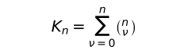\  Möglichkeiten.</td>
<td lang="en">With regard to the existence of *n* atomic facts there are \  possibilities.</td>
<td lang="en"><em>外部版本參照：</em> Ludwig Wittgenstein, Tractatus Logico-Philosophicus, trans. D. F. Pears and B. F. McGuinness, 2nd ed. (Routledge, 2001), ISBN 9780415254083.；命題 <code>4.27</code>；<a href="https://www.routledge.com/Tractatus-Logico-Philosophicus/Wittgenstein/p/book/9780415254083">來源</a></td>
<td lang="zh-Hant">針對 *n* 個事態的成立與不成立，共有 \ 種可能。 <small><strong>哲學解讀：</strong> 公式計數 *n* 個事態所有成立／不成立的組合，也就是邏輯空間中的 valuation 數量。</small></td>
</tr>
<tr id="segment-4-27-b">
<td lang="de">Es können alle Kombinationen der Sachverhalte bestehen, die andern nicht bestehen.</td>
<td lang="en">It is possible for all combinations of atomic facts to exist, and the others not to exist.</td>
<td lang="en"><em>外部版本參照：</em> Ludwig Wittgenstein, Tractatus Logico-Philosophicus, trans. D. F. Pears and B. F. McGuinness, 2nd ed. (Routledge, 2001), ISBN 9780415254083.；命題 <code>4.27</code>；<a href="https://www.routledge.com/Tractatus-Logico-Philosophicus/Wittgenstein/p/book/9780415254083">來源</a></td>
<td lang="zh-Hant">事態的所有組合都可能成立，而其他事態不成立。 <small><strong>哲學解讀：</strong> 每一組合都代表一種可能配置；某些事態成立時，其餘可不成立，尚未指定實際世界是哪一組。</small></td>
</tr>
<tr class="project-relations">
<td colspan="4">
<strong>Akashic 專案關係</strong>
<ul>
<li><code>not_applicable</code> — Akashic 目前不宣稱直接實作命題 4.27 的哲學主張。 <small>理由：此命題的具體內容是：每個事態的二種狀態組合成完整可能性空間；公式計數組合，並不預測哪個組合實際出現。 專案現有檔案、schema 與查詢行為不足以證成同一主張，硬套對應會誤導。</small>
</li>
</ul>
</td>
</tr>
<tr id="proposition-4-28">
<td colspan="4"><strong>4.28</strong></td>
</tr>
<tr id="segment-4-28-a">
<td lang="de">Diesen Kombinationen entsprechen ebenso viele Möglichkeiten der Wahrheit – und Falschheit – von *n* Elementarsätzen.</td>
<td lang="en">To these combinations correspond the same number of possibilities of the truth—and falsehood—of *n* elementary propositions.</td>
<td lang="en"><em>外部版本參照：</em> Ludwig Wittgenstein, Tractatus Logico-Philosophicus, trans. D. F. Pears and B. F. McGuinness, 2nd ed. (Routledge, 2001), ISBN 9780415254083.；命題 <code>4.28</code>；<a href="https://www.routledge.com/Tractatus-Logico-Philosophicus/Wittgenstein/p/book/9780415254083">來源</a></td>
<td lang="zh-Hant">這些組合對應於 *n* 個基本命題同樣多種真與假的可能。 <small><strong>哲學解讀：</strong> 事態成立模式與基本命題 valuation 一一對應；真值排列表示可能性，不是查詢結果的排列。</small></td>
</tr>
<tr class="project-relations">
<td colspan="4">
<strong>Akashic 專案關係</strong>
<ul>
<li><code>not_applicable</code> — Akashic 目前不宣稱直接實作命題 4.28 的哲學主張。 <small>理由：此命題的具體內容是：事態成立模式與基本命題 valuation 一一對應；真值排列表示可能性，不是查詢結果的排列。 專案現有檔案、schema 與查詢行為不足以證成同一主張，硬套對應會誤導。</small>
</li>
</ul>
</td>
</tr>
<tr id="proposition-4-3">
<td colspan="4"><strong>4.3</strong></td>
</tr>
<tr id="segment-4-3-a">
<td lang="de">Die Wahrheitsmöglichkeiten der Elementarsätze bedeuten die Möglichkeiten des Bestehens und Nichtbestehens der Sachverhalte.</td>
<td lang="en">The truth-possibilities of the elementary propositions mean the possibilities of the existence and non-existence of the atomic facts.</td>
<td lang="en"><em>外部版本參照：</em> Ludwig Wittgenstein, Tractatus Logico-Philosophicus, trans. D. F. Pears and B. F. McGuinness, 2nd ed. (Routledge, 2001), ISBN 9780415254083.；命題 <code>4.3</code>；<a href="https://www.routledge.com/Tractatus-Logico-Philosophicus/Wittgenstein/p/book/9780415254083">來源</a></td>
<td lang="zh-Hant">基本命題的真值可能，意指事態成立與不成立的可能。 <small><strong>哲學解讀：</strong> truth-possibility 透過命題結構表現世界可能如何；它不是系統執行成功或失敗的狀態碼。</small></td>
</tr>
<tr class="project-relations">
<td colspan="4">
<strong>Akashic 專案關係</strong>
<ul>
<li><code>not_applicable</code> — Akashic 目前不宣稱直接實作命題 4.3 的哲學主張。 <small>理由：此命題的具體內容是：truth-possibility 透過命題結構表現世界可能如何；它不是系統執行成功或失敗的狀態碼。 專案現有檔案、schema 與查詢行為不足以證成同一主張，硬套對應會誤導。</small>
</li>
</ul>
</td>
</tr>
<tr id="proposition-4-31">
<td colspan="4"><strong>4.31</strong></td>
</tr>
<tr id="segment-4-31-a">
<td lang="de">Die Wahrheitsmöglichkeiten können wir durch Schemata folgender Art darstellen („W“ bedeutet „wahr“, „F“, „falsch“.</td>
<td lang="en">The truth-possibilities can be presented by schemata of the following kind (“T” means “true”, “F” “false”.</td>
<td lang="en"><em>外部版本參照：</em> Ludwig Wittgenstein, Tractatus Logico-Philosophicus, trans. D. F. Pears and B. F. McGuinness, 2nd ed. (Routledge, 2001), ISBN 9780415254083.；命題 <code>4.31</code>；<a href="https://www.routledge.com/Tractatus-Logico-Philosophicus/Wittgenstein/p/book/9780415254083">來源</a></td>
<td lang="zh-Hant">我們可以用下列形式的表式呈現真值可能；德文以「W」表示「真」、英文以「T」表示「真」，「F」表示「假」。 <small><strong>哲學解讀：</strong> W／T 與 F 在此被明定為二值 valuation 標記，不是檢索命中、未知狀態或信心分數。</small></td>
</tr>
<tr id="segment-4-31-b">
<td lang="de">Die Reihen der „W“ und „F“ unter der Reihe der Elementarsätze bedeuten in leichtverständlicher Symbolik deren Wahrheitsmöglichkeiten):</td>
<td lang="en">The rows of T’s and F’s under the row of the elementary propositions mean their truth-possibilities in an easily intelligible symbolism).</td>
<td lang="en"><em>外部版本參照：</em> Ludwig Wittgenstein, Tractatus Logico-Philosophicus, trans. D. F. Pears and B. F. McGuinness, 2nd ed. (Routledge, 2001), ISBN 9780415254083.；命題 <code>4.31</code>；<a href="https://www.routledge.com/Tractatus-Logico-Philosophicus/Wittgenstein/p/book/9780415254083">來源</a></td>
<td lang="zh-Hant">基本命題下方各列符號，依一目了然的記法表示其真值可能。 <small><strong>哲學解讀：</strong> 每一列是一個完整可能配值；列出邏輯空間不等於選定哪一列實際成立。</small></td>
</tr>
<tr id="segment-4-31-c">
<td lang="de">|p |q |r | |---|---|---| |W|W|W | |F|W|W | |W|F|W | |W|W|F | |F|F|W | |F|W|F | |W|F|F | |F|F|F |</td>
<td lang="en">|p |q |r | |---|---|---| |T|T|T | |F|T|T | |T|F|T | |T|T|F | |F|F|T | |F|T|F | |T|F|F | |F|F|F |</td>
<td lang="en"><em>外部版本參照：</em> Ludwig Wittgenstein, Tractatus Logico-Philosophicus, trans. D. F. Pears and B. F. McGuinness, 2nd ed. (Routledge, 2001), ISBN 9780415254083.；命題 <code>4.31</code>；<a href="https://www.routledge.com/Tractatus-Logico-Philosophicus/Wittgenstein/p/book/9780415254083">來源</a></td>
<td lang="zh-Hant">第一張表完整列出三個基本命題 *p*、*q*、*r* 的八種真值排列。 <small><strong>哲學解讀：</strong> 三個二值命題產生八列可能配值；表格尚未挑選哪列是現實。</small></td>
</tr>
<tr id="segment-4-31-d">
<td lang="de">|p |q | |---|---| |W|W | |F|W | |W|F | |F|F |</td>
<td lang="en">|p |q | |---|---| |T|T | |F|T | |T|F | |F|F |</td>
<td lang="en"><em>外部版本參照：</em> Ludwig Wittgenstein, Tractatus Logico-Philosophicus, trans. D. F. Pears and B. F. McGuinness, 2nd ed. (Routledge, 2001), ISBN 9780415254083.；命題 <code>4.31</code>；<a href="https://www.routledge.com/Tractatus-Logico-Philosophicus/Wittgenstein/p/book/9780415254083">來源</a></td>
<td lang="zh-Hant">第二張表完整列出兩個基本命題 *p*、*q* 的四種真值排列。 <small><strong>哲學解讀：</strong> 減少一個基本命題後，可能配值縮為四列，顯示組合計數依命題數量而變。</small></td>
</tr>
<tr id="segment-4-31-e">
<td lang="de">|p | |---| |W | |F |</td>
<td lang="en">|p | |---| |T | |F |</td>
<td lang="en"><em>外部版本參照：</em> Ludwig Wittgenstein, Tractatus Logico-Philosophicus, trans. D. F. Pears and B. F. McGuinness, 2nd ed. (Routledge, 2001), ISBN 9780415254083.；命題 <code>4.31</code>；<a href="https://www.routledge.com/Tractatus-Logico-Philosophicus/Wittgenstein/p/book/9780415254083">來源</a></td>
<td lang="zh-Hant">第三張表列出單一基本命題 *p* 的真與假兩種可能。 <small><strong>哲學解讀：</strong> 最小 truth table 仍區分可能 valuation 與實際真值；列出兩列不表示兩者同時成立。</small></td>
</tr>
<tr class="project-relations">
<td colspan="4">
<strong>Akashic 專案關係</strong>
<ul>
<li><code>not_applicable</code> — Akashic 目前不宣稱直接實作命題 4.31 的哲學主張。 <small>理由：此命題的具體內容是：表格枚舉 valuation 空間：每列是一種可能配值，不是在宣稱其中某列為現實，也不能把 W／F 當搜尋命中／未命中。 專案現有檔案、schema 與查詢行為不足以證成同一主張，硬套對應會誤導。</small>
</li>
</ul>
</td>
</tr>
<tr id="proposition-4-4">
<td colspan="4"><strong>4.4</strong></td>
</tr>
<tr id="segment-4-4-a">
<td lang="de">Der Satz ist der Ausdruck der Übereinstimmung und Nichtübereinstimmung mit den Wahrheitsmöglichkeiten der Elementarsätze.</td>
<td lang="en">A proposition is the expression of agreement and disagreement with the truth-possibilities of the elementary propositions.</td>
<td lang="en"><em>外部版本參照：</em> Ludwig Wittgenstein, Tractatus Logico-Philosophicus, trans. D. F. Pears and B. F. McGuinness, 2nd ed. (Routledge, 2001), ISBN 9780415254083.；命題 <code>4.4</code>；<a href="https://www.routledge.com/Tractatus-Logico-Philosophicus/Wittgenstein/p/book/9780415254083">來源</a></td>
<td lang="zh-Hant">命題是它與基本命題真值可能相符合及不符合的表達。 <small><strong>哲學解讀：</strong> 一個命題由它選取哪些 valuation、排除哪些 valuation 來界定；這種選取就是其 truth-functional 內容。</small></td>
</tr>
<tr class="project-relations">
<td colspan="4">
<strong>Akashic 專案關係</strong>
<ul>
<li><code>not_applicable</code> — Akashic 目前不宣稱直接實作命題 4.4 的哲學主張。 <small>理由：此命題的具體內容是：一個命題由它選取哪些 valuation、排除哪些 valuation 來界定；這種選取就是其 truth-functional 內容。 專案現有檔案、schema 與查詢行為不足以證成同一主張，硬套對應會誤導。</small>
</li>
</ul>
</td>
</tr>
<tr id="proposition-4-41">
<td colspan="4"><strong>4.41</strong></td>
</tr>
<tr id="segment-4-41-a">
<td lang="de">Die Wahrheitsmöglichkeiten der Elementarsätze sind die Bedingungen der Wahrheit und Falschheit der Sätze.</td>
<td lang="en">The truth-possibilities of the elementary propositions are the conditions of the truth and falsehood of the propositions.</td>
<td lang="en"><em>外部版本參照：</em> Ludwig Wittgenstein, Tractatus Logico-Philosophicus, trans. D. F. Pears and B. F. McGuinness, 2nd ed. (Routledge, 2001), ISBN 9780415254083.；命題 <code>4.41</code>；<a href="https://www.routledge.com/Tractatus-Logico-Philosophicus/Wittgenstein/p/book/9780415254083">來源</a></td>
<td lang="zh-Hant">基本命題的真值可能，是其他命題為真與為假的條件。 <small><strong>哲學解讀：</strong> 複合命題的 truth condition 由基本命題 valuation 決定；這不是查詢命中條件或程式成功條件。</small></td>
</tr>
<tr class="project-relations">
<td colspan="4">
<strong>Akashic 專案關係</strong>
<ul>
<li><code>intentional_nonconformance</code> / <code>declared_nonconformance</code> — Akashic 刻意不把搜尋命中或作者認可標記當成 proposition 的 truth condition。 <small>理由：複合命題的 truth condition 由基本命題 valuation 決定；這不是查詢命中條件或程式成功條件。 現況文件因此把 retrieval、館藏裁決與 world-relative valuation 分開。</small>
<ul>
<li><code>docs/explainers/why-akashic-is-not-just-google.md</code>（heading：<code>## 3. 最簡單的反例：搜尋到一個句子，不等於句子是真的</code>）— 此節明確證明可搜尋與被收錄不等於句子為真。</li>
</ul>
</li>
</ul>
</td>
</tr>
<tr id="proposition-4-411">
<td colspan="4"><strong>4.411</strong></td>
</tr>
<tr id="segment-4-411-a">
<td lang="de">Es ist von vornherein wahrscheinlich, dass die Einführung der Elementarsätze für das Verständnis aller anderen Satzarten grundlegend ist.</td>
<td lang="en">It seems probable even at first sight that the introduction of the elementary propositions is fundamental for the comprehension of the other kinds of propositions.</td>
<td lang="en"><em>外部版本參照：</em> Ludwig Wittgenstein, Tractatus Logico-Philosophicus, trans. D. F. Pears and B. F. McGuinness, 2nd ed. (Routledge, 2001), ISBN 9780415254083.；命題 <code>4.411</code>；<a href="https://www.routledge.com/Tractatus-Logico-Philosophicus/Wittgenstein/p/book/9780415254083">來源</a></td>
<td lang="zh-Hant">乍看便很可能如此：引入基本命題，是理解其他所有命題種類的基礎。 <small><strong>哲學解讀：</strong> 理解複合命題以基本命題為底，因為真值運算最終作用於這些最小描述單位。</small></td>
</tr>
<tr id="segment-4-411-b">
<td lang="de">Ja, das Verständnis der allgemeinen Sätze hängt *fühlbar* von dem der Elementarsätze ab.</td>
<td lang="en">Indeed the comprehension of the general propositions depends *palpably* on that of the elementary propositions.</td>
<td lang="en"><em>外部版本參照：</em> Ludwig Wittgenstein, Tractatus Logico-Philosophicus, trans. D. F. Pears and B. F. McGuinness, 2nd ed. (Routledge, 2001), ISBN 9780415254083.；命題 <code>4.411</code>；<a href="https://www.routledge.com/Tractatus-Logico-Philosophicus/Wittgenstein/p/book/9780415254083">來源</a></td>
<td lang="zh-Hant">確實，一般命題的理解明顯依賴於基本命題的理解。 <small><strong>哲學解讀：</strong> 一般命題量化或組合基本命題的可能性，因此其 sense 依賴先懂基本命題如何表現事態。</small></td>
</tr>
<tr class="project-relations">
<td colspan="4">
<strong>Akashic 專案關係</strong>
<ul>
<li><code>not_applicable</code> — Akashic 目前不宣稱直接實作命題 4.411 的哲學主張。 <small>理由：此命題的具體內容是：一般與複合命題的語意不能懸空；它們如何為真最終須回到基本命題可能的真值配置。 專案現有檔案、schema 與查詢行為不足以證成同一主張，硬套對應會誤導。</small>
</li>
</ul>
</td>
</tr>
<tr id="proposition-4-42">
<td colspan="4"><strong>4.42</strong></td>
</tr>
<tr id="segment-4-42-a">
<td lang="de">Bezüglich der Übereinstimmung und Nichtübereinstimmung eines Satzes mit den Wahrheitsmöglichkeiten von *n* Elementarsätzen gibt es 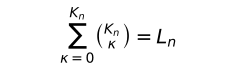\  Möglichkeiten.</td>
<td lang="en">With regard to the agreement and disagreement of a proposition with the truth-possibilities of *n* elementary propositions there are \  possibilities.</td>
<td lang="en"><em>外部版本參照：</em> Ludwig Wittgenstein, Tractatus Logico-Philosophicus, trans. D. F. Pears and B. F. McGuinness, 2nd ed. (Routledge, 2001), ISBN 9780415254083.；命題 <code>4.42</code>；<a href="https://www.routledge.com/Tractatus-Logico-Philosophicus/Wittgenstein/p/book/9780415254083">來源</a></td>
<td lang="zh-Hant">就一個命題與 *n* 個基本命題之真值可能相符合或不符合而言，共有 \ 種可能。 <small><strong>哲學解讀：</strong> 每個命題可從 K_n 列 valuation 中任選接受集合，因此共有 L_n 種 truth condition；公式計數形式可能，不作經驗預測。</small></td>
</tr>
<tr class="project-relations">
<td colspan="4">
<strong>Akashic 專案關係</strong>
<ul>
<li><code>not_applicable</code> — Akashic 目前不宣稱直接實作命題 4.42 的哲學主張。 <small>理由：此命題的具體內容是：每個命題可從 K_n 列 valuation 中任選接受集合，因此共有 L_n 種 truth condition；公式計數形式可能，不作經驗預測。 專案現有檔案、schema 與查詢行為不足以證成同一主張，硬套對應會誤導。</small>
</li>
</ul>
</td>
</tr>
<tr id="proposition-4-43">
<td colspan="4"><strong>4.43</strong></td>
</tr>
<tr id="segment-4-43-a">
<td lang="de">Die Übereinstimmung mit den Wahrheitsmöglichkeiten können wir dadurch ausdrücken, indem wir ihnen im Schema etwa das Abzeichen „W“ (wahr) zuordnen.</td>
<td lang="en">Agreement with the truth-possibilities can be expressed by co-ordinating with them in the schema the mark “T” (true).</td>
<td lang="en"><em>外部版本參照：</em> Ludwig Wittgenstein, Tractatus Logico-Philosophicus, trans. D. F. Pears and B. F. McGuinness, 2nd ed. (Routledge, 2001), ISBN 9780415254083.；命題 <code>4.43</code>；<a href="https://www.routledge.com/Tractatus-Logico-Philosophicus/Wittgenstein/p/book/9780415254083">來源</a></td>
<td lang="zh-Hant">我們可在表式中，替相符的真值可能配置「W」（真）標記，以表達相符關係。 <small><strong>哲學解讀：</strong> W 標記選出命題在哪些基本 valuation 下相符，藉此把 truth condition 寫入表式。</small></td>
</tr>
<tr id="segment-4-43-b">
<td lang="de">Das Fehlen dieses Abzeichens bedeutet die Nichtübereinstimmung.</td>
<td lang="en">Absence of this mark means disagreement.</td>
<td lang="en"><em>外部版本參照：</em> Ludwig Wittgenstein, Tractatus Logico-Philosophicus, trans. D. F. Pears and B. F. McGuinness, 2nd ed. (Routledge, 2001), ISBN 9780415254083.；命題 <code>4.43</code>；<a href="https://www.routledge.com/Tractatus-Logico-Philosophicus/Wittgenstein/p/book/9780415254083">來源</a></td>
<td lang="zh-Hant">沒有這項標記就表示不相符。 <small><strong>哲學解讀：</strong> 空白位置表示該 valuation 不滿足命題；它不是未知值，也不是資料缺漏。</small></td>
</tr>
<tr class="project-relations">
<td colspan="4">
<strong>Akashic 專案關係</strong>
<ul>
<li><code>not_applicable</code> — Akashic 目前不宣稱直接實作命題 4.43 的哲學主張。 <small>理由：此命題的具體內容是：標記只編碼某命題接受哪些 valuation；W 的缺席是 truth table 內的排除，不是資料庫沒有紀錄。 專案現有檔案、schema 與查詢行為不足以證成同一主張，硬套對應會誤導。</small>
</li>
</ul>
</td>
</tr>
<tr id="proposition-4-431">
<td colspan="4"><strong>4.431</strong></td>
</tr>
<tr id="segment-4-431-a">
<td lang="de">Der Ausdruck der Übereinstimmung und Nichtübereinstimmung mit den Wahrheitsmöglichkeiten der Elementarsätze drückt die Wahrheitsbedingungen des Satzes aus.</td>
<td lang="en">The expression of the agreement and disagreement with the truth-possibilities of the elementary-propositions expresses the truth-conditions of the proposition.</td>
<td lang="en"><em>外部版本參照：</em> Ludwig Wittgenstein, Tractatus Logico-Philosophicus, trans. D. F. Pears and B. F. McGuinness, 2nd ed. (Routledge, 2001), ISBN 9780415254083.；命題 <code>4.431</code>；<a href="https://www.routledge.com/Tractatus-Logico-Philosophicus/Wittgenstein/p/book/9780415254083">來源</a></td>
<td lang="zh-Hant">表達與基本命題真值可能的相符與不相符，就是表達命題的真值條件。 <small><strong>哲學解讀：</strong> 一個命題接受與拒絕哪些基本 valuation，合起來就是其完整 truth condition。</small></td>
</tr>
<tr id="segment-4-431-b">
<td lang="de">Der Satz ist der Ausdruck seiner Wahrheitsbedingungen.</td>
<td lang="en">The proposition is the expression of its truth-conditions.</td>
<td lang="en"><em>外部版本參照：</em> Ludwig Wittgenstein, Tractatus Logico-Philosophicus, trans. D. F. Pears and B. F. McGuinness, 2nd ed. (Routledge, 2001), ISBN 9780415254083.；命題 <code>4.431</code>；<a href="https://www.routledge.com/Tractatus-Logico-Philosophicus/Wittgenstein/p/book/9780415254083">來源</a></td>
<td lang="zh-Hant">命題是其真值條件的表達。 <small><strong>哲學解讀：</strong> 命題的 sense 由 truth condition 表達；它不是查詢結果、信心分數或單一當前真值。</small></td>
</tr>
<tr id="segment-4-431-c">
<td lang="de">\(Frege hat sie daher ganz richtig als Erklärung der Zeichen seiner Begriffsschrift vorausgeschickt.</td>
<td lang="en">\(Frege has therefore quite rightly put them at the beginning, as explaining the signs of his logical symbolism.</td>
<td lang="en"><em>外部版本參照：</em> Ludwig Wittgenstein, Tractatus Logico-Philosophicus, trans. D. F. Pears and B. F. McGuinness, 2nd ed. (Routledge, 2001), ISBN 9780415254083.；命題 <code>4.431</code>；<a href="https://www.routledge.com/Tractatus-Logico-Philosophicus/Wittgenstein/p/book/9780415254083">來源</a></td>
<td lang="zh-Hant">（因此弗雷格把真值條件置於概念文字符號之前作說明，這點相當正確。 <small><strong>哲學解讀：</strong> 先交代 truth condition，才能使後續符號有確定 sense；這項方法論次序是弗雷格的正確處。</small></td>
</tr>
<tr id="segment-4-431-d">
<td lang="de">Nur ist die Erklärung des Wahrheitsbegriffes bei Frege falsch: Wären „das Wahre“ und „das Falsche“ wirklich Gegenstände und die Argumente in ∼*p* etc. dann wäre nach Frege’s Bestimmung der Sinn von „∼*p*“ keineswegs bestimmt.)</td>
<td lang="en">Only Frege’s explanation of the truth-concept is false: if “the true” and “the false” were real objects and the arguments in \~*p* etc., then the sense of \~*p* would by no means be determined by Frege’s determination.)</td>
<td lang="en"><em>外部版本參照：</em> Ludwig Wittgenstein, Tractatus Logico-Philosophicus, trans. D. F. Pears and B. F. McGuinness, 2nd ed. (Routledge, 2001), ISBN 9780415254083.；命題 <code>4.431</code>；<a href="https://www.routledge.com/Tractatus-Logico-Philosophicus/Wittgenstein/p/book/9780415254083">來源</a></td>
<td lang="zh-Hant">但他的真理概念說明錯誤：若「真者」「假者」真是物件，又是 ∼*p* 等式的論元，那麼依他的規定，∼*p* 的意義仍未獲得決定。） <small><strong>哲學解讀：</strong> 把真、假當物件無法解釋否定如何改變 truth condition；指到某個真值物件不足以決定 ∼*p* 的 sense。</small></td>
</tr>
<tr class="project-relations">
<td colspan="4">
<strong>Akashic 專案關係</strong>
<ul>
<li><code>partial</code> / <code>semantic_operation</code> — Akashic 已把 authored 的窄幅 truth conditions 寫成 bounded atom／not expression：resolved identity 為 holds、canonical witnessed exclusion 為 fails、其餘保留 undetermined，且 recursive trace 顯示每層否定如何由 operand truth 導出。 <small>理由：4.431 把命題視為其完整 truth conditions 的表達。現行 evaluator 已直接表達一個 atomic predicate 的正負條件與 unary negation，並避免把資料缺席混同於 truth-table 排除；然而它沒有多原子 binary operators、完整 truth-possibility table、normalization 或 truth-condition equivalence，因此不能宣稱完整實作。</small>
<ul>
<li><code>docs/explainers/why-akashic-is-not-just-google.md</code>（heading：<code>## 3. 最簡單的反例：搜尋到一個句子，不等於句子是真的</code>）— 此節明確證明可搜尋與被收錄不等於句子為真。</li>
<li><code>Sources/AkashicProposition/Projection.swift</code>（symbol：<code>TruthValue</code>）— `TruthValue` 明列 holds、fails 與 undetermined。</li>
<li><code>Sources/AkashicProposition/Projection.swift</code>（symbol：<code>evaluate</code>）— `evaluate(in:)` 對 validated atom／not expression 執行 model-relative 求值並逐層建立 trace。</li>
<li><code>Sources/AkashicProposition/Expression.swift</code>（symbol：<code>PropositionExpression</code>）— `PropositionExpression` 是唯一 formula 型別，現階段明列 atom 與 bounded not。</li>
<li><code>Tests/AkashicPropositionTests/PropositionTests.swift</code>（test：<code>testSupportingEvidenceHolds</code>）— 測試確認 model 的正面作者配置可使 authored 求值為 holds。</li>
<li><code>Tests/AkashicPropositionTests/PropositionTests.swift</code>（test：<code>testAbsenceIsUndeterminedNotFalse</code>）— 測試確認缺少支持資料時維持 undetermined，而非推論為假。</li>
<li><code>Tests/AkashicPropositionTests/AuthorshipCompletenessPropositionTests.swift</code>（test：<code>testAuthoredUsesFixedOpenWorldPrecedence</code>）— 測試釘住 positive、unresolved 與 canonical witnessed negative 三類 truth condition 的優先序。</li>
<li><code>Tests/AkashicPropositionTests/NegationTests.swift</code>（test：<code>testDoubleNegationKeepsTwoTraceNodesButRestoresTruth</code>）— 測試確認兩層否定不被結構化簡，但求值依 truth condition 恢復原 truth。</li>
</ul>
</li>
</ul>
<strong>歷史脈絡</strong>
<ul>
<li><code>commit</code> <code>e16c6f6e6d77f7cfe7e9d66323aecb174917872c</code> — <code>revised</code>：e16c6f6 新增 authored 的明示成立條件，但沒有完整真值條件演算，故由 nonconformance 修訂為 partial。</li>
<li><code>issue</code> <code>https://github.com/PsychQuant/Akashic-Library/issues/204</code> — <code>retained</code>：完整真值函數組合、truth table 與 truth-condition equivalence 由此 issue 追蹤。</li>
</ul>
</td>
</tr>
<tr id="proposition-4-44">
<td colspan="4"><strong>4.44</strong></td>
</tr>
<tr id="segment-4-44-a">
<td lang="de">Das Zeichen, welches durch die Zuordnung jener Abzeichen „W“ und der Wahrheitsmöglichkeiten entsteht, ist ein Satzzeichen.</td>
<td lang="en">The sign which arises from the co-ordination of that mark “T” with the truth-possibilities is a propositional sign.</td>
<td lang="en"><em>外部版本參照：</em> Ludwig Wittgenstein, Tractatus Logico-Philosophicus, trans. D. F. Pears and B. F. McGuinness, 2nd ed. (Routledge, 2001), ISBN 9780415254083.；命題 <code>4.44</code>；<a href="https://www.routledge.com/Tractatus-Logico-Philosophicus/Wittgenstein/p/book/9780415254083">來源</a></td>
<td lang="zh-Hant">把「W」標記配置到那些真值可能後形成的符號，就是命題符號。 <small><strong>哲學解讀：</strong> truth table 的最後標記欄可把一組真值條件編碼成命題符號；符號不是表格以外另一個真值物件。</small></td>
</tr>
<tr class="project-relations">
<td colspan="4">
<strong>Akashic 專案關係</strong>
<ul>
<li><code>not_applicable</code> — Akashic 目前不宣稱直接實作命題 4.44 的哲學主張。 <small>理由：此命題的具體內容是：truth table 的最後標記欄可把一組真值條件編碼成命題符號；符號不是表格以外另一個真值物件。 專案現有檔案、schema 與查詢行為不足以證成同一主張，硬套對應會誤導。</small>
</li>
</ul>
</td>
</tr>
<tr id="proposition-4-441">
<td colspan="4"><strong>4.441</strong></td>
</tr>
<tr id="segment-4-441-a">
<td lang="de">Es ist klar, dass dem Komplex der Zeichen „F“ und „W“ kein Gegenstand (oder Komplex von Gegenständen) entspricht; so wenig, wie den horizontalen und vertikalen Strichen oder den Klammern.</td>
<td lang="en">It is clear that to the complex of the signs “F” and “T” no object (or complex of objects) corresponds; any more than to horizontal and vertical lines or to brackets.</td>
<td lang="en"><em>外部版本參照：</em> Ludwig Wittgenstein, Tractatus Logico-Philosophicus, trans. D. F. Pears and B. F. McGuinness, 2nd ed. (Routledge, 2001), ISBN 9780415254083.；命題 <code>4.441</code>；<a href="https://www.routledge.com/Tractatus-Logico-Philosophicus/Wittgenstein/p/book/9780415254083">來源</a></td>
<td lang="zh-Hant">很清楚，符號「F」與「W」的複合不對應任何物件（或物件複合），正如水平線、垂直線與括號也不對應物件。 <small><strong>哲學解讀：</strong> F、W、線條與括號的功能來自表式規則，無須在世界中替每個記號尋找對應物。</small></td>
</tr>
<tr id="segment-4-441-b">
<td lang="de">– „Logische Gegenstände“ gibt es nicht.</td>
<td lang="en">There are no “logical objects”.</td>
<td lang="en"><em>外部版本參照：</em> Ludwig Wittgenstein, Tractatus Logico-Philosophicus, trans. D. F. Pears and B. F. McGuinness, 2nd ed. (Routledge, 2001), ISBN 9780415254083.；命題 <code>4.441</code>；<a href="https://www.routledge.com/Tractatus-Logico-Philosophicus/Wittgenstein/p/book/9780415254083">來源</a></td>
<td lang="zh-Hant">不存在「邏輯物件」。 <small><strong>哲學解讀：</strong> 否認「邏輯物件」是要阻止把運算記號的角色誤作另一類實體。</small></td>
</tr>
<tr id="segment-4-441-c">
<td lang="de">Analoges gilt natürlich für alle Zeichen, die dasselbe ausdrücken wie die Schemata der „W“ und „F“.</td>
<td lang="en">Something analogous holds of course for all signs, which express the same as the schemata of “T” and “F”.</td>
<td lang="en"><em>外部版本參照：</em> Ludwig Wittgenstein, Tractatus Logico-Philosophicus, trans. D. F. Pears and B. F. McGuinness, 2nd ed. (Routledge, 2001), ISBN 9780415254083.；命題 <code>4.441</code>；<a href="https://www.routledge.com/Tractatus-Logico-Philosophicus/Wittgenstein/p/book/9780415254083">來源</a></td>
<td lang="zh-Hant">所有與 W／F 表式表達相同內容的符號，情形當然也一樣。 <small><strong>哲學解讀：</strong> 凡與真值表達式等價的記法都一樣靠形式運作，不因換符號就產生新的邏輯物件。</small></td>
</tr>
<tr class="project-relations">
<td colspan="4">
<strong>Akashic 專案關係</strong>
<ul>
<li><code>not_applicable</code> — Akashic 目前不宣稱直接實作命題 4.441 的哲學主張。 <small>理由：此命題的具體內容是：邏輯記號的角色由運算與排列方式決定，不必假設世界中有 W、F、括號等對應物來充當其意義。 專案現有檔案、schema 與查詢行為不足以證成同一主張，硬套對應會誤導。</small>
</li>
</ul>
</td>
</tr>
<tr id="proposition-4-442">
<td colspan="4"><strong>4.442</strong></td>
</tr>
<tr id="segment-4-442-a">
<td lang="de">Es ist z. B.:  „  |p |q | | |---|---|---| |W|W |W | |F|W |W | |W|F | | |F|F |W |  “  ein Satzzeichen.</td>
<td lang="en">Thus e.g.  “  |p |q | | |---|---|---| |T|T |T | |F|T |T | |T|F | | |F|F |T |  ”  is a propositional sign.</td>
<td lang="en"><em>外部版本參照：</em> Ludwig Wittgenstein, Tractatus Logico-Philosophicus, trans. D. F. Pears and B. F. McGuinness, 2nd ed. (Routledge, 2001), ISBN 9780415254083.；命題 <code>4.442</code>；<a href="https://www.routledge.com/Tractatus-Logico-Philosophicus/Wittgenstein/p/book/9780415254083">來源</a></td>
<td lang="zh-Hant">例如，所列 W／F（英文 T／F）表格就是一個命題符號。 <small><strong>哲學解讀：</strong> 真值表的整體配置可充當命題符號；表格不是查詢結果清單，而是給出哪些 valuation 被接受。</small></td>
</tr>
<tr id="segment-4-442-b">
<td lang="de">Frege’s „Urteilsstrich“ „\ “ ist logisch ganz bedeutungslos; er zeigt bei Frege (und Russell) nur an, dass diese Autoren die so bezeichneten Sätze für wahr halten.</td>
<td lang="en">\(Frege’s assertion sign “\ ” is logically altogether meaningless; in Frege (and Russell) it only shows that these authors hold as true the propositions marked in this way.</td>
<td lang="en"><em>外部版本參照：</em> Ludwig Wittgenstein, Tractatus Logico-Philosophicus, trans. D. F. Pears and B. F. McGuinness, 2nd ed. (Routledge, 2001), ISBN 9780415254083.；命題 <code>4.442</code>；<a href="https://www.routledge.com/Tractatus-Logico-Philosophicus/Wittgenstein/p/book/9780415254083">來源</a></td>
<td lang="zh-Hant">弗雷格的「判斷線」⊢ 在邏輯上完全沒有意義；對弗雷格與羅素而言，它只顯示作者把所標命題視為真。 <small><strong>哲學解讀：</strong> 判斷線記錄作者的認可態度，屬於後設標註，不參與命題的 truth condition。</small></td>
</tr>
<tr id="segment-4-442-c">
<td lang="de">„\ “ gehört daher ebenso wenig zum Satzgefüge, wie etwa die Nummer des Satzes.</td>
<td lang="en">“\ ” belongs therefore to the propositions no more than does the number of the proposition.</td>
<td lang="en"><em>外部版本參照：</em> Ludwig Wittgenstein, Tractatus Logico-Philosophicus, trans. D. F. Pears and B. F. McGuinness, 2nd ed. (Routledge, 2001), ISBN 9780415254083.；命題 <code>4.442</code>；<a href="https://www.routledge.com/Tractatus-Logico-Philosophicus/Wittgenstein/p/book/9780415254083">來源</a></td>
<td lang="zh-Hant">⊢ 不屬於命題結構，正如命題編號也不屬於。 <small><strong>哲學解讀：</strong> 認可記號與編號都可在不改變 sense 下移除，因此不能算命題結構的一部分。</small></td>
</tr>
<tr id="segment-4-442-d">
<td lang="de">Ein Satz kann unmöglich von sich selbst aussagen, dass er wahr ist.)</td>
<td lang="en">A proposition cannot possibly assert of itself that it is true.)</td>
<td lang="en"><em>外部版本參照：</em> Ludwig Wittgenstein, Tractatus Logico-Philosophicus, trans. D. F. Pears and B. F. McGuinness, 2nd ed. (Routledge, 2001), ISBN 9780415254083.；命題 <code>4.442</code>；<a href="https://www.routledge.com/Tractatus-Logico-Philosophicus/Wittgenstein/p/book/9780415254083">來源</a></td>
<td lang="zh-Hant">命題不可能斷言自己為真。 <small><strong>哲學解讀：</strong> 自我認可會混淆命題內容與對內容的後設評價；真不能由命題替自己貼標籤取得。</small></td>
</tr>
<tr id="segment-4-442-e">
<td lang="de">Ist die Reihenfolge der Wahrheitsmöglichkeiten im Schema durch eine Kombinationsregel ein für allemal festgesetzt, dann ist die letzte Kolonne allein schon ein Ausdruck der Wahrheitsbedingungen.</td>
<td lang="en">If the sequence of the truth-possibilities in the schema is once for all determined by a rule of combination, then the last column is by itself an expression of the truth-conditions.</td>
<td lang="en"><em>外部版本參照：</em> Ludwig Wittgenstein, Tractatus Logico-Philosophicus, trans. D. F. Pears and B. F. McGuinness, 2nd ed. (Routledge, 2001), ISBN 9780415254083.；命題 <code>4.442</code>；<a href="https://www.routledge.com/Tractatus-Logico-Philosophicus/Wittgenstein/p/book/9780415254083">來源</a></td>
<td lang="zh-Hant">若表式中真值可能的次序已由組合規則固定，最後一欄本身就表達真值條件。 <small><strong>哲學解讀：</strong> 固定 valuation 列次序後，末欄直接指定哪些情形被接受，因而已足以給出完整 truth condition。</small></td>
</tr>
<tr id="segment-4-442-f">
<td lang="de">Schreiben wir diese Kolonne als Reihe hin, so wird das Satzzeichen zu: „(WW–W)(*p*, *q*)“ oder deutlicher „(WWFW)(*p*, *q*)“.</td>
<td lang="en">If we write this column as a row the propositional sign becomes: “(TT–T) (*p*, *q*)” or more plainly: “(TTFT) (*p*, *q*)”.</td>
<td lang="en"><em>外部版本參照：</em> Ludwig Wittgenstein, Tractatus Logico-Philosophicus, trans. D. F. Pears and B. F. McGuinness, 2nd ed. (Routledge, 2001), ISBN 9780415254083.；命題 <code>4.442</code>；<a href="https://www.routledge.com/Tractatus-Logico-Philosophicus/Wittgenstein/p/book/9780415254083">來源</a></td>
<td lang="zh-Hant">把該欄寫成一列，命題符號就成為德文的「(WW–W)(*p*, *q*)」／「(WWFW)(*p*, *q*)」，英文相應為「(TT–T)(*p*, *q*)」／「(TTFT)(*p*, *q*)」。 <small><strong>哲學解讀：</strong> 把真值欄壓成序列只是等價記法；W／F 與 T／F 的字母差異不改變所選 valuation。</small></td>
</tr>
<tr id="segment-4-442-g">
<td lang="de">\(Die Anzahl der Stellen in der linken Klammer ist durch die Anzahl der Glieder in der rechten bestimmt.)</td>
<td lang="en">\(The number of places in the left-hand bracket is determined by the number of terms in the right-hand bracket.)</td>
<td lang="en"><em>外部版本參照：</em> Ludwig Wittgenstein, Tractatus Logico-Philosophicus, trans. D. F. Pears and B. F. McGuinness, 2nd ed. (Routledge, 2001), ISBN 9780415254083.；命題 <code>4.442</code>；<a href="https://www.routledge.com/Tractatus-Logico-Philosophicus/Wittgenstein/p/book/9780415254083">來源</a></td>
<td lang="zh-Hant">（左括號位置數由右括號項目數決定。） <small><strong>哲學解讀：</strong> 括號兩側的元數互相制約，表示縮寫仍須遵守可檢查的組合規則。</small></td>
</tr>
<tr class="project-relations">
<td colspan="4">
<strong>Akashic 專案關係</strong>
<ul>
<li><code>intentional_nonconformance</code> / <code>declared_nonconformance</code> — Akashic 刻意不把搜尋命中或作者認可標記當成 proposition 的 truth condition。 <small>理由：真值欄可壓縮成命題符號；作者的認可標記與命題編號只是後設標註，不會使命題為真，也不是命題 sense 的構成部分。 現況文件因此把 retrieval、館藏裁決與 world-relative valuation 分開。</small>
<ul>
<li><code>docs/explainers/why-akashic-is-not-just-google.md</code>（heading：<code>## 3. 最簡單的反例：搜尋到一個句子，不等於句子是真的</code>）— 此節明確證明可搜尋與被收錄不等於句子為真。</li>
</ul>
</li>
</ul>
</td>
</tr>
<tr id="proposition-4-45">
<td colspan="4"><strong>4.45</strong></td>
</tr>
<tr id="segment-4-45-a">
<td lang="de">Für *n* Elementarsätze gibt es *L~n~* mögliche Gruppen von Wahrheitsbedingungen.</td>
<td lang="en">For *n* elementary propositions there are *L~n~* possible groups of truth-conditions.</td>
<td lang="en"><em>外部版本參照：</em> Ludwig Wittgenstein, Tractatus Logico-Philosophicus, trans. D. F. Pears and B. F. McGuinness, 2nd ed. (Routledge, 2001), ISBN 9780415254083.；命題 <code>4.45</code>；<a href="https://www.routledge.com/Tractatus-Logico-Philosophicus/Wittgenstein/p/book/9780415254083">來源</a></td>
<td lang="zh-Hant">對 *n* 個基本命題，共有 *L~n~* 組可能的真值條件。 <small><strong>哲學解讀：</strong> *L~n~* 計數的是對 *n* 個基本命題可指定的所有 truth-condition 集合，不是實際資料筆數。</small></td>
</tr>
<tr id="segment-4-45-b">
<td lang="de">Die Gruppen von Wahrheitsbedingungen, welche zu den Wahrheitsmöglichkeiten einer Anzahl von Elementarsätzen gehören, lassen sich in eine Reihe ordnen.</td>
<td lang="en">The groups of truth-conditions which belong to the truth-possibilities of a number of elementary propositions can be ordered in a series.</td>
<td lang="en"><em>外部版本參照：</em> Ludwig Wittgenstein, Tractatus Logico-Philosophicus, trans. D. F. Pears and B. F. McGuinness, 2nd ed. (Routledge, 2001), ISBN 9780415254083.；命題 <code>4.45</code>；<a href="https://www.routledge.com/Tractatus-Logico-Philosophicus/Wittgenstein/p/book/9780415254083">來源</a></td>
<td lang="zh-Hant">屬於一組基本命題真值可能的各組真值條件，可以排列成序列。 <small><strong>哲學解讀：</strong> 把各組 truth condition 排成序列，使不同命題形式能依其接受的 valuation 系統比較。</small></td>
</tr>
<tr class="project-relations">
<td colspan="4">
<strong>Akashic 專案關係</strong>
<ul>
<li><code>not_applicable</code> — Akashic 目前不宣稱直接實作命題 4.45 的哲學主張。 <small>理由：此命題的具體內容是：真值條件本身形成可枚舉的形式空間；排列順序是表現規約，不改變每組接受哪些 valuation。 專案現有檔案、schema 與查詢行為不足以證成同一主張，硬套對應會誤導。</small>
</li>
</ul>
</td>
</tr>
<tr id="proposition-4-46">
<td colspan="4"><strong>4.46</strong></td>
</tr>
<tr id="segment-4-46-a">
<td lang="de">Unter den möglichen Gruppen von Wahrheitsbedingungen gibt es zwei extreme Fälle.</td>
<td lang="en">Among the possible groups of truth-conditions there are two extreme cases.</td>
<td lang="en"><em>外部版本參照：</em> Ludwig Wittgenstein, Tractatus Logico-Philosophicus, trans. D. F. Pears and B. F. McGuinness, 2nd ed. (Routledge, 2001), ISBN 9780415254083.；命題 <code>4.46</code>；<a href="https://www.routledge.com/Tractatus-Logico-Philosophicus/Wittgenstein/p/book/9780415254083">來源</a></td>
<td lang="zh-Hant">可能的真值條件組中有兩個極端情形。 <small><strong>哲學解讀：</strong> 兩個極端位於所有可能 truth-condition 集合的兩端：全接受與全拒絕。</small></td>
</tr>
<tr id="segment-4-46-b">
<td lang="de">In dem einen Fall ist der Satz für sämtliche Wahrheitsmöglichkeiten der Elementarsätze wahr.</td>
<td lang="en">In the one case the proposition is true for all the truth-possibilities of the elementary propositions.</td>
<td lang="en"><em>外部版本參照：</em> Ludwig Wittgenstein, Tractatus Logico-Philosophicus, trans. D. F. Pears and B. F. McGuinness, 2nd ed. (Routledge, 2001), ISBN 9780415254083.；命題 <code>4.46</code>；<a href="https://www.routledge.com/Tractatus-Logico-Philosophicus/Wittgenstein/p/book/9780415254083">來源</a></td>
<td lang="zh-Hant">一種情形下，命題對基本命題的全部真值可能都為真。 <small><strong>哲學解讀：</strong> 若每一個基本 valuation 都滿足命題，世界如何變動都不會使它為假。</small></td>
</tr>
<tr id="segment-4-46-c">
<td lang="de">Wir sagen, die Wahrheitsbedingungen sind *tautologisch*.</td>
<td lang="en">We say that the truth-conditions are *tautological*.</td>
<td lang="en"><em>外部版本參照：</em> Ludwig Wittgenstein, Tractatus Logico-Philosophicus, trans. D. F. Pears and B. F. McGuinness, 2nd ed. (Routledge, 2001), ISBN 9780415254083.；命題 <code>4.46</code>；<a href="https://www.routledge.com/Tractatus-Logico-Philosophicus/Wittgenstein/p/book/9780415254083">來源</a></td>
<td lang="zh-Hant">我們稱這種真值條件為恆真。 <small><strong>哲學解讀：</strong> 「恆真」描述全接受的 truth-condition 形狀，不是對某項內容給予特別高的可信度。</small></td>
</tr>
<tr id="segment-4-46-d">
<td lang="de">Im zweiten Fall ist der Satz für sämtliche Wahrheitsmöglichkeiten falsch: Die Wahrheitsbedingungen sind *kontradiktorisch*.</td>
<td lang="en">In the second case the proposition is false for all the truth-possibilities. The truth-conditions are *self-contradictory*.</td>
<td lang="en"><em>外部版本參照：</em> Ludwig Wittgenstein, Tractatus Logico-Philosophicus, trans. D. F. Pears and B. F. McGuinness, 2nd ed. (Routledge, 2001), ISBN 9780415254083.；命題 <code>4.46</code>；<a href="https://www.routledge.com/Tractatus-Logico-Philosophicus/Wittgenstein/p/book/9780415254083">來源</a></td>
<td lang="zh-Hant">另一種情形下，命題對全部真值可能都為假；這種真值條件是矛盾的。 <small><strong>哲學解讀：</strong> 若沒有任何 valuation 滿足命題，其 truth condition 自我矛盾；這也不是單次查詢回傳 false。</small></td>
</tr>
<tr id="segment-4-46-e">
<td lang="de">Im ersten Fall nennen wir den Satz eine Tautologie, im zweiten Fall eine Kontradiktion.</td>
<td lang="en">In the first case we call the proposition a tautology, in the second case a contradiction.</td>
<td lang="en"><em>外部版本參照：</em> Ludwig Wittgenstein, Tractatus Logico-Philosophicus, trans. D. F. Pears and B. F. McGuinness, 2nd ed. (Routledge, 2001), ISBN 9780415254083.；命題 <code>4.46</code>；<a href="https://www.routledge.com/Tractatus-Logico-Philosophicus/Wittgenstein/p/book/9780415254083">來源</a></td>
<td lang="zh-Hant">第一種命題稱為重言式，第二種稱為矛盾式。 <small><strong>哲學解讀：</strong> 重言式與矛盾式分別命名全接受與全拒絕兩端，兩者都沒有挑出特定世界情形。</small></td>
</tr>
<tr class="project-relations">
<td colspan="4">
<strong>Akashic 專案關係</strong>
<ul>
<li><code>not_applicable</code> — Akashic 目前不宣稱直接實作命題 4.46 的哲學主張。 <small>理由：此命題的具體內容是：tautology 接受所有 valuation，contradiction 不接受任何 valuation；兩者由真值條件的極端形狀界定。 專案現有檔案、schema 與查詢行為不足以證成同一主張，硬套對應會誤導。</small>
</li>
</ul>
</td>
</tr>
<tr id="proposition-4-461">
<td colspan="4"><strong>4.461</strong></td>
</tr>
<tr id="segment-4-461-a">
<td lang="de">Der Satz zeigt was er sagt, die Tautologie und die Kontradiktion, dass sie nichts sagen.</td>
<td lang="en">The proposition shows what it says, the tautology and the contradiction that they say nothing.</td>
<td lang="en"><em>外部版本參照：</em> Ludwig Wittgenstein, Tractatus Logico-Philosophicus, trans. D. F. Pears and B. F. McGuinness, 2nd ed. (Routledge, 2001), ISBN 9780415254083.；命題 <code>4.461</code>；<a href="https://www.routledge.com/Tractatus-Logico-Philosophicus/Wittgenstein/p/book/9780415254083">來源</a></td>
<td lang="zh-Hant">命題顯示它所說的內容；重言式與矛盾式則顯示它們什麼也沒說。 <small><strong>哲學解讀：</strong> 普通命題藉排除可能情形而說出內容；重言式與矛盾式只顯示自己的極端邏輯地位。</small></td>
</tr>
<tr id="segment-4-461-b">
<td lang="de">Die Tautologie hat keine Wahrheitsbedingungen, denn sie ist bedingungslos wahr; und die Kontradiktion ist unter keiner Bedingung wahr.</td>
<td lang="en">The tautology has no truth-conditions, for it is unconditionally true; and the contradiction is on no condition true.</td>
<td lang="en"><em>外部版本參照：</em> Ludwig Wittgenstein, Tractatus Logico-Philosophicus, trans. D. F. Pears and B. F. McGuinness, 2nd ed. (Routledge, 2001), ISBN 9780415254083.；命題 <code>4.461</code>；<a href="https://www.routledge.com/Tractatus-Logico-Philosophicus/Wittgenstein/p/book/9780415254083">來源</a></td>
<td lang="zh-Hant">重言式沒有真值條件，因為它無條件為真；矛盾式在任何條件下都不真。 <small><strong>哲學解讀：</strong> 重言式不附加成立限制，矛盾式則沒有可成立條件；兩者都沒有一般命題那種選擇性的 truth condition。</small></td>
</tr>
<tr id="segment-4-461-c">
<td lang="de">Tautologie und Kontradiktion sind sinnlos.</td>
<td lang="en">Tautology and contradiction are without sense.</td>
<td lang="en"><em>外部版本參照：</em> Ludwig Wittgenstein, Tractatus Logico-Philosophicus, trans. D. F. Pears and B. F. McGuinness, 2nd ed. (Routledge, 2001), ISBN 9780415254083.；命題 <code>4.461</code>；<a href="https://www.routledge.com/Tractatus-Logico-Philosophicus/Wittgenstein/p/book/9780415254083">來源</a></td>
<td lang="zh-Hant">重言式與矛盾式沒有意義。 <small><strong>哲學解讀：</strong> 此處「沒有意義」是 sinnlos：它們沒有描述性 sense，卻仍是合法符號；不能與語法無法成義的 unsinnig 混同。</small></td>
</tr>
<tr id="segment-4-461-d">
<td lang="de">\(Wie der Punkt von dem zwei Pfeile in entgegengesetzter Richtung auseinandergehen.)</td>
<td lang="en">\(Like the point from which two arrows go out in opposite directions.)</td>
<td lang="en"><em>外部版本參照：</em> Ludwig Wittgenstein, Tractatus Logico-Philosophicus, trans. D. F. Pears and B. F. McGuinness, 2nd ed. (Routledge, 2001), ISBN 9780415254083.；命題 <code>4.461</code>；<a href="https://www.routledge.com/Tractatus-Logico-Philosophicus/Wittgenstein/p/book/9780415254083">來源</a></td>
<td lang="zh-Hant">（如同一點向相反方向伸出兩支箭。） <small><strong>哲學解讀：</strong> 相反方向的兩支箭彼此抵銷，形象化說明極端式沒有留下單一描述方向。</small></td>
</tr>
<tr id="segment-4-461-e">
<td lang="de">\(Ich weiss z. B. nichts über das Wetter, wenn ich weiss, dass es regnet oder nicht regnet.)</td>
<td lang="en">\(I know, *e.g.* nothing about the weather, when I know that it rains or does not rain.)</td>
<td lang="en"><em>外部版本參照：</em> Ludwig Wittgenstein, Tractatus Logico-Philosophicus, trans. D. F. Pears and B. F. McGuinness, 2nd ed. (Routledge, 2001), ISBN 9780415254083.；命題 <code>4.461</code>；<a href="https://www.routledge.com/Tractatus-Logico-Philosophicus/Wittgenstein/p/book/9780415254083">來源</a></td>
<td lang="zh-Hant">（知道「下雨或不下雨」時，我對天氣仍一無所知。） <small><strong>哲學解讀：</strong> 「下雨或不下雨」必真，卻沒有告知天氣如何，證明真不等於具有經驗資訊。</small></td>
</tr>
<tr class="project-relations">
<td colspan="4">
<strong>Akashic 專案關係</strong>
<ul>
<li><code>not_applicable</code> — Akashic 目前不宣稱直接實作命題 4.461 的哲學主張。 <small>理由：此命題的具體內容是：兩個極端式不選取任何特定可能情形，因而沒有描述性 sense；這裡的 sinnlos 不等於語法胡亂或 unsinnig。 專案現有檔案、schema 與查詢行為不足以證成同一主張，硬套對應會誤導。</small>
</li>
</ul>
</td>
</tr>
<tr id="proposition-4-4611">
<td colspan="4"><strong>4.4611</strong></td>
</tr>
<tr id="segment-4-4611-a">
<td lang="de">Tautologie und Kontradiktion sind aber nicht unsinnig; sie gehören zum Symbolismus, und zwar ähnlich wie die „0“ zum Symbolismus der Arithmetik.</td>
<td lang="en">Tautology and contradiction are, however, not nonsensical; they are part of the symbolism, in the same way that “0” is part of the symbolism of Arithmetic.</td>
<td lang="en"><em>外部版本參照：</em> Ludwig Wittgenstein, Tractatus Logico-Philosophicus, trans. D. F. Pears and B. F. McGuinness, 2nd ed. (Routledge, 2001), ISBN 9780415254083.；命題 <code>4.4611</code>；<a href="https://www.routledge.com/Tractatus-Logico-Philosophicus/Wittgenstein/p/book/9780415254083">來源</a></td>
<td lang="zh-Hant">然而，重言式與矛盾式並非無稽；它們屬於符號系統，正如「0」屬於算術的符號系統。 <small><strong>哲學解讀：</strong> 沒有描述性 sense 不表示可從邏輯中刪除；極端式標示運算邊界並在符號演算中有角色。</small></td>
</tr>
<tr class="project-relations">
<td colspan="4">
<strong>Akashic 專案關係</strong>
<ul>
<li><code>not_applicable</code> — Akashic 目前不宣稱直接實作命題 4.4611 的哲學主張。 <small>理由：此命題的具體內容是：沒有描述性 sense 不表示可從邏輯中刪除；極端式標示運算邊界並在符號演算中有角色。 專案現有檔案、schema 與查詢行為不足以證成同一主張，硬套對應會誤導。</small>
</li>
</ul>
</td>
</tr>
<tr id="proposition-4-462">
<td colspan="4"><strong>4.462</strong></td>
</tr>
<tr id="segment-4-462-a">
<td lang="de">Tautologie und Kontradiktion sind nicht Bilder der Wirklichkeit.</td>
<td lang="en">Tautology and contradiction are not pictures of the reality.</td>
<td lang="en"><em>外部版本參照：</em> Ludwig Wittgenstein, Tractatus Logico-Philosophicus, trans. D. F. Pears and B. F. McGuinness, 2nd ed. (Routledge, 2001), ISBN 9780415254083.；命題 <code>4.462</code>；<a href="https://www.routledge.com/Tractatus-Logico-Philosophicus/Wittgenstein/p/book/9780415254083">來源</a></td>
<td lang="zh-Hant">重言式與矛盾式不是現實的圖像。 <small><strong>哲學解讀：</strong> 現實圖像必須挑出一種可能情形；重言式與矛盾式都沒有這種選擇性。</small></td>
</tr>
<tr id="segment-4-462-b">
<td lang="de">Sie stellen keine mögliche Sachlage dar.</td>
<td lang="en">They present no possible state of affairs.</td>
<td lang="en"><em>外部版本參照：</em> Ludwig Wittgenstein, Tractatus Logico-Philosophicus, trans. D. F. Pears and B. F. McGuinness, 2nd ed. (Routledge, 2001), ISBN 9780415254083.；命題 <code>4.462</code>；<a href="https://www.routledge.com/Tractatus-Logico-Philosophicus/Wittgenstein/p/book/9780415254083">來源</a></td>
<td lang="zh-Hant">它們不表現任何可能情形。 <small><strong>哲學解讀：</strong> 兩者不描繪可拿來與現實比較的特定事態，因此不能當作普通 proposition picture。</small></td>
</tr>
<tr id="segment-4-462-c">
<td lang="de">Denn jene lässt *jede* mögliche Sachlage zu, diese *keine*.</td>
<td lang="en">For the one allows *every* possible state of affairs, the other *none*.</td>
<td lang="en"><em>外部版本參照：</em> Ludwig Wittgenstein, Tractatus Logico-Philosophicus, trans. D. F. Pears and B. F. McGuinness, 2nd ed. (Routledge, 2001), ISBN 9780415254083.；命題 <code>4.462</code>；<a href="https://www.routledge.com/Tractatus-Logico-Philosophicus/Wittgenstein/p/book/9780415254083">來源</a></td>
<td lang="zh-Hant">前者容許每一種可能情形，後者一種也不容許。 <small><strong>哲學解讀：</strong> 全容許與全排除位於表現的兩個極端，都沒有留下某些可能而排除另一些。</small></td>
</tr>
<tr id="segment-4-462-d">
<td lang="de">In der Tautologie heben die Bedingungen der Übereinstimmung mit der Welt – die darstellenden Beziehungen – einander auf, so dass sie in keiner darstellenden Beziehung zur Wirklichkeit steht.</td>
<td lang="en">In the tautology the conditions of agreement with the world—the presenting relations—cancel one another, so that it stands in no presenting relation to reality.</td>
<td lang="en"><em>外部版本參照：</em> Ludwig Wittgenstein, Tractatus Logico-Philosophicus, trans. D. F. Pears and B. F. McGuinness, 2nd ed. (Routledge, 2001), ISBN 9780415254083.；命題 <code>4.462</code>；<a href="https://www.routledge.com/Tractatus-Logico-Philosophicus/Wittgenstein/p/book/9780415254083">來源</a></td>
<td lang="zh-Hant">在重言式中，與世界相符的條件——表現關係——彼此抵銷，使它與現實沒有任何表現關係。 <small><strong>哲學解讀：</strong> 重言式中各表現條件互相抵銷，最終未與現實建立特定表現關係。</small></td>
</tr>
<tr class="project-relations">
<td colspan="4">
<strong>Akashic 專案關係</strong>
<ul>
<li><code>not_applicable</code> — Akashic 目前不宣稱直接實作命題 4.462 的哲學主張。 <small>理由：此命題的具體內容是：picture 必須選出某種可能情形；全選與全不選都沒有特定描繪內容，因此不是現實圖像。 專案現有檔案、schema 與查詢行為不足以證成同一主張，硬套對應會誤導。</small>
</li>
</ul>
</td>
</tr>
<tr id="proposition-4-463">
<td colspan="4"><strong>4.463</strong></td>
</tr>
<tr id="segment-4-463-a">
<td lang="de">Die Wahrheitsbedingungen bestimmen den Spielraum, der den Tatsachen durch den Satz gelassen wird.</td>
<td lang="en">The truth-conditions determine the range, which is left to the facts by the proposition.</td>
<td lang="en"><em>外部版本參照：</em> Ludwig Wittgenstein, Tractatus Logico-Philosophicus, trans. D. F. Pears and B. F. McGuinness, 2nd ed. (Routledge, 2001), ISBN 9780415254083.；命題 <code>4.463</code>；<a href="https://www.routledge.com/Tractatus-Logico-Philosophicus/Wittgenstein/p/book/9780415254083">來源</a></td>
<td lang="zh-Hant">真值條件決定命題留給事實的活動範圍。 <small><strong>哲學解讀：</strong> truth condition 以允許或排除可能情形限制現實，這個限制範圍構成命題的描述內容。</small></td>
</tr>
<tr id="segment-4-463-b">
<td lang="de">\(Der Satz, das Bild, das Modell, sind im negativen Sinne wie ein fester Körper, der die Bewegungsfreiheit der anderen beschränkt; im positiven Sinne, wie der von fester Substanz begrenzte Raum, worin ein Körper Platz hat.)</td>
<td lang="en">\(The proposition, the picture, the model, are in a negative sense like a solid body, which restricts the free movement of another: in a positive sense, like the space limited by solid substance, in which a body may be placed.)</td>
<td lang="en"><em>外部版本參照：</em> Ludwig Wittgenstein, Tractatus Logico-Philosophicus, trans. D. F. Pears and B. F. McGuinness, 2nd ed. (Routledge, 2001), ISBN 9780415254083.；命題 <code>4.463</code>；<a href="https://www.routledge.com/Tractatus-Logico-Philosophicus/Wittgenstein/p/book/9780415254083">來源</a></td>
<td lang="zh-Hant">（命題、圖像與模型在負面意義上像限制他物活動自由的實體；在正面意義上，像由堅固物質圍出的空間，物體可置於其中。） <small><strong>哲學解讀：</strong> 空間比喻同時說明負面排除與正面容許；命題像邊界，不是替世界新增一個物體。</small></td>
</tr>
<tr id="segment-4-463-c">
<td lang="de">Die Tautologie lässt der Wirklichkeit den ganzen – unendlichen – logischen Raum; die Kontradiktion erfüllt den ganzen logischen Raum und lässt der Wirklichkeit keinen Punkt.</td>
<td lang="en">Tautology leaves to reality the whole infinite logical space; contradiction fills the whole logical space and leaves no point to reality.</td>
<td lang="en"><em>外部版本參照：</em> Ludwig Wittgenstein, Tractatus Logico-Philosophicus, trans. D. F. Pears and B. F. McGuinness, 2nd ed. (Routledge, 2001), ISBN 9780415254083.；命題 <code>4.463</code>；<a href="https://www.routledge.com/Tractatus-Logico-Philosophicus/Wittgenstein/p/book/9780415254083">來源</a></td>
<td lang="zh-Hant">重言式把整個無限邏輯空間留給現實；矛盾式填滿整個邏輯空間，不留任何點給現實。 <small><strong>哲學解讀：</strong> 重言式完全不限制邏輯空間，矛盾式完全堵住邏輯空間，兩者都是失去選擇性的邊界情況。</small></td>
</tr>
<tr id="segment-4-463-d">
<td lang="de">Keine von beiden kann daher die Wirklichkeit irgendwie bestimmen.</td>
<td lang="en">Neither of them, therefore, can in any way determine reality.</td>
<td lang="en"><em>外部版本參照：</em> Ludwig Wittgenstein, Tractatus Logico-Philosophicus, trans. D. F. Pears and B. F. McGuinness, 2nd ed. (Routledge, 2001), ISBN 9780415254083.；命題 <code>4.463</code>；<a href="https://www.routledge.com/Tractatus-Logico-Philosophicus/Wittgenstein/p/book/9780415254083">來源</a></td>
<td lang="zh-Hant">因此，兩者都不能以任何方式決定現實。 <small><strong>哲學解讀：</strong> 因為沒有在可能情形間作有內容的切分，兩個極端都不能決定現實實際如何。</small></td>
</tr>
<tr class="project-relations">
<td colspan="4">
<strong>Akashic 專案關係</strong>
<ul>
<li><code>not_applicable</code> — Akashic 目前不宣稱直接實作命題 4.463 的哲學主張。 <small>理由：此命題的具體內容是：一般命題以允許與排除限制現實；tautology 沒有限制，contradiction 沒有容許，兩者皆未指定現實如何。 專案現有檔案、schema 與查詢行為不足以證成同一主張，硬套對應會誤導。</small>
</li>
</ul>
</td>
</tr>
<tr id="proposition-4-464">
<td colspan="4"><strong>4.464</strong></td>
</tr>
<tr id="segment-4-464-a">
<td lang="de">Die Wahrheit der Tautologie ist gewiss, des Satzes möglich, der Kontradiktion unmöglich.</td>
<td lang="en">The truth of tautology is certain, of propositions possible, of contradiction impossible.</td>
<td lang="en"><em>外部版本參照：</em> Ludwig Wittgenstein, Tractatus Logico-Philosophicus, trans. D. F. Pears and B. F. McGuinness, 2nd ed. (Routledge, 2001), ISBN 9780415254083.；命題 <code>4.464</code>；<a href="https://www.routledge.com/Tractatus-Logico-Philosophicus/Wittgenstein/p/book/9780415254083">來源</a></td>
<td lang="zh-Hant">重言式之真是確定的，命題之真是可能的，矛盾式之真是不可能的。 <small><strong>哲學解讀：</strong> 確定、可能、不可能分別對應重言式、一般命題與矛盾式的模態位置，不是三種證據強度。</small></td>
</tr>
<tr id="segment-4-464-b">
<td lang="de">\(Gewiss, möglich, unmöglich: Hier haben wir das Anzeichen jener Gradation, die wir in der Wahrscheinlichkeitslehre brauchen.)</td>
<td lang="en">\(Certain, possible, impossible: here we have an indication of that gradation which we need in the theory of probability.)</td>
<td lang="en"><em>外部版本參照：</em> Ludwig Wittgenstein, Tractatus Logico-Philosophicus, trans. D. F. Pears and B. F. McGuinness, 2nd ed. (Routledge, 2001), ISBN 9780415254083.；命題 <code>4.464</code>；<a href="https://www.routledge.com/Tractatus-Logico-Philosophicus/Wittgenstein/p/book/9780415254083">來源</a></td>
<td lang="zh-Hant">（確定、可能、不可能：這裡出現機率論所需層次的徵兆。） <small><strong>哲學解讀：</strong> 這三層為機率論預示一個邏輯尺度，但尚未把機率等同於主觀信心或搜尋排名。</small></td>
</tr>
<tr class="project-relations">
<td colspan="4">
<strong>Akashic 專案關係</strong>
<ul>
<li><code>not_applicable</code> — Akashic 目前不宣稱直接實作命題 4.464 的哲學主張。 <small>理由：此命題的具體內容是：三種模態由 truth condition 對 valuation 空間的涵蓋程度產生；這不是對事件主觀信心的百分比。 專案現有檔案、schema 與查詢行為不足以證成同一主張，硬套對應會誤導。</small>
</li>
</ul>
</td>
</tr>
<tr id="proposition-4-465">
<td colspan="4"><strong>4.465</strong></td>
</tr>
<tr id="segment-4-465-a">
<td lang="de">Das logische Produkt einer Tautologie und eines Satzes sagt dasselbe, wie der Satz.</td>
<td lang="en">The logical product of a tautology and a proposition says the same as the proposition.</td>
<td lang="en"><em>外部版本參照：</em> Ludwig Wittgenstein, Tractatus Logico-Philosophicus, trans. D. F. Pears and B. F. McGuinness, 2nd ed. (Routledge, 2001), ISBN 9780415254083.；命題 <code>4.465</code>；<a href="https://www.routledge.com/Tractatus-Logico-Philosophicus/Wittgenstein/p/book/9780415254083">來源</a></td>
<td lang="zh-Hant">一個重言式與一個命題的邏輯積，所說的與該命題相同。 <small><strong>哲學解讀：</strong> 與重言式合取不排除任何額外 valuation，所以合取式保留原命題的全部 truth condition。</small></td>
</tr>
<tr id="segment-4-465-b">
<td lang="de">Also ist jenes Produkt identisch mit dem Satz.</td>
<td lang="en">Therefore that product is identical with the proposition.</td>
<td lang="en"><em>外部版本參照：</em> Ludwig Wittgenstein, Tractatus Logico-Philosophicus, trans. D. F. Pears and B. F. McGuinness, 2nd ed. (Routledge, 2001), ISBN 9780415254083.；命題 <code>4.465</code>；<a href="https://www.routledge.com/Tractatus-Logico-Philosophicus/Wittgenstein/p/book/9780415254083">來源</a></td>
<td lang="zh-Hant">因此，這個積與命題同一。 <small><strong>哲學解讀：</strong> 兩式雖字面不同，卻因說出相同內容而在邏輯上同一。</small></td>
</tr>
<tr id="segment-4-465-c">
<td lang="de">Denn man kann das Wesentliche des Symbols nicht ändern, ohne seinen Sinn zu ändern.</td>
<td lang="en">For the essence of the symbol cannot be altered without altering its sense.</td>
<td lang="en"><em>外部版本參照：</em> Ludwig Wittgenstein, Tractatus Logico-Philosophicus, trans. D. F. Pears and B. F. McGuinness, 2nd ed. (Routledge, 2001), ISBN 9780415254083.；命題 <code>4.465</code>；<a href="https://www.routledge.com/Tractatus-Logico-Philosophicus/Wittgenstein/p/book/9780415254083">來源</a></td>
<td lang="zh-Hant">因為若不改變符號的意義，就不能改變符號的本質。 <small><strong>哲學解讀：</strong> 符號的本質繫於其 sense；若真值條件未變，增加冗餘重言式不會產生新符號功能。</small></td>
</tr>
<tr class="project-relations">
<td colspan="4">
<strong>Akashic 專案關係</strong>
<ul>
<li><code>not_applicable</code> — Akashic 目前不宣稱直接實作命題 4.465 的哲學主張。 <small>理由：此命題的具體內容是：與無條件真式合取不改變 truth condition；邏輯同一性依 sense 保持，而非字面符號完全相同。 專案現有檔案、schema 與查詢行為不足以證成同一主張，硬套對應會誤導。</small>
</li>
</ul>
</td>
</tr>
<tr id="proposition-4-466">
<td colspan="4"><strong>4.466</strong></td>
</tr>
<tr id="segment-4-466-a">
<td lang="de">Einer bestimmten logischen Verbindung von Zeichen entspricht eine bestimmte logische Verbindung ihrer Bedeutungen; *jede beliebige* Verbindung entspricht nur den unverbundenen Zeichen.</td>
<td lang="en">To a definite logical combination of signs corresponds a definite logical combination of their meanings; *every arbitrary* combination only corresponds to the unconnected signs.</td>
<td lang="en"><em>外部版本參照：</em> Ludwig Wittgenstein, Tractatus Logico-Philosophicus, trans. D. F. Pears and B. F. McGuinness, 2nd ed. (Routledge, 2001), ISBN 9780415254083.；命題 <code>4.466</code>；<a href="https://www.routledge.com/Tractatus-Logico-Philosophicus/Wittgenstein/p/book/9780415254083">來源</a></td>
<td lang="zh-Hant">特定的符號邏輯聯結，對應特定的意義邏輯聯結；任意聯結只對應未聯結的符號。 <small><strong>哲學解讀：</strong> 有描述內容的符號聯結必須對應特定意義聯結；任意聯結因未作選擇，只留下未特定結合的成分。</small></td>
</tr>
<tr id="segment-4-466-b">
<td lang="de">Das heisst, Sätze die für jede Sachlage wahr sind, können überhaupt keine Zeichenverbindungen sein, denn sonst könnten ihnen nur bestimmte Verbindungen von Gegenständen entsprechen.</td>
<td lang="en">That is, propositions which are true for every state of affairs cannot be combinations of signs at all, for otherwise there could only correspond to them definite combinations of objects.</td>
<td lang="en"><em>外部版本參照：</em> Ludwig Wittgenstein, Tractatus Logico-Philosophicus, trans. D. F. Pears and B. F. McGuinness, 2nd ed. (Routledge, 2001), ISBN 9780415254083.；命題 <code>4.466</code>；<a href="https://www.routledge.com/Tractatus-Logico-Philosophicus/Wittgenstein/p/book/9780415254083">來源</a></td>
<td lang="zh-Hant">也就是說，對每種情形都真的命題根本不可能是符號聯結，否則它只會對應特定的對象聯結。 <small><strong>哲學解讀：</strong> 若一式在每種情形皆真，它不能描繪某個特定對象聯結，否則便會排除不符合該聯結的情形。</small></td>
</tr>
<tr id="segment-4-466-c">
<td lang="de">\(Und keiner logischen Verbindung entspricht *keine* Verbindung der Gegenstände.)</td>
<td lang="en">\(And to no logical combination corresponds *no* combination of the objects.)</td>
<td lang="en"><em>外部版本參照：</em> Ludwig Wittgenstein, Tractatus Logico-Philosophicus, trans. D. F. Pears and B. F. McGuinness, 2nd ed. (Routledge, 2001), ISBN 9780415254083.；命題 <code>4.466</code>；<a href="https://www.routledge.com/Tractatus-Logico-Philosophicus/Wittgenstein/p/book/9780415254083">來源</a></td>
<td lang="zh-Hant">（沒有任何邏輯聯結，則不對應任何對象聯結。） <small><strong>哲學解讀：</strong> 完全沒有邏輯聯結時，也沒有相應的特定對象聯結；表現關係不會憑空補上。</small></td>
</tr>
<tr id="segment-4-466-d">
<td lang="de">Tautologie und Kontradiktion sind die Grenzfälle der Zeichenverbindung, nämlich ihre Auflösung.</td>
<td lang="en">Tautology and contradiction are the limiting cases of the combinations of symbols, namely their dissolution.</td>
<td lang="en"><em>外部版本參照：</em> Ludwig Wittgenstein, Tractatus Logico-Philosophicus, trans. D. F. Pears and B. F. McGuinness, 2nd ed. (Routledge, 2001), ISBN 9780415254083.；命題 <code>4.466</code>；<a href="https://www.routledge.com/Tractatus-Logico-Philosophicus/Wittgenstein/p/book/9780415254083">來源</a></td>
<td lang="zh-Hant">重言式與矛盾式是符號聯結的極限情形，也就是聯結的消解。 <small><strong>哲學解讀：</strong> 重言式與矛盾式把聯結推到全容許或全排除的極限，因而使原本的特定聯結消解。</small></td>
</tr>
<tr class="project-relations">
<td colspan="4">
<strong>Akashic 專案關係</strong>
<ul>
<li><code>not_applicable</code> — Akashic 目前不宣稱直接實作命題 4.466 的哲學主張。 <small>理由：此命題的具體內容是：有描述內容的符號聯結必須挑出特定對象配置；任意真或全無可能的極端式使這種特定表現關係消失。 專案現有檔案、schema 與查詢行為不足以證成同一主張，硬套對應會誤導。</small>
</li>
</ul>
</td>
</tr>
<tr id="proposition-4-4661">
<td colspan="4"><strong>4.4661</strong></td>
</tr>
<tr id="segment-4-4661-a">
<td lang="de">Freilich sind auch in der Tautologie und Kontradiktion die Zeichen noch mit einander verbunden, d. h. sie stehen in Beziehungen zu einander, aber diese Beziehungen sind bedeutungslos, dem *Symbol* unwesentlich.</td>
<td lang="en">Of course the signs are also combined with one another in the tautology and contradiction, *i.e.* they stand in relations to one another, but these relations are meaningless, unessential to the *symbol*.</td>
<td lang="en"><em>外部版本參照：</em> Ludwig Wittgenstein, Tractatus Logico-Philosophicus, trans. D. F. Pears and B. F. McGuinness, 2nd ed. (Routledge, 2001), ISBN 9780415254083.；命題 <code>4.4661</code>；<a href="https://www.routledge.com/Tractatus-Logico-Philosophicus/Wittgenstein/p/book/9780415254083">來源</a></td>
<td lang="zh-Hant">當然，在重言式與矛盾式中，符號仍彼此聯結，也就是仍處於關係中；但這些關係沒有意義，對 symbol 並非本質。 <small><strong>哲學解讀：</strong> 表面句法關係仍在，不代表它們構成描述現實所需的本質 symbol 關係；需區分 sign 的外觀與 symbol 的有意義用途。</small></td>
</tr>
<tr class="project-relations">
<td colspan="4">
<strong>Akashic 專案關係</strong>
<ul>
<li><code>not_applicable</code> — Akashic 目前不宣稱直接實作命題 4.4661 的哲學主張。 <small>理由：此命題的具體內容是：表面句法關係仍在，不代表它們構成描述現實所需的本質 symbol 關係；需區分 sign 的外觀與 symbol 的有意義用途。 專案現有檔案、schema 與查詢行為不足以證成同一主張，硬套對應會誤導。</small>
</li>
</ul>
</td>
</tr>
<tr id="proposition-4-5">
<td colspan="4"><strong>4.5</strong></td>
</tr>
<tr id="segment-4-5-a">
<td lang="de">Nun scheint es möglich zu sein, die allgemeinste Satzform anzugeben: das heisst, eine Beschreibung der Sätze *irgendeiner* Zeichensprache zu geben, so dass jeder mögliche Sinn durch ein Symbol, auf welches die Beschreibung passt, ausgedrückt werden kann, und dass jedes Symbol, worauf die Beschreibung passt, einen Sinn ausdrücken kann, wenn die Bedeutungen der Namen entsprechend gewählt werden.</td>
<td lang="en">Now it appears to be possible to give the most general form of proposition; *i.e.* to give a description of the propositions of some one sign language, so that every possible sense can be expressed by a symbol, which falls under the description, and so that every symbol which falls under the description can express a sense, if the meanings of the names are chosen accordingly.</td>
<td lang="en"><em>外部版本參照：</em> Ludwig Wittgenstein, Tractatus Logico-Philosophicus, trans. D. F. Pears and B. F. McGuinness, 2nd ed. (Routledge, 2001), ISBN 9780415254083.；命題 <code>4.5</code>；<a href="https://www.routledge.com/Tractatus-Logico-Philosophicus/Wittgenstein/p/book/9780415254083">來源</a></td>
<td lang="zh-Hant">現在看來，可以給出最一般的命題形式：也就是描述任一符號語言的命題，使每個可能意義都能由符合描述的符號表達，而且只要適當選定名稱意義，每個符合描述的符號都能表達意義。 <small><strong>哲學解讀：</strong> 最一般命題形式要描述任何符號語言中可表達 sense 的共同構造條件，而不是列出既有語句。</small></td>
</tr>
<tr id="segment-4-5-b">
<td lang="de">Es ist klar, dass bei der Beschreibung der allgemeinsten Satzform *nur* ihr Wesentliches beschrieben werden darf, – sonst wäre sie nämlich nicht die allgemeinste.</td>
<td lang="en">It is clear that in the description of the most general form of proposition *only* what is essential to it may be described—otherwise it would not be the most general form.</td>
<td lang="en"><em>外部版本參照：</em> Ludwig Wittgenstein, Tractatus Logico-Philosophicus, trans. D. F. Pears and B. F. McGuinness, 2nd ed. (Routledge, 2001), ISBN 9780415254083.；命題 <code>4.5</code>；<a href="https://www.routledge.com/Tractatus-Logico-Philosophicus/Wittgenstein/p/book/9780415254083">來源</a></td>
<td lang="zh-Hant">很清楚，描述最一般命題形式時，只能描述其本質；否則它便不是最一般。 <small><strong>哲學解讀：</strong> 若描述加入某一類命題的偶然特徵，就會排除其他可能形式，因而失去「最一般」資格。</small></td>
</tr>
<tr id="segment-4-5-c">
<td lang="de">Dass es eine allgemeine Satzform gibt, wird dadurch bewiesen, dass es keinen Satz geben darf, dessen Form man nicht hätte voraussehen (d. h. konstruieren) können.</td>
<td lang="en">That there is a general form is proved by the fact that there cannot be a proposition whose form could not have been foreseen (*i.e.* constructed).</td>
<td lang="en"><em>外部版本參照：</em> Ludwig Wittgenstein, Tractatus Logico-Philosophicus, trans. D. F. Pears and B. F. McGuinness, 2nd ed. (Routledge, 2001), ISBN 9780415254083.；命題 <code>4.5</code>；<a href="https://www.routledge.com/Tractatus-Logico-Philosophicus/Wittgenstein/p/book/9780415254083">來源</a></td>
<td lang="zh-Hant">一般命題形式之所以存在，是因為不能有任何命題，其形式無法被預見（亦即構造）。 <small><strong>哲學解讀：</strong> 任何命題形式都必須可依規則構造；完全不可預見的形式也就無法成為可理解命題。</small></td>
</tr>
<tr id="segment-4-5-d">
<td lang="de">Die allgemeine Form des Satzes ist: Es verhält sich so und so.</td>
<td lang="en">The general form of proposition is: Such and such is the case.</td>
<td lang="en"><em>外部版本參照：</em> Ludwig Wittgenstein, Tractatus Logico-Philosophicus, trans. D. F. Pears and B. F. McGuinness, 2nd ed. (Routledge, 2001), ISBN 9780415254083.；命題 <code>4.5</code>；<a href="https://www.routledge.com/Tractatus-Logico-Philosophicus/Wittgenstein/p/book/9780415254083">來源</a></td>
<td lang="zh-Hant">命題的一般形式是：情形如此這般。 <small><strong>哲學解讀：</strong> 「情形如此這般」保留命題的核心角色：表現某種可能情形成立，而不預定具體內容。</small></td>
</tr>
<tr class="project-relations">
<td colspan="4">
<strong>Akashic 專案關係</strong>
<ul>
<li><code>intentional_nonconformance</code> / <code>declared_nonconformance</code> — Akashic 刻意不把任何現行 schema 宣稱為所有有意義命題的一般形式。 <small>理由：專案 schema 是領域限定且可演化的資料契約；它無法由此取得涵蓋任一符號語言所有可能 sense 的普遍性。</small>
<ul>
<li><code>docs/explainers/logical-picture-future-and-questions.md</code>（heading：<code>## 2. logical picture 的最小結構</code>）— 此節只提出 picture 的最小結構條件，並未把任何現行 schema 宣稱為所有可能命題的一般形式。</li>
</ul>
</li>
</ul>
</td>
</tr>
<tr id="proposition-4-51">
<td colspan="4"><strong>4.51</strong></td>
</tr>
<tr id="segment-4-51-a">
<td lang="de">Angenommen, mir wären *alle* Elementarsätze gegeben: Dann lässt sich einfach fragen: welche Sätze kann ich aus ihnen bilden.</td>
<td lang="en">Suppose *all* elementary propositions were given me: then we can simply ask: what propositions I can build out of them.</td>
<td lang="en"><em>外部版本參照：</em> Ludwig Wittgenstein, Tractatus Logico-Philosophicus, trans. D. F. Pears and B. F. McGuinness, 2nd ed. (Routledge, 2001), ISBN 9780415254083.；命題 <code>4.51</code>；<a href="https://www.routledge.com/Tractatus-Logico-Philosophicus/Wittgenstein/p/book/9780415254083">來源</a></td>
<td lang="zh-Hant">假定所有基本命題都已給我，那麼可以直接問：我能由它們構成哪些命題？ <small><strong>哲學解讀：</strong> 給定全部基本命題後，問題轉為哪些真值函數式可由它們構成，而不是還有哪些句子可從資料庫找到。</small></td>
</tr>
<tr id="segment-4-51-b">
<td lang="de">Und das sind *alle* Sätze und *so* sind sie begrenzt.</td>
<td lang="en">And these are *all* propositions and *so* are they limited.</td>
<td lang="en"><em>外部版本參照：</em> Ludwig Wittgenstein, Tractatus Logico-Philosophicus, trans. D. F. Pears and B. F. McGuinness, 2nd ed. (Routledge, 2001), ISBN 9780415254083.；命題 <code>4.51</code>；<a href="https://www.routledge.com/Tractatus-Logico-Philosophicus/Wittgenstein/p/book/9780415254083">來源</a></td>
<td lang="zh-Hant">這些就是全部命題，而且它們的界線也由此確定。 <small><strong>哲學解讀：</strong> 全部命題由可構造的組合封閉而得，其界線來自生成規則與基本命題總體。</small></td>
</tr>
<tr class="project-relations">
<td colspan="4">
<strong>Akashic 專案關係</strong>
<ul>
<li><code>analogy_only</code> / <code>meta_elucidation</code> — Akashic 文件把 query 理解為對一組可能答案的切分與組織。 <small>理由：這可類比由已給定基本命題詢問可構成命題；但現有查詢沒有完備基本命題總體，也不產生 world-relative truth。</small>
<ul>
<li><code>docs/explainers/logical-picture-future-and-questions.md</code>（heading：<code>### 回應：問題是對 logical space 的切分操作</code>）— 此節說明 query 的角色是組織可能答案，而不是自己成為 fact。</li>
</ul>
</li>
</ul>
</td>
</tr>
<tr id="proposition-4-52">
<td colspan="4"><strong>4.52</strong></td>
</tr>
<tr id="segment-4-52-a">
<td lang="de">Die Sätze sind Alles, was aus der Gesamtheit aller Elementarsätze folgt (natürlich auch daraus, dass es die *Gesamtheit aller* ist).</td>
<td lang="en">The propositions are everything which follows from the totality of all elementary propositions (of course also from the fact that it is the *totality of them all*).</td>
<td lang="en"><em>外部版本參照：</em> Ludwig Wittgenstein, Tractatus Logico-Philosophicus, trans. D. F. Pears and B. F. McGuinness, 2nd ed. (Routledge, 2001), ISBN 9780415254083.；命題 <code>4.52</code>；<a href="https://www.routledge.com/Tractatus-Logico-Philosophicus/Wittgenstein/p/book/9780415254083">來源</a></td>
<td lang="zh-Hant">命題就是從所有基本命題的總體所推出的一切（當然也包括從「它確實是全部的總體」這點推出者）。 <small><strong>哲學解讀：</strong> 生成全部命題不只需要基本命題成員，還需要其完備總體；若有遺漏，就不能宣稱生成範圍封閉。</small></td>
</tr>
<tr id="segment-4-52-b">
<td lang="de">(So könnte man in gewissem Sinne sagen, dass *alle* Sätze Verallgemeinerungen der Elementarsätze sind.)</td>
<td lang="en">(So, in some sense, one could say, that *all* propositions are generalizations of the elementary propositions.)</td>
<td lang="en"><em>外部版本參照：</em> Ludwig Wittgenstein, Tractatus Logico-Philosophicus, trans. D. F. Pears and B. F. McGuinness, 2nd ed. (Routledge, 2001), ISBN 9780415254083.；命題 <code>4.52</code>；<a href="https://www.routledge.com/Tractatus-Logico-Philosophicus/Wittgenstein/p/book/9780415254083">來源</a></td>
<td lang="zh-Hant">（因此在某種意義下，可以說所有命題都是基本命題的概括。） <small><strong>哲學解讀：</strong> 「概括」在此廣指由基本命題總體形成的真值函數結構，不應窄解成資料查詢的聚合操作。</small></td>
</tr>
<tr class="project-relations">
<td colspan="4">
<strong>Akashic 專案關係</strong>
<ul>
<li><code>not_applicable</code> — Akashic 目前不宣稱直接實作命題 4.52 的哲學主張。 <small>理由：此命題的具體內容是：全部命題由基本命題總體及真值操作生成；「全部」是關鍵封閉條件，缺漏時便不能聲稱生成範圍完備。 專案現有檔案、schema 與查詢行為不足以證成同一主張，硬套對應會誤導。</small>
</li>
</ul>
</td>
</tr>
<tr id="proposition-4-53">
<td colspan="4"><strong>4.53</strong></td>
</tr>
<tr id="segment-4-53-a">
<td lang="de">Die allgemeine Satzform ist eine Variable.</td>
<td lang="en">The general propositional form is a variable.</td>
<td lang="en"><em>外部版本參照：</em> Ludwig Wittgenstein, Tractatus Logico-Philosophicus, trans. D. F. Pears and B. F. McGuinness, 2nd ed. (Routledge, 2001), ISBN 9780415254083.；命題 <code>4.53</code>；<a href="https://www.routledge.com/Tractatus-Logico-Philosophicus/Wittgenstein/p/book/9780415254083">來源</a></td>
<td lang="zh-Hant">一般命題形式是一個變項。 <small><strong>哲學解讀：</strong> 最一般形式不能是一條固定內容命題，而是讓所有具該形式的具體命題成為其值的變項。</small></td>
</tr>
<tr class="project-relations">
<td colspan="4">
<strong>Akashic 專案關係</strong>
<ul>
<li><code>not_applicable</code> — Akashic 目前不宣稱直接實作命題 4.53 的哲學主張。 <small>理由：此命題的具體內容是：最一般形式不能是一條固定內容命題，而是讓所有具該形式的具體命題成為其值的變項。 專案現有檔案、schema 與查詢行為不足以證成同一主張，硬套對應會誤導。</small>
</li>
</ul>
</td>
</tr>
</tbody>
</table>

## 命題 5

<table>
<thead>
<tr>
<th scope="col">德文原文</th>
<th scope="col">Ogden／Ramsey 1922</th>
<th scope="col">Pears／McGuinness</th>
<th scope="col">臺灣正體中文</th>
</tr>
</thead>
<tbody>
<tr id="proposition-5">
<td colspan="4"><strong>5</strong></td>
</tr>
<tr id="segment-5-a">
<td lang="de">Der Satz ist eine Wahrheitsfunktion der Elementarsätze.</td>
<td lang="en">Propositions are truth-functions of elementary propositions.</td>
<td lang="en"><em>外部版本參照：</em> Ludwig Wittgenstein, Tractatus Logico-Philosophicus, trans. D. F. Pears and B. F. McGuinness, 2nd ed. (Routledge, 2001), ISBN 9780415254083.；命題 <code>5</code>；<a href="https://www.routledge.com/Tractatus-Logico-Philosophicus/Wittgenstein/p/book/9780415254083">來源</a></td>
<td lang="zh-Hant">命題是基本命題的真值函數。 <small><strong>哲學解讀：</strong> 複合命題的真假完全由其基本命題的真值配置決定。</small></td>
</tr>
<tr id="segment-5-b">
<td lang="de">\(Der Elementarsatz ist eine Wahrheitsfunktion seiner selbst.)</td>
<td lang="en">\(An elementary proposition is a truth-function of itself.)</td>
<td lang="en"><em>外部版本參照：</em> Ludwig Wittgenstein, Tractatus Logico-Philosophicus, trans. D. F. Pears and B. F. McGuinness, 2nd ed. (Routledge, 2001), ISBN 9780415254083.；命題 <code>5</code>；<a href="https://www.routledge.com/Tractatus-Logico-Philosophicus/Wittgenstein/p/book/9780415254083">來源</a></td>
<td lang="zh-Hant">（基本命題是它自身的真值函數。） <small><strong>哲學解讀：</strong> 括號中的補充把基本命題也納入同一形式：不改變自身真值的單項函數就是它本身。</small></td>
</tr>
<tr class="project-relations">
<td colspan="4">
<strong>Akashic 專案關係</strong>
<ul>
<li><code>aspirational</code> / <code>semantic_operation</code> — Akashic 已有唯一且 bounded 的 PropositionExpression，可由 typed atom 遞迴套用 unary not，並以 recursive EvidenceTrace 求值；由多個原子建立完整 classical truth-functions 仍是工程願景。 <small>理由：命題 5 主張一切命題都是基本命題的真值函數，並把基本命題視為自身的恆等真值函數。現行 atom／not expression 已讓 determinate truth 逐層反轉、undetermined 原因保持不變，且雙重否定恢復 truth；但三值 epistemic 結果不是二值完備演算，專案也沒有 and／or／implies、任意多原子組合、truth table、normalization 或 truth-condition equivalence，因此仍維持 aspirational。</small>
<ul>
<li><code>docs/explainers/why-akashic-is-not-just-google.md</code>（heading：<code>### 9.4 Truth-functional composition</code>）— 此節把真值函數式組合列為最低語意能力，並明示這是目標而非既成實作。</li>
<li><code>Sources/AkashicProposition/Expression.swift</code>（symbol：<code>PropositionExpression</code>）— `PropositionExpression` 是唯一 formula 型別，現階段提供 atom／not 與 64 層 operator budget。</li>
<li><code>Sources/AkashicProposition/Projection.swift</code>（symbol：<code>EvidenceTrace</code>）— `EvidenceTrace` 以唯讀遞迴樹保存 atom evidence 與每層 negation operand／conclusion。</li>
<li><code>Tests/AkashicPropositionTests/NegationTests.swift</code>（test：<code>testValidationAccepts64OperatorsAndRejects65</code>）— 測試確認 unary formula 可遞迴但有明確 64／65 深度邊界。</li>
<li><code>Tests/AkashicPropositionTests/NegationTests.swift</code>（test：<code>testDoubleNegationKeepsTwoTraceNodesButRestoresTruth</code>）— 測試確認雙重否定保留兩個結構節點並恢復 truth，沒有冒充完整公式等價。</li>
</ul>
</li>
</ul>
<strong>歷史脈絡</strong>
<ul>
<li><code>commit</code> <code>e16c6f6e6d77f7cfe7e9d66323aecb174917872c</code> — <code>retained</code>：e16c6f6 當時只新增 authored atom 的三值求值；後續 unary negation 擴張了 expression 與 trace，但未交付多原子 classical truth-function，故 aspirational 判定保留。</li>
<li><code>issue</code> <code>https://github.com/PsychQuant/Akashic-Library/issues/204</code> — <code>retained</code>：既有 issue identity 保留作 binary operators、遞迴多原子組合、truth table 與等價驗證的能力邊界；#213 的 bounded atom／not 不完成本關係。</li>
</ul>
</td>
</tr>
<tr id="proposition-5-01">
<td colspan="4"><strong>5.01</strong></td>
</tr>
<tr id="segment-5-01-a">
<td lang="de">Die Elementarsätze sind die Wahrheitsargumente des Satzes.</td>
<td lang="en">The elementary propositions are the truth-arguments of propositions.</td>
<td lang="en"><em>外部版本參照：</em> Ludwig Wittgenstein, Tractatus Logico-Philosophicus, trans. D. F. Pears and B. F. McGuinness, 2nd ed. (Routledge, 2001), ISBN 9780415254083.；命題 <code>5.01</code>；<a href="https://www.routledge.com/Tractatus-Logico-Philosophicus/Wittgenstein/p/book/9780415254083">來源</a></td>
<td lang="zh-Hant">基本命題是命題的真值引數。 <small><strong>哲學解讀：</strong> 基本命題提供真值運算所作用的輸入位置，而不是另一種藏在命題背後的對象。</small></td>
</tr>
<tr class="project-relations">
<td colspan="4">
<strong>Akashic 專案關係</strong>
<ul>
<li><code>aspirational</code> / <code>semantic_operation</code> — Akashic 把真值函數式組合作為非平凡語意層的最低目標之一；現行主線尚未實作命題 5.01 的完整形式系統。 <small>理由：專案文件要求未來能由原子判定組成複合真值，但目前只能據此標示方向，不能把現有資料讀取冒充為《邏輯哲學論》的真值運算。此命題的重點是：基本命題提供真值運算所作用的輸入位置，而不是另一種藏在命題背後的對象。</small>
<ul>
<li><code>docs/explainers/why-akashic-is-not-just-google.md</code>（heading：<code>### 9.4 Truth-functional composition</code>）— 此節把真值函數式組合列為最低語意能力，並明示這是目標而非既成實作。</li>
</ul>
</li>
</ul>
<strong>歷史脈絡</strong>
<ul>
<li><code>issue</code> <code>https://github.com/PsychQuant/Akashic-Library/issues/204</code> — <code>retained</code>：命題 5.01 所需的多原子 truth-argument 表示與輸入配置由此 issue 追蹤；單一 authored atom 尚不能構成該形式系統。</li>
</ul>
</td>
</tr>
<tr id="proposition-5-02">
<td colspan="4"><strong>5.02</strong></td>
</tr>
<tr id="segment-5-02-a">
<td lang="de">Es liegt nahe, die Argumente von Funktionen mit den Indices von Namen zu verwechseln.</td>
<td lang="en">It is natural to confuse the arguments of functions with the indices of names.</td>
<td lang="en"><em>外部版本參照：</em> Ludwig Wittgenstein, Tractatus Logico-Philosophicus, trans. D. F. Pears and B. F. McGuinness, 2nd ed. (Routledge, 2001), ISBN 9780415254083.；命題 <code>5.02</code>；<a href="https://www.routledge.com/Tractatus-Logico-Philosophicus/Wittgenstein/p/book/9780415254083">來源</a></td>
<td lang="zh-Hant">我們很自然會把函數的引數與名稱的下標混淆。 <small><strong>哲學解讀：</strong> 引數與下標的外觀角色相近，因而容易被誤認為同一種符號成分。</small></td>
</tr>
<tr id="segment-5-02-b">
<td lang="de">Ich erkenne nämlich sowohl am Argument wie am Index die Bedeutung des sie enthaltenden Zeichens.</td>
<td lang="en">For I recognize the meaning of the sign containing it from the argument just as much as from the index.</td>
<td lang="en"><em>外部版本參照：</em> Ludwig Wittgenstein, Tractatus Logico-Philosophicus, trans. D. F. Pears and B. F. McGuinness, 2nd ed. (Routledge, 2001), ISBN 9780415254083.；命題 <code>5.02</code>；<a href="https://www.routledge.com/Tractatus-Logico-Philosophicus/Wittgenstein/p/book/9780415254083">來源</a></td>
<td lang="zh-Hant">因為我既可由引數，也可由下標，辨認含有它的記號之意義。 <small><strong>哲學解讀：</strong> 兩者都能協助辨認整體記號，但辨認作用相同不等於邏輯功能相同。</small></td>
</tr>
<tr id="segment-5-02-c">
<td lang="de">In Russell’s „+*~c~*“ ist z. B. „*c*“ ein Index, der darauf hinweist, dass das ganze Zeichen das Additionszeichen für Kardinalzahlen ist.</td>
<td lang="en">In Russell’s “+~*c*~”, for example, “*c*” is an index which indicates that the whole sign is the addition sign for cardinal numbers.</td>
<td lang="en"><em>外部版本參照：</em> Ludwig Wittgenstein, Tractatus Logico-Philosophicus, trans. D. F. Pears and B. F. McGuinness, 2nd ed. (Routledge, 2001), ISBN 9780415254083.；命題 <code>5.02</code>；<a href="https://www.routledge.com/Tractatus-Logico-Philosophicus/Wittgenstein/p/book/9780415254083">來源</a></td>
<td lang="zh-Hant">例如在羅素的「+~c~」中，c 是下標，指出整個記號是基數的加號。 <small><strong>哲學解讀：</strong> 此處下標 c 只依約定限定加號所適用的數類。</small></td>
</tr>
<tr id="segment-5-02-d">
<td lang="de">Aber diese Bezeichnung beruht auf willkürlicher Übereinkunft und man könnte statt „+*~c~*“ auch ein einfaches Zeichen wählen; in „∼*p*“ aber ist „*p*“ kein Index, sondern ein Argument: der Sinn von „∼*p*“ *kann nicht* verstanden werden, ohne dass vorher der Sinn von „*p*“ verstanden worden wäre.</td>
<td lang="en">But this way of symbolizing depends on arbitrary agreement, and one could choose a simple sign instead of “+~*c*~”: but in “\~*p*” “*p*” is not an index but an argument; the sense of “\~*p*” *cannot* be understood, unless the sense of “*p*” has previously been understood.</td>
<td lang="en"><em>外部版本參照：</em> Ludwig Wittgenstein, Tractatus Logico-Philosophicus, trans. D. F. Pears and B. F. McGuinness, 2nd ed. (Routledge, 2001), ISBN 9780415254083.；命題 <code>5.02</code>；<a href="https://www.routledge.com/Tractatus-Logico-Philosophicus/Wittgenstein/p/book/9780415254083">來源</a></td>
<td lang="zh-Hant">但這種表示法取決於任意約定，本可用一個簡單記號取代「+~c~」；在「~p」中，p 卻不是下標而是引數：若事先不理解 p 的意義，就不能理解 ~p 的意義。 <small><strong>哲學解讀：</strong> 下標可由另一字形替換，引數 p 卻帶著自身命題意義進入真值運算。</small></td>
</tr>
<tr id="segment-5-02-e">
<td lang="de">(Im Namen Julius Cäsar ist „Julius“ ein Index.</td>
<td lang="en">(In the name Julius Caesar, Julius is an index.</td>
<td lang="en"><em>外部版本參照：</em> Ludwig Wittgenstein, Tractatus Logico-Philosophicus, trans. D. F. Pears and B. F. McGuinness, 2nd ed. (Routledge, 2001), ISBN 9780415254083.；命題 <code>5.02</code>；<a href="https://www.routledge.com/Tractatus-Logico-Philosophicus/Wittgenstein/p/book/9780415254083">來源</a></td>
<td lang="zh-Hant">（在 Julius Caesar 這個名稱裡，Julius 是下標。 <small><strong>哲學解讀：</strong> Julius 在名稱內縮小所指對象的描述範圍，而不充當函數輸入。</small></td>
</tr>
<tr id="segment-5-02-f">
<td lang="de">Der Index ist immer ein Teil einer Beschreibung des Gegenstandes, dessen Namen wir ihn anhängen. Z. B. *Der* Cäsar aus dem Geschlechte der Julier.)</td>
<td lang="en">The index is always part of a description of the object to whose name we attach it, e.g. *The* Caesar of the Julian gens.)</td>
<td lang="en"><em>外部版本參照：</em> Ludwig Wittgenstein, Tractatus Logico-Philosophicus, trans. D. F. Pears and B. F. McGuinness, 2nd ed. (Routledge, 2001), ISBN 9780415254083.；命題 <code>5.02</code>；<a href="https://www.routledge.com/Tractatus-Logico-Philosophicus/Wittgenstein/p/book/9780415254083">來源</a></td>
<td lang="zh-Hant">下標總是所附名稱之對象描述的一部分，例如「儒略氏族的那位凱撒」。） <small><strong>哲學解讀：</strong> 德文另以一句列出例子；兩版都把下標放在對象描述內，而不是命題運算的位置。</small></td>
</tr>
<tr id="segment-5-02-g">
<td lang="de">Die Verwechslung von Argument und Index liegt, wenn ich mich nicht irre, der Theorie Frege’s von der Bedeutung der Sätze und Funktionen zugrunde.</td>
<td lang="en">The confusion of argument and index is, if I am not mistaken, at the root of Frege’s theory of the meaning of propositions and functions.</td>
<td lang="en"><em>外部版本參照：</em> Ludwig Wittgenstein, Tractatus Logico-Philosophicus, trans. D. F. Pears and B. F. McGuinness, 2nd ed. (Routledge, 2001), ISBN 9780415254083.；命題 <code>5.02</code>；<a href="https://www.routledge.com/Tractatus-Logico-Philosophicus/Wittgenstein/p/book/9780415254083">來源</a></td>
<td lang="zh-Hant">若我沒有看錯，把引數與下標混淆正是弗雷格命題與函數意義理論的根源。 <small><strong>哲學解讀：</strong> 批評的焦點是把參與真值結構的成分降成僅用來辨認名稱的標記。</small></td>
</tr>
<tr id="segment-5-02-h">
<td lang="de">Für Frege waren die Sätze der Logik Namen, und deren Argumente die Indices dieser Namen.</td>
<td lang="en">For Frege the propositions of logic were names and their arguments the indices of these names.</td>
<td lang="en"><em>外部版本參照：</em> Ludwig Wittgenstein, Tractatus Logico-Philosophicus, trans. D. F. Pears and B. F. McGuinness, 2nd ed. (Routledge, 2001), ISBN 9780415254083.；命題 <code>5.02</code>；<a href="https://www.routledge.com/Tractatus-Logico-Philosophicus/Wittgenstein/p/book/9780415254083">來源</a></td>
<td lang="zh-Hant">對弗雷格而言，邏輯命題是名稱，而它們的引數則是這些名稱的下標。 <small><strong>哲學解讀：</strong> 一旦命題被當成名稱，引數就會被錯讀為附著於名稱的下標，掩蓋命題的函數結構。</small></td>
</tr>
<tr class="project-relations">
<td colspan="4">
<strong>Akashic 專案關係</strong>
<ul>
<li><code>not_applicable</code> — Akashic 目前不宣稱直接實作命題 5.02 的哲學主張。 <small>理由：此命題的具體內容是：下標只協助辨認約定好的記號，引數卻帶入具有自身意義的內容；混淆兩者會掩蓋函數式符號如何取得意義。專案現有 schema、資料與查詢行為不足以證成同一主張，硬套對應會誤導。</small>
</li>
</ul>
</td>
</tr>
<tr id="proposition-5-1">
<td colspan="4"><strong>5.1</strong></td>
</tr>
<tr id="segment-5-1-a">
<td lang="de">Die Wahrheitsfunktionen lassen sich in Reihen ordnen.</td>
<td lang="en">The truth-functions can be ordered in series.</td>
<td lang="en"><em>外部版本參照：</em> Ludwig Wittgenstein, Tractatus Logico-Philosophicus, trans. D. F. Pears and B. F. McGuinness, 2nd ed. (Routledge, 2001), ISBN 9780415254083.；命題 <code>5.1</code>；<a href="https://www.routledge.com/Tractatus-Logico-Philosophicus/Wittgenstein/p/book/9780415254083">來源</a></td>
<td lang="zh-Hant">真值函數可以排列成序列。 <small><strong>哲學解讀：</strong> 真值條件可依其包含與排除的形式關係排序。</small></td>
</tr>
<tr id="segment-5-1-b">
<td lang="de">Das ist die Grundlage der Wahrscheinlichkeitslehre.</td>
<td lang="en">That is the foundation of the theory of probability.</td>
<td lang="en"><em>外部版本參照：</em> Ludwig Wittgenstein, Tractatus Logico-Philosophicus, trans. D. F. Pears and B. F. McGuinness, 2nd ed. (Routledge, 2001), ISBN 9780415254083.；命題 <code>5.1</code>；<a href="https://www.routledge.com/Tractatus-Logico-Philosophicus/Wittgenstein/p/book/9780415254083">來源</a></td>
<td lang="zh-Hant">這是機率理論的基礎。 <small><strong>哲學解讀：</strong> 機率可在排列後的真值可能性中，以相符配置所占比例來刻畫。</small></td>
</tr>
<tr class="project-relations">
<td colspan="4">
<strong>Akashic 專案關係</strong>
<ul>
<li><code>aspirational</code> / <code>semantic_operation</code> — Akashic 把真值函數式組合作為非平凡語意層的最低目標之一；現行主線尚未實作命題 5.1 的完整形式系統。 <small>理由：專案文件要求未來能由原子判定組成複合真值，但目前只能據此標示方向，不能把現有資料讀取冒充為《邏輯哲學論》的真值運算。此命題的重點是：真值條件之間可依形式關係排序，而機率可由這些真值可能性的包含與比例來刻畫。</small>
<ul>
<li><code>docs/explainers/why-akashic-is-not-just-google.md</code>（heading：<code>### 9.4 Truth-functional composition</code>）— 此節把真值函數式組合列為最低語意能力，並明示這是目標而非既成實作。</li>
</ul>
</li>
</ul>
<strong>歷史脈絡</strong>
<ul>
<li><code>issue</code> <code>https://github.com/PsychQuant/Akashic-Library/issues/204</code> — <code>retained</code>：命題 5.1 所需的有限真值配置排序與包含／排除關係由此 issue 追蹤；現行求值沒有可枚舉的 truth-possibility 空間。</li>
</ul>
</td>
</tr>
<tr id="proposition-5-101">
<td colspan="4"><strong>5.101</strong></td>
</tr>
<tr id="segment-5-101-a">
<td lang="de">Die Wahrheitsfunktionen jeder Anzahl von Elementarsätzen lassen sich in einem Schema folgender Art hinschreiben:</td>
<td lang="en">The truth-functions of every number of elementary propositions can be written in a schema of the following kind:</td>
<td lang="en"><em>外部版本參照：</em> Ludwig Wittgenstein, Tractatus Logico-Philosophicus, trans. D. F. Pears and B. F. McGuinness, 2nd ed. (Routledge, 2001), ISBN 9780415254083.；命題 <code>5.101</code>；<a href="https://www.routledge.com/Tractatus-Logico-Philosophicus/Wittgenstein/p/book/9780415254083">來源</a></td>
<td lang="zh-Hant">任意數目的基本命題，其真值函數都能寫成下列類型的圖式。 <small><strong>哲學解讀：</strong> 真值表以有限列窮盡基本命題的真假配置，使真值函數可由輸出模式表出。</small></td>
</tr>
<tr id="segment-5-101-b">
<td lang="de">|   |   |   | |---|---|---|</td>
<td lang="en">|   |   |   | |---|---|---|</td>
<td lang="en"><em>外部版本參照：</em> Ludwig Wittgenstein, Tractatus Logico-Philosophicus, trans. D. F. Pears and B. F. McGuinness, 2nd ed. (Routledge, 2001), ISBN 9780415254083.；命題 <code>5.101</code>；<a href="https://www.routledge.com/Tractatus-Logico-Philosophicus/Wittgenstein/p/book/9780415254083">來源</a></td>
<td lang="zh-Hant">表格由真值模式、文字說明與等值式三欄構成。 <small><strong>哲學解讀：</strong> 表頭與分隔線只組織後續十六列，不另宣告一項真值函數。</small></td>
</tr>
<tr id="segment-5-101-c">
<td lang="de">|(WWWW)(*p*, *q*) |Tautologie |(Wenn *p*, so *p*; und wenn *q*, so *q*.) (*p* ⊃ *p . q* ⊃ *q*) |</td>
<td lang="en">|(TTTT)(*p*, *q*) |Tautology |(if *p* then *p*, and if *q* then *q*.) [*p* ⊃ *p . q* ⊃ *q*] |</td>
<td lang="en"><em>外部版本參照：</em> Ludwig Wittgenstein, Tractatus Logico-Philosophicus, trans. D. F. Pears and B. F. McGuinness, 2nd ed. (Routledge, 2001), ISBN 9780415254083.；命題 <code>5.101</code>；<a href="https://www.routledge.com/Tractatus-Logico-Philosophicus/Wittgenstein/p/book/9780415254083">來源</a></td>
<td lang="zh-Hant">（WWWW／TTTT）（p、q）：恆真式；若 p 則 p，且若 q 則 q。 <small><strong>哲學解讀：</strong> 四種 p、q 配置的輸出全為真，所以這一列不排除任何可能性。</small></td>
</tr>
<tr id="segment-5-101-d">
<td lang="de">|(FWWW)(*p*, *q*) |in Worten: |Nicht beides *p* und *q*. (∼(*p* . *q*)) |</td>
<td lang="en">|(FTTT)(*p*, *q*) |in words: |Not both *p* and *q*. [\~(*p* . *q*)] |</td>
<td lang="en"><em>外部版本參照：</em> Ludwig Wittgenstein, Tractatus Logico-Philosophicus, trans. D. F. Pears and B. F. McGuinness, 2nd ed. (Routledge, 2001), ISBN 9780415254083.；命題 <code>5.101</code>；<a href="https://www.routledge.com/Tractatus-Logico-Philosophicus/Wittgenstein/p/book/9780415254083">來源</a></td>
<td lang="zh-Hant">（FWWW／FTTT）（p、q）：p 與 q 不可同時為真，即 ~(p．q)。 <small><strong>哲學解讀：</strong> 只有 p、q 同真時輸出為假，這正是合取的否定。</small></td>
</tr>
<tr id="segment-5-101-e">
<td lang="de">|(WFWW)(*p*, *q*) |„ „ |Wenn *q*, so *p*. (q ⊃ p) |</td>
<td lang="en">|(TFTT)(*p*, *q*) |” ” |If *q* then *p*. [*q* ⊃ *p*] |</td>
<td lang="en"><em>外部版本參照：</em> Ludwig Wittgenstein, Tractatus Logico-Philosophicus, trans. D. F. Pears and B. F. McGuinness, 2nd ed. (Routledge, 2001), ISBN 9780415254083.；命題 <code>5.101</code>；<a href="https://www.routledge.com/Tractatus-Logico-Philosophicus/Wittgenstein/p/book/9780415254083">來源</a></td>
<td lang="zh-Hant">（WFWW／TFTT）（p、q）：若 q，則 p，即 q⊃p。 <small><strong>哲學解讀：</strong> 唯一被排除的是 q 真而 p 假的配置，因此該列表示 q 蘊涵 p。</small></td>
</tr>
<tr id="segment-5-101-f">
<td lang="de">|(WWFW)(*p*, *q*) |„ „ |Wenn *p*, so *q*. (p ⊃ q) |</td>
<td lang="en">|(TTFT)(*p*, *q*) |” ” |If *p* then *q*. [*p* ⊃ *q*] |</td>
<td lang="en"><em>外部版本參照：</em> Ludwig Wittgenstein, Tractatus Logico-Philosophicus, trans. D. F. Pears and B. F. McGuinness, 2nd ed. (Routledge, 2001), ISBN 9780415254083.；命題 <code>5.101</code>；<a href="https://www.routledge.com/Tractatus-Logico-Philosophicus/Wittgenstein/p/book/9780415254083">來源</a></td>
<td lang="zh-Hant">（WWFW／TTFT）（p、q）：若 p，則 q，即 p⊃q。 <small><strong>哲學解讀：</strong> 唯一被排除的是 p 真而 q 假的配置，因此該列表示 p 蘊涵 q。</small></td>
</tr>
<tr id="segment-5-101-g">
<td lang="de">|(WWWF)(*p*, *q*) |„ „ |*p* oder *q*. (*p* ∨ *q*) |</td>
<td lang="en">|(TTTF)(*p*, *q*) |” ” |*p* or *q*. [*p* ∨ *q*] |</td>
<td lang="en"><em>外部版本參照：</em> Ludwig Wittgenstein, Tractatus Logico-Philosophicus, trans. D. F. Pears and B. F. McGuinness, 2nd ed. (Routledge, 2001), ISBN 9780415254083.；命題 <code>5.101</code>；<a href="https://www.routledge.com/Tractatus-Logico-Philosophicus/Wittgenstein/p/book/9780415254083">來源</a></td>
<td lang="zh-Hant">（WWWF／TTTF）（p、q）：p 或 q，即 p∨q。 <small><strong>哲學解讀：</strong> 只有 p、q 同假時輸出為假，所以該列是包容選言。</small></td>
</tr>
<tr id="segment-5-101-h">
<td lang="de">|(FFWW)(*p*, *q*) |„ „ |Nicht *q*. ∼*q* |</td>
<td lang="en">|(FFTT)(*p*, *q*) |” ” |Not *q*. \~*q* |</td>
<td lang="en"><em>外部版本參照：</em> Ludwig Wittgenstein, Tractatus Logico-Philosophicus, trans. D. F. Pears and B. F. McGuinness, 2nd ed. (Routledge, 2001), ISBN 9780415254083.；命題 <code>5.101</code>；<a href="https://www.routledge.com/Tractatus-Logico-Philosophicus/Wittgenstein/p/book/9780415254083">來源</a></td>
<td lang="zh-Hant">（FFWW／FFTT）（p、q）：非 q，即 ~q。 <small><strong>哲學解讀：</strong> 輸出只隨 q 的真假改變，q 假時為真，故等值於否定 q。</small></td>
</tr>
<tr id="segment-5-101-i">
<td lang="de">|(FWFW)(*p*, *q*) |„ „ |Nicht *p*. ∼*p* |</td>
<td lang="en">|(FTFT)(*p*, *q*) |” ” |Not *p*. \~*p* |</td>
<td lang="en"><em>外部版本參照：</em> Ludwig Wittgenstein, Tractatus Logico-Philosophicus, trans. D. F. Pears and B. F. McGuinness, 2nd ed. (Routledge, 2001), ISBN 9780415254083.；命題 <code>5.101</code>；<a href="https://www.routledge.com/Tractatus-Logico-Philosophicus/Wittgenstein/p/book/9780415254083">來源</a></td>
<td lang="zh-Hant">（FWFW／FTFT）（p、q）：非 p，即 ~p。 <small><strong>哲學解讀：</strong> 輸出只隨 p 的真假改變，p 假時為真，故等值於否定 p。</small></td>
</tr>
<tr id="segment-5-101-j">
<td lang="de">|(FWWF)(*p*, *q*) |„ „ |*p* oder *q*, aber nicht beide. (*p* . ∼*q* : ∨ : *q* . ∼*p*) |</td>
<td lang="en">|(FTTF)(*p*, *q*) |” ” |*p* or *q*, but not both. [*p* . \~*q* : ∨ : *q* . \~*p*] |</td>
<td lang="en"><em>外部版本參照：</em> Ludwig Wittgenstein, Tractatus Logico-Philosophicus, trans. D. F. Pears and B. F. McGuinness, 2nd ed. (Routledge, 2001), ISBN 9780415254083.；命題 <code>5.101</code>；<a href="https://www.routledge.com/Tractatus-Logico-Philosophicus/Wittgenstein/p/book/9780415254083">來源</a></td>
<td lang="zh-Hant">（FWWF／FTTF）（p、q）：p 或 q，但不可兩者皆真。 <small><strong>哲學解讀：</strong> 恰有一項為真時輸出為真，這一列表示互斥選言。</small></td>
</tr>
<tr id="segment-5-101-k">
<td lang="de">|(WFFW)(*p*, *q*) |„ „ |Wenn *p*, so *q*; und wenn *q*, so *p*. (*p* ≡ *q*) |</td>
<td lang="en">|(TFFT)(*p*, *q*) |” ” |If *p*, then *q*; and if *q*, then *p*. [*p* ≡ *q*] |</td>
<td lang="en"><em>外部版本參照：</em> Ludwig Wittgenstein, Tractatus Logico-Philosophicus, trans. D. F. Pears and B. F. McGuinness, 2nd ed. (Routledge, 2001), ISBN 9780415254083.；命題 <code>5.101</code>；<a href="https://www.routledge.com/Tractatus-Logico-Philosophicus/Wittgenstein/p/book/9780415254083">來源</a></td>
<td lang="zh-Hant">（WFFW／TFFT）（p、q）：若 p 則 q，且若 q 則 p，即 p≡q。 <small><strong>哲學解讀：</strong> p、q 真值相同時輸出為真，所以該列表示等值。</small></td>
</tr>
<tr id="segment-5-101-l">
<td lang="de">|(WFWF)(*p*, *q*) |„ „ |*p* |</td>
<td lang="en">|(TFTF)(*p*, *q*) |” ” |*p* |</td>
<td lang="en"><em>外部版本參照：</em> Ludwig Wittgenstein, Tractatus Logico-Philosophicus, trans. D. F. Pears and B. F. McGuinness, 2nd ed. (Routledge, 2001), ISBN 9780415254083.；命題 <code>5.101</code>；<a href="https://www.routledge.com/Tractatus-Logico-Philosophicus/Wittgenstein/p/book/9780415254083">來源</a></td>
<td lang="zh-Hant">（WFWF／TFTF）（p、q）：命題 p。 <small><strong>哲學解讀：</strong> 四格輸出逐格重現 p 的真值，故此真值函數就是 p 本身。</small></td>
</tr>
<tr id="segment-5-101-m">
<td lang="de">|(WWFF)(*p*, *q*) |„ „ |*q* |</td>
<td lang="en">|(TTFF)(*p*, *q*) |” ” |*q* |</td>
<td lang="en"><em>外部版本參照：</em> Ludwig Wittgenstein, Tractatus Logico-Philosophicus, trans. D. F. Pears and B. F. McGuinness, 2nd ed. (Routledge, 2001), ISBN 9780415254083.；命題 <code>5.101</code>；<a href="https://www.routledge.com/Tractatus-Logico-Philosophicus/Wittgenstein/p/book/9780415254083">來源</a></td>
<td lang="zh-Hant">（WWFF／TTFF）（p、q）：命題 q。 <small><strong>哲學解讀：</strong> 四格輸出逐格重現 q 的真值，故此真值函數就是 q 本身。</small></td>
</tr>
<tr id="segment-5-101-n">
<td lang="de">|(FFFW)(*p*, *q*) |„ „ |Weder *p* noch *q*. (∼*p* . ∼*q*) oder (*p* \| *q*) |</td>
<td lang="en">|(FFFT)(*p*, *q*) |” ” |Neither *p* nor *q*. [\~*p* . \~*q* or *p* \| *q*] |</td>
<td lang="en"><em>外部版本參照：</em> Ludwig Wittgenstein, Tractatus Logico-Philosophicus, trans. D. F. Pears and B. F. McGuinness, 2nd ed. (Routledge, 2001), ISBN 9780415254083.；命題 <code>5.101</code>；<a href="https://www.routledge.com/Tractatus-Logico-Philosophicus/Wittgenstein/p/book/9780415254083">來源</a></td>
<td lang="zh-Hant">（FFFW／FFFT）（p、q）：p、q 皆非，即 ~p．~q 或 p｜q。 <small><strong>哲學解讀：</strong> 只有兩者同假時輸出為真，表示共同否定。</small></td>
</tr>
<tr id="segment-5-101-o">
<td lang="de">|(FFWF)(*p*, *q*) |„ „ |*p* und nicht *q*. (*p* . ∼*q*) |</td>
<td lang="en">|(FFTF)(*p*, *q*) |” ” |*p* and not *q*. [*p* . \~*q*] |</td>
<td lang="en"><em>外部版本參照：</em> Ludwig Wittgenstein, Tractatus Logico-Philosophicus, trans. D. F. Pears and B. F. McGuinness, 2nd ed. (Routledge, 2001), ISBN 9780415254083.；命題 <code>5.101</code>；<a href="https://www.routledge.com/Tractatus-Logico-Philosophicus/Wittgenstein/p/book/9780415254083">來源</a></td>
<td lang="zh-Hant">（FFWF／FFTF）（p、q）：p 且非 q，即 p．~q。 <small><strong>哲學解讀：</strong> 只有 p 真且 q 假的配置被保留。</small></td>
</tr>
<tr id="segment-5-101-p">
<td lang="de">|(FWFF)(*p*, *q*) |„ „ |*q* und nicht *p*. (*q* . ∼*p*) |</td>
<td lang="en">|(FTFF)(*p*, *q*) |” ” |*q* and not *p*. [*q* . \~*p*] |</td>
<td lang="en"><em>外部版本參照：</em> Ludwig Wittgenstein, Tractatus Logico-Philosophicus, trans. D. F. Pears and B. F. McGuinness, 2nd ed. (Routledge, 2001), ISBN 9780415254083.；命題 <code>5.101</code>；<a href="https://www.routledge.com/Tractatus-Logico-Philosophicus/Wittgenstein/p/book/9780415254083">來源</a></td>
<td lang="zh-Hant">（FWFF／FTFF）（p、q）：q 且非 p，即 q．~p。 <small><strong>哲學解讀：</strong> 只有 q 真且 p 假的配置被保留。</small></td>
</tr>
<tr id="segment-5-101-q">
<td lang="de">|(WFFF)(*p*, *q*) |„ „ |*q* und *p*. (*q* . *p*) |</td>
<td lang="en">|(TFFF)(*p*, *q*) |” ” |*q* and *p*. [*q* . *p*] |</td>
<td lang="en"><em>外部版本參照：</em> Ludwig Wittgenstein, Tractatus Logico-Philosophicus, trans. D. F. Pears and B. F. McGuinness, 2nd ed. (Routledge, 2001), ISBN 9780415254083.；命題 <code>5.101</code>；<a href="https://www.routledge.com/Tractatus-Logico-Philosophicus/Wittgenstein/p/book/9780415254083">來源</a></td>
<td lang="zh-Hant">（WFFF／TFFF）（p、q）：q 且 p，即 q．p。 <small><strong>哲學解讀：</strong> 只有 p、q 同真時輸出為真，這一列表示合取。</small></td>
</tr>
<tr id="segment-5-101-r">
<td lang="de">|(FFFF)(*p*, *q*) |Kontradiktion |(*p* und nicht *p*; und *q* und nicht *q*.) (*p* . ∼*p* . *q* . ∼*q*) |</td>
<td lang="en">|(FFFF)(*p*, *q*) |Contradiction |(*p* and not *p*; and *q* and not *q*.) [*p* . \~*p* . *q* . \~*q*] |</td>
<td lang="en"><em>外部版本參照：</em> Ludwig Wittgenstein, Tractatus Logico-Philosophicus, trans. D. F. Pears and B. F. McGuinness, 2nd ed. (Routledge, 2001), ISBN 9780415254083.；命題 <code>5.101</code>；<a href="https://www.routledge.com/Tractatus-Logico-Philosophicus/Wittgenstein/p/book/9780415254083">來源</a></td>
<td lang="zh-Hant">（FFFF）（p、q）：矛盾式；p 且非 p，並且 q 且非 q。 <small><strong>哲學解讀：</strong> 四種配置的輸出全為假，所以矛盾式排除全部可能性。</small></td>
</tr>
<tr id="segment-5-101-s">
<td lang="de">Diejenigen Wahrheitsmöglichkeiten seiner Wahrheitsargumente, welche den Satz bewahrheiten, will ich seine *Wahrheitsgründe* nennen.</td>
<td lang="en">Those truth-possibilities of its truth-arguments, which verify the proposition, I shall call its *truth-grounds*.</td>
<td lang="en"><em>外部版本參照：</em> Ludwig Wittgenstein, Tractatus Logico-Philosophicus, trans. D. F. Pears and B. F. McGuinness, 2nd ed. (Routledge, 2001), ISBN 9780415254083.；命題 <code>5.101</code>；<a href="https://www.routledge.com/Tractatus-Logico-Philosophicus/Wittgenstein/p/book/9780415254083">來源</a></td>
<td lang="zh-Hant">凡真值引數中使該命題為真的真值可能性，我稱為它的「真值根據」。 <small><strong>哲學解讀：</strong> 一個命題由表中哪些輸入配置得到真值所界定，那些配置就是其真值根據。</small></td>
</tr>
<tr class="project-relations">
<td colspan="4">
<strong>Akashic 專案關係</strong>
<ul>
<li><code>aspirational</code> / <code>semantic_operation</code> — Akashic 把真值函數式組合作為非平凡語意層的最低目標之一；現行主線尚未實作命題 5.101 的完整形式系統。 <small>理由：專案文件要求未來能由原子判定組成複合真值，但目前只能據此標示方向，不能把現有資料讀取冒充為《邏輯哲學論》的真值運算。此命題的重點是：真值表窮盡 p、q 的所有可能配置；一個命題由哪些列取真值 T 所界定，那些列就是其真值根據。</small>
<ul>
<li><code>docs/explainers/why-akashic-is-not-just-google.md</code>（heading：<code>### 9.4 Truth-functional composition</code>）— 此節把真值函數式組合列為最低語意能力，並明示這是目標而非既成實作。</li>
</ul>
</li>
</ul>
<strong>歷史脈絡</strong>
<ul>
<li><code>issue</code> <code>https://github.com/PsychQuant/Akashic-Library/issues/204</code> — <code>retained</code>：命題 5.101 所需的有限真值表、16 種二元函數與 truth-ground 表示由此 issue 追蹤；現行 authored evaluator 不能產生該表。</li>
</ul>
</td>
</tr>
<tr id="proposition-5-11">
<td colspan="4"><strong>5.11</strong></td>
</tr>
<tr id="segment-5-11-a">
<td lang="de">Sind die Wahrheitsgründe, die einer Anzahl von Sätzen gemeinsam sind, sämtlich auch Wahrheitsgründe eines bestimmten Satzes, so sagen wir, die Wahrheit dieses Satzes folge aus der Wahrheit jener Sätze.</td>
<td lang="en">If the truth-grounds which are common to a number of propositions are all also truth-grounds of some one proposition, we say that the truth of this proposition follows from the truth of those propositions.</td>
<td lang="en"><em>外部版本參照：</em> Ludwig Wittgenstein, Tractatus Logico-Philosophicus, trans. D. F. Pears and B. F. McGuinness, 2nd ed. (Routledge, 2001), ISBN 9780415254083.；命題 <code>5.11</code>；<a href="https://www.routledge.com/Tractatus-Logico-Philosophicus/Wittgenstein/p/book/9780415254083">來源</a></td>
<td lang="zh-Hant">若若干命題共有的真值根據，全都是某一命題的真值根據，我們便說：後一命題的真由前述命題的真隨之成立。 <small><strong>哲學解讀：</strong> 邏輯後承被定義為真值根據的包含關係，不必另加一條描述推論的經驗事實。</small></td>
</tr>
<tr class="project-relations">
<td colspan="4">
<strong>Akashic 專案關係</strong>
<ul>
<li><code>not_applicable</code> — Akashic 目前不宣稱直接實作命題 5.11 的哲學主張。 <small>理由：此命題的具體內容是：邏輯後承被定義為真值根據的包含關係，不必另加一條描述推論的經驗事實。專案現有 schema、資料與查詢行為不足以證成同一主張，硬套對應會誤導。</small>
</li>
</ul>
</td>
</tr>
<tr id="proposition-5-12">
<td colspan="4"><strong>5.12</strong></td>
</tr>
<tr id="segment-5-12-a">
<td lang="de">Insbesondere folgt die Wahrheit eines Satzes „*p*“ aus der Wahrheit eines anderen „*q*“, wenn alle Wahrheitsgründe des zweiten Wahrheitsgründe des ersten sind.</td>
<td lang="en">In particular the truth of a proposition *p* follows from that of a proposition *q*, if all the truth-grounds of the second are truth-grounds of the first.</td>
<td lang="en"><em>外部版本參照：</em> Ludwig Wittgenstein, Tractatus Logico-Philosophicus, trans. D. F. Pears and B. F. McGuinness, 2nd ed. (Routledge, 2001), ISBN 9780415254083.；命題 <code>5.12</code>；<a href="https://www.routledge.com/Tractatus-Logico-Philosophicus/Wittgenstein/p/book/9780415254083">來源</a></td>
<td lang="zh-Hant">特別是，若命題 q 的全部真值根據都是命題 p 的真值根據，則 p 的真隨 q 的真而成立。 <small><strong>哲學解讀：</strong> 只要所有使 q 為真的配置也使 p 為真，q 就邏輯地蘊涵 p。</small></td>
</tr>
<tr class="project-relations">
<td colspan="4">
<strong>Akashic 專案關係</strong>
<ul>
<li><code>not_applicable</code> — Akashic 目前不宣稱直接實作命題 5.12 的哲學主張。 <small>理由：此命題的具體內容是：只要所有使 q 為真的配置也使 p 為真，q 就邏輯地蘊涵 p。專案現有 schema、資料與查詢行為不足以證成同一主張，硬套對應會誤導。</small>
</li>
</ul>
</td>
</tr>
<tr id="proposition-5-121">
<td colspan="4"><strong>5.121</strong></td>
</tr>
<tr id="segment-5-121-a">
<td lang="de">Die Wahrheitsgründe des einen sind in denen des anderen enthalten; *p* folgt aus *q*.</td>
<td lang="en">The truth-grounds of *q* are contained in those of *p*; *p* follows from *q*.</td>
<td lang="en"><em>外部版本參照：</em> Ludwig Wittgenstein, Tractatus Logico-Philosophicus, trans. D. F. Pears and B. F. McGuinness, 2nd ed. (Routledge, 2001), ISBN 9780415254083.；命題 <code>5.121</code>；<a href="https://www.routledge.com/Tractatus-Logico-Philosophicus/Wittgenstein/p/book/9780415254083">來源</a></td>
<td lang="zh-Hant">q 的真值根據包含在 p 的真值根據之中；p 由 q 推出。 <small><strong>哲學解讀：</strong> 此命題以集合包含的方式重述邏輯後承。</small></td>
</tr>
<tr class="project-relations">
<td colspan="4">
<strong>Akashic 專案關係</strong>
<ul>
<li><code>not_applicable</code> — Akashic 目前不宣稱直接實作命題 5.121 的哲學主張。 <small>理由：此命題的具體內容是：此命題以集合包含的方式重述邏輯後承。專案現有 schema、資料與查詢行為不足以證成同一主張，硬套對應會誤導。</small>
</li>
</ul>
</td>
</tr>
<tr id="proposition-5-122">
<td colspan="4"><strong>5.122</strong></td>
</tr>
<tr id="segment-5-122-a">
<td lang="de">Folgt *p* aus *q*, so ist der Sinn von „*p*“ im Sinne von „*q*“ enthalten.</td>
<td lang="en">If *p* follows from *q*, the sense of “*p*” is contained in that of “*q*”.</td>
<td lang="en"><em>外部版本參照：</em> Ludwig Wittgenstein, Tractatus Logico-Philosophicus, trans. D. F. Pears and B. F. McGuinness, 2nd ed. (Routledge, 2001), ISBN 9780415254083.；命題 <code>5.122</code>；<a href="https://www.routledge.com/Tractatus-Logico-Philosophicus/Wittgenstein/p/book/9780415254083">來源</a></td>
<td lang="zh-Hant">若 p 由 q 推出，則「p」的意義包含在「q」的意義之中。 <small><strong>哲學解讀：</strong> 較強的 q 排除較多可能性，因此其意義已涵蓋較弱的 p 所說的內容。</small></td>
</tr>
<tr class="project-relations">
<td colspan="4">
<strong>Akashic 專案關係</strong>
<ul>
<li><code>not_applicable</code> — Akashic 目前不宣稱直接實作命題 5.122 的哲學主張。 <small>理由：此命題的具體內容是：較強的 q 排除較多可能性，因此其意義已涵蓋較弱的 p 所說的內容。專案現有 schema、資料與查詢行為不足以證成同一主張，硬套對應會誤導。</small>
</li>
</ul>
</td>
</tr>
<tr id="proposition-5-123">
<td colspan="4"><strong>5.123</strong></td>
</tr>
<tr id="segment-5-123-a">
<td lang="de">Wenn ein Gott eine Welt erschafft, worin gewisse Sätze wahr sind, so schafft er damit auch schon eine Welt, in welcher alle ihre Folgesätze stimmen.</td>
<td lang="en">If a god creates a world in which certain propositions are true, he creates thereby also a world in which all propositions consequent on them are true.</td>
<td lang="en"><em>外部版本參照：</em> Ludwig Wittgenstein, Tractatus Logico-Philosophicus, trans. D. F. Pears and B. F. McGuinness, 2nd ed. (Routledge, 2001), ISBN 9780415254083.；命題 <code>5.123</code>；<a href="https://www.routledge.com/Tractatus-Logico-Philosophicus/Wittgenstein/p/book/9780415254083">來源</a></td>
<td lang="zh-Hant">若一位神創造了一個使某些命題為真的世界，他也因此創造了一個使所有由它們推出的命題為真的世界。 <small><strong>哲學解讀：</strong> 邏輯後承不是創造世界後還能另外選擇的附加事實；前提成立時，其全部後承已一併成立。</small></td>
</tr>
<tr id="segment-5-123-b">
<td lang="de">Und ähnlich könnte er keine Welt schaffen, worin der Satz „*p*“ wahr ist, ohne seine sämtlichen Gegenstände zu schaffen.</td>
<td lang="en">And similarly he could not create a world in which the proposition “*p*” is true without creating all its objects.</td>
<td lang="en"><em>外部版本參照：</em> Ludwig Wittgenstein, Tractatus Logico-Philosophicus, trans. D. F. Pears and B. F. McGuinness, 2nd ed. (Routledge, 2001), ISBN 9780415254083.；命題 <code>5.123</code>；<a href="https://www.routledge.com/Tractatus-Logico-Philosophicus/Wittgenstein/p/book/9780415254083">來源</a></td>
<td lang="zh-Hant">同樣地，他不可能創造一個使命題「p」為真、卻不創造其中所有對象的世界。 <small><strong>哲學解讀：</strong> 命題若為真，其組成名稱所指的對象就不能從相應世界中任意省去。</small></td>
</tr>
<tr class="project-relations">
<td colspan="4">
<strong>Akashic 專案關係</strong>
<ul>
<li><code>not_applicable</code> — Akashic 目前不宣稱直接實作命題 5.123 的哲學主張。 <small>理由：此命題的具體內容是：邏輯後承與命題所需對象不是可另外選擇的附加物；一旦相應事實成立，其內在條件也一併成立。專案現有 schema、資料與查詢行為不足以證成同一主張，硬套對應會誤導。</small>
</li>
</ul>
</td>
</tr>
<tr id="proposition-5-124">
<td colspan="4"><strong>5.124</strong></td>
</tr>
<tr id="segment-5-124-a">
<td lang="de">Der Satz bejaht jeden Satz der aus ihm folgt.</td>
<td lang="en">A proposition asserts every proposition which follows from it.</td>
<td lang="en"><em>外部版本參照：</em> Ludwig Wittgenstein, Tractatus Logico-Philosophicus, trans. D. F. Pears and B. F. McGuinness, 2nd ed. (Routledge, 2001), ISBN 9780415254083.；命題 <code>5.124</code>；<a href="https://www.routledge.com/Tractatus-Logico-Philosophicus/Wittgenstein/p/book/9780415254083">來源</a></td>
<td lang="zh-Hant">一個命題斷言所有由它推出的命題。 <small><strong>哲學解讀：</strong> 命題排除某些可能性時，也同時承擔所有由該排除方式邏輯導出的較弱斷言。</small></td>
</tr>
<tr class="project-relations">
<td colspan="4">
<strong>Akashic 專案關係</strong>
<ul>
<li><code>not_applicable</code> — Akashic 目前不宣稱直接實作命題 5.124 的哲學主張。 <small>理由：此命題的具體內容是：命題排除某些可能性時，也同時承擔所有由該排除方式邏輯導出的較弱斷言。專案現有 schema、資料與查詢行為不足以證成同一主張，硬套對應會誤導。</small>
</li>
</ul>
</td>
</tr>
<tr id="proposition-5-1241">
<td colspan="4"><strong>5.1241</strong></td>
</tr>
<tr id="segment-5-1241-a">
<td lang="de">„*p . q*“ ist einer der Sätze, welche „*p*“ bejahen und zugleich einer der Sätze, welche „*q*“ bejahen.</td>
<td lang="en">“*p . q*” is one of the propositions which assert “*p*” and at the same time one of the propositions which assert “*q*”.</td>
<td lang="en"><em>外部版本參照：</em> Ludwig Wittgenstein, Tractatus Logico-Philosophicus, trans. D. F. Pears and B. F. McGuinness, 2nd ed. (Routledge, 2001), ISBN 9780415254083.；命題 <code>5.1241</code>；<a href="https://www.routledge.com/Tractatus-Logico-Philosophicus/Wittgenstein/p/book/9780415254083">來源</a></td>
<td lang="zh-Hant">「p．q」既是斷言「p」的命題之一，同時也是斷言「q」的命題之一。 <small><strong>哲學解讀：</strong> 合取為真時兩個成分都為真，所以它同時承擔 p 與 q 的斷言。</small></td>
</tr>
<tr id="segment-5-1241-b">
<td lang="de">Zwei Sätze sind einander entgegengesetzt, wenn es keinen sinnvollen Satz gibt, der sie beide bejaht.</td>
<td lang="en">Two propositions are opposed to one another if there is no significant proposition which asserts them both.</td>
<td lang="en"><em>外部版本參照：</em> Ludwig Wittgenstein, Tractatus Logico-Philosophicus, trans. D. F. Pears and B. F. McGuinness, 2nd ed. (Routledge, 2001), ISBN 9780415254083.；命題 <code>5.1241</code>；<a href="https://www.routledge.com/Tractatus-Logico-Philosophicus/Wittgenstein/p/book/9780415254083">來源</a></td>
<td lang="zh-Hant">若沒有任何有意義的命題能同時斷言兩個命題，這兩個命題便彼此對立。 <small><strong>哲學解讀：</strong> 彼此對立表示兩者沒有共同真值根據，不可能由同一個有意義命題同時承擔。</small></td>
</tr>
<tr id="segment-5-1241-c">
<td lang="de">Jeder Satz der einem anderen widerspricht, verneint ihn.</td>
<td lang="en">Every proposition which contradicts another, denies it.</td>
<td lang="en"><em>外部版本參照：</em> Ludwig Wittgenstein, Tractatus Logico-Philosophicus, trans. D. F. Pears and B. F. McGuinness, 2nd ed. (Routledge, 2001), ISBN 9780415254083.；命題 <code>5.1241</code>；<a href="https://www.routledge.com/Tractatus-Logico-Philosophicus/Wittgenstein/p/book/9780415254083">來源</a></td>
<td lang="zh-Hant">凡與另一命題矛盾的命題，都否定它。 <small><strong>哲學解讀：</strong> 矛盾者的真值根據完全落在對方之外，因此構成對方的否定。</small></td>
</tr>
<tr class="project-relations">
<td colspan="4">
<strong>Akashic 專案關係</strong>
<ul>
<li><code>not_applicable</code> — Akashic 目前不宣稱直接實作命題 5.1241 的哲學主張。 <small>理由：此命題的具體內容是：合取同時承擔兩個成分；對立則表示兩者沒有共同的真值根據，否定是這種完全排斥的情形。專案現有 schema、資料與查詢行為不足以證成同一主張，硬套對應會誤導。</small>
</li>
</ul>
</td>
</tr>
<tr id="proposition-5-13">
<td colspan="4"><strong>5.13</strong></td>
</tr>
<tr id="segment-5-13-a">
<td lang="de">Dass die Wahrheit eines Satzes aus der Wahrheit anderer Sätze folgt, ersehen wir aus der Struktur der Sätze.</td>
<td lang="en">That the truth of one proposition follows from the truth of other propositions, we perceive from the structure of the propositions.</td>
<td lang="en"><em>外部版本參照：</em> Ludwig Wittgenstein, Tractatus Logico-Philosophicus, trans. D. F. Pears and B. F. McGuinness, 2nd ed. (Routledge, 2001), ISBN 9780415254083.；命題 <code>5.13</code>；<a href="https://www.routledge.com/Tractatus-Logico-Philosophicus/Wittgenstein/p/book/9780415254083">來源</a></td>
<td lang="zh-Hant">一個命題的真隨其他命題的真而成立，我們是從命題的結構看出的。 <small><strong>哲學解讀：</strong> 有效推論呈現在命題形式本身，而不是由外加的心理確信或經驗規則保證。</small></td>
</tr>
<tr class="project-relations">
<td colspan="4">
<strong>Akashic 專案關係</strong>
<ul>
<li><code>not_applicable</code> — Akashic 目前不宣稱直接實作命題 5.13 的哲學主張。 <small>理由：此命題的具體內容是：有效推論呈現在命題形式本身，而不是由外加的心理確信或經驗規則保證。專案現有 schema、資料與查詢行為不足以證成同一主張，硬套對應會誤導。</small>
</li>
</ul>
</td>
</tr>
<tr id="proposition-5-131">
<td colspan="4"><strong>5.131</strong></td>
</tr>
<tr id="segment-5-131-a">
<td lang="de">Folgt die Wahrheit eines Satzes aus der Wahrheit anderer, so drückt sich dies durch Beziehungen aus, in welchen die Formen jener Sätze zu einander stehen; und zwar brauchen wir sie nicht erst in jene Beziehungen zu setzen, indem wir sie in einem Satze miteinander verbinden, sondern diese Beziehungen sind intern und bestehen, sobald, und dadurch dass, jene Sätze bestehen.</td>
<td lang="en">If the truth of one proposition follows from the truth of others, this expresses itself in relations in which the forms of these propositions stand to one another, and we do not need to put them in these relations first by connecting them with one another in a proposition; for these relations are internal, and exist as soon as, and by the very fact that, the propositions exist.</td>
<td lang="en"><em>外部版本參照：</em> Ludwig Wittgenstein, Tractatus Logico-Philosophicus, trans. D. F. Pears and B. F. McGuinness, 2nd ed. (Routledge, 2001), ISBN 9780415254083.；命題 <code>5.131</code>；<a href="https://www.routledge.com/Tractatus-Logico-Philosophicus/Wittgenstein/p/book/9780415254083">來源</a></td>
<td lang="zh-Hant">若一個命題的真隨其他命題的真而成立，這會表現在這些命題形式彼此所處的關係中；我們不必先用另一個命題把它們連結起來，才使它們進入這些關係。因為這些關係是內在的：命題一存在，它們就藉此而存在。 <small><strong>哲學解讀：</strong> 邏輯關係不是命題之間額外發生的事實，而是由各命題的形式直接成立。</small></td>
</tr>
<tr class="project-relations">
<td colspan="4">
<strong>Akashic 專案關係</strong>
<ul>
<li><code>not_applicable</code> — Akashic 目前不宣稱直接實作命題 5.131 的哲學主張。 <small>理由：此命題的具體內容是：邏輯關係不是命題之間額外發生的事實，而是由各命題的形式直接成立。專案現有 schema、資料與查詢行為不足以證成同一主張，硬套對應會誤導。</small>
</li>
</ul>
</td>
</tr>
<tr id="proposition-5-1311">
<td colspan="4"><strong>5.1311</strong></td>
</tr>
<tr id="segment-5-1311-a">
<td lang="de">Wenn wir von *p* ∨ *q* und ∼*p* auf *q* schliessen, so ist hier durch die Bezeichnungsweise die Beziehung der Satzformen von „*p* ∨ *q*“ und „∼*p*“ verhüllt.</td>
<td lang="en">When we conclude from *p* ∨ *q* and \~*p* to *q* the relation between the forms of the propositions “*p* ∨ *q*” and “\~*p*” is here concealed by the method of symbolizing.</td>
<td lang="en"><em>外部版本參照：</em> Ludwig Wittgenstein, Tractatus Logico-Philosophicus, trans. D. F. Pears and B. F. McGuinness, 2nd ed. (Routledge, 2001), ISBN 9780415254083.；命題 <code>5.1311</code>；<a href="https://www.routledge.com/Tractatus-Logico-Philosophicus/Wittgenstein/p/book/9780415254083">來源</a></td>
<td lang="zh-Hant">當我們由 p∨q 與 ~p 推出 q 時，「p∨q」與「~p」的命題形式關係被記號方式遮住了。 <small><strong>哲學解讀：</strong> 不同聯結詞的表面寫法會遮蔽有效推論所依賴的共同形式。</small></td>
</tr>
<tr id="segment-5-1311-b">
<td lang="de">Schreiben wir aber z. B. statt „*p* ∨ *q*“ „*p* \| *q* . \| . *p* \| *q*“ und statt „∼*p*“ „*p* \| *p*“ (*p* \| *q* = weder *p*, noch *q*), so wird der innere Zusammenhang offenbar.</td>
<td lang="en">But if we write, *e.g.* instead of “*p* ∨ *q*” “*p* \| *q* . \| . *p* \| *q*” and instead of “\~*p*” “*p* \| *p*” (*p* \| *q* = neither *p* nor *q*), then the inner connexion becomes obvious.</td>
<td lang="en"><em>外部版本參照：</em> Ludwig Wittgenstein, Tractatus Logico-Philosophicus, trans. D. F. Pears and B. F. McGuinness, 2nd ed. (Routledge, 2001), ISBN 9780415254083.；命題 <code>5.1311</code>；<a href="https://www.routledge.com/Tractatus-Logico-Philosophicus/Wittgenstein/p/book/9780415254083">來源</a></td>
<td lang="zh-Hant">但若把「p∨q」改寫為「p｜q．｜．p｜q」，並把「~p」寫成「p｜p」（p｜q 表示 p、q 皆非），內在聯繫便清楚可見。 <small><strong>哲學解讀：</strong> 統一用共同否定重寫前提後，推論關係直接顯現在共享的符號結構中。</small></td>
</tr>
<tr id="segment-5-1311-c">
<td lang="de">\(Dass man aus (*x*) *. fx* auf *fa* schliessen kann, das zeigt, dass die Allgemeinheit auch im Symbol „(*x*) . *fx*“ vorhanden ist.)</td>
<td lang="en">\(The fact that we can infer *fa* from (x)*fx* shows that generality is present also in the symbol “(*x*) . *fx*”.)</td>
<td lang="en"><em>外部版本參照：</em> Ludwig Wittgenstein, Tractatus Logico-Philosophicus, trans. D. F. Pears and B. F. McGuinness, 2nd ed. (Routledge, 2001), ISBN 9780415254083.；命題 <code>5.1311</code>；<a href="https://www.routledge.com/Tractatus-Logico-Philosophicus/Wittgenstein/p/book/9780415254083">來源</a></td>
<td lang="zh-Hant">（我們能由 (x)fx 推出 fa，顯示一般性也已存在於「(x)．fx」這個符號中。） <small><strong>哲學解讀：</strong> 全稱記號本身已包含對任意個體的適用性，因此代入 a 不需另添一則世界事實。</small></td>
</tr>
<tr class="project-relations">
<td colspan="4">
<strong>Akashic 專案關係</strong>
<ul>
<li><code>not_applicable</code> — Akashic 目前不宣稱直接實作命題 5.1311 的哲學主張。 <small>理由：此命題的具體內容是：適當的記法能把原本被不同符號遮蔽的同一形式關係顯示出來；推論的根據仍在命題結構。專案現有 schema、資料與查詢行為不足以證成同一主張，硬套對應會誤導。</small>
</li>
</ul>
</td>
</tr>
<tr id="proposition-5-132">
<td colspan="4"><strong>5.132</strong></td>
</tr>
<tr id="segment-5-132-a">
<td lang="de">Folgt *p* aus *q*, so kann ich von *q* auf *p* schliessen; *p* aus *q* folgern.</td>
<td lang="en">If *p* follows from *q*, I can conclude from *q* to *p*; infer *p* from *q*.</td>
<td lang="en"><em>外部版本參照：</em> Ludwig Wittgenstein, Tractatus Logico-Philosophicus, trans. D. F. Pears and B. F. McGuinness, 2nd ed. (Routledge, 2001), ISBN 9780415254083.；命題 <code>5.132</code>；<a href="https://www.routledge.com/Tractatus-Logico-Philosophicus/Wittgenstein/p/book/9780415254083">來源</a></td>
<td lang="zh-Hant">若 p 由 q 推出，我便能由 q 推到 p、由 q 推論出 p。 <small><strong>哲學解讀：</strong> 邏輯後承一旦成立，就授權由前提 q 轉到結論 p。</small></td>
</tr>
<tr id="segment-5-132-b">
<td lang="de">Die Art des Schlusses ist allein aus den beiden Sätzen zu entnehmen.</td>
<td lang="en">The method of inference is to be understood from the two propositions alone.</td>
<td lang="en"><em>外部版本參照：</em> Ludwig Wittgenstein, Tractatus Logico-Philosophicus, trans. D. F. Pears and B. F. McGuinness, 2nd ed. (Routledge, 2001), ISBN 9780415254083.；命題 <code>5.132</code>；<a href="https://www.routledge.com/Tractatus-Logico-Philosophicus/Wittgenstein/p/book/9780415254083">來源</a></td>
<td lang="zh-Hant">推論方法應只從這兩個命題來理解。 <small><strong>哲學解讀：</strong> 有效步驟必須可由前提與結論的形式關係辨認。</small></td>
</tr>
<tr id="segment-5-132-c">
<td lang="de">Nur sie selbst können den Schluss rechtfertigen.</td>
<td lang="en">Only they themselves can justify the inference.</td>
<td lang="en"><em>外部版本參照：</em> Ludwig Wittgenstein, Tractatus Logico-Philosophicus, trans. D. F. Pears and B. F. McGuinness, 2nd ed. (Routledge, 2001), ISBN 9780415254083.；命題 <code>5.132</code>；<a href="https://www.routledge.com/Tractatus-Logico-Philosophicus/Wittgenstein/p/book/9780415254083">來源</a></td>
<td lang="zh-Hant">只有這兩個命題本身能為推論辯護。 <small><strong>哲學解讀：</strong> 正當性不來自命題外的權威或心理確信。</small></td>
</tr>
<tr id="segment-5-132-d">
<td lang="de">„Schlussgesetze“, welche – wie bei Frege und Russell – die Schlüsse rechtfertigen sollen, sind sinnlos, und wären überflüssig.</td>
<td lang="en">Laws of inference, which—as in Frege and Russell—are to justify the conclusions, are senseless and would be superfluous.</td>
<td lang="en"><em>外部版本參照：</em> Ludwig Wittgenstein, Tractatus Logico-Philosophicus, trans. D. F. Pears and B. F. McGuinness, 2nd ed. (Routledge, 2001), ISBN 9780415254083.；命題 <code>5.132</code>；<a href="https://www.routledge.com/Tractatus-Logico-Philosophicus/Wittgenstein/p/book/9780415254083">來源</a></td>
<td lang="zh-Hant">像弗雷格與羅素那樣用來為結論辯護的推論律，既無意義又多餘。 <small><strong>哲學解讀：</strong> 若推論律又被當成命題，就還需要另一條規則把它用上；此處主張形式關係已足夠。</small></td>
</tr>
<tr class="project-relations">
<td colspan="4">
<strong>Akashic 專案關係</strong>
<ul>
<li><code>not_applicable</code> — Akashic 目前不宣稱直接實作命題 5.132 的哲學主張。 <small>理由：此命題的具體內容是：推論規則不能充當命題之外的額外真理；有效性應可由前提與結論的形式直接辨認。專案現有 schema、資料與查詢行為不足以證成同一主張，硬套對應會誤導。</small>
</li>
</ul>
</td>
</tr>
<tr id="proposition-5-133">
<td colspan="4"><strong>5.133</strong></td>
</tr>
<tr id="segment-5-133-a">
<td lang="de">Alles Folgern geschieht a priori.</td>
<td lang="en">All inference takes place a priori.</td>
<td lang="en"><em>外部版本參照：</em> Ludwig Wittgenstein, Tractatus Logico-Philosophicus, trans. D. F. Pears and B. F. McGuinness, 2nd ed. (Routledge, 2001), ISBN 9780415254083.；命題 <code>5.133</code>；<a href="https://www.routledge.com/Tractatus-Logico-Philosophicus/Wittgenstein/p/book/9780415254083">來源</a></td>
<td lang="zh-Hant">所有推論都先於經驗而成立。 <small><strong>哲學解讀：</strong> 此處談的是邏輯有效性：它不依賴世界碰巧如何或觀察結果。</small></td>
</tr>
<tr class="project-relations">
<td colspan="4">
<strong>Akashic 專案關係</strong>
<ul>
<li><code>not_applicable</code> — Akashic 目前不宣稱直接實作命題 5.133 的哲學主張。 <small>理由：此命題的具體內容是：此處談的是邏輯有效性：它不依賴世界碰巧如何或觀察結果。專案現有 schema、資料與查詢行為不足以證成同一主張，硬套對應會誤導。</small>
</li>
</ul>
</td>
</tr>
<tr id="proposition-5-134">
<td colspan="4"><strong>5.134</strong></td>
</tr>
<tr id="segment-5-134-a">
<td lang="de">Aus einem Elementarsatz lässt sich kein anderer folgern.</td>
<td lang="en">From an elementary proposition no other can be inferred.</td>
<td lang="en"><em>外部版本參照：</em> Ludwig Wittgenstein, Tractatus Logico-Philosophicus, trans. D. F. Pears and B. F. McGuinness, 2nd ed. (Routledge, 2001), ISBN 9780415254083.；命題 <code>5.134</code>；<a href="https://www.routledge.com/Tractatus-Logico-Philosophicus/Wittgenstein/p/book/9780415254083">來源</a></td>
<td lang="zh-Hant">從一個基本命題不能推出另一個基本命題。 <small><strong>哲學解讀：</strong> 彼此獨立的基本命題沒有可讓其中一者邏輯保證另一者的共同結構。</small></td>
</tr>
<tr class="project-relations">
<td colspan="4">
<strong>Akashic 專案關係</strong>
<ul>
<li><code>not_applicable</code> — Akashic 目前不宣稱直接實作命題 5.134 的哲學主張。 <small>理由：此命題的具體內容是：彼此獨立的基本命題沒有可讓其中一者邏輯保證另一者的共同結構。專案現有 schema、資料與查詢行為不足以證成同一主張，硬套對應會誤導。</small>
</li>
</ul>
</td>
</tr>
<tr id="proposition-5-135">
<td colspan="4"><strong>5.135</strong></td>
</tr>
<tr id="segment-5-135-a">
<td lang="de">Auf keine Weise kann aus dem Bestehen irgend einer Sachlage auf das Bestehen einer, von ihr gänzlich verschiedenen Sachlage geschlossen werden.</td>
<td lang="en">In no way can an inference be made from the existence of one state of affairs to the existence of another entirely different from it.</td>
<td lang="en"><em>外部版本參照：</em> Ludwig Wittgenstein, Tractatus Logico-Philosophicus, trans. D. F. Pears and B. F. McGuinness, 2nd ed. (Routledge, 2001), ISBN 9780415254083.；命題 <code>5.135</code>；<a href="https://www.routledge.com/Tractatus-Logico-Philosophicus/Wittgenstein/p/book/9780415254083">來源</a></td>
<td lang="zh-Hant">我們絕不能從一個事態的存在，推論出另一個與它完全不同的事態之存在。 <small><strong>哲學解讀：</strong> 不同事態之間若無邏輯內在關係，僅憑前者成立不能演繹後者成立。</small></td>
</tr>
<tr class="project-relations">
<td colspan="4">
<strong>Akashic 專案關係</strong>
<ul>
<li><code>not_applicable</code> — Akashic 目前不宣稱直接實作命題 5.135 的哲學主張。 <small>理由：此命題的具體內容是：不同事態之間若無邏輯內在關係，僅憑前者成立不能演繹後者成立。專案現有 schema、資料與查詢行為不足以證成同一主張，硬套對應會誤導。</small>
</li>
</ul>
</td>
</tr>
<tr id="proposition-5-136">
<td colspan="4"><strong>5.136</strong></td>
</tr>
<tr id="segment-5-136-a">
<td lang="de">Einen Kausalnexus, der einen solchen Schluss rechtfertigte, gibt es nicht.</td>
<td lang="en">There is no causal nexus which justifies such an inference.</td>
<td lang="en"><em>外部版本參照：</em> Ludwig Wittgenstein, Tractatus Logico-Philosophicus, trans. D. F. Pears and B. F. McGuinness, 2nd ed. (Routledge, 2001), ISBN 9780415254083.；命題 <code>5.136</code>；<a href="https://www.routledge.com/Tractatus-Logico-Philosophicus/Wittgenstein/p/book/9780415254083">來源</a></td>
<td lang="zh-Hant">沒有任何因果聯繫能為這種推論提供正當理由。 <small><strong>哲學解讀：</strong> 因果規律即使支撐預測，也不是使不同事件之間形成邏輯必然後承的紐帶。</small></td>
</tr>
<tr class="project-relations">
<td colspan="4">
<strong>Akashic 專案關係</strong>
<ul>
<li><code>not_applicable</code> — Akashic 目前不宣稱直接實作命題 5.136 的哲學主張。 <small>理由：此命題的具體內容是：因果規律即使支撐預測，也不是使不同事件之間形成邏輯必然後承的紐帶。專案現有 schema、資料與查詢行為不足以證成同一主張，硬套對應會誤導。</small>
</li>
</ul>
</td>
</tr>
<tr id="proposition-5-1361">
<td colspan="4"><strong>5.1361</strong></td>
</tr>
<tr id="segment-5-1361-a">
<td lang="de">Die Ereignisse der Zukunft *können* wir nicht aus den gegenwärtigen erschliessen.</td>
<td lang="en">The events of the future *cannot* be inferred from those of the present.</td>
<td lang="en"><em>外部版本參照：</em> Ludwig Wittgenstein, Tractatus Logico-Philosophicus, trans. D. F. Pears and B. F. McGuinness, 2nd ed. (Routledge, 2001), ISBN 9780415254083.；命題 <code>5.1361</code>；<a href="https://www.routledge.com/Tractatus-Logico-Philosophicus/Wittgenstein/p/book/9780415254083">來源</a></td>
<td lang="zh-Hant">未來事件不能由現在事件推論出來。 <small><strong>哲學解讀：</strong> 現在的事實不會邏輯地強制唯一未來；因果預測不等於演繹後承。</small></td>
</tr>
<tr id="segment-5-1361-b">
<td lang="de">Der Glaube an den Kausalnexus ist der *Aberglaube*.</td>
<td lang="en">Superstition is the belief in the causal nexus.</td>
<td lang="en"><em>外部版本參照：</em> Ludwig Wittgenstein, Tractatus Logico-Philosophicus, trans. D. F. Pears and B. F. McGuinness, 2nd ed. (Routledge, 2001), ISBN 9780415254083.；命題 <code>5.1361</code>；<a href="https://www.routledge.com/Tractatus-Logico-Philosophicus/Wittgenstein/p/book/9780415254083">來源</a></td>
<td lang="zh-Hant">迷信就是相信有這種因果聯繫。 <small><strong>哲學解讀：</strong> 此處批判的是把因果期待提升為內在邏輯必然性的信念。</small></td>
</tr>
<tr class="project-relations">
<td colspan="4">
<strong>Akashic 專案關係</strong>
<ul>
<li><code>analogy_only</code> / <code>shown_constraint</code> — Akashic 將未來事件保留為尚未成立的主張，不從現在已有的 picture 邏輯推出未來事實。 <small>理由：這項文件界線可類比本命題對邏輯必然與因果預期的區分；它不賦予專案預言能力，也不把 Git branch 當成 possible world。</small>
<ul>
<li><code>docs/explainers/logical-picture-future-and-questions.md</code>（heading：<code>## 7. 質疑：既然現在已有 picture，是否可以從現在讀出未來？</code>）— 此節明確禁止由現在的 picture 邏輯推出未來，並區分因果預期與邏輯必然。</li>
</ul>
</li>
</ul>
</td>
</tr>
<tr id="proposition-5-1362">
<td colspan="4"><strong>5.1362</strong></td>
</tr>
<tr id="segment-5-1362-a">
<td lang="de">Die Willensfreiheit besteht darin, dass zukünftige Handlungen jetzt nicht gewusst werden können.</td>
<td lang="en">The freedom of the will consists in the fact that future actions cannot be known now.</td>
<td lang="en"><em>外部版本參照：</em> Ludwig Wittgenstein, Tractatus Logico-Philosophicus, trans. D. F. Pears and B. F. McGuinness, 2nd ed. (Routledge, 2001), ISBN 9780415254083.；命題 <code>5.1362</code>；<a href="https://www.routledge.com/Tractatus-Logico-Philosophicus/Wittgenstein/p/book/9780415254083">來源</a></td>
<td lang="zh-Hant">意志自由在於：未來的行動現在還不能被知道。 <small><strong>哲學解讀：</strong> 自由在此由未來不受現在的邏輯決定來說明，而不是由一項可觀察性質界定。</small></td>
</tr>
<tr id="segment-5-1362-b">
<td lang="de">Nur dann könnten wir sie wissen, wenn die Kausalität eine *innere* Notwendigkeit wäre, wie die des logischen Schlusses.</td>
<td lang="en">We could only know them if causality were an *inner* necessity, like that of logical deduction.</td>
<td lang="en"><em>外部版本參照：</em> Ludwig Wittgenstein, Tractatus Logico-Philosophicus, trans. D. F. Pears and B. F. McGuinness, 2nd ed. (Routledge, 2001), ISBN 9780415254083.；命題 <code>5.1362</code>；<a href="https://www.routledge.com/Tractatus-Logico-Philosophicus/Wittgenstein/p/book/9780415254083">來源</a></td>
<td lang="zh-Hant">只有當因果性是一種內在必然性，像邏輯演繹的必然性一樣，我們才可能現在就知道它們。 <small><strong>哲學解讀：</strong> 預知未來行動必須把因果關聯誤作演繹式必然；經驗因果並沒有這種邏輯強制力。</small></td>
</tr>
<tr id="segment-5-1362-c">
<td lang="de">– Der Zusammenhang von Wissen und Gewusstem, ist der der logischen Notwendigkeit.</td>
<td lang="en">—The connexion of knowledge and what is known is that of logical necessity.</td>
<td lang="en"><em>外部版本參照：</em> Ludwig Wittgenstein, Tractatus Logico-Philosophicus, trans. D. F. Pears and B. F. McGuinness, 2nd ed. (Routledge, 2001), ISBN 9780415254083.；命題 <code>5.1362</code>；<a href="https://www.routledge.com/Tractatus-Logico-Philosophicus/Wittgenstein/p/book/9780415254083">來源</a></td>
<td lang="zh-Hant">——知識與被知之物的聯繫，是邏輯必然性的聯繫。 <small><strong>哲學解讀：</strong> 真正的知識要求所知內容由其根據必然成立，而不只是偶然猜中。</small></td>
</tr>
<tr id="segment-5-1362-d">
<td lang="de">\(„A weiss, dass *p* der Fall ist“ ist sinnlos, wenn *p* eine Tautologie ist.)</td>
<td lang="en">\(“A knows that *p* is the case” is senseless if *p* is a tautology.)</td>
<td lang="en"><em>外部版本參照：</em> Ludwig Wittgenstein, Tractatus Logico-Philosophicus, trans. D. F. Pears and B. F. McGuinness, 2nd ed. (Routledge, 2001), ISBN 9780415254083.；命題 <code>5.1362</code>；<a href="https://www.routledge.com/Tractatus-Logico-Philosophicus/Wittgenstein/p/book/9780415254083">來源</a></td>
<td lang="zh-Hant">（若 p 是恆真式，「A 知道 p 如此」便是無意義的。） <small><strong>哲學解讀：</strong> 恆真式不描述可有真假差異的事態，因此不能充當普通知識斷言的經驗內容。</small></td>
</tr>
<tr class="project-relations">
<td colspan="4">
<strong>Akashic 專案關係</strong>
<ul>
<li><code>not_applicable</code> — Akashic 目前不宣稱直接實作命題 5.1362 的哲學主張。 <small>理由：此命題的具體內容是：此處不把自由理解為任意破壞因果，而由未來不受現在邏輯決定來說明；知識斷言還要求可真假判定的內容。專案現有 schema、資料與查詢行為不足以證成同一主張，硬套對應會誤導。</small>
</li>
</ul>
</td>
</tr>
<tr id="proposition-5-1363">
<td colspan="4"><strong>5.1363</strong></td>
</tr>
<tr id="segment-5-1363-a">
<td lang="de">Wenn daraus, dass ein Satz uns einleuchtet, nicht *folgt*, dass er wahr ist, so ist das Einleuchten auch keine Rechtfertigung für unseren Glauben an seine Wahrheit.</td>
<td lang="en">If from the fact that a proposition is obvious to us it does not *follow* that it is true, then obviousness is no justification for our belief in its truth.</td>
<td lang="en"><em>外部版本參照：</em> Ludwig Wittgenstein, Tractatus Logico-Philosophicus, trans. D. F. Pears and B. F. McGuinness, 2nd ed. (Routledge, 2001), ISBN 9780415254083.；命題 <code>5.1363</code>；<a href="https://www.routledge.com/Tractatus-Logico-Philosophicus/Wittgenstein/p/book/9780415254083">來源</a></td>
<td lang="zh-Hant">若一個命題對我們而言是自明的，並不能由此推出它為真，那麼自明性就不能為我們相信它為真提供正當理由。 <small><strong>哲學解讀：</strong> 心理上的確信感不是邏輯後承，也不能取代命題與現實的比較。</small></td>
</tr>
<tr class="project-relations">
<td colspan="4">
<strong>Akashic 專案關係</strong>
<ul>
<li><code>not_applicable</code> — Akashic 目前不宣稱直接實作命題 5.1363 的哲學主張。 <small>理由：此命題的具體內容是：心理上的確信感不是邏輯後承，也不能取代命題與現實的比較。專案現有 schema、資料與查詢行為不足以證成同一主張，硬套對應會誤導。</small>
</li>
</ul>
</td>
</tr>
<tr id="proposition-5-14">
<td colspan="4"><strong>5.14</strong></td>
</tr>
<tr id="segment-5-14-a">
<td lang="de">Folgt ein Satz aus einem anderen, so sagt dieser mehr als jener, jener weniger als dieser.</td>
<td lang="en">If a proposition follows from another, then the latter says more than the former, the former less than the latter.</td>
<td lang="en"><em>外部版本參照：</em> Ludwig Wittgenstein, Tractatus Logico-Philosophicus, trans. D. F. Pears and B. F. McGuinness, 2nd ed. (Routledge, 2001), ISBN 9780415254083.；命題 <code>5.14</code>；<a href="https://www.routledge.com/Tractatus-Logico-Philosophicus/Wittgenstein/p/book/9780415254083">來源</a></td>
<td lang="zh-Hant">若一個命題由另一命題推出，後者所說的比前者多，前者所說的比後者少。 <small><strong>哲學解讀：</strong> 較強命題排除更多可能性；由它推出的較弱命題保留較多可能性。</small></td>
</tr>
<tr class="project-relations">
<td colspan="4">
<strong>Akashic 專案關係</strong>
<ul>
<li><code>not_applicable</code> — Akashic 目前不宣稱直接實作命題 5.14 的哲學主張。 <small>理由：此命題的具體內容是：較強命題排除更多可能性；由它推出的較弱命題保留較多可能性。專案現有 schema、資料與查詢行為不足以證成同一主張，硬套對應會誤導。</small>
</li>
</ul>
</td>
</tr>
<tr id="proposition-5-141">
<td colspan="4"><strong>5.141</strong></td>
</tr>
<tr id="segment-5-141-a">
<td lang="de">Folgt *p* aus *q* und *q* aus *p*, so sind sie ein und derselbe Satz.</td>
<td lang="en">If *p* follows from *q* and *q* from *p* then they are one and the same proposition.</td>
<td lang="en"><em>外部版本參照：</em> Ludwig Wittgenstein, Tractatus Logico-Philosophicus, trans. D. F. Pears and B. F. McGuinness, 2nd ed. (Routledge, 2001), ISBN 9780415254083.；命題 <code>5.141</code>；<a href="https://www.routledge.com/Tractatus-Logico-Philosophicus/Wittgenstein/p/book/9780415254083">來源</a></td>
<td lang="zh-Hant">若 p 由 q 推出，而 q 也由 p 推出，那麼兩者是同一個命題。 <small><strong>哲學解讀：</strong> 雙向蘊涵表示兩者具有完全相同的真值根據，因而邏輯內容相同。</small></td>
</tr>
<tr class="project-relations">
<td colspan="4">
<strong>Akashic 專案關係</strong>
<ul>
<li><code>not_applicable</code> — Akashic 目前不宣稱直接實作命題 5.141 的哲學主張。 <small>理由：此命題的具體內容是：雙向蘊涵表示兩者具有完全相同的真值根據，因而邏輯內容相同。專案現有 schema、資料與查詢行為不足以證成同一主張，硬套對應會誤導。</small>
</li>
</ul>
</td>
</tr>
<tr id="proposition-5-142">
<td colspan="4"><strong>5.142</strong></td>
</tr>
<tr id="segment-5-142-a">
<td lang="de">Die Tautologie folgt aus allen Sätzen: sie sagt Nichts.</td>
<td lang="en">A tautology follows from all propositions: it says nothing.</td>
<td lang="en"><em>外部版本參照：</em> Ludwig Wittgenstein, Tractatus Logico-Philosophicus, trans. D. F. Pears and B. F. McGuinness, 2nd ed. (Routledge, 2001), ISBN 9780415254083.；命題 <code>5.142</code>；<a href="https://www.routledge.com/Tractatus-Logico-Philosophicus/Wittgenstein/p/book/9780415254083">來源</a></td>
<td lang="zh-Hant">恆真式由所有命題推出；它什麼也沒說。 <small><strong>哲學解讀：</strong> 恆真式不排除任何可能性，因此任何前提都蘊涵它，但它不提供世界如何的新內容。</small></td>
</tr>
<tr class="project-relations">
<td colspan="4">
<strong>Akashic 專案關係</strong>
<ul>
<li><code>not_applicable</code> — Akashic 目前不宣稱直接實作命題 5.142 的哲學主張。 <small>理由：此命題的具體內容是：恆真式不排除任何可能性，因此任何前提都蘊涵它，但它不提供世界如何的新內容。專案現有 schema、資料與查詢行為不足以證成同一主張，硬套對應會誤導。</small>
</li>
</ul>
</td>
</tr>
<tr id="proposition-5-143">
<td colspan="4"><strong>5.143</strong></td>
</tr>
<tr id="segment-5-143-a">
<td lang="de">Die Kontradiktion ist das Gemeinsame der Sätze, was *kein* Satz mit einem anderen gemein hat.</td>
<td lang="en">Contradiction is something shared by propositions, which *no* proposition has in common with another.</td>
<td lang="en"><em>外部版本參照：</em> Ludwig Wittgenstein, Tractatus Logico-Philosophicus, trans. D. F. Pears and B. F. McGuinness, 2nd ed. (Routledge, 2001), ISBN 9780415254083.；命題 <code>5.143</code>；<a href="https://www.routledge.com/Tractatus-Logico-Philosophicus/Wittgenstein/p/book/9780415254083">來源</a></td>
<td lang="zh-Hant">矛盾式是命題所共有、卻沒有任何命題能與另一命題共有的東西。 <small><strong>哲學解讀：</strong> 矛盾式沒有任何真值根據，因而位於所有有內容命題之外。</small></td>
</tr>
<tr id="segment-5-143-b">
<td lang="de">Die Tautologie ist das Gemeinsame aller Sätze, welche nichts miteinander gemein haben.</td>
<td lang="en">Tautology is that which is shared by all propositions, which have nothing in common with one another.</td>
<td lang="en"><em>外部版本參照：</em> Ludwig Wittgenstein, Tractatus Logico-Philosophicus, trans. D. F. Pears and B. F. McGuinness, 2nd ed. (Routledge, 2001), ISBN 9780415254083.；命題 <code>5.143</code>；<a href="https://www.routledge.com/Tractatus-Logico-Philosophicus/Wittgenstein/p/book/9780415254083">來源</a></td>
<td lang="zh-Hant">恆真式則是彼此毫無共同之處的所有命題都共有的東西。 <small><strong>哲學解讀：</strong> 恆真式包含全部真值可能性，所以即使內容互異的命題也共同蘊涵它。</small></td>
</tr>
<tr id="segment-5-143-c">
<td lang="de">Die Kontradiktion verschwindet sozusagen ausserhalb, die Tautologie innerhalb aller Sätze.</td>
<td lang="en">Contradiction vanishes so to speak outside, tautology inside all propositions.</td>
<td lang="en"><em>外部版本參照：</em> Ludwig Wittgenstein, Tractatus Logico-Philosophicus, trans. D. F. Pears and B. F. McGuinness, 2nd ed. (Routledge, 2001), ISBN 9780415254083.；命題 <code>5.143</code>；<a href="https://www.routledge.com/Tractatus-Logico-Philosophicus/Wittgenstein/p/book/9780415254083">來源</a></td>
<td lang="zh-Hant">可以說，矛盾式消逝在所有命題之外，恆真式消逝在所有命題之內。 <small><strong>哲學解讀：</strong> 前者排除一切可能，後者遍布一切可能；兩者都不選出世界的一種具體情形。</small></td>
</tr>
<tr id="segment-5-143-d">
<td lang="de">Die Kontradiktion ist die äussere Grenze der Sätze, die Tautologie ihr substanzloser Mittelpunkt.</td>
<td lang="en">Contradiction is the external limit of the propositions, tautology their substanceless centre.</td>
<td lang="en"><em>外部版本參照：</em> Ludwig Wittgenstein, Tractatus Logico-Philosophicus, trans. D. F. Pears and B. F. McGuinness, 2nd ed. (Routledge, 2001), ISBN 9780415254083.；命題 <code>5.143</code>；<a href="https://www.routledge.com/Tractatus-Logico-Philosophicus/Wittgenstein/p/book/9780415254083">來源</a></td>
<td lang="zh-Hant">矛盾式是命題的外部界限，恆真式是命題沒有實質內容的中心。 <small><strong>哲學解讀：</strong> 有意義命題位於全排除與零排除之間，藉排除部分可能性取得內容。</small></td>
</tr>
<tr class="project-relations">
<td colspan="4">
<strong>Akashic 專案關係</strong>
<ul>
<li><code>not_applicable</code> — Akashic 目前不宣稱直接實作命題 5.143 的哲學主張。 <small>理由：此命題的具體內容是：矛盾式排除全部可能性，恆真式不排除任何可能性；兩者構成有意義命題空間的兩個極限。專案現有 schema、資料與查詢行為不足以證成同一主張，硬套對應會誤導。</small>
</li>
</ul>
</td>
</tr>
<tr id="proposition-5-15">
<td colspan="4"><strong>5.15</strong></td>
</tr>
<tr id="segment-5-15-a">
<td lang="de">Ist *W~r~* die Anzahl der Wahrheitsgründe des Satzes „*r*“, *W~rs~* die Anzahl derjenigen Wahrheitsgründe des Satzes „*s*“, die zugleich Wahrheitsgründe von „*r*“ sind, dann nennen wir das Verhältnis: *W~rs~* : *W~r~* das Mass der *Wahrscheinlichkeit*, welche der Satz „*r*“ dem Satz „*s*“ gibt.</td>
<td lang="en">If *T~r~* is the number of the truth-grounds of the proposition “*r*”, *T~rs~* the number of those truth-grounds of the proposition “*s*” which are at the same time truth-grounds of “*r*”, then we call the ratio *T*~*rs*~ : *T*~*r*~ the measure of the *probability* which the proposition “*r*” gives to the proposition “*s*”.</td>
<td lang="en"><em>外部版本參照：</em> Ludwig Wittgenstein, Tractatus Logico-Philosophicus, trans. D. F. Pears and B. F. McGuinness, 2nd ed. (Routledge, 2001), ISBN 9780415254083.；命題 <code>5.15</code>；<a href="https://www.routledge.com/Tractatus-Logico-Philosophicus/Wittgenstein/p/book/9780415254083">來源</a></td>
<td lang="zh-Hant">若 Tᵣ 是命題「r」的真值根據數目，Tᵣₛ 是命題「s」中同時也是「r」之真值根據的那些真值根據數目，那麼我們把比值 Tᵣₛ：Tᵣ 稱為命題「r」賦予命題「s」的機率尺度。 <small><strong>哲學解讀：</strong> 條件機率在此由共同真值根據占既定真值根據的比例界定。</small></td>
</tr>
<tr class="project-relations">
<td colspan="4">
<strong>Akashic 專案關係</strong>
<ul>
<li><code>not_applicable</code> — Akashic 目前不宣稱直接實作命題 5.15 的哲學主張。 <small>理由：此命題的具體內容是：條件機率在此由共同真值根據占既定真值根據的比例界定。專案現有 schema、資料與查詢行為不足以證成同一主張，硬套對應會誤導。</small>
</li>
</ul>
</td>
</tr>
<tr id="proposition-5-151">
<td colspan="4"><strong>5.151</strong></td>
</tr>
<tr id="segment-5-151-a">
<td lang="de">Sei in einem Schema wie dem obigen in No. [5.101](#5.101) *W~r~* die Anzahl der „*W* “ im Satze *r*; *W~rs~* die Anzahl derjenigen „*W* “ im Satze *s*, die in gleichen Kolonnen mit „*W* “ des Satzes *r* stehen. Der Satz *r* gibt dann dem Satze *s* die Wahrscheinlichkeit: *W~rs~* : *W~r~*.</td>
<td lang="en">Suppose in a schema like that above in No. [5.101](#5.101) *T~r~* is the number of the “T”’s in the proposition *r*, *T~rs~* the number of those “T”’s in the proposition *s*, which stand in the same columns as “T”’s of the proposition *r*; then the proposition *r* gives to the proposition *s* the probability *T*~*rs*~ : *T*~*r*~.</td>
<td lang="en"><em>外部版本參照：</em> Ludwig Wittgenstein, Tractatus Logico-Philosophicus, trans. D. F. Pears and B. F. McGuinness, 2nd ed. (Routledge, 2001), ISBN 9780415254083.；命題 <code>5.151</code>；<a href="https://www.routledge.com/Tractatus-Logico-Philosophicus/Wittgenstein/p/book/9780415254083">來源</a></td>
<td lang="zh-Hant">假設在 5.101 那樣的圖式中，Tᵣ 是命題 r 裡「T」的數目，Tᵣₛ 是命題 s 裡與 r 的「T」位於相同欄位之「T」的數目；則命題 r 賦予命題 s 的機率為 Tᵣₛ：Tᵣ。 <small><strong>哲學解讀：</strong> 德文以兩句、英文以一個分號句給出同一定義：同時使 r、s 為真的列數除以使 r 為真的列數。</small></td>
</tr>
<tr class="project-relations">
<td colspan="4">
<strong>Akashic 專案關係</strong>
<ul>
<li><code>not_applicable</code> — Akashic 目前不宣稱直接實作命題 5.151 的哲學主張。 <small>理由：此命題的具體內容是：真值表中同時使 r、s 為真的列數，除以使 r 為真的列數，給出 s 在 r 條件下的機率。專案現有 schema、資料與查詢行為不足以證成同一主張，硬套對應會誤導。</small>
</li>
</ul>
</td>
</tr>
<tr id="proposition-5-1511">
<td colspan="4"><strong>5.1511</strong></td>
</tr>
<tr id="segment-5-1511-a">
<td lang="de">Es gibt keinen besonderen Gegenstand, der den Wahrscheinlichkeitssätzen eigen wäre.</td>
<td lang="en">There is no special object peculiar to probability propositions.</td>
<td lang="en"><em>外部版本參照：</em> Ludwig Wittgenstein, Tractatus Logico-Philosophicus, trans. D. F. Pears and B. F. McGuinness, 2nd ed. (Routledge, 2001), ISBN 9780415254083.；命題 <code>5.1511</code>；<a href="https://www.routledge.com/Tractatus-Logico-Philosophicus/Wittgenstein/p/book/9780415254083">來源</a></td>
<td lang="zh-Hant">沒有機率命題所特有的特殊對象。 <small><strong>哲學解讀：</strong> 機率不是因為世界多出一類「機率物」；它來自命題真值根據之間的形式關係。</small></td>
</tr>
<tr class="project-relations">
<td colspan="4">
<strong>Akashic 專案關係</strong>
<ul>
<li><code>not_applicable</code> — Akashic 目前不宣稱直接實作命題 5.1511 的哲學主張。 <small>理由：此命題的具體內容是：機率不是因為世界多出一類「機率物」；它來自命題真值根據之間的形式關係。專案現有 schema、資料與查詢行為不足以證成同一主張，硬套對應會誤導。</small>
</li>
</ul>
</td>
</tr>
<tr id="proposition-5-152">
<td colspan="4"><strong>5.152</strong></td>
</tr>
<tr id="segment-5-152-a">
<td lang="de">Sätze, welche keine Wahrheitsargumente mit einander gemein haben, nennen wir von einander unabhängig.</td>
<td lang="en">Propositions which have no truth-arguments in common with one another we call independent.</td>
<td lang="en"><em>外部版本參照：</em> Ludwig Wittgenstein, Tractatus Logico-Philosophicus, trans. D. F. Pears and B. F. McGuinness, 2nd ed. (Routledge, 2001), ISBN 9780415254083.；命題 <code>5.152</code>；<a href="https://www.routledge.com/Tractatus-Logico-Philosophicus/Wittgenstein/p/book/9780415254083">來源</a></td>
<td lang="zh-Hant">彼此沒有共同真值引數的命題，我們稱為獨立。 <small><strong>哲學解讀：</strong> 獨立在此由真值計算所依賴的基本命題不重疊來界定。</small></td>
</tr>
<tr id="segment-5-152-b">
<td lang="de">Von einander unabhängige Sätze (z. B. irgend zwei Elementarsätze) geben einander die Wahrscheinlichkeit ½.</td>
<td lang="en">Two elementary propositions give to one another the probability ½.</td>
<td lang="en"><em>外部版本參照：</em> Ludwig Wittgenstein, Tractatus Logico-Philosophicus, trans. D. F. Pears and B. F. McGuinness, 2nd ed. (Routledge, 2001), ISBN 9780415254083.；命題 <code>5.152</code>；<a href="https://www.routledge.com/Tractatus-Logico-Philosophicus/Wittgenstein/p/book/9780415254083">來源</a></td>
<td lang="zh-Hant">兩個彼此獨立的命題（例如任意兩個基本命題）互相賦予的機率是二分之一。 <small><strong>哲學解讀：</strong> 一個獨立基本命題為真，不改變另一者在等權真值配置中一真一假的比例。</small></td>
</tr>
<tr id="segment-5-152-c">
<td lang="de">Folgt *p* aus *q*, so gibt der Satz „*q*“ dem Satz „*p*“ die Wahrscheinlichkeit 1.</td>
<td lang="en">If *p* follows from *q*, the proposition *q* gives to the proposition *p* the probability 1.</td>
<td lang="en"><em>外部版本參照：</em> Ludwig Wittgenstein, Tractatus Logico-Philosophicus, trans. D. F. Pears and B. F. McGuinness, 2nd ed. (Routledge, 2001), ISBN 9780415254083.；命題 <code>5.152</code>；<a href="https://www.routledge.com/Tractatus-Logico-Philosophicus/Wittgenstein/p/book/9780415254083">來源</a></td>
<td lang="zh-Hant">若 p 由 q 推出，命題 q 賦予命題 p 的機率是 1。 <small><strong>哲學解讀：</strong> 所有使 q 為真的配置都使 p 為真，所以 p 在 q 條件下的真值比例為一。</small></td>
</tr>
<tr id="segment-5-152-d">
<td lang="de">Die Gewissheit des logischen Schlusses ist ein Grenzfall der Wahrscheinlichkeit.</td>
<td lang="en">The certainty of logical conclusion is a limiting case of probability.</td>
<td lang="en"><em>外部版本參照：</em> Ludwig Wittgenstein, Tractatus Logico-Philosophicus, trans. D. F. Pears and B. F. McGuinness, 2nd ed. (Routledge, 2001), ISBN 9780415254083.；命題 <code>5.152</code>；<a href="https://www.routledge.com/Tractatus-Logico-Philosophicus/Wittgenstein/p/book/9780415254083">來源</a></td>
<td lang="zh-Hant">邏輯推論的確定性是機率的一個極限情形。 <small><strong>哲學解讀：</strong> 必然後承位於機率尺度的上限，不是另一種與機率全然無關的關係。</small></td>
</tr>
<tr id="segment-5-152-e">
<td lang="de">\(Anwendung auf Tautologie und Kontradiktion.)</td>
<td lang="en">\(Application to tautology and contradiction.)</td>
<td lang="en"><em>外部版本參照：</em> Ludwig Wittgenstein, Tractatus Logico-Philosophicus, trans. D. F. Pears and B. F. McGuinness, 2nd ed. (Routledge, 2001), ISBN 9780415254083.；命題 <code>5.152</code>；<a href="https://www.routledge.com/Tractatus-Logico-Philosophicus/Wittgenstein/p/book/9780415254083">來源</a></td>
<td lang="zh-Hant">（可應用於恆真式與矛盾式。） <small><strong>哲學解讀：</strong> 恆真式與矛盾式分別位於不排除與全排除的極限，需按同一真值根據框架處理。</small></td>
</tr>
<tr class="project-relations">
<td colspan="4">
<strong>Akashic 專案關係</strong>
<ul>
<li><code>not_applicable</code> — Akashic 目前不宣稱直接實作命題 5.152 的哲學主張。 <small>理由：此命題的具體內容是：獨立、必然後承與邏輯極限都可由真值根據的比例統一表達。專案現有 schema、資料與查詢行為不足以證成同一主張，硬套對應會誤導。</small>
</li>
</ul>
</td>
</tr>
<tr id="proposition-5-153">
<td colspan="4"><strong>5.153</strong></td>
</tr>
<tr id="segment-5-153-a">
<td lang="de">Ein Satz ist an sich weder wahrscheinlich noch unwahrscheinlich.</td>
<td lang="en">A proposition is in itself neither probable nor improbable.</td>
<td lang="en"><em>外部版本參照：</em> Ludwig Wittgenstein, Tractatus Logico-Philosophicus, trans. D. F. Pears and B. F. McGuinness, 2nd ed. (Routledge, 2001), ISBN 9780415254083.；命題 <code>5.153</code>；<a href="https://www.routledge.com/Tractatus-Logico-Philosophicus/Wittgenstein/p/book/9780415254083">來源</a></td>
<td lang="zh-Hant">命題本身既非可能性高，也非可能性低。 <small><strong>哲學解讀：</strong> 機率衡量已知條件對命題的支持關係，不是命題自身附帶的一項性質。</small></td>
</tr>
<tr id="segment-5-153-b">
<td lang="de">Ein Ereignis trifft ein, oder es trifft nicht ein, ein Mittelding gibt es nicht.</td>
<td lang="en">An event occurs or does not occur, there is no middle course.</td>
<td lang="en"><em>外部版本參照：</em> Ludwig Wittgenstein, Tractatus Logico-Philosophicus, trans. D. F. Pears and B. F. McGuinness, 2nd ed. (Routledge, 2001), ISBN 9780415254083.；命題 <code>5.153</code>；<a href="https://www.routledge.com/Tractatus-Logico-Philosophicus/Wittgenstein/p/book/9780415254083">來源</a></td>
<td lang="zh-Hant">一件事件發生或不發生，沒有居中狀態。 <small><strong>哲學解讀：</strong> 實際事件仍只有發生與不發生；機率不把真假改造成連續程度。</small></td>
</tr>
<tr class="project-relations">
<td colspan="4">
<strong>Akashic 專案關係</strong>
<ul>
<li><code>not_applicable</code> — Akashic 目前不宣稱直接實作命題 5.153 的哲學主張。 <small>理由：此命題的具體內容是：機率衡量的是已知條件對事件的支持，不是把事件實際的真假變成介於兩者之間的程度。專案現有 schema、資料與查詢行為不足以證成同一主張，硬套對應會誤導。</small>
</li>
</ul>
</td>
</tr>
<tr id="proposition-5-154">
<td colspan="4"><strong>5.154</strong></td>
</tr>
<tr id="segment-5-154-a">
<td lang="de">In einer Urne seien gleichviel weisse und schwarze Kugeln (und keine anderen).</td>
<td lang="en">In an urn there are equal numbers of white and black balls (and no others).</td>
<td lang="en"><em>外部版本參照：</em> Ludwig Wittgenstein, Tractatus Logico-Philosophicus, trans. D. F. Pears and B. F. McGuinness, 2nd ed. (Routledge, 2001), ISBN 9780415254083.；命題 <code>5.154</code>；<a href="https://www.routledge.com/Tractatus-Logico-Philosophicus/Wittgenstein/p/book/9780415254083">來源</a></td>
<td lang="zh-Hant">一只甕裡有相同數目的白球與黑球，此外沒有別的球。 <small><strong>哲學解讀：</strong> 例子先固定兩種結果及其對稱數量，建立等機率模型的形式背景。</small></td>
</tr>
<tr id="segment-5-154-b">
<td lang="de">Ich ziehe eine Kugel nach der anderen und lege sie wieder in die Urne zurück.</td>
<td lang="en">I draw one ball after another and put them back in the urn.</td>
<td lang="en"><em>外部版本參照：</em> Ludwig Wittgenstein, Tractatus Logico-Philosophicus, trans. D. F. Pears and B. F. McGuinness, 2nd ed. (Routledge, 2001), ISBN 9780415254083.；命題 <code>5.154</code>；<a href="https://www.routledge.com/Tractatus-Logico-Philosophicus/Wittgenstein/p/book/9780415254083">來源</a></td>
<td lang="zh-Hant">我逐一抽球，每次再把球放回甕裡。 <small><strong>哲學解讀：</strong> 放回抽樣使每一次抽取維持相同的候選配置。</small></td>
</tr>
<tr id="segment-5-154-c">
<td lang="de">Dann kann ich durch den Versuch feststellen, dass sich die Zahlen der gezogenen schwarzen und weissen Kugeln bei fortgesetztem Ziehen einander nähern.</td>
<td lang="en">Then I can determine by the experiment that the numbers of the black and white balls which are drawn approximate as the drawing continues.</td>
<td lang="en"><em>外部版本參照：</em> Ludwig Wittgenstein, Tractatus Logico-Philosophicus, trans. D. F. Pears and B. F. McGuinness, 2nd ed. (Routledge, 2001), ISBN 9780415254083.；命題 <code>5.154</code>；<a href="https://www.routledge.com/Tractatus-Logico-Philosophicus/Wittgenstein/p/book/9780415254083">來源</a></td>
<td lang="zh-Hant">由實驗可以確定，抽取持續進行時，黑白球被抽中的次數會逐漸接近。 <small><strong>哲學解讀：</strong> 長期頻率接近是可觀察的實驗結果，尚不是由純數學保證的個別事實。</small></td>
</tr>
<tr id="segment-5-154-d">
<td lang="de">*Das* ist also kein mathematisches Faktum.</td>
<td lang="en">So *this* is not a mathematical fact.</td>
<td lang="en"><em>外部版本參照：</em> Ludwig Wittgenstein, Tractatus Logico-Philosophicus, trans. D. F. Pears and B. F. McGuinness, 2nd ed. (Routledge, 2001), ISBN 9780415254083.；命題 <code>5.154</code>；<a href="https://www.routledge.com/Tractatus-Logico-Philosophicus/Wittgenstein/p/book/9780415254083">來源</a></td>
<td lang="zh-Hant">所以，這並不是一項數學事實。 <small><strong>哲學解讀：</strong> 實際抽取序列如何發展，不能與機率模型的形式比例混為一談。</small></td>
</tr>
<tr id="segment-5-154-e">
<td lang="de">Wenn ich nun sage: Es ist gleich wahrscheinlich, dass ich eine weisse Kugel wie eine schwarze ziehen werde, so heisst das: Alle mir bekannten Umstände (die hypothetisch angenommenen Naturgesetze mitinbegriffen) geben dem Eintreffen des einen Ereignisses nicht *mehr* Wahrscheinlichkeit als dem Eintreffen des anderen.</td>
<td lang="en">If then, I say, It is equally probable that I should draw a white and a black ball, this means, All the circumstances known to me (including the natural laws hypothetically assumed) give to the occurrence of the one event no more probability than to the occurrence of the other.</td>
<td lang="en"><em>外部版本參照：</em> Ludwig Wittgenstein, Tractatus Logico-Philosophicus, trans. D. F. Pears and B. F. McGuinness, 2nd ed. (Routledge, 2001), ISBN 9780415254083.；命題 <code>5.154</code>；<a href="https://www.routledge.com/Tractatus-Logico-Philosophicus/Wittgenstein/p/book/9780415254083">來源</a></td>
<td lang="zh-Hant">當我說抽到白球與黑球同樣可能，意思是：我所知道的一切情況（包括假設成立的自然律）對一種事件的發生，沒有比另一種給予更多機率。 <small><strong>哲學解讀：</strong> 等機率相對於已知條件與假定規律，表示這些條件對兩結果的支持對稱。</small></td>
</tr>
<tr id="segment-5-154-f">
<td lang="de">Das heisst, sie geben – wie aus den obigen Erklärungen leicht zu entnehmen ist – jedem die Wahrscheinlichkeit ½.</td>
<td lang="en">That is they give—as can easily be understood from the above explanations—to each the probability ½.</td>
<td lang="en"><em>外部版本參照：</em> Ludwig Wittgenstein, Tractatus Logico-Philosophicus, trans. D. F. Pears and B. F. McGuinness, 2nd ed. (Routledge, 2001), ISBN 9780415254083.；命題 <code>5.154</code>；<a href="https://www.routledge.com/Tractatus-Logico-Philosophicus/Wittgenstein/p/book/9780415254083">來源</a></td>
<td lang="zh-Hant">也就是，如前述說明容易看出，它們給予每一種事件的機率都是二分之一。 <small><strong>哲學解讀：</strong> 在兩種結果受到同等支持時，真值可能性的比例各占一半。</small></td>
</tr>
<tr id="segment-5-154-g">
<td lang="de">Was ich durch den Versuch bestätige ist, dass das Eintreffen der beiden Ereignisse von den Umständen, die ich nicht näher kenne, unabhängig ist.</td>
<td lang="en">What I can verify by the experiment is that the occurrence of the two events is independent of the circumstances with which I have no closer acquaintance.</td>
<td lang="en"><em>外部版本參照：</em> Ludwig Wittgenstein, Tractatus Logico-Philosophicus, trans. D. F. Pears and B. F. McGuinness, 2nd ed. (Routledge, 2001), ISBN 9780415254083.；命題 <code>5.154</code>；<a href="https://www.routledge.com/Tractatus-Logico-Philosophicus/Wittgenstein/p/book/9780415254083">來源</a></td>
<td lang="zh-Hant">我能由實驗檢驗的是：這兩種事件的發生，與那些我不更深入了解的情況相互獨立。 <small><strong>哲學解讀：</strong> 實驗可支持抽取結果未隨未知條件系統偏移，而不是直接看見一個機率對象。</small></td>
</tr>
<tr class="project-relations">
<td colspan="4">
<strong>Akashic 專案關係</strong>
<ul>
<li><code>not_applicable</code> — Akashic 目前不宣稱直接實作命題 5.154 的哲學主張。 <small>理由：此命題的具體內容是：等機率陳述以已知條件與假定規律為背景；長期頻率可檢驗獨立性，卻不是機率定義本身的純數學證明。專案現有 schema、資料與查詢行為不足以證成同一主張，硬套對應會誤導。</small>
</li>
</ul>
</td>
</tr>
<tr id="proposition-5-155">
<td colspan="4"><strong>5.155</strong></td>
</tr>
<tr id="segment-5-155-a">
<td lang="de">Die Einheit des Wahrscheinlichkeitssatzes ist: Die Umstände – die ich sonst nicht weiter kenne – geben dem Eintreffen eines bestimmten Ereignisses den und den Grad der Wahrscheinlichkeit.</td>
<td lang="en">The unit of the probability proposition is: The circumstances—with which I am not further acquainted—give to the occurrence of a definite event such and such a degree of probability.</td>
<td lang="en"><em>外部版本參照：</em> Ludwig Wittgenstein, Tractatus Logico-Philosophicus, trans. D. F. Pears and B. F. McGuinness, 2nd ed. (Routledge, 2001), ISBN 9780415254083.；命題 <code>5.155</code>；<a href="https://www.routledge.com/Tractatus-Logico-Philosophicus/Wittgenstein/p/book/9780415254083">來源</a></td>
<td lang="zh-Hant">機率命題的單位是：那些我沒有進一步了解的情況，賦予某個特定事件之發生如此這般的機率程度。 <small><strong>哲學解讀：</strong> 完整的機率斷言必須同時交代條件背景、目標事件與機率值。</small></td>
</tr>
<tr class="project-relations">
<td colspan="4">
<strong>Akashic 專案關係</strong>
<ul>
<li><code>not_applicable</code> — Akashic 目前不宣稱直接實作命題 5.155 的哲學主張。 <small>理由：此命題的具體內容是：完整的機率斷言必須同時交代條件背景、目標事件與機率值。專案現有 schema、資料與查詢行為不足以證成同一主張，硬套對應會誤導。</small>
</li>
</ul>
</td>
</tr>
<tr id="proposition-5-156">
<td colspan="4"><strong>5.156</strong></td>
</tr>
<tr id="segment-5-156-a">
<td lang="de">So ist die Wahrscheinlichkeit eine Verallgemeinerung.</td>
<td lang="en">Probability is a generalization.</td>
<td lang="en"><em>外部版本參照：</em> Ludwig Wittgenstein, Tractatus Logico-Philosophicus, trans. D. F. Pears and B. F. McGuinness, 2nd ed. (Routledge, 2001), ISBN 9780415254083.；命題 <code>5.156</code>；<a href="https://www.routledge.com/Tractatus-Logico-Philosophicus/Wittgenstein/p/book/9780415254083">來源</a></td>
<td lang="zh-Hant">因此，機率是一種概括。 <small><strong>哲學解讀：</strong> 機率把許多具體真值可能性收束成一項一般比例陳述。</small></td>
</tr>
<tr id="segment-5-156-b">
<td lang="de">Sie involviert eine allgemeine Beschreibung einer Satzform.</td>
<td lang="en">It involves a general description of a propositional form.</td>
<td lang="en"><em>外部版本參照：</em> Ludwig Wittgenstein, Tractatus Logico-Philosophicus, trans. D. F. Pears and B. F. McGuinness, 2nd ed. (Routledge, 2001), ISBN 9780415254083.；命題 <code>5.156</code>；<a href="https://www.routledge.com/Tractatus-Logico-Philosophicus/Wittgenstein/p/book/9780415254083">來源</a></td>
<td lang="zh-Hant">它包含對某種命題形式的一般描述。 <small><strong>哲學解讀：</strong> 機率陳述保留事件的形式範圍，而不逐一指定哪個具體事實成立。</small></td>
</tr>
<tr id="segment-5-156-c">
<td lang="de">Nur in Ermanglung der Gewissheit gebrauchen wir die Wahrscheinlichkeit.</td>
<td lang="en">Only in default of certainty do we need probability.</td>
<td lang="en"><em>外部版本參照：</em> Ludwig Wittgenstein, Tractatus Logico-Philosophicus, trans. D. F. Pears and B. F. McGuinness, 2nd ed. (Routledge, 2001), ISBN 9780415254083.；命題 <code>5.156</code>；<a href="https://www.routledge.com/Tractatus-Logico-Philosophicus/Wittgenstein/p/book/9780415254083">來源</a></td>
<td lang="zh-Hant">只有缺乏確定性時，我們才需要機率。 <small><strong>哲學解讀：</strong> 完整確定時已知唯一事實，便不需要以可能性比例概括。</small></td>
</tr>
<tr id="segment-5-156-d">
<td lang="de">– Wenn wir zwar eine Tatsache nicht vollkommen kennen, wohl aber *etwas* über ihre Form wissen.</td>
<td lang="en">If we are not completely acquainted with a fact, but know *something* about its form.</td>
<td lang="en"><em>外部版本參照：</em> Ludwig Wittgenstein, Tractatus Logico-Philosophicus, trans. D. F. Pears and B. F. McGuinness, 2nd ed. (Routledge, 2001), ISBN 9780415254083.；命題 <code>5.156</code>；<a href="https://www.routledge.com/Tractatus-Logico-Philosophicus/Wittgenstein/p/book/9780415254083">來源</a></td>
<td lang="zh-Hant">——也就是我們未完全掌握一項事實，卻知道其形式的一些內容。 <small><strong>哲學解讀：</strong> 未知的是哪個具體事實成立，已知的是它落在哪個形式範圍。</small></td>
</tr>
<tr id="segment-5-156-e">
<td lang="de">\(Ein Satz kann zwar ein unvollständiges Bild einer gewissen Sachlage sein, aber er ist immer *ein* vollständiges Bild.)</td>
<td lang="en">\(A proposition can, indeed, be an incomplete picture of a certain state of affairs, but it is always *a* complete picture.)</td>
<td lang="en"><em>外部版本參照：</em> Ludwig Wittgenstein, Tractatus Logico-Philosophicus, trans. D. F. Pears and B. F. McGuinness, 2nd ed. (Routledge, 2001), ISBN 9780415254083.；命題 <code>5.156</code>；<a href="https://www.routledge.com/Tractatus-Logico-Philosophicus/Wittgenstein/p/book/9780415254083">來源</a></td>
<td lang="zh-Hant">（命題固然可能是某一事態的不完整圖像，但它始終是一幅完整的圖像。） <small><strong>哲學解讀：</strong> 「不完整」指資訊較粗略，不是符號只形成半個命題；命題仍完整決定自己的真假條件。</small></td>
</tr>
<tr id="segment-5-156-f">
<td lang="de">Der Wahrscheinlichkeitssatz ist gleichsam ein Auszug aus anderen Sätzen.</td>
<td lang="en">The probability proposition is, as it were, an extract from other propositions.</td>
<td lang="en"><em>外部版本參照：</em> Ludwig Wittgenstein, Tractatus Logico-Philosophicus, trans. D. F. Pears and B. F. McGuinness, 2nd ed. (Routledge, 2001), ISBN 9780415254083.；命題 <code>5.156</code>；<a href="https://www.routledge.com/Tractatus-Logico-Philosophicus/Wittgenstein/p/book/9780415254083">來源</a></td>
<td lang="zh-Hant">機率命題彷彿是從其他命題抽取出的摘要。 <small><strong>哲學解讀：</strong> 它濃縮背景命題的共同支持，不另外引入一種機率事實。</small></td>
</tr>
<tr class="project-relations">
<td colspan="4">
<strong>Akashic 專案關係</strong>
<ul>
<li><code>not_applicable</code> — Akashic 目前不宣稱直接實作命題 5.156 的哲學主張。 <small>理由：此命題的具體內容是：機率陳述濃縮既有命題所提供的部分形式知識；資訊不完備不表示命題本身只形成半幅圖像。專案現有 schema、資料與查詢行為不足以證成同一主張，硬套對應會誤導。</small>
</li>
</ul>
</td>
</tr>
<tr id="proposition-5-2">
<td colspan="4"><strong>5.2</strong></td>
</tr>
<tr id="segment-5-2-a">
<td lang="de">Die Strukturen der Sätze stehen in internen Beziehungen zu einander.</td>
<td lang="en">The structures of propositions stand to one another in internal relations.</td>
<td lang="en"><em>外部版本參照：</em> Ludwig Wittgenstein, Tractatus Logico-Philosophicus, trans. D. F. Pears and B. F. McGuinness, 2nd ed. (Routledge, 2001), ISBN 9780415254083.；命題 <code>5.2</code>；<a href="https://www.routledge.com/Tractatus-Logico-Philosophicus/Wittgenstein/p/book/9780415254083">來源</a></td>
<td lang="zh-Hant">命題的結構彼此處於內在關係之中。 <small><strong>哲學解讀：</strong> 命題形式之間的關係由其結構成立，不是世界中另外添加的外在事件。</small></td>
</tr>
<tr class="project-relations">
<td colspan="4">
<strong>Akashic 專案關係</strong>
<ul>
<li><code>not_applicable</code> — Akashic 目前不宣稱直接實作命題 5.2 的哲學主張。 <small>理由：此命題的具體內容是：命題形式之間的關係由其結構成立，不是世界中另外添加的外在事件。專案現有 schema、資料與查詢行為不足以證成同一主張，硬套對應會誤導。</small>
</li>
</ul>
</td>
</tr>
<tr id="proposition-5-21">
<td colspan="4"><strong>5.21</strong></td>
</tr>
<tr id="segment-5-21-a">
<td lang="de">Wir können diese internen Beziehungen dadurch in unserer Ausdrucksweise hervorheben, dass wir einen Satz als Resultat einer Operation darstellen, die ihn aus anderen Sätzen (den Basen der Operation) hervorbringt.</td>
<td lang="en">We can bring out these internal relations in our manner of expression, by presenting a proposition as the result of an operation which produces it from other propositions (the bases of the operation).</td>
<td lang="en"><em>外部版本參照：</em> Ludwig Wittgenstein, Tractatus Logico-Philosophicus, trans. D. F. Pears and B. F. McGuinness, 2nd ed. (Routledge, 2001), ISBN 9780415254083.；命題 <code>5.21</code>；<a href="https://www.routledge.com/Tractatus-Logico-Philosophicus/Wittgenstein/p/book/9780415254083">來源</a></td>
<td lang="zh-Hant">我們可以在表達方式中凸顯這些內在關係：把一個命題呈現為某項運算的結果，而該運算由其他命題（運算的基底）產生它。 <small><strong>哲學解讀：</strong> 以「基底—運算—結果」的記法，可讓命題形式之間的內在關係直接顯現。</small></td>
</tr>
<tr class="project-relations">
<td colspan="4">
<strong>Akashic 專案關係</strong>
<ul>
<li><code>not_applicable</code> — Akashic 目前不宣稱直接實作命題 5.21 的哲學主張。 <small>理由：此命題的具體內容是：以「基底—運算—結果」的記法，可讓命題形式之間的內在關係直接顯現。專案現有 schema、資料與查詢行為不足以證成同一主張，硬套對應會誤導。</small>
</li>
</ul>
</td>
</tr>
<tr id="proposition-5-22">
<td colspan="4"><strong>5.22</strong></td>
</tr>
<tr id="segment-5-22-a">
<td lang="de">Die Operation ist der Ausdruck einer Beziehung zwischen den Strukturen ihres Resultats und ihrer Basen.</td>
<td lang="en">The operation is the expression of a relation between the structures of its result and its bases.</td>
<td lang="en"><em>外部版本參照：</em> Ludwig Wittgenstein, Tractatus Logico-Philosophicus, trans. D. F. Pears and B. F. McGuinness, 2nd ed. (Routledge, 2001), ISBN 9780415254083.；命題 <code>5.22</code>；<a href="https://www.routledge.com/Tractatus-Logico-Philosophicus/Wittgenstein/p/book/9780415254083">來源</a></td>
<td lang="zh-Hant">運算表達的是其結果與基底之結構間的關係。 <small><strong>哲學解讀：</strong> 運算不是又一個被描述的對象，而是把輸入形式與結果形式聯繫起來的規則。</small></td>
</tr>
<tr class="project-relations">
<td colspan="4">
<strong>Akashic 專案關係</strong>
<ul>
<li><code>not_applicable</code> — Akashic 目前不宣稱直接實作命題 5.22 的哲學主張。 <small>理由：此命題的具體內容是：運算不是又一個被描述的對象，而是把輸入形式與結果形式聯繫起來的規則。專案現有 schema、資料與查詢行為不足以證成同一主張，硬套對應會誤導。</small>
</li>
</ul>
</td>
</tr>
<tr id="proposition-5-23">
<td colspan="4"><strong>5.23</strong></td>
</tr>
<tr id="segment-5-23-a">
<td lang="de">Die Operation ist das, was mit dem einen Satz geschehen muss, um aus ihm den anderen zu machen.</td>
<td lang="en">The operation is that which must happen to a proposition in order to make another out of it.</td>
<td lang="en"><em>外部版本參照：</em> Ludwig Wittgenstein, Tractatus Logico-Philosophicus, trans. D. F. Pears and B. F. McGuinness, 2nd ed. (Routledge, 2001), ISBN 9780415254083.；命題 <code>5.23</code>；<a href="https://www.routledge.com/Tractatus-Logico-Philosophicus/Wittgenstein/p/book/9780415254083">來源</a></td>
<td lang="zh-Hant">運算就是：為了由一個命題造出另一個命題，必須對前者進行的事情。 <small><strong>哲學解讀：</strong> 這裡以形式轉換界定運算，而不是以一項額外事實或心理活動界定它。</small></td>
</tr>
<tr class="project-relations">
<td colspan="4">
<strong>Akashic 專案關係</strong>
<ul>
<li><code>not_applicable</code> — Akashic 目前不宣稱直接實作命題 5.23 的哲學主張。 <small>理由：此命題的具體內容是：這裡以形式轉換界定運算，而不是以一項額外事實或心理活動界定它。專案現有 schema、資料與查詢行為不足以證成同一主張，硬套對應會誤導。</small>
</li>
</ul>
</td>
</tr>
<tr id="proposition-5-231">
<td colspan="4"><strong>5.231</strong></td>
</tr>
<tr id="segment-5-231-a">
<td lang="de">Und das wird natürlich von ihren formalen Eigenschaften, von der internen Ähnlichkeit ihrer Formen abhängen.</td>
<td lang="en">And that will naturally depend on their formal properties, on the internal similarity of their forms.</td>
<td lang="en"><em>外部版本參照：</em> Ludwig Wittgenstein, Tractatus Logico-Philosophicus, trans. D. F. Pears and B. F. McGuinness, 2nd ed. (Routledge, 2001), ISBN 9780415254083.；命題 <code>5.231</code>；<a href="https://www.routledge.com/Tractatus-Logico-Philosophicus/Wittgenstein/p/book/9780415254083">來源</a></td>
<td lang="zh-Hant">而這自然取決於它們的形式性質，取決於它們形式之間的內在相似。 <small><strong>哲學解讀：</strong> 何種轉換可行，繫於基底與結果共享的形式結構。</small></td>
</tr>
<tr class="project-relations">
<td colspan="4">
<strong>Akashic 專案關係</strong>
<ul>
<li><code>not_applicable</code> — Akashic 目前不宣稱直接實作命題 5.231 的哲學主張。 <small>理由：此命題的具體內容是：何種轉換可行，繫於基底與結果共享的形式結構。專案現有 schema、資料與查詢行為不足以證成同一主張，硬套對應會誤導。</small>
</li>
</ul>
</td>
</tr>
<tr id="proposition-5-232">
<td colspan="4"><strong>5.232</strong></td>
</tr>
<tr id="segment-5-232-a">
<td lang="de">Die interne Relation, die eine Reihe ordnet, ist äquivalent mit der Operation, durch welche ein Glied aus dem anderen entsteht.</td>
<td lang="en">The internal relation which orders a series is equivalent to the operation by which one term arises from another.</td>
<td lang="en"><em>外部版本參照：</em> Ludwig Wittgenstein, Tractatus Logico-Philosophicus, trans. D. F. Pears and B. F. McGuinness, 2nd ed. (Routledge, 2001), ISBN 9780415254083.；命題 <code>5.232</code>；<a href="https://www.routledge.com/Tractatus-Logico-Philosophicus/Wittgenstein/p/book/9780415254083">來源</a></td>
<td lang="zh-Hant">為一個序列排序的內在關係，等同於使一項由另一項產生的運算。 <small><strong>哲學解讀：</strong> 形式序列的次序可由同一個生成步驟來表達。</small></td>
</tr>
<tr class="project-relations">
<td colspan="4">
<strong>Akashic 專案關係</strong>
<ul>
<li><code>not_applicable</code> — Akashic 目前不宣稱直接實作命題 5.232 的哲學主張。 <small>理由：此命題的具體內容是：形式序列的次序可由同一個生成步驟來表達。專案現有 schema、資料與查詢行為不足以證成同一主張，硬套對應會誤導。</small>
</li>
</ul>
</td>
</tr>
<tr id="proposition-5-233">
<td colspan="4"><strong>5.233</strong></td>
</tr>
<tr id="segment-5-233-a">
<td lang="de">Die Operation kann erst dort auftreten, wo ein Satz auf logisch bedeutungsvolle Weise aus einem anderen entsteht. Also dort, wo die logische Konstruktion des Satzes anfängt.</td>
<td lang="en">The first place in which an operation can occur is where a proposition arises from another in a logically significant way; *i.e.* where the logical construction of the proposition begins.</td>
<td lang="en"><em>外部版本參照：</em> Ludwig Wittgenstein, Tractatus Logico-Philosophicus, trans. D. F. Pears and B. F. McGuinness, 2nd ed. (Routledge, 2001), ISBN 9780415254083.；命題 <code>5.233</code>；<a href="https://www.routledge.com/Tractatus-Logico-Philosophicus/Wittgenstein/p/book/9780415254083">來源</a></td>
<td lang="zh-Hant">運算最初能出現之處，是一個命題以邏輯上有意義的方式由另一命題產生之處；也就是命題的邏輯建構開始之處。 <small><strong>哲學解讀：</strong> 德文用補充句重述、英文用 i.e. 連接；兩版都把運算定位在命題的合法形式生成。</small></td>
</tr>
<tr class="project-relations">
<td colspan="4">
<strong>Akashic 專案關係</strong>
<ul>
<li><code>not_applicable</code> — Akashic 目前不宣稱直接實作命題 5.233 的哲學主張。 <small>理由：此命題的具體內容是：只有能保留命題意義並顯示形式關係的轉換，才是此處所說的邏輯運算。專案現有 schema、資料與查詢行為不足以證成同一主張，硬套對應會誤導。</small>
</li>
</ul>
</td>
</tr>
<tr id="proposition-5-234">
<td colspan="4"><strong>5.234</strong></td>
</tr>
<tr id="segment-5-234-a">
<td lang="de">Die Wahrheitsfunktionen der Elementarsätze sind Resultate von Operationen, die die Elementarsätze als Basen haben.</td>
<td lang="en">The truth-functions of elementary proposition, are results of operations which have the elementary propositions as bases.</td>
<td lang="en"><em>外部版本參照：</em> Ludwig Wittgenstein, Tractatus Logico-Philosophicus, trans. D. F. Pears and B. F. McGuinness, 2nd ed. (Routledge, 2001), ISBN 9780415254083.；命題 <code>5.234</code>；<a href="https://www.routledge.com/Tractatus-Logico-Philosophicus/Wittgenstein/p/book/9780415254083">來源</a></td>
<td lang="zh-Hant">基本命題的真值函數，是以基本命題為基底的運算結果。 <small><strong>哲學解讀：</strong> 真值函數由作用於基本命題的形式轉換產生，而不是另一類世界對象。</small></td>
</tr>
<tr id="segment-5-234-b">
<td lang="de">(Ich nenne diese Operationen Wahrheitsoperationen.)</td>
<td lang="en">(I call these operations, truth-operations.)</td>
<td lang="en"><em>外部版本參照：</em> Ludwig Wittgenstein, Tractatus Logico-Philosophicus, trans. D. F. Pears and B. F. McGuinness, 2nd ed. (Routledge, 2001), ISBN 9780415254083.；命題 <code>5.234</code>；<a href="https://www.routledge.com/Tractatus-Logico-Philosophicus/Wittgenstein/p/book/9780415254083">來源</a></td>
<td lang="zh-Hant">（我把這些運算稱為真值運算。） <small><strong>哲學解讀：</strong> 「真值運算」這個名稱專指依輸入真值決定結果真值的運算。</small></td>
</tr>
<tr class="project-relations">
<td colspan="4">
<strong>Akashic 專案關係</strong>
<ul>
<li><code>aspirational</code> / <code>semantic_operation</code> — Akashic 把真值函數式組合作為非平凡語意層的最低目標之一；現行主線尚未實作命題 5.234 的完整形式系統。 <small>理由：專案文件要求未來能由原子判定組成複合真值，但目前只能據此標示方向，不能把現有資料讀取冒充為真值運算。此命題的重點是：真值運算作用於基本命題，所得結果就是其真值函數。</small>
<ul>
<li><code>docs/explainers/why-akashic-is-not-just-google.md</code>（heading：<code>### 9.4 Truth-functional composition</code>）— 此節把真值函數式組合列為最低語意能力，並明示這是目標而非既成實作。</li>
</ul>
</li>
</ul>
<strong>歷史脈絡</strong>
<ul>
<li><code>issue</code> <code>https://github.com/PsychQuant/Akashic-Library/issues/204</code> — <code>retained</code>：命題 5.234 所需的 typed truth-operation 與由原子命題生成真值函數的契約由此 issue 追蹤；現行 TruthValue 只是求值結果。</li>
</ul>
</td>
</tr>
<tr id="proposition-5-2341">
<td colspan="4"><strong>5.2341</strong></td>
</tr>
<tr id="segment-5-2341-a">
<td lang="de">Der Sinn einer Wahrheitsfunktion von *p* ist eine Funktion des Sinnes von *p*.</td>
<td lang="en">The sense of a truth-function of *p* is a function of the sense of *p*.</td>
<td lang="en"><em>外部版本參照：</em> Ludwig Wittgenstein, Tractatus Logico-Philosophicus, trans. D. F. Pears and B. F. McGuinness, 2nd ed. (Routledge, 2001), ISBN 9780415254083.；命題 <code>5.2341</code>；<a href="https://www.routledge.com/Tractatus-Logico-Philosophicus/Wittgenstein/p/book/9780415254083">來源</a></td>
<td lang="zh-Hant">p 的真值函數之意義，是 p 的意義的函數。 <small><strong>哲學解讀：</strong> 複合式如何切分真值可能性，取決於基底 p 原本的真假條件。</small></td>
</tr>
<tr id="segment-5-2341-b">
<td lang="de">Verneinung, logische Addition, logische Multiplikation, etc., etc. sind Operationen.</td>
<td lang="en">Denial, logical addition, logical multiplication, etc. etc., are operations.</td>
<td lang="en"><em>外部版本參照：</em> Ludwig Wittgenstein, Tractatus Logico-Philosophicus, trans. D. F. Pears and B. F. McGuinness, 2nd ed. (Routledge, 2001), ISBN 9780415254083.；命題 <code>5.2341</code>；<a href="https://www.routledge.com/Tractatus-Logico-Philosophicus/Wittgenstein/p/book/9780415254083">來源</a></td>
<td lang="zh-Hant">否定、邏輯加法、邏輯乘法等等都是運算。 <small><strong>哲學解讀：</strong> 這些聯結方式是從基底產生新真值條件的規則，不是另一些被命名的對象。</small></td>
</tr>
<tr id="segment-5-2341-c">
<td lang="de">\(Die Verneinung verkehrt den Sinn des Satzes.)</td>
<td lang="en">\(Denial reverses the sense of a proposition.)</td>
<td lang="en"><em>外部版本參照：</em> Ludwig Wittgenstein, Tractatus Logico-Philosophicus, trans. D. F. Pears and B. F. McGuinness, 2nd ed. (Routledge, 2001), ISBN 9780415254083.；命題 <code>5.2341</code>；<a href="https://www.routledge.com/Tractatus-Logico-Philosophicus/Wittgenstein/p/book/9780415254083">來源</a></td>
<td lang="zh-Hant">（否定把命題的意義反轉。） <small><strong>哲學解讀：</strong> 否定交換使命題成立與不成立的真值可能性。</small></td>
</tr>
<tr class="project-relations">
<td colspan="4">
<strong>Akashic 專案關係</strong>
<ul>
<li><code>aspirational</code> / <code>semantic_operation</code> — Akashic 把真值函數式組合作為非平凡語意層的最低目標之一；現行主線尚未實作命題 5.2341 的完整形式系統。 <small>理由：專案文件要求未來能由原子判定組成複合真值，但目前只能據此標示方向，不能把現有資料讀取冒充為真值運算。此命題的重點是：真值運算改變命題所容許與排除的真值可能性；否定尤其交換其成立與不成立的範圍。</small>
<ul>
<li><code>docs/explainers/why-akashic-is-not-just-google.md</code>（heading：<code>### 9.4 Truth-functional composition</code>）— 此節把真值函數式組合列為最低語意能力，並明示這是目標而非既成實作。</li>
</ul>
</li>
</ul>
<strong>歷史脈絡</strong>
<ul>
<li><code>issue</code> <code>https://github.com/PsychQuant/Akashic-Library/issues/204</code> — <code>retained</code>：命題 5.2341 所需的合取、選言、否定及其 truth-condition 轉換由此 issue 追蹤；現行 slice 尚無可組合運算。</li>
</ul>
</td>
</tr>
<tr id="proposition-5-24">
<td colspan="4"><strong>5.24</strong></td>
</tr>
<tr id="segment-5-24-a">
<td lang="de">Die Operation zeigt sich in einer Variablen; sie zeigt, wie man von einer Form von Sätzen zu einer anderen gelangen kann.</td>
<td lang="en">An operation shows itself in a variable; it shows how we can proceed from one form of proposition to another.</td>
<td lang="en"><em>外部版本參照：</em> Ludwig Wittgenstein, Tractatus Logico-Philosophicus, trans. D. F. Pears and B. F. McGuinness, 2nd ed. (Routledge, 2001), ISBN 9780415254083.；命題 <code>5.24</code>；<a href="https://www.routledge.com/Tractatus-Logico-Philosophicus/Wittgenstein/p/book/9780415254083">來源</a></td>
<td lang="zh-Hant">運算顯示在變項中；它顯示我們如何從一種命題形式進到另一種。 <small><strong>哲學解讀：</strong> 變項讓同一轉換規則可套用於不同命題，因而顯示形式間的通路。</small></td>
</tr>
<tr id="segment-5-24-b">
<td lang="de">Sie bringt den Unterschied der Formen zum Ausdruck.</td>
<td lang="en">It gives expression to the difference between the forms.</td>
<td lang="en"><em>外部版本參照：</em> Ludwig Wittgenstein, Tractatus Logico-Philosophicus, trans. D. F. Pears and B. F. McGuinness, 2nd ed. (Routledge, 2001), ISBN 9780415254083.；命題 <code>5.24</code>；<a href="https://www.routledge.com/Tractatus-Logico-Philosophicus/Wittgenstein/p/book/9780415254083">來源</a></td>
<td lang="zh-Hant">它表達形式之間的差異。 <small><strong>哲學解讀：</strong> 運算所標示的是基底形式與結果形式之間可重複的改變。</small></td>
</tr>
<tr id="segment-5-24-c">
<td lang="de">(Und das Gemeinsame zwischen den Basen und dem Resultat der Operation sind eben die Basen.)</td>
<td lang="en">\(And that which is common to the bases, and the result of an operation, is the bases themselves.)</td>
<td lang="en"><em>外部版本參照：</em> Ludwig Wittgenstein, Tractatus Logico-Philosophicus, trans. D. F. Pears and B. F. McGuinness, 2nd ed. (Routledge, 2001), ISBN 9780415254083.；命題 <code>5.24</code>；<a href="https://www.routledge.com/Tractatus-Logico-Philosophicus/Wittgenstein/p/book/9780415254083">來源</a></td>
<td lang="zh-Hant">（運算的基底與結果所共有的，就是基底本身。） <small><strong>哲學解讀：</strong> 未被轉換消去的基底仍保留在結果結構中，構成前後兩式的共同部分。</small></td>
</tr>
<tr class="project-relations">
<td colspan="4">
<strong>Akashic 專案關係</strong>
<ul>
<li><code>not_applicable</code> — Akashic 目前不宣稱直接實作命題 5.24 的哲學主張。 <small>理由：此命題的具體內容是：變項讓同一轉換規則可反覆套用於不同命題，顯示的重點是形式差異。專案現有 schema、資料與查詢行為不足以證成同一主張，硬套對應會誤導。</small>
</li>
</ul>
</td>
</tr>
<tr id="proposition-5-241">
<td colspan="4"><strong>5.241</strong></td>
</tr>
<tr id="segment-5-241-a">
<td lang="de">Die Operation kennzeichnet keine Form, sondern nur den Unterschied der Formen.</td>
<td lang="en">The operation does not characterize a form but only the difference between forms.</td>
<td lang="en"><em>外部版本參照：</em> Ludwig Wittgenstein, Tractatus Logico-Philosophicus, trans. D. F. Pears and B. F. McGuinness, 2nd ed. (Routledge, 2001), ISBN 9780415254083.；命題 <code>5.241</code>；<a href="https://www.routledge.com/Tractatus-Logico-Philosophicus/Wittgenstein/p/book/9780415254083">來源</a></td>
<td lang="zh-Hant">運算不刻畫一種形式，只刻畫形式之間的差異。 <small><strong>哲學解讀：</strong> 運算的身分由轉換關係決定，而不是由結果或基底單獨的形狀決定。</small></td>
</tr>
<tr class="project-relations">
<td colspan="4">
<strong>Akashic 專案關係</strong>
<ul>
<li><code>not_applicable</code> — Akashic 目前不宣稱直接實作命題 5.241 的哲學主張。 <small>理由：此命題的具體內容是：運算的身分由轉換關係決定，而不是由結果或基底單獨的形狀決定。專案現有 schema、資料與查詢行為不足以證成同一主張，硬套對應會誤導。</small>
</li>
</ul>
</td>
</tr>
<tr id="proposition-5-242">
<td colspan="4"><strong>5.242</strong></td>
</tr>
<tr id="segment-5-242-a">
<td lang="de">Dieselbe Operation, die „*q*“ aus „*p*“ macht, macht aus „*q*“ „*r*“ u. s. f.</td>
<td lang="en">The same operation which makes “*q*” from “*p*”, makes “*r*” from “*q*”, and so on.</td>
<td lang="en"><em>外部版本參照：</em> Ludwig Wittgenstein, Tractatus Logico-Philosophicus, trans. D. F. Pears and B. F. McGuinness, 2nd ed. (Routledge, 2001), ISBN 9780415254083.；命題 <code>5.242</code>；<a href="https://www.routledge.com/Tractatus-Logico-Philosophicus/Wittgenstein/p/book/9780415254083">來源</a></td>
<td lang="zh-Hant">把「p」變成「q」的同一運算，也把「q」變成「r」，如此下去。 <small><strong>哲學解讀：</strong> 形式序列要求同一後繼運算可反覆作用，而不是每一步另訂規則。</small></td>
</tr>
<tr id="segment-5-242-b">
<td lang="de">Dies kann nur darin ausgedrückt sein, dass „*p*“, „*q*“, „*r*“, etc. Variable sind, die gewisse formale Relationen allgemein zum Ausdruck bringen.</td>
<td lang="en">This can only be expressed by the fact that “*p*”, “*q*”, “*r*”, etc., are variables which give general expression to certain formal relations.</td>
<td lang="en"><em>外部版本參照：</em> Ludwig Wittgenstein, Tractatus Logico-Philosophicus, trans. D. F. Pears and B. F. McGuinness, 2nd ed. (Routledge, 2001), ISBN 9780415254083.；命題 <code>5.242</code>；<a href="https://www.routledge.com/Tractatus-Logico-Philosophicus/Wittgenstein/p/book/9780415254083">來源</a></td>
<td lang="zh-Hant">這只能表達為：「p」、「q」、「r」等是對某些形式關係作一般表達的變項。 <small><strong>哲學解讀：</strong> 序列各項以變項身分承載可重複的關係，並非幾個固定名稱的偶然排列。</small></td>
</tr>
<tr class="project-relations">
<td colspan="4">
<strong>Akashic 專案關係</strong>
<ul>
<li><code>not_applicable</code> — Akashic 目前不宣稱直接實作命題 5.242 的哲學主張。 <small>理由：此命題的具體內容是：序列中的各項不是固定名稱；它們以變項身分承載可重複的同一形式關係。專案現有 schema、資料與查詢行為不足以證成同一主張，硬套對應會誤導。</small>
</li>
</ul>
</td>
</tr>
<tr id="proposition-5-25">
<td colspan="4"><strong>5.25</strong></td>
</tr>
<tr id="segment-5-25-a">
<td lang="de">Das Vorkommen der Operation charakterisiert den Sinn des Satzes nicht.</td>
<td lang="en">The occurrence of an operation does not characterize the sense of a proposition.</td>
<td lang="en"><em>外部版本參照：</em> Ludwig Wittgenstein, Tractatus Logico-Philosophicus, trans. D. F. Pears and B. F. McGuinness, 2nd ed. (Routledge, 2001), ISBN 9780415254083.；命題 <code>5.25</code>；<a href="https://www.routledge.com/Tractatus-Logico-Philosophicus/Wittgenstein/p/book/9780415254083">來源</a></td>
<td lang="zh-Hant">一項運算的出現不刻畫命題的意義。 <small><strong>哲學解讀：</strong> 不能由式子表面用了哪個運算，就把該運算當成命題所說的內容。</small></td>
</tr>
<tr id="segment-5-25-b">
<td lang="de">Die Operation sagt ja nichts aus, nur ihr Resultat, und dies hängt von den Basen der Operation ab.</td>
<td lang="en">For an operation does not assert anything; only its result does, and this depends on the bases of the operation.</td>
<td lang="en"><em>外部版本參照：</em> Ludwig Wittgenstein, Tractatus Logico-Philosophicus, trans. D. F. Pears and B. F. McGuinness, 2nd ed. (Routledge, 2001), ISBN 9780415254083.；命題 <code>5.25</code>；<a href="https://www.routledge.com/Tractatus-Logico-Philosophicus/Wittgenstein/p/book/9780415254083">來源</a></td>
<td lang="zh-Hant">因為運算不斷言任何事情；只有它的結果才斷言，而結果又取決於運算的基底。 <small><strong>哲學解讀：</strong> 運算是產生符號的規則，結果命題才與世界比較並取得真假。</small></td>
</tr>
<tr id="segment-5-25-c">
<td lang="de">\(Operation und Funktion dürfen nicht miteinander verwechselt werden.)</td>
<td lang="en">\(Operation and function must not be confused with one another.)</td>
<td lang="en"><em>外部版本參照：</em> Ludwig Wittgenstein, Tractatus Logico-Philosophicus, trans. D. F. Pears and B. F. McGuinness, 2nd ed. (Routledge, 2001), ISBN 9780415254083.；命題 <code>5.25</code>；<a href="https://www.routledge.com/Tractatus-Logico-Philosophicus/Wittgenstein/p/book/9780415254083">來源</a></td>
<td lang="zh-Hant">（運算與函數不可混淆。） <small><strong>哲學解讀：</strong> 函數表現在命題內的值依存，運算則描述由一個形式產生另一形式的步驟。</small></td>
</tr>
<tr class="project-relations">
<td colspan="4">
<strong>Akashic 專案關係</strong>
<ul>
<li><code>not_applicable</code> — Akashic 目前不宣稱直接實作命題 5.25 的哲學主張。 <small>理由：此命題的具體內容是：運算是產生命題的規則，不自行對世界作真假斷言；結果命題才有可比較的意義。專案現有 schema、資料與查詢行為不足以證成同一主張，硬套對應會誤導。</small>
</li>
</ul>
</td>
</tr>
<tr id="proposition-5-251">
<td colspan="4"><strong>5.251</strong></td>
</tr>
<tr id="segment-5-251-a">
<td lang="de">Eine Funktion kann nicht ihr eigenes Argument sein, wohl aber kann das Resultat einer Operation ihre eigene Basis werden.</td>
<td lang="en">A function cannot be its own argument, but the result of an operation can be its own basis.</td>
<td lang="en"><em>外部版本參照：</em> Ludwig Wittgenstein, Tractatus Logico-Philosophicus, trans. D. F. Pears and B. F. McGuinness, 2nd ed. (Routledge, 2001), ISBN 9780415254083.；命題 <code>5.251</code>；<a href="https://www.routledge.com/Tractatus-Logico-Philosophicus/Wittgenstein/p/book/9780415254083">來源</a></td>
<td lang="zh-Hant">函數不能以自身為引數，但運算的結果可以再作為同一運算的基底。 <small><strong>哲學解讀：</strong> 函數自指的型態限制不妨礙運算迭代；結果可回饋成下一步輸入。</small></td>
</tr>
<tr class="project-relations">
<td colspan="4">
<strong>Akashic 專案關係</strong>
<ul>
<li><code>not_applicable</code> — Akashic 目前不宣稱直接實作命題 5.251 的哲學主張。 <small>理由：此命題的具體內容是：函數自指的型態限制不妨礙運算迭代；結果可回饋成下一步輸入。專案現有 schema、資料與查詢行為不足以證成同一主張，硬套對應會誤導。</small>
</li>
</ul>
</td>
</tr>
<tr id="proposition-5-252">
<td colspan="4"><strong>5.252</strong></td>
</tr>
<tr id="segment-5-252-a">
<td lang="de">Nur so ist das Fortschreiten von Glied zu Glied in einer Formenreihe (von Type zu Type in den Hierarchien Russells und Whiteheads) möglich.</td>
<td lang="en">Only in this way is the progress from term to term in a formal series possible (from type to type in the hierarchy of Russell and Whitehead).</td>
<td lang="en"><em>外部版本參照：</em> Ludwig Wittgenstein, Tractatus Logico-Philosophicus, trans. D. F. Pears and B. F. McGuinness, 2nd ed. (Routledge, 2001), ISBN 9780415254083.；命題 <code>5.252</code>；<a href="https://www.routledge.com/Tractatus-Logico-Philosophicus/Wittgenstein/p/book/9780415254083">來源</a></td>
<td lang="zh-Hant">只有如此，形式序列才可能逐項推進（在羅素與懷德海的階層中，就是由一個型別進到下一型別）。 <small><strong>哲學解讀：</strong> 把運算結果重新當成基底，才能以同一規則生成形式序列的後繼項。</small></td>
</tr>
<tr id="segment-5-252-b">
<td lang="de">(Russell und Whitehead haben die Möglichkeit dieses Fortschreitens nicht zugegeben, aber immer wieder von ihr Gebrauch gemacht.)</td>
<td lang="en">(Russell and Whitehead have not admitted the possibility of this progress but have made use of it all the same.)</td>
<td lang="en"><em>外部版本參照：</em> Ludwig Wittgenstein, Tractatus Logico-Philosophicus, trans. D. F. Pears and B. F. McGuinness, 2nd ed. (Routledge, 2001), ISBN 9780415254083.；命題 <code>5.252</code>；<a href="https://www.routledge.com/Tractatus-Logico-Philosophicus/Wittgenstein/p/book/9780415254083">來源</a></td>
<td lang="zh-Hant">（羅素與懷德海雖未承認這種推進的可能，實際上仍一再使用它。） <small><strong>哲學解讀：</strong> 批評指出其型別理論在明說的限制與實際推導所需的跨項生成之間有張力。</small></td>
</tr>
<tr class="project-relations">
<td colspan="4">
<strong>Akashic 專案關係</strong>
<ul>
<li><code>not_applicable</code> — Akashic 目前不宣稱直接實作命題 5.252 的哲學主張。 <small>理由：此命題的具體內容是：把結果重新當成基底，才能以統一規則生成跨項目的形式序列。專案現有 schema、資料與查詢行為不足以證成同一主張，硬套對應會誤導。</small>
</li>
</ul>
</td>
</tr>
<tr id="proposition-5-2521">
<td colspan="4"><strong>5.2521</strong></td>
</tr>
<tr id="segment-5-2521-a">
<td lang="de">Die fortgesetzte Anwendung einer Operation auf ihr eigenes Resultat nenne ich ihre successive Anwendung („*O&#39;O&#39;O&#39;a*“ ist das Resultat der dreimaligen successiven Anwendung von „*O&#39;ξ*“ auf „*a*“).</td>
<td lang="en">The repeated application of an operation to its own result I call its successive application (“*O&#39;O&#39;O&#39;a*” is the result of the threefold successive application of “*O&#39;ξ*” to “*a*”).</td>
<td lang="en"><em>外部版本參照：</em> Ludwig Wittgenstein, Tractatus Logico-Philosophicus, trans. D. F. Pears and B. F. McGuinness, 2nd ed. (Routledge, 2001), ISBN 9780415254083.；命題 <code>5.2521</code>；<a href="https://www.routledge.com/Tractatus-Logico-Philosophicus/Wittgenstein/p/book/9780415254083">來源</a></td>
<td lang="zh-Hant">一項運算反覆作用於自身結果，我稱為它的連續套用（「O&#39;O&#39;O&#39;a」是「O&#39;ξ」對「a」連續套用三次的結果）。 <small><strong>哲學解讀：</strong> 每一步都把前一步結果再當基底，因而形成可數的迭代序列。</small></td>
</tr>
<tr id="segment-5-2521-b">
<td lang="de">In einem ähnlichen Sinne rede ich von der successiven Anwendung *mehrerer* Operationen auf eine Anzahl von Sätzen.</td>
<td lang="en">In a similar sense I speak of the successive application of *several* operations to a number of propositions.</td>
<td lang="en"><em>外部版本參照：</em> Ludwig Wittgenstein, Tractatus Logico-Philosophicus, trans. D. F. Pears and B. F. McGuinness, 2nd ed. (Routledge, 2001), ISBN 9780415254083.；命題 <code>5.2521</code>；<a href="https://www.routledge.com/Tractatus-Logico-Philosophicus/Wittgenstein/p/book/9780415254083">來源</a></td>
<td lang="zh-Hant">同樣地，我也談若干運算對若干命題的連續套用。 <small><strong>哲學解讀：</strong> 連續套用不只限於單一運算或單一命題，可用同一概念描述複合生成過程。</small></td>
</tr>
<tr class="project-relations">
<td colspan="4">
<strong>Akashic 專案關係</strong>
<ul>
<li><code>not_applicable</code> — Akashic 目前不宣稱直接實作命題 5.2521 的哲學主張。 <small>理由：此命題的具體內容是：連續套用把有限多次的重複運算表示成一個可辨認的生成過程。專案現有 schema、資料與查詢行為不足以證成同一主張，硬套對應會誤導。</small>
</li>
</ul>
</td>
</tr>
<tr id="proposition-5-2522">
<td colspan="4"><strong>5.2522</strong></td>
</tr>
<tr id="segment-5-2522-a">
<td lang="de">Das allgemeine Glied einer Formenreihe *a*, *O&#39;a*, *O&#39;O&#39;a*, *. . . .* schreibe ich daher so: „[*a, x, O&#39;x*]“.</td>
<td lang="en">The general term of the formal series *a*, *O&#39;a*, *O&#39;O&#39;a*, ... I write thus: “[*a*, *x*, *O&#39;x*]”.</td>
<td lang="en"><em>外部版本參照：</em> Ludwig Wittgenstein, Tractatus Logico-Philosophicus, trans. D. F. Pears and B. F. McGuinness, 2nd ed. (Routledge, 2001), ISBN 9780415254083.；命題 <code>5.2522</code>；<a href="https://www.routledge.com/Tractatus-Logico-Philosophicus/Wittgenstein/p/book/9780415254083">來源</a></td>
<td lang="zh-Hant">形式序列 a、O&#39;a、O&#39;O&#39;a……的一般項，我因此寫成「[a, x, O&#39;x]」。 <small><strong>哲學解讀：</strong> 方括號記法把形式序列的生成資料濃縮成一個一般表達式。</small></td>
</tr>
<tr id="segment-5-2522-b">
<td lang="de">Dieser Klammerausdruck ist eine Variable.</td>
<td lang="en">This expression in brackets is a variable.</td>
<td lang="en"><em>外部版本參照：</em> Ludwig Wittgenstein, Tractatus Logico-Philosophicus, trans. D. F. Pears and B. F. McGuinness, 2nd ed. (Routledge, 2001), ISBN 9780415254083.；命題 <code>5.2522</code>；<a href="https://www.routledge.com/Tractatus-Logico-Philosophicus/Wittgenstein/p/book/9780415254083">來源</a></td>
<td lang="zh-Hant">這個方括號表達式是一個變項。 <small><strong>哲學解讀：</strong> 它不是序列中的固定一項，而是可套用於整個同形式序列的模式。</small></td>
</tr>
<tr id="segment-5-2522-c">
<td lang="de">Das erste Glied des Klammerausdruckes ist der Anfang der Formenreihe, das zweite die Form eines beliebigen Gliedes *x* der Reihe und das dritte die Form desjenigen Gliedes der Reihe, welches auf *x* unmittelbar folgt.</td>
<td lang="en">The first term of the expression is the beginning of the formal series, the second the form of an arbitrary term *x* of the series, and the third the form of that term of the series which immediately follows *x*.</td>
<td lang="en"><em>外部版本參照：</em> Ludwig Wittgenstein, Tractatus Logico-Philosophicus, trans. D. F. Pears and B. F. McGuinness, 2nd ed. (Routledge, 2001), ISBN 9780415254083.；命題 <code>5.2522</code>；<a href="https://www.routledge.com/Tractatus-Logico-Philosophicus/Wittgenstein/p/book/9780415254083">來源</a></td>
<td lang="zh-Hant">表達式的第一項是形式序列的起點，第二項是序列任一項 x 的形式，第三項則是緊接在 x 之後那一項的形式。 <small><strong>哲學解讀：</strong> 三個位置分別指定初始值、一般項與後繼規則，因而完整刻畫序列。</small></td>
</tr>
<tr class="project-relations">
<td colspan="4">
<strong>Akashic 專案關係</strong>
<ul>
<li><code>not_applicable</code> — Akashic 目前不宣稱直接實作命題 5.2522 的哲學主張。 <small>理由：此命題的具體內容是：三個位置分別指定初始值、一般項與後繼規則，因而完整刻畫形式序列。專案現有 schema、資料與查詢行為不足以證成同一主張，硬套對應會誤導。</small>
</li>
</ul>
</td>
</tr>
<tr id="proposition-5-2523">
<td colspan="4"><strong>5.2523</strong></td>
</tr>
<tr id="segment-5-2523-a">
<td lang="de">Der Begriff der successiven Anwendung der Operation ist äquivalent mit dem Begriff „und so weiter“.</td>
<td lang="en">The concept of the successive application of an operation is equivalent to the concept “and so on”.</td>
<td lang="en"><em>外部版本參照：</em> Ludwig Wittgenstein, Tractatus Logico-Philosophicus, trans. D. F. Pears and B. F. McGuinness, 2nd ed. (Routledge, 2001), ISBN 9780415254083.；命題 <code>5.2523</code>；<a href="https://www.routledge.com/Tractatus-Logico-Philosophicus/Wittgenstein/p/book/9780415254083">來源</a></td>
<td lang="zh-Hant">運算的連續套用這個概念，等同於「如此等等」這個概念。 <small><strong>哲學解讀：</strong> 「如此等等」若要有邏輯內容，必須由明確可重複的後繼規則支撐。</small></td>
</tr>
<tr class="project-relations">
<td colspan="4">
<strong>Akashic 專案關係</strong>
<ul>
<li><code>not_applicable</code> — Akashic 目前不宣稱直接實作命題 5.2523 的哲學主張。 <small>理由：此命題的具體內容是：「如此等等」若要有邏輯內容，必須由明確可重複的後繼規則支撐。專案現有 schema、資料與查詢行為不足以證成同一主張，硬套對應會誤導。</small>
</li>
</ul>
</td>
</tr>
<tr id="proposition-5-253">
<td colspan="4"><strong>5.253</strong></td>
</tr>
<tr id="segment-5-253-a">
<td lang="de">Eine Operation kann die Wirkung einer anderen rückgängig machen.</td>
<td lang="en">One operation can reverse the effect of another.</td>
<td lang="en"><em>外部版本參照：</em> Ludwig Wittgenstein, Tractatus Logico-Philosophicus, trans. D. F. Pears and B. F. McGuinness, 2nd ed. (Routledge, 2001), ISBN 9780415254083.；命題 <code>5.253</code>；<a href="https://www.routledge.com/Tractatus-Logico-Philosophicus/Wittgenstein/p/book/9780415254083">來源</a></td>
<td lang="zh-Hant">一項運算可以反轉另一項運算的效果。 <small><strong>哲學解讀：</strong> 某些形式轉換具有逆運算，可把結果帶回先前的真值形式。</small></td>
</tr>
<tr id="segment-5-253-b">
<td lang="de">Operationen können einander aufheben.</td>
<td lang="en">Operations can cancel one another.</td>
<td lang="en"><em>外部版本參照：</em> Ludwig Wittgenstein, Tractatus Logico-Philosophicus, trans. D. F. Pears and B. F. McGuinness, 2nd ed. (Routledge, 2001), ISBN 9780415254083.；命題 <code>5.253</code>；<a href="https://www.routledge.com/Tractatus-Logico-Philosophicus/Wittgenstein/p/book/9780415254083">來源</a></td>
<td lang="zh-Hant">運算可以彼此抵銷。 <small><strong>哲學解讀：</strong> 相繼施行的運算可能合成恆等效果，而不留下新的命題內容。</small></td>
</tr>
<tr class="project-relations">
<td colspan="4">
<strong>Akashic 專案關係</strong>
<ul>
<li><code>not_applicable</code> — Akashic 目前不宣稱直接實作命題 5.253 的哲學主張。 <small>理由：此命題的具體內容是：運算之間可有逆向或相消關係，這仍是形式效果而非世界中的因果作用。專案現有 schema、資料與查詢行為不足以證成同一主張，硬套對應會誤導。</small>
</li>
</ul>
</td>
</tr>
<tr id="proposition-5-254">
<td colspan="4"><strong>5.254</strong></td>
</tr>
<tr id="segment-5-254-a">
<td lang="de">Die Operation kann verschwinden (z. B. die Verneinung in „∼∼*p*“, ∼∼*p* = *p*).</td>
<td lang="en">Operations can vanish (*e.g.* denial in “\~\~*p*”, \~\~*p* = *p*).</td>
<td lang="en"><em>外部版本參照：</em> Ludwig Wittgenstein, Tractatus Logico-Philosophicus, trans. D. F. Pears and B. F. McGuinness, 2nd ed. (Routledge, 2001), ISBN 9780415254083.；命題 <code>5.254</code>；<a href="https://www.routledge.com/Tractatus-Logico-Philosophicus/Wittgenstein/p/book/9780415254083">來源</a></td>
<td lang="zh-Hant">運算可以消失（例如「~~p」中的否定：~~p = p）。 <small><strong>哲學解讀：</strong> 連續運算可能得到與原基底相同的真值函數，因此表面上的運算記號不增加內容。</small></td>
</tr>
<tr class="project-relations">
<td colspan="4">
<strong>Akashic 專案關係</strong>
<ul>
<li><code>not_applicable</code> — Akashic 目前不宣稱直接實作命題 5.254 的哲學主張。 <small>理由：此命題的具體內容是：連續運算可能得到與原基底相同的真值函數，因此表面上的運算記號不增加內容。專案現有 schema、資料與查詢行為不足以證成同一主張，硬套對應會誤導。</small>
</li>
</ul>
</td>
</tr>
<tr id="proposition-5-3">
<td colspan="4"><strong>5.3</strong></td>
</tr>
<tr id="segment-5-3-a">
<td lang="de">Alle Sätze sind Resultate von Wahrheitsoperationen mit den Elementarsätzen.</td>
<td lang="en">All propositions are results of truth-operations on the elementary propositions.</td>
<td lang="en"><em>外部版本參照：</em> Ludwig Wittgenstein, Tractatus Logico-Philosophicus, trans. D. F. Pears and B. F. McGuinness, 2nd ed. (Routledge, 2001), ISBN 9780415254083.；命題 <code>5.3</code>；<a href="https://www.routledge.com/Tractatus-Logico-Philosophicus/Wittgenstein/p/book/9780415254083">來源</a></td>
<td lang="zh-Hant">所有命題都是對基本命題施行真值運算的結果。 <small><strong>哲學解讀：</strong> 此句提出完備性主張：複合命題最終都可追溯到基本命題的真值組合。</small></td>
</tr>
<tr id="segment-5-3-b">
<td lang="de">Die Wahrheitsoperation ist die Art und Weise, wie aus den Elementarsätzen die Wahrheitsfunktion entsteht.</td>
<td lang="en">The truth-operation is the way in which a truth-function arises from elementary propositions.</td>
<td lang="en"><em>外部版本參照：</em> Ludwig Wittgenstein, Tractatus Logico-Philosophicus, trans. D. F. Pears and B. F. McGuinness, 2nd ed. (Routledge, 2001), ISBN 9780415254083.；命題 <code>5.3</code>；<a href="https://www.routledge.com/Tractatus-Logico-Philosophicus/Wittgenstein/p/book/9780415254083">來源</a></td>
<td lang="zh-Hant">真值運算就是由基本命題產生真值函數的方式。 <small><strong>哲學解讀：</strong> 真值運算不是世界事件，而是從輸入真值規定輸出真值的形式規則。</small></td>
</tr>
<tr id="segment-5-3-c">
<td lang="de">Nach dem Wesen der Wahrheitsoperation wird auf die gleiche Weise, wie aus den Elementarsätzen ihre Wahrheitsfunktion, aus Wahrheitsfunktionen eine Neue.</td>
<td lang="en">According to the nature of truth-operations, in the same way as out of elementary propositions arise their truth-functions, from truth-functions arises a new one.</td>
<td lang="en"><em>外部版本參照：</em> Ludwig Wittgenstein, Tractatus Logico-Philosophicus, trans. D. F. Pears and B. F. McGuinness, 2nd ed. (Routledge, 2001), ISBN 9780415254083.；命題 <code>5.3</code>；<a href="https://www.routledge.com/Tractatus-Logico-Philosophicus/Wittgenstein/p/book/9780415254083">來源</a></td>
<td lang="zh-Hant">依真值運算的本性，正如基本命題產生其真值函數，真值函數又可產生新的真值函數。 <small><strong>哲學解讀：</strong> 真值函數可再作為真值運算的輸入，使複合層次得以遞迴形成。</small></td>
</tr>
<tr id="segment-5-3-d">
<td lang="de">Jede Wahrheitsoperation erzeugt aus Wahrheitsfunktionen von Elementarsätzen wieder eine Wahrheitsfunktion von Elementarsätzen, einen Satz.</td>
<td lang="en">Every truth-operation creates from truth-functions of elementary propositions another truth-function of elementary propositions, *i.e.*, a proposition.</td>
<td lang="en"><em>外部版本參照：</em> Ludwig Wittgenstein, Tractatus Logico-Philosophicus, trans. D. F. Pears and B. F. McGuinness, 2nd ed. (Routledge, 2001), ISBN 9780415254083.；命題 <code>5.3</code>；<a href="https://www.routledge.com/Tractatus-Logico-Philosophicus/Wittgenstein/p/book/9780415254083">來源</a></td>
<td lang="zh-Hant">每項真值運算都從基本命題的真值函數造出另一個基本命題的真值函數，也就是一個命題。 <small><strong>哲學解讀：</strong> 真值運算對命題封閉；運算結果仍由同一批基本命題的配置決定。</small></td>
</tr>
<tr id="segment-5-3-e">
<td lang="de">Das Resultat jeder Wahrheitsoperation mit den Resultaten von Wahrheitsoperationen mit Elementarsätzen ist wieder das Resultat *Einer* Wahrheitsoperation mit Elementarsätzen.</td>
<td lang="en">The result of every truth-operation on the results of truth-operations on elementary propositions is also the result of *one* truth-operation on elementary propositions.</td>
<td lang="en"><em>外部版本參照：</em> Ludwig Wittgenstein, Tractatus Logico-Philosophicus, trans. D. F. Pears and B. F. McGuinness, 2nd ed. (Routledge, 2001), ISBN 9780415254083.；命題 <code>5.3</code>；<a href="https://www.routledge.com/Tractatus-Logico-Philosophicus/Wittgenstein/p/book/9780415254083">來源</a></td>
<td lang="zh-Hant">對以基本命題為基底的真值運算結果再施行真值運算，其結果仍是對基本命題施行一項真值運算的結果。 <small><strong>哲學解讀：</strong> 巢狀真值運算可以攤平成一個直接作用於底層真值配置的函數。</small></td>
</tr>
<tr id="segment-5-3-f">
<td lang="de">Jeder Satz ist das Resultat von Wahrheitsoperationen mit Elementarsätzen.</td>
<td lang="en">Every proposition is the result of truth-operations on elementary propositions.</td>
<td lang="en"><em>外部版本參照：</em> Ludwig Wittgenstein, Tractatus Logico-Philosophicus, trans. D. F. Pears and B. F. McGuinness, 2nd ed. (Routledge, 2001), ISBN 9780415254083.；命題 <code>5.3</code>；<a href="https://www.routledge.com/Tractatus-Logico-Philosophicus/Wittgenstein/p/book/9780415254083">來源</a></td>
<td lang="zh-Hant">每個命題都是對基本命題施行真值運算的結果。 <small><strong>哲學解讀：</strong> 末句重申：不需在真值運算之外另設一種複合命題來源。</small></td>
</tr>
<tr class="project-relations">
<td colspan="4">
<strong>Akashic 專案關係</strong>
<ul>
<li><code>aspirational</code> / <code>semantic_operation</code> — Akashic 把真值函數式組合作為非平凡語意層的最低目標之一；現行主線尚未實作命題 5.3 的完整形式系統。 <small>理由：專案文件要求未來能由原子判定組成複合真值，但目前只能據此標示方向，不能把現有資料讀取冒充為真值運算。此命題的重點是：真值運算對組合封閉：多層複合可以攤平成直接作用於基本命題的一個真值函數。</small>
<ul>
<li><code>docs/explainers/why-akashic-is-not-just-google.md</code>（heading：<code>### 9.4 Truth-functional composition</code>）— 此節把真值函數式組合列為最低語意能力，並明示這是目標而非既成實作。</li>
</ul>
</li>
</ul>
<strong>歷史脈絡</strong>
<ul>
<li><code>issue</code> <code>https://github.com/PsychQuant/Akashic-Library/issues/204</code> — <code>retained</code>：命題 5.3 所需的遞迴閉包、巢狀運算攤平與完備性驗證由此 issue 追蹤；單一 authored predicate 不足以證成。</li>
</ul>
</td>
</tr>
<tr id="proposition-5-31">
<td colspan="4"><strong>5.31</strong></td>
</tr>
<tr id="segment-5-31-a">
<td lang="de">Die Schemata No. [4.31](#4.31) haben auch dann eine Bedeutung, wenn „*p*“, „*q*“, „*r*“, etc. nicht Elementarsätze sind.</td>
<td lang="en">The Schemata No. [4.31](#4.31) are also significant, if “*p*”, “*q*”, “*r*”, etc. are not elementary propositions.</td>
<td lang="en"><em>外部版本參照：</em> Ludwig Wittgenstein, Tractatus Logico-Philosophicus, trans. D. F. Pears and B. F. McGuinness, 2nd ed. (Routledge, 2001), ISBN 9780415254083.；命題 <code>5.31</code>；<a href="https://www.routledge.com/Tractatus-Logico-Philosophicus/Wittgenstein/p/book/9780415254083">來源</a></td>
<td lang="zh-Hant">即使「p」、「q」、「r」等不是基本命題，4.31 的圖式仍有意義。 <small><strong>哲學解讀：</strong> 真值表的輸入可以是複合命題，因為它們仍各自具有由基本命題決定的真值。</small></td>
</tr>
<tr id="segment-5-31-b">
<td lang="de">Und es ist leicht zu sehen, dass das Satzzeichen in No. [4.442](#4.442), auch wenn „*p*“ und „*q*“ Wahrheitsfunktionen von Elementarsätzen sind, Eine Wahrheitsfunktion von Elementarsätzen ausdrückt.</td>
<td lang="en">And it is easy to see that the propositional sign in No. [4.442](#4.442) expresses one truth-function of elementary propositions even when “*p*” and “*q*” are truth-functions of elementary propositions.</td>
<td lang="en"><em>外部版本參照：</em> Ludwig Wittgenstein, Tractatus Logico-Philosophicus, trans. D. F. Pears and B. F. McGuinness, 2nd ed. (Routledge, 2001), ISBN 9780415254083.；命題 <code>5.31</code>；<a href="https://www.routledge.com/Tractatus-Logico-Philosophicus/Wittgenstein/p/book/9780415254083">來源</a></td>
<td lang="zh-Hant">也很容易看出，即使「p」與「q」本身是基本命題的真值函數，4.442 的命題記號仍表達基本命題的一個真值函數。 <small><strong>哲學解讀：</strong> 以複合命題再作輸入不超出真值函數範圍，最終輸出仍只依賴基本命題。</small></td>
</tr>
<tr class="project-relations">
<td colspan="4">
<strong>Akashic 專案關係</strong>
<ul>
<li><code>aspirational</code> / <code>semantic_operation</code> — Akashic 的 bounded unary not 已可接受另一個 atom／not expression 作 operand，並迭代求到底層 atom；讓多個複合命題成為 binary truth-function 引數仍屬 aspirational。 <small>理由：5.31 要求真值圖式可把本身已是 truth-functions 的 p、q 等複合命題作輸入。現行唯一 expression 型別確實支援最高 64 層 unary composition，且只求值底層 atom 一次；但沒有 and／or／NOR 等多輸入 operator，也沒有把不同複合公式攤平成共同基本命題 truth table 的能力，故不足以完成本命題。</small>
<ul>
<li><code>docs/explainers/why-akashic-is-not-just-google.md</code>（heading：<code>### 9.4 Truth-functional composition</code>）— 此節把真值函數式組合列為最低語意能力，並明示這是目標而非既成實作。</li>
<li><code>Sources/AkashicProposition/Expression.swift</code>（symbol：<code>PropositionExpression</code>）— `PropositionExpression.not` 可接同型 operand；validation 以 operator depth 封住 unary nesting。</li>
<li><code>Sources/AkashicProposition/Projection.swift</code>（symbol：<code>evaluate</code>）— expression evaluator 迭代拆解 unary chain，只求值一次 atomic predicate，再由內向外建立結果。</li>
<li><code>Tests/AkashicPropositionTests/NegationTests.swift</code>（test：<code>testValidationAccepts64OperatorsAndRejects65</code>）— 測試釘住 nested expression 的 64 層接受與 65 層拒絕邊界。</li>
</ul>
</li>
</ul>
<strong>歷史脈絡</strong>
<ul>
<li><code>issue</code> <code>https://github.com/PsychQuant/Akashic-Library/issues/204</code> — <code>retained</code>：unary compound operand 與遞迴求值已有窄幅實作；多輸入 compound truth arguments、binary composition 與 truth-table reduction 仍留在既有 issue 能力邊界。</li>
</ul>
</td>
</tr>
<tr id="proposition-5-32">
<td colspan="4"><strong>5.32</strong></td>
</tr>
<tr id="segment-5-32-a">
<td lang="de">Alle Wahrheitsfunktionen sind Resultate der successiven Anwendung einer endlichen Anzahl von Wahrheitsoperationen auf die Elementarsätze.</td>
<td lang="en">All truth-functions are results of the successive application of a finite number of truth-operations to elementary propositions.</td>
<td lang="en"><em>外部版本參照：</em> Ludwig Wittgenstein, Tractatus Logico-Philosophicus, trans. D. F. Pears and B. F. McGuinness, 2nd ed. (Routledge, 2001), ISBN 9780415254083.；命題 <code>5.32</code>；<a href="https://www.routledge.com/Tractatus-Logico-Philosophicus/Wittgenstein/p/book/9780415254083">來源</a></td>
<td lang="zh-Hant">所有真值函數，都是對基本命題連續套用有限次真值運算的結果。 <small><strong>哲學解讀：</strong> 任一有限真值函數都可由有限步的真值運算組合構成。</small></td>
</tr>
<tr class="project-relations">
<td colspan="4">
<strong>Akashic 專案關係</strong>
<ul>
<li><code>aspirational</code> / <code>semantic_operation</code> — Akashic 把真值函數式組合作為非平凡語意層的最低目標之一；現行主線尚未實作命題 5.32 的完整形式系統。 <small>理由：專案文件要求未來能由原子判定組成複合真值，但目前只能據此標示方向，不能把現有資料讀取冒充為真值運算。此命題的重點是：任一有限真值函數都可由有限步的真值運算組合構成。</small>
<ul>
<li><code>docs/explainers/why-akashic-is-not-just-google.md</code>（heading：<code>### 9.4 Truth-functional composition</code>）— 此節把真值函數式組合列為最低語意能力，並明示這是目標而非既成實作。</li>
</ul>
</li>
</ul>
<strong>歷史脈絡</strong>
<ul>
<li><code>issue</code> <code>https://github.com/PsychQuant/Akashic-Library/issues/204</code> — <code>retained</code>：命題 5.32 所需的有限步真值運算組合與有限真值函數覆蓋由此 issue 追蹤；目前沒有 composition API。</li>
</ul>
</td>
</tr>
<tr id="proposition-5-4">
<td colspan="4"><strong>5.4</strong></td>
</tr>
<tr id="segment-5-4-a">
<td lang="de">Hier zeigt es sich, dass es „logische Gegenstände“, „logische Konstante“ (im Sinne Freges und Russells) nicht gibt.</td>
<td lang="en">Here it becomes clear that there are no such things as “logical objects” or “logical constants” (in the sense of Frege and Russell).</td>
<td lang="en"><em>外部版本參照：</em> Ludwig Wittgenstein, Tractatus Logico-Philosophicus, trans. D. F. Pears and B. F. McGuinness, 2nd ed. (Routledge, 2001), ISBN 9780415254083.；命題 <code>5.4</code>；<a href="https://www.routledge.com/Tractatus-Logico-Philosophicus/Wittgenstein/p/book/9780415254083">來源</a></td>
<td lang="zh-Hant">此處顯明：並沒有弗雷格與羅素意義下的「邏輯對象」或「邏輯常項」。 <small><strong>哲學解讀：</strong> 邏輯聯結詞的作用由運算規則顯示，不需要把它們實體化為另一類對象。</small></td>
</tr>
<tr class="project-relations">
<td colspan="4">
<strong>Akashic 專案關係</strong>
<ul>
<li><code>not_applicable</code> — Akashic 目前不宣稱直接實作命題 5.4 的哲學主張。 <small>理由：此命題的具體內容是：邏輯聯結詞的作用由運算規則顯示，不需要把它們實體化為另一類對象。專案現有 schema、資料與查詢行為不足以證成同一主張，硬套對應會誤導。</small>
</li>
</ul>
</td>
</tr>
<tr id="proposition-5-41">
<td colspan="4"><strong>5.41</strong></td>
</tr>
<tr id="segment-5-41-a">
<td lang="de">Denn: Alle Resultate von Wahrheitsoperationen mit Wahrheitsfunktionen sind identisch, welche eine und dieselbe Wahrheitsfunktion von Elementarsätzen sind.</td>
<td lang="en">For all those results of truth-operations on truth-functions are identical, which are one and the same truth-function of elementary propositions.</td>
<td lang="en"><em>外部版本參照：</em> Ludwig Wittgenstein, Tractatus Logico-Philosophicus, trans. D. F. Pears and B. F. McGuinness, 2nd ed. (Routledge, 2001), ISBN 9780415254083.；命題 <code>5.41</code>；<a href="https://www.routledge.com/Tractatus-Logico-Philosophicus/Wittgenstein/p/book/9780415254083">來源</a></td>
<td lang="zh-Hant">凡對真值函數施行真值運算所得的結果，只要是基本命題的同一個真值函數，就彼此同一。 <small><strong>哲學解讀：</strong> 不同表面推導若給出相同真值條件，邏輯上就是同一結果。</small></td>
</tr>
<tr class="project-relations">
<td colspan="4">
<strong>Akashic 專案關係</strong>
<ul>
<li><code>aspirational</code> / <code>semantic_operation</code> — Akashic 把真值函數式組合作為非平凡語意層的最低目標之一；現行主線尚未實作命題 5.41 的完整形式系統。 <small>理由：專案文件要求未來能由原子判定組成複合真值，但目前只能據此標示方向，不能把現有資料讀取冒充為真值運算。此命題的重點是：不同表面推導若給出相同真值條件，邏輯上就是同一結果。</small>
<ul>
<li><code>docs/explainers/why-akashic-is-not-just-google.md</code>（heading：<code>### 9.4 Truth-functional composition</code>）— 此節把真值函數式組合列為最低語意能力，並明示這是目標而非既成實作。</li>
</ul>
</li>
</ul>
<strong>歷史脈絡</strong>
<ul>
<li><code>issue</code> <code>https://github.com/PsychQuant/Akashic-Library/issues/204</code> — <code>retained</code>：命題 5.41 所需的 truth-condition equivalence 與不同公式正規化由此 issue 追蹤；現行 evaluator 無法比較複合公式。</li>
</ul>
</td>
</tr>
<tr id="proposition-5-42">
<td colspan="4"><strong>5.42</strong></td>
</tr>
<tr id="segment-5-42-a">
<td lang="de">Dass ∨, ⊃, etc. nicht Beziehungen im Sinne von rechts und links etc. sind, leuchtet ein.</td>
<td lang="en">That ∨, ⊃ etc., are not relations in the sense of right and left, etc., is obvious.</td>
<td lang="en"><em>外部版本參照：</em> Ludwig Wittgenstein, Tractatus Logico-Philosophicus, trans. D. F. Pears and B. F. McGuinness, 2nd ed. (Routledge, 2001), ISBN 9780415254083.；命題 <code>5.42</code>；<a href="https://www.routledge.com/Tractatus-Logico-Philosophicus/Wittgenstein/p/book/9780415254083">來源</a></td>
<td lang="zh-Hant">∨、⊃ 等並不是像左右關係那樣的關係，這很明顯。 <small><strong>哲學解讀：</strong> 邏輯聯結詞不把兩個世界內對象置於某種空間式關係。</small></td>
</tr>
<tr id="segment-5-42-b">
<td lang="de">Die Möglichkeit des kreuzweisen Definierens der logischen „Urzeichen“ Freges und Russells zeigt schon, dass dies keine Urzeichen sind, und schon erst recht, dass sie keine Relationen bezeichnen.</td>
<td lang="en">The possibility of crosswise definition of the logical “primitive signs” of Frege and Russell shows by itself that these are not primitive signs and that they signify no relations.</td>
<td lang="en"><em>外部版本參照：</em> Ludwig Wittgenstein, Tractatus Logico-Philosophicus, trans. D. F. Pears and B. F. McGuinness, 2nd ed. (Routledge, 2001), ISBN 9780415254083.；命題 <code>5.42</code>；<a href="https://www.routledge.com/Tractatus-Logico-Philosophicus/Wittgenstein/p/book/9780415254083">來源</a></td>
<td lang="zh-Hant">弗雷格與羅素的邏輯「原始記號」能彼此交叉定義，這件事本身就顯示它們不是原始記號，也不表示任何關係。 <small><strong>哲學解讀：</strong> 若一個聯結詞可完全由其他聯結詞定義，它就不是不可再分析的邏輯對象名稱。</small></td>
</tr>
<tr id="segment-5-42-c">
<td lang="de">Und es ist offenbar, dass das „⊃“, welches wir durch „∼“ und „∨“ definieren, identisch ist mit dem, durch welches wir „∨ “ mit „∼“ definieren und dass dieses „∨“ mit dem ersten identisch ist. U. s. w.</td>
<td lang="en">And it is obvious that the “⊃” which we define by means of “\~” and “∨” is identical with that by which we define “∨” with the help of “\~”, and that this “∨” is the same as the first, and so on.</td>
<td lang="en"><em>外部版本參照：</em> Ludwig Wittgenstein, Tractatus Logico-Philosophicus, trans. D. F. Pears and B. F. McGuinness, 2nd ed. (Routledge, 2001), ISBN 9780415254083.；命題 <code>5.42</code>；<a href="https://www.routledge.com/Tractatus-Logico-Philosophicus/Wittgenstein/p/book/9780415254083">來源</a></td>
<td lang="zh-Hant">用 ~ 與 ∨ 定義的 ⊃，和反過來藉 ~ 與 ⊃ 定義 ∨ 時所用的 ⊃ 是同一個；所得的 ∨ 也與原先相同，如此等等。 <small><strong>哲學解讀：</strong> 德文以獨立縮語句補上「如此等等」，英文收在同一句；交叉定義保持同一真值函數。</small></td>
</tr>
<tr class="project-relations">
<td colspan="4">
<strong>Akashic 專案關係</strong>
<ul>
<li><code>aspirational</code> / <code>semantic_operation</code> — Akashic 把真值函數式組合作為非平凡語意層的最低目標之一；現行主線尚未實作命題 5.42 的完整形式系統。 <small>理由：專案文件要求未來能由原子判定組成複合真值，但目前只能據此標示方向，不能把現有資料讀取冒充為真值運算。此命題的重點是：邏輯聯結詞可互相定義，顯示其身分在共同真值運算，而非各自命名一種外在關係。</small>
<ul>
<li><code>docs/explainers/why-akashic-is-not-just-google.md</code>（heading：<code>### 9.4 Truth-functional composition</code>）— 此節把真值函數式組合列為最低語意能力，並明示這是目標而非既成實作。</li>
</ul>
</li>
</ul>
<strong>歷史脈絡</strong>
<ul>
<li><code>issue</code> <code>https://github.com/PsychQuant/Akashic-Library/issues/204</code> — <code>retained</code>：命題 5.42 所需的聯結詞可定義性與替代等價驗證由此 issue 追蹤；現行程式沒有 logical connective 層。</li>
</ul>
</td>
</tr>
<tr id="proposition-5-43">
<td colspan="4"><strong>5.43</strong></td>
</tr>
<tr id="segment-5-43-a">
<td lang="de">Dass aus einer Tatsache *p* unendlich viele *andere* folgen sollten, nämlich ∼∼*p*, ∼∼∼∼*p*, etc., ist doch von vornherein kaum zu glauben. Und nicht weniger merkwürdig ist, dass die unendliche Anzahl der Sätze der Logik (der Mathematik) aus einem halben Dutzend „Grundgesetzen“ folgen.</td>
<td lang="en">That from a fact *p* an infinite number of *others* should follow, namely \~\~*p*, \~\~\~\~*p* etc., is indeed hardly to be believed, and it is no less wonderful that the infinite number of propositions of logic (of mathematics) should follow from half a dozen “primitive propositions”.</td>
<td lang="en"><em>外部版本參照：</em> Ludwig Wittgenstein, Tractatus Logico-Philosophicus, trans. D. F. Pears and B. F. McGuinness, 2nd ed. (Routledge, 2001), ISBN 9780415254083.；命題 <code>5.43</code>；<a href="https://www.routledge.com/Tractatus-Logico-Philosophicus/Wittgenstein/p/book/9780415254083">來源</a></td>
<td lang="zh-Hant">由一項事實 p 竟會推出無限多個其他命題，例如 ~~p、~~~~p 等，確實難以置信；同樣令人驚異的是，無限多的邏輯（數學）命題竟由少數幾個「原始命題」推出。 <small><strong>哲學解讀：</strong> 德文分成兩句，英文合為一個並列句；兩者都質疑把無限多式子當成無限多新內容。</small></td>
</tr>
<tr id="segment-5-43-b">
<td lang="de">Alle Sätze der Logik sagen aber dasselbe.</td>
<td lang="en">But all propositions of logic say the same thing.</td>
<td lang="en"><em>外部版本參照：</em> Ludwig Wittgenstein, Tractatus Logico-Philosophicus, trans. D. F. Pears and B. F. McGuinness, 2nd ed. (Routledge, 2001), ISBN 9780415254083.；命題 <code>5.43</code>；<a href="https://www.routledge.com/Tractatus-Logico-Philosophicus/Wittgenstein/p/book/9780415254083">來源</a></td>
<td lang="zh-Hant">但所有邏輯命題都說同一件事。 <small><strong>哲學解讀：</strong> 邏輯命題共有必然形式，而不各自增加一項經驗資訊。</small></td>
</tr>
<tr id="segment-5-43-c">
<td lang="de">Nämlich Nichts.</td>
<td lang="en">That is, nothing.</td>
<td lang="en"><em>外部版本參照：</em> Ludwig Wittgenstein, Tractatus Logico-Philosophicus, trans. D. F. Pears and B. F. McGuinness, 2nd ed. (Routledge, 2001), ISBN 9780415254083.；命題 <code>5.43</code>；<a href="https://www.routledge.com/Tractatus-Logico-Philosophicus/Wittgenstein/p/book/9780415254083">來源</a></td>
<td lang="zh-Hant">也就是：什麼都沒說。 <small><strong>哲學解讀：</strong> 「什麼都沒說」意指它們不排除任何世界可能性，不是字串全無用途。</small></td>
</tr>
<tr class="project-relations">
<td colspan="4">
<strong>Akashic 專案關係</strong>
<ul>
<li><code>aspirational</code> / <code>semantic_operation</code> — Akashic 把真值函數式組合作為非平凡語意層的最低目標之一；現行主線尚未實作命題 5.43 的完整形式系統。 <small>理由：專案文件要求未來能由原子判定組成複合真值，但目前只能據此標示方向，不能把現有資料讀取冒充為真值運算。此命題的重點是：無限多種邏輯等價寫法不增加關於世界的內容；邏輯命題的必然性來自形式。</small>
<ul>
<li><code>docs/explainers/why-akashic-is-not-just-google.md</code>（heading：<code>### 9.4 Truth-functional composition</code>）— 此節把真值函數式組合列為最低語意能力，並明示這是目標而非既成實作。</li>
</ul>
</li>
</ul>
<strong>歷史脈絡</strong>
<ul>
<li><code>issue</code> <code>https://github.com/PsychQuant/Akashic-Library/issues/204</code> — <code>retained</code>：命題 5.43 所需的 tautology／contradiction 分類及其不增加經驗內容的檢查由此 issue 追蹤；現行 authored 求值沒有邏輯命題分類。</li>
</ul>
</td>
</tr>
<tr id="proposition-5-44">
<td colspan="4"><strong>5.44</strong></td>
</tr>
<tr id="segment-5-44-a">
<td lang="de">Die Wahrheitsfunktionen sind keine materiellen Funktionen.</td>
<td lang="en">Truth-functions are not material functions.</td>
<td lang="en"><em>外部版本參照：</em> Ludwig Wittgenstein, Tractatus Logico-Philosophicus, trans. D. F. Pears and B. F. McGuinness, 2nd ed. (Routledge, 2001), ISBN 9780415254083.；命題 <code>5.44</code>；<a href="https://www.routledge.com/Tractatus-Logico-Philosophicus/Wittgenstein/p/book/9780415254083">來源</a></td>
<td lang="zh-Hant">真值函數不是質料函數。 <small><strong>哲學解讀：</strong> 真值函數不把否定等聯結詞當成可被命題談論的材料對象。</small></td>
</tr>
<tr id="segment-5-44-b">
<td lang="de">Wenn man z. B. eine Bejahung durch doppelte Verneinung erzeugen kann, ist dann die Verneinung – in irgend einem Sinn – in der Bejahung enthalten?</td>
<td lang="en">If *e.g.* an affirmation can be produced by repeated denial, is the denial—in any sense—contained in the affirmation?</td>
<td lang="en"><em>外部版本參照：</em> Ludwig Wittgenstein, Tractatus Logico-Philosophicus, trans. D. F. Pears and B. F. McGuinness, 2nd ed. (Routledge, 2001), ISBN 9780415254083.；命題 <code>5.44</code>；<a href="https://www.routledge.com/Tractatus-Logico-Philosophicus/Wittgenstein/p/book/9780415254083">來源</a></td>
<td lang="zh-Hant">例如，肯定若可由雙重否定產生，否定是否以任何意義包含在肯定裡？ <small><strong>哲學解讀：</strong> 這個問題測試運算的表面步驟是否會成為結果命題所談論的內容。</small></td>
</tr>
<tr id="segment-5-44-c">
<td lang="de">Verneint „∼∼*p*“ ∼*p*, oder bejaht es *p*; oder beides?</td>
<td lang="en">Does “\~\~*p*” deny \~*p*, or does it affirm *p*; or both?</td>
<td lang="en"><em>外部版本參照：</em> Ludwig Wittgenstein, Tractatus Logico-Philosophicus, trans. D. F. Pears and B. F. McGuinness, 2nd ed. (Routledge, 2001), ISBN 9780415254083.；命題 <code>5.44</code>；<a href="https://www.routledge.com/Tractatus-Logico-Philosophicus/Wittgenstein/p/book/9780415254083">來源</a></td>
<td lang="zh-Hant">「~~p」是在否定 ~p、肯定 p，還是兩者兼具？ <small><strong>哲學解讀：</strong> 雙重否定的逐步讀法不能改變整式與 p 相同的真值條件。</small></td>
</tr>
<tr id="segment-5-44-d">
<td lang="de">Der Satz „∼∼*p*“ handelt nicht von der Verneinung wie von einem Gegenstand; wohl aber ist die Möglichkeit der Verneinung in der Bejahung bereits präjudiziert.</td>
<td lang="en">The proposition “*\~\~p*” does not treat of denial as an object, but the possibility of denial is already prejudged in affirmation.</td>
<td lang="en"><em>外部版本參照：</em> Ludwig Wittgenstein, Tractatus Logico-Philosophicus, trans. D. F. Pears and B. F. McGuinness, 2nd ed. (Routledge, 2001), ISBN 9780415254083.；命題 <code>5.44</code>；<a href="https://www.routledge.com/Tractatus-Logico-Philosophicus/Wittgenstein/p/book/9780415254083">來源</a></td>
<td lang="zh-Hant">命題「~~p」不把否定當作對象；肯定中卻已預先包含否定的可能性。 <small><strong>哲學解讀：</strong> 命題空間本已容許否定運算，而不是因為式子額外指稱一個否定物。</small></td>
</tr>
<tr id="segment-5-44-e">
<td lang="de">Und gäbe es einen Gegenstand, der „∼“ hiesse, so müsste „∼∼*p*“ etwas anderes sagen als „*p*“.</td>
<td lang="en">And if there was an object called “\~”, then “\~\~*p*” would have to say something other than “*p*”.</td>
<td lang="en"><em>外部版本參照：</em> Ludwig Wittgenstein, Tractatus Logico-Philosophicus, trans. D. F. Pears and B. F. McGuinness, 2nd ed. (Routledge, 2001), ISBN 9780415254083.；命題 <code>5.44</code>；<a href="https://www.routledge.com/Tractatus-Logico-Philosophicus/Wittgenstein/p/book/9780415254083">來源</a></td>
<td lang="zh-Hant">若真有一個叫作「~」的對象，則「~~p」必須說出不同於「p」的內容。 <small><strong>哲學解讀：</strong> 若 ~ 是被指稱的對象，多出兩個 ~ 就會增加 p 所沒有的世界內容。</small></td>
</tr>
<tr id="segment-5-44-f">
<td lang="de">Denn der eine Satz würde dann eben von ∼ handeln, der andere nicht.</td>
<td lang="en">For the one proposition would then treat of \~, the other would not.</td>
<td lang="en"><em>外部版本參照：</em> Ludwig Wittgenstein, Tractatus Logico-Philosophicus, trans. D. F. Pears and B. F. McGuinness, 2nd ed. (Routledge, 2001), ISBN 9780415254083.；命題 <code>5.44</code>；<a href="https://www.routledge.com/Tractatus-Logico-Philosophicus/Wittgenstein/p/book/9780415254083">來源</a></td>
<td lang="zh-Hant">因為前一命題會談到 ~，後一命題則不會。 <small><strong>哲學解讀：</strong> 兩式實際上邏輯同義，反證 ~ 不能是其中一式額外談論的對象。</small></td>
</tr>
<tr class="project-relations">
<td colspan="4">
<strong>Akashic 專案關係</strong>
<ul>
<li><code>aspirational</code> / <code>semantic_operation</code> — Akashic 的 not 是 expression operator 而非資料實體；雙重否定保留兩個結構與 trace 節點，求值則恢復 operand truth。跨公式的語意等價與正規化仍屬 aspirational。 <small>理由：5.44 強調否定不是命題所談論的質料對象，且 ~~p 與 p 有相同 truth condition。現行 AST／trace 把每層 not 表為 operator，沒有建立名為否定的 entity；測試也證明 double negation truth 恢復。然而結構 equality 刻意維持 p、~p、~~p 三者不同，系統尚不能宣告 p 與 ~~p truth-condition equivalent，更沒有涵蓋其他等價寫法，故維持 aspirational。</small>
<ul>
<li><code>docs/explainers/why-akashic-is-not-just-google.md</code>（heading：<code>### 9.4 Truth-functional composition</code>）— 此節把真值函數式組合列為最低語意能力，並明示這是目標而非既成實作。</li>
<li><code>Sources/AkashicProposition/Expression.swift</code>（symbol：<code>PropositionExpression</code>）— `not` 是唯一 formula 型別上的 operator；structural equality 不做雙重否定化簡。</li>
<li><code>Sources/AkashicProposition/Projection.swift</code>（symbol：<code>EvidenceTrace</code>）— recursive trace 將 negation 保存為 operand／derived conclusion，而不是把否定當成 atomic evidence object。</li>
<li><code>Tests/AkashicPropositionTests/NegationTests.swift</code>（test：<code>testDoubleNegationKeepsTwoTraceNodesButRestoresTruth</code>）— 測試確認 ~~p 的 truth 與 p 相同，但兩層 operator／trace 不被抹平。</li>
<li><code>Tests/AkashicPropositionTests/NegationTests.swift</code>（test：<code>testAtomNegationAndDoubleNegationHaveDistinctStructuralIdentity</code>）— 測試明示 structural identity 不等於尚未實作的 truth-condition equivalence。</li>
</ul>
</li>
</ul>
<strong>歷史脈絡</strong>
<ul>
<li><code>issue</code> <code>https://github.com/PsychQuant/Akashic-Library/issues/204</code> — <code>retained</code>：operator 非對象化與 double-negation truth 已有窄幅證據；normalization、跨公式語意等價及 binary truth-functions 仍留在既有 issue 能力邊界。</li>
</ul>
</td>
</tr>
<tr id="proposition-5-441">
<td colspan="4"><strong>5.441</strong></td>
</tr>
<tr id="segment-5-441-a">
<td lang="de">Dieses Verschwinden der scheinbaren logischen Konstanten tritt auch ein, wenn „∼(∃*x*) *.* ∼*fx*“ dasselbe sagt wie „(*x*) *. fx*“, oder „(∃*x*) *. fx . x* = *a*“ dasselbe wie „*fa*“.</td>
<td lang="en">This disappearance of the apparent logical constants also occurs if “\~(∃*x*) . \~*fx*” says the same as “(*x*) . *fx*”, or “(∃*x*) . *fx* . *x* = *a*” the same as “*fa*”.</td>
<td lang="en"><em>外部版本參照：</em> Ludwig Wittgenstein, Tractatus Logico-Philosophicus, trans. D. F. Pears and B. F. McGuinness, 2nd ed. (Routledge, 2001), ISBN 9780415254083.；命題 <code>5.441</code>；<a href="https://www.routledge.com/Tractatus-Logico-Philosophicus/Wittgenstein/p/book/9780415254083">來源</a></td>
<td lang="zh-Hant">表面邏輯常項的消失也出現在這些情形：「~(∃x)．~fx」與「(x)．fx」說同一件事，或「(∃x)．fx．x=a」與「fa」說同一件事。 <small><strong>哲學解讀：</strong> 量化或同一性記號在適當改寫中可不再顯現，而命題的真值條件保持不變。</small></td>
</tr>
<tr class="project-relations">
<td colspan="4">
<strong>Akashic 專案關係</strong>
<ul>
<li><code>aspirational</code> / <code>semantic_operation</code> — Akashic 把真值函數式組合作為非平凡語意層的最低目標之一；現行主線尚未實作命題 5.441 的完整形式系統。 <small>理由：專案文件要求未來能由原子判定組成複合真值，但目前只能據此標示方向，不能把現有資料讀取冒充為真值運算。此命題的重點是：量化或同一性記號在適當改寫中可不再顯現，而命題的真值條件保持不變。</small>
<ul>
<li><code>docs/explainers/why-akashic-is-not-just-google.md</code>（heading：<code>### 9.4 Truth-functional composition</code>）— 此節把真值函數式組合列為最低語意能力，並明示這是目標而非既成實作。</li>
</ul>
</li>
</ul>
<strong>歷史脈絡</strong>
<ul>
<li><code>issue</code> <code>https://github.com/PsychQuant/Akashic-Library/issues/204</code> — <code>retained</code>：命題 5.441 所需的量化／同一性記號消去後 truth-condition 不變性由此 issue 的有限公式審核追蹤；完整量化演算不在現行實作宣稱內。</li>
</ul>
</td>
</tr>
<tr id="proposition-5-442">
<td colspan="4"><strong>5.442</strong></td>
</tr>
<tr id="segment-5-442-a">
<td lang="de">Wenn uns ein Satz gegeben ist, so sind *mit ihm* auch schon die Resultate aller Wahrheitsoperationen, die ihn zur Basis haben, gegeben.</td>
<td lang="en">If a proposition is given to us then the results of all truth-operations which have it as their basis are given *with* it.</td>
<td lang="en"><em>外部版本參照：</em> Ludwig Wittgenstein, Tractatus Logico-Philosophicus, trans. D. F. Pears and B. F. McGuinness, 2nd ed. (Routledge, 2001), ISBN 9780415254083.；命題 <code>5.442</code>；<a href="https://www.routledge.com/Tractatus-Logico-Philosophicus/Wittgenstein/p/book/9780415254083">來源</a></td>
<td lang="zh-Hant">若給定一個命題，以它為基底的一切真值運算之結果也隨之給定。 <small><strong>哲學解讀：</strong> 掌握命題的真值條件，就同時確定所有可由固定真值運算得到的結果。</small></td>
</tr>
<tr class="project-relations">
<td colspan="4">
<strong>Akashic 專案關係</strong>
<ul>
<li><code>aspirational</code> / <code>semantic_operation</code> — Akashic 把真值函數式組合作為非平凡語意層的最低目標之一；現行主線尚未實作命題 5.442 的完整形式系統。 <small>理由：專案文件要求未來能由原子判定組成複合真值，但目前只能據此標示方向，不能把現有資料讀取冒充為真值運算。此命題的重點是：掌握命題的真值條件，就同時確定所有可由固定真值運算得到的結果。</small>
<ul>
<li><code>docs/explainers/why-akashic-is-not-just-google.md</code>（heading：<code>### 9.4 Truth-functional composition</code>）— 此節把真值函數式組合列為最低語意能力，並明示這是目標而非既成實作。</li>
</ul>
</li>
</ul>
<strong>歷史脈絡</strong>
<ul>
<li><code>issue</code> <code>https://github.com/PsychQuant/Akashic-Library/issues/204</code> — <code>retained</code>：命題 5.442 所需的固定真值運算結果可推導性由此 issue 追蹤；現行 authored atom 無可套用的組合運算。</li>
</ul>
</td>
</tr>
<tr id="proposition-5-45">
<td colspan="4"><strong>5.45</strong></td>
</tr>
<tr id="segment-5-45-a">
<td lang="de">Gibt es logische Urzeichen, so muss eine richtige Logik ihre Stellung zueinander klar machen und ihr Dasein rechtfertigen.</td>
<td lang="en">If there are logical primitive signs a correct logic must make clear their position relative to one another and justify their existence.</td>
<td lang="en"><em>外部版本參照：</em> Ludwig Wittgenstein, Tractatus Logico-Philosophicus, trans. D. F. Pears and B. F. McGuinness, 2nd ed. (Routledge, 2001), ISBN 9780415254083.；命題 <code>5.45</code>；<a href="https://www.routledge.com/Tractatus-Logico-Philosophicus/Wittgenstein/p/book/9780415254083">來源</a></td>
<td lang="zh-Hant">若有邏輯的原始記號，正確的邏輯必須說清它們彼此的位置並證成其存在。 <small><strong>哲學解讀：</strong> 原始記號不能只是未加說明的清單；每一項都須有不可取代的系統角色。</small></td>
</tr>
<tr id="segment-5-45-b">
<td lang="de">Der Bau der Logik *aus* ihren Urzeichen muss klar werden.</td>
<td lang="en">The construction of logic *out of* its primitive signs must become clear.</td>
<td lang="en"><em>外部版本參照：</em> Ludwig Wittgenstein, Tractatus Logico-Philosophicus, trans. D. F. Pears and B. F. McGuinness, 2nd ed. (Routledge, 2001), ISBN 9780415254083.；命題 <code>5.45</code>；<a href="https://www.routledge.com/Tractatus-Logico-Philosophicus/Wittgenstein/p/book/9780415254083">來源</a></td>
<td lang="zh-Hant">由原始記號建構邏輯的方式必須清楚。 <small><strong>哲學解讀：</strong> 完整的生成規則須顯示整套邏輯如何由這些原始記號形成。</small></td>
</tr>
<tr class="project-relations">
<td colspan="4">
<strong>Akashic 專案關係</strong>
<ul>
<li><code>not_applicable</code> — Akashic 目前不宣稱直接實作命題 5.45 的哲學主張。 <small>理由：此命題的具體內容是：原始記號不能只是未加說明的清單；整套記法必須顯示其相互角色與生成能力。專案現有 schema、資料與查詢行為不足以證成同一主張，硬套對應會誤導。</small>
</li>
</ul>
</td>
</tr>
<tr id="proposition-5-451">
<td colspan="4"><strong>5.451</strong></td>
</tr>
<tr id="segment-5-451-a">
<td lang="de">Hat die Logik Grundbegriffe, so müssen sie von einander unabhängig sein.</td>
<td lang="en">If logic has primitive ideas these must be independent of one another.</td>
<td lang="en"><em>外部版本參照：</em> Ludwig Wittgenstein, Tractatus Logico-Philosophicus, trans. D. F. Pears and B. F. McGuinness, 2nd ed. (Routledge, 2001), ISBN 9780415254083.；命題 <code>5.451</code>；<a href="https://www.routledge.com/Tractatus-Logico-Philosophicus/Wittgenstein/p/book/9780415254083">來源</a></td>
<td lang="zh-Hant">若邏輯有原始概念，它們必須彼此獨立。 <small><strong>哲學解讀：</strong> 原始概念若能由另一項補足或界定，就不再是真正獨立的原始成分。</small></td>
</tr>
<tr id="segment-5-451-b">
<td lang="de">Ist ein Grundbegriff eingeführt, so muss er in allen Verbindungen eingeführt sein, worin er überhaupt vorkommt.</td>
<td lang="en">If a primitive idea is introduced it must be introduced in all contexts in which it occurs at all.</td>
<td lang="en"><em>外部版本參照：</em> Ludwig Wittgenstein, Tractatus Logico-Philosophicus, trans. D. F. Pears and B. F. McGuinness, 2nd ed. (Routledge, 2001), ISBN 9780415254083.；命題 <code>5.451</code>；<a href="https://www.routledge.com/Tractatus-Logico-Philosophicus/Wittgenstein/p/book/9780415254083">來源</a></td>
<td lang="zh-Hant">引入一個原始概念時，必須在它所有出現的脈絡中一併引入。 <small><strong>哲學解讀：</strong> 引入記號就是一次固定它在全部合法位置的符號角色。</small></td>
</tr>
<tr id="segment-5-451-c">
<td lang="de">Man kann ihn also nicht zuerst für *eine* Verbindung, dann noch einmal für eine andere einführen.</td>
<td lang="en">One cannot therefore introduce it for *one* context and then again for another.</td>
<td lang="en"><em>外部版本參照：</em> Ludwig Wittgenstein, Tractatus Logico-Philosophicus, trans. D. F. Pears and B. F. McGuinness, 2nd ed. (Routledge, 2001), ISBN 9780415254083.；命題 <code>5.451</code>；<a href="https://www.routledge.com/Tractatus-Logico-Philosophicus/Wittgenstein/p/book/9780415254083">來源</a></td>
<td lang="zh-Hant">因此不能先為一種連結引入它，再為另一種連結重新引入。 <small><strong>哲學解讀：</strong> 逐脈絡重訂用法會把同一字形拆成意義未必相同的多個符號。</small></td>
</tr>
<tr id="segment-5-451-d">
<td lang="de">Z. B.: Ist die Verneinung eingeführt, so müssen wir sie jetzt in Sätzen von der Form „∼*p*“ ebenso verstehen, wie in Sätzen wie „∼(*p* ∨ *q*)“, „(∃*x*) *.* ∼*fx*“ u. a.</td>
<td lang="en">For example, if denial is introduced, we must understand it in propositions of the form “\~*p*” just as in propositions like “\~(*p* ∨ *q*)”, “(∃*x*) . \~*fx*” and others.</td>
<td lang="en"><em>外部版本參照：</em> Ludwig Wittgenstein, Tractatus Logico-Philosophicus, trans. D. F. Pears and B. F. McGuinness, 2nd ed. (Routledge, 2001), ISBN 9780415254083.；命題 <code>5.451</code>；<a href="https://www.routledge.com/Tractatus-Logico-Philosophicus/Wittgenstein/p/book/9780415254083">來源</a></td>
<td lang="zh-Hant">例如引入否定時，我們必須同時理解它在「~p」、「~(p∨q)」、「(∃x)．~fx」等命題中的用法。 <small><strong>哲學解讀：</strong> 否定的真值效果必須跨命題、複合式與量化式保持一致。</small></td>
</tr>
<tr id="segment-5-451-e">
<td lang="de">Wir dürfen sie nicht erst für die eine Klasse von Fällen, dann für die andere einführen, denn es bliebe dann zweifelhaft, ob ihre Bedeutung in beiden Fällen die gleiche wäre und es wäre kein Grund vorhanden, in beiden Fällen dieselbe Art der Zeichenverbindung zu benützen.</td>
<td lang="en">We may not first introduce it for one class of cases and then for another, for it would then remain doubtful whether its meaning in the two cases was the same, and there would be no reason to use the same way of symbolizing in the two cases.</td>
<td lang="en"><em>外部版本參照：</em> Ludwig Wittgenstein, Tractatus Logico-Philosophicus, trans. D. F. Pears and B. F. McGuinness, 2nd ed. (Routledge, 2001), ISBN 9780415254083.；命題 <code>5.451</code>；<a href="https://www.routledge.com/Tractatus-Logico-Philosophicus/Wittgenstein/p/book/9780415254083">來源</a></td>
<td lang="zh-Hant">我們不可先為一類情形、再為另一類情形引入它，否則兩處意義是否相同仍有疑問，也沒有理由在兩處使用同一種記號連結。 <small><strong>哲學解讀：</strong> 同一記號的語意若不能跨全部合法位置一致，字形相同便無法保證符號相同。</small></td>
</tr>
<tr id="segment-5-451-f">
<td lang="de">\(Kurz, für die Einführung der Urzeichen gilt, mutatis mutandis, dasselbe, was Frege („Grundgesetze der Arithmetik“) für die Einführung von Zeichen durch Definitionen gesagt hat.)</td>
<td lang="en">\(In short, what Frege (“Grundgesetze der Arithmetik”) has said about the introduction of signs by definitions holds, mutatis mutandis, for the introduction of primitive signs also.)</td>
<td lang="en"><em>外部版本參照：</em> Ludwig Wittgenstein, Tractatus Logico-Philosophicus, trans. D. F. Pears and B. F. McGuinness, 2nd ed. (Routledge, 2001), ISBN 9780415254083.；命題 <code>5.451</code>；<a href="https://www.routledge.com/Tractatus-Logico-Philosophicus/Wittgenstein/p/book/9780415254083">來源</a></td>
<td lang="zh-Hant">（簡言之，弗雷格在《算術基本法則》中論藉定義引入記號的話，經適當變更後也適用於原始記號。） <small><strong>哲學解讀：</strong> 原始記號雖不由其他記號定義，仍須遵守一次引入、全面固定用法的要求。</small></td>
</tr>
<tr class="project-relations">
<td colspan="4">
<strong>Akashic 專案關係</strong>
<ul>
<li><code>analogy_only</code> / <code>shown_constraint</code> — Akashic 以 schema 中的合法位置與用法限制記號；這可類比命題 5.451 對一致記法的要求。 <small>理由：對 5.451，此類比只及於同一欄位或標籤在各合法位置須有一致的解碼規則；Akashic 並未證成邏輯原始概念彼此獨立，或窮盡它們的一切脈絡。</small>
<ul>
<li><code>docs/explainers/entity-vs-view.md</code>（heading：<code>## 是記法先犯的錯</code>）— 此節把錯誤定位為記法與位置的失敗，並要求由 schema 擋下不合法形狀。</li>
</ul>
</li>
</ul>
</td>
</tr>
<tr id="proposition-5-452">
<td colspan="4"><strong>5.452</strong></td>
</tr>
<tr id="segment-5-452-a">
<td lang="de">Die Einführung eines neuen Behelfes in den Symbolismus der Logik muss immer ein folgenschweres Ereignis sein.</td>
<td lang="en">The introduction of a new expedient in the symbolism of logic must always be an event full of consequences.</td>
<td lang="en"><em>外部版本參照：</em> Ludwig Wittgenstein, Tractatus Logico-Philosophicus, trans. D. F. Pears and B. F. McGuinness, 2nd ed. (Routledge, 2001), ISBN 9780415254083.；命題 <code>5.452</code>；<a href="https://www.routledge.com/Tractatus-Logico-Philosophicus/Wittgenstein/p/book/9780415254083">來源</a></td>
<td lang="zh-Hant">在邏輯記法中引入一項新手段，必定是後果深遠的事件。 <small><strong>哲學解讀：</strong> 新增記號會改變可形成的組合與推論，因此影響整個形式系統。</small></td>
</tr>
<tr id="segment-5-452-b">
<td lang="de">Kein neuer Behelf darf in die Logik – sozusagen, mit ganz unschuldiger Miene – in Klammern oder unter dem Striche eingeführt werden.</td>
<td lang="en">No new symbol may be introduced in logic in brackets or in the margin—with, so to speak, an entirely innocent face.</td>
<td lang="en"><em>外部版本參照：</em> Ludwig Wittgenstein, Tractatus Logico-Philosophicus, trans. D. F. Pears and B. F. McGuinness, 2nd ed. (Routledge, 2001), ISBN 9780415254083.；命題 <code>5.452</code>；<a href="https://www.routledge.com/Tractatus-Logico-Philosophicus/Wittgenstein/p/book/9780415254083">來源</a></td>
<td lang="zh-Hant">邏輯裡不能把新手段放在括號或頁邊，彷彿它完全無害地被引入。 <small><strong>哲學解讀：</strong> 旁註式加入仍會承擔符號功能，不能逃避全域規則的說明。</small></td>
</tr>
<tr id="segment-5-452-c">
<td lang="de">\(So kommen in den „Principia Mathematica“ von Russell und Whitehead Definitionen und Grundgesetze in Worten vor.</td>
<td lang="en">\(Thus in the “Principia Mathematica” of Russell and Whitehead there occur definitions and primitive propositions in words.</td>
<td lang="en"><em>外部版本參照：</em> Ludwig Wittgenstein, Tractatus Logico-Philosophicus, trans. D. F. Pears and B. F. McGuinness, 2nd ed. (Routledge, 2001), ISBN 9780415254083.；命題 <code>5.452</code>；<a href="https://www.routledge.com/Tractatus-Logico-Philosophicus/Wittgenstein/p/book/9780415254083">來源</a></td>
<td lang="zh-Hant">（羅素與懷德海的《數學原理》中，以文字寫出了一些定義與原始命題。 <small><strong>哲學解讀：</strong> 形式系統在關鍵位置借用自然語言，就引入了尚未由自身規則說明的資源。</small></td>
</tr>
<tr id="segment-5-452-d">
<td lang="de">Warum hier plötzlich Worte?</td>
<td lang="en">Why suddenly words here?</td>
<td lang="en"><em>外部版本參照：</em> Ludwig Wittgenstein, Tractatus Logico-Philosophicus, trans. D. F. Pears and B. F. McGuinness, 2nd ed. (Routledge, 2001), ISBN 9780415254083.；命題 <code>5.452</code>；<a href="https://www.routledge.com/Tractatus-Logico-Philosophicus/Wittgenstein/p/book/9780415254083">來源</a></td>
<td lang="zh-Hant">為何此處忽然出現文字？ <small><strong>哲學解讀：</strong> 反問要求交代自然語言在形式推導中究竟具有什麼合法地位。</small></td>
</tr>
<tr id="segment-5-452-e">
<td lang="de">Dies bedürfte einer Rechtfertigung.</td>
<td lang="en">This would need a justification.</td>
<td lang="en"><em>外部版本參照：</em> Ludwig Wittgenstein, Tractatus Logico-Philosophicus, trans. D. F. Pears and B. F. McGuinness, 2nd ed. (Routledge, 2001), ISBN 9780415254083.；命題 <code>5.452</code>；<a href="https://www.routledge.com/Tractatus-Logico-Philosophicus/Wittgenstein/p/book/9780415254083">來源</a></td>
<td lang="zh-Hant">這需要一項辯護。 <small><strong>哲學解讀：</strong> 任何新增表意手段都必須說清其適用範圍及與既有記號的關係。</small></td>
</tr>
<tr id="segment-5-452-f">
<td lang="de">Sie fehlt und muss fehlen, da das Vorgehen tatsächlich unerlaubt ist.)</td>
<td lang="en">There was none, and can be none for the process is actually not allowed.)</td>
<td lang="en"><em>外部版本參照：</em> Ludwig Wittgenstein, Tractatus Logico-Philosophicus, trans. D. F. Pears and B. F. McGuinness, 2nd ed. (Routledge, 2001), ISBN 9780415254083.；命題 <code>5.452</code>；<a href="https://www.routledge.com/Tractatus-Logico-Philosophicus/Wittgenstein/p/book/9780415254083">來源</a></td>
<td lang="zh-Hant">但這項辯護既缺席，也必然缺席，因為該程序實際上不被容許。） <small><strong>哲學解讀：</strong> 未納入形式規則的文字不能在系統內證成自己的推理角色。</small></td>
</tr>
<tr id="segment-5-452-g">
<td lang="de">Hat sich aber die Einführung eines neuen Behelfes an einer Stelle als nötig erwiesen, so muss man sich nun sofort fragen: Wo muss dieser Behelf nun *immer* angewandt werden?</td>
<td lang="en">But if the introduction of a new expedient has proved necessary in one place, we must immediately ask: Where is this expedient *always* to be used?</td>
<td lang="en"><em>外部版本參照：</em> Ludwig Wittgenstein, Tractatus Logico-Philosophicus, trans. D. F. Pears and B. F. McGuinness, 2nd ed. (Routledge, 2001), ISBN 9780415254083.；命題 <code>5.452</code>；<a href="https://www.routledge.com/Tractatus-Logico-Philosophicus/Wittgenstein/p/book/9780415254083">來源</a></td>
<td lang="zh-Hant">然而，若某處已證明必須引入新手段，就應立刻追問：這項手段往後必須用在哪些所有地方？ <small><strong>哲學解讀：</strong> 局部需要一旦成立，就須同步界定新記號的全部合法使用位置。</small></td>
</tr>
<tr id="segment-5-452-h">
<td lang="de">Seine Stellung in der Logik muss nun erklärt werden.</td>
<td lang="en">Its position in logic must be made clear.</td>
<td lang="en"><em>外部版本參照：</em> Ludwig Wittgenstein, Tractatus Logico-Philosophicus, trans. D. F. Pears and B. F. McGuinness, 2nd ed. (Routledge, 2001), ISBN 9780415254083.；命題 <code>5.452</code>；<a href="https://www.routledge.com/Tractatus-Logico-Philosophicus/Wittgenstein/p/book/9780415254083">來源</a></td>
<td lang="zh-Hant">它在邏輯中的位置必須被說明。 <small><strong>哲學解讀：</strong> 新手段與既有原始記號、生成規則的系統關係不能留白。</small></td>
</tr>
<tr class="project-relations">
<td colspan="4">
<strong>Akashic 專案關係</strong>
<ul>
<li><code>analogy_only</code> / <code>shown_constraint</code> — Akashic 以 schema 中的合法位置與用法限制記號；這可類比命題 5.452 對一致記法的要求。 <small>理由：對 5.452，新增 schema 手段會連動解析、驗證與 quarantine，確實有系統性後果；但工程格式的版本演進不等於在邏輯中引入原始記號。</small>
<ul>
<li><code>docs/explainers/entity-vs-view.md</code>（heading：<code>## 是記法先犯的錯</code>）— 此節把錯誤定位為記法與位置的失敗，並要求由 schema 擋下不合法形狀。</li>
</ul>
</li>
</ul>
</td>
</tr>
<tr id="proposition-5-453">
<td colspan="4"><strong>5.453</strong></td>
</tr>
<tr id="segment-5-453-a">
<td lang="de">Alle Zahlen der Logik müssen sich rechtfertigen lassen.</td>
<td lang="en">All numbers in logic must be capable of justification.</td>
<td lang="en"><em>外部版本參照：</em> Ludwig Wittgenstein, Tractatus Logico-Philosophicus, trans. D. F. Pears and B. F. McGuinness, 2nd ed. (Routledge, 2001), ISBN 9780415254083.；命題 <code>5.453</code>；<a href="https://www.routledge.com/Tractatus-Logico-Philosophicus/Wittgenstein/p/book/9780415254083">來源</a></td>
<td lang="zh-Hant">邏輯中的一切數都必須能獲得證成。 <small><strong>哲學解讀：</strong> 任何固定項數若出現在邏輯基底中，都不能只是任意選擇。</small></td>
</tr>
<tr id="segment-5-453-b">
<td lang="de">Oder vielmehr: Es muss sich herausstellen, dass es in der Logik keine Zahlen gibt.</td>
<td lang="en">Or rather it must become plain that there are no numbers in logic.</td>
<td lang="en"><em>外部版本參照：</em> Ludwig Wittgenstein, Tractatus Logico-Philosophicus, trans. D. F. Pears and B. F. McGuinness, 2nd ed. (Routledge, 2001), ISBN 9780415254083.；命題 <code>5.453</code>；<a href="https://www.routledge.com/Tractatus-Logico-Philosophicus/Wittgenstein/p/book/9780415254083">來源</a></td>
<td lang="zh-Hant">更確切地說，必須顯明邏輯中沒有數。 <small><strong>哲學解讀：</strong> 一般邏輯形式不應依賴某個預先指定的有限數量。</small></td>
</tr>
<tr id="segment-5-453-c">
<td lang="de">Es gibt keine ausgezeichneten Zahlen.</td>
<td lang="en">There are no pre-eminent numbers.</td>
<td lang="en"><em>外部版本參照：</em> Ludwig Wittgenstein, Tractatus Logico-Philosophicus, trans. D. F. Pears and B. F. McGuinness, 2nd ed. (Routledge, 2001), ISBN 9780415254083.；命題 <code>5.453</code>；<a href="https://www.routledge.com/Tractatus-Logico-Philosophicus/Wittgenstein/p/book/9780415254083">來源</a></td>
<td lang="zh-Hant">沒有任何特別優先的數。 <small><strong>哲學解讀：</strong> 二元、三元或其他項數都不能無理由享有基本地位。</small></td>
</tr>
<tr class="project-relations">
<td colspan="4">
<strong>Akashic 專案關係</strong>
<ul>
<li><code>not_applicable</code> — Akashic 目前不宣稱直接實作命題 5.453 的哲學主張。 <small>理由：此命題的具體內容是：邏輯形式不能任意偏好某個項數；表面出現的數量限制必須由記法消解或證成。專案現有 schema、資料與查詢行為不足以證成同一主張，硬套對應會誤導。</small>
</li>
</ul>
</td>
</tr>
<tr id="proposition-5-454">
<td colspan="4"><strong>5.454</strong></td>
</tr>
<tr id="segment-5-454-a">
<td lang="de">In der Logik gibt es kein Nebeneinander, kann es keine Klassifikation geben.</td>
<td lang="en">In logic there is no side by side, there can be no classification.</td>
<td lang="en"><em>外部版本參照：</em> Ludwig Wittgenstein, Tractatus Logico-Philosophicus, trans. D. F. Pears and B. F. McGuinness, 2nd ed. (Routledge, 2001), ISBN 9780415254083.；命題 <code>5.454</code>；<a href="https://www.routledge.com/Tractatus-Logico-Philosophicus/Wittgenstein/p/book/9780415254083">來源</a></td>
<td lang="zh-Hant">邏輯中沒有彼此並列，不能有分類。 <small><strong>哲學解讀：</strong> 邏輯形式不是若干外在物種並排後再由我們分箱。</small></td>
</tr>
<tr id="segment-5-454-b">
<td lang="de">In der Logik kann es nicht Allgemeineres und Spezielleres geben.</td>
<td lang="en">In logic there cannot be a more general and a more special.</td>
<td lang="en"><em>外部版本參照：</em> Ludwig Wittgenstein, Tractatus Logico-Philosophicus, trans. D. F. Pears and B. F. McGuinness, 2nd ed. (Routledge, 2001), ISBN 9780415254083.；命題 <code>5.454</code>；<a href="https://www.routledge.com/Tractatus-Logico-Philosophicus/Wittgenstein/p/book/9780415254083">來源</a></td>
<td lang="zh-Hant">邏輯中也不能有較一般與較特殊之分。 <small><strong>哲學解讀：</strong> 真正的一般形式已貫穿所有命題，不能再與特殊形式以同一層次比較。</small></td>
</tr>
<tr class="project-relations">
<td colspan="4">
<strong>Akashic 專案關係</strong>
<ul>
<li><code>not_applicable</code> — Akashic 目前不宣稱直接實作命題 5.454 的哲學主張。 <small>理由：此命題的具體內容是：邏輯形式不是一組外在並排、再按層級分類的物種。專案現有 schema、資料與查詢行為不足以證成同一主張，硬套對應會誤導。</small>
</li>
</ul>
</td>
</tr>
<tr id="proposition-5-4541">
<td colspan="4"><strong>5.4541</strong></td>
</tr>
<tr id="segment-5-4541-a">
<td lang="de">Die Lösungen der logischen Probleme müssen einfach sein, denn sie setzen den Standard der Einfachheit.</td>
<td lang="en">The solution of logical problems must be neat for they set the standard of neatness.</td>
<td lang="en"><em>外部版本參照：</em> Ludwig Wittgenstein, Tractatus Logico-Philosophicus, trans. D. F. Pears and B. F. McGuinness, 2nd ed. (Routledge, 2001), ISBN 9780415254083.；命題 <code>5.4541</code>；<a href="https://www.routledge.com/Tractatus-Logico-Philosophicus/Wittgenstein/p/book/9780415254083">來源</a></td>
<td lang="zh-Hant">邏輯問題的解答必須俐落，因為它們設定了俐落的標準。 <small><strong>哲學解讀：</strong> 邏輯澄清不能依賴含糊例外；解答本身必須展示完整而一致的形式。</small></td>
</tr>
<tr id="segment-5-4541-b">
<td lang="de">Die Menschen haben immer geahnt, dass es ein Gebiet von Fragen geben müsse, deren Antworten – a priori – symmetrisch, und zu einem abgeschlossenen, regelmässigen Gebilde vereint liegen.</td>
<td lang="en">Men have always thought that there must be a sphere of questions whose answers—a priori—are symmetrical and united into a closed regular structure.</td>
<td lang="en"><em>外部版本參照：</em> Ludwig Wittgenstein, Tractatus Logico-Philosophicus, trans. D. F. Pears and B. F. McGuinness, 2nd ed. (Routledge, 2001), ISBN 9780415254083.；命題 <code>5.4541</code>；<a href="https://www.routledge.com/Tractatus-Logico-Philosophicus/Wittgenstein/p/book/9780415254083">來源</a></td>
<td lang="zh-Hant">人們一直認為必有一個問題領域，其答案先於經驗地彼此對稱，並結合成封閉而規整的結構。 <small><strong>哲學解讀：</strong> 這個期待來自邏輯答案不受偶然事實左右，應形成可一次掌握的整體。</small></td>
</tr>
<tr id="segment-5-4541-c">
<td lang="de">Ein Gebiet, in dem der Satz gilt: simplex sigillum veri.</td>
<td lang="en">A sphere in which the proposition, simplex sigillum veri, is valid.</td>
<td lang="en"><em>外部版本參照：</em> Ludwig Wittgenstein, Tractatus Logico-Philosophicus, trans. D. F. Pears and B. F. McGuinness, 2nd ed. (Routledge, 2001), ISBN 9780415254083.；命題 <code>5.4541</code>；<a href="https://www.routledge.com/Tractatus-Logico-Philosophicus/Wittgenstein/p/book/9780415254083">來源</a></td>
<td lang="zh-Hant">在這領域裡，「簡潔是真理的印記」這句話成立。 <small><strong>哲學解讀：</strong> 拉丁格言在此把形式簡潔視為邏輯解答無冗餘、無任意補丁的標誌。</small></td>
</tr>
<tr class="project-relations">
<td colspan="4">
<strong>Akashic 專案關係</strong>
<ul>
<li><code>not_applicable</code> — Akashic 目前不宣稱直接實作命題 5.4541 的哲學主張。 <small>理由：此命題的具體內容是：邏輯澄清要求完整而無任意例外的形式結構；所謂俐落是邏輯記法的內在要求。專案現有 schema、資料與查詢行為不足以證成同一主張，硬套對應會誤導。</small>
</li>
</ul>
</td>
</tr>
<tr id="proposition-5-46">
<td colspan="4"><strong>5.46</strong></td>
</tr>
<tr id="segment-5-46-a">
<td lang="de">Wenn man die logischen Zeichen richtig einführte, so hätte man damit auch schon den Sinn aller ihrer Kombinationen eingeführt; also nicht nur „*p* ∨ *q*“ sondern auch schon „∼(*p* ∨ ∼*q*)“ etc. etc.</td>
<td lang="en">When we have rightly introduced the logical signs, the sense of all their combinations has been already introduced with them: therefore not only “*p* ∨ *q*” but also “\~(*p* ∨ \~*q*)”, etc. etc.</td>
<td lang="en"><em>外部版本參照：</em> Ludwig Wittgenstein, Tractatus Logico-Philosophicus, trans. D. F. Pears and B. F. McGuinness, 2nd ed. (Routledge, 2001), ISBN 9780415254083.；命題 <code>5.46</code>；<a href="https://www.routledge.com/Tractatus-Logico-Philosophicus/Wittgenstein/p/book/9780415254083">來源</a></td>
<td lang="zh-Hant">一旦正確引入邏輯記號，就已連同它們引入所有組合的意義：不只「p∨q」，也包括「~(p∨~q)」等等。 <small><strong>哲學解讀：</strong> 正確定義原始記號時，其全部合法組合已由同一套規則確定。</small></td>
</tr>
<tr id="segment-5-46-b">
<td lang="de">Man hätte damit auch schon die Wirkung aller nur möglichen Kombinationen von Klammern eingeführt. Und damit wäre es klar geworden, dass die eigentlichen allgemeinen Urzeichen nicht die „*p* ∨ *q*“, „(∃*x*) *. fx*“, etc. sind, sondern die allgemeinste Form ihrer Kombinationen.</td>
<td lang="en">We should then already have introduced the effect of all possible combinations of brackets; and it would then have become clear that the proper general primitive signs are not “*p* ∨ *q*”, “(∃*x*) . *fx*”, etc., but the most general form of their combinations.</td>
<td lang="en"><em>外部版本參照：</em> Ludwig Wittgenstein, Tractatus Logico-Philosophicus, trans. D. F. Pears and B. F. McGuinness, 2nd ed. (Routledge, 2001), ISBN 9780415254083.；命題 <code>5.46</code>；<a href="https://www.routledge.com/Tractatus-Logico-Philosophicus/Wittgenstein/p/book/9780415254083">來源</a></td>
<td lang="zh-Hant">所有可能括號組合的效果也應一併引入；如此就會清楚，真正的一般原始記號不是「p∨q」、「(∃x)．fx」等，而是它們各種組合的最一般形式。 <small><strong>哲學解讀：</strong> 德文分兩句、英文以分號合一句；括號範圍與生成通式共同揭示真正基本的是組合形式。</small></td>
</tr>
<tr class="project-relations">
<td colspan="4">
<strong>Akashic 專案關係</strong>
<ul>
<li><code>analogy_only</code> / <code>shown_constraint</code> — Akashic 讓 schema 的合法位置與用法限制記號；這可類比命題 5.46 對記法自行擋錯的要求。 <small>理由：Akashic schema 能一次列出資料形狀的合法組合與位置，可有限類比記號引入時一併確定其組合；它並沒有證成命題一般形式的完備性。</small>
<ul>
<li><code>docs/explainers/entity-vs-view.md</code>（heading：<code>### 維根斯坦真正用蘇格拉底舉的例子</code>）— 此節以 5.4733 說明同一字形在錯誤位置未獲賦義，錯在記法而非形上學。</li>
</ul>
</li>
</ul>
</td>
</tr>
<tr id="proposition-5-461">
<td colspan="4"><strong>5.461</strong></td>
</tr>
<tr id="segment-5-461-a">
<td lang="de">Bedeutungsvoll ist die scheinbar unwichtige Tatsache, dass die logischen Scheinbeziehungen, wie ∨ und ⊃, der Klammern bedürfen – im Gegensatz zu den wirklichen Beziehungen.</td>
<td lang="en">The apparently unimportant fact that the apparent relations like ∨ and ⊃ need brackets—unlike real relations—is of great importance.</td>
<td lang="en"><em>外部版本參照：</em> Ludwig Wittgenstein, Tractatus Logico-Philosophicus, trans. D. F. Pears and B. F. McGuinness, 2nd ed. (Routledge, 2001), ISBN 9780415254083.；命題 <code>5.461</code>；<a href="https://www.routledge.com/Tractatus-Logico-Philosophicus/Wittgenstein/p/book/9780415254083">來源</a></td>
<td lang="zh-Hant">∨、⊃ 這類表面關係不像真實關係而需要括號，這個看似無關緊要的事實其實極為重要。 <small><strong>哲學解讀：</strong> 真實二項關係直接連接名稱，聯結詞卻需以括號標示運算範圍。</small></td>
</tr>
<tr id="segment-5-461-b">
<td lang="de">Die Benützung der Klammern mit jenen scheinbaren Urzeichen deutet ja schon darauf hin, dass diese nicht die wirklichen Urzeichen sind. Und es wird doch wohl niemand glauben, dass die Klammern eine selbständige Bedeutung haben.</td>
<td lang="en">The use of brackets with these apparent primitive signs shows that these are not the real primitive signs; and nobody of course would believe that the brackets have meaning by themselves.</td>
<td lang="en"><em>外部版本參照：</em> Ludwig Wittgenstein, Tractatus Logico-Philosophicus, trans. D. F. Pears and B. F. McGuinness, 2nd ed. (Routledge, 2001), ISBN 9780415254083.；命題 <code>5.461</code>；<a href="https://www.routledge.com/Tractatus-Logico-Philosophicus/Wittgenstein/p/book/9780415254083">來源</a></td>
<td lang="zh-Hant">這些表面原始記號要與括號合用，顯示它們不是真正的原始記號；當然也沒有人會相信括號本身具有意義。 <small><strong>哲學解讀：</strong> 德文分兩句、英文以分號合一句；既然括號沒有獨立指稱，真正基本的便是整體組合規則。</small></td>
</tr>
<tr class="project-relations">
<td colspan="4">
<strong>Akashic 專案關係</strong>
<ul>
<li><code>analogy_only</code> / <code>shown_constraint</code> — Akashic 讓 schema 的合法位置與用法限制記號；這可類比命題 5.461 對記法自行擋錯的要求。 <small>理由：schema 的容器與括號結構會標出欄位組合範圍，可類比括號揭露記號角色；但 YAML 結構不是對 ∨、⊃ 非關係性的形式證明。</small>
<ul>
<li><code>docs/explainers/entity-vs-view.md</code>（heading：<code>### 維根斯坦真正用蘇格拉底舉的例子</code>）— 此節以 5.4733 說明同一字形在錯誤位置未獲賦義，錯在記法而非形上學。</li>
</ul>
</li>
</ul>
</td>
</tr>
<tr id="proposition-5-4611">
<td colspan="4"><strong>5.4611</strong></td>
</tr>
<tr id="segment-5-4611-a">
<td lang="de">Die logischen Operationszeichen sind Interpunktionen.</td>
<td lang="en">Logical operation signs are punctuations.</td>
<td lang="en"><em>外部版本參照：</em> Ludwig Wittgenstein, Tractatus Logico-Philosophicus, trans. D. F. Pears and B. F. McGuinness, 2nd ed. (Routledge, 2001), ISBN 9780415254083.；命題 <code>5.4611</code>；<a href="https://www.routledge.com/Tractatus-Logico-Philosophicus/Wittgenstein/p/book/9780415254083">來源</a></td>
<td lang="zh-Hant">邏輯運算記號是標點。 <small><strong>哲學解讀：</strong> 邏輯聯結記號組織命題形式，不是替世界中的額外對象命名。</small></td>
</tr>
<tr class="project-relations">
<td colspan="4">
<strong>Akashic 專案關係</strong>
<ul>
<li><code>analogy_only</code> / <code>shown_constraint</code> — Akashic 讓 schema 的合法位置與用法限制記號；這可類比命題 5.4611 對記法自行擋錯的要求。 <small>理由：解析器把標點與結構符號用來組織欄位，而不把它們存成知識對象；這只類比運算記號的組織角色，不等於證成所有邏輯運算記號都是標點。</small>
<ul>
<li><code>docs/explainers/entity-vs-view.md</code>（heading：<code>### 維根斯坦真正用蘇格拉底舉的例子</code>）— 此節以 5.4733 說明同一字形在錯誤位置未獲賦義，錯在記法而非形上學。</li>
</ul>
</li>
</ul>
</td>
</tr>
<tr id="proposition-5-47">
<td colspan="4"><strong>5.47</strong></td>
</tr>
<tr id="segment-5-47-a">
<td lang="de">Es ist klar, dass alles was sich überhaupt *von vornherein* über die Form aller Sätze sagen lässt, sich *aufeinmal* sagen lassen muss.</td>
<td lang="en">It is clear that everything which can be said *beforehand* about the form of *all* propositions at all can be said *on one occasion*.</td>
<td lang="en"><em>外部版本參照：</em> Ludwig Wittgenstein, Tractatus Logico-Philosophicus, trans. D. F. Pears and B. F. McGuinness, 2nd ed. (Routledge, 2001), ISBN 9780415254083.；命題 <code>5.47</code>；<a href="https://www.routledge.com/Tractatus-Logico-Philosophicus/Wittgenstein/p/book/9780415254083">來源</a></td>
<td lang="zh-Hant">顯然，凡能預先說明一切命題之形式的事情，都必須能一次說完。 <small><strong>哲學解讀：</strong> 命題形式若真正一般，就應由單一通式涵蓋，不能靠無限逐案補充。</small></td>
</tr>
<tr id="segment-5-47-b">
<td lang="de">Sind ja schon im Elementarsatze alle logischen Operationen enthalten.</td>
<td lang="en">For all logical operations are already contained in the elementary proposition.</td>
<td lang="en"><em>外部版本參照：</em> Ludwig Wittgenstein, Tractatus Logico-Philosophicus, trans. D. F. Pears and B. F. McGuinness, 2nd ed. (Routledge, 2001), ISBN 9780415254083.；命題 <code>5.47</code>；<a href="https://www.routledge.com/Tractatus-Logico-Philosophicus/Wittgenstein/p/book/9780415254083">來源</a></td>
<td lang="zh-Hant">因為一切邏輯運算都已包含在基本命題中。 <small><strong>哲學解讀：</strong> 基本命題已有名稱、函數與可組合位置，具備後續運算所需的形式條件。</small></td>
</tr>
<tr id="segment-5-47-c">
<td lang="de">Denn „*fa*“ sagt dasselbe wie „(∃*x*) *. fx . x* = *a*“.</td>
<td lang="en">For “*fa*” says the same as “(∃*x*) . *fx* . *x* = *a*”.</td>
<td lang="en"><em>外部版本參照：</em> Ludwig Wittgenstein, Tractatus Logico-Philosophicus, trans. D. F. Pears and B. F. McGuinness, 2nd ed. (Routledge, 2001), ISBN 9780415254083.；命題 <code>5.47</code>；<a href="https://www.routledge.com/Tractatus-Logico-Philosophicus/Wittgenstein/p/book/9780415254083">來源</a></td>
<td lang="zh-Hant">「fa」與「(∃x)．fx．x=a」說的是同一件事。 <small><strong>哲學解讀：</strong> 量化改寫把既有符號關係展開，並未加入另一種世界內容。</small></td>
</tr>
<tr id="segment-5-47-d">
<td lang="de">Wo Zusammengesetztheit ist, da ist Argument und Funktion, und wo diese sind, sind bereits alle logischen Konstanten.</td>
<td lang="en">Where there is composition, there is argument and function, and where these are, all logical constants already are.</td>
<td lang="en"><em>外部版本參照：</em> Ludwig Wittgenstein, Tractatus Logico-Philosophicus, trans. D. F. Pears and B. F. McGuinness, 2nd ed. (Routledge, 2001), ISBN 9780415254083.；命題 <code>5.47</code>；<a href="https://www.routledge.com/Tractatus-Logico-Philosophicus/Wittgenstein/p/book/9780415254083">來源</a></td>
<td lang="zh-Hant">有組合之處就有引數與函數，而有這些之處，一切邏輯常項也已存在。 <small><strong>哲學解讀：</strong> 複合性本身帶出運算所需的形式位置，無須再從外部加入邏輯對象。</small></td>
</tr>
<tr id="segment-5-47-e">
<td lang="de">Man könnte sagen: Die Eine logische Konstante ist das, was *alle* Sätze, ihrer Natur nach, mit einander gemein haben.</td>
<td lang="en">One could say: the one logical constant is that which *all* propositions, according to their nature, have in common with one another.</td>
<td lang="en"><em>外部版本參照：</em> Ludwig Wittgenstein, Tractatus Logico-Philosophicus, trans. D. F. Pears and B. F. McGuinness, 2nd ed. (Routledge, 2001), ISBN 9780415254083.；命題 <code>5.47</code>；<a href="https://www.routledge.com/Tractatus-Logico-Philosophicus/Wittgenstein/p/book/9780415254083">來源</a></td>
<td lang="zh-Hant">可以說：唯一的邏輯常項，就是所有命題依其本性彼此共有的東西。 <small><strong>哲學解讀：</strong> 所謂唯一常項不是一個特別字形，而是貫穿所有命題的共同生成條件。</small></td>
</tr>
<tr id="segment-5-47-f">
<td lang="de">Das aber ist die allgemeine Satzform.</td>
<td lang="en">That however is the general form of proposition.</td>
<td lang="en"><em>外部版本參照：</em> Ludwig Wittgenstein, Tractatus Logico-Philosophicus, trans. D. F. Pears and B. F. McGuinness, 2nd ed. (Routledge, 2001), ISBN 9780415254083.；命題 <code>5.47</code>；<a href="https://www.routledge.com/Tractatus-Logico-Philosophicus/Wittgenstein/p/book/9780415254083">來源</a></td>
<td lang="zh-Hant">而那就是命題的一般形式。 <small><strong>哲學解讀：</strong> 一般命題形式概括前述共同條件，取代原始常項清單。</small></td>
</tr>
<tr class="project-relations">
<td colspan="4">
<strong>Akashic 專案關係</strong>
<ul>
<li><code>not_applicable</code> — Akashic 目前不宣稱直接實作命題 5.47 的哲學主張。 <small>理由：此命題的具體內容是：命題的一般形式一次涵蓋所有可組合方式，無須逐項列出額外邏輯對象。專案現有 schema、資料與查詢行為不足以證成同一主張，硬套對應會誤導。</small>
</li>
</ul>
</td>
</tr>
<tr id="proposition-5-471">
<td colspan="4"><strong>5.471</strong></td>
</tr>
<tr id="segment-5-471-a">
<td lang="de">Die allgemeine Satzform ist das Wesen des Satzes.</td>
<td lang="en">The general form of proposition is the essence of proposition.</td>
<td lang="en"><em>外部版本參照：</em> Ludwig Wittgenstein, Tractatus Logico-Philosophicus, trans. D. F. Pears and B. F. McGuinness, 2nd ed. (Routledge, 2001), ISBN 9780415254083.；命題 <code>5.471</code>；<a href="https://www.routledge.com/Tractatus-Logico-Philosophicus/Wittgenstein/p/book/9780415254083">來源</a></td>
<td lang="zh-Hant">命題的一般形式就是命題的本質。 <small><strong>哲學解讀：</strong> 說明所有命題共有的生成形式，也就說明什麼使一個表達式成為命題。</small></td>
</tr>
<tr class="project-relations">
<td colspan="4">
<strong>Akashic 專案關係</strong>
<ul>
<li><code>not_applicable</code> — Akashic 目前不宣稱直接實作命題 5.471 的哲學主張。 <small>理由：此命題的具體內容是：說明所有命題共有的生成形式，也就說明什麼使一個表達式成為命題。專案現有 schema、資料與查詢行為不足以證成同一主張，硬套對應會誤導。</small>
</li>
</ul>
</td>
</tr>
<tr id="proposition-5-4711">
<td colspan="4"><strong>5.4711</strong></td>
</tr>
<tr id="segment-5-4711-a">
<td lang="de">Das Wesen des Satzes angeben, heisst, das Wesen aller Beschreibung angeben, also das Wesen der Welt.</td>
<td lang="en">To give the essence of proposition means to give the essence of all description, therefore the essence of the world.</td>
<td lang="en"><em>外部版本參照：</em> Ludwig Wittgenstein, Tractatus Logico-Philosophicus, trans. D. F. Pears and B. F. McGuinness, 2nd ed. (Routledge, 2001), ISBN 9780415254083.；命題 <code>5.4711</code>；<a href="https://www.routledge.com/Tractatus-Logico-Philosophicus/Wittgenstein/p/book/9780415254083">來源</a></td>
<td lang="zh-Hant">給出命題的本質，就是給出一切描述的本質，因而也就是給出世界的本質。 <small><strong>哲學解讀：</strong> 若世界只能由命題描述，命題可如何形成便同時界定可描述世界的形式界線。</small></td>
</tr>
<tr class="project-relations">
<td colspan="4">
<strong>Akashic 專案關係</strong>
<ul>
<li><code>not_applicable</code> — Akashic 目前不宣稱直接實作命題 5.4711 的哲學主張。 <small>理由：此命題的具體內容是：若世界只能由命題描述，命題可如何形成便同時界定可描述世界的形式界線。專案現有 schema、資料與查詢行為不足以證成同一主張，硬套對應會誤導。</small>
</li>
</ul>
</td>
</tr>
<tr id="proposition-5-472">
<td colspan="4"><strong>5.472</strong></td>
</tr>
<tr id="segment-5-472-a">
<td lang="de">Die Beschreibung der allgemeinsten Satzform ist die Beschreibung des einen und einzigen allgemeinen Urzeichens der Logik.</td>
<td lang="en">The description of the most general propositional form is the description of the one and only general primitive sign in logic.</td>
<td lang="en"><em>外部版本參照：</em> Ludwig Wittgenstein, Tractatus Logico-Philosophicus, trans. D. F. Pears and B. F. McGuinness, 2nd ed. (Routledge, 2001), ISBN 9780415254083.；命題 <code>5.472</code>；<a href="https://www.routledge.com/Tractatus-Logico-Philosophicus/Wittgenstein/p/book/9780415254083">來源</a></td>
<td lang="zh-Hant">描述最一般的命題形式，就是描述邏輯中唯一的一般原始記號。 <small><strong>哲學解讀：</strong> 最根本的邏輯記號不是一個特定聯結詞，而是能生成一切命題形式的通則。</small></td>
</tr>
<tr class="project-relations">
<td colspan="4">
<strong>Akashic 專案關係</strong>
<ul>
<li><code>not_applicable</code> — Akashic 目前不宣稱直接實作命題 5.472 的哲學主張。 <small>理由：此命題的具體內容是：最根本的邏輯記號不是一個特定聯結詞，而是能生成一切命題形式的通則。專案現有 schema、資料與查詢行為不足以證成同一主張，硬套對應會誤導。</small>
</li>
</ul>
</td>
</tr>
<tr id="proposition-5-473">
<td colspan="4"><strong>5.473</strong></td>
</tr>
<tr id="segment-5-473-a">
<td lang="de">Die Logik muss für sich selber sorgen.</td>
<td lang="en">Logic must take care of itself.</td>
<td lang="en"><em>外部版本參照：</em> Ludwig Wittgenstein, Tractatus Logico-Philosophicus, trans. D. F. Pears and B. F. McGuinness, 2nd ed. (Routledge, 2001), ISBN 9780415254083.；命題 <code>5.473</code>；<a href="https://www.routledge.com/Tractatus-Logico-Philosophicus/Wittgenstein/p/book/9780415254083">來源</a></td>
<td lang="zh-Hant">邏輯必須自己照顧自己。 <small><strong>哲學解讀：</strong> 正確記法應由自身形成規則排除邏輯錯置，而不是靠外部散文逐案禁止。</small></td>
</tr>
<tr id="segment-5-473-b">
<td lang="de">Ein *mögliches* Zeichen muss auch bezeichnen können.</td>
<td lang="en">A *possible* sign must also be able to signify.</td>
<td lang="en"><em>外部版本參照：</em> Ludwig Wittgenstein, Tractatus Logico-Philosophicus, trans. D. F. Pears and B. F. McGuinness, 2nd ed. (Routledge, 2001), ISBN 9780415254083.；命題 <code>5.473</code>；<a href="https://www.routledge.com/Tractatus-Logico-Philosophicus/Wittgenstein/p/book/9780415254083">來源</a></td>
<td lang="zh-Hant">一個可能的記號也必須能有所指。 <small><strong>哲學解讀：</strong> 真正合乎符號形式的記號，不能在形成後才被宣告原則上無法表意。</small></td>
</tr>
<tr id="segment-5-473-c">
<td lang="de">Alles was in der Logik möglich ist, ist auch erlaubt.</td>
<td lang="en">Everything which is possible in logic is also permitted.</td>
<td lang="en"><em>外部版本參照：</em> Ludwig Wittgenstein, Tractatus Logico-Philosophicus, trans. D. F. Pears and B. F. McGuinness, 2nd ed. (Routledge, 2001), ISBN 9780415254083.；命題 <code>5.473</code>；<a href="https://www.routledge.com/Tractatus-Logico-Philosophicus/Wittgenstein/p/book/9780415254083">來源</a></td>
<td lang="zh-Hant">凡在邏輯中可能的，也都是容許的。 <small><strong>哲學解讀：</strong> 邏輯可能性與合法形成相合，不另設任意的符號禁令。</small></td>
</tr>
<tr id="segment-5-473-d">
<td lang="de">(„Sokrates ist identisch“ heisst darum nichts, weil es keine Eigenschaft gibt, die „identisch“ heisst.</td>
<td lang="en">(“Socrates is identical” means nothing because there is no property which is called “identical”.</td>
<td lang="en"><em>外部版本參照：</em> Ludwig Wittgenstein, Tractatus Logico-Philosophicus, trans. D. F. Pears and B. F. McGuinness, 2nd ed. (Routledge, 2001), ISBN 9780415254083.；命題 <code>5.473</code>；<a href="https://www.routledge.com/Tractatus-Logico-Philosophicus/Wittgenstein/p/book/9780415254083">來源</a></td>
<td lang="zh-Hant">（「蘇格拉底是同一的」沒有意義，因為沒有一個叫作「同一的」的性質。 <small><strong>哲學解讀：</strong> 問題在於「同一的」在形容詞位置未被賦予符號化用法。</small></td>
</tr>
<tr id="segment-5-473-e">
<td lang="de">Der Satz ist unsinnig, weil wir eine willkürliche Bestimmung nicht getroffen haben, aber nicht darum, weil das Symbol an und für sich unerlaubt wäre.)</td>
<td lang="en">The proposition is senseless because we have not made some arbitrary determination, not because the symbol is in itself unpermissible.)</td>
<td lang="en"><em>外部版本參照：</em> Ludwig Wittgenstein, Tractatus Logico-Philosophicus, trans. D. F. Pears and B. F. McGuinness, 2nd ed. (Routledge, 2001), ISBN 9780415254083.；命題 <code>5.473</code>；<a href="https://www.routledge.com/Tractatus-Logico-Philosophicus/Wittgenstein/p/book/9780415254083">來源</a></td>
<td lang="zh-Hant">這個命題無意義，是因為我們未作出某項任意的規定，而不是因為該符號本身不被容許。） <small><strong>哲學解讀：</strong> 字形並未遭邏輯禁止；缺少的是使它在此位置成為符號的意義約定。</small></td>
</tr>
<tr id="segment-5-473-f">
<td lang="de">Wir können uns, in gewissem Sinne, nicht in der Logik irren.</td>
<td lang="en">In a certain sense we cannot make mistakes in logic.</td>
<td lang="en"><em>外部版本參照：</em> Ludwig Wittgenstein, Tractatus Logico-Philosophicus, trans. D. F. Pears and B. F. McGuinness, 2nd ed. (Routledge, 2001), ISBN 9780415254083.；命題 <code>5.473</code>；<a href="https://www.routledge.com/Tractatus-Logico-Philosophicus/Wittgenstein/p/book/9780415254083">來源</a></td>
<td lang="zh-Hant">在某種意義上，我們不可能在邏輯中犯錯。 <small><strong>哲學解讀：</strong> 若記法完整固定合法用法，邏輯錯置會在形成符號前被擋下，剩下的只是未賦義字串。</small></td>
</tr>
<tr class="project-relations">
<td colspan="4">
<strong>Akashic 專案關係</strong>
<ul>
<li><code>analogy_only</code> / <code>shown_constraint</code> — Akashic 讓 schema 的合法位置與用法限制記號；這可類比命題 5.473 對記法自行擋錯的要求。 <small>理由：quarantine 讓不合法的資料形狀在記法層直接失敗，可類比「邏輯必須自己照顧自己」；專案仍需人訂 schema，沒有因此成為自足的邏輯。</small>
<ul>
<li><code>docs/explainers/entity-vs-view.md</code>（heading：<code>### 維根斯坦真正用蘇格拉底舉的例子</code>）— 此節以 5.4733 說明同一字形在錯誤位置未獲賦義，錯在記法而非形上學。</li>
</ul>
</li>
</ul>
</td>
</tr>
<tr id="proposition-5-4731">
<td colspan="4"><strong>5.4731</strong></td>
</tr>
<tr id="segment-5-4731-a">
<td lang="de">Das Einleuchten, von dem Russell so viel sprach, kann nur dadurch in der Logik entbehrlich werden, dass die Sprache selbst jeden logischen Fehler verhindert.</td>
<td lang="en">Self-evidence, of which Russell has said so much, can only be discarded in logic by language itself preventing every logical mistake.</td>
<td lang="en"><em>外部版本參照：</em> Ludwig Wittgenstein, Tractatus Logico-Philosophicus, trans. D. F. Pears and B. F. McGuinness, 2nd ed. (Routledge, 2001), ISBN 9780415254083.；命題 <code>5.4731</code>；<a href="https://www.routledge.com/Tractatus-Logico-Philosophicus/Wittgenstein/p/book/9780415254083">來源</a></td>
<td lang="zh-Hant">只有讓語言本身阻止每一種邏輯錯誤，才能在邏輯中擺脫羅素反覆訴諸的自明性。 <small><strong>哲學解讀：</strong> 健全記法應從結構上排除不合法表達，而不是依賴使用者事後覺得規則自明。</small></td>
</tr>
<tr id="segment-5-4731-b">
<td lang="de">– Dass die Logik a priori ist, besteht darin, dass nicht unlogisch gedacht werden *kann*.</td>
<td lang="en">That logic is a priori consists in the fact that we *cannot* think illogically.</td>
<td lang="en"><em>外部版本參照：</em> Ludwig Wittgenstein, Tractatus Logico-Philosophicus, trans. D. F. Pears and B. F. McGuinness, 2nd ed. (Routledge, 2001), ISBN 9780415254083.；命題 <code>5.4731</code>；<a href="https://www.routledge.com/Tractatus-Logico-Philosophicus/Wittgenstein/p/book/9780415254083">來源</a></td>
<td lang="zh-Hant">——邏輯之所以先於經驗，就在於我們不能作非邏輯的思考。 <small><strong>哲學解讀：</strong> 邏輯不是由經驗歸納而來；任何可成為思想的內容都已受其形式約束。</small></td>
</tr>
<tr class="project-relations">
<td colspan="4">
<strong>Akashic 專案關係</strong>
<ul>
<li><code>analogy_only</code> / <code>shown_constraint</code> — Akashic 讓 schema 的合法位置與用法限制記號；這可類比命題 5.4731 對記法自行擋錯的要求。 <small>理由：validator 以結構規則擋下錯置，不以使用者覺得「自明」作為通過條件；這是工程檢查的類比，不證成我們不能作非邏輯思考。</small>
<ul>
<li><code>docs/explainers/entity-vs-view.md</code>（heading：<code>### 維根斯坦真正用蘇格拉底舉的例子</code>）— 此節以 5.4733 說明同一字形在錯誤位置未獲賦義，錯在記法而非形上學。</li>
</ul>
</li>
</ul>
</td>
</tr>
<tr id="proposition-5-4732">
<td colspan="4"><strong>5.4732</strong></td>
</tr>
<tr id="segment-5-4732-a">
<td lang="de">Wir können einem Zeichen nicht den unrechten Sinn geben.</td>
<td lang="en">We cannot give a sign the wrong sense.</td>
<td lang="en"><em>外部版本參照：</em> Ludwig Wittgenstein, Tractatus Logico-Philosophicus, trans. D. F. Pears and B. F. McGuinness, 2nd ed. (Routledge, 2001), ISBN 9780415254083.；命題 <code>5.4732</code>；<a href="https://www.routledge.com/Tractatus-Logico-Philosophicus/Wittgenstein/p/book/9780415254083">來源</a></td>
<td lang="zh-Hant">我們不能給一個記號錯誤的意義。 <small><strong>哲學解讀：</strong> 若用法真的不同，便已是不同符號；所謂給同一記號錯誤意義其實是沒有建立相應的符號化關係。</small></td>
</tr>
<tr class="project-relations">
<td colspan="4">
<strong>Akashic 專案關係</strong>
<ul>
<li><code>analogy_only</code> / <code>shown_constraint</code> — Akashic 讓 schema 的合法位置與用法限制記號；這可類比命題 5.4732 對記法自行擋錯的要求。 <small>理由：同一字串放在未賦予用途的欄位位置會被判為不合法形狀，顯示用法隨位置而變；這不等於專案能保證任何記號都不會被賦予錯誤意義。</small>
<ul>
<li><code>docs/explainers/entity-vs-view.md</code>（heading：<code>### 維根斯坦真正用蘇格拉底舉的例子</code>）— 此節以 5.4733 說明同一字形在錯誤位置未獲賦義，錯在記法而非形上學。</li>
</ul>
</li>
</ul>
</td>
</tr>
<tr id="proposition-5-47321">
<td colspan="4"><strong>5.47321</strong></td>
</tr>
<tr id="segment-5-47321-a">
<td lang="de">Occams Devise ist natürlich keine willkürliche, oder durch ihren praktischen Erfolg gerechtfertigte, Regel: Sie besagt, dass *unnötige* Zeicheneinheiten nichts bedeuten.</td>
<td lang="en">Occam’s razor is, of course, not an arbitrary rule nor one justified by its practical success. It simply says that *unnecessary* elements in a symbolism mean nothing.</td>
<td lang="en"><em>外部版本參照：</em> Ludwig Wittgenstein, Tractatus Logico-Philosophicus, trans. D. F. Pears and B. F. McGuinness, 2nd ed. (Routledge, 2001), ISBN 9780415254083.；命題 <code>5.47321</code>；<a href="https://www.routledge.com/Tractatus-Logico-Philosophicus/Wittgenstein/p/book/9780415254083">來源</a></td>
<td lang="zh-Hant">奧坎剃刀當然不是任意規則，也不是靠實用成效證成的規則；它只是在說，記法中不必要的元素沒有意義。 <small><strong>哲學解讀：</strong> 德文以冒號連成一句，英文分成兩句；刪除冗餘的根據是多餘元素不承擔符號化功能。</small></td>
</tr>
<tr id="segment-5-47321-b">
<td lang="de">Zeichen, die *Einen* Zweck erfüllen, sind logisch äquivalent, Zeichen, die *keinen* Zweck erfüllen, logisch bedeutungslos.</td>
<td lang="en">Signs which serve *one* purpose are logically equivalent, signs which serve *no* purpose are logically meaningless.</td>
<td lang="en"><em>外部版本參照：</em> Ludwig Wittgenstein, Tractatus Logico-Philosophicus, trans. D. F. Pears and B. F. McGuinness, 2nd ed. (Routledge, 2001), ISBN 9780415254083.；命題 <code>5.47321</code>；<a href="https://www.routledge.com/Tractatus-Logico-Philosophicus/Wittgenstein/p/book/9780415254083">來源</a></td>
<td lang="zh-Hant">服務同一目的的記號在邏輯上等價；不服務任何目的的記號在邏輯上無意義。 <small><strong>哲學解讀：</strong> 邏輯身分由用途與真值效果決定；純粹多出的筆畫不形成另一個符號。</small></td>
</tr>
<tr class="project-relations">
<td colspan="4">
<strong>Akashic 專案關係</strong>
<ul>
<li><code>analogy_only</code> / <code>shown_constraint</code> — Akashic 讓 schema 的合法位置與用法限制記號；這可類比命題 5.47321 對記法自行擋錯的要求。 <small>理由：未獲 schema 用途的形狀會被 quarantine，可類比不必要元素不承擔正典語意；這沒有證成奧坎剃刀的邏輯地位，也不把實用簡化當成證明。</small>
<ul>
<li><code>docs/explainers/entity-vs-view.md</code>（heading：<code>### 維根斯坦真正用蘇格拉底舉的例子</code>）— 此節以 5.4733 說明同一字形在錯誤位置未獲賦義，錯在記法而非形上學。</li>
</ul>
</li>
</ul>
</td>
</tr>
<tr id="proposition-5-4733">
<td colspan="4"><strong>5.4733</strong></td>
</tr>
<tr id="segment-5-4733-a">
<td lang="de">Frege sagt: Jeder rechtmässig gebildete Satz muss einen Sinn haben; und ich sage: Jeder mögliche Satz ist rechtmässig gebildet, und wenn er keinen Sinn hat, so kann das nur daran liegen, dass wir einigen seiner Bestandteile keine *Bedeutung* gegeben haben.</td>
<td lang="en">Frege says: Every legitimately constructed proposition must have a sense; and I say: Every possible proposition is legitimately constructed, and if it has no sense this can only be because we have given no *meaning* to some of its constituent parts.</td>
<td lang="en"><em>外部版本參照：</em> Ludwig Wittgenstein, Tractatus Logico-Philosophicus, trans. D. F. Pears and B. F. McGuinness, 2nd ed. (Routledge, 2001), ISBN 9780415254083.；命題 <code>5.4733</code>；<a href="https://www.routledge.com/Tractatus-Logico-Philosophicus/Wittgenstein/p/book/9780415254083">來源</a></td>
<td lang="zh-Hant">弗雷格說：每個合法構成的命題都必須有意義；而我說：每個可能的命題都合法構成，若它沒有意義，只可能是因為我們沒有賦予它某些組成部分任何意義。 <small><strong>哲學解讀：</strong> 合法命題由已賦義成分形成；無意義不表示違反一套獨立於意義的句法清單。</small></td>
</tr>
<tr id="segment-5-4733-b">
<td lang="de">\(Wenn wir auch glauben, es getan zu haben.)</td>
<td lang="en">\(Even if we believe that we have done so.)</td>
<td lang="en"><em>外部版本參照：</em> Ludwig Wittgenstein, Tractatus Logico-Philosophicus, trans. D. F. Pears and B. F. McGuinness, 2nd ed. (Routledge, 2001), ISBN 9780415254083.；命題 <code>5.4733</code>；<a href="https://www.routledge.com/Tractatus-Logico-Philosophicus/Wittgenstein/p/book/9780415254083">來源</a></td>
<td lang="zh-Hant">（即使我們自以為已經賦予。） <small><strong>哲學解讀：</strong> 熟悉同一字形的其他用法，可能讓人誤以為它在新位置也已有意義。</small></td>
</tr>
<tr id="segment-5-4733-c">
<td lang="de">So sagt „Sokrates ist identisch“ darum nichts, weil wir dem Wort „identisch“ als *Eigenschaftswort keine* Bedeutung gegeben haben.</td>
<td lang="en">Thus “Socrates is identical” says nothing, because we have given *no* meaning to the word “identical” as *adjective*.</td>
<td lang="en"><em>外部版本參照：</em> Ludwig Wittgenstein, Tractatus Logico-Philosophicus, trans. D. F. Pears and B. F. McGuinness, 2nd ed. (Routledge, 2001), ISBN 9780415254083.；命題 <code>5.4733</code>；<a href="https://www.routledge.com/Tractatus-Logico-Philosophicus/Wittgenstein/p/book/9780415254083">來源</a></td>
<td lang="zh-Hant">因此「蘇格拉底是同一的」什麼也沒說，因為我們沒有賦予「同一的」作為形容詞的意義。 <small><strong>哲學解讀：</strong> 等號字形移到形容詞位置後沒有既定用法；錯的是記號的位置與符號化關係。</small></td>
</tr>
<tr id="segment-5-4733-d">
<td lang="de">Denn, wenn es als Gleichheitszeichen auftritt, so symbolisiert es auf ganz andere Art und Weise – die bezeichnende Beziehung ist eine andere, – also ist auch das Symbol in beiden Fällen ganz verschieden; die beiden Symbole haben nur das Zeichen zufällig miteinander gemein.</td>
<td lang="en">For when it occurs as the sign of equality it symbolizes in an entirely different way—the symbolizing relation is another—therefore the symbol is in the two cases entirely different; the two symbols have the sign in common with one another only by accident.</td>
<td lang="en"><em>外部版本參照：</em> Ludwig Wittgenstein, Tractatus Logico-Philosophicus, trans. D. F. Pears and B. F. McGuinness, 2nd ed. (Routledge, 2001), ISBN 9780415254083.；命題 <code>5.4733</code>；<a href="https://www.routledge.com/Tractatus-Logico-Philosophicus/Wittgenstein/p/book/9780415254083">來源</a></td>
<td lang="zh-Hant">因為當它作為等號出現時，其符號化方式完全不同——符號化關係不同——所以兩種情形中的符號也完全不同；兩者只是偶然共有同一個記號字形。 <small><strong>哲學解讀：</strong> 符號身分取決於用法與表意關係，同一字形在不同位置可構成完全不同的符號。</small></td>
</tr>
<tr class="project-relations">
<td colspan="4">
<strong>Akashic 專案關係</strong>
<ul>
<li><code>analogy_only</code> / <code>shown_constraint</code> — Akashic 讓 schema 的合法位置與用法限制記號；這可類比命題 5.4733 對記法自行擋錯的要求。 <small>理由：診斷重點是記號的位置與用法，不是對象在形上學上不存在；因此此處只主張類比，不把專案構件等同原命題。</small>
<ul>
<li><code>docs/explainers/entity-vs-view.md</code>（heading：<code>### 維根斯坦真正用蘇格拉底舉的例子</code>）— 此節以 5.4733 說明同一字形在錯誤位置未獲賦義，錯在記法而非形上學。</li>
</ul>
</li>
</ul>
</td>
</tr>
<tr id="proposition-5-474">
<td colspan="4"><strong>5.474</strong></td>
</tr>
<tr id="segment-5-474-a">
<td lang="de">Die Anzahl der nötigen Grundoperationen hängt nu r von unserer Notation ab.</td>
<td lang="en">The number of necessary fundamental operations depends *only* on our notation.</td>
<td lang="en"><em>外部版本參照：</em> Ludwig Wittgenstein, Tractatus Logico-Philosophicus, trans. D. F. Pears and B. F. McGuinness, 2nd ed. (Routledge, 2001), ISBN 9780415254083.；命題 <code>5.474</code>；<a href="https://www.routledge.com/Tractatus-Logico-Philosophicus/Wittgenstein/p/book/9780415254083">來源</a></td>
<td lang="zh-Hant">必要的基本運算有多少，只取決於我們的記法。 <small><strong>哲學解讀：</strong> 基本運算的數目不是世界預先指定的神祕常數；不同但等價的記法可選擇不同基底。</small></td>
</tr>
<tr class="project-relations">
<td colspan="4">
<strong>Akashic 專案關係</strong>
<ul>
<li><code>not_applicable</code> — Akashic 目前不宣稱直接實作命題 5.474 的哲學主張。 <small>理由：此命題的具體內容是：基本運算的數目不是世界預先指定的神祕常數；不同但等價的記法可選擇不同基底。專案現有 schema、資料與查詢行為不足以證成同一主張，硬套對應會誤導。</small>
</li>
</ul>
</td>
</tr>
<tr id="proposition-5-475">
<td colspan="4"><strong>5.475</strong></td>
</tr>
<tr id="segment-5-475-a">
<td lang="de">Es kommt nur darauf an, ein Zeichensystem von einer bestimmten Anzahl von Dimensionen – von einer bestimmten mathematischen Mannigfaltigkeit – zu bilden.</td>
<td lang="en">It is only a question of constructing a system of signs of a definite number of dimensions—of a definite mathematical multiplicity.</td>
<td lang="en"><em>外部版本參照：</em> Ludwig Wittgenstein, Tractatus Logico-Philosophicus, trans. D. F. Pears and B. F. McGuinness, 2nd ed. (Routledge, 2001), ISBN 9780415254083.；命題 <code>5.475</code>；<a href="https://www.routledge.com/Tractatus-Logico-Philosophicus/Wittgenstein/p/book/9780415254083">來源</a></td>
<td lang="zh-Hant">問題只在於建構一套具有確定維度——確定數學重數——的記號系統。 <small><strong>哲學解讀：</strong> 邏輯建構關心能完整表達組合規則的形式維度，而非蒐集一批特殊邏輯物。</small></td>
</tr>
<tr class="project-relations">
<td colspan="4">
<strong>Akashic 專案關係</strong>
<ul>
<li><code>not_applicable</code> — Akashic 目前不宣稱直接實作命題 5.475 的哲學主張。 <small>理由：此命題的具體內容是：邏輯建構關心能完整表達組合規則的形式維度，而非蒐集一批特殊邏輯物。專案現有 schema、資料與查詢行為不足以證成同一主張，硬套對應會誤導。</small>
</li>
</ul>
</td>
</tr>
<tr id="proposition-5-476">
<td colspan="4"><strong>5.476</strong></td>
</tr>
<tr id="segment-5-476-a">
<td lang="de">Es ist klar, dass es sich hier nicht um eine *Anzahl von Grundbegriffen* handelt, die bezeichnet werden müssen, sondern um den Ausdruck einer Regel.</td>
<td lang="en">It is clear that we are not concerned here with a *number of primitive ideas* which must be signified but with the expression of a rule.</td>
<td lang="en"><em>外部版本參照：</em> Ludwig Wittgenstein, Tractatus Logico-Philosophicus, trans. D. F. Pears and B. F. McGuinness, 2nd ed. (Routledge, 2001), ISBN 9780415254083.；命題 <code>5.476</code>；<a href="https://www.routledge.com/Tractatus-Logico-Philosophicus/Wittgenstein/p/book/9780415254083">來源</a></td>
<td lang="zh-Hant">顯然，我們在此所關心的不是必須由記號表示的若干原始觀念，而是一條規則的表達。 <small><strong>哲學解讀：</strong> 一般命題形式應由生成規則表達，不由固定數量的原始概念清單表達。</small></td>
</tr>
<tr class="project-relations">
<td colspan="4">
<strong>Akashic 專案關係</strong>
<ul>
<li><code>not_applicable</code> — Akashic 目前不宣稱直接實作命題 5.476 的哲學主張。 <small>理由：此命題的具體內容是：一般命題形式應由生成規則表達，不由固定數量的原始概念清單表達。專案現有 schema、資料與查詢行為不足以證成同一主張，硬套對應會誤導。</small>
</li>
</ul>
</td>
</tr>
<tr id="proposition-5-5">
<td colspan="4"><strong>5.5</strong></td>
</tr>
<tr id="segment-5-5-a">
<td lang="de">Jede Wahrheitsfunktion ist ein Resultat der successiven Anwendung der Operation (– – – – –W)(*ξ, . . . .*) auf Elementarsätze.</td>
<td lang="en">Every truth-function is a result of the successive application of the operation (– – – – – T)(*ξ*, ....) to elementary propositions.</td>
<td lang="en"><em>外部版本參照：</em> Ludwig Wittgenstein, Tractatus Logico-Philosophicus, trans. D. F. Pears and B. F. McGuinness, 2nd ed. (Routledge, 2001), ISBN 9780415254083.；命題 <code>5.5</code>；<a href="https://www.routledge.com/Tractatus-Logico-Philosophicus/Wittgenstein/p/book/9780415254083">來源</a></td>
<td lang="zh-Hant">每個真值函數，都是把運算 (–––––T)(ξ, ……) 連續套用於基本命題的結果。 <small><strong>哲學解讀：</strong> 此處主張單一共同否定運算具有真值函數完備性，可經迭代生成其他聯結方式。</small></td>
</tr>
<tr id="segment-5-5-b">
<td lang="de">Diese Operation verneint sämtliche Sätze in der rechten Klammer und ich nenne sie die Negation dieser Sätze.</td>
<td lang="en">This operation denies all the propositions in the right-hand bracket and I call it the negation of these propositions.</td>
<td lang="en"><em>外部版本參照：</em> Ludwig Wittgenstein, Tractatus Logico-Philosophicus, trans. D. F. Pears and B. F. McGuinness, 2nd ed. (Routledge, 2001), ISBN 9780415254083.；命題 <code>5.5</code>；<a href="https://www.routledge.com/Tractatus-Logico-Philosophicus/Wittgenstein/p/book/9780415254083">來源</a></td>
<td lang="zh-Hant">這項運算否定右側括號中的所有命題，我稱它為這些命題的否定。 <small><strong>哲學解讀：</strong> 運算對括號值域作共同否定，其輸出只在所有輸入皆假時為真。</small></td>
</tr>
<tr class="project-relations">
<td colspan="4">
<strong>Akashic 專案關係</strong>
<ul>
<li><code>aspirational</code> / <code>semantic_operation</code> — Akashic 把真值函數式組合作為非平凡語意層的最低目標之一；現行主線尚未實作命題 5.5 的完整形式系統。 <small>理由：專案文件只支撐真值組合的方向，尚不支撐這裡的共同否定完備性或完整形式推導。此命題的重點是：單一的共同否定運算可作為完備基底，藉反覆套用生成所有真值函數。</small>
<ul>
<li><code>docs/explainers/why-akashic-is-not-just-google.md</code>（heading：<code>### 9.4 Truth-functional composition</code>）— 此節把真值函數式組合列為最低語意能力，並明示這是目標而非既成實作。</li>
</ul>
</li>
</ul>
<strong>歷史脈絡</strong>
<ul>
<li><code>issue</code> <code>https://github.com/PsychQuant/Akashic-Library/issues/204</code> — <code>retained</code>：命題 5.5 所需的共同否定 N、遞迴生成與 truth-functional completeness 由此 issue 追蹤；現行 TruthValue enum 不是共同否定運算。</li>
</ul>
</td>
</tr>
<tr id="proposition-5-501">
<td colspan="4"><strong>5.501</strong></td>
</tr>
<tr id="segment-5-501-a">
<td lang="de">Einen Klammerausdruck, dessen Glieder Sätze sind, deute ich – wenn die Reihenfolge der Glieder in der Klammer gleichgültig ist – durch ein Zeichen von der Form „\ “ an.</td>
<td lang="en">An expression in brackets whose terms are propositions I indicate—if the order of the terms in the bracket is indifferent—by a sign of the form “\ ”.</td>
<td lang="en"><em>外部版本參照：</em> Ludwig Wittgenstein, Tractatus Logico-Philosophicus, trans. D. F. Pears and B. F. McGuinness, 2nd ed. (Routledge, 2001), ISBN 9780415254083.；命題 <code>5.501</code>；<a href="https://www.routledge.com/Tractatus-Logico-Philosophicus/Wittgenstein/p/book/9780415254083">來源</a></td>
<td lang="zh-Hant">當括號內各項是命題，而且項目次序無關時，我用「(ξ̄)」這類記號表示它。 <small><strong>哲學解讀：</strong> 此記號把次序無關的命題集合標成共同運算的值域。</small></td>
</tr>
<tr id="segment-5-501-b">
<td lang="de">„*ξ*“ ist eine Variable, deren Werte die Glieder des Klammerausdruckes sind; und der Strich über der Variablen deutet an, dass sie ihre sämtlichen Werte in der Klammer vertritt.</td>
<td lang="en">“*ξ*” is a variable whose values are the terms of the expression in brackets, and the line over the variable indicates that it stands for all its values in the bracket.</td>
<td lang="en"><em>外部版本參照：</em> Ludwig Wittgenstein, Tractatus Logico-Philosophicus, trans. D. F. Pears and B. F. McGuinness, 2nd ed. (Routledge, 2001), ISBN 9780415254083.；命題 <code>5.501</code>；<a href="https://www.routledge.com/Tractatus-Logico-Philosophicus/Wittgenstein/p/book/9780415254083">來源</a></td>
<td lang="zh-Hant">ξ 是變項，其值為括號表達式中的各項；變項上方的橫線表示它代表括號內的全部值。 <small><strong>哲學解讀：</strong> 橫線指定此處取遍變項的整個值域，而非只代入某一項。</small></td>
</tr>
<tr id="segment-5-501-c">
<td lang="de">\(Hat also *ξ* etwa die 3 Werte P, Q, R, so ist \  = (P, Q, R).)</td>
<td lang="en">\(Thus if *ξ* has the 3 values P, Q, R, then \  = (P, Q, R).)</td>
<td lang="en"><em>外部版本參照：</em> Ludwig Wittgenstein, Tractatus Logico-Philosophicus, trans. D. F. Pears and B. F. McGuinness, 2nd ed. (Routledge, 2001), ISBN 9780415254083.；命題 <code>5.501</code>；<a href="https://www.routledge.com/Tractatus-Logico-Philosophicus/Wittgenstein/p/book/9780415254083">來源</a></td>
<td lang="zh-Hant">（例如 ξ 有 P、Q、R 三個值時，(ξ̄)=(P,Q,R)。） <small><strong>哲學解讀：</strong> 例式把抽象值域具體展開為三個命題。</small></td>
</tr>
<tr id="segment-5-501-d">
<td lang="de">Die Werte der Variablen werden festgesetzt.</td>
<td lang="en">The values of the variables must be determined.</td>
<td lang="en"><em>外部版本參照：</em> Ludwig Wittgenstein, Tractatus Logico-Philosophicus, trans. D. F. Pears and B. F. McGuinness, 2nd ed. (Routledge, 2001), ISBN 9780415254083.；命題 <code>5.501</code>；<a href="https://www.routledge.com/Tractatus-Logico-Philosophicus/Wittgenstein/p/book/9780415254083">來源</a></td>
<td lang="zh-Hant">變項的值必須被確定。 <small><strong>哲學解讀：</strong> 未指定值域的變項不能決定後續運算究竟作用於哪些命題。</small></td>
</tr>
<tr id="segment-5-501-e">
<td lang="de">Die Festsetzung ist die Beschreibung der Sätze, welche die Variable vertritt.</td>
<td lang="en">The determination is the description of the propositions which the variable stands for.</td>
<td lang="en"><em>外部版本參照：</em> Ludwig Wittgenstein, Tractatus Logico-Philosophicus, trans. D. F. Pears and B. F. McGuinness, 2nd ed. (Routledge, 2001), ISBN 9780415254083.；命題 <code>5.501</code>；<a href="https://www.routledge.com/Tractatus-Logico-Philosophicus/Wittgenstein/p/book/9780415254083">來源</a></td>
<td lang="zh-Hant">這項確定就是描述變項所代表的命題。 <small><strong>哲學解讀：</strong> 指定值域不是替變項命名，而是給出所有可代入命題的描述。</small></td>
</tr>
<tr id="segment-5-501-f">
<td lang="de">Wie die Beschreibung der Glieder des Klammerausdruckes geschieht, ist unwesentlich.</td>
<td lang="en">How the description of the terms of the expression in brackets takes place is unessential.</td>
<td lang="en"><em>外部版本參照：</em> Ludwig Wittgenstein, Tractatus Logico-Philosophicus, trans. D. F. Pears and B. F. McGuinness, 2nd ed. (Routledge, 2001), ISBN 9780415254083.；命題 <code>5.501</code>；<a href="https://www.routledge.com/Tractatus-Logico-Philosophicus/Wittgenstein/p/book/9780415254083">來源</a></td>
<td lang="zh-Hant">描述括號各項的方式並不重要。 <small><strong>哲學解讀：</strong> 只要值域相同，採哪種表示方法不改變運算的邏輯結果。</small></td>
</tr>
<tr id="segment-5-501-g">
<td lang="de">Wir *können* drei Arten der Beschreibung unterscheiden: 1. Die direkte Aufzählung.</td>
<td lang="en">We may distinguish 3 kinds of description: Direct enumeration.</td>
<td lang="en"><em>外部版本參照：</em> Ludwig Wittgenstein, Tractatus Logico-Philosophicus, trans. D. F. Pears and B. F. McGuinness, 2nd ed. (Routledge, 2001), ISBN 9780415254083.；命題 <code>5.501</code>；<a href="https://www.routledge.com/Tractatus-Logico-Philosophicus/Wittgenstein/p/book/9780415254083">來源</a></td>
<td lang="zh-Hant">我們可以區分三種描述方式：第一，直接列舉。 <small><strong>哲學解讀：</strong> 第一種方式直接把有限值域中的命題逐一列出。</small></td>
</tr>
<tr id="segment-5-501-h">
<td lang="de">In diesem Fall können wir statt der Variablen einfach ihre konstanten Werte setzen.</td>
<td lang="en">In this case we can place simply its constant values instead of the variable.</td>
<td lang="en"><em>外部版本參照：</em> Ludwig Wittgenstein, Tractatus Logico-Philosophicus, trans. D. F. Pears and B. F. McGuinness, 2nd ed. (Routledge, 2001), ISBN 9780415254083.；命題 <code>5.501</code>；<a href="https://www.routledge.com/Tractatus-Logico-Philosophicus/Wittgenstein/p/book/9780415254083">來源</a></td>
<td lang="zh-Hant">在這種情形中，可以直接用變項的各個常項值取代變項。 <small><strong>哲學解讀：</strong> 直接列舉時，常項清單本身就完整指定值域。</small></td>
</tr>
<tr id="segment-5-501-i">
<td lang="de">2. Die Angabe einer Funktion *fx*, deren Werte für alle Werte von *x* die zu beschreibenden Sätze sind.</td>
<td lang="en">Giving a function *fx* whose values for all values of *x* are the propositions to be described.</td>
<td lang="en"><em>外部版本參照：</em> Ludwig Wittgenstein, Tractatus Logico-Philosophicus, trans. D. F. Pears and B. F. McGuinness, 2nd ed. (Routledge, 2001), ISBN 9780415254083.；命題 <code>5.501</code>；<a href="https://www.routledge.com/Tractatus-Logico-Philosophicus/Wittgenstein/p/book/9780415254083">來源</a></td>
<td lang="zh-Hant">第二，給出函數 fx，使它對 x 的所有取值恰為待描述的命題。 <small><strong>哲學解讀：</strong> 函數式描述以滿足共同條件的全部值來界定值域。</small></td>
</tr>
<tr id="segment-5-501-j">
<td lang="de">3. Die Angabe eines formalen Gesetzes, nach welchem jene Sätze gebildet sind.</td>
<td lang="en">Giving a formal law, according to which those propositions are constructed.</td>
<td lang="en"><em>外部版本參照：</em> Ludwig Wittgenstein, Tractatus Logico-Philosophicus, trans. D. F. Pears and B. F. McGuinness, 2nd ed. (Routledge, 2001), ISBN 9780415254083.；命題 <code>5.501</code>；<a href="https://www.routledge.com/Tractatus-Logico-Philosophicus/Wittgenstein/p/book/9780415254083">來源</a></td>
<td lang="zh-Hant">第三，給出建構那些命題所依循的形式法則。 <small><strong>哲學解讀：</strong> 生成律不逐項枚舉，而是規定每一項如何按同一形式產生。</small></td>
</tr>
<tr id="segment-5-501-k">
<td lang="de">In diesem Falle sind die Glieder des Klammerausdrucks sämtliche Glieder einer Formenreihe.</td>
<td lang="en">In this case the terms of the expression in brackets are all the terms of a formal series.</td>
<td lang="en"><em>外部版本參照：</em> Ludwig Wittgenstein, Tractatus Logico-Philosophicus, trans. D. F. Pears and B. F. McGuinness, 2nd ed. (Routledge, 2001), ISBN 9780415254083.；命題 <code>5.501</code>；<a href="https://www.routledge.com/Tractatus-Logico-Philosophicus/Wittgenstein/p/book/9780415254083">來源</a></td>
<td lang="zh-Hant">在這種情形中，括號表達式的各項就是一個形式序列的全部項。 <small><strong>哲學解讀：</strong> 形式法則所生成的完整序列，構成變項在括號中的值域。</small></td>
</tr>
<tr class="project-relations">
<td colspan="4">
<strong>Akashic 專案關係</strong>
<ul>
<li><code>aspirational</code> / <code>semantic_operation</code> — Akashic 把真值函數式組合作為非平凡語意層的最低目標之一；現行主線尚未實作命題 5.501 的完整形式系統。 <small>理由：專案文件只支撐真值組合的方向，尚不支撐這裡的共同否定完備性或完整形式推導。此命題的重點是：變項值域必須可由列舉、函數或形式生成律確定；橫線記號把指定值域中的所有命題收束為運算輸入。</small>
<ul>
<li><code>docs/explainers/why-akashic-is-not-just-google.md</code>（heading：<code>### 9.4 Truth-functional composition</code>）— 此節把真值函數式組合列為最低語意能力，並明示這是目標而非既成實作。</li>
</ul>
</li>
</ul>
<strong>歷史脈絡</strong>
<ul>
<li><code>issue</code> <code>https://github.com/PsychQuant/Akashic-Library/issues/204</code> — <code>retained</code>：命題 5.501 所需的有限運算值域、列舉／函數式／生成律表示由此 issue 追蹤；現行模型沒有公式值域抽象。</li>
</ul>
</td>
</tr>
<tr id="proposition-5-502">
<td colspan="4"><strong>5.502</strong></td>
</tr>
<tr id="segment-5-502-a">
<td lang="de">Ich schreibe also statt „(– – – – –W)(*ξ, . . . .*)“ „\ “.</td>
<td lang="en">Therefore I write instead of “(– – – – – T)(*ξ*, ....)”, “\ ”.</td>
<td lang="en"><em>外部版本參照：</em> Ludwig Wittgenstein, Tractatus Logico-Philosophicus, trans. D. F. Pears and B. F. McGuinness, 2nd ed. (Routledge, 2001), ISBN 9780415254083.；命題 <code>5.502</code>；<a href="https://www.routledge.com/Tractatus-Logico-Philosophicus/Wittgenstein/p/book/9780415254083">來源</a></td>
<td lang="zh-Hant">因此我不用「(–––––T)(ξ, ……)」，而寫成「N(ξ̄)」。 <small><strong>哲學解讀：</strong> N 記號把冗長真值圖式縮寫為對整個指定值域的單一運算。</small></td>
</tr>
<tr id="segment-5-502-b">
<td lang="de">\  ist die Negation sämtlicher Werte der Satzvariablen *ξ*.</td>
<td lang="en">\  is the negation of all the values of the propositional variable ξ.</td>
<td lang="en"><em>外部版本參照：</em> Ludwig Wittgenstein, Tractatus Logico-Philosophicus, trans. D. F. Pears and B. F. McGuinness, 2nd ed. (Routledge, 2001), ISBN 9780415254083.；命題 <code>5.502</code>；<a href="https://www.routledge.com/Tractatus-Logico-Philosophicus/Wittgenstein/p/book/9780415254083">來源</a></td>
<td lang="zh-Hant">N(ξ̄) 是對命題變項 ξ 的全部值作否定。 <small><strong>哲學解讀：</strong> 定義明確規定 N 的輸入範圍與共同否定語意。</small></td>
</tr>
<tr class="project-relations">
<td colspan="4">
<strong>Akashic 專案關係</strong>
<ul>
<li><code>aspirational</code> / <code>semantic_operation</code> — Akashic 把真值函數式組合作為非平凡語意層的最低目標之一；現行主線尚未實作命題 5.502 的完整形式系統。 <small>理由：專案文件只支撐真值組合的方向，尚不支撐這裡的共同否定完備性或完整形式推導。此命題的重點是：N 運算把指定集合中的每一命題一併否定，作為生成其他真值函數的單一運算。</small>
<ul>
<li><code>docs/explainers/why-akashic-is-not-just-google.md</code>（heading：<code>### 9.4 Truth-functional composition</code>）— 此節把真值函數式組合列為最低語意能力，並明示這是目標而非既成實作。</li>
</ul>
</li>
</ul>
<strong>歷史脈絡</strong>
<ul>
<li><code>issue</code> <code>https://github.com/PsychQuant/Akashic-Library/issues/204</code> — <code>retained</code>：命題 5.502 所需的 N 運算輸入範圍與共同否定語意由此 issue 追蹤；現行 authored 評估沒有該運算。</li>
</ul>
</td>
</tr>
<tr id="proposition-5-503">
<td colspan="4"><strong>5.503</strong></td>
</tr>
<tr id="segment-5-503-a">
<td lang="de">Da sich offenbar leicht ausdrücken lässt, wie mit dieser Operation Sätze gebildet werden können und wie Sätze mit ihr nicht zu bilden sind, so muss dies auch einen exakten Ausdruck finden können.</td>
<td lang="en">As it is obviously easy to express how propositions can be constructed by means of this operation and how propositions are not to be constructed by means of it, this must be capable of exact expression.</td>
<td lang="en"><em>外部版本參照：</em> Ludwig Wittgenstein, Tractatus Logico-Philosophicus, trans. D. F. Pears and B. F. McGuinness, 2nd ed. (Routledge, 2001), ISBN 9780415254083.；命題 <code>5.503</code>；<a href="https://www.routledge.com/Tractatus-Logico-Philosophicus/Wittgenstein/p/book/9780415254083">來源</a></td>
<td lang="zh-Hant">既然顯然很容易表達哪些命題能藉這項運算建構、哪些不能，就必須能把這件事精確表達出來。 <small><strong>哲學解讀：</strong> 生成規則若號稱完備，就應精確刻畫合法命題的範圍，而不能只靠範例暗示。</small></td>
</tr>
<tr class="project-relations">
<td colspan="4">
<strong>Akashic 專案關係</strong>
<ul>
<li><code>aspirational</code> / <code>semantic_operation</code> — Akashic 把真值函數式組合作為非平凡語意層的最低目標之一；現行主線尚未實作命題 5.503 的完整形式系統。 <small>理由：專案文件只支撐真值組合的方向，尚不支撐這裡的共同否定完備性或完整形式推導。此命題的重點是：生成規則若號稱完備，就應精確刻畫合法命題的範圍，而不能只靠範例暗示。</small>
<ul>
<li><code>docs/explainers/why-akashic-is-not-just-google.md</code>（heading：<code>### 9.4 Truth-functional composition</code>）— 此節把真值函數式組合列為最低語意能力，並明示這是目標而非既成實作。</li>
</ul>
</li>
</ul>
<strong>歷史脈絡</strong>
<ul>
<li><code>issue</code> <code>https://github.com/PsychQuant/Akashic-Library/issues/204</code> — <code>retained</code>：命題 5.503 所需的完備公式生成規則與合法命題範圍驗證由此 issue 追蹤；現行封閉 predicate 只是一個垂直切片。</li>
</ul>
</td>
</tr>
<tr id="proposition-5-51">
<td colspan="4"><strong>5.51</strong></td>
</tr>
<tr id="segment-5-51-a">
<td lang="de">Hat *ξ* nur einen Wert, so ist \  = ∼*p* (nicht *p*), hat es zwei Werte, so ist \  = ∼*p .* ∼*q* (weder *p* noch *q*).</td>
<td lang="en">If *ξ* has only one value, then \  = \~*p* (not *p*), if it has two values then \  = \~*p* . \~*q* (neither *p* nor *q*).</td>
<td lang="en"><em>外部版本參照：</em> Ludwig Wittgenstein, Tractatus Logico-Philosophicus, trans. D. F. Pears and B. F. McGuinness, 2nd ed. (Routledge, 2001), ISBN 9780415254083.；命題 <code>5.51</code>；<a href="https://www.routledge.com/Tractatus-Logico-Philosophicus/Wittgenstein/p/book/9780415254083">來源</a></td>
<td lang="zh-Hant">若 ξ 只有一個值，則 N(ξ̄)=~p（非 p）；若它有兩個值，則 N(ξ̄)=~p．~q（既非 p 亦非 q）。 <small><strong>哲學解讀：</strong> 共同否定在單一輸入時是普通否定，在兩個輸入時是否定兩者的 NOR 運算。</small></td>
</tr>
<tr class="project-relations">
<td colspan="4">
<strong>Akashic 專案關係</strong>
<ul>
<li><code>aspirational</code> / <code>semantic_operation</code> — Akashic 已實作單一 operand 的 bounded not，對 holds／fails 互換並保留 undetermined；把同一運算推廣成兩個以上輸入的共同否定 NOR 仍屬 aspirational。 <small>理由：5.51 要求 N 在一個輸入時表 ordinary negation，在兩個輸入時表 neither p nor q。現行 PropositionExpression.not 與 recursive trace 已直接覆蓋前半的 unary case，且 witnessed authored fails 使兩個 determinate 方向都能實際執行；但 AST 沒有多輸入 N、and 或任何 binary operator，不能由 unary 成果推稱已具 NOR 完備性。</small>
<ul>
<li><code>docs/explainers/why-akashic-is-not-just-google.md</code>（heading：<code>### 9.4 Truth-functional composition</code>）— 此節把真值函數式組合列為最低語意能力，並明示這是目標而非既成實作。</li>
<li><code>Sources/AkashicProposition/Expression.swift</code>（symbol：<code>PropositionExpression</code>）— `PropositionExpression` 現階段只有 atom 與單一 operand 的 not，沒有多輸入 N。</li>
<li><code>Sources/AkashicProposition/Projection.swift</code>（symbol：<code>evaluate</code>）— 求值器可沿 unary chain 反轉 determinate truth，但沒有 binary operand collection。</li>
<li><code>Tests/AkashicPropositionTests/AuthorshipCompletenessPropositionTests.swift</code>（test：<code>testCanonicalWitnessProducesNoAndExactNegativeFact</code>）— 測試讓 authored fails 成為可達 operand truth，並以單項 not 建立 holds 的負命題 valuation。</li>
</ul>
</li>
</ul>
<strong>歷史脈絡</strong>
<ul>
<li><code>issue</code> <code>https://github.com/PsychQuant/Akashic-Library/issues/204</code> — <code>retained</code>：單項否定及可達的 witnessed fails 已有直接證據；多項 NOR、binary operators 與其完備性仍留在既有 issue 能力邊界。</li>
</ul>
</td>
</tr>
<tr id="proposition-5-511">
<td colspan="4"><strong>5.511</strong></td>
</tr>
<tr id="segment-5-511-a">
<td lang="de">Wie kann die allumfassende, weltspiegelnde Logik so spezielle Haken und Manipulationen gebrauchen?</td>
<td lang="en">How can the all-embracing logic which mirrors the world use such special catches and manipulations?</td>
<td lang="en"><em>外部版本參照：</em> Ludwig Wittgenstein, Tractatus Logico-Philosophicus, trans. D. F. Pears and B. F. McGuinness, 2nd ed. (Routledge, 2001), ISBN 9780415254083.；命題 <code>5.511</code>；<a href="https://www.routledge.com/Tractatus-Logico-Philosophicus/Wittgenstein/p/book/9780415254083">來源</a></td>
<td lang="zh-Hant">映照世界、無所不包的邏輯，怎麼會使用這類特殊機關與操作手法？ <small><strong>哲學解讀：</strong> 疑問指出局部而人為的符號手段，表面上似乎配不上邏輯的普遍性。</small></td>
</tr>
<tr id="segment-5-511-b">
<td lang="de">Nur, indem sich alle diese zu einem unendlich feinen Netzwerk, zu dem grossen Spiegel, verknüpfen.</td>
<td lang="en">Only because all these are connected into an infinitely fine network, to the great mirror.</td>
<td lang="en"><em>外部版本參照：</em> Ludwig Wittgenstein, Tractatus Logico-Philosophicus, trans. D. F. Pears and B. F. McGuinness, 2nd ed. (Routledge, 2001), ISBN 9780415254083.；命題 <code>5.511</code>；<a href="https://www.routledge.com/Tractatus-Logico-Philosophicus/Wittgenstein/p/book/9780415254083">來源</a></td>
<td lang="zh-Hant">只因為這一切都連成一張無限精細的網，合成那面大鏡子。 <small><strong>哲學解讀：</strong> 個別記號藉整體網絡中的系統關係共同映照世界，而非各自孤立承擔普遍性。</small></td>
</tr>
<tr class="project-relations">
<td colspan="4">
<strong>Akashic 專案關係</strong>
<ul>
<li><code>not_applicable</code> — Akashic 目前不宣稱直接實作命題 5.511 的哲學主張。 <small>理由：此命題的具體內容是：個別記號看似人為而特殊，但它們在整體邏輯網絡中的系統關係使邏輯能映照世界。專案現有 schema、資料與查詢行為不足以證成同一主張，硬套對應會誤導。</small>
</li>
</ul>
</td>
</tr>
<tr id="proposition-5-512">
<td colspan="4"><strong>5.512</strong></td>
</tr>
<tr id="segment-5-512-a">
<td lang="de">„∼*p*“ ist wahr, wenn „*p*“ falsch ist.</td>
<td lang="en">“\~*p*” is true if “*p*” is false.</td>
<td lang="en"><em>外部版本參照：</em> Ludwig Wittgenstein, Tractatus Logico-Philosophicus, trans. D. F. Pears and B. F. McGuinness, 2nd ed. (Routledge, 2001), ISBN 9780415254083.；命題 <code>5.512</code>；<a href="https://www.routledge.com/Tractatus-Logico-Philosophicus/Wittgenstein/p/book/9780415254083">來源</a></td>
<td lang="zh-Hant">「~p」在「p」為假時為真。 <small><strong>哲學解讀：</strong> 否定式的真值條件與 p 的真值相反。</small></td>
</tr>
<tr id="segment-5-512-b">
<td lang="de">Also in dem wahren Satz „∼*p*“ ist „*p*“ ein falscher Satz.</td>
<td lang="en">Therefore in the true proposition “\~*p*” “*p*” is a false proposition.</td>
<td lang="en"><em>外部版本參照：</em> Ludwig Wittgenstein, Tractatus Logico-Philosophicus, trans. D. F. Pears and B. F. McGuinness, 2nd ed. (Routledge, 2001), ISBN 9780415254083.；命題 <code>5.512</code>；<a href="https://www.routledge.com/Tractatus-Logico-Philosophicus/Wittgenstein/p/book/9780415254083">來源</a></td>
<td lang="zh-Hant">所以在真的命題「~p」裡，「p」是一個假命題。 <small><strong>哲學解讀：</strong> 整式為真並不使其中的 p 變真；真值來自否定所規定的配置。</small></td>
</tr>
<tr id="segment-5-512-c">
<td lang="de">Wie kann ihn nun der Strich „∼“ mit der Wirklichkeit zum Stimmen bringen?</td>
<td lang="en">How then can the stroke “\~” bring it into agreement with reality?</td>
<td lang="en"><em>外部版本參照：</em> Ludwig Wittgenstein, Tractatus Logico-Philosophicus, trans. D. F. Pears and B. F. McGuinness, 2nd ed. (Routledge, 2001), ISBN 9780415254083.；命題 <code>5.512</code>；<a href="https://www.routledge.com/Tractatus-Logico-Philosophicus/Wittgenstein/p/book/9780415254083">來源</a></td>
<td lang="zh-Hant">那麼筆畫「~」怎能使它符合現實？ <small><strong>哲學解讀：</strong> 反問揭示不能把符合關係歸功於單一筆畫，彷彿它會改造假命題。</small></td>
</tr>
<tr id="segment-5-512-d">
<td lang="de">Das, was in „∼*p*“ verneint, ist aber nicht das „∼“, sondern dasjenige, was allen Zeichen dieser Notation, welche *p* verneinen, gemeinsam ist.</td>
<td lang="en">That which denies in “\~*p*” is however not “\~” but that which all signs of this notation, which deny *p*, have in common.</td>
<td lang="en"><em>外部版本參照：</em> Ludwig Wittgenstein, Tractatus Logico-Philosophicus, trans. D. F. Pears and B. F. McGuinness, 2nd ed. (Routledge, 2001), ISBN 9780415254083.；命題 <code>5.512</code>；<a href="https://www.routledge.com/Tractatus-Logico-Philosophicus/Wittgenstein/p/book/9780415254083">來源</a></td>
<td lang="zh-Hant">其實在「~p」中進行否定的不是「~」這個筆畫，而是這套記法中所有否定 p 的記號所共有的東西。 <small><strong>哲學解讀：</strong> 否定的語意在整類等價表達共享的真值規則，不在字形本身。</small></td>
</tr>
<tr id="segment-5-512-e">
<td lang="de">Also die gemeinsame Regel, nach welcher „∼*p*“, „∼∼∼*p*“, „∼*p* ∨ ∼*p*“, „∼*p .* ∼*p*“, etc. etc. (ad inf.) gebildet werden.</td>
<td lang="en">Hence the common rule according to which “\~*p*”, “\~\~\~*p*”, “\~*p* ∨ *\~p*”, “\~*p* . \~*p*”, etc. etc. (to infinity) are constructed.</td>
<td lang="en"><em>外部版本參照：</em> Ludwig Wittgenstein, Tractatus Logico-Philosophicus, trans. D. F. Pears and B. F. McGuinness, 2nd ed. (Routledge, 2001), ISBN 9780415254083.；命題 <code>5.512</code>；<a href="https://www.routledge.com/Tractatus-Logico-Philosophicus/Wittgenstein/p/book/9780415254083">來源</a></td>
<td lang="zh-Hant">也就是「~p」、「~~~p」、「~p∨~p」、「~p．~p」等等直到無限所共同遵循的建構規則。 <small><strong>哲學解讀：</strong> 不同表面式可由同一規則生成，並在相同輸入配置下為真。</small></td>
</tr>
<tr id="segment-5-512-f">
<td lang="de">Und dies Gemeinsame spiegelt die Verneinung wider.</td>
<td lang="en">And this which is common to them all mirrors denial.</td>
<td lang="en"><em>外部版本參照：</em> Ludwig Wittgenstein, Tractatus Logico-Philosophicus, trans. D. F. Pears and B. F. McGuinness, 2nd ed. (Routledge, 2001), ISBN 9780415254083.；命題 <code>5.512</code>；<a href="https://www.routledge.com/Tractatus-Logico-Philosophicus/Wittgenstein/p/book/9780415254083">來源</a></td>
<td lang="zh-Hant">正是這個共同之處映照否定。 <small><strong>哲學解讀：</strong> 共享的建構與真值模式才是記號所顯示的否定形式。</small></td>
</tr>
<tr class="project-relations">
<td colspan="4">
<strong>Akashic 專案關係</strong>
<ul>
<li><code>aspirational</code> / <code>semantic_operation</code> — Akashic 的 explicit not 以共享求值規則反轉 operand 的 holds／fails、原樣保留 undetermined，並在 recursive trace 中保存 operand；辨認各種不同字形／公式為同一否定仍屬 aspirational。 <small>理由：5.512 的第一步要求 ~p 在 p 為假時為真，後半更要求 ~p、~~~p、~p∨~p、~p．~p 等表面形式共享否定規則。現行 unary evaluator 已使 not(fails)=holds、not(holds)=fails，結論只能由 operand truth 導出，不能由 caller 偽造；但 expression equality 仍是結構式，且沒有 or／and、normalization 或 truth-condition equivalence，故只能證成前半的窄幅語意。</small>
<ul>
<li><code>docs/explainers/why-akashic-is-not-just-google.md</code>（heading：<code>### 9.4 Truth-functional composition</code>）— 此節把真值函數式組合列為最低語意能力，並明示這是目標而非既成實作。</li>
<li><code>Sources/AkashicProposition/Projection.swift</code>（symbol：<code>EvidenceTrace</code>）— `EvidenceTrace` 公開唯讀 kind／operand／atomic views；raw constructors 留在 module 內，negation conclusion 必由 operand truth 導出。</li>
<li><code>Tests/AkashicPropositionTests/NegationTests.swift</code>（test：<code>testTraceEqualityTraverses32768NodesAndDerivesEveryConclusion</code>）— 測試確認深層 recursive trace 以迭代 equality 安全比較，且每層 conclusion 都由 operand 機械導出。</li>
<li><code>Tests/AkashicPropositionTests/NegationTests.swift</code>（test：<code>testNegationPreservesEveryUndeterminedReasonExactly</code>）— 測試確認共享否定規則不把 epistemic undetermined 偽造成 determinate truth。</li>
<li><code>Tests/AkashicPropositionTests/NegationTests.swift</code>（test：<code>testExternalClientCannotConstructRawTraceNodes</code>）— 外部 non-@testable compile probe 證明 caller 只能稽核 trace，不能自行配對 operand 與任意 conclusion。</li>
</ul>
</li>
</ul>
<strong>歷史脈絡</strong>
<ul>
<li><code>issue</code> <code>https://github.com/PsychQuant/Akashic-Library/issues/204</code> — <code>retained</code>：explicit unary negation truth-condition 與 recursive trace 已有直接證據；不同 formula 的等價、字形無關 normalization 及 binary forms 仍留在既有 issue 能力邊界。</li>
</ul>
</td>
</tr>
<tr id="proposition-5-513">
<td colspan="4"><strong>5.513</strong></td>
</tr>
<tr id="segment-5-513-a">
<td lang="de">Man könnte sagen: Das Gemeinsame aller Symbole, die sowohl *p* als *q* bejahen, ist der Satz „*p . q*“.</td>
<td lang="en">We could say: What is common to all symbols, which assert both *p* and *q*, is the proposition “*p* . *q*”.</td>
<td lang="en"><em>外部版本參照：</em> Ludwig Wittgenstein, Tractatus Logico-Philosophicus, trans. D. F. Pears and B. F. McGuinness, 2nd ed. (Routledge, 2001), ISBN 9780415254083.；命題 <code>5.513</code>；<a href="https://www.routledge.com/Tractatus-Logico-Philosophicus/Wittgenstein/p/book/9780415254083">來源</a></td>
<td lang="zh-Hant">可以說：所有同時斷言 p 與 q 的符號所共有的，就是命題「p．q」。 <small><strong>哲學解讀：</strong> 合取由整類同時肯定 p、q 的等價符號之共同真值根據界定。</small></td>
</tr>
<tr id="segment-5-513-b">
<td lang="de">Das Gemeinsame aller Symbole, die entweder *p* oder *q* bejahen, ist der Satz „*p* ∨ *q*“.</td>
<td lang="en">What is common to all symbols, which assert either *p* or *q*, is the proposition “*p* ∨ *q*”.</td>
<td lang="en"><em>外部版本參照：</em> Ludwig Wittgenstein, Tractatus Logico-Philosophicus, trans. D. F. Pears and B. F. McGuinness, 2nd ed. (Routledge, 2001), ISBN 9780415254083.；命題 <code>5.513</code>；<a href="https://www.routledge.com/Tractatus-Logico-Philosophicus/Wittgenstein/p/book/9780415254083">來源</a></td>
<td lang="zh-Hant">所有斷言 p 或 q 的符號所共有的，就是命題「p∨q」。 <small><strong>哲學解讀：</strong> 選言同樣由所有保留至少一項為真配置的符號所共有之處界定。</small></td>
</tr>
<tr id="segment-5-513-c">
<td lang="de">Und so kann man sagen: Zwei Sätze sind einander entgegengesetzt, wenn sie nichts miteinander gemein haben, und: Jeder Satz hat nur ein Negativ, weil es nur einen Satz gibt, der ganz ausserhalb seiner liegt.</td>
<td lang="en">And similarly we can say: Two propositions are opposed to one another when they have nothing in common with one another; and every proposition has only one negative, because there is only one proposition which lies altogether outside it.</td>
<td lang="en"><em>外部版本參照：</em> Ludwig Wittgenstein, Tractatus Logico-Philosophicus, trans. D. F. Pears and B. F. McGuinness, 2nd ed. (Routledge, 2001), ISBN 9780415254083.；命題 <code>5.513</code>；<a href="https://www.routledge.com/Tractatus-Logico-Philosophicus/Wittgenstein/p/book/9780415254083">來源</a></td>
<td lang="zh-Hant">同樣地，兩命題若毫無共同之處便彼此對立；每個命題只有一個否定，因為只有一個命題完全位於它之外。 <small><strong>哲學解讀：</strong> 否定取命題真值根據的完整補集，因此在邏輯上唯一，即使可有多種寫法。</small></td>
</tr>
<tr id="segment-5-513-d">
<td lang="de">Es zeigt sich so auch in Russells Notation, dass „*q* : *p* ∨ ∼*p*“ dasselbe sagt wie „*q*“; dass „*p* ∨ ∼*p*“ nichts sagt.</td>
<td lang="en">Thus in Russell’s notation also it appears evident that “*q* : *p* ∨ *\~p*” says the same as “*q*”; that “*p* ∨ *\~p*” says nothing.</td>
<td lang="en"><em>外部版本參照：</em> Ludwig Wittgenstein, Tractatus Logico-Philosophicus, trans. D. F. Pears and B. F. McGuinness, 2nd ed. (Routledge, 2001), ISBN 9780415254083.；命題 <code>5.513</code>；<a href="https://www.routledge.com/Tractatus-Logico-Philosophicus/Wittgenstein/p/book/9780415254083">來源</a></td>
<td lang="zh-Hant">因此在羅素的記法中也可清楚看出，「q：p∨~p」與「q」說同一件事，而「p∨~p」什麼也沒說。 <small><strong>哲學解讀：</strong> 恆真式與 q 組合不改變 q 的真值根據，證明恆真式沒有增加世界內容。</small></td>
</tr>
<tr class="project-relations">
<td colspan="4">
<strong>Akashic 專案關係</strong>
<ul>
<li><code>aspirational</code> / <code>semantic_operation</code> — Akashic 把真值函數式組合作為非平凡語意層的最低目標之一；現行主線尚未實作命題 5.513 的完整形式系統。 <small>理由：專案文件只支撐真值組合的方向，尚不支撐這裡的共同否定完備性或完整形式推導。此命題的重點是：合取、選言與否定由整類等價符號共享的真值根據界定；恆真式不為 q 增添內容。</small>
<ul>
<li><code>docs/explainers/why-akashic-is-not-just-google.md</code>（heading：<code>### 9.4 Truth-functional composition</code>）— 此節把真值函數式組合列為最低語意能力，並明示這是目標而非既成實作。</li>
</ul>
</li>
</ul>
<strong>歷史脈絡</strong>
<ul>
<li><code>issue</code> <code>https://github.com/PsychQuant/Akashic-Library/issues/204</code> — <code>retained</code>：命題 5.513 所需的合取、選言、否定、恆真式之 truth-ground 等價由此 issue 追蹤；現行求值不含這些複合式。</li>
</ul>
</td>
</tr>
<tr id="proposition-5-514">
<td colspan="4"><strong>5.514</strong></td>
</tr>
<tr id="segment-5-514-a">
<td lang="de">Ist eine Notation festgelegt, so gibt es in ihr eine Regel, nach der alle *p* verneinenden Sätze gebildet werden, eine Regel, nach der alle *p* bejahenden Sätze gebildet werden, eine Regel, nach der alle *p* oder *q* bejahenden Sätze gebildet werden, u. s. f.</td>
<td lang="en">If a notation is fixed, there is in it a rule according to which all the propositions denying *p* are constructed, a rule according to which all the propositions asserting *p* are constructed, a rule according to which all the propositions asserting *p* or *q* are constructed, and so on.</td>
<td lang="en"><em>外部版本參照：</em> Ludwig Wittgenstein, Tractatus Logico-Philosophicus, trans. D. F. Pears and B. F. McGuinness, 2nd ed. (Routledge, 2001), ISBN 9780415254083.；命題 <code>5.514</code>；<a href="https://www.routledge.com/Tractatus-Logico-Philosophicus/Wittgenstein/p/book/9780415254083">來源</a></td>
<td lang="zh-Hant">記法一旦確定，其中就有建構所有否定 p 的命題之規則、建構所有斷言 p 的命題之規則、建構所有斷言 p 或 q 的命題之規則，等等。 <small><strong>哲學解讀：</strong> 固定記法等於固定各類真值表達式的完整生成規則。</small></td>
</tr>
<tr id="segment-5-514-b">
<td lang="de">Diese Regeln sind den Symbolen äquivalent und in ihnen spiegelt sich ihr Sinn wider.</td>
<td lang="en">These rules are equivalent to the symbols and in them their sense is mirrored.</td>
<td lang="en"><em>外部版本參照：</em> Ludwig Wittgenstein, Tractatus Logico-Philosophicus, trans. D. F. Pears and B. F. McGuinness, 2nd ed. (Routledge, 2001), ISBN 9780415254083.；命題 <code>5.514</code>；<a href="https://www.routledge.com/Tractatus-Logico-Philosophicus/Wittgenstein/p/book/9780415254083">來源</a></td>
<td lang="zh-Hant">這些規則與符號等價，而符號的意義就在規則中得到映照。 <small><strong>哲學解讀：</strong> 符號語意由整套合法建構與真值效果承載，不是由孤立字形承載。</small></td>
</tr>
<tr class="project-relations">
<td colspan="4">
<strong>Akashic 專案關係</strong>
<ul>
<li><code>analogy_only</code> / <code>shown_constraint</code> — Akashic 讓 schema 的合法位置與用法限制記號；這可類比命題 5.514 對記法自行擋錯的要求。 <small>理由：schema 一經固定，便決定「view」在哪些位置有合法用法、哪些位置必須拒絕；這只類比規則承載符號意義，未建立本命題所說的全部命題建構規則。</small>
<ul>
<li><code>docs/explainers/entity-vs-view.md</code>（heading：<code>### 維根斯坦真正用蘇格拉底舉的例子</code>）— 此節以 5.4733 說明同一字形在錯誤位置未獲賦義，錯在記法而非形上學。</li>
</ul>
</li>
</ul>
</td>
</tr>
<tr id="proposition-5-515">
<td colspan="4"><strong>5.515</strong></td>
</tr>
<tr id="segment-5-515-a">
<td lang="de">Es muss sich an unseren Symbolen zeigen, dass das, was durch „∨“, „*.*“, etc. miteinander verbunden ist, Sätze sein müssen.</td>
<td lang="en">It must be recognized in our symbols that what is connected by “∨”, “.”, etc., must be propositions.</td>
<td lang="en"><em>外部版本參照：</em> Ludwig Wittgenstein, Tractatus Logico-Philosophicus, trans. D. F. Pears and B. F. McGuinness, 2nd ed. (Routledge, 2001), ISBN 9780415254083.；命題 <code>5.515</code>；<a href="https://www.routledge.com/Tractatus-Logico-Philosophicus/Wittgenstein/p/book/9780415254083">來源</a></td>
<td lang="zh-Hant">我們的符號必須讓人看出：由「∨」、「．」等連結的項目必須是命題。 <small><strong>哲學解讀：</strong> 輸入種類限制應直接顯現在記法中，不能等運算後才用散文檢查。</small></td>
</tr>
<tr id="segment-5-515-b">
<td lang="de">Und dies ist auch der Fall, denn das Symbol „*p*“ und „*q*“ setzt ja selbst das „∨“, „∼“, etc. voraus.</td>
<td lang="en">And this is the case, for the symbols “*p*” and “*q*” presuppose “∨”, “*\~*”, etc.</td>
<td lang="en"><em>外部版本參照：</em> Ludwig Wittgenstein, Tractatus Logico-Philosophicus, trans. D. F. Pears and B. F. McGuinness, 2nd ed. (Routledge, 2001), ISBN 9780415254083.；命題 <code>5.515</code>；<a href="https://www.routledge.com/Tractatus-Logico-Philosophicus/Wittgenstein/p/book/9780415254083">來源</a></td>
<td lang="zh-Hant">實際上也如此，因為「p」、「q」這些符號已預設「∨」、「~」等。 <small><strong>哲學解讀：</strong> 命題變項與聯結詞在整體系統中互相規定彼此可合法出現的位置。</small></td>
</tr>
<tr id="segment-5-515-c">
<td lang="de">Wenn das Zeichen „*p*“ in „*p*∨ *q*“ nicht für ein komplexes Zeichen steht, dann kann es allein nicht Sinn haben; dann können aber auch die mit „*p*“ gleichsinnigen Zeichen „*p* ∨ *p*“, „*p . p*“, etc. keinen Sinn haben.</td>
<td lang="en">If the sign “*p*” in “*p* ∨ *q*” does not stand for a complex sign, then by itself it cannot have sense; but then also the signs “*p* ∨ *p*”, “*p* . *p*” etc. which have the same sense as “*p*” have no sense.</td>
<td lang="en"><em>外部版本參照：</em> Ludwig Wittgenstein, Tractatus Logico-Philosophicus, trans. D. F. Pears and B. F. McGuinness, 2nd ed. (Routledge, 2001), ISBN 9780415254083.；命題 <code>5.515</code>；<a href="https://www.routledge.com/Tractatus-Logico-Philosophicus/Wittgenstein/p/book/9780415254083">來源</a></td>
<td lang="zh-Hant">若「p∨q」中的「p」不代表複合記號，它單獨就不可能有意義；但如此一來，與「p」同義的「p∨p」、「p．p」等也沒有意義。 <small><strong>哲學解讀：</strong> p 必須可承擔完整命題位置，否則所有宣稱與 p 同義的複合式也失去形成基礎。</small></td>
</tr>
<tr id="segment-5-515-d">
<td lang="de">Wenn aber „*p* ∨ *p*“ keinen Sinn hat, dann kann auch „*p* ∨ *q*“ keinen Sinn haben.</td>
<td lang="en">If, however, “*p* ∨ *p*” has no sense, then also “*p* ∨ *q*” can have no sense.</td>
<td lang="en"><em>外部版本參照：</em> Ludwig Wittgenstein, Tractatus Logico-Philosophicus, trans. D. F. Pears and B. F. McGuinness, 2nd ed. (Routledge, 2001), ISBN 9780415254083.；命題 <code>5.515</code>；<a href="https://www.routledge.com/Tractatus-Logico-Philosophicus/Wittgenstein/p/book/9780415254083">來源</a></td>
<td lang="zh-Hant">若「p∨p」沒有意義，「p∨q」也不可能有意義。 <small><strong>哲學解讀：</strong> 錯誤種類的輸入不是讓式子為假，而是使整個組合未形成有意義命題。</small></td>
</tr>
<tr class="project-relations">
<td colspan="4">
<strong>Akashic 專案關係</strong>
<ul>
<li><code>analogy_only</code> / <code>shown_constraint</code> — Akashic 讓 schema 的合法位置與用法限制記號；這可類比命題 5.515 對記法自行擋錯的要求。 <small>理由：欄位形狀讓錯誤種類的輸入成為無法解析的記錄，而不是一筆值為假的事實；這可類比輸入種類由記法顯示，但不等於完整的命題型別理論。</small>
<ul>
<li><code>docs/explainers/entity-vs-view.md</code>（heading：<code>### 維根斯坦真正用蘇格拉底舉的例子</code>）— 此節以 5.4733 說明同一字形在錯誤位置未獲賦義，錯在記法而非形上學。</li>
</ul>
</li>
</ul>
</td>
</tr>
<tr id="proposition-5-5151">
<td colspan="4"><strong>5.5151</strong></td>
</tr>
<tr id="segment-5-5151-a">
<td lang="de">Muss das Zeichen des negativen Satzes mit dem Zeichen des positiven gebildet werden?</td>
<td lang="en">Must the sign of the negative proposition be constructed by means of the sign of the positive?</td>
<td lang="en"><em>外部版本參照：</em> Ludwig Wittgenstein, Tractatus Logico-Philosophicus, trans. D. F. Pears and B. F. McGuinness, 2nd ed. (Routledge, 2001), ISBN 9780415254083.；命題 <code>5.5151</code>；<a href="https://www.routledge.com/Tractatus-Logico-Philosophicus/Wittgenstein/p/book/9780415254083">來源</a></td>
<td lang="zh-Hant">否定命題的記號一定要藉肯定命題的記號建構嗎？ <small><strong>哲學解讀：</strong> 問題探查否定是否必須在字形上直接包含被否定的肯定式。</small></td>
</tr>
<tr id="segment-5-5151-b">
<td lang="de">Warum sollte man den negativen Satz nicht durch eine negative Tatsache ausdrücken können.</td>
<td lang="en">Why should one not be able to express the negative proposition by means of a negative fact?</td>
<td lang="en"><em>外部版本參照：</em> Ludwig Wittgenstein, Tractatus Logico-Philosophicus, trans. D. F. Pears and B. F. McGuinness, 2nd ed. (Routledge, 2001), ISBN 9780415254083.；命題 <code>5.5151</code>；<a href="https://www.routledge.com/Tractatus-Logico-Philosophicus/Wittgenstein/p/book/9780415254083">來源</a></td>
<td lang="zh-Hant">為何不能藉一項否定事實表達否定命題？ <small><strong>哲學解讀：</strong> 即使改用世界中的缺席配置作記號，仍須說明其否定功能。</small></td>
</tr>
<tr id="segment-5-5151-c">
<td lang="de">(Etwa: Wenn „*a*“ nicht in einer bestimmten Beziehung zu „*b*“ steht, könnte das ausdrücken, dass *aRb* nicht der Fall ist.)</td>
<td lang="en">(Like: if “*a*” does not stand in a certain relation to “*b*”, it could express that “*aRb*” is not the case.)</td>
<td lang="en"><em>外部版本參照：</em> Ludwig Wittgenstein, Tractatus Logico-Philosophicus, trans. D. F. Pears and B. F. McGuinness, 2nd ed. (Routledge, 2001), ISBN 9780415254083.；命題 <code>5.5151</code>；<a href="https://www.routledge.com/Tractatus-Logico-Philosophicus/Wittgenstein/p/book/9780415254083">來源</a></td>
<td lang="zh-Hant">（例如以「a」不和「b」處於某關係，表達「aRb」不成立。） <small><strong>哲學解讀：</strong> 這個例子仍以肯定關係 aRb 作為辨認其缺席的基準。</small></td>
</tr>
<tr id="segment-5-5151-d">
<td lang="de">Aber auch hier ist ja der negative Satz indirekt durch den positiven gebildet.</td>
<td lang="en">But here also the negative proposition is indirectly constructed with the positive.</td>
<td lang="en"><em>外部版本參照：</em> Ludwig Wittgenstein, Tractatus Logico-Philosophicus, trans. D. F. Pears and B. F. McGuinness, 2nd ed. (Routledge, 2001), ISBN 9780415254083.；命題 <code>5.5151</code>；<a href="https://www.routledge.com/Tractatus-Logico-Philosophicus/Wittgenstein/p/book/9780415254083">來源</a></td>
<td lang="zh-Hant">但即使如此，否定命題仍間接由肯定命題建構。 <small><strong>哲學解讀：</strong> 所謂否定事實只有相對於某個肯定配置才具有否定作用。</small></td>
</tr>
<tr id="segment-5-5151-e">
<td lang="de">Der positive *Satz* muss die Existenz des negativen *Satzes* voraussetzen und umgekehrt.</td>
<td lang="en">The positive *proposition* must presuppose the existence of the negative *proposition* and conversely.</td>
<td lang="en"><em>外部版本參照：</em> Ludwig Wittgenstein, Tractatus Logico-Philosophicus, trans. D. F. Pears and B. F. McGuinness, 2nd ed. (Routledge, 2001), ISBN 9780415254083.；命題 <code>5.5151</code>；<a href="https://www.routledge.com/Tractatus-Logico-Philosophicus/Wittgenstein/p/book/9780415254083">來源</a></td>
<td lang="zh-Hant">肯定命題必須預設否定命題的存在，反之亦然。 <small><strong>哲學解讀：</strong> 兩者共同切分同一可能性空間，不能各自成為互不相干的符號系統。</small></td>
</tr>
<tr class="project-relations">
<td colspan="4">
<strong>Akashic 專案關係</strong>
<ul>
<li><code>not_applicable</code> — Akashic 目前不宣稱直接實作命題 5.5151 的哲學主張。 <small>理由：此命題的具體內容是：肯定與否定不是兩套互不相干的表達；它們在共同的可能性空間中彼此預設。專案現有 schema、資料與查詢行為不足以證成同一主張，硬套對應會誤導。</small>
</li>
</ul>
</td>
</tr>
<tr id="proposition-5-52">
<td colspan="4"><strong>5.52</strong></td>
</tr>
<tr id="segment-5-52-a">
<td lang="de">Sind die Werte von *ξ* sämtliche Werte einer Funktion *fx* für alle Werte von *x*, so wird \  = ∼(∃*x*) *. fx*.</td>
<td lang="en">If the values of *ξ* are the total values of a function *fx* for all values of *x*, then \  = \~(∃*x*) . *fx*.</td>
<td lang="en"><em>外部版本參照：</em> Ludwig Wittgenstein, Tractatus Logico-Philosophicus, trans. D. F. Pears and B. F. McGuinness, 2nd ed. (Routledge, 2001), ISBN 9780415254083.；命題 <code>5.52</code>；<a href="https://www.routledge.com/Tractatus-Logico-Philosophicus/Wittgenstein/p/book/9780415254083">來源</a></td>
<td lang="zh-Hant">若 ξ 的值是函數 fx 對 x 的一切值所取的全部值，則 N(ξ̄)=~(∃x)．fx。 <small><strong>哲學解讀：</strong> 共同否定涵蓋函數的整個值域時，便以量化形式表達「不存在滿足 f 的 x」。</small></td>
</tr>
<tr class="project-relations">
<td colspan="4">
<strong>Akashic 專案關係</strong>
<ul>
<li><code>aspirational</code> / <code>semantic_operation</code> — Akashic 把真值函數式組合作為非平凡語意層的最低目標之一；現行主線尚未實作命題 5.52 的完整形式系統。 <small>理由：現有文件只支撐真值組合的方向，未實作本命題的函數值域共同否定或量化表示。此命題的重點是：共同否定涵蓋函數的整個值域時，便以量化形式表達「不存在滿足 f 的 x」。</small>
<ul>
<li><code>docs/explainers/why-akashic-is-not-just-google.md</code>（heading：<code>### 9.4 Truth-functional composition</code>）— 此節把真值函數式組合列為最低語意能力，並明示這是目標而非既成實作。</li>
</ul>
</li>
</ul>
<strong>歷史脈絡</strong>
<ul>
<li><code>issue</code> <code>https://github.com/PsychQuant/Akashic-Library/issues/204</code> — <code>retained</code>：命題 5.52 所需的共同否定跨函數完整值域與有界量化表達由此 issue 的 24 筆審核追蹤；完整量化語意仍不在現行 authored slice 的宣稱內。</li>
</ul>
</td>
</tr>
<tr id="proposition-5-521">
<td colspan="4"><strong>5.521</strong></td>
</tr>
<tr id="segment-5-521-a">
<td lang="de">Ich trenne den Begriff *Alle* von der Wahrheitsfunktion.</td>
<td lang="en">I separate the concept *all* from the truth-function.</td>
<td lang="en"><em>外部版本參照：</em> Ludwig Wittgenstein, Tractatus Logico-Philosophicus, trans. D. F. Pears and B. F. McGuinness, 2nd ed. (Routledge, 2001), ISBN 9780415254083.；命題 <code>5.521</code>；<a href="https://www.routledge.com/Tractatus-Logico-Philosophicus/Wittgenstein/p/book/9780415254083">來源</a></td>
<td lang="zh-Hant">我把「全部」這個概念與真值函數分開。 <small><strong>哲學解讀：</strong> 一般性不是合取或選言本身；量化範圍與真值運算必須分辨。</small></td>
</tr>
<tr id="segment-5-521-b">
<td lang="de">Frege und Russell haben die Allgemeinheit in Verbindung mit dem logischen Produkt oder der logischen Summe eingeführt.</td>
<td lang="en">Frege and Russell have introduced generality in connexion with the logical product or the logical sum.</td>
<td lang="en"><em>外部版本參照：</em> Ludwig Wittgenstein, Tractatus Logico-Philosophicus, trans. D. F. Pears and B. F. McGuinness, 2nd ed. (Routledge, 2001), ISBN 9780415254083.；命題 <code>5.521</code>；<a href="https://www.routledge.com/Tractatus-Logico-Philosophicus/Wittgenstein/p/book/9780415254083">來源</a></td>
<td lang="zh-Hant">弗雷格與羅素把一般性連同邏輯乘積或邏輯總和一起引入。 <small><strong>哲學解讀：</strong> 把量化直接等同於大量合取或選言，會把兩種形式作用綁在同一記號中。</small></td>
</tr>
<tr id="segment-5-521-c">
<td lang="de">So wurde es schwer, die Sätze „(∃*x*) *. fx*“ und „(*x*) *. fx*“, in welchen beide Ideen beschlossen liegen, zu verstehen.</td>
<td lang="en">Then it would be difficult to understand the propositions “(∃*x*) . *fx*” and “(*x*) . *fx*” in which both ideas lie concealed.</td>
<td lang="en"><em>外部版本參照：</em> Ludwig Wittgenstein, Tractatus Logico-Philosophicus, trans. D. F. Pears and B. F. McGuinness, 2nd ed. (Routledge, 2001), ISBN 9780415254083.；命題 <code>5.521</code>；<a href="https://www.routledge.com/Tractatus-Logico-Philosophicus/Wittgenstein/p/book/9780415254083">來源</a></td>
<td lang="zh-Hant">如此便難以理解「(∃x)．fx」與「(x)．fx」，因為兩種觀念都藏在其中。 <small><strong>哲學解讀：</strong> 量化與真值運算若未分開，存在式和全稱式各自的形式角色就被遮蔽。</small></td>
</tr>
<tr class="project-relations">
<td colspan="4">
<strong>Akashic 專案關係</strong>
<ul>
<li><code>not_applicable</code> — Akashic 目前不宣稱直接實作命題 5.521 的哲學主張。 <small>理由：此命題的具體內容是：一般性不是合取或選言本身，量化範圍與真值運算必須分辨；若量化與合取／選言綁成同一記號，就會遮蔽存在量化與全稱量化各自的形式角色。專案現有 schema、資料與查詢行為不足以證成同一主張，硬套對應會誤導。</small>
</li>
</ul>
</td>
</tr>
<tr id="proposition-5-522">
<td colspan="4"><strong>5.522</strong></td>
</tr>
<tr id="segment-5-522-a">
<td lang="de">Das Eigentümliche der Allgemeinheitsbezeichnung ist erstens, dass sie auf ein logisches Urbild hinweist, und zweitens, dass sie Konstante hervorhebt.</td>
<td lang="en">That which is peculiar to the “symbolism of generality” is firstly, that it refers to a logical prototype, and secondly, that it makes constants prominent.</td>
<td lang="en"><em>外部版本參照：</em> Ludwig Wittgenstein, Tractatus Logico-Philosophicus, trans. D. F. Pears and B. F. McGuinness, 2nd ed. (Routledge, 2001), ISBN 9780415254083.；命題 <code>5.522</code>；<a href="https://www.routledge.com/Tractatus-Logico-Philosophicus/Wittgenstein/p/book/9780415254083">來源</a></td>
<td lang="zh-Hant">「一般性記法」的特點，第一是它指向一個邏輯原型，第二是它使常項突出。 <small><strong>哲學解讀：</strong> 量化記號一面表現共同形式，一面讓被代入的固定項在該形式中可辨。</small></td>
</tr>
<tr class="project-relations">
<td colspan="4">
<strong>Akashic 專案關係</strong>
<ul>
<li><code>not_applicable</code> — Akashic 目前不宣稱直接實作命題 5.522 的哲學主張。 <small>理由：此命題的具體內容是：量化記號一面表現共同形式，一面讓被代入的固定項在該形式中可辨。專案現有 schema、資料與查詢行為不足以證成同一主張，硬套對應會誤導。</small>
</li>
</ul>
</td>
</tr>
<tr id="proposition-5-523">
<td colspan="4"><strong>5.523</strong></td>
</tr>
<tr id="segment-5-523-a">
<td lang="de">Die Allgemeinheitsbezeichnung tritt als Argument auf.</td>
<td lang="en">The generality symbol occurs as an argument.</td>
<td lang="en"><em>外部版本參照：</em> Ludwig Wittgenstein, Tractatus Logico-Philosophicus, trans. D. F. Pears and B. F. McGuinness, 2nd ed. (Routledge, 2001), ISBN 9780415254083.；命題 <code>5.523</code>；<a href="https://www.routledge.com/Tractatus-Logico-Philosophicus/Wittgenstein/p/book/9780415254083">來源</a></td>
<td lang="zh-Hant">一般性記號以引數的身分出現。 <small><strong>哲學解讀：</strong> 一般性不是另加在命題外面的對象，而在命題形式中占據運算輸入的位置。</small></td>
</tr>
<tr class="project-relations">
<td colspan="4">
<strong>Akashic 專案關係</strong>
<ul>
<li><code>not_applicable</code> — Akashic 目前不宣稱直接實作命題 5.523 的哲學主張。 <small>理由：此命題的具體內容是：一般性不是另加在命題外面的對象，而在命題形式中占據運算輸入的位置。專案現有 schema、資料與查詢行為不足以證成同一主張，硬套對應會誤導。</small>
</li>
</ul>
</td>
</tr>
<tr id="proposition-5-524">
<td colspan="4"><strong>5.524</strong></td>
</tr>
<tr id="segment-5-524-a">
<td lang="de">Wenn die Gegenstände gegeben sind, so sind uns damit auch schon *alle* Gegenstände gegeben.</td>
<td lang="en">If the objects are given, therewith are *all* objects also given.</td>
<td lang="en"><em>外部版本參照：</em> Ludwig Wittgenstein, Tractatus Logico-Philosophicus, trans. D. F. Pears and B. F. McGuinness, 2nd ed. (Routledge, 2001), ISBN 9780415254083.；命題 <code>5.524</code>；<a href="https://www.routledge.com/Tractatus-Logico-Philosophicus/Wittgenstein/p/book/9780415254083">來源</a></td>
<td lang="zh-Hant">若對象已給定，全部對象也隨之給定。 <small><strong>哲學解讀：</strong> 給定對象的邏輯空間時，量化所涵蓋的總域不能再任意從外部補入。</small></td>
</tr>
<tr id="segment-5-524-b">
<td lang="de">Wenn die Elementarsätze gegeben sind, so sind damit auch *alle* Elementarsätze gegeben.</td>
<td lang="en">If the elementary propositions are given, then therewith *all* elementary propositions are also given.</td>
<td lang="en"><em>外部版本參照：</em> Ludwig Wittgenstein, Tractatus Logico-Philosophicus, trans. D. F. Pears and B. F. McGuinness, 2nd ed. (Routledge, 2001), ISBN 9780415254083.；命題 <code>5.524</code>；<a href="https://www.routledge.com/Tractatus-Logico-Philosophicus/Wittgenstein/p/book/9780415254083">來源</a></td>
<td lang="zh-Hant">若基本命題已給定，全部基本命題也隨之給定。 <small><strong>哲學解讀：</strong> 基本命題的總體構成可形成真值函數的完整基底。</small></td>
</tr>
<tr class="project-relations">
<td colspan="4">
<strong>Akashic 專案關係</strong>
<ul>
<li><code>not_applicable</code> — Akashic 目前不宣稱直接實作命題 5.524 的哲學主張。 <small>理由：此命題的具體內容是：給定對象的邏輯空間時，量化所涵蓋的總域不能再任意從外部補入；基本命題的總體構成可形成真值函數的完整基底。專案現有 schema、資料與查詢行為不足以證成同一主張，硬套對應會誤導。</small>
</li>
</ul>
</td>
</tr>
<tr id="proposition-5-525">
<td colspan="4"><strong>5.525</strong></td>
</tr>
<tr id="segment-5-525-a">
<td lang="de">Es ist unrichtig, den Satz „(∃*x*) *. fx*“ – wie Russell dies tut – in Worten durch „*fx* ist *möglich*“ wiederzugeben.</td>
<td lang="en">It is not correct to render the proposition “(∃*x*) . *fx*”—as Russell does—in words “*fx* is *possible*”.</td>
<td lang="en"><em>外部版本參照：</em> Ludwig Wittgenstein, Tractatus Logico-Philosophicus, trans. D. F. Pears and B. F. McGuinness, 2nd ed. (Routledge, 2001), ISBN 9780415254083.；命題 <code>5.525</code>；<a href="https://www.routledge.com/Tractatus-Logico-Philosophicus/Wittgenstein/p/book/9780415254083">來源</a></td>
<td lang="zh-Hant">像羅素那樣把命題「(∃x)．fx」用文字譯成「fx 是可能的」，並不正確。 <small><strong>哲學解讀：</strong> 存在量化斷言有某個 x 滿足 f，不等同於把未指定的 fx 稱為可能。</small></td>
</tr>
<tr id="segment-5-525-b">
<td lang="de">Gewissheit, Möglichkeit oder Unmöglichkeit einer Sachlage wird nicht durch einen Satz ausgedrückt, sondern dadurch, dass ein Ausdruck eine Tautologie, ein sinnvoller Satz, oder eine Kontradiktion ist.</td>
<td lang="en">Certainty, possibility or impossibility of a state of affairs are not expressed by a proposition but by the fact that an expression is a tautology, a significant proposition or a contradiction.</td>
<td lang="en"><em>外部版本參照：</em> Ludwig Wittgenstein, Tractatus Logico-Philosophicus, trans. D. F. Pears and B. F. McGuinness, 2nd ed. (Routledge, 2001), ISBN 9780415254083.；命題 <code>5.525</code>；<a href="https://www.routledge.com/Tractatus-Logico-Philosophicus/Wittgenstein/p/book/9780415254083">來源</a></td>
<td lang="zh-Hant">一個事態的確定、可能或不可能，不由某個命題直接說出，而由一個表達式是恆真式、有意義命題或矛盾式這件事表現。 <small><strong>哲學解讀：</strong> 模態地位由符號在全部真值可能性中的形式位置顯示，不是另加一個「可能」述詞。</small></td>
</tr>
<tr id="segment-5-525-c">
<td lang="de">Jener Präzedenzfall, auf den man sich immer berufen möchte, muss schon im Symbol selber liegen.</td>
<td lang="en">That precedent to which one would always appeal, must be present in the symbol itself.</td>
<td lang="en"><em>外部版本參照：</em> Ludwig Wittgenstein, Tractatus Logico-Philosophicus, trans. D. F. Pears and B. F. McGuinness, 2nd ed. (Routledge, 2001), ISBN 9780415254083.；命題 <code>5.525</code>；<a href="https://www.routledge.com/Tractatus-Logico-Philosophicus/Wittgenstein/p/book/9780415254083">來源</a></td>
<td lang="zh-Hant">我們總會訴諸的那個先例，必須已存在於符號本身。 <small><strong>哲學解讀：</strong> 判準必須能從記號形式讀出，不能依賴表達式外的一則補充規則。</small></td>
</tr>
<tr class="project-relations">
<td colspan="4">
<strong>Akashic 專案關係</strong>
<ul>
<li><code>not_applicable</code> — Akashic 目前不宣稱直接實作命題 5.525 的哲學主張。 <small>理由：此命題的具體內容是：存在量化斷言有某個 x 滿足 f，不等同於把未指定的 fx 稱為可能；模態地位由符號在全部真值可能性中的形式位置顯示，不是另加一個「可能」述詞；判準必須能從記號形式讀出，不能依賴表達式外的一則補充規則。專案現有 schema、資料與查詢行為不足以證成同一主張，硬套對應會誤導。</small>
</li>
</ul>
</td>
</tr>
<tr id="proposition-5-526">
<td colspan="4"><strong>5.526</strong></td>
</tr>
<tr id="segment-5-526-a">
<td lang="de">Man kann die Welt vollständig durch vollkommen verallgemeinerte Sätze beschreiben, das heisst also, ohne irgend einen Namen von vornherein einem bestimmten Gegenstand zuzuordnen.</td>
<td lang="en">One can describe the world completely by completely generalized propositions, *i.e.*, without from the outset co-ordinating any name with a definite object.</td>
<td lang="en"><em>外部版本參照：</em> Ludwig Wittgenstein, Tractatus Logico-Philosophicus, trans. D. F. Pears and B. F. McGuinness, 2nd ed. (Routledge, 2001), ISBN 9780415254083.；命題 <code>5.526</code>；<a href="https://www.routledge.com/Tractatus-Logico-Philosophicus/Wittgenstein/p/book/9780415254083">來源</a></td>
<td lang="zh-Hant">完全一般化的命題可以完整描述世界，也就是不必一開始就把任何名稱配給某個確定對象。 <small><strong>哲學解讀：</strong> 量化描述可先保留個體未命名，仍窮盡地表達世界的結構。</small></td>
</tr>
<tr id="segment-5-526-b">
<td lang="de">Um dann auf die gewöhnliche Ausdrucksweise zu kommen, muss man einfach nach einem Ausdruck „es gibt ein und nur ein *x*, welches *. . . .*“ sagen: Und dies *x* ist *a*.</td>
<td lang="en">In order then to arrive at the customary way of expression we need simply say after an expression “there is one and only one *x*, which ....”: and this *x* is *a*.</td>
<td lang="en"><em>外部版本參照：</em> Ludwig Wittgenstein, Tractatus Logico-Philosophicus, trans. D. F. Pears and B. F. McGuinness, 2nd ed. (Routledge, 2001), ISBN 9780415254083.；命題 <code>5.526</code>；<a href="https://www.routledge.com/Tractatus-Logico-Philosophicus/Wittgenstein/p/book/9780415254083">來源</a></td>
<td lang="zh-Hant">接著若要回到慣常表達，只須在某表達式之後說「有且只有一個 x 如此……」，而這個 x 就是 a。 <small><strong>哲學解讀：</strong> 唯一存在條件能在一般描述之後導入個體名稱的角色。</small></td>
</tr>
<tr class="project-relations">
<td colspan="4">
<strong>Akashic 專案關係</strong>
<ul>
<li><code>not_applicable</code> — Akashic 目前不宣稱直接實作命題 5.526 的哲學主張。 <small>理由：此命題的具體內容是：量化描述可先保留個體未命名，仍窮盡地表達世界的結構；唯一存在條件能在一般描述之後導入個體名稱的角色。專案現有 schema、資料與查詢行為不足以證成同一主張，硬套對應會誤導。</small>
</li>
</ul>
</td>
</tr>
<tr id="proposition-5-5261">
<td colspan="4"><strong>5.5261</strong></td>
</tr>
<tr id="segment-5-5261-a">
<td lang="de">Ein vollkommen verallgemeinerter Satz ist, wie jeder andere Satz zusammengesetzt.</td>
<td lang="en">A completely generalized proposition is like every other proposition composite.</td>
<td lang="en"><em>外部版本參照：</em> Ludwig Wittgenstein, Tractatus Logico-Philosophicus, trans. D. F. Pears and B. F. McGuinness, 2nd ed. (Routledge, 2001), ISBN 9780415254083.；命題 <code>5.5261</code>；<a href="https://www.routledge.com/Tractatus-Logico-Philosophicus/Wittgenstein/p/book/9780415254083">來源</a></td>
<td lang="zh-Hant">完全一般化的命題和其他命題一樣是複合的。 <small><strong>哲學解讀：</strong> 量化並未消除命題內部可分辨的函數與引數結構。</small></td>
</tr>
<tr id="segment-5-5261-b">
<td lang="de">(Dies zeigt sich daran, dass wir in „(∃*x, ϕ*)*.ϕx*“ „*ϕ*“ und „*x*“ getrennt erwähnen müssen.</td>
<td lang="en">(This is shown by the fact that in “(∃*x*, *φ*) . *φx*” we must mention “*φ*” and “*x*” separately.</td>
<td lang="en"><em>外部版本參照：</em> Ludwig Wittgenstein, Tractatus Logico-Philosophicus, trans. D. F. Pears and B. F. McGuinness, 2nd ed. (Routledge, 2001), ISBN 9780415254083.；命題 <code>5.5261</code>；<a href="https://www.routledge.com/Tractatus-Logico-Philosophicus/Wittgenstein/p/book/9780415254083">來源</a></td>
<td lang="zh-Hant">（這由「(∃x,φ)．φx」中必須分別提到 φ 與 x 顯示。 <small><strong>哲學解讀：</strong> 量化式仍需分開標出函數變項與個體變項，證明兩者不是單一不可分析成分。</small></td>
</tr>
<tr id="segment-5-5261-c">
<td lang="de">Beide stehen unabhängig in bezeichnenden Beziehungen zur Welt, wie im unverallgemeinerten Satz.)</td>
<td lang="en">Both stand independently in signifying relations to the world as in the ungeneralized proposition.)</td>
<td lang="en"><em>外部版本參照：</em> Ludwig Wittgenstein, Tractatus Logico-Philosophicus, trans. D. F. Pears and B. F. McGuinness, 2nd ed. (Routledge, 2001), ISBN 9780415254083.；命題 <code>5.5261</code>；<a href="https://www.routledge.com/Tractatus-Logico-Philosophicus/Wittgenstein/p/book/9780415254083">來源</a></td>
<td lang="zh-Hant">兩者如同在未一般化命題中，各自獨立地與世界處於表意關係。） <small><strong>哲學解讀：</strong> 一般化只改變取值範圍，不取消 φ 與 x 各自承擔的符號化關係。</small></td>
</tr>
<tr id="segment-5-5261-d">
<td lang="de">Kennzeichen des zusammengesetzten Symbols: Es hat etwas mit *anderen* Symbolen gemeinsam.</td>
<td lang="en">A characteristic of a composite symbol: it has something in common with *other* symbols.</td>
<td lang="en"><em>外部版本參照：</em> Ludwig Wittgenstein, Tractatus Logico-Philosophicus, trans. D. F. Pears and B. F. McGuinness, 2nd ed. (Routledge, 2001), ISBN 9780415254083.；命題 <code>5.5261</code>；<a href="https://www.routledge.com/Tractatus-Logico-Philosophicus/Wittgenstein/p/book/9780415254083">來源</a></td>
<td lang="zh-Hant">複合符號的一項特徵是：它和其他符號具有某些共同之處。 <small><strong>哲學解讀：</strong> 複合性藉可重複的成分與形式顯現，而非藏在不可比較的整體中。</small></td>
</tr>
<tr class="project-relations">
<td colspan="4">
<strong>Akashic 專案關係</strong>
<ul>
<li><code>not_applicable</code> — Akashic 目前不宣稱直接實作命題 5.5261 的哲學主張。 <small>理由：此命題的具體內容是：量化不把函數與引數熔成單一成分；兩者仍各自承擔符號化關係；複合性會藉可重複的成分與形式顯現，而非藏在不可比較的整體中。專案現有 schema、資料與查詢行為不足以證成同一主張，硬套對應會誤導。</small>
</li>
</ul>
</td>
</tr>
<tr id="proposition-5-5262">
<td colspan="4"><strong>5.5262</strong></td>
</tr>
<tr id="segment-5-5262-a">
<td lang="de">Es verändert ja die Wahr- oder Falschheit *jedes* Satzes etwas am allgemeinen Bau der Welt.</td>
<td lang="en">The truth or falsehood of *every* proposition alters something in the general structure of the world.</td>
<td lang="en"><em>外部版本參照：</em> Ludwig Wittgenstein, Tractatus Logico-Philosophicus, trans. D. F. Pears and B. F. McGuinness, 2nd ed. (Routledge, 2001), ISBN 9780415254083.；命題 <code>5.5262</code>；<a href="https://www.routledge.com/Tractatus-Logico-Philosophicus/Wittgenstein/p/book/9780415254083">來源</a></td>
<td lang="zh-Hant">每個命題的真或假，都會改變世界一般結構中的某些東西。 <small><strong>哲學解讀：</strong> 個別命題的真值會在基本命題總體中改變世界所採取的配置。</small></td>
</tr>
<tr id="segment-5-5262-b">
<td lang="de">Und der Spielraum, welcher ihrem Bau durch die Gesamtheit der Elementarsätze gelassen wird, ist eben derjenige, welchen die ganz allgemeinen Sätze begrenzen.</td>
<td lang="en">And the range which is allowed to its structure by the totality of elementary propositions is exactly that which the completely general propositions delimit.</td>
<td lang="en"><em>外部版本參照：</em> Ludwig Wittgenstein, Tractatus Logico-Philosophicus, trans. D. F. Pears and B. F. McGuinness, 2nd ed. (Routledge, 2001), ISBN 9780415254083.；命題 <code>5.5262</code>；<a href="https://www.routledge.com/Tractatus-Logico-Philosophicus/Wittgenstein/p/book/9780415254083">來源</a></td>
<td lang="zh-Hant">基本命題的總體容許世界結構具有的範圍，正是完全一般命題所劃定的範圍。 <small><strong>哲學解讀：</strong> 全稱描述不新增個別事實，而是界定所有基本配置共同容許的整體界線。</small></td>
</tr>
<tr id="segment-5-5262-c">
<td lang="de">\(Wenn ein Elementarsatz wahr ist, so ist damit doch jedenfalls Ein Elementarsatz *mehr* wahr.)</td>
<td lang="en">\(If an elementary proposition is true, then, at any rate, there is one *more* elementary proposition true.)</td>
<td lang="en"><em>外部版本參照：</em> Ludwig Wittgenstein, Tractatus Logico-Philosophicus, trans. D. F. Pears and B. F. McGuinness, 2nd ed. (Routledge, 2001), ISBN 9780415254083.；命題 <code>5.5262</code>；<a href="https://www.routledge.com/Tractatus-Logico-Philosophicus/Wittgenstein/p/book/9780415254083">來源</a></td>
<td lang="zh-Hant">（若一個基本命題為真，至少就多了一個為真的基本命題。） <small><strong>哲學解讀：</strong> 任何基本事實成立，都會改變真基本命題的總數與相應世界配置。</small></td>
</tr>
<tr class="project-relations">
<td colspan="4">
<strong>Akashic 專案關係</strong>
<ul>
<li><code>not_applicable</code> — Akashic 目前不宣稱直接實作命題 5.5262 的哲學主張。 <small>理由：此命題的具體內容是：個別真值在基本命題總體中改變世界配置，而全稱描述劃出這些配置的整體界線；括號補充指出，任何基本事實成立都會改變真基本命題的總數。專案現有 schema、資料與查詢行為不足以證成同一主張，硬套對應會誤導。</small>
</li>
</ul>
</td>
</tr>
<tr id="proposition-5-53">
<td colspan="4"><strong>5.53</strong></td>
</tr>
<tr id="segment-5-53-a">
<td lang="de">Gleichheit des Gegenstandes drücke ich durch Gleichheit des Zeichens aus, und nicht mit Hilfe eines Gleichheitszeichens.</td>
<td lang="en">Identity of the object I express by identity of the sign and not by means of a sign of identity.</td>
<td lang="en"><em>外部版本參照：</em> Ludwig Wittgenstein, Tractatus Logico-Philosophicus, trans. D. F. Pears and B. F. McGuinness, 2nd ed. (Routledge, 2001), ISBN 9780415254083.；命題 <code>5.53</code>；<a href="https://www.routledge.com/Tractatus-Logico-Philosophicus/Wittgenstein/p/book/9780415254083">來源</a></td>
<td lang="zh-Hant">對象的同一，我用記號的同一來表達，而不用同一性記號。 <small><strong>哲學解讀：</strong> 同一對象由同一名稱在不同位置重複出現來顯示，不必再加等號。</small></td>
</tr>
<tr id="segment-5-53-b">
<td lang="de">Verschiedenheit der Gegenstände durch Verschiedenheit der Zeichen.</td>
<td lang="en">Difference of the objects by difference of the signs.</td>
<td lang="en"><em>外部版本參照：</em> Ludwig Wittgenstein, Tractatus Logico-Philosophicus, trans. D. F. Pears and B. F. McGuinness, 2nd ed. (Routledge, 2001), ISBN 9780415254083.；命題 <code>5.53</code>；<a href="https://www.routledge.com/Tractatus-Logico-Philosophicus/Wittgenstein/p/book/9780415254083">來源</a></td>
<td lang="zh-Hant">對象的差異則用不同的記號來表達。 <small><strong>哲學解讀：</strong> 不同對象直接使用不同名稱，使差異顯現在符號配置本身。</small></td>
</tr>
<tr class="project-relations">
<td colspan="4">
<strong>Akashic 專案關係</strong>
<ul>
<li><code>analogy_only</code> / <code>meta_elucidation</code> — Akashic 文件引用 5.53，說明同一對象以記號的相同表達，並用來診斷記號在錯誤位置沒有既定用法。 <small>理由：這項對照只澄清 schema 記號的使用位置；它不宣稱現實中沒有同一性，也不把資料庫鍵直接等同於本命題的邏輯名稱。</small>
<ul>
<li><code>docs/explainers/entity-vs-view.md</code>（heading：<code>### 維根斯坦真正用蘇格拉底舉的例子</code>）— 此節明列 5.53 的符號同一原則，並以位置錯誤而非形上學錯誤解釋 5.4733。</li>
</ul>
</li>
</ul>
</td>
</tr>
<tr id="proposition-5-5301">
<td colspan="4"><strong>5.5301</strong></td>
</tr>
<tr id="segment-5-5301-a">
<td lang="de">Dass die Identität keine Relation zwischen Gegenständen ist, leuchtet ein.</td>
<td lang="en">That identity is not a relation between objects is obvious.</td>
<td lang="en"><em>外部版本參照：</em> Ludwig Wittgenstein, Tractatus Logico-Philosophicus, trans. D. F. Pears and B. F. McGuinness, 2nd ed. (Routledge, 2001), ISBN 9780415254083.；命題 <code>5.5301</code>；<a href="https://www.routledge.com/Tractatus-Logico-Philosophicus/Wittgenstein/p/book/9780415254083">來源</a></td>
<td lang="zh-Hant">同一性不是對象之間的關係，這很明顯。 <small><strong>哲學解讀：</strong> 同一不連接兩個先已分立的對象，而是同一名稱的重複使用。</small></td>
</tr>
<tr id="segment-5-5301-b">
<td lang="de">Dies wird sehr klar, wenn man z. B. den Satz „(*x*) : *fx.* ⊃*.x* = *a*“ betrachtet.</td>
<td lang="en">This becomes very clear if, for example, one considers the proposition “(*x*) : *fx* . ⊃ . *x* = *a*”.</td>
<td lang="en"><em>外部版本參照：</em> Ludwig Wittgenstein, Tractatus Logico-Philosophicus, trans. D. F. Pears and B. F. McGuinness, 2nd ed. (Routledge, 2001), ISBN 9780415254083.；命題 <code>5.5301</code>；<a href="https://www.routledge.com/Tractatus-Logico-Philosophicus/Wittgenstein/p/book/9780415254083">來源</a></td>
<td lang="zh-Hant">考察命題「(x)：fx．⊃．x=a」，這點就會非常清楚。 <small><strong>哲學解讀：</strong> 例式讓唯一滿足條件的表達與關係述詞的表達方式可被直接比較。</small></td>
</tr>
<tr id="segment-5-5301-c">
<td lang="de">Was dieser Satz sagt, ist einfach, dass *nur* *a* der Funktion *f* genügt, und nicht, dass nur solche Dinge der Funktion *f* genügen, welche eine gewisse Beziehung zu *a* haben.</td>
<td lang="en">What this proposition says is simply that *only* *a* satisfies the function *f*, and not that only such things satisfy the function *f* which have a certain relation to *a*.</td>
<td lang="en"><em>外部版本參照：</em> Ludwig Wittgenstein, Tractatus Logico-Philosophicus, trans. D. F. Pears and B. F. McGuinness, 2nd ed. (Routledge, 2001), ISBN 9780415254083.；命題 <code>5.5301</code>；<a href="https://www.routledge.com/Tractatus-Logico-Philosophicus/Wittgenstein/p/book/9780415254083">來源</a></td>
<td lang="zh-Hant">這個命題只說唯有 a 滿足函數 f，而不是說只有那些與 a 處於某種關係的東西才滿足 f。 <small><strong>哲學解讀：</strong> 唯一性由變項位置與同一名稱表達，沒有在 a 之外增設「與 a 同一」的關係。</small></td>
</tr>
<tr id="segment-5-5301-d">
<td lang="de">Man könnte nun freilich sagen, dass eben *nur* *a* diese Beziehung zu *a* habe, aber um dies auszudrücken, brauchten wir das Gleichheitszeichen selber.</td>
<td lang="en">One could of course say that in fact *only* *a* has this relation to *a* but in order to express this we should need the sign of identity itself.</td>
<td lang="en"><em>外部版本參照：</em> Ludwig Wittgenstein, Tractatus Logico-Philosophicus, trans. D. F. Pears and B. F. McGuinness, 2nd ed. (Routledge, 2001), ISBN 9780415254083.；命題 <code>5.5301</code>；<a href="https://www.routledge.com/Tractatus-Logico-Philosophicus/Wittgenstein/p/book/9780415254083">來源</a></td>
<td lang="zh-Hant">當然可以說，事實上只有 a 與 a 具有這項關係；但若要表達這點，我們又需要同一性記號本身。 <small><strong>哲學解讀：</strong> 把同一性定義成特殊關係會循環：指定唯一自關聯者時仍得先辨認同一對象。</small></td>
</tr>
<tr class="project-relations">
<td colspan="4">
<strong>Akashic 專案關係</strong>
<ul>
<li><code>not_applicable</code> — Akashic 目前不宣稱直接實作命題 5.5301 的哲學主張。 <small>理由：此命題的具體內容是：唯一滿足條件由變項位置與同一名稱表達，不是在 a 之外增設一項「與 a 同一」的關係；把同一性定義成特殊關係會循環：指定唯一自關聯者時仍得先辨認同一對象。專案現有 schema、資料與查詢行為不足以證成同一主張，硬套對應會誤導。</small>
</li>
</ul>
</td>
</tr>
<tr id="proposition-5-5302">
<td colspan="4"><strong>5.5302</strong></td>
</tr>
<tr id="segment-5-5302-a">
<td lang="de">Russells Definition von „=“ genügt nicht; weil man nach ihr nicht sagen kann, dass zwei Gegenstände alle Eigenschaften gemeinsam haben.</td>
<td lang="en">Russell’s definition of “=” won’t do; because according to it one cannot say that two objects have all their properties in common.</td>
<td lang="en"><em>外部版本參照：</em> Ludwig Wittgenstein, Tractatus Logico-Philosophicus, trans. D. F. Pears and B. F. McGuinness, 2nd ed. (Routledge, 2001), ISBN 9780415254083.；命題 <code>5.5302</code>；<a href="https://www.routledge.com/Tractatus-Logico-Philosophicus/Wittgenstein/p/book/9780415254083">來源</a></td>
<td lang="zh-Hant">羅素對「=」的定義行不通，因為按該定義，不能說兩個對象共有一切性質。 <small><strong>哲學解讀：</strong> 一項等號定義若排除本來可理解的性質共通陳述，就未正確保留其可表達性。</small></td>
</tr>
<tr id="segment-5-5302-b">
<td lang="de">(Selbst wenn dieser Satz nie richtig ist, hat er doch *Sinn*.)</td>
<td lang="en">(Even if this proposition is never true, it is nevertheless *significant*.)</td>
<td lang="en"><em>外部版本參照：</em> Ludwig Wittgenstein, Tractatus Logico-Philosophicus, trans. D. F. Pears and B. F. McGuinness, 2nd ed. (Routledge, 2001), ISBN 9780415254083.；命題 <code>5.5302</code>；<a href="https://www.routledge.com/Tractatus-Logico-Philosophicus/Wittgenstein/p/book/9780415254083">來源</a></td>
<td lang="zh-Hant">（即使這個命題永遠不為真，它仍然有意義。） <small><strong>哲學解讀：</strong> 命題是否有意義不同於是否可能為真；恆假內容仍可具有確定真假條件。</small></td>
</tr>
<tr class="project-relations">
<td colspan="4">
<strong>Akashic 專案關係</strong>
<ul>
<li><code>not_applicable</code> — Akashic 目前不宣稱直接實作命題 5.5302 的哲學主張。 <small>理由：此命題的具體內容是：一項命題是否有意義不同於是否可能為真；定義若連可表達性都排除，就未正確刻畫等號。專案現有 schema、資料與查詢行為不足以證成同一主張，硬套對應會誤導。</small>
</li>
</ul>
</td>
</tr>
<tr id="proposition-5-5303">
<td colspan="4"><strong>5.5303</strong></td>
</tr>
<tr id="segment-5-5303-a">
<td lang="de">Beiläufig gesprochen: Von *zwei* Dingen zu sagen, sie seien identisch, ist ein Unsinn, und von *Einem* zu sagen, es sei identisch mit sich selbst, sagt gar nichts.</td>
<td lang="en">Roughly speaking: to say of *two* things that they are identical is nonsense, and to say of *one* thing that it is identical with itself is to say nothing.</td>
<td lang="en"><em>外部版本參照：</em> Ludwig Wittgenstein, Tractatus Logico-Philosophicus, trans. D. F. Pears and B. F. McGuinness, 2nd ed. (Routledge, 2001), ISBN 9780415254083.；命題 <code>5.5303</code>；<a href="https://www.routledge.com/Tractatus-Logico-Philosophicus/Wittgenstein/p/book/9780415254083">來源</a></td>
<td lang="zh-Hant">粗略地說：對兩件東西說它們同一是無意義的；對一件東西說它與自身同一，則什麼也沒說。 <small><strong>哲學解讀：</strong> 兩個不同記號已表達差異，同一記號的自同一又不排除任何可能性。</small></td>
</tr>
<tr class="project-relations">
<td colspan="4">
<strong>Akashic 專案關係</strong>
<ul>
<li><code>not_applicable</code> — Akashic 目前不宣稱直接實作命題 5.5303 的哲學主張。 <small>理由：此命題的具體內容是：兩個不同記號已表達差異，同一記號的自同一又不排除任何可能性。專案現有 schema、資料與查詢行為不足以證成同一主張，硬套對應會誤導。</small>
</li>
</ul>
</td>
</tr>
<tr id="proposition-5-531">
<td colspan="4"><strong>5.531</strong></td>
</tr>
<tr id="segment-5-531-a">
<td lang="de">Ich schreibe also nicht „*f* (*a, b*) *. a* = *b*“, sondern „*f* (*a, a*)“ (oder „*f* (*b, b*)“).</td>
<td lang="en">I write therefore not “*f*(*a*, *b*) . *a* = *b*” but “*f*(*a*, *a*)” (or “*f*(*b*, *b*)”).</td>
<td lang="en"><em>外部版本參照：</em> Ludwig Wittgenstein, Tractatus Logico-Philosophicus, trans. D. F. Pears and B. F. McGuinness, 2nd ed. (Routledge, 2001), ISBN 9780415254083.；命題 <code>5.531</code>；<a href="https://www.routledge.com/Tractatus-Logico-Philosophicus/Wittgenstein/p/book/9780415254083">來源</a></td>
<td lang="zh-Hant">因此我不寫「f(a,b)．a=b」，而寫「f(a,a)」（或「f(b,b)」）。 <small><strong>哲學解讀：</strong> 在兩個引數位置重用同一名稱，就足以顯示所涉對象相同。</small></td>
</tr>
<tr id="segment-5-531-b">
<td lang="de">Und nicht „*f* (*a, b*) *.* ∼*a* = *b*“, sondern „*f* (*a, b*)“.</td>
<td lang="en">And not “*f*(*a*, *b*) . \~*a* = *b*” but “*f*(*a*, *b*)”.</td>
<td lang="en"><em>外部版本參照：</em> Ludwig Wittgenstein, Tractatus Logico-Philosophicus, trans. D. F. Pears and B. F. McGuinness, 2nd ed. (Routledge, 2001), ISBN 9780415254083.；命題 <code>5.531</code>；<a href="https://www.routledge.com/Tractatus-Logico-Philosophicus/Wittgenstein/p/book/9780415254083">來源</a></td>
<td lang="zh-Hant">我也不寫「f(a,b)．~a=b」，而直接寫「f(a,b)」。 <small><strong>哲學解讀：</strong> 在兩個位置使用不同名稱便顯示對象有別，不必額外加上同一性的否定。</small></td>
</tr>
<tr class="project-relations">
<td colspan="4">
<strong>Akashic 專案關係</strong>
<ul>
<li><code>not_applicable</code> — Akashic 目前不宣稱直接實作命題 5.531 的哲學主張。 <small>理由：此命題的具體內容是：同一與差異由引數位置重用同一記號或使用不同記號顯示，等號可從這些式子移除。專案現有 schema、資料與查詢行為不足以證成同一主張，硬套對應會誤導。</small>
</li>
</ul>
</td>
</tr>
<tr id="proposition-5-532">
<td colspan="4"><strong>5.532</strong></td>
</tr>
<tr id="segment-5-532-a">
<td lang="de">Und analog: Nicht „(∃*x, y*) *. f* (*x, y*) *. x* = *y*“, sondern „(∃*x*) *. f* (*x, x*)“; und nicht „(∃*x, y*) *. f* (*x, y*) *.* ∼*x* = *y*“, sondern „(∃*x, y*) *. f* (*x, y*)“.</td>
<td lang="en">And analogously: not “(∃*x*, *y*) . *f*(*x*, *y*) . *x* = *y*”, but “(∃*x*) . *f*(*x*, *x*)”; and not “(∃*x*, *y*) . *f*(*x*, *y*) . \~*x* = *y*” but “(∃*x*, *y*) . *f*(*x*, *y*)”.</td>
<td lang="en"><em>外部版本參照：</em> Ludwig Wittgenstein, Tractatus Logico-Philosophicus, trans. D. F. Pears and B. F. McGuinness, 2nd ed. (Routledge, 2001), ISBN 9780415254083.；命題 <code>5.532</code>；<a href="https://www.routledge.com/Tractatus-Logico-Philosophicus/Wittgenstein/p/book/9780415254083">來源</a></td>
<td lang="zh-Hant">類似地，不寫「(∃x,y)．f(x,y)．x=y」，而寫「(∃x)．f(x,x)」；也不寫「(∃x,y)．f(x,y)．~x=y」，而寫「(∃x,y)．f(x,y)」。 <small><strong>哲學解讀：</strong> 重複變項表達兩位置由同一對象占據；不同變項則表達可由不同對象占據，無須額外等式。</small></td>
</tr>
<tr id="segment-5-532-b">
<td lang="de">\(Also statt des Russell’schen „(∃*x, y*) *. f* (*x, y*)“: „(∃*x, y*) *. f* (*x, y*) *.* ∨ *.* (∃*x*) *. f* (*x, x*)“.)</td>
<td lang="en">\(Therefore instead of Russell’s “(∃*x*, *y*) . *f*(*x*, *y*)”: “(∃*x*, *y*) . *f*(*x*, *y*) . ∨ . (∃*x*) . *f*(*x*, *x*)”.)</td>
<td lang="en"><em>外部版本參照：</em> Ludwig Wittgenstein, Tractatus Logico-Philosophicus, trans. D. F. Pears and B. F. McGuinness, 2nd ed. (Routledge, 2001), ISBN 9780415254083.；命題 <code>5.532</code>；<a href="https://www.routledge.com/Tractatus-Logico-Philosophicus/Wittgenstein/p/book/9780415254083">來源</a></td>
<td lang="zh-Hant">（所以羅素的「(∃x,y)．f(x,y)」應改寫為「(∃x,y)．f(x,y)．∨．(∃x)．f(x,x)」。） <small><strong>哲學解讀：</strong> 括號式把不同對象的情形與同一對象占兩位置的情形明列為選言。</small></td>
</tr>
<tr class="project-relations">
<td colspan="4">
<strong>Akashic 專案關係</strong>
<ul>
<li><code>not_applicable</code> — Akashic 目前不宣稱直接實作命題 5.532 的哲學主張。 <small>理由：此命題的具體內容是：重複變項表達兩位置由同一對象占據；不同變項則表達可由不同對象占據，無須額外等式；括號式把不同對象的情形與同一對象占兩位置的情形明列為選言。專案現有 schema、資料與查詢行為不足以證成同一主張，硬套對應會誤導。</small>
</li>
</ul>
</td>
</tr>
<tr id="proposition-5-5321">
<td colspan="4"><strong>5.5321</strong></td>
</tr>
<tr id="segment-5-5321-a">
<td lang="de">Statt „(*x*) : *fx* ⊃ *x* = *a*“ schreiben wir also z. B. „(∃*x*) *. fx.* ⊃ *.fa* : ∼(∃*x, y*) *. fx . fy*“.</td>
<td lang="en">Instead of “(*x*) : *fx* ⊃ *x* = *a*” we therefore write *e.g.* “(∃*x*) . *fx* . ⊃ . *fa* : \~(∃*x*, *y*) . *fx* . *fy*”.</td>
<td lang="en"><em>外部版本參照：</em> Ludwig Wittgenstein, Tractatus Logico-Philosophicus, trans. D. F. Pears and B. F. McGuinness, 2nd ed. (Routledge, 2001), ISBN 9780415254083.；命題 <code>5.5321</code>；<a href="https://www.routledge.com/Tractatus-Logico-Philosophicus/Wittgenstein/p/book/9780415254083">來源</a></td>
<td lang="zh-Hant">因此，例如不用「(x)：fx⊃x=a」，而寫「(∃x)．fx．⊃．fa：~(∃x,y)．fx．fy」。 <small><strong>哲學解讀：</strong> 唯一性可由存在、特定個體滿足條件，以及不存在兩個滿足者共同表達。</small></td>
</tr>
<tr id="segment-5-5321-b">
<td lang="de">Und der Satz „*nur* Ein *x* befriedigt *f* ()“ lautet: „(∃*x*) *. fx* : ∼(∃*x, y*) *. fx . fy*“.</td>
<td lang="en">And the proposition “*only* one *x* satisfies *f*( )” reads: “(∃*x*) . *fx* : \~(∃*x*, *y*) . *fx* . *fy*”.</td>
<td lang="en"><em>外部版本參照：</em> Ludwig Wittgenstein, Tractatus Logico-Philosophicus, trans. D. F. Pears and B. F. McGuinness, 2nd ed. (Routledge, 2001), ISBN 9780415254083.；命題 <code>5.5321</code>；<a href="https://www.routledge.com/Tractatus-Logico-Philosophicus/Wittgenstein/p/book/9780415254083">來源</a></td>
<td lang="zh-Hant">命題「只有一個 x 滿足 f( )」則寫成：「(∃x)．fx：~(∃x,y)．fx．fy」。 <small><strong>哲學解讀：</strong> 此式直接以量化結構表達唯一滿足者，避免把同一性當成額外關係。</small></td>
</tr>
<tr class="project-relations">
<td colspan="4">
<strong>Akashic 專案關係</strong>
<ul>
<li><code>not_applicable</code> — Akashic 目前不宣稱直接實作命題 5.5321 的哲學主張。 <small>理由：此命題的具體內容是：唯一性可由存在、特定個體滿足條件，以及不存在兩個滿足者共同表達；此式直接以量化結構表達唯一滿足者，避免把同一性當成額外關係。專案現有 schema、資料與查詢行為不足以證成同一主張，硬套對應會誤導。</small>
</li>
</ul>
</td>
</tr>
<tr id="proposition-5-533">
<td colspan="4"><strong>5.533</strong></td>
</tr>
<tr id="segment-5-533-a">
<td lang="de">Das Gleichheitszeichen ist also kein wesentlicher Bestandteil der Begriffsschrift.</td>
<td lang="en">The identity sign is therefore not an essential constituent of logical notation.</td>
<td lang="en"><em>外部版本參照：</em> Ludwig Wittgenstein, Tractatus Logico-Philosophicus, trans. D. F. Pears and B. F. McGuinness, 2nd ed. (Routledge, 2001), ISBN 9780415254083.；命題 <code>5.533</code>；<a href="https://www.routledge.com/Tractatus-Logico-Philosophicus/Wittgenstein/p/book/9780415254083">來源</a></td>
<td lang="zh-Hant">所以，同一性記號不是邏輯記法的必要組成部分。 <small><strong>哲學解讀：</strong> 前述改寫若成立，等號可由名稱與變項的使用方式取代。</small></td>
</tr>
<tr class="project-relations">
<td colspan="4">
<strong>Akashic 專案關係</strong>
<ul>
<li><code>not_applicable</code> — Akashic 目前不宣稱直接實作命題 5.533 的哲學主張。 <small>理由：此命題的具體內容是：前述改寫若成立，等號可由名稱與變項的使用方式取代。專案現有 schema、資料與查詢行為不足以證成同一主張，硬套對應會誤導。</small>
</li>
</ul>
</td>
</tr>
<tr id="proposition-5-534">
<td colspan="4"><strong>5.534</strong></td>
</tr>
<tr id="segment-5-534-a">
<td lang="de">Und nun sehen wir, dass Scheinsätze wie: „*a* = *a*“, „*a* = *b . b* = *c.* ⊃ *a* = *c*“, „(*x*) *. x* = *x*“, „(∃*x*) *. x* = *a*“, etc. sich in einer richtigen Begriffsschrift gar nicht hinschreiben lassen.</td>
<td lang="en">And we see that apparent propositions like: “*a* = *a*”, “*a* = *b* . *b* = *c* . ⊃ *a* = *c*”, “(*x*) . *x* = *x*”, “(∃*x*) . *x* = *a*”, etc. cannot be written in a correct logical notation at all.</td>
<td lang="en"><em>外部版本參照：</em> Ludwig Wittgenstein, Tractatus Logico-Philosophicus, trans. D. F. Pears and B. F. McGuinness, 2nd ed. (Routledge, 2001), ISBN 9780415254083.；命題 <code>5.534</code>；<a href="https://www.routledge.com/Tractatus-Logico-Philosophicus/Wittgenstein/p/book/9780415254083">來源</a></td>
<td lang="zh-Hant">由此可見，「a=a」、「a=b．b=c．⊃a=c」、「(x)．x=x」、「(∃x)．x=a」等表面命題，在正確的邏輯記法中根本不能寫出。 <small><strong>哲學解讀：</strong> 這些式子要不是不排除任何可能性，就是依賴被視為多餘的等號，因此不算有內容的命題。</small></td>
</tr>
<tr class="project-relations">
<td colspan="4">
<strong>Akashic 專案關係</strong>
<ul>
<li><code>not_applicable</code> — Akashic 目前不宣稱直接實作命題 5.534 的哲學主張。 <small>理由：此命題的具體內容是：這些式子要不是不排除任何可能性，就是依賴被視為多餘的等號，因此不算有內容的命題。專案現有 schema、資料與查詢行為不足以證成同一主張，硬套對應會誤導。</small>
</li>
</ul>
</td>
</tr>
<tr id="proposition-5-535">
<td colspan="4"><strong>5.535</strong></td>
</tr>
<tr id="segment-5-535-a">
<td lang="de">Damit erledigen sich auch alle Probleme, die an solche Scheinsätze geknüpft waren.</td>
<td lang="en">So all problems disappear which are connected with such pseudo-propositions.</td>
<td lang="en"><em>外部版本參照：</em> Ludwig Wittgenstein, Tractatus Logico-Philosophicus, trans. D. F. Pears and B. F. McGuinness, 2nd ed. (Routledge, 2001), ISBN 9780415254083.；命題 <code>5.535</code>；<a href="https://www.routledge.com/Tractatus-Logico-Philosophicus/Wittgenstein/p/book/9780415254083">來源</a></td>
<td lang="zh-Hant">這樣一來，與這類假命題相連的一切問題都消失了。 <small><strong>哲學解讀：</strong> 問題不是獲得新的理論答案，而是隨錯誤記法被澄清後失去立足點。</small></td>
</tr>
<tr id="segment-5-535-b">
<td lang="de">Alle Probleme, die Russells „Axiom of infinity“ mit sich bringt, sind schon hier zu lösen.</td>
<td lang="en">This is the place to solve all the problems which arise through Russell’s “Axiom of Infinity”.</td>
<td lang="en"><em>外部版本參照：</em> Ludwig Wittgenstein, Tractatus Logico-Philosophicus, trans. D. F. Pears and B. F. McGuinness, 2nd ed. (Routledge, 2001), ISBN 9780415254083.；命題 <code>5.535</code>；<a href="https://www.routledge.com/Tractatus-Logico-Philosophicus/Wittgenstein/p/book/9780415254083">來源</a></td>
<td lang="zh-Hant">羅素「無限公理」所引起的一切問題，應在此處解決。 <small><strong>哲學解讀：</strong> 無限公理的困難被定位為名稱與同一性記法的問題。</small></td>
</tr>
<tr id="segment-5-535-c">
<td lang="de">Das, was das Axiom of infinity sagen soll, würde sich in der Sprache dadurch ausdrücken, dass es unendlich viele Namen mit verschiedener Bedeutung gäbe.</td>
<td lang="en">What the axiom of infinity is meant to say would be expressed in language by the fact that there is an infinite number of names with different meanings.</td>
<td lang="en"><em>外部版本參照：</em> Ludwig Wittgenstein, Tractatus Logico-Philosophicus, trans. D. F. Pears and B. F. McGuinness, 2nd ed. (Routledge, 2001), ISBN 9780415254083.；命題 <code>5.535</code>；<a href="https://www.routledge.com/Tractatus-Logico-Philosophicus/Wittgenstein/p/book/9780415254083">來源</a></td>
<td lang="zh-Hant">無限公理想說的內容，會在語言中由「有無限多個意義不同的名稱」這項事實表達。 <small><strong>哲學解讀：</strong> 所需無限性落在可區分名稱的數量，而非另立一個同一性假命題。</small></td>
</tr>
<tr class="project-relations">
<td colspan="4">
<strong>Akashic 專案關係</strong>
<ul>
<li><code>not_applicable</code> — Akashic 目前不宣稱直接實作命題 5.535 的哲學主張。 <small>理由：此命題的具體內容是：問題不是獲得新的理論答案，而是隨錯誤記法被澄清後失去立足點；無限公理的困難被定位為名稱與同一性記法的問題；所需無限性落在可區分名稱的數量，而非另立一個同一性假命題。專案現有 schema、資料與查詢行為不足以證成同一主張，硬套對應會誤導。</small>
</li>
</ul>
</td>
</tr>
<tr id="proposition-5-5351">
<td colspan="4"><strong>5.5351</strong></td>
</tr>
<tr id="segment-5-5351-a">
<td lang="de">Es gibt gewisse Fälle, wo man in Versuchung gerät, Ausdrücke von der Form „*a* = *a*“ oder „*p* ⊃ *p*“ u. dgl. zu benützen.</td>
<td lang="en">There are certain cases in which one is tempted to use expressions of the form “*a* = *a*” or “*p* ⊃ *p*”.</td>
<td lang="en"><em>外部版本參照：</em> Ludwig Wittgenstein, Tractatus Logico-Philosophicus, trans. D. F. Pears and B. F. McGuinness, 2nd ed. (Routledge, 2001), ISBN 9780415254083.；命題 <code>5.5351</code>；<a href="https://www.routledge.com/Tractatus-Logico-Philosophicus/Wittgenstein/p/book/9780415254083">來源</a></td>
<td lang="zh-Hant">在某些情形中，人會想使用「a=a」或「p⊃p」這類表達式。 <small><strong>哲學解讀：</strong> 這些恆真形式容易被誤當成替符號標記其邏輯種類的述詞。</small></td>
</tr>
<tr id="segment-5-5351-b">
<td lang="de">Und zwar geschieht dies, wenn man von dem Urbild: Satz, Ding, etc. reden möchte.</td>
<td lang="en">As, for instance, when one would speak of the archetype Proposition, Thing, etc.</td>
<td lang="en"><em>外部版本參照：</em> Ludwig Wittgenstein, Tractatus Logico-Philosophicus, trans. D. F. Pears and B. F. McGuinness, 2nd ed. (Routledge, 2001), ISBN 9780415254083.；命題 <code>5.5351</code>；<a href="https://www.routledge.com/Tractatus-Logico-Philosophicus/Wittgenstein/p/book/9780415254083">來源</a></td>
<td lang="zh-Hant">例如，人想談論命題、事物等原型時就會如此。 <small><strong>哲學解讀：</strong> 把「命題」或「事物」當成可由恆真式斷言的原型，混淆了形式與內容。</small></td>
</tr>
<tr id="segment-5-5351-c">
<td lang="de">So hat Russell in den „Principles of Mathematics“ den Unsinn „*p* ist ein Satz“ in Symbolen durch „*p* ⊃ *p*“ wiedergegeben und als Hypothese vor gewisse Sätze gestellt, damit deren Argumentstellen nur von Sätzen besetzt werden könnten.</td>
<td lang="en">So Russell in the *Principles of Mathematics* has rendered the nonsense “*p* is a proposition” in symbols by “*p* ⊃ *p*” and has put it as hypothesis before certain propositions to show that their places for arguments could only be occupied by propositions.</td>
<td lang="en"><em>外部版本參照：</em> Ludwig Wittgenstein, Tractatus Logico-Philosophicus, trans. D. F. Pears and B. F. McGuinness, 2nd ed. (Routledge, 2001), ISBN 9780415254083.；命題 <code>5.5351</code>；<a href="https://www.routledge.com/Tractatus-Logico-Philosophicus/Wittgenstein/p/book/9780415254083">來源</a></td>
<td lang="zh-Hant">羅素在《數學原理》中就把「p 是一個命題」這句無意義的話寫成「p⊃p」，並把它置於某些命題之前作假設，以使其引數位置只能由命題占據。 <small><strong>哲學解讀：</strong> 用恆真式當型別標記無法替引數建立命題身分，因為它只在 p 已是命題時才有意義。</small></td>
</tr>
<tr id="segment-5-5351-d">
<td lang="de">\(Es ist schon darum Unsinn, die Hypothese *p* ⊃ *p* vor einen Satz zu stellen, um ihm Argumente der richtigen Form zu sichern, weil die Hypothese für einen Nicht-Satz als Argument nicht falsch, sondern unsinnig wird, und weil der Satz selbst durch die unrichtige Gattung von Argumenten unsinnig wird, also sich selbst ebenso gut, oder so schlecht, vor den unrechten Argumenten bewahrt, wie die zu diesem Zweck angehängte sinnlose Hypothese.)</td>
<td lang="en">\(It is nonsense to place the hypothesis *p* ⊃ *p* before a proposition in order to ensure that its arguments have the right form, because the hypothesis for a non-proposition as argument becomes not false but meaningless, and because the proposition itself becomes senseless for arguments of the wrong kind, and therefore it survives the wrong arguments no better and no worse than the senseless hypothesis attached for this purpose.)</td>
<td lang="en"><em>外部版本參照：</em> Ludwig Wittgenstein, Tractatus Logico-Philosophicus, trans. D. F. Pears and B. F. McGuinness, 2nd ed. (Routledge, 2001), ISBN 9780415254083.；命題 <code>5.5351</code>；<a href="https://www.routledge.com/Tractatus-Logico-Philosophicus/Wittgenstein/p/book/9780415254083">來源</a></td>
<td lang="zh-Hant">（為確保引數形式正確而在命題前加上 p⊃p，是無意義的：當引數不是命題時，該假設不是假而是沒有意義；原命題遇到錯誤種類的引數也同樣無意義，因此它面對錯誤引數時，並不比附加的無意義假設更好或更壞。） <small><strong>哲學解讀：</strong> 型別錯誤使整個符號失去意義，不會被一個只有在合法命題上才成立的前置假設攔截。</small></td>
</tr>
<tr class="project-relations">
<td colspan="4">
<strong>Akashic 專案關係</strong>
<ul>
<li><code>not_applicable</code> — Akashic 目前不宣稱直接實作命題 5.5351 的哲學主張。 <small>理由：此命題的具體內容是：用恆真式當型別標記，無法替引數建立命題身分，因為它沒有增加相關內容；型別錯誤使整個符號失去意義，不會被一個只有在合法命題上才成立的前置假設攔截。專案現有 schema、資料與查詢行為不足以證成同一主張，硬套對應會誤導。</small>
</li>
</ul>
</td>
</tr>
<tr id="proposition-5-5352">
<td colspan="4"><strong>5.5352</strong></td>
</tr>
<tr id="segment-5-5352-a">
<td lang="de">Ebenso wollte man „Es gibt keine *Dinge*“ ausdrücken durch „∼(∃*x*) *. x* = *x*“.</td>
<td lang="en">Similarly it was proposed to express “There are no things” by “(∃*x*) . *x* = *x*”.</td>
<td lang="en"><em>外部版本參照：</em> Ludwig Wittgenstein, Tractatus Logico-Philosophicus, trans. D. F. Pears and B. F. McGuinness, 2nd ed. (Routledge, 2001), ISBN 9780415254083.；命題 <code>5.5352</code>；<a href="https://www.routledge.com/Tractatus-Logico-Philosophicus/Wittgenstein/p/book/9780415254083">來源</a></td>
<td lang="zh-Hant">同樣地，也有人想用量化的自同一式來表達「沒有事物」。 <small><strong>哲學解讀：</strong> 這種寫法把存在問題繫於 x 與自身的同一，而不是直接處理量化範圍是否有值。</small></td>
</tr>
<tr id="segment-5-5352-b">
<td lang="de">Aber selbst wenn dies ein Satz wäre, – wäre er nicht auch wahr, wenn es zwar „Dinge gäbe“, aber diese nicht mit sich selbst identisch wären?</td>
<td lang="en">But even if this were a proposition—would it not be true if indeed “There were things”, but these were not identical with themselves?</td>
<td lang="en"><em>外部版本參照：</em> Ludwig Wittgenstein, Tractatus Logico-Philosophicus, trans. D. F. Pears and B. F. McGuinness, 2nd ed. (Routledge, 2001), ISBN 9780415254083.；命題 <code>5.5352</code>；<a href="https://www.routledge.com/Tractatus-Logico-Philosophicus/Wittgenstein/p/book/9780415254083">來源</a></td>
<td lang="zh-Hant">但即使這是一個命題——倘若確實「有事物」，只是它們不與自身同一，它不也會為真嗎？ <small><strong>哲學解讀：</strong> 反問揭示以自同一式表達事物有無，會把存在與同一性述詞錯誤綁在一起。</small></td>
</tr>
<tr class="project-relations">
<td colspan="4">
<strong>Akashic 專案關係</strong>
<ul>
<li><code>not_applicable</code> — Akashic 目前不宣稱直接實作命題 5.5352 的哲學主張。 <small>理由：此命題的具體內容是：此處依 snapshot 原樣保留所印公式；反問揭示以自同一式表達有無事物，會把存在問題錯繫於同一性述詞。專案現有 schema、資料與查詢行為不足以證成同一主張，硬套對應會誤導。</small>
</li>
</ul>
</td>
</tr>
<tr id="proposition-5-54">
<td colspan="4"><strong>5.54</strong></td>
</tr>
<tr id="segment-5-54-a">
<td lang="de">In der allgemeinen Satzform kommt der Satz im Satze nur als Basis der Wahrheitsoperationen vor.</td>
<td lang="en">In the general propositional form, propositions occur in a proposition only as bases of the truth-operations.</td>
<td lang="en"><em>外部版本參照：</em> Ludwig Wittgenstein, Tractatus Logico-Philosophicus, trans. D. F. Pears and B. F. McGuinness, 2nd ed. (Routledge, 2001), ISBN 9780415254083.；命題 <code>5.54</code>；<a href="https://www.routledge.com/Tractatus-Logico-Philosophicus/Wittgenstein/p/book/9780415254083">來源</a></td>
<td lang="zh-Hant">在命題的一般形式中，命題只能以真值運算基底的身分出現在另一命題裡。 <small><strong>哲學解讀：</strong> 一個命題嵌入另一命題時，其形式角色是接受真值運算，而非作為心理對象的關係項。</small></td>
</tr>
<tr class="project-relations">
<td colspan="4">
<strong>Akashic 專案關係</strong>
<ul>
<li><code>aspirational</code> / <code>semantic_operation</code> — Akashic 把真值函數式組合作為非平凡語意層的最低目標之一；現行主線尚未實作命題 5.54 的完整形式系統。 <small>理由：現有文件只支撐真值組合的方向，未實作本命題的命題嵌套或心理命題分析。此命題的重點是：一個命題嵌入另一命題時，其形式角色是接受真值運算，而非作為心理對象的關係項。</small>
<ul>
<li><code>docs/explainers/why-akashic-is-not-just-google.md</code>（heading：<code>### 9.4 Truth-functional composition</code>）— 此節把真值函數式組合列為最低語意能力，並明示這是目標而非既成實作。</li>
</ul>
</li>
</ul>
<strong>歷史脈絡</strong>
<ul>
<li><code>issue</code> <code>https://github.com/PsychQuant/Akashic-Library/issues/204</code> — <code>retained</code>：命題 5.54 所需的命題嵌套為 truth-operation base 由此 issue 的 nested formula 範圍追蹤；心理命題分析仍明確不宣稱已實作。</li>
</ul>
</td>
</tr>
<tr id="proposition-5-541">
<td colspan="4"><strong>5.541</strong></td>
</tr>
<tr id="segment-5-541-a">
<td lang="de">Auf den ersten Blick scheint es, als könne ein Satz in einem anderen auch auf andere Weise vorkommen.</td>
<td lang="en">At first sight it appears as if there were also a different way in which one proposition could occur in another.</td>
<td lang="en"><em>外部版本參照：</em> Ludwig Wittgenstein, Tractatus Logico-Philosophicus, trans. D. F. Pears and B. F. McGuinness, 2nd ed. (Routledge, 2001), ISBN 9780415254083.；命題 <code>5.541</code>；<a href="https://www.routledge.com/Tractatus-Logico-Philosophicus/Wittgenstein/p/book/9780415254083">來源</a></td>
<td lang="zh-Hant">乍看之下，一個命題似乎還能以另一種方式出現在另一命題中。 <small><strong>哲學解讀：</strong> 心理語句表面上看來像是命題不只作為真值運算輸入。</small></td>
</tr>
<tr id="segment-5-541-b">
<td lang="de">Besonders in gewissen Satzformen der Psychologie, wie „A glaubt, dass *p* der Fall ist“, oder „A denkt *p*“, etc.</td>
<td lang="en">Especially in certain propositional forms of psychology, like “A thinks, that *p* is the case”, or “A thinks *p*”, etc.</td>
<td lang="en"><em>外部版本參照：</em> Ludwig Wittgenstein, Tractatus Logico-Philosophicus, trans. D. F. Pears and B. F. McGuinness, 2nd ed. (Routledge, 2001), ISBN 9780415254083.；命題 <code>5.541</code>；<a href="https://www.routledge.com/Tractatus-Logico-Philosophicus/Wittgenstein/p/book/9780415254083">來源</a></td>
<td lang="zh-Hant">尤其是在某些心理學命題形式中，例如「A 思考 p 如此」或「A 思考 p」等等。 <small><strong>哲學解讀：</strong> 信念、思考與言說句式提供最明顯的表面反例。</small></td>
</tr>
<tr id="segment-5-541-c">
<td lang="de">Hier scheint es nämlich oberflächlich, als stünde der Satz *p* zu einem Gegenstand A in einer Art von Relation.</td>
<td lang="en">Here it appears superficially as if the proposition *p* stood to the object A in a kind of relation.</td>
<td lang="en"><em>外部版本參照：</em> Ludwig Wittgenstein, Tractatus Logico-Philosophicus, trans. D. F. Pears and B. F. McGuinness, 2nd ed. (Routledge, 2001), ISBN 9780415254083.；命題 <code>5.541</code>；<a href="https://www.routledge.com/Tractatus-Logico-Philosophicus/Wittgenstein/p/book/9780415254083">來源</a></td>
<td lang="zh-Hant">在此，命題 p 表面上彷彿與對象 A 處於某種關係。 <small><strong>哲學解讀：</strong> 表面文法容易把人與命題內容分析成普通二項關係。</small></td>
</tr>
<tr id="segment-5-541-d">
<td lang="de">\(Und in der modernen Erkenntnistheorie (Russell, Moore, etc.) sind jene Sätze auch so aufgefasst worden.)</td>
<td lang="en">\(And in modern epistemology (Russell, Moore, etc.) those propositions have been conceived in this way.)</td>
<td lang="en"><em>外部版本參照：</em> Ludwig Wittgenstein, Tractatus Logico-Philosophicus, trans. D. F. Pears and B. F. McGuinness, 2nd ed. (Routledge, 2001), ISBN 9780415254083.；命題 <code>5.541</code>；<a href="https://www.routledge.com/Tractatus-Logico-Philosophicus/Wittgenstein/p/book/9780415254083">來源</a></td>
<td lang="zh-Hant">（現代知識論——羅素、摩爾等——也正是如此理解這些命題。） <small><strong>哲學解讀：</strong> 括號句指出這不是單純口語錯覺，而是當時知識論採用的分析。</small></td>
</tr>
<tr class="project-relations">
<td colspan="4">
<strong>Akashic 專案關係</strong>
<ul>
<li><code>not_applicable</code> — Akashic 目前不宣稱直接實作命題 5.541 的哲學主張。 <small>理由：此命題的具體內容是：心理語句表面上看來像是命題不只作為真值運算輸入；信念、思考與言說句式提供最明顯的表面反例；表面文法容易把人與命題內容分析成普通二項關係；括號句指出這不是單純口語錯覺，而是當時知識論採用的分析。專案現有 schema、資料與查詢行為不足以證成同一主張，硬套對應會誤導。</small>
</li>
</ul>
</td>
</tr>
<tr id="proposition-5-542">
<td colspan="4"><strong>5.542</strong></td>
</tr>
<tr id="segment-5-542-a">
<td lang="de">Es ist aber klar, dass „A glaubt, dass *p*“, „A denkt *p*“, „A sagt *p*“ von der Form „‚*p*‘ sagt *p*“ sind: Und hier handelt es sich nicht um eine Zuordnung von einer Tatsache und einem Gegenstand, sondern um die Zuordnung von Tatsachen durch Zuordnung ihrer Gegenstände.</td>
<td lang="en">But it is clear that “A believes that *p*”, “A thinks *p*”, “A says *p*”, are of the form “‘*p*’ says *p*”: and here we have no co-ordination of a fact and an object, but a co-ordination of facts by means of a co-ordination of their objects.</td>
<td lang="en"><em>外部版本參照：</em> Ludwig Wittgenstein, Tractatus Logico-Philosophicus, trans. D. F. Pears and B. F. McGuinness, 2nd ed. (Routledge, 2001), ISBN 9780415254083.；命題 <code>5.542</code>；<a href="https://www.routledge.com/Tractatus-Logico-Philosophicus/Wittgenstein/p/book/9780415254083">來源</a></td>
<td lang="zh-Hant">但顯然，「A 相信 p」、「A 思考 p」、「A 說 p」都具有「『p』說 p」的形式：此處不是事實與對象的配合，而是藉各自對象的配合，使事實與事實相配合。 <small><strong>哲學解讀：</strong> 心理命題被分析為兩個具結構事實之間的投射，而不是心靈對象與抽象命題的外在關係。</small></td>
</tr>
<tr class="project-relations">
<td colspan="4">
<strong>Akashic 專案關係</strong>
<ul>
<li><code>not_applicable</code> — Akashic 目前不宣稱直接實作命題 5.542 的哲學主張。 <small>理由：此命題的具體內容是：心理命題被分析為兩個具結構事實之間的投射，而不是心靈對象與抽象命題的外在關係。專案現有 schema、資料與查詢行為不足以證成同一主張，硬套對應會誤導。</small>
</li>
</ul>
</td>
</tr>
<tr id="proposition-5-5421">
<td colspan="4"><strong>5.5421</strong></td>
</tr>
<tr id="segment-5-5421-a">
<td lang="de">Dies zeigt auch, dass die Seele – das Subjekt, etc. – wie sie in der heutigen oberflächlichen Psychologie aufgefasst wird, ein Unding ist.</td>
<td lang="en">This shows that there is no such thing as the soul—the subject, etc.—as it is conceived in contemporary superficial psychology.</td>
<td lang="en"><em>外部版本參照：</em> Ludwig Wittgenstein, Tractatus Logico-Philosophicus, trans. D. F. Pears and B. F. McGuinness, 2nd ed. (Routledge, 2001), ISBN 9780415254083.；命題 <code>5.5421</code>；<a href="https://www.routledge.com/Tractatus-Logico-Philosophicus/Wittgenstein/p/book/9780415254083">來源</a></td>
<td lang="zh-Hant">這顯示，並沒有當代膚淺心理學所設想的那種靈魂、主體等等。 <small><strong>哲學解讀：</strong> 若心理命題可分解為事實間的結構對應，就不需假定一個額外簡單心靈實體。</small></td>
</tr>
<tr id="segment-5-5421-b">
<td lang="de">Eine zusammengesetzte Seele wäre nämlich keine Seele mehr.</td>
<td lang="en">A composite soul would not be a soul any longer.</td>
<td lang="en"><em>外部版本參照：</em> Ludwig Wittgenstein, Tractatus Logico-Philosophicus, trans. D. F. Pears and B. F. McGuinness, 2nd ed. (Routledge, 2001), ISBN 9780415254083.；命題 <code>5.5421</code>；<a href="https://www.routledge.com/Tractatus-Logico-Philosophicus/Wittgenstein/p/book/9780415254083">來源</a></td>
<td lang="zh-Hant">複合的靈魂就不再是靈魂。 <small><strong>哲學解讀：</strong> 把靈魂拆成成分會取消它原先被設想為單一主體的角色。</small></td>
</tr>
<tr class="project-relations">
<td colspan="4">
<strong>Akashic 專案關係</strong>
<ul>
<li><code>not_applicable</code> — Akashic 目前不宣稱直接實作命題 5.5421 的哲學主張。 <small>理由：此命題的具體內容是：若心理命題可分解為事實間的結構對應，就不需假定一個額外簡單心靈實體；把靈魂拆成成分會取消它原先被設想為單一主體的角色。專案現有 schema、資料與查詢行為不足以證成同一主張，硬套對應會誤導。</small>
</li>
</ul>
</td>
</tr>
<tr id="proposition-5-5422">
<td colspan="4"><strong>5.5422</strong></td>
</tr>
<tr id="segment-5-5422-a">
<td lang="de">Die richtige Erklärung der Form des Satzes „A urteilt *p*“ muss zeigen, dass es unmöglich ist, einen Unsinn zu urteilen.</td>
<td lang="en">The correct explanation of the form of the proposition “A judges *p*” must show that it is impossible to judge a nonsense.</td>
<td lang="en"><em>外部版本參照：</em> Ludwig Wittgenstein, Tractatus Logico-Philosophicus, trans. D. F. Pears and B. F. McGuinness, 2nd ed. (Routledge, 2001), ISBN 9780415254083.；命題 <code>5.5422</code>；<a href="https://www.routledge.com/Tractatus-Logico-Philosophicus/Wittgenstein/p/book/9780415254083">來源</a></td>
<td lang="zh-Hant">對「A 判斷 p」之形式的正確說明，必須顯示人不可能判斷一個無意義式。 <small><strong>哲學解讀：</strong> 分析必須把可判斷內容的形式限制內建於記法，而不是讓主體對任意字串建立關係。</small></td>
</tr>
<tr id="segment-5-5422-b">
<td lang="de">(Russells Theorie genügt dieser Bedingung nicht.)</td>
<td lang="en">(Russell’s theory does not satisfy this condition.)</td>
<td lang="en"><em>外部版本參照：</em> Ludwig Wittgenstein, Tractatus Logico-Philosophicus, trans. D. F. Pears and B. F. McGuinness, 2nd ed. (Routledge, 2001), ISBN 9780415254083.；命題 <code>5.5422</code>；<a href="https://www.routledge.com/Tractatus-Logico-Philosophicus/Wittgenstein/p/book/9780415254083">來源</a></td>
<td lang="zh-Hant">（羅素的理論不符合這項條件。） <small><strong>哲學解讀：</strong> 羅素的分析仍容許 p 的位置被無意義式占據，因而未顯示判斷內容的形式界線。</small></td>
</tr>
<tr class="project-relations">
<td colspan="4">
<strong>Akashic 專案關係</strong>
<ul>
<li><code>not_applicable</code> — Akashic 目前不宣稱直接實作命題 5.5422 的哲學主張。 <small>理由：此命題的具體內容是：分析必須讓可判斷內容的形式限制內建於記法，而不是容許主體對無意義字串建立關係。專案現有 schema、資料與查詢行為不足以證成同一主張，硬套對應會誤導。</small>
</li>
</ul>
</td>
</tr>
<tr id="proposition-5-5423">
<td colspan="4"><strong>5.5423</strong></td>
</tr>
<tr id="segment-5-5423-a">
<td lang="de">Einen Komplex wahrnehmen, heisst, wahrnehmen, dass sich seine Bestandteile so und so zu einander verhalten.</td>
<td lang="en">To perceive a complex means to perceive that its constituents are combined in such and such a way.</td>
<td lang="en"><em>外部版本參照：</em> Ludwig Wittgenstein, Tractatus Logico-Philosophicus, trans. D. F. Pears and B. F. McGuinness, 2nd ed. (Routledge, 2001), ISBN 9780415254083.；命題 <code>5.5423</code>；<a href="https://www.routledge.com/Tractatus-Logico-Philosophicus/Wittgenstein/p/book/9780415254083">來源</a></td>
<td lang="zh-Hant">知覺一個複合體，就是知覺其各部分以如此這般的方式組合。 <small><strong>哲學解讀：</strong> 知覺複合物不只接收成分，還呈現成分之間的特定配置。</small></td>
</tr>
<tr id="segment-5-5423-b">
<td lang="de">Dies erklärt wohl auch, dass man die Figur 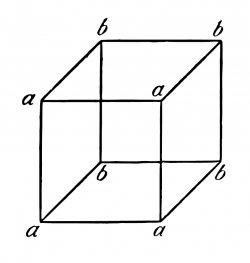\ auf zweierlei Art als Würfel sehen kann; und alle ähnlichen Erscheinungen.</td>
<td lang="en">This perhaps explains that the figure \ can be seen in two ways as a cube; and all similar phenomena.</td>
<td lang="en"><em>外部版本參照：</em> Ludwig Wittgenstein, Tractatus Logico-Philosophicus, trans. D. F. Pears and B. F. McGuinness, 2nd ed. (Routledge, 2001), ISBN 9780415254083.；命題 <code>5.5423</code>；<a href="https://www.routledge.com/Tractatus-Logico-Philosophicus/Wittgenstein/p/book/9780415254083">來源</a></td>
<td lang="zh-Hant">這或許也能說明圖中的立方體可用兩種方式觀看，以及所有類似現象。 <small><strong>哲學解讀：</strong> 同一組紙面筆畫可依不同組合方式，被知覺為兩種空間配置。</small></td>
</tr>
<tr id="segment-5-5423-c">
<td lang="de">Denn wir sehen eben wirklich zwei verschiedene Tatsachen.</td>
<td lang="en">For we really see two different facts.</td>
<td lang="en"><em>外部版本參照：</em> Ludwig Wittgenstein, Tractatus Logico-Philosophicus, trans. D. F. Pears and B. F. McGuinness, 2nd ed. (Routledge, 2001), ISBN 9780415254083.；命題 <code>5.5423</code>；<a href="https://www.routledge.com/Tractatus-Logico-Philosophicus/Wittgenstein/p/book/9780415254083">來源</a></td>
<td lang="zh-Hant">因為我們實際看見的是兩個不同事實。 <small><strong>哲學解讀：</strong> 知覺轉換改變的是成分被看成如何關聯，而不是單純替同一事實換名稱。</small></td>
</tr>
<tr id="segment-5-5423-d">
<td lang="de">\(Sehe ich erst auf die Ecken *a* und nur flüchtig auf *b*, so erscheint *a* vorne; und umgekehrt.)</td>
<td lang="en">\(If I fix my eyes first on the corners *a* and only glance at *b*, *a* appears in front and *b* behind, and vice versa.)</td>
<td lang="en"><em>外部版本參照：</em> Ludwig Wittgenstein, Tractatus Logico-Philosophicus, trans. D. F. Pears and B. F. McGuinness, 2nd ed. (Routledge, 2001), ISBN 9780415254083.；命題 <code>5.5423</code>；<a href="https://www.routledge.com/Tractatus-Logico-Philosophicus/Wittgenstein/p/book/9780415254083">來源</a></td>
<td lang="zh-Hant">（若我先注視角 a，只瞥角 b，a 看來在前；反過來亦然。） <small><strong>哲學解讀：</strong> 注意方向使同一圖形的前後配置互換，具體示範兩種知覺事實。</small></td>
</tr>
<tr class="project-relations">
<td colspan="4">
<strong>Akashic 專案關係</strong>
<ul>
<li><code>not_applicable</code> — Akashic 目前不宣稱直接實作命題 5.5423 的哲學主張。 <small>理由：此命題的具體內容是：知覺複合物不只接收成分，還呈現成分的特定配置；同一筆畫可投射為兩種不同空間配置，因此改變的是所見事實，而非紙面元素；注意方向使同一圖形的前後配置互換，具體示範兩種知覺事實。專案現有 schema、資料與查詢行為不足以證成同一主張，硬套對應會誤導。</small>
</li>
</ul>
</td>
</tr>
<tr id="proposition-5-55">
<td colspan="4"><strong>5.55</strong></td>
</tr>
<tr id="segment-5-55-a">
<td lang="de">Wir müssen nun die Frage nach allen möglichen Formen der Elementarsätze a priori beantworten.</td>
<td lang="en">We must now answer a priori the question as to all possible forms of the elementary propositions.</td>
<td lang="en"><em>外部版本參照：</em> Ludwig Wittgenstein, Tractatus Logico-Philosophicus, trans. D. F. Pears and B. F. McGuinness, 2nd ed. (Routledge, 2001), ISBN 9780415254083.；命題 <code>5.55</code>；<a href="https://www.routledge.com/Tractatus-Logico-Philosophicus/Wittgenstein/p/book/9780415254083">來源</a></td>
<td lang="zh-Hant">我們現在必須先於經驗地回答：基本命題有哪些可能形式。 <small><strong>哲學解讀：</strong> 問題要求的是基本命題形式的完整先驗清單，而不是從已見句子歸納。</small></td>
</tr>
<tr id="segment-5-55-b">
<td lang="de">Der Elementarsatz besteht aus Namen.</td>
<td lang="en">The elementary proposition consists of names.</td>
<td lang="en"><em>外部版本參照：</em> Ludwig Wittgenstein, Tractatus Logico-Philosophicus, trans. D. F. Pears and B. F. McGuinness, 2nd ed. (Routledge, 2001), ISBN 9780415254083.；命題 <code>5.55</code>；<a href="https://www.routledge.com/Tractatus-Logico-Philosophicus/Wittgenstein/p/book/9780415254083">來源</a></td>
<td lang="zh-Hant">基本命題由名稱組成。 <small><strong>哲學解讀：</strong> 基本命題的最小結構以名稱的直接組合呈現可能事態。</small></td>
</tr>
<tr id="segment-5-55-c">
<td lang="de">Da wir aber die Anzahl der Namen von verschiedener Bedeutung nicht angeben können, so können wir auch nicht die Zusammensetzung des Elementarsatzes angeben.</td>
<td lang="en">Since we cannot give the number of names with different meanings, we cannot give the composition of the elementary proposition.</td>
<td lang="en"><em>外部版本參照：</em> Ludwig Wittgenstein, Tractatus Logico-Philosophicus, trans. D. F. Pears and B. F. McGuinness, 2nd ed. (Routledge, 2001), ISBN 9780415254083.；命題 <code>5.55</code>；<a href="https://www.routledge.com/Tractatus-Logico-Philosophicus/Wittgenstein/p/book/9780415254083">來源</a></td>
<td lang="zh-Hant">既然我們無法給出意義不同的名稱有多少，也就無法給出基本命題的組成。 <small><strong>哲學解讀：</strong> 未知名稱的可能數量，使逐項列舉基本命題形式的企圖失去根據。</small></td>
</tr>
<tr class="project-relations">
<td colspan="4">
<strong>Akashic 專案關係</strong>
<ul>
<li><code>not_applicable</code> — Akashic 目前不宣稱直接實作命題 5.55 的哲學主張。 <small>理由：此命題的具體內容是：問題要求的是基本命題形式的完整先驗清單；未知名稱的可能數量，使逐項列舉基本命題形式的企圖失去根據。專案現有 schema、資料與查詢行為不足以證成同一主張，硬套對應會誤導。</small>
</li>
</ul>
</td>
</tr>
<tr id="proposition-5-551">
<td colspan="4"><strong>5.551</strong></td>
</tr>
<tr id="segment-5-551-a">
<td lang="de">Unser Grundsatz ist, dass jede Frage, die sich überhaupt durch die Logik entscheiden lässt, sich ohne weiteres entscheiden lassen muss.</td>
<td lang="en">Our fundamental principle is that every question which can be decided at all by logic can be decided off-hand.</td>
<td lang="en"><em>外部版本參照：</em> Ludwig Wittgenstein, Tractatus Logico-Philosophicus, trans. D. F. Pears and B. F. McGuinness, 2nd ed. (Routledge, 2001), ISBN 9780415254083.；命題 <code>5.551</code>；<a href="https://www.routledge.com/Tractatus-Logico-Philosophicus/Wittgenstein/p/book/9780415254083">來源</a></td>
<td lang="zh-Hant">我們的基本原則是：凡能由邏輯決定的問題，都能當下決定。 <small><strong>哲學解讀：</strong> 邏輯判定不應等待新的世界資料，否則它便不是純形式問題。</small></td>
</tr>
<tr id="segment-5-551-b">
<td lang="de">\(Und wenn wir in die Lage kommen, ein solches Problem durch Ansehen der Welt beantworten zu müssen, so zeigt dies, dass wir auf grundfalscher Fährte sind.)</td>
<td lang="en">\(And if we get into a situation where we need to answer such a problem by looking at the world, this shows that we are on a fundamentally wrong track.)</td>
<td lang="en"><em>外部版本參照：</em> Ludwig Wittgenstein, Tractatus Logico-Philosophicus, trans. D. F. Pears and B. F. McGuinness, 2nd ed. (Routledge, 2001), ISBN 9780415254083.；命題 <code>5.551</code>；<a href="https://www.routledge.com/Tractatus-Logico-Philosophicus/Wittgenstein/p/book/9780415254083">來源</a></td>
<td lang="zh-Hant">（若我們必須觀察世界才能回答這類問題，就表示我們走在根本錯誤的路上。） <small><strong>哲學解讀：</strong> 經驗查詢的必要性是把經驗問題誤當邏輯問題的警訊。</small></td>
</tr>
<tr class="project-relations">
<td colspan="4">
<strong>Akashic 專案關係</strong>
<ul>
<li><code>not_applicable</code> — Akashic 目前不宣稱直接實作命題 5.551 的哲學主張。 <small>理由：此命題的具體內容是：邏輯判定不應等待新的世界資料，否則它便不是純形式問題；經驗查詢的必要性是把經驗問題誤當邏輯問題的警訊。專案現有 schema、資料與查詢行為不足以證成同一主張，硬套對應會誤導。</small>
</li>
</ul>
</td>
</tr>
<tr id="proposition-5-552">
<td colspan="4"><strong>5.552</strong></td>
</tr>
<tr id="segment-5-552-a">
<td lang="de">Die „Erfahrung“, die wir zum Verstehen der Logik brauchen, ist nicht die, dass sich etwas so und so verhält, sondern, dass etwas *ist*: aber das ist eben *keine* Erfahrung.</td>
<td lang="en">The “experience” which we need to understand logic is not that such and such is the case, but that something *is*; but that is *no* experience.</td>
<td lang="en"><em>外部版本參照：</em> Ludwig Wittgenstein, Tractatus Logico-Philosophicus, trans. D. F. Pears and B. F. McGuinness, 2nd ed. (Routledge, 2001), ISBN 9780415254083.；命題 <code>5.552</code>；<a href="https://www.routledge.com/Tractatus-Logico-Philosophicus/Wittgenstein/p/book/9780415254083">來源</a></td>
<td lang="zh-Hant">為理解邏輯而需要的「經驗」，不是某事如此，而是有某物存在；但那恰恰不是經驗。 <small><strong>哲學解讀：</strong> 邏輯不依賴某項特定事實，只預設符號能有所指；後者不是可比較的經驗命題。</small></td>
</tr>
<tr id="segment-5-552-b">
<td lang="de">Die Logik ist *vor* jeder Erfahrung – dass etwas *so* ist.</td>
<td lang="en">Logic *precedes* every experience—that something is *so*.</td>
<td lang="en"><em>外部版本參照：</em> Ludwig Wittgenstein, Tractatus Logico-Philosophicus, trans. D. F. Pears and B. F. McGuinness, 2nd ed. (Routledge, 2001), ISBN 9780415254083.；命題 <code>5.552</code>；<a href="https://www.routledge.com/Tractatus-Logico-Philosophicus/Wittgenstein/p/book/9780415254083">來源</a></td>
<td lang="zh-Hant">邏輯先於一切關於某物如何的經驗。 <small><strong>哲學解讀：</strong> 邏輯形式不由世界偶然採取的某一配置決定。</small></td>
</tr>
<tr id="segment-5-552-c">
<td lang="de">Sie ist vor dem Wie, nicht vor dem Was.</td>
<td lang="en">It is before the How, not before the What.</td>
<td lang="en"><em>外部版本參照：</em> Ludwig Wittgenstein, Tractatus Logico-Philosophicus, trans. D. F. Pears and B. F. McGuinness, 2nd ed. (Routledge, 2001), ISBN 9780415254083.；命題 <code>5.552</code>；<a href="https://www.routledge.com/Tractatus-Logico-Philosophicus/Wittgenstein/p/book/9780415254083">來源</a></td>
<td lang="zh-Hant">它先於「如何」，而不先於「什麼」。 <small><strong>哲學解讀：</strong> 邏輯先於事實的排列方式，卻不憑空先於任何可表達內容之存在。</small></td>
</tr>
<tr class="project-relations">
<td colspan="4">
<strong>Akashic 專案關係</strong>
<ul>
<li><code>not_applicable</code> — Akashic 目前不宣稱直接實作命題 5.552 的哲學主張。 <small>理由：此命題的具體內容是：邏輯不依賴某項特定事實，僅預設符號能有所指的世界，後者不是一則可比較的經驗命題；德文把後兩句合成一個來源單元；重點是邏輯先於事實配置，卻不憑空先於任何可表達內容的存在。專案現有 schema、資料與查詢行為不足以證成同一主張，硬套對應會誤導。</small>
</li>
</ul>
</td>
</tr>
<tr id="proposition-5-5521">
<td colspan="4"><strong>5.5521</strong></td>
</tr>
<tr id="segment-5-5521-a">
<td lang="de">Und wenn dies nicht so wäre, wie könnten wir die Logik anwenden?</td>
<td lang="en">And if this were not the case, how could we apply logic?</td>
<td lang="en"><em>外部版本參照：</em> Ludwig Wittgenstein, Tractatus Logico-Philosophicus, trans. D. F. Pears and B. F. McGuinness, 2nd ed. (Routledge, 2001), ISBN 9780415254083.；命題 <code>5.5521</code>；<a href="https://www.routledge.com/Tractatus-Logico-Philosophicus/Wittgenstein/p/book/9780415254083">來源</a></td>
<td lang="zh-Hant">若非如此，我們怎能應用邏輯？ <small><strong>哲學解讀：</strong> 邏輯若與任何可能世界無關，就無從說明它為何能規範實際命題。</small></td>
</tr>
<tr id="segment-5-5521-b">
<td lang="de">Man könnte sagen: Wenn es eine Logik gäbe, auch wenn es keine Welt gäbe, wie könnte es dann eine Logik geben, da es eine Welt gibt.</td>
<td lang="en">We could say: if there were a logic, even if there were no world, how then could there be a logic, since there is a world?</td>
<td lang="en"><em>外部版本參照：</em> Ludwig Wittgenstein, Tractatus Logico-Philosophicus, trans. D. F. Pears and B. F. McGuinness, 2nd ed. (Routledge, 2001), ISBN 9780415254083.；命題 <code>5.5521</code>；<a href="https://www.routledge.com/Tractatus-Logico-Philosophicus/Wittgenstein/p/book/9780415254083">來源</a></td>
<td lang="zh-Hant">可以問：若即使沒有世界也會有邏輯，那麼既然有世界，怎麼可能沒有邏輯？ <small><strong>哲學解讀：</strong> 邏輯可應用性與世界存在相扣連，卻不取決於世界採取哪種具體配置。</small></td>
</tr>
<tr class="project-relations">
<td colspan="4">
<strong>Akashic 專案關係</strong>
<ul>
<li><code>not_applicable</code> — Akashic 目前不宣稱直接實作命題 5.5521 的哲學主張。 <small>理由：此命題的具體內容是：邏輯的可應用性與世界存在互相扣連，卻不取決於世界採取哪一種具體配置。專案現有 schema、資料與查詢行為不足以證成同一主張，硬套對應會誤導。</small>
</li>
</ul>
</td>
</tr>
<tr id="proposition-5-553">
<td colspan="4"><strong>5.553</strong></td>
</tr>
<tr id="segment-5-553-a">
<td lang="de">Russell sagte, es gäbe einfache Relationen zwischen verschiedenen Anzahlen von Dingen (Individuals).</td>
<td lang="en">Russell said that there were simple relations between different numbers of things (individuals).</td>
<td lang="en"><em>外部版本參照：</em> Ludwig Wittgenstein, Tractatus Logico-Philosophicus, trans. D. F. Pears and B. F. McGuinness, 2nd ed. (Routledge, 2001), ISBN 9780415254083.；命題 <code>5.553</code>；<a href="https://www.routledge.com/Tractatus-Logico-Philosophicus/Wittgenstein/p/book/9780415254083">來源</a></td>
<td lang="zh-Hant">羅素說，不同數目的事物（個體）之間有簡單關係。 <small><strong>哲學解讀：</strong> 這項主張把某些固定項數的關係預設為基本邏輯形式。</small></td>
</tr>
<tr id="segment-5-553-b">
<td lang="de">Aber zwischen welchen Anzahlen?</td>
<td lang="en">But between what numbers?</td>
<td lang="en"><em>外部版本參照：</em> Ludwig Wittgenstein, Tractatus Logico-Philosophicus, trans. D. F. Pears and B. F. McGuinness, 2nd ed. (Routledge, 2001), ISBN 9780415254083.；命題 <code>5.553</code>；<a href="https://www.routledge.com/Tractatus-Logico-Philosophicus/Wittgenstein/p/book/9780415254083">來源</a></td>
<td lang="zh-Hant">但究竟是哪些數目？ <small><strong>哲學解讀：</strong> 若沒有先驗準則，就無法選出哪些項數應列入基本形式。</small></td>
</tr>
<tr id="segment-5-553-c">
<td lang="de">Und wie soll sich das entscheiden? – Durch die Erfahrung?</td>
<td lang="en">And how should this be decided—by experience?</td>
<td lang="en"><em>外部版本參照：</em> Ludwig Wittgenstein, Tractatus Logico-Philosophicus, trans. D. F. Pears and B. F. McGuinness, 2nd ed. (Routledge, 2001), ISBN 9780415254083.；命題 <code>5.553</code>；<a href="https://www.routledge.com/Tractatus-Logico-Philosophicus/Wittgenstein/p/book/9780415254083">來源</a></td>
<td lang="zh-Hant">又要如何決定——靠經驗嗎？ <small><strong>哲學解讀：</strong> 若答案靠觀察，所列關係項數就不能宣稱是先驗邏輯結構。</small></td>
</tr>
<tr id="segment-5-553-d">
<td lang="de">\(Eine ausgezeichnete Zahl gibt es nicht.)</td>
<td lang="en">\(There is no pre-eminent number.)</td>
<td lang="en"><em>外部版本參照：</em> Ludwig Wittgenstein, Tractatus Logico-Philosophicus, trans. D. F. Pears and B. F. McGuinness, 2nd ed. (Routledge, 2001), ISBN 9780415254083.；命題 <code>5.553</code>；<a href="https://www.routledge.com/Tractatus-Logico-Philosophicus/Wittgenstein/p/book/9780415254083">來源</a></td>
<td lang="zh-Hant">（沒有任何特別優先的數。） <small><strong>哲學解讀：</strong> 邏輯不能無理由把某個項數視為本質上比其他數更基本。</small></td>
</tr>
<tr class="project-relations">
<td colspan="4">
<strong>Akashic 專案關係</strong>
<ul>
<li><code>not_applicable</code> — Akashic 目前不宣稱直接實作命題 5.553 的哲學主張。 <small>理由：此命題的具體內容是：若關係項數由觀察列舉，就不能宣稱那套清單是先驗邏輯形式；邏輯不能無理由把某個項數視為基本。專案現有 schema、資料與查詢行為不足以證成同一主張，硬套對應會誤導。</small>
</li>
</ul>
</td>
</tr>
<tr id="proposition-5-554">
<td colspan="4"><strong>5.554</strong></td>
</tr>
<tr id="segment-5-554-a">
<td lang="de">Die Angabe jeder speziellen Form wäre vollkommen willkürlich.</td>
<td lang="en">The enumeration of any special forms would be entirely arbitrary.</td>
<td lang="en"><em>外部版本參照：</em> Ludwig Wittgenstein, Tractatus Logico-Philosophicus, trans. D. F. Pears and B. F. McGuinness, 2nd ed. (Routledge, 2001), ISBN 9780415254083.；命題 <code>5.554</code>；<a href="https://www.routledge.com/Tractatus-Logico-Philosophicus/Wittgenstein/p/book/9780415254083">來源</a></td>
<td lang="zh-Hant">列舉任何特殊形式都會是完全任意的。 <small><strong>哲學解讀：</strong> 缺乏一般生成原則時，形式清單只反映記法選擇。</small></td>
</tr>
<tr class="project-relations">
<td colspan="4">
<strong>Akashic 專案關係</strong>
<ul>
<li><code>not_applicable</code> — Akashic 目前不宣稱直接實作命題 5.554 的哲學主張。 <small>理由：此命題的具體內容是：缺乏一般生成原則時，形式清單只反映記法選擇。專案現有 schema、資料與查詢行為不足以證成同一主張，硬套對應會誤導。</small>
</li>
</ul>
</td>
</tr>
<tr id="proposition-5-5541">
<td colspan="4"><strong>5.5541</strong></td>
</tr>
<tr id="segment-5-5541-a">
<td lang="de">Es soll sich a priori angeben lassen, ob ich z. B. in die Lage kommen kann, etwas mit dem Zeichen einer 27-stelligen Relation bezeichnen zu müssen.</td>
<td lang="en">How could we decide a priori whether, for example, I can get into a situation in which I need to symbolize with a sign of a 27-termed relation?</td>
<td lang="en"><em>外部版本參照：</em> Ludwig Wittgenstein, Tractatus Logico-Philosophicus, trans. D. F. Pears and B. F. McGuinness, 2nd ed. (Routledge, 2001), ISBN 9780415254083.；命題 <code>5.5541</code>；<a href="https://www.routledge.com/Tractatus-Logico-Philosophicus/Wittgenstein/p/book/9780415254083">來源</a></td>
<td lang="zh-Hant">例如，我是否可能遇到需要用二十七項關係記號表示的情形，我們怎能先於經驗地決定？ <small><strong>哲學解讀：</strong> 特定關係項數是否在應用中出現，不能靠純邏輯預先列舉。</small></td>
</tr>
<tr class="project-relations">
<td colspan="4">
<strong>Akashic 專案關係</strong>
<ul>
<li><code>not_applicable</code> — Akashic 目前不宣稱直接實作命題 5.5541 的哲學主張。 <small>理由：此命題的具體內容是：特定關係項數是否在應用中出現，不能靠純邏輯預先列舉。專案現有 schema、資料與查詢行為不足以證成同一主張，硬套對應會誤導。</small>
</li>
</ul>
</td>
</tr>
<tr id="proposition-5-5542">
<td colspan="4"><strong>5.5542</strong></td>
</tr>
<tr id="segment-5-5542-a">
<td lang="de">Dürfen wir denn aber überhaupt so fragen?</td>
<td lang="en">May we then ask this at all?</td>
<td lang="en"><em>外部版本參照：</em> Ludwig Wittgenstein, Tractatus Logico-Philosophicus, trans. D. F. Pears and B. F. McGuinness, 2nd ed. (Routledge, 2001), ISBN 9780415254083.；命題 <code>5.5542</code>；<a href="https://www.routledge.com/Tractatus-Logico-Philosophicus/Wittgenstein/p/book/9780415254083">來源</a></td>
<td lang="zh-Hant">我們究竟能不能這樣問？ <small><strong>哲學解讀：</strong> 反問先檢查問題本身是否形成有意義的符號要求。</small></td>
</tr>
<tr id="segment-5-5542-b">
<td lang="de">Können wir eine Zeichenform aufstellen und nicht wissen, ob ihr etwas entsprechen könne?</td>
<td lang="en">Can we set out a sign form and not know whether anything can correspond to it?</td>
<td lang="en"><em>外部版本參照：</em> Ludwig Wittgenstein, Tractatus Logico-Philosophicus, trans. D. F. Pears and B. F. McGuinness, 2nd ed. (Routledge, 2001), ISBN 9780415254083.；命題 <code>5.5542</code>；<a href="https://www.routledge.com/Tractatus-Logico-Philosophicus/Wittgenstein/p/book/9780415254083">來源</a></td>
<td lang="zh-Hant">能否先提出一種記號形式，卻不知道有沒有任何東西能與它對應？ <small><strong>哲學解讀：</strong> 若完全不知符號的可能應用，所造形式是否仍為記號便成疑問。</small></td>
</tr>
<tr id="segment-5-5542-c">
<td lang="de">Hat die Frage einen Sinn: Was muss *sein*, damit etwas der-Fall-sein kann?</td>
<td lang="en">Has the question sense: what must there *be* in order that anything can be the case?</td>
<td lang="en"><em>外部版本參照：</em> Ludwig Wittgenstein, Tractatus Logico-Philosophicus, trans. D. F. Pears and B. F. McGuinness, 2nd ed. (Routledge, 2001), ISBN 9780415254083.；命題 <code>5.5542</code>；<a href="https://www.routledge.com/Tractatus-Logico-Philosophicus/Wittgenstein/p/book/9780415254083">來源</a></td>
<td lang="zh-Hant">「必須有什麼，才可能有任何事情成立？」這個問題有意義嗎？ <small><strong>哲學解讀：</strong> 問題試圖從邏輯之外指定世界的必要材料，因而觸及可問性的界線。</small></td>
</tr>
<tr class="project-relations">
<td colspan="4">
<strong>Akashic 專案關係</strong>
<ul>
<li><code>not_applicable</code> — Akashic 目前不宣稱直接實作命題 5.5542 的哲學主張。 <small>理由：此命題的具體內容是：若完全不知符號的可能應用，所造形式是否仍是有意義記號便成疑問；問題試圖從邏輯之外指定世界的必要材料，因而觸及可問性的界線。專案現有 schema、資料與查詢行為不足以證成同一主張，硬套對應會誤導。</small>
</li>
</ul>
</td>
</tr>
<tr id="proposition-5-555">
<td colspan="4"><strong>5.555</strong></td>
</tr>
<tr id="segment-5-555-a">
<td lang="de">Es ist klar, wir haben vom Elementarsatz einen Begriff, abgesehen von seiner besonderen logischen Form.</td>
<td lang="en">It is clear that we have a concept of the elementary proposition apart from its special logical form.</td>
<td lang="en"><em>外部版本參照：</em> Ludwig Wittgenstein, Tractatus Logico-Philosophicus, trans. D. F. Pears and B. F. McGuinness, 2nd ed. (Routledge, 2001), ISBN 9780415254083.；命題 <code>5.555</code>；<a href="https://www.routledge.com/Tractatus-Logico-Philosophicus/Wittgenstein/p/book/9780415254083">來源</a></td>
<td lang="zh-Hant">顯然，我們不依賴基本命題的特殊邏輯形式，也具有基本命題這個概念。 <small><strong>哲學解讀：</strong> 我們理解基本命題的角色，不必先知道所有具體項數或排列。</small></td>
</tr>
<tr id="segment-5-555-b">
<td lang="de">Wo man aber Symbole nach einem System bilden kann, dort ist dieses System das logisch wichtige und nicht die einzelnen Symbole.</td>
<td lang="en">Where, however, we can build symbols according to a system, there this system is the logically important thing and not the single symbols.</td>
<td lang="en"><em>外部版本參照：</em> Ludwig Wittgenstein, Tractatus Logico-Philosophicus, trans. D. F. Pears and B. F. McGuinness, 2nd ed. (Routledge, 2001), ISBN 9780415254083.；命題 <code>5.555</code>；<a href="https://www.routledge.com/Tractatus-Logico-Philosophicus/Wittgenstein/p/book/9780415254083">來源</a></td>
<td lang="zh-Hant">但凡能依一套系統建構符號，邏輯上重要的是那套系統，而不是個別符號。 <small><strong>哲學解讀：</strong> 生成規則比任意列出的單一形式更能表達邏輯必然性。</small></td>
</tr>
<tr id="segment-5-555-c">
<td lang="de">Und wie wäre es auch möglich, dass ich es in der Logik mit Formen zu tun hätte, die ich erfinden kann; sondern mit dem muss ich es zu tun haben, was es mir möglich macht, sie zu erfinden.</td>
<td lang="en">And how would it be possible that I should have to deal with forms in logic which I can invent: but I must have to deal with that which makes it possible for me to invent them.</td>
<td lang="en"><em>外部版本參照：</em> Ludwig Wittgenstein, Tractatus Logico-Philosophicus, trans. D. F. Pears and B. F. McGuinness, 2nd ed. (Routledge, 2001), ISBN 9780415254083.；命題 <code>5.555</code>；<a href="https://www.routledge.com/Tractatus-Logico-Philosophicus/Wittgenstein/p/book/9780415254083">來源</a></td>
<td lang="zh-Hant">我怎可能必須在邏輯中處理我自己能發明的形式？我所必須處理的，應是使我能發明它們的東西。 <small><strong>哲學解讀：</strong> 邏輯研究的是造出各種記法的共同可能條件，不是把人為發明逐項神聖化。</small></td>
</tr>
<tr class="project-relations">
<td colspan="4">
<strong>Akashic 專案關係</strong>
<ul>
<li><code>not_applicable</code> — Akashic 目前不宣稱直接實作命題 5.555 的哲學主張。 <small>理由：此命題的具體內容是：我們理解基本命題的角色，不必先知道所有具體項數或排列；生成規則比任意列出的單一形式更能表達邏輯必然性；邏輯研究的是造出各種記法的共同可能條件，不是把人為發明逐項神聖化。專案現有 schema、資料與查詢行為不足以證成同一主張，硬套對應會誤導。</small>
</li>
</ul>
</td>
</tr>
<tr id="proposition-5-556">
<td colspan="4"><strong>5.556</strong></td>
</tr>
<tr id="segment-5-556-a">
<td lang="de">Eine Hierarchie der Formen der Elementarsätze kann es nicht geben.</td>
<td lang="en">There cannot be a hierarchy of the forms of the elementary propositions.</td>
<td lang="en"><em>外部版本參照：</em> Ludwig Wittgenstein, Tractatus Logico-Philosophicus, trans. D. F. Pears and B. F. McGuinness, 2nd ed. (Routledge, 2001), ISBN 9780415254083.；命題 <code>5.556</code>；<a href="https://www.routledge.com/Tractatus-Logico-Philosophicus/Wittgenstein/p/book/9780415254083">來源</a></td>
<td lang="zh-Hant">基本命題的形式不能有階層。 <small><strong>哲學解讀：</strong> 基本形式若依固定高低層級排列，就會把人造型別架構投射到世界。</small></td>
</tr>
<tr id="segment-5-556-b">
<td lang="de">Nur was wir selbst konstruieren, können wir voraussehen.</td>
<td lang="en">Only that which we ourselves construct can we foresee.</td>
<td lang="en"><em>外部版本參照：</em> Ludwig Wittgenstein, Tractatus Logico-Philosophicus, trans. D. F. Pears and B. F. McGuinness, 2nd ed. (Routledge, 2001), ISBN 9780415254083.；命題 <code>5.556</code>；<a href="https://www.routledge.com/Tractatus-Logico-Philosophicus/Wittgenstein/p/book/9780415254083">來源</a></td>
<td lang="zh-Hant">只有我們自己建構的東西，才能被我們預先看見。 <small><strong>哲學解讀：</strong> 可預見的階層來自記法建構規則，不能據此宣稱世界本身先驗地分層。</small></td>
</tr>
<tr class="project-relations">
<td colspan="4">
<strong>Akashic 專案關係</strong>
<ul>
<li><code>not_applicable</code> — Akashic 目前不宣稱直接實作命題 5.556 的哲學主張。 <small>理由：此命題的具體內容是：若形式階層是人造記法的產物，就不能把它誤作世界本身預定的先驗層級。專案現有 schema、資料與查詢行為不足以證成同一主張，硬套對應會誤導。</small>
</li>
</ul>
</td>
</tr>
<tr id="proposition-5-5561">
<td colspan="4"><strong>5.5561</strong></td>
</tr>
<tr id="segment-5-5561-a">
<td lang="de">Die empirische Realität ist begrenzt durch die Gesamtheit der Gegenstände.</td>
<td lang="en">Empirical reality is limited by the totality of objects.</td>
<td lang="en"><em>外部版本參照：</em> Ludwig Wittgenstein, Tractatus Logico-Philosophicus, trans. D. F. Pears and B. F. McGuinness, 2nd ed. (Routledge, 2001), ISBN 9780415254083.；命題 <code>5.5561</code>；<a href="https://www.routledge.com/Tractatus-Logico-Philosophicus/Wittgenstein/p/book/9780415254083">來源</a></td>
<td lang="zh-Hant">經驗現實由對象總體劃界。 <small><strong>哲學解讀：</strong> 可存在的對象總體限制哪些事態能構成經驗現實。</small></td>
</tr>
<tr id="segment-5-5561-b">
<td lang="de">Die Grenze zeigt sich wieder in der Gesamtheit der Elementarsätze.</td>
<td lang="en">The boundary appears again in the totality of elementary propositions.</td>
<td lang="en"><em>外部版本參照：</em> Ludwig Wittgenstein, Tractatus Logico-Philosophicus, trans. D. F. Pears and B. F. McGuinness, 2nd ed. (Routledge, 2001), ISBN 9780415254083.；命題 <code>5.5561</code>；<a href="https://www.routledge.com/Tractatus-Logico-Philosophicus/Wittgenstein/p/book/9780415254083">來源</a></td>
<td lang="zh-Hant">這道界線又顯現在基本命題的總體中。 <small><strong>哲學解讀：</strong> 語言一側可形成的基本命題，映出世界一側可組合的對象範圍。</small></td>
</tr>
<tr id="segment-5-5561-c">
<td lang="de">Die Hierarchien sind, und müssen unabhängig von der Realität sein.</td>
<td lang="en">The hierarchies are and must be independent of reality.</td>
<td lang="en"><em>外部版本參照：</em> Ludwig Wittgenstein, Tractatus Logico-Philosophicus, trans. D. F. Pears and B. F. McGuinness, 2nd ed. (Routledge, 2001), ISBN 9780415254083.；命題 <code>5.5561</code>；<a href="https://www.routledge.com/Tractatus-Logico-Philosophicus/Wittgenstein/p/book/9780415254083">來源</a></td>
<td lang="zh-Hant">各種階層與現實無關，而且必須與現實無關。 <small><strong>哲學解讀：</strong> 型別階層若屬邏輯記法，就不能由偶然世界事實決定。</small></td>
</tr>
<tr class="project-relations">
<td colspan="4">
<strong>Akashic 專案關係</strong>
<ul>
<li><code>not_applicable</code> — Akashic 目前不宣稱直接實作命題 5.5561 的哲學主張。 <small>理由：此命題的具體內容是：可存在的對象界定可形成哪些基本事實，兩者在語言與世界兩側相應；型別階層若屬邏輯記法，就不能由偶然世界事實決定。專案現有 schema、資料與查詢行為不足以證成同一主張，硬套對應會誤導。</small>
</li>
</ul>
</td>
</tr>
<tr id="proposition-5-5562">
<td colspan="4"><strong>5.5562</strong></td>
</tr>
<tr id="segment-5-5562-a">
<td lang="de">Wissen wir aus rein logischen Gründen, dass es Elementarsätze geben muss, dann muss es jeder wissen, der die Sätze in ihrer unanalysierten Form versteht.</td>
<td lang="en">If we know on purely logical grounds, that there must be elementary propositions, then this must be known by everyone who understands propositions in their unanalysed form.</td>
<td lang="en"><em>外部版本參照：</em> Ludwig Wittgenstein, Tractatus Logico-Philosophicus, trans. D. F. Pears and B. F. McGuinness, 2nd ed. (Routledge, 2001), ISBN 9780415254083.；命題 <code>5.5562</code>；<a href="https://www.routledge.com/Tractatus-Logico-Philosophicus/Wittgenstein/p/book/9780415254083">來源</a></td>
<td lang="zh-Hant">若我們能僅憑邏輯知道必定有基本命題，那麼每個理解尚未分析之命題的人也必定知道這點。 <small><strong>哲學解讀：</strong> 基本命題的必要性若真屬形式條件，就已隱含在一般命題理解中，而非專家理論的額外發現。</small></td>
</tr>
<tr class="project-relations">
<td colspan="4">
<strong>Akashic 專案關係</strong>
<ul>
<li><code>not_applicable</code> — Akashic 目前不宣稱直接實作命題 5.5562 的哲學主張。 <small>理由：此命題的具體內容是：基本命題的必要性若真屬形式條件，就已隱含在一般命題理解中，而非專家理論的額外發現。專案現有 schema、資料與查詢行為不足以證成同一主張，硬套對應會誤導。</small>
</li>
</ul>
</td>
</tr>
<tr id="proposition-5-5563">
<td colspan="4"><strong>5.5563</strong></td>
</tr>
<tr id="segment-5-5563-a">
<td lang="de">Alle Sätze unserer Umgangssprache sind tatsächlich, so wie sie sind, logisch vollkommen geordnet.</td>
<td lang="en">All propositions of our colloquial language are actually, just as they are, logically completely in order.</td>
<td lang="en"><em>外部版本參照：</em> Ludwig Wittgenstein, Tractatus Logico-Philosophicus, trans. D. F. Pears and B. F. McGuinness, 2nd ed. (Routledge, 2001), ISBN 9780415254083.；命題 <code>5.5563</code>；<a href="https://www.routledge.com/Tractatus-Logico-Philosophicus/Wittgenstein/p/book/9780415254083">來源</a></td>
<td lang="zh-Hant">我們日常語言的一切命題，照其現狀其實都在邏輯上完全妥當。 <small><strong>哲學解讀：</strong> 邏輯分析不是以人工理想語言取代日常命題，而是揭示其既有秩序。</small></td>
</tr>
<tr id="segment-5-5563-b">
<td lang="de">– Jenes Einfachste, was wir hier angeben sollen, ist nicht ein Gleichnis der Wahrheit, sondern die volle Wahrheit selbst.</td>
<td lang="en">That simple thing which we ought to give here is not a model of the truth but the complete truth itself.</td>
<td lang="en"><em>外部版本參照：</em> Ludwig Wittgenstein, Tractatus Logico-Philosophicus, trans. D. F. Pears and B. F. McGuinness, 2nd ed. (Routledge, 2001), ISBN 9780415254083.；命題 <code>5.5563</code>；<a href="https://www.routledge.com/Tractatus-Logico-Philosophicus/Wittgenstein/p/book/9780415254083">來源</a></td>
<td lang="zh-Hant">——我們在此應給出的簡單之物，不是真理的一個模型，而是完整的真理本身。 <small><strong>哲學解讀：</strong> 分析所尋求的簡單形式不是近似模型，而是命題實際符號結構的完整呈現。</small></td>
</tr>
<tr id="segment-5-5563-c">
<td lang="de">\(Unsere Probleme sind nicht abstrakt, sondern vielleicht die konkretesten, die es gibt.)</td>
<td lang="en">\(Our problems are not abstract but perhaps the most concrete that there are.)</td>
<td lang="en"><em>外部版本參照：</em> Ludwig Wittgenstein, Tractatus Logico-Philosophicus, trans. D. F. Pears and B. F. McGuinness, 2nd ed. (Routledge, 2001), ISBN 9780415254083.；命題 <code>5.5563</code>；<a href="https://www.routledge.com/Tractatus-Logico-Philosophicus/Wittgenstein/p/book/9780415254083">來源</a></td>
<td lang="zh-Hant">（我們的問題並不抽象，反而可能是最具體的問題。） <small><strong>哲學解讀：</strong> 哲學困惑發生在實際語言使用中，不是遠離生活的純抽象難題。</small></td>
</tr>
<tr class="project-relations">
<td colspan="4">
<strong>Akashic 專案關係</strong>
<ul>
<li><code>not_applicable</code> — Akashic 目前不宣稱直接實作命題 5.5563 的哲學主張。 <small>理由：此命題的具體內容是：邏輯分析不是以人工理想語言取代日常命題；它要顯示日常命題本已具有的完整秩序；哲學困惑發生在實際語言使用中，不是遠離生活的純抽象難題。專案現有 schema、資料與查詢行為不足以證成同一主張，硬套對應會誤導。</small>
</li>
</ul>
</td>
</tr>
<tr id="proposition-5-557">
<td colspan="4"><strong>5.557</strong></td>
</tr>
<tr id="segment-5-557-a">
<td lang="de">Die *Anwendung* der Logik entscheidet darüber, welche Elementarsätze es gibt.</td>
<td lang="en">The *application* of logic decides what elementary propositions there are.</td>
<td lang="en"><em>外部版本參照：</em> Ludwig Wittgenstein, Tractatus Logico-Philosophicus, trans. D. F. Pears and B. F. McGuinness, 2nd ed. (Routledge, 2001), ISBN 9780415254083.；命題 <code>5.557</code>；<a href="https://www.routledge.com/Tractatus-Logico-Philosophicus/Wittgenstein/p/book/9780415254083">來源</a></td>
<td lang="zh-Hant">邏輯的應用決定有哪些基本命題。 <small><strong>哲學解讀：</strong> 基本命題的具體種類要在符號實際接觸世界時才確定。</small></td>
</tr>
<tr id="segment-5-557-b">
<td lang="de">Was in der Anwendung liegt, kann die Logik nicht vorausnehmen.</td>
<td lang="en">What lies in its application logic cannot anticipate.</td>
<td lang="en"><em>外部版本參照：</em> Ludwig Wittgenstein, Tractatus Logico-Philosophicus, trans. D. F. Pears and B. F. McGuinness, 2nd ed. (Routledge, 2001), ISBN 9780415254083.；命題 <code>5.557</code>；<a href="https://www.routledge.com/Tractatus-Logico-Philosophicus/Wittgenstein/p/book/9780415254083">來源</a></td>
<td lang="zh-Hant">凡屬於邏輯應用的內容，邏輯不能預先料定。 <small><strong>哲學解讀：</strong> 純形式系統不能先驗列出其一切經驗填充。</small></td>
</tr>
<tr id="segment-5-557-c">
<td lang="de">Das ist klar: Die Logik darf mit ihrer Anwendung nicht kollidieren.</td>
<td lang="en">It is clear that logic may not conflict with its application.</td>
<td lang="en"><em>外部版本參照：</em> Ludwig Wittgenstein, Tractatus Logico-Philosophicus, trans. D. F. Pears and B. F. McGuinness, 2nd ed. (Routledge, 2001), ISBN 9780415254083.；命題 <code>5.557</code>；<a href="https://www.routledge.com/Tractatus-Logico-Philosophicus/Wittgenstein/p/book/9780415254083">來源</a></td>
<td lang="zh-Hant">顯然，邏輯不能與其應用衝突。 <small><strong>哲學解讀：</strong> 邏輯形式若排除實際可表達情形，就失去作為應用條件的角色。</small></td>
</tr>
<tr id="segment-5-557-d">
<td lang="de">Aber die Logik muss sich mit ihrer Anwendung berühren.</td>
<td lang="en">But logic must have contact with its application.</td>
<td lang="en"><em>外部版本參照：</em> Ludwig Wittgenstein, Tractatus Logico-Philosophicus, trans. D. F. Pears and B. F. McGuinness, 2nd ed. (Routledge, 2001), ISBN 9780415254083.；命題 <code>5.557</code>；<a href="https://www.routledge.com/Tractatus-Logico-Philosophicus/Wittgenstein/p/book/9780415254083">來源</a></td>
<td lang="zh-Hant">但邏輯必須與其應用接觸。 <small><strong>哲學解讀：</strong> 邏輯也不能成為與任何實際符號化無關的空轉系統。</small></td>
</tr>
<tr id="segment-5-557-e">
<td lang="de">Also dürfen die Logik und ihre Anwendung einander nicht übergreifen.</td>
<td lang="en">Therefore logic and its application may not overlap one another.</td>
<td lang="en"><em>外部版本參照：</em> Ludwig Wittgenstein, Tractatus Logico-Philosophicus, trans. D. F. Pears and B. F. McGuinness, 2nd ed. (Routledge, 2001), ISBN 9780415254083.；命題 <code>5.557</code>；<a href="https://www.routledge.com/Tractatus-Logico-Philosophicus/Wittgenstein/p/book/9780415254083">來源</a></td>
<td lang="zh-Hant">因此，邏輯與其應用既不能彼此重疊。 <small><strong>哲學解讀：</strong> 形式規則與經驗內容必須相接卻不混同：前者不冒充後者，後者不改寫邏輯。</small></td>
</tr>
<tr class="project-relations">
<td colspan="4">
<strong>Akashic 專案關係</strong>
<ul>
<li><code>not_applicable</code> — Akashic 目前不宣稱直接實作命題 5.557 的哲學主張。 <small>理由：此命題的具體內容是：基本命題的具體種類要在符號實際接觸世界時才確定；純形式系統不能先驗列出其一切經驗填充；邏輯形式若排除實際可表達情形，就失去作為應用條件的角色；邏輯也不能成為與任何實際符號化無關的空轉系統；形式規則與經驗內容必須相接卻不混同：前者不冒充後者，後者不改寫邏輯。專案現有 schema、資料與查詢行為不足以證成同一主張，硬套對應會誤導。</small>
</li>
</ul>
</td>
</tr>
<tr id="proposition-5-5571">
<td colspan="4"><strong>5.5571</strong></td>
</tr>
<tr id="segment-5-5571-a">
<td lang="de">Wenn ich die Elementarsätze nicht a priori angeben kann, dann muss es zu offenbarem Unsinn führen, sie angeben zu wollen.</td>
<td lang="en">If I cannot give elementary propositions a priori then it must lead to obvious nonsense to try to give them.</td>
<td lang="en"><em>外部版本參照：</em> Ludwig Wittgenstein, Tractatus Logico-Philosophicus, trans. D. F. Pears and B. F. McGuinness, 2nd ed. (Routledge, 2001), ISBN 9780415254083.；命題 <code>5.5571</code>；<a href="https://www.routledge.com/Tractatus-Logico-Philosophicus/Wittgenstein/p/book/9780415254083">來源</a></td>
<td lang="zh-Hant">若我不能先於經驗地給出基本命題，那麼試圖這樣給出它們，必定導致顯而易見的無意義。 <small><strong>哲學解讀：</strong> 無法先驗列舉的經驗應用若被硬寫成邏輯清單，就會產生任意而失去意義的形式。</small></td>
</tr>
<tr class="project-relations">
<td colspan="4">
<strong>Akashic 專案關係</strong>
<ul>
<li><code>not_applicable</code> — Akashic 目前不宣稱直接實作命題 5.5571 的哲學主張。 <small>理由：此命題的具體內容是：無法先驗列舉的經驗應用若被硬寫成邏輯清單，就會產生任意而失去意義的形式。專案現有 schema、資料與查詢行為不足以證成同一主張，硬套對應會誤導。</small>
</li>
</ul>
</td>
</tr>
<tr id="proposition-5-6">
<td colspan="4"><strong>5.6</strong></td>
</tr>
<tr id="segment-5-6-a">
<td lang="de">*Die Grenzen meiner Sprache* bedeuten die Grenzen meiner Welt.</td>
<td lang="en">*The limits of my language* mean the limits of my world.</td>
<td lang="en"><em>外部版本參照：</em> Ludwig Wittgenstein, Tractatus Logico-Philosophicus, trans. D. F. Pears and B. F. McGuinness, 2nd ed. (Routledge, 2001), ISBN 9780415254083.；命題 <code>5.6</code>；<a href="https://www.routledge.com/Tractatus-Logico-Philosophicus/Wittgenstein/p/book/9780415254083">來源</a></td>
<td lang="zh-Hant">我的語言的界限，意指我的世界的界限。 <small><strong>哲學解讀：</strong> 此處的「我的」不是私人詞彙清單，而是我能形成有意義命題的語言界線；同一界線也劃出我的可描述世界。</small></td>
</tr>
<tr class="project-relations">
<td colspan="4">
<strong>Akashic 專案關係</strong>
<ul>
<li><code>not_applicable</code> — Akashic 目前不宣稱直接實作命題 5.6 的哲學主張。 <small>理由：此命題的具體內容是：此處的「我的」不是私人詞彙清單，而是我能形成有意義命題的語言界線；同一界線也劃出我的可描述世界。專案現有 schema、資料與查詢行為不足以證成同一主張，硬套對應會誤導。</small>
</li>
</ul>
</td>
</tr>
<tr id="proposition-5-61">
<td colspan="4"><strong>5.61</strong></td>
</tr>
<tr id="segment-5-61-a">
<td lang="de">Die Logik erfüllt die Welt; die Grenzen der Welt sind auch ihre Grenzen.</td>
<td lang="en">Logic fills the world: the limits of the world are also its limits.</td>
<td lang="en"><em>外部版本參照：</em> Ludwig Wittgenstein, Tractatus Logico-Philosophicus, trans. D. F. Pears and B. F. McGuinness, 2nd ed. (Routledge, 2001), ISBN 9780415254083.；命題 <code>5.61</code>；<a href="https://www.routledge.com/Tractatus-Logico-Philosophicus/Wittgenstein/p/book/9780415254083">來源</a></td>
<td lang="zh-Hant">邏輯充滿世界；世界的界限也是邏輯的界限。 <small><strong>哲學解讀：</strong> 邏輯不是世界中的一塊領域，而遍及一切可描述的可能性，兩者因而共享界線。</small></td>
</tr>
<tr id="segment-5-61-b">
<td lang="de">Wir können also in der Logik nicht sagen: Das und das gibt es in der Welt, jenes nicht.</td>
<td lang="en">We cannot therefore say in logic: This and this there is in the world, that there is not.</td>
<td lang="en"><em>外部版本參照：</em> Ludwig Wittgenstein, Tractatus Logico-Philosophicus, trans. D. F. Pears and B. F. McGuinness, 2nd ed. (Routledge, 2001), ISBN 9780415254083.；命題 <code>5.61</code>；<a href="https://www.routledge.com/Tractatus-Logico-Philosophicus/Wittgenstein/p/book/9780415254083">來源</a></td>
<td lang="zh-Hant">所以我們不能在邏輯中說：世界裡有這個與這個，卻沒有那個。 <small><strong>哲學解讀：</strong> 邏輯本身不能列舉哪些偶然事物存在，否則就把經驗內容冒充為形式限制。</small></td>
</tr>
<tr id="segment-5-61-c">
<td lang="de">Das würde nämlich scheinbar voraussetzen, dass wir gewisse Möglichkeiten ausschliessen und dies kann nicht der Fall sein, da sonst die Logik über die Grenzen der Welt hinaus müsste; wenn sie nämlich diese Grenzen auch von der anderen Seite betrachten könnte.</td>
<td lang="en">For that would apparently presuppose that we exclude certain possibilities, and this cannot be the case since otherwise logic must get outside the limits of the world: that is, if it could consider these limits from the other side also.</td>
<td lang="en"><em>外部版本參照：</em> Ludwig Wittgenstein, Tractatus Logico-Philosophicus, trans. D. F. Pears and B. F. McGuinness, 2nd ed. (Routledge, 2001), ISBN 9780415254083.；命題 <code>5.61</code>；<a href="https://www.routledge.com/Tractatus-Logico-Philosophicus/Wittgenstein/p/book/9780415254083">來源</a></td>
<td lang="zh-Hant">因為那看來會預設我們排除某些可能性；但這不可能，否則邏輯就必須超出世界的界限，彷彿也能從另一側觀看這些界限。 <small><strong>哲學解讀：</strong> 要把某些可能性從邏輯之外排除，得先站到邏輯與世界之外；這個觀看位置本身無法形成。</small></td>
</tr>
<tr id="segment-5-61-d">
<td lang="de">Was wir nicht denken können, das können wir nicht denken; wir können also auch nicht *sagen*, was wir nicht denken können.</td>
<td lang="en">What we cannot think, that we cannot think: we cannot therefore *say* what we cannot think.</td>
<td lang="en"><em>外部版本參照：</em> Ludwig Wittgenstein, Tractatus Logico-Philosophicus, trans. D. F. Pears and B. F. McGuinness, 2nd ed. (Routledge, 2001), ISBN 9780415254083.；命題 <code>5.61</code>；<a href="https://www.routledge.com/Tractatus-Logico-Philosophicus/Wittgenstein/p/book/9780415254083">來源</a></td>
<td lang="zh-Hant">凡我們不能思考的，我們就不能思考；所以，我們也不能說出凡我們不能思考的。 <small><strong>哲學解讀：</strong> 可說性的界線不是額外禁令，而由可思考、可形成命題的範圍直接劃定。</small></td>
</tr>
<tr class="project-relations">
<td colspan="4">
<strong>Akashic 專案關係</strong>
<ul>
<li><code>not_applicable</code> — Akashic 目前不宣稱直接實作命題 5.61 的哲學主張。 <small>理由：此命題的具體內容是：邏輯不是世界中的一塊領域，而遍及一切可描述的可能性，兩者因而共享界線；邏輯本身不能列舉哪些偶然事物存在，否則就把經驗內容冒充為形式限制；要把某些可能性從邏輯之外排除，得先站到邏輯與世界之外；這個觀看位置本身無法形成；可說性的界線不是額外禁令，而由可思考、可形成命題的範圍直接劃定。專案現有 schema、資料與查詢行為不足以證成同一主張，硬套對應會誤導。</small>
</li>
</ul>
</td>
</tr>
<tr id="proposition-5-62">
<td colspan="4"><strong>5.62</strong></td>
</tr>
<tr id="segment-5-62-a">
<td lang="de">Diese Bemerkung gibt den Schlüssel zur Entscheidung der Frage, inwieweit der Solipsismus eine Wahrheit ist.</td>
<td lang="en">This remark provides a key to the question, to what extent solipsism is a truth.</td>
<td lang="en"><em>外部版本參照：</em> Ludwig Wittgenstein, Tractatus Logico-Philosophicus, trans. D. F. Pears and B. F. McGuinness, 2nd ed. (Routledge, 2001), ISBN 9780415254083.；命題 <code>5.62</code>；<a href="https://www.routledge.com/Tractatus-Logico-Philosophicus/Wittgenstein/p/book/9780415254083">來源</a></td>
<td lang="zh-Hant">這段話提供了一把鑰匙，用來回答唯我論在何種程度上是真理。 <small><strong>哲學解讀：</strong> 唯我論的可取之處要由語言與世界的共同界線理解，而非由一則世界內事實理解。</small></td>
</tr>
<tr id="segment-5-62-b">
<td lang="de">Was der Solipsismus nämlich *meint*, ist ganz richtig, nur lässt es sich nicht *sagen*, sondern es zeigt sich.</td>
<td lang="en">In fact what solipsism *means*, is quite correct, only it cannot be *said*, but it shows itself.</td>
<td lang="en"><em>外部版本參照：</em> Ludwig Wittgenstein, Tractatus Logico-Philosophicus, trans. D. F. Pears and B. F. McGuinness, 2nd ed. (Routledge, 2001), ISBN 9780415254083.；命題 <code>5.62</code>；<a href="https://www.routledge.com/Tractatus-Logico-Philosophicus/Wittgenstein/p/book/9780415254083">來源</a></td>
<td lang="zh-Hant">事實上，唯我論所意指的完全正確，只是它不能被說出，而只能顯示。 <small><strong>哲學解讀：</strong> 唯我論若被寫成關於世界的一項命題，就越過其要表達的界線；其內容只能在表達範圍中顯現。</small></td>
</tr>
<tr id="segment-5-62-c">
<td lang="de">Dass die Welt *meine* Welt ist, das zeigt sich darin, dass die Grenzen *der* Sprache (der Sprache, die allein ich verstehe) die Grenzen *meiner* Welt bedeuten.</td>
<td lang="en">That the world is *my* world, shows itself in the fact that the limits of the language (*the* language which I understand) mean the limits of *my* world.</td>
<td lang="en"><em>外部版本參照：</em> Ludwig Wittgenstein, Tractatus Logico-Philosophicus, trans. D. F. Pears and B. F. McGuinness, 2nd ed. (Routledge, 2001), ISBN 9780415254083.；命題 <code>5.62</code>；<a href="https://www.routledge.com/Tractatus-Logico-Philosophicus/Wittgenstein/p/book/9780415254083">來源</a></td>
<td lang="zh-Hant">世界是我的世界，顯示於這項事實：語言的界限（我所理解的那種語言）意指我的世界的界限。 <small><strong>哲學解讀：</strong> 我能理解的命題範圍與我能描述的世界範圍重合，這就是「我的」在此顯示的方式。</small></td>
</tr>
<tr class="project-relations">
<td colspan="4">
<strong>Akashic 專案關係</strong>
<ul>
<li><code>not_applicable</code> — Akashic 目前不宣稱直接實作命題 5.62 的哲學主張。 <small>理由：此命題的具體內容是：唯我論的可取之處要由語言與世界的共同界線理解，而非由一則世界內事實理解；唯我論若被寫成關於世界的一項命題，就越過其要表達的界線；其內容只能在表達範圍中顯現；我能理解的命題範圍與我能描述的世界範圍重合，這就是「我的」在此顯示的方式。專案現有 schema、資料與查詢行為不足以證成同一主張，硬套對應會誤導。</small>
</li>
</ul>
</td>
</tr>
<tr id="proposition-5-621">
<td colspan="4"><strong>5.621</strong></td>
</tr>
<tr id="segment-5-621-a">
<td lang="de">Die Welt und das Leben sind Eins.</td>
<td lang="en">The world and life are one.</td>
<td lang="en"><em>外部版本參照：</em> Ludwig Wittgenstein, Tractatus Logico-Philosophicus, trans. D. F. Pears and B. F. McGuinness, 2nd ed. (Routledge, 2001), ISBN 9780415254083.；命題 <code>5.621</code>；<a href="https://www.routledge.com/Tractatus-Logico-Philosophicus/Wittgenstein/p/book/9780415254083">來源</a></td>
<td lang="zh-Hant">世界與生命是一體。 <small><strong>哲學解讀：</strong> 生命並非站在世界之外觀看它的第二個對象；此處把活著的世界與世界本身視為同一整體。</small></td>
</tr>
<tr class="project-relations">
<td colspan="4">
<strong>Akashic 專案關係</strong>
<ul>
<li><code>not_applicable</code> — Akashic 目前不宣稱直接實作命題 5.621 的哲學主張。 <small>理由：此命題的具體內容是：生命並非站在世界之外觀看它的第二個對象；此處把活著的世界與世界本身視為同一整體。專案現有 schema、資料與查詢行為不足以證成同一主張，硬套對應會誤導。</small>
</li>
</ul>
</td>
</tr>
<tr id="proposition-5-63">
<td colspan="4"><strong>5.63</strong></td>
</tr>
<tr id="segment-5-63-a">
<td lang="de">Ich bin meine Welt.</td>
<td lang="en">I am my world.</td>
<td lang="en"><em>外部版本參照：</em> Ludwig Wittgenstein, Tractatus Logico-Philosophicus, trans. D. F. Pears and B. F. McGuinness, 2nd ed. (Routledge, 2001), ISBN 9780415254083.；命題 <code>5.63</code>；<a href="https://www.routledge.com/Tractatus-Logico-Philosophicus/Wittgenstein/p/book/9780415254083">來源</a></td>
<td lang="zh-Hant">我就是我的世界。 <small><strong>哲學解讀：</strong> 哲學上的「我」不在世界中占一個可定位項目，而表現在整個世界對我呈現的界線。</small></td>
</tr>
<tr id="segment-5-63-b">
<td lang="de">(Der Mikrokosmos.)</td>
<td lang="en">(The microcosm.)</td>
<td lang="en"><em>外部版本參照：</em> Ludwig Wittgenstein, Tractatus Logico-Philosophicus, trans. D. F. Pears and B. F. McGuinness, 2nd ed. (Routledge, 2001), ISBN 9780415254083.；命題 <code>5.63</code>；<a href="https://www.routledge.com/Tractatus-Logico-Philosophicus/Wittgenstein/p/book/9780415254083">來源</a></td>
<td lang="zh-Hant">（小宇宙。） <small><strong>哲學解讀：</strong> 「小宇宙」濃縮主體與其世界界線相合的比喻，不把我縮成世界內的一件物。</small></td>
</tr>
<tr class="project-relations">
<td colspan="4">
<strong>Akashic 專案關係</strong>
<ul>
<li><code>not_applicable</code> — Akashic 目前不宣稱直接實作命題 5.63 的哲學主張。 <small>理由：此命題的具體內容是：哲學上的「我」不在世界中占一個可定位項目，而表現在整個世界對我呈現的界線。專案現有 schema、資料與查詢行為不足以證成同一主張，硬套對應會誤導。</small>
</li>
</ul>
</td>
</tr>
<tr id="proposition-5-631">
<td colspan="4"><strong>5.631</strong></td>
</tr>
<tr id="segment-5-631-a">
<td lang="de">Das denkende, vorstellende, Subjekt gibt es nicht.</td>
<td lang="en">The thinking, presenting subject; there is no such thing.</td>
<td lang="en"><em>外部版本參照：</em> Ludwig Wittgenstein, Tractatus Logico-Philosophicus, trans. D. F. Pears and B. F. McGuinness, 2nd ed. (Routledge, 2001), ISBN 9780415254083.；命題 <code>5.631</code>；<a href="https://www.routledge.com/Tractatus-Logico-Philosophicus/Wittgenstein/p/book/9780415254083">來源</a></td>
<td lang="zh-Hant">思考、表象的主體並不存在。 <small><strong>哲學解讀：</strong> 這裡否定的是可在世界內被描述為額外對象的形上主體，不是否定經驗中的人。</small></td>
</tr>
<tr id="segment-5-631-b">
<td lang="de">Wenn ich ein Buch schriebe „Die Welt, wie ich sie vorfand“, so wäre darin auch über meinen Leib zu berichten und zu sagen, welche Glieder meinem Willen unterstehen und welche nicht etc., dies ist nämlich eine Methode, das Subjekt zu isolieren, oder vielmehr zu zeigen, dass es in einem wichtigen Sinne kein Subjekt gibt: Von ihm allein nämlich könnte in diesem Buche *nicht* die Rede sein. –</td>
<td lang="en">If I wrote a book “The world as I found it”, I should also have therein to report on my body and say which members obey my will and which do not, etc. This then would be a method of isolating the subject or rather of showing that in an important sense there is no subject: that is to say, of it alone in this book mention could *not* be made.</td>
<td lang="en"><em>外部版本參照：</em> Ludwig Wittgenstein, Tractatus Logico-Philosophicus, trans. D. F. Pears and B. F. McGuinness, 2nd ed. (Routledge, 2001), ISBN 9780415254083.；命題 <code>5.631</code>；<a href="https://www.routledge.com/Tractatus-Logico-Philosophicus/Wittgenstein/p/book/9780415254083">來源</a></td>
<td lang="zh-Hant">若我寫一本《我所發現的世界》，其中也必須報告我的身體，說明哪些肢體服從我的意志、哪些不服從等等。這便是隔離主體的方法，或者更確切地說，是顯示在一個重要意義上並沒有主體：唯獨它不能在這本書中被提及。 <small><strong>哲學解讀：</strong> 德文以一個長句、英文以兩句表達同一論證：世界描述可收錄身體與意志關係，卻無法把觀看整體的主體列為其中一項。</small></td>
</tr>
<tr class="project-relations">
<td colspan="4">
<strong>Akashic 專案關係</strong>
<ul>
<li><code>not_applicable</code> — Akashic 目前不宣稱直接實作命題 5.631 的哲學主張。 <small>理由：此命題的具體內容是：這裡否定的是可在世界內被描述為一個額外簡單對象的形上主體，不是否定經驗中的人；世界描述可以收錄身體與意志關係，卻找不到負責觀看整體的主體本身；它是描述的界線，而非描述項目。專案現有 schema、資料與查詢行為不足以證成同一主張，硬套對應會誤導。</small>
</li>
</ul>
</td>
</tr>
<tr id="proposition-5-632">
<td colspan="4"><strong>5.632</strong></td>
</tr>
<tr id="segment-5-632-a">
<td lang="de">Das Subjekt gehört nicht zur Welt, sondern es ist eine Grenze der Welt.</td>
<td lang="en">The subject does not belong to the world but it is a limit of the world.</td>
<td lang="en"><em>外部版本參照：</em> Ludwig Wittgenstein, Tractatus Logico-Philosophicus, trans. D. F. Pears and B. F. McGuinness, 2nd ed. (Routledge, 2001), ISBN 9780415254083.；命題 <code>5.632</code>；<a href="https://www.routledge.com/Tractatus-Logico-Philosophicus/Wittgenstein/p/book/9780415254083">來源</a></td>
<td lang="zh-Hant">主體不屬於世界，而是世界的一道界限。 <small><strong>哲學解讀：</strong> 形上主體不是世界中與其他物並列的實體，而是可經驗世界具有視點的邊界條件。</small></td>
</tr>
<tr class="project-relations">
<td colspan="4">
<strong>Akashic 專案關係</strong>
<ul>
<li><code>not_applicable</code> — Akashic 目前不宣稱直接實作命題 5.632 的哲學主張。 <small>理由：此命題的具體內容是：形上主體不是世界中與其他物並列的實體，而是可經驗世界具有視點的邊界條件。專案現有 schema、資料與查詢行為不足以證成同一主張，硬套對應會誤導。</small>
</li>
</ul>
</td>
</tr>
<tr id="proposition-5-633">
<td colspan="4"><strong>5.633</strong></td>
</tr>
<tr id="segment-5-633-a">
<td lang="de">Wo in der Welt ist ein metaphysisches Subjekt zu merken?</td>
<td lang="en">*Where in* the world is a metaphysical subject to be noted?</td>
<td lang="en"><em>外部版本參照：</em> Ludwig Wittgenstein, Tractatus Logico-Philosophicus, trans. D. F. Pears and B. F. McGuinness, 2nd ed. (Routledge, 2001), ISBN 9780415254083.；命題 <code>5.633</code>；<a href="https://www.routledge.com/Tractatus-Logico-Philosophicus/Wittgenstein/p/book/9780415254083">來源</a></td>
<td lang="zh-Hant">形上主體究竟能在世界的哪裡被注意到？ <small><strong>哲學解讀：</strong> 若主體是世界內對象，理應能指出位置；反問迫使我們看見這種定位失敗。</small></td>
</tr>
<tr id="segment-5-633-b">
<td lang="de">Du sagst, es verhält sich hier ganz, wie mit Auge und Gesichtsfeld.</td>
<td lang="en">You say that this case is altogether like that of the eye and the field of sight.</td>
<td lang="en"><em>外部版本參照：</em> Ludwig Wittgenstein, Tractatus Logico-Philosophicus, trans. D. F. Pears and B. F. McGuinness, 2nd ed. (Routledge, 2001), ISBN 9780415254083.；命題 <code>5.633</code>；<a href="https://www.routledge.com/Tractatus-Logico-Philosophicus/Wittgenstein/p/book/9780415254083">來源</a></td>
<td lang="zh-Hant">你會說，這完全像眼睛與視野的情形。 <small><strong>哲學解讀：</strong> 眼睛與視野的類比，把觀看條件和視野中可見的項目區分開來。</small></td>
</tr>
<tr id="segment-5-633-c">
<td lang="de">Aber das Auge siehst du wirklich *nicht*.</td>
<td lang="en">But you do *not* really see the eye.</td>
<td lang="en"><em>外部版本參照：</em> Ludwig Wittgenstein, Tractatus Logico-Philosophicus, trans. D. F. Pears and B. F. McGuinness, 2nd ed. (Routledge, 2001), ISBN 9780415254083.；命題 <code>5.633</code>；<a href="https://www.routledge.com/Tractatus-Logico-Philosophicus/Wittgenstein/p/book/9780415254083">來源</a></td>
<td lang="zh-Hant">但你其實看不見眼睛。 <small><strong>哲學解讀：</strong> 觀看者的眼睛不作為同一視野中的一個可見項目出現。</small></td>
</tr>
<tr id="segment-5-633-d">
<td lang="de">Und nichts *am Gesichtsfeld* lässt darauf schliessen, dass es von einem Auge gesehen wird.</td>
<td lang="en">And from nothing *in the field of sight* can it be concluded that it is seen from an eye.</td>
<td lang="en"><em>外部版本參照：</em> Ludwig Wittgenstein, Tractatus Logico-Philosophicus, trans. D. F. Pears and B. F. McGuinness, 2nd ed. (Routledge, 2001), ISBN 9780415254083.；命題 <code>5.633</code>；<a href="https://www.routledge.com/Tractatus-Logico-Philosophicus/Wittgenstein/p/book/9780415254083">來源</a></td>
<td lang="zh-Hant">而且視野中的任何東西，都不能讓人推出它是由一隻眼睛看見的。 <small><strong>哲學解讀：</strong> 視野不以任何內部特徵證明有一個形上觀看者；主體只在視野的界線上顯示。</small></td>
</tr>
<tr class="project-relations">
<td colspan="4">
<strong>Akashic 專案關係</strong>
<ul>
<li><code>not_applicable</code> — Akashic 目前不宣稱直接實作命題 5.633 的哲學主張。 <small>理由：此命題的具體內容是：若主體是世界內對象，理應能指出位置；反問迫使我們看見這種定位失敗；眼睛的比喻把觀看條件與視野中可見項目區分開來；視野不包含自己的觀看器官，也不以內部特徵證明某個形上觀看者；主體只在界線上顯示。專案現有 schema、資料與查詢行為不足以證成同一主張，硬套對應會誤導。</small>
</li>
</ul>
</td>
</tr>
<tr id="proposition-5-6331">
<td colspan="4"><strong>5.6331</strong></td>
</tr>
<tr id="segment-5-6331-a">
<td lang="de">Das Gesichtsfeld hat nämlich nicht etwa eine solche Form: 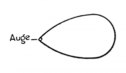\</td>
<td lang="en">For the field of sight has not a form like this: \</td>
<td lang="en"><em>外部版本參照：</em> Ludwig Wittgenstein, Tractatus Logico-Philosophicus, trans. D. F. Pears and B. F. McGuinness, 2nd ed. (Routledge, 2001), ISBN 9780415254083.；命題 <code>5.6331</code>；<a href="https://www.routledge.com/Tractatus-Logico-Philosophicus/Wittgenstein/p/book/9780415254083">來源</a></td>
<td lang="zh-Hant">因為視野並不具有如下圖那樣的形式。 <small><strong>哲學解讀：</strong> 圖中若把眼睛畫進視野，便錯把觀看界線當成視野內的一個可見項目。</small></td>
</tr>
<tr class="project-relations">
<td colspan="4">
<strong>Akashic 專案關係</strong>
<ul>
<li><code>not_applicable</code> — Akashic 目前不宣稱直接實作命題 5.6331 的哲學主張。 <small>理由：此命題的具體內容是：圖中若把眼睛畫進視野，便錯把觀看界線當成視野內的一個可見項目。專案現有 schema、資料與查詢行為不足以證成同一主張，硬套對應會誤導。</small>
</li>
</ul>
</td>
</tr>
<tr id="proposition-5-634">
<td colspan="4"><strong>5.634</strong></td>
</tr>
<tr id="segment-5-634-a">
<td lang="de">Das hängt damit zusammen, dass kein Teil unserer Erfahrung auch a priori ist.</td>
<td lang="en">This is connected with the fact that no part of our experience is also a priori.</td>
<td lang="en"><em>外部版本參照：</em> Ludwig Wittgenstein, Tractatus Logico-Philosophicus, trans. D. F. Pears and B. F. McGuinness, 2nd ed. (Routledge, 2001), ISBN 9780415254083.；命題 <code>5.634</code>；<a href="https://www.routledge.com/Tractatus-Logico-Philosophicus/Wittgenstein/p/book/9780415254083">來源</a></td>
<td lang="zh-Hant">這與我們經驗的任何部分都不是先於經驗的這項事實相連。 <small><strong>哲學解讀：</strong> 經驗內容沒有哪一塊因主體視點而成為不可更動的先驗事實。</small></td>
</tr>
<tr id="segment-5-634-b">
<td lang="de">Alles, was wir sehen, könnte auch anders sein.</td>
<td lang="en">Everything we see could also be otherwise.</td>
<td lang="en"><em>外部版本參照：</em> Ludwig Wittgenstein, Tractatus Logico-Philosophicus, trans. D. F. Pears and B. F. McGuinness, 2nd ed. (Routledge, 2001), ISBN 9780415254083.；命題 <code>5.634</code>；<a href="https://www.routledge.com/Tractatus-Logico-Philosophicus/Wittgenstein/p/book/9780415254083">來源</a></td>
<td lang="zh-Hant">我們看見的一切都可能是另一種樣子。 <small><strong>哲學解讀：</strong> 任何實際視覺配置都是偶然的，不由邏輯保證。</small></td>
</tr>
<tr id="segment-5-634-c">
<td lang="de">Alles, was wir überhaupt beschreiben können, könnte auch anders sein.</td>
<td lang="en">Everything we can describe at all could also be otherwise.</td>
<td lang="en"><em>外部版本參照：</em> Ludwig Wittgenstein, Tractatus Logico-Philosophicus, trans. D. F. Pears and B. F. McGuinness, 2nd ed. (Routledge, 2001), ISBN 9780415254083.；命題 <code>5.634</code>；<a href="https://www.routledge.com/Tractatus-Logico-Philosophicus/Wittgenstein/p/book/9780415254083">來源</a></td>
<td lang="zh-Hant">凡我們能描述的，也都可能是另一種樣子。 <small><strong>哲學解讀：</strong> 有意義命題必須容許真假，因此其所描述情形可以不成立。</small></td>
</tr>
<tr id="segment-5-634-d">
<td lang="de">Es gibt keine Ordnung der Dinge a priori.</td>
<td lang="en">There is no order of things a priori.</td>
<td lang="en"><em>外部版本參照：</em> Ludwig Wittgenstein, Tractatus Logico-Philosophicus, trans. D. F. Pears and B. F. McGuinness, 2nd ed. (Routledge, 2001), ISBN 9780415254083.；命題 <code>5.634</code>；<a href="https://www.routledge.com/Tractatus-Logico-Philosophicus/Wittgenstein/p/book/9780415254083">來源</a></td>
<td lang="zh-Hant">事物並沒有先於經驗的秩序。 <small><strong>哲學解讀：</strong> 具體世界秩序不能由純邏輯預先讀出。</small></td>
</tr>
<tr class="project-relations">
<td colspan="4">
<strong>Akashic 專案關係</strong>
<ul>
<li><code>not_applicable</code> — Akashic 目前不宣稱直接實作命題 5.634 的哲學主張。 <small>理由：此命題的具體內容是：經驗內容沒有哪一塊因主體視點而成為不可更動的先驗事實；任何實際視覺配置都是偶然的，不由邏輯保證；有意義命題必須容許真假，因此其所描述情形可以不成立；具體世界秩序不能由純邏輯預先讀出。專案現有 schema、資料與查詢行為不足以證成同一主張，硬套對應會誤導。</small>
</li>
</ul>
</td>
</tr>
<tr id="proposition-5-64">
<td colspan="4"><strong>5.64</strong></td>
</tr>
<tr id="segment-5-64-a">
<td lang="de">Hier sieht man, dass der Solipsismus, streng durchgeführt, mit dem reinen Realismus zusammenfällt.</td>
<td lang="en">Here we see that solipsism strictly carried out coincides with pure realism.</td>
<td lang="en"><em>外部版本參照：</em> Ludwig Wittgenstein, Tractatus Logico-Philosophicus, trans. D. F. Pears and B. F. McGuinness, 2nd ed. (Routledge, 2001), ISBN 9780415254083.；命題 <code>5.64</code>；<a href="https://www.routledge.com/Tractatus-Logico-Philosophicus/Wittgenstein/p/book/9780415254083">來源</a></td>
<td lang="zh-Hant">在此可見，貫徹到底的唯我論與純粹實在論重合。 <small><strong>哲學解讀：</strong> 唯我論若不再把我當世界內唯一實體，就不會排除世界中任何現實。</small></td>
</tr>
<tr id="segment-5-64-b">
<td lang="de">Das Ich des Solipsismus schrumpft zum ausdehnungslosen Punkt zusammen, und es bleibt die ihm koordinierte Realität.</td>
<td lang="en">The I in solipsism shrinks to an extensionless point and there remains the reality co-ordinated with it.</td>
<td lang="en"><em>外部版本參照：</em> Ludwig Wittgenstein, Tractatus Logico-Philosophicus, trans. D. F. Pears and B. F. McGuinness, 2nd ed. (Routledge, 2001), ISBN 9780415254083.；命題 <code>5.64</code>；<a href="https://www.routledge.com/Tractatus-Logico-Philosophicus/Wittgenstein/p/book/9780415254083">來源</a></td>
<td lang="zh-Hant">唯我論的我縮成一個沒有延展的點，留下與它相對應的現實。 <small><strong>哲學解讀：</strong> 我只作為世界的無延展視點與界線保留，世界本身則完整留下。</small></td>
</tr>
<tr class="project-relations">
<td colspan="4">
<strong>Akashic 專案關係</strong>
<ul>
<li><code>not_applicable</code> — Akashic 目前不宣稱直接實作命題 5.64 的哲學主張。 <small>理由：此命題的具體內容是：一旦不把「我」當作世界內實體，唯我論只留下世界及其無延展視點，因而與承認全部現實的實在論重合。專案現有 schema、資料與查詢行為不足以證成同一主張，硬套對應會誤導。</small>
</li>
</ul>
</td>
</tr>
<tr id="proposition-5-641">
<td colspan="4"><strong>5.641</strong></td>
</tr>
<tr id="segment-5-641-a">
<td lang="de">Es gibt also wirklich einen Sinn, in welchem in der Philosophie nicht-psychologisch vom Ich die Rede sein kann.</td>
<td lang="en">There is therefore really a sense in which in philosophy we can talk of a non-psychological I.</td>
<td lang="en"><em>外部版本參照：</em> Ludwig Wittgenstein, Tractatus Logico-Philosophicus, trans. D. F. Pears and B. F. McGuinness, 2nd ed. (Routledge, 2001), ISBN 9780415254083.；命題 <code>5.641</code>；<a href="https://www.routledge.com/Tractatus-Logico-Philosophicus/Wittgenstein/p/book/9780415254083">來源</a></td>
<td lang="zh-Hant">因此，確實有一種意義容許我們在哲學中談非心理學的我。 <small><strong>哲學解讀：</strong> 哲學可談的不是經驗心理特徵，而是世界以第一人稱具有界線這件事。</small></td>
</tr>
<tr id="segment-5-641-b">
<td lang="de">Das Ich tritt in die Philosophie dadurch ein, dass die „Welt meine Welt ist“.</td>
<td lang="en">The I occurs in philosophy through the fact that the “world is my world”.</td>
<td lang="en"><em>外部版本參照：</em> Ludwig Wittgenstein, Tractatus Logico-Philosophicus, trans. D. F. Pears and B. F. McGuinness, 2nd ed. (Routledge, 2001), ISBN 9780415254083.；命題 <code>5.641</code>；<a href="https://www.routledge.com/Tractatus-Logico-Philosophicus/Wittgenstein/p/book/9780415254083">來源</a></td>
<td lang="zh-Hant">我之所以進入哲學，是因為「世界是我的世界」。 <small><strong>哲學解讀：</strong> 「我」出現於世界與可理解語言的界線重合，而非作為新增的世界內對象。</small></td>
</tr>
<tr id="segment-5-641-c">
<td lang="de">Das philosophische Ich ist nicht der Mensch, nicht der menschliche Körper, oder die menschliche Seele, von der die Psychologie handelt, sondern das metaphysische Subjekt, die Grenze – nicht ein Teil der Welt.</td>
<td lang="en">The philosophical I is not the man, not the human body or the human soul of which psychology treats, but the metaphysical subject, the limit—not a part of the world.</td>
<td lang="en"><em>外部版本參照：</em> Ludwig Wittgenstein, Tractatus Logico-Philosophicus, trans. D. F. Pears and B. F. McGuinness, 2nd ed. (Routledge, 2001), ISBN 9780415254083.；命題 <code>5.641</code>；<a href="https://www.routledge.com/Tractatus-Logico-Philosophicus/Wittgenstein/p/book/9780415254083">來源</a></td>
<td lang="zh-Hant">哲學的我不是人，不是人的身體，也不是心理學所處理的人的靈魂；它是形上主體，是世界的界限，而不是世界的一部分。 <small><strong>哲學解讀：</strong> 結論明確區分經驗中的人與形上主體：前者可描述，後者只標示描述整體的界線。</small></td>
</tr>
<tr class="project-relations">
<td colspan="4">
<strong>Akashic 專案關係</strong>
<ul>
<li><code>not_applicable</code> — Akashic 目前不宣稱直接實作命題 5.641 的哲學主張。 <small>理由：此命題的具體內容是：哲學可談的不是經驗心理特徵，而是世界以第一人稱具有界線這件事；「我」出現於世界與可理解語言的界線重合，而非作為新增的世界內對象；結論明確區分經驗中的人與形上主體：前者可描述，後者只標示描述整體的界線。專案現有 schema、資料與查詢行為不足以證成同一主張，硬套對應會誤導。</small>
</li>
</ul>
</td>
</tr>
</tbody>
</table>

## 命題 6

<table>
<thead>
<tr>
<th scope="col">德文原文</th>
<th scope="col">Ogden／Ramsey 1922</th>
<th scope="col">Pears／McGuinness</th>
<th scope="col">臺灣正體中文</th>
</tr>
</thead>
<tbody>
<tr id="proposition-6">
<td colspan="4"><strong>6</strong></td>
</tr>
<tr id="segment-6-a">
<td lang="de">Die allgemeine Form der Wahrheitsfunktion ist: \ .</td>
<td lang="en">The general form of truth-function is: \ .</td>
<td lang="en"><em>外部版本參照：</em> Ludwig Wittgenstein, Tractatus Logico-Philosophicus, trans. D. F. Pears and B. F. McGuinness, 2nd ed. (Routledge, 2001), ISBN 9780415254083.；命題 <code>6</code>；<a href="https://www.routledge.com/Tractatus-Logico-Philosophicus/Wittgenstein/p/book/9780415254083">來源</a></td>
<td lang="zh-Hant">真值函數的一般形式是來源所列的三項式。 <small><strong>哲學解讀：</strong> 公式以基本命題、命題值的選取與否定運算概括真值函數；它不是程式函式簽章。</small></td>
</tr>
<tr id="segment-6-b">
<td lang="de">Dies ist die allgemeine Form des Satzes.</td>
<td lang="en">This is the general form of proposition.</td>
<td lang="en"><em>外部版本參照：</em> Ludwig Wittgenstein, Tractatus Logico-Philosophicus, trans. D. F. Pears and B. F. McGuinness, 2nd ed. (Routledge, 2001), ISBN 9780415254083.；命題 <code>6</code>；<a href="https://www.routledge.com/Tractatus-Logico-Philosophicus/Wittgenstein/p/book/9780415254083">來源</a></td>
<td lang="zh-Hant">這就是命題的一般形式。 <small><strong>哲學解讀：</strong> 第二句把前式提升為一切命題的形式主張，不是某類經驗句的範本。</small></td>
</tr>
<tr class="project-relations">
<td colspan="4">
<strong>Akashic 專案關係</strong>
<ul>
<li><code>not_applicable</code> — Akashic 目前不主張命題 6 關於邏輯命題、真值運算或形式證明的論旨具有直接軟體實作對應。 <small>理由：命題 6 的直接論旨是「真值函數的一般形式是來源所列的三項式。」；這句處理真值函數、重言式、符號形式或邏輯證明；Akashic 的 schema 與程式運算只規範專案資料，不能據此冒充相同的邏輯形式。</small>
</li>
</ul>
</td>
</tr>
<tr id="proposition-6-001">
<td colspan="4"><strong>6.001</strong></td>
</tr>
<tr id="segment-6-001-a">
<td lang="de">Dies sagt nichts anderes, als dass jeder Satz ein Resultat der successiven Anwendung der Operation \  auf die Elementarsätze ist.</td>
<td lang="en">This says nothing else than that every proposition is the result of successive applications of the operation \  to the elementary propositions.</td>
<td lang="en"><em>外部版本參照：</em> Ludwig Wittgenstein, Tractatus Logico-Philosophicus, trans. D. F. Pears and B. F. McGuinness, 2nd ed. (Routledge, 2001), ISBN 9780415254083.；命題 <code>6.001</code>；<a href="https://www.routledge.com/Tractatus-Logico-Philosophicus/Wittgenstein/p/book/9780415254083">來源</a></td>
<td lang="zh-Hant">這無非是說，每一命題都是把運算 N 逐次施用於基本命題所得的結果。 <small><strong>哲學解讀：</strong> 「逐次施用」描述真值函數的生成；不能只因軟體也有反覆運算，就宣稱兩者相同。</small></td>
</tr>
<tr class="project-relations">
<td colspan="4">
<strong>Akashic 專案關係</strong>
<ul>
<li><code>not_applicable</code> — Akashic 目前不主張命題 6.001 關於邏輯命題、真值運算或形式證明的論旨具有直接軟體實作對應。 <small>理由：命題 6.001 的直接論旨是「這無非是說，每一命題都是把運算 N 逐次施用於基本命題所得的結果。」；這句處理真值函數、重言式、符號形式或邏輯證明；Akashic 的 schema 與程式運算只規範專案資料，不能據此冒充相同的邏輯形式。</small>
</li>
</ul>
</td>
</tr>
<tr id="proposition-6-002">
<td colspan="4"><strong>6.002</strong></td>
</tr>
<tr id="segment-6-002-a">
<td lang="de">Ist die allgemeine Form gegeben, wie ein Satz gebaut ist, so ist damit auch schon die allgemeine Form davon gegeben, wie aus einem Satz durch eine Operation ein anderer erzeugt werden kann.</td>
<td lang="en">If we are given the general form of the way in which a proposition is constructed, then thereby we are also given the general form of the way in which by an operation out of one proposition another can be created.</td>
<td lang="en"><em>外部版本參照：</em> Ludwig Wittgenstein, Tractatus Logico-Philosophicus, trans. D. F. Pears and B. F. McGuinness, 2nd ed. (Routledge, 2001), ISBN 9780415254083.；命題 <code>6.002</code>；<a href="https://www.routledge.com/Tractatus-Logico-Philosophicus/Wittgenstein/p/book/9780415254083">來源</a></td>
<td lang="zh-Hant">一旦給出命題如何構成的一般形式，也就同時給出了如何藉運算從一個命題產生另一個命題的一般形式。 <small><strong>哲學解讀：</strong> 命題構成與運算生成在此共同受邏輯形式規定，不是一般資料轉換流程。</small></td>
</tr>
<tr class="project-relations">
<td colspan="4">
<strong>Akashic 專案關係</strong>
<ul>
<li><code>not_applicable</code> — Akashic 目前不主張命題 6.002 關於邏輯命題、真值運算或形式證明的論旨具有直接軟體實作對應。 <small>理由：命題 6.002 的直接論旨是「一旦給出命題如何構成的一般形式，也就同時給出了如何藉運算從一個命題產生另一個命題的一般形式。」；這句處理真值函數、重言式、符號形式或邏輯證明；Akashic 的 schema 與程式運算只規範專案資料，不能據此冒充相同的邏輯形式。</small>
</li>
</ul>
</td>
</tr>
<tr id="proposition-6-01">
<td colspan="4"><strong>6.01</strong></td>
</tr>
<tr id="segment-6-01-a">
<td lang="de">Die allgemeine Form der Operation \  ist also: 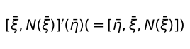\ .</td>
<td lang="en">The general form of the operation \  is therefore: \ .</td>
<td lang="en"><em>外部版本參照：</em> Ludwig Wittgenstein, Tractatus Logico-Philosophicus, trans. D. F. Pears and B. F. McGuinness, 2nd ed. (Routledge, 2001), ISBN 9780415254083.；命題 <code>6.01</code>；<a href="https://www.routledge.com/Tractatus-Logico-Philosophicus/Wittgenstein/p/book/9780415254083">來源</a></td>
<td lang="zh-Hant">因此，運算 Ω′ 的一般形式如來源公式所示。 <small><strong>哲學解讀：</strong> 公式描述運算如何作用於命題值，其抽象層次高於具體程式操作。</small></td>
</tr>
<tr id="segment-6-01-b">
<td lang="de">Das ist die allgemeinste Form des Überganges von einem Satz zum anderen.</td>
<td lang="en">This is the most general form of transition from one proposition to another.</td>
<td lang="en"><em>外部版本參照：</em> Ludwig Wittgenstein, Tractatus Logico-Philosophicus, trans. D. F. Pears and B. F. McGuinness, 2nd ed. (Routledge, 2001), ISBN 9780415254083.；命題 <code>6.01</code>；<a href="https://www.routledge.com/Tractatus-Logico-Philosophicus/Wittgenstein/p/book/9780415254083">來源</a></td>
<td lang="zh-Hant">這是從一個命題過渡到另一個命題的最一般形式。 <small><strong>哲學解讀：</strong> 「最一般」限於《論考》的命題生成架構，不能直接移植成 Akashic API。</small></td>
</tr>
<tr class="project-relations">
<td colspan="4">
<strong>Akashic 專案關係</strong>
<ul>
<li><code>not_applicable</code> — Akashic 目前不主張命題 6.01 關於邏輯命題、真值運算或形式證明的論旨具有直接軟體實作對應。 <small>理由：命題 6.01 的直接論旨是「因此，運算 Ω′ 的一般形式如來源公式所示。」；這句處理真值函數、重言式、符號形式或邏輯證明；Akashic 的 schema 與程式運算只規範專案資料，不能據此冒充相同的邏輯形式。</small>
</li>
</ul>
</td>
</tr>
<tr id="proposition-6-02">
<td colspan="4"><strong>6.02</strong></td>
</tr>
<tr id="segment-6-02-a">
<td lang="de">Und so kommen wir zu den Zahlen:</td>
<td lang="en">And thus we come to numbers:</td>
<td lang="en"><em>外部版本參照：</em> Ludwig Wittgenstein, Tractatus Logico-Philosophicus, trans. D. F. Pears and B. F. McGuinness, 2nd ed. (Routledge, 2001), ISBN 9780415254083.；命題 <code>6.02</code>；<a href="https://www.routledge.com/Tractatus-Logico-Philosophicus/Wittgenstein/p/book/9780415254083">來源</a></td>
<td lang="zh-Hant">於是我們來到數。 <small><strong>哲學解讀：</strong> 這個過渡把前述運算序列轉入數的討論；它尚未把數當成另添的一類對象。</small></td>
</tr>
<tr id="segment-6-02-b">
<td lang="de">Ich definiere 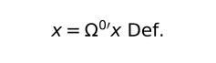\  und 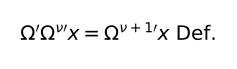\</td>
<td lang="en">I define \  and \</td>
<td lang="en"><em>外部版本參照：</em> Ludwig Wittgenstein, Tractatus Logico-Philosophicus, trans. D. F. Pears and B. F. McGuinness, 2nd ed. (Routledge, 2001), ISBN 9780415254083.；命題 <code>6.02</code>；<a href="https://www.routledge.com/Tractatus-Logico-Philosophicus/Wittgenstein/p/book/9780415254083">來源</a></td>
<td lang="zh-Hant">我作如下定義：第一式把 x 定為 Ω 的零次施用，第二式把再施用一次 Ω 定為指數的後繼。 <small><strong>哲學解讀：</strong> 兩條遞迴式分別給出基底與後繼，必須合讀為同一個定義步驟，並非兩項經驗等式。</small></td>
</tr>
<tr id="segment-6-02-c">
<td lang="de">Nach diesen Zeichenregeln schreiben wir also die Reihe 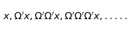\</td>
<td lang="en">According, then, to these symbolic rules we write the series \</td>
<td lang="en"><em>外部版本參照：</em> Ludwig Wittgenstein, Tractatus Logico-Philosophicus, trans. D. F. Pears and B. F. McGuinness, 2nd ed. (Routledge, 2001), ISBN 9780415254083.；命題 <code>6.02</code>；<a href="https://www.routledge.com/Tractatus-Logico-Philosophicus/Wittgenstein/p/book/9780415254083">來源</a></td>
<td lang="zh-Hant">依這些記號規則，我們把 x、Ω′x、Ω′Ω′x 等寫成一個序列。 <small><strong>哲學解讀：</strong> 原序列把反覆操作直接展開。</small></td>
</tr>
<tr id="segment-6-02-d">
<td lang="de">so: 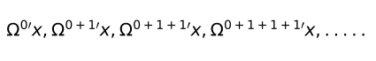\</td>
<td lang="en">as: \</td>
<td lang="en"><em>外部版本參照：</em> Ludwig Wittgenstein, Tractatus Logico-Philosophicus, trans. D. F. Pears and B. F. McGuinness, 2nd ed. (Routledge, 2001), ISBN 9780415254083.；命題 <code>6.02</code>；<a href="https://www.routledge.com/Tractatus-Logico-Philosophicus/Wittgenstein/p/book/9780415254083">來源</a></td>
<td lang="zh-Hant">也就是把它們改寫成以零與連續加一標示的指數序列。 <small><strong>哲學解讀：</strong> 新記法以指數記錄反覆次數，讓數的位置可見。</small></td>
</tr>
<tr id="segment-6-02-e">
<td lang="de">Also schreibe ich statt „\ “:</td>
<td lang="en">Therefore I write in place of “\ ”,</td>
<td lang="en"><em>外部版本參照：</em> Ludwig Wittgenstein, Tractatus Logico-Philosophicus, trans. D. F. Pears and B. F. McGuinness, 2nd ed. (Routledge, 2001), ISBN 9780415254083.；命題 <code>6.02</code>；<a href="https://www.routledge.com/Tractatus-Logico-Philosophicus/Wittgenstein/p/book/9780415254083">來源</a></td>
<td lang="zh-Hant">所以我以含 x、ξ 與 Ω′ξ 的序列記法為起點，改用下一式。 <small><strong>哲學解讀：</strong> 這句說明被替換的舊序列形式。</small></td>
</tr>
<tr id="segment-6-02-f">
<td lang="de">„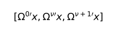\ “.</td>
<td lang="en">“\ ”.</td>
<td lang="en"><em>外部版本參照：</em> Ludwig Wittgenstein, Tractatus Logico-Philosophicus, trans. D. F. Pears and B. F. McGuinness, 2nd ed. (Routledge, 2001), ISBN 9780415254083.；命題 <code>6.02</code>；<a href="https://www.routledge.com/Tractatus-Logico-Philosophicus/Wittgenstein/p/book/9780415254083">來源</a></td>
<td lang="zh-Hant">改寫後的序列以 Ω 的零次、ν 次與 ν 加一次施用表示。 <small><strong>哲學解讀：</strong> 此式是新記法的通式，不是經驗等式。</small></td>
</tr>
<tr id="segment-6-02-g">
<td lang="de">Und definiere:</td>
<td lang="en">And I define:</td>
<td lang="en"><em>外部版本參照：</em> Ludwig Wittgenstein, Tractatus Logico-Philosophicus, trans. D. F. Pears and B. F. McGuinness, 2nd ed. (Routledge, 2001), ISBN 9780415254083.；命題 <code>6.02</code>；<a href="https://www.routledge.com/Tractatus-Logico-Philosophicus/Wittgenstein/p/book/9780415254083">來源</a></td>
<td lang="zh-Hant">並作如下定義。 <small><strong>哲學解讀：</strong> 接下來只是為常用數字命名。</small></td>
</tr>
<tr id="segment-6-02-h">
<td lang="de">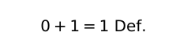\</td>
<td lang="en">\</td>
<td lang="en"><em>外部版本參照：</em> Ludwig Wittgenstein, Tractatus Logico-Philosophicus, trans. D. F. Pears and B. F. McGuinness, 2nd ed. (Routledge, 2001), ISBN 9780415254083.；命題 <code>6.02</code>；<a href="https://www.routledge.com/Tractatus-Logico-Philosophicus/Wittgenstein/p/book/9780415254083">來源</a></td>
<td lang="zh-Hant">零加一被定義為一。 <small><strong>哲學解讀：</strong> 「一」記錄一次後繼。</small></td>
</tr>
<tr id="segment-6-02-i">
<td lang="de">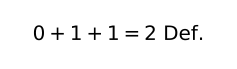\</td>
<td lang="en">\</td>
<td lang="en"><em>外部版本參照：</em> Ludwig Wittgenstein, Tractatus Logico-Philosophicus, trans. D. F. Pears and B. F. McGuinness, 2nd ed. (Routledge, 2001), ISBN 9780415254083.；命題 <code>6.02</code>；<a href="https://www.routledge.com/Tractatus-Logico-Philosophicus/Wittgenstein/p/book/9780415254083">來源</a></td>
<td lang="zh-Hant">零連加兩次一被定義為二。 <small><strong>哲學解讀：</strong> 「二」記錄兩次後繼。</small></td>
</tr>
<tr id="segment-6-02-j">
<td lang="de">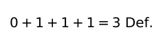\</td>
<td lang="en">\</td>
<td lang="en"><em>外部版本參照：</em> Ludwig Wittgenstein, Tractatus Logico-Philosophicus, trans. D. F. Pears and B. F. McGuinness, 2nd ed. (Routledge, 2001), ISBN 9780415254083.；命題 <code>6.02</code>；<a href="https://www.routledge.com/Tractatus-Logico-Philosophicus/Wittgenstein/p/book/9780415254083">來源</a></td>
<td lang="zh-Hant">零連加三次一被定義為三。 <small><strong>哲學解讀：</strong> 「三」記錄三次後繼。</small></td>
</tr>
<tr id="segment-6-02-k">
<td lang="de">\(u. s. f.)</td>
<td lang="en">\(and so on.)</td>
<td lang="en"><em>外部版本參照：</em> Ludwig Wittgenstein, Tractatus Logico-Philosophicus, trans. D. F. Pears and B. F. McGuinness, 2nd ed. (Routledge, 2001), ISBN 9780415254083.；命題 <code>6.02</code>；<a href="https://www.routledge.com/Tractatus-Logico-Philosophicus/Wittgenstein/p/book/9780415254083">來源</a></td>
<td lang="zh-Hant">如此類推。 <small><strong>哲學解讀：</strong> 省略號延伸同一規則，未引入新的數學對象。</small></td>
</tr>
<tr class="project-relations">
<td colspan="4">
<strong>Akashic 專案關係</strong>
<ul>
<li><code>not_applicable</code> — Akashic 目前不主張命題 6.02 關於邏輯命題、真值運算或形式證明的論旨具有直接軟體實作對應。 <small>理由：命題 6.02 從運算序列過渡到數，並以零次施用與後繼式定義其記法；這是《論考》的數與運算形式，不是程式整數型別或一般遞迴 API。Akashic 的 schema 與程式運算只規範專案資料，不能冒充相同的邏輯形式。</small>
</li>
</ul>
</td>
</tr>
<tr id="proposition-6-021">
<td colspan="4"><strong>6.021</strong></td>
</tr>
<tr id="segment-6-021-a">
<td lang="de">Die Zahl ist der Exponent einer Operation.</td>
<td lang="en">A number is the exponent of an operation.</td>
<td lang="en"><em>外部版本參照：</em> Ludwig Wittgenstein, Tractatus Logico-Philosophicus, trans. D. F. Pears and B. F. McGuinness, 2nd ed. (Routledge, 2001), ISBN 9780415254083.；命題 <code>6.021</code>；<a href="https://www.routledge.com/Tractatus-Logico-Philosophicus/Wittgenstein/p/book/9780415254083">來源</a></td>
<td lang="zh-Hant">數是運算的指數。 <small><strong>哲學解讀：</strong> 數被理解為運算施行多少次的標誌；這是《論考》的數概念，不等於程式整數型別。</small></td>
</tr>
<tr class="project-relations">
<td colspan="4">
<strong>Akashic 專案關係</strong>
<ul>
<li><code>not_applicable</code> — Akashic 目前不主張命題 6.021 關於邏輯命題、真值運算或形式證明的論旨具有直接軟體實作對應。 <small>理由：命題 6.021 的直接論旨是「數是運算的指數。」；這句處理真值函數、重言式、符號形式或邏輯證明；Akashic 的 schema 與程式運算只規範專案資料，不能據此冒充相同的邏輯形式。</small>
</li>
</ul>
</td>
</tr>
<tr id="proposition-6-022">
<td colspan="4"><strong>6.022</strong></td>
</tr>
<tr id="segment-6-022-a">
<td lang="de">Der Zahlbegriff ist nichts anderes, als das Gemeinsame aller Zahlen, die allgemeine Form der Zahl.</td>
<td lang="en">The concept number is nothing else than that which is common to all numbers, the general form of number.</td>
<td lang="en"><em>外部版本參照：</em> Ludwig Wittgenstein, Tractatus Logico-Philosophicus, trans. D. F. Pears and B. F. McGuinness, 2nd ed. (Routledge, 2001), ISBN 9780415254083.；命題 <code>6.022</code>；<a href="https://www.routledge.com/Tractatus-Logico-Philosophicus/Wittgenstein/p/book/9780415254083">來源</a></td>
<td lang="zh-Hant">數概念無非是所有數的共同點，也就是數的一般形式。 <small><strong>哲學解讀：</strong> 共同形式而非個別數值構成「數」的概念。</small></td>
</tr>
<tr id="segment-6-022-b">
<td lang="de">Der Zahlbegriff ist die variable Zahl.</td>
<td lang="en">The concept number is the variable number.</td>
<td lang="en"><em>外部版本參照：</em> Ludwig Wittgenstein, Tractatus Logico-Philosophicus, trans. D. F. Pears and B. F. McGuinness, 2nd ed. (Routledge, 2001), ISBN 9780415254083.；命題 <code>6.022</code>；<a href="https://www.routledge.com/Tractatus-Logico-Philosophicus/Wittgenstein/p/book/9780415254083">來源</a></td>
<td lang="zh-Hant">數概念就是可變的數。 <small><strong>哲學解讀：</strong> 可變數表示能由不同數值占據的形式位置。</small></td>
</tr>
<tr id="segment-6-022-c">
<td lang="de">Und der Begriff der Zahlengleichheit ist die allgemeine Form aller speziellen Zahlengleichheiten.</td>
<td lang="en">And the concept of equality of numbers is the general form of all special equalities of numbers.</td>
<td lang="en"><em>外部版本參照：</em> Ludwig Wittgenstein, Tractatus Logico-Philosophicus, trans. D. F. Pears and B. F. McGuinness, 2nd ed. (Routledge, 2001), ISBN 9780415254083.；命題 <code>6.022</code>；<a href="https://www.routledge.com/Tractatus-Logico-Philosophicus/Wittgenstein/p/book/9780415254083">來源</a></td>
<td lang="zh-Hant">數相等的概念則是所有特殊數等式的一般形式。 <small><strong>哲學解讀：</strong> 數相等也由各具體等式共有的形式界定。</small></td>
</tr>
<tr class="project-relations">
<td colspan="4">
<strong>Akashic 專案關係</strong>
<ul>
<li><code>not_applicable</code> — Akashic 目前不主張命題 6.022 關於邏輯命題、真值運算或形式證明的論旨具有直接軟體實作對應。 <small>理由：命題 6.022 的直接論旨是「數概念無非是所有數的共同點，也就是數的一般形式。」；這句處理真值函數、重言式、符號形式或邏輯證明；Akashic 的 schema 與程式運算只規範專案資料，不能據此冒充相同的邏輯形式。</small>
</li>
</ul>
</td>
</tr>
<tr id="proposition-6-03">
<td colspan="4"><strong>6.03</strong></td>
</tr>
<tr id="segment-6-03-a">
<td lang="de">Die allgemeine Form der ganzen Zahl ist: 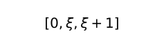\ .</td>
<td lang="en">The general form of the cardinal number is: [0, *ξ*, *ξ* + 1].</td>
<td lang="en"><em>外部版本參照：</em> Ludwig Wittgenstein, Tractatus Logico-Philosophicus, trans. D. F. Pears and B. F. McGuinness, 2nd ed. (Routledge, 2001), ISBN 9780415254083.；命題 <code>6.03</code>；<a href="https://www.routledge.com/Tractatus-Logico-Philosophicus/Wittgenstein/p/book/9780415254083">來源</a></td>
<td lang="zh-Hant">基數的一般形式是來源所列的零、任意數與後繼三項式。 <small><strong>哲學解讀：</strong> 這個三項式表示自然數序列的形式，不是宣稱所有數學只需一個資料結構。</small></td>
</tr>
<tr class="project-relations">
<td colspan="4">
<strong>Akashic 專案關係</strong>
<ul>
<li><code>not_applicable</code> — Akashic 目前不主張命題 6.03 關於邏輯命題、真值運算或形式證明的論旨具有直接軟體實作對應。 <small>理由：命題 6.03 的直接論旨是「基數的一般形式是來源所列的零、任意數與後繼三項式。」；這句處理真值函數、重言式、符號形式或邏輯證明；Akashic 的 schema 與程式運算只規範專案資料，不能據此冒充相同的邏輯形式。</small>
</li>
</ul>
</td>
</tr>
<tr id="proposition-6-031">
<td colspan="4"><strong>6.031</strong></td>
</tr>
<tr id="segment-6-031-a">
<td lang="de">Die Theorie der Klassen ist in der Mathematik ganz überflüssig.</td>
<td lang="en">The theory of classes is altogether superfluous in mathematics.</td>
<td lang="en"><em>外部版本參照：</em> Ludwig Wittgenstein, Tractatus Logico-Philosophicus, trans. D. F. Pears and B. F. McGuinness, 2nd ed. (Routledge, 2001), ISBN 9780415254083.；命題 <code>6.031</code>；<a href="https://www.routledge.com/Tractatus-Logico-Philosophicus/Wittgenstein/p/book/9780415254083">來源</a></td>
<td lang="zh-Hant">類別理論在數學中完全是多餘的。 <small><strong>哲學解讀：</strong> 這是維根斯坦對當時基礎論的強主張，不是現代數學的中立共識。</small></td>
</tr>
<tr id="segment-6-031-b">
<td lang="de">Dies hängt damit zusammen, dass die Allgemeinheit, welche wir in der Mathematik brauchen, nicht die *zufällige* ist.</td>
<td lang="en">This is connected with the fact that the generality which we need in mathematics is not the *accidental* one.</td>
<td lang="en"><em>外部版本參照：</em> Ludwig Wittgenstein, Tractatus Logico-Philosophicus, trans. D. F. Pears and B. F. McGuinness, 2nd ed. (Routledge, 2001), ISBN 9780415254083.；命題 <code>6.031</code>；<a href="https://www.routledge.com/Tractatus-Logico-Philosophicus/Wittgenstein/p/book/9780415254083">來源</a></td>
<td lang="zh-Hant">這與數學所需的普遍性不是偶然普遍性有關。 <small><strong>哲學解讀：</strong> 他把數學普遍性理解為形式必要，而非碰巧涵蓋所有個案。</small></td>
</tr>
<tr class="project-relations">
<td colspan="4">
<strong>Akashic 專案關係</strong>
<ul>
<li><code>not_applicable</code> — Akashic 目前不主張命題 6.031 關於邏輯命題、真值運算或形式證明的論旨具有直接軟體實作對應。 <small>理由：命題 6.031 的直接論旨是「類別理論在數學中完全是多餘的。」；這句處理真值函數、重言式、符號形式或邏輯證明；Akashic 的 schema 與程式運算只規範專案資料，不能據此冒充相同的邏輯形式。</small>
</li>
</ul>
</td>
</tr>
<tr id="proposition-6-1">
<td colspan="4"><strong>6.1</strong></td>
</tr>
<tr id="segment-6-1-a">
<td lang="de">Die Sätze der Logik sind Tautologien.</td>
<td lang="en">The propositions of logic are tautologies.</td>
<td lang="en"><em>外部版本參照：</em> Ludwig Wittgenstein, Tractatus Logico-Philosophicus, trans. D. F. Pears and B. F. McGuinness, 2nd ed. (Routledge, 2001), ISBN 9780415254083.；命題 <code>6.1</code>；<a href="https://www.routledge.com/Tractatus-Logico-Philosophicus/Wittgenstein/p/book/9780415254083">來源</a></td>
<td lang="zh-Hant">邏輯命題是重言式。 <small><strong>哲學解讀：</strong> 重言式不排除任何可能事態，因此不報導世界中的一項偶然事實。</small></td>
</tr>
<tr class="project-relations">
<td colspan="4">
<strong>Akashic 專案關係</strong>
<ul>
<li><code>not_applicable</code> — Akashic 目前不主張命題 6.1 關於邏輯命題、真值運算或形式證明的論旨具有直接軟體實作對應。 <small>理由：命題 6.1 的直接論旨是「邏輯命題是重言式。」；這句處理真值函數、重言式、符號形式或邏輯證明；Akashic 的 schema 與程式運算只規範專案資料，不能據此冒充相同的邏輯形式。</small>
</li>
</ul>
</td>
</tr>
<tr id="proposition-6-11">
<td colspan="4"><strong>6.11</strong></td>
</tr>
<tr id="segment-6-11-a">
<td lang="de">Die Sätze der Logik sagen also Nichts.</td>
<td lang="en">The propositions of logic therefore say nothing.</td>
<td lang="en"><em>外部版本參照：</em> Ludwig Wittgenstein, Tractatus Logico-Philosophicus, trans. D. F. Pears and B. F. McGuinness, 2nd ed. (Routledge, 2001), ISBN 9780415254083.；命題 <code>6.11</code>；<a href="https://www.routledge.com/Tractatus-Logico-Philosophicus/Wittgenstein/p/book/9780415254083">來源</a></td>
<td lang="zh-Hant">所以邏輯命題什麼也不說。 <small><strong>哲學解讀：</strong> 「什麼也不說」指重言式不切分可能事態，不是字串空白。</small></td>
</tr>
<tr id="segment-6-11-b">
<td lang="de">(Sie sind die analytischen Sätze.)</td>
<td lang="en">(They are the analytical propositions.)</td>
<td lang="en"><em>外部版本參照：</em> Ludwig Wittgenstein, Tractatus Logico-Philosophicus, trans. D. F. Pears and B. F. McGuinness, 2nd ed. (Routledge, 2001), ISBN 9780415254083.；命題 <code>6.11</code>；<a href="https://www.routledge.com/Tractatus-Logico-Philosophicus/Wittgenstein/p/book/9780415254083">來源</a></td>
<td lang="zh-Hant">（它們是分析命題。） <small><strong>哲學解讀：</strong> 括號把這種無經驗內容的地位稱為分析性。</small></td>
</tr>
<tr class="project-relations">
<td colspan="4">
<strong>Akashic 專案關係</strong>
<ul>
<li><code>not_applicable</code> — Akashic 目前不主張命題 6.11 關於邏輯命題、真值運算或形式證明的論旨具有直接軟體實作對應。 <small>理由：命題 6.11 的直接論旨是「所以邏輯命題什麼也不說。」；這句處理真值函數、重言式、符號形式或邏輯證明；Akashic 的 schema 與程式運算只規範專案資料，不能據此冒充相同的邏輯形式。</small>
</li>
</ul>
</td>
</tr>
<tr id="proposition-6-111">
<td colspan="4"><strong>6.111</strong></td>
</tr>
<tr id="segment-6-111-a">
<td lang="de">Theorien, die einen Satz der Logik gehaltvoll erscheinen lassen, sind immer falsch.</td>
<td lang="en">Theories which make a proposition of logic appear substantial are always false.</td>
<td lang="en"><em>外部版本參照：</em> Ludwig Wittgenstein, Tractatus Logico-Philosophicus, trans. D. F. Pears and B. F. McGuinness, 2nd ed. (Routledge, 2001), ISBN 9780415254083.；命題 <code>6.111</code>；<a href="https://www.routledge.com/Tractatus-Logico-Philosophicus/Wittgenstein/p/book/9780415254083">來源</a></td>
<td lang="zh-Hant">任何使邏輯命題看似有實質內容的理論總是錯的。 <small><strong>哲學解讀：</strong> 邏輯真不是另一項可觀察性質。</small></td>
</tr>
<tr id="segment-6-111-b">
<td lang="de">Man könnte z. B. glauben, dass die Worte „wahr“ und „falsch“ zwei Eigenschaften unter anderen Eigenschaften bezeichnen, und da erschiene es als eine merkwürdige Tatsache, dass jeder Satz eine dieser Eigenschaften besitzt.</td>
<td lang="en">One could *e.g.* believe that the words “true” and “false” signify two properties among other properties, and then it would appear as a remarkable fact that every proposition possesses one of these properties.</td>
<td lang="en"><em>外部版本參照：</em> Ludwig Wittgenstein, Tractatus Logico-Philosophicus, trans. D. F. Pears and B. F. McGuinness, 2nd ed. (Routledge, 2001), ISBN 9780415254083.；命題 <code>6.111</code>；<a href="https://www.routledge.com/Tractatus-Logico-Philosophicus/Wittgenstein/p/book/9780415254083">來源</a></td>
<td lang="zh-Hant">人們可能以為「真」與「假」像其他性質一樣，於是每個命題具有其中一種性質就顯得奇特。 <small><strong>哲學解讀：</strong> 把真假當普通謂詞，會把形式條件誤作經驗分類。</small></td>
</tr>
<tr id="segment-6-111-c">
<td lang="de">Das scheint nun nichts weniger als selbstverständlich zu sein, ebensowenig selbstverständlich, wie etwa der Satz, „alle Rosen sind entweder gelb oder rot“ klänge, auch wenn er wahr wäre.</td>
<td lang="en">This now by no means appears self-evident, no more so than the proposition “All roses are either yellow or red” would sound even if it were true.</td>
<td lang="en"><em>外部版本參照：</em> Ludwig Wittgenstein, Tractatus Logico-Philosophicus, trans. D. F. Pears and B. F. McGuinness, 2nd ed. (Routledge, 2001), ISBN 9780415254083.；命題 <code>6.111</code>；<a href="https://www.routledge.com/Tractatus-Logico-Philosophicus/Wittgenstein/p/book/9780415254083">來源</a></td>
<td lang="zh-Hant">這絲毫不比「所有玫瑰不是黃的就是紅的」更不證自明，即使後者為真。 <small><strong>哲學解讀：</strong> 玫瑰例是偶然概括，不能說明重言式的必然性。</small></td>
</tr>
<tr id="segment-6-111-d">
<td lang="de">Ja, jener Satz bekommt nun ganz den Charakter eines naturwissenschaftlichen Satzes und dies ist das sichere Anzeichen dafür, dass er falsch aufgefasst wurde.</td>
<td lang="en">Indeed our proposition now gets quite the character of a proposition of natural science and this is a certain symptom of its being falsely understood.</td>
<td lang="en"><em>外部版本參照：</em> Ludwig Wittgenstein, Tractatus Logico-Philosophicus, trans. D. F. Pears and B. F. McGuinness, 2nd ed. (Routledge, 2001), ISBN 9780415254083.；命題 <code>6.111</code>；<a href="https://www.routledge.com/Tractatus-Logico-Philosophicus/Wittgenstein/p/book/9780415254083">來源</a></td>
<td lang="zh-Hant">當邏輯命題因此呈現自然科學命題的性格時，正顯示它已被誤解。 <small><strong>哲學解讀：</strong> 自然科學式讀法需要經驗內容，恰與邏輯命題的角色衝突。</small></td>
</tr>
<tr class="project-relations">
<td colspan="4">
<strong>Akashic 專案關係</strong>
<ul>
<li><code>not_applicable</code> — Akashic 目前不主張命題 6.111 關於邏輯命題、真值運算或形式證明的論旨具有直接軟體實作對應。 <small>理由：命題 6.111 的直接論旨是「任何使邏輯命題看似有實質內容的理論總是錯的。」；這句處理真值函數、重言式、符號形式或邏輯證明；Akashic 的 schema 與程式運算只規範專案資料，不能據此冒充相同的邏輯形式。</small>
</li>
</ul>
</td>
</tr>
<tr id="proposition-6-112">
<td colspan="4"><strong>6.112</strong></td>
</tr>
<tr id="segment-6-112-a">
<td lang="de">Die richtige Erklärung der logischen Sätze muss ihnen eine einzigartige Stellung unter allen Sätzen geben.</td>
<td lang="en">The correct explanation of logical propositions must give them a peculiar position among all propositions.</td>
<td lang="en"><em>外部版本參照：</em> Ludwig Wittgenstein, Tractatus Logico-Philosophicus, trans. D. F. Pears and B. F. McGuinness, 2nd ed. (Routledge, 2001), ISBN 9780415254083.；命題 <code>6.112</code>；<a href="https://www.routledge.com/Tractatus-Logico-Philosophicus/Wittgenstein/p/book/9780415254083">來源</a></td>
<td lang="zh-Hant">對邏輯命題的正確說明，必須使它們在所有命題中占有獨特地位。 <small><strong>哲學解讀：</strong> 獨特性來自形式與真值條件，不是較高權威或特殊資料標籤。</small></td>
</tr>
<tr class="project-relations">
<td colspan="4">
<strong>Akashic 專案關係</strong>
<ul>
<li><code>not_applicable</code> — Akashic 目前不主張命題 6.112 關於邏輯命題、真值運算或形式證明的論旨具有直接軟體實作對應。 <small>理由：命題 6.112 的直接論旨是「對邏輯命題的正確說明，必須使它們在所有命題中占有獨特地位。」；這句處理真值函數、重言式、符號形式或邏輯證明；Akashic 的 schema 與程式運算只規範專案資料，不能據此冒充相同的邏輯形式。</small>
</li>
</ul>
</td>
</tr>
<tr id="proposition-6-113">
<td colspan="4"><strong>6.113</strong></td>
</tr>
<tr id="segment-6-113-a">
<td lang="de">Es ist das besondere Merkmal der logischen Sätze, dass man am Symbol allein erkennen kann, dass sie wahr sind, und diese Tatsache schliesst die ganze Philosophie der Logik in sich.</td>
<td lang="en">It is the characteristic mark of logical propositions that one can perceive in the symbol alone that they are true; and this fact contains in itself the whole philosophy of logic.</td>
<td lang="en"><em>外部版本參照：</em> Ludwig Wittgenstein, Tractatus Logico-Philosophicus, trans. D. F. Pears and B. F. McGuinness, 2nd ed. (Routledge, 2001), ISBN 9780415254083.；命題 <code>6.113</code>；<a href="https://www.routledge.com/Tractatus-Logico-Philosophicus/Wittgenstein/p/book/9780415254083">來源</a></td>
<td lang="zh-Hant">邏輯命題的特徵，是只看符號本身就能認出它為真；這一事實包含整個邏輯哲學。 <small><strong>哲學解讀：</strong> 邏輯命題由符號形式顯示其重言性。</small></td>
</tr>
<tr id="segment-6-113-b">
<td lang="de">Und so ist es auch eine der wichtigsten Tatsachen, dass sich die Wahrheit oder Falschheit der nicht-logischen Sätze *nicht* am Satz allein erkennen lässt.</td>
<td lang="en">And so also it is one of the most important facts that the truth or falsehood of non-logical propositions can *not* be recognized from the propositions alone.</td>
<td lang="en"><em>外部版本參照：</em> Ludwig Wittgenstein, Tractatus Logico-Philosophicus, trans. D. F. Pears and B. F. McGuinness, 2nd ed. (Routledge, 2001), ISBN 9780415254083.；命題 <code>6.113</code>；<a href="https://www.routledge.com/Tractatus-Logico-Philosophicus/Wittgenstein/p/book/9780415254083">來源</a></td>
<td lang="zh-Hant">同樣重要的是，非邏輯命題的真假不能只由命題本身認出。 <small><strong>哲學解讀：</strong> 非邏輯命題仍須與現實比較，不能從句形直接讀出真假。</small></td>
</tr>
<tr class="project-relations">
<td colspan="4">
<strong>Akashic 專案關係</strong>
<ul>
<li><code>not_applicable</code> — Akashic 目前不主張命題 6.113 關於邏輯命題、真值運算或形式證明的論旨具有直接軟體實作對應。 <small>理由：命題 6.113 的直接論旨是「邏輯命題的特徵，是只看符號本身就能認出它為真；這一事實包含整個邏輯哲學。」；這句處理真值函數、重言式、符號形式或邏輯證明；Akashic 的 schema 與程式運算只規範專案資料，不能據此冒充相同的邏輯形式。</small>
</li>
</ul>
</td>
</tr>
<tr id="proposition-6-12">
<td colspan="4"><strong>6.12</strong></td>
</tr>
<tr id="segment-6-12-a">
<td lang="de">Dass die Sätze der Logik Tautologien sind, das *zeigt* die formalen – logischen – Eigenschaften der Sprache, der Welt.</td>
<td lang="en">The fact that the propositions of logic are tautologies *shows* the formal—logical—properties of language, of the world.</td>
<td lang="en"><em>外部版本參照：</em> Ludwig Wittgenstein, Tractatus Logico-Philosophicus, trans. D. F. Pears and B. F. McGuinness, 2nd ed. (Routledge, 2001), ISBN 9780415254083.；命題 <code>6.12</code>；<a href="https://www.routledge.com/Tractatus-Logico-Philosophicus/Wittgenstein/p/book/9780415254083">來源</a></td>
<td lang="zh-Hant">邏輯命題是重言式這件事，顯示了語言與世界的形式——邏輯——性質。 <small><strong>哲學解讀：</strong> 重言式不敘述形式性質，而由自身結構顯示它們。</small></td>
</tr>
<tr id="segment-6-12-b">
<td lang="de">Dass ihre Bestandteile *so* verknüpft eine Tautologie ergeben, das charakterisiert die Logik ihrer Bestandteile.</td>
<td lang="en">That its constituent parts connected together *in this way* give a tautology characterizes the logic of its constituent parts.</td>
<td lang="en"><em>外部版本參照：</em> Ludwig Wittgenstein, Tractatus Logico-Philosophicus, trans. D. F. Pears and B. F. McGuinness, 2nd ed. (Routledge, 2001), ISBN 9780415254083.；命題 <code>6.12</code>；<a href="https://www.routledge.com/Tractatus-Logico-Philosophicus/Wittgenstein/p/book/9780415254083">來源</a></td>
<td lang="zh-Hant">其組成部分如此連結而形成重言式，刻畫了這些部分的邏輯。 <small><strong>哲學解讀：</strong> 連結方式揭露組成命題間的邏輯關係。</small></td>
</tr>
<tr id="segment-6-12-c">
<td lang="de">Damit Sätze, auf bestimmte Art und Weise verknüpft, eine Tautologie ergeben, dazu müssen sie bestimmte Eigenschaften der Struktur haben.</td>
<td lang="en">In order that propositions connected together in a definite way may give a tautology they must have definite properties of structure.</td>
<td lang="en"><em>外部版本參照：</em> Ludwig Wittgenstein, Tractatus Logico-Philosophicus, trans. D. F. Pears and B. F. McGuinness, 2nd ed. (Routledge, 2001), ISBN 9780415254083.；命題 <code>6.12</code>；<a href="https://www.routledge.com/Tractatus-Logico-Philosophicus/Wittgenstein/p/book/9780415254083">來源</a></td>
<td lang="zh-Hant">命題以特定方式連結要形成重言式，就必須具有特定結構性質。 <small><strong>哲學解讀：</strong> 形成重言式的可能性依賴論元結構。</small></td>
</tr>
<tr id="segment-6-12-d">
<td lang="de">Dass sie *so* verbunden eine Tautologie ergeben, zeigt also, dass sie diese Eigenschaften der Struktur besitzen.</td>
<td lang="en">That they give a tautology when *so* connected shows therefore that they possess these properties of structure.</td>
<td lang="en"><em>外部版本參照：</em> Ludwig Wittgenstein, Tractatus Logico-Philosophicus, trans. D. F. Pears and B. F. McGuinness, 2nd ed. (Routledge, 2001), ISBN 9780415254083.；命題 <code>6.12</code>；<a href="https://www.routledge.com/Tractatus-Logico-Philosophicus/Wittgenstein/p/book/9780415254083">來源</a></td>
<td lang="zh-Hant">它們如此連結而成為重言式，正顯示它們具有這些結構性質。 <small><strong>哲學解讀：</strong> 最後一句以「顯示」取代另一層後設命題。</small></td>
</tr>
<tr class="project-relations">
<td colspan="4">
<strong>Akashic 專案關係</strong>
<ul>
<li><code>not_applicable</code> — Akashic 目前不主張命題 6.12 關於邏輯命題、真值運算或形式證明的論旨具有直接軟體實作對應。 <small>理由：命題 6.12 的直接論旨是「邏輯命題是重言式這件事，顯示了語言與世界的形式——邏輯——性質。」；這句處理真值函數、重言式、符號形式或邏輯證明；Akashic 的 schema 與程式運算只規範專案資料，不能據此冒充相同的邏輯形式。</small>
</li>
</ul>
</td>
</tr>
<tr id="proposition-6-1201">
<td colspan="4"><strong>6.1201</strong></td>
</tr>
<tr id="segment-6-1201-a">
<td lang="de">Dass z. B. die Sätze „*p*“ und „∼*p*“ in der Verbindung „∼(*p.*∼*p*)“ eine Tautologie ergeben, zeigt, dass sie einander widersprechen.</td>
<td lang="en">That *e.g.* the propositions “*p*” and “\~*p*” in the connexion “\~(*p* . \~*p*)” give a tautology shows that they contradict one another.</td>
<td lang="en"><em>外部版本參照：</em> Ludwig Wittgenstein, Tractatus Logico-Philosophicus, trans. D. F. Pears and B. F. McGuinness, 2nd ed. (Routledge, 2001), ISBN 9780415254083.；命題 <code>6.1201</code>；<a href="https://www.routledge.com/Tractatus-Logico-Philosophicus/Wittgenstein/p/book/9780415254083">來源</a></td>
<td lang="zh-Hant">例如，p 與 ∼p 在來源所列連結中形成重言式，顯示兩者互相矛盾。 <small><strong>哲學解讀：</strong> 第一個真值形式呈現矛盾關係，不靠經驗反例。</small></td>
</tr>
<tr id="segment-6-1201-b">
<td lang="de">Dass die Sätze „*p* ⊃ *q*“, „*p*“ und „*q*“ in der Form „(*p* ⊃ *q*)*.*(*p*) : ⊃ : (*q*)“ miteinander verbunden eine Tautologie ergeben, zeigt, dass *q* aus *p* und *p* ⊃ *q* folgt.</td>
<td lang="en">That the propositions “*p* ⊃ *q*”, “*p*” and “*q*” connected together in the form “(*p* ⊃ *q*) . (*p*) : ⊃ : (*q*)” give a tautology shows that “*q*” follows from “*p*” and “*p* ⊃ *q*”.</td>
<td lang="en"><em>外部版本參照：</em> Ludwig Wittgenstein, Tractatus Logico-Philosophicus, trans. D. F. Pears and B. F. McGuinness, 2nd ed. (Routledge, 2001), ISBN 9780415254083.；命題 <code>6.1201</code>；<a href="https://www.routledge.com/Tractatus-Logico-Philosophicus/Wittgenstein/p/book/9780415254083">來源</a></td>
<td lang="zh-Hant">p ⊃ q、p 與 q 依來源所列形式結合為重言式，顯示 q 可由前兩者推出。 <small><strong>哲學解讀：</strong> 第二式把肯定前件推論顯示成重言式。</small></td>
</tr>
<tr id="segment-6-1201-c">
<td lang="de">Dass „(*x*) *. fx* : ⊃ : *fa*“ eine Tautologie ist, dass *fa* aus (*x*) *. fx* folgt. etc. etc.</td>
<td lang="en">That “(*x*) . *fx* : ⊃ : *fa*” is a tautology shows that *fa* follows from (*x*) . *fx*, etc. etc.</td>
<td lang="en"><em>外部版本參照：</em> Ludwig Wittgenstein, Tractatus Logico-Philosophicus, trans. D. F. Pears and B. F. McGuinness, 2nd ed. (Routledge, 2001), ISBN 9780415254083.；命題 <code>6.1201</code>；<a href="https://www.routledge.com/Tractatus-Logico-Philosophicus/Wittgenstein/p/book/9780415254083">來源</a></td>
<td lang="zh-Hant">全稱式與 fa 所成的重言式，則顯示 fa 可由全稱命題推出，等等。 <small><strong>哲學解讀：</strong> 第三式展示全稱實例化；末尾省略的是同類形式例。</small></td>
</tr>
<tr class="project-relations">
<td colspan="4">
<strong>Akashic 專案關係</strong>
<ul>
<li><code>not_applicable</code> — Akashic 目前不主張命題 6.1201 關於邏輯命題、真值運算或形式證明的論旨具有直接軟體實作對應。 <small>理由：命題 6.1201 的直接論旨是「例如，p 與 ∼p 在來源所列連結中形成重言式，顯示兩者互相矛盾。」；這句處理真值函數、重言式、符號形式或邏輯證明；Akashic 的 schema 與程式運算只規範專案資料，不能據此冒充相同的邏輯形式。</small>
</li>
</ul>
</td>
</tr>
<tr id="proposition-6-1202">
<td colspan="4"><strong>6.1202</strong></td>
</tr>
<tr id="segment-6-1202-a">
<td lang="de">Es ist klar, dass man zu demselben Zweck statt der Tautologien auch die Kontradiktionen verwenden könnte.</td>
<td lang="en">It is clear that we could have used for this purpose contradictions instead of tautologies.</td>
<td lang="en"><em>外部版本參照：</em> Ludwig Wittgenstein, Tractatus Logico-Philosophicus, trans. D. F. Pears and B. F. McGuinness, 2nd ed. (Routledge, 2001), ISBN 9780415254083.；命題 <code>6.1202</code>；<a href="https://www.routledge.com/Tractatus-Logico-Philosophicus/Wittgenstein/p/book/9780415254083">來源</a></td>
<td lang="zh-Hant">顯然，為了同一目的，也可以用矛盾式取代重言式。 <small><strong>哲學解讀：</strong> 重言式與矛盾式都由極端真值結構顯露邏輯關係。</small></td>
</tr>
<tr class="project-relations">
<td colspan="4">
<strong>Akashic 專案關係</strong>
<ul>
<li><code>not_applicable</code> — Akashic 目前不主張命題 6.1202 關於邏輯命題、真值運算或形式證明的論旨具有直接軟體實作對應。 <small>理由：命題 6.1202 的直接論旨是「顯然，為了同一目的，也可以用矛盾式取代重言式。」；這句處理真值函數、重言式、符號形式或邏輯證明；Akashic 的 schema 與程式運算只規範專案資料，不能據此冒充相同的邏輯形式。</small>
</li>
</ul>
</td>
</tr>
<tr id="proposition-6-1203">
<td colspan="4"><strong>6.1203</strong></td>
</tr>
<tr id="segment-6-1203-a">
<td lang="de">Um eine Tautologie als solche zu erkennen, kann man sich, in den Fällen, in welchen in der Tautologie keine Allgemeinheitsbezeichnung vorkommt, folgender anschaulichen Methode bedienen:</td>
<td lang="en">In order to recognize a tautology as such, we can, in cases in which no sign of generality occurs in the tautology, make use of the following intuitive method:</td>
<td lang="en"><em>外部版本參照：</em> Ludwig Wittgenstein, Tractatus Logico-Philosophicus, trans. D. F. Pears and B. F. McGuinness, 2nd ed. (Routledge, 2001), ISBN 9780415254083.；命題 <code>6.1203</code>；<a href="https://www.routledge.com/Tractatus-Logico-Philosophicus/Wittgenstein/p/book/9780415254083">來源</a></td>
<td lang="zh-Hant">要辨認不含普遍性記號的式子是否為重言式，可用以下直觀方法。 <small><strong>哲學解讀：</strong> 這項圖表法只處理沒有普遍性記號的情形；它不是對所有邏輯式都不加限制的判定程序。</small></td>
</tr>
<tr id="segment-6-1203-b">
<td lang="de">Ich schreibe statt „*p*“, „*q*“, „*r*“ etc. „W*p*F“, „W*q*F“, „W*r*F“ etc.</td>
<td lang="en">I write instead of “*p*”, “*q*”, “*r*”, etc., “*T p F*”, “*T q F*”, “*T r F*”, etc.</td>
<td lang="en"><em>外部版本參照：</em> Ludwig Wittgenstein, Tractatus Logico-Philosophicus, trans. D. F. Pears and B. F. McGuinness, 2nd ed. (Routledge, 2001), ISBN 9780415254083.；命題 <code>6.1203</code>；<a href="https://www.routledge.com/Tractatus-Logico-Philosophicus/Wittgenstein/p/book/9780415254083">來源</a></td>
<td lang="zh-Hant">我以 WpF、WqF、WrF 等取代 p、q、r 等命題字母。 <small><strong>哲學解讀：</strong> 這一步把每個命題字母改寫成可見的真假兩端，只更換記法，沒有改變命題內容。</small></td>
</tr>
<tr id="segment-6-1203-c">
<td lang="de">Die Wahrheitskombinationen drücke ich durch Klammern aus.</td>
<td lang="en">The truth-combinations I express by brackets,</td>
<td lang="en"><em>外部版本參照：</em> Ludwig Wittgenstein, Tractatus Logico-Philosophicus, trans. D. F. Pears and B. F. McGuinness, 2nd ed. (Routledge, 2001), ISBN 9780415254083.；命題 <code>6.1203</code>；<a href="https://www.routledge.com/Tractatus-Logico-Philosophicus/Wittgenstein/p/book/9780415254083">來源</a></td>
<td lang="zh-Hant">我用括號表示真值組合。 <small><strong>哲學解讀：</strong> 括號負責分組論元的可能真值配置，尚未指定整個命題在各配置下的真值。</small></td>
</tr>
<tr id="segment-6-1203-d">
<td lang="de">z. B.: 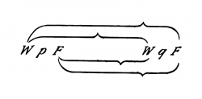\</td>
<td lang="en">*e.g.*: 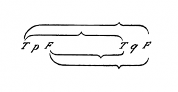\</td>
<td lang="en"><em>外部版本參照：</em> Ludwig Wittgenstein, Tractatus Logico-Philosophicus, trans. D. F. Pears and B. F. McGuinness, 2nd ed. (Routledge, 2001), ISBN 9780415254083.；命題 <code>6.1203</code>；<a href="https://www.routledge.com/Tractatus-Logico-Philosophicus/Wittgenstein/p/book/9780415254083">來源</a></td>
<td lang="zh-Hant">例如第一圖所示。 <small><strong>哲學解讀：</strong> 第一圖是括號分組的具體例示；圖像本身承接前句所說的配置方式，不是裝飾。</small></td>
</tr>
<tr id="segment-6-1203-e">
<td lang="de">und die Zuordnung der Wahr- oder Falschheit des ganzen Satzes und der Wahrheitskombinationen der Wahrheitsargumente durch Striche auf folgende Weise: 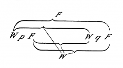\</td>
<td lang="en">and the co-ordination of the truth or falsity of the whole proposition with the truth-combinations of the truth-arguments by lines in the following way: \</td>
<td lang="en"><em>外部版本參照：</em> Ludwig Wittgenstein, Tractatus Logico-Philosophicus, trans. D. F. Pears and B. F. McGuinness, 2nd ed. (Routledge, 2001), ISBN 9780415254083.；命題 <code>6.1203</code>；<a href="https://www.routledge.com/Tractatus-Logico-Philosophicus/Wittgenstein/p/book/9780415254083">來源</a></td>
<td lang="zh-Hant">整個命題的真假與真值論元組合，再用線條依第二圖配對。 <small><strong>哲學解讀：</strong> 線條把整體真值規則與論元配置連起來。</small></td>
</tr>
<tr id="segment-6-1203-f">
<td lang="de">Dies Zeichen würde also z. B. den Satz *p* ⊃ *q* darstellen.</td>
<td lang="en">This sign, for example, would therefore present the proposition “*p* ⊃ *q*”.</td>
<td lang="en"><em>外部版本參照：</em> Ludwig Wittgenstein, Tractatus Logico-Philosophicus, trans. D. F. Pears and B. F. McGuinness, 2nd ed. (Routledge, 2001), ISBN 9780415254083.；命題 <code>6.1203</code>；<a href="https://www.routledge.com/Tractatus-Logico-Philosophicus/Wittgenstein/p/book/9780415254083">來源</a></td>
<td lang="zh-Hant">這個記號例如表示 p ⊃ q。 <small><strong>哲學解讀：</strong> 蘊涵式是前兩幅圖表如何合讀的示例，不是由圖形外觀自行產生意義。</small></td>
</tr>
<tr id="segment-6-1203-g">
<td lang="de">Nun will ich z. B. den Satz ∼(*p .* ∼*p*) (Gesetz des Widerspruchs) daraufhin untersuchen, ob er eine Tautologie ist.</td>
<td lang="en">Now I will proceed to inquire whether such a proposition as \~(*p* . \~*p*) (The Law of Contradiction) is a tautology.</td>
<td lang="en"><em>外部版本參照：</em> Ludwig Wittgenstein, Tractatus Logico-Philosophicus, trans. D. F. Pears and B. F. McGuinness, 2nd ed. (Routledge, 2001), ISBN 9780415254083.；命題 <code>6.1203</code>；<a href="https://www.routledge.com/Tractatus-Logico-Philosophicus/Wittgenstein/p/book/9780415254083">來源</a></td>
<td lang="zh-Hant">現在檢查矛盾律形式是否為重言式。 <small><strong>哲學解讀：</strong> 檢查目標是該形式是否在所有真值配置下皆真，而不是用經驗觀察確認它。</small></td>
</tr>
<tr id="segment-6-1203-h">
<td lang="de">Die Form „∼*ξ*“ wird in unserer Notation 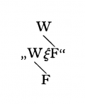\ geschrieben;</td>
<td lang="en">The form “\~*ξ*” is written in our notation 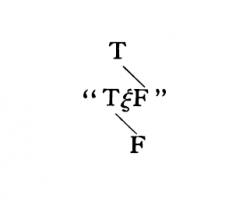\</td>
<td lang="en"><em>外部版本參照：</em> Ludwig Wittgenstein, Tractatus Logico-Philosophicus, trans. D. F. Pears and B. F. McGuinness, 2nd ed. (Routledge, 2001), ISBN 9780415254083.；命題 <code>6.1203</code>；<a href="https://www.routledge.com/Tractatus-Logico-Philosophicus/Wittgenstein/p/book/9780415254083">來源</a></td>
<td lang="zh-Hant">否定形式依第三圖寫下。 <small><strong>哲學解讀：</strong> 第三圖提供否定運算的局部真值規則。</small></td>
</tr>
<tr id="segment-6-1203-i">
<td lang="de">die Form „*ξ . η*“ so: 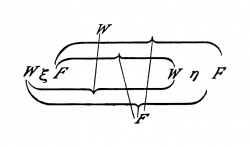\</td>
<td lang="en">the form “*ξ* . *η*” thus:— \</td>
<td lang="en"><em>外部版本參照：</em> Ludwig Wittgenstein, Tractatus Logico-Philosophicus, trans. D. F. Pears and B. F. McGuinness, 2nd ed. (Routledge, 2001), ISBN 9780415254083.；命題 <code>6.1203</code>；<a href="https://www.routledge.com/Tractatus-Logico-Philosophicus/Wittgenstein/p/book/9780415254083">來源</a></td>
<td lang="zh-Hant">合取形式依第四圖寫下。 <small><strong>哲學解讀：</strong> 第四圖提供合取運算的局部真值規則。</small></td>
</tr>
<tr id="segment-6-1203-j">
<td lang="de">Daher lautet der Satz ∼(*p .* ∼*q*) so: 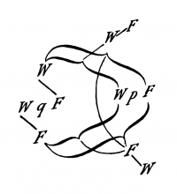\</td>
<td lang="en">Hence the proposition \~(*p* . \~*q*) runs thus:— 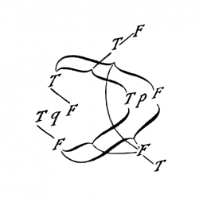\</td>
<td lang="en"><em>外部版本參照：</em> Ludwig Wittgenstein, Tractatus Logico-Philosophicus, trans. D. F. Pears and B. F. McGuinness, 2nd ed. (Routledge, 2001), ISBN 9780415254083.；命題 <code>6.1203</code>；<a href="https://www.routledge.com/Tractatus-Logico-Philosophicus/Wittgenstein/p/book/9780415254083">來源</a></td>
<td lang="zh-Hant">所以待檢查的命題成為第五圖。 <small><strong>哲學解讀：</strong> 第五圖把前述否定與合取規則組合起來，仍只是形式表示。</small></td>
</tr>
<tr id="segment-6-1203-k">
<td lang="de">Setzen wir hier statt „*q*“ „*p*“ ein und untersuchen die Verbindung der äussersten W und F mit den innersten, so ergibt sich, dass die Wahrheit des ganzen Satzes *allen* Wahrheitskombinationen seines Argumentes, seine Falschheit keiner der Wahrheitskombinationen zugeordnet ist.</td>
<td lang="en">If here we put “*p*” instead of “*q*” and examine the combination of the outermost T and F with the innermost, it is seen that the truth of the whole proposition is co-ordinated with *all* the truth-combinations of its argument, its falsity with none of the truth-combinations.</td>
<td lang="en"><em>外部版本參照：</em> Ludwig Wittgenstein, Tractatus Logico-Philosophicus, trans. D. F. Pears and B. F. McGuinness, 2nd ed. (Routledge, 2001), ISBN 9780415254083.；命題 <code>6.1203</code>；<a href="https://www.routledge.com/Tractatus-Logico-Philosophicus/Wittgenstein/p/book/9780415254083">來源</a></td>
<td lang="zh-Hant">以 p 取代 q，再比較最外與最內的真假，可見整體的真對應所有論元組合，而假不對應任何組合。 <small><strong>哲學解讀：</strong> 所有配置皆配到真，才是重言式；圖表是辨認輔具，不增添經驗證據。</small></td>
</tr>
<tr class="project-relations">
<td colspan="4">
<strong>Akashic 專案關係</strong>
<ul>
<li><code>not_applicable</code> — Akashic 目前不主張命題 6.1203 關於邏輯命題、真值運算或形式證明的論旨具有直接軟體實作對應。 <small>理由：命題 6.1203 提出一套限於無普遍性記號情形的圖表法，依序改寫命題字母、列出配置並檢查所有真值組合；這是重言式辨認程序。Akashic 的 schema 與程式驗證只規範專案資料，不能據此冒充相同的形式證明。</small>
</li>
</ul>
</td>
</tr>
<tr id="proposition-6-121">
<td colspan="4"><strong>6.121</strong></td>
</tr>
<tr id="segment-6-121-a">
<td lang="de">Die Sätze der Logik demonstrieren die logischen Eigenschaften der Sätze, indem sie sie zu nichtssagenden Sätzen verbinden.</td>
<td lang="en">The propositions of logic demonstrate the logical properties of propositions, by combining them into propositions which say nothing.</td>
<td lang="en"><em>外部版本參照：</em> Ludwig Wittgenstein, Tractatus Logico-Philosophicus, trans. D. F. Pears and B. F. McGuinness, 2nd ed. (Routledge, 2001), ISBN 9780415254083.；命題 <code>6.121</code>；<a href="https://www.routledge.com/Tractatus-Logico-Philosophicus/Wittgenstein/p/book/9780415254083">來源</a></td>
<td lang="zh-Hant">邏輯命題藉由把命題結合成不說任何事的命題，展示命題的邏輯性質。 <small><strong>哲學解讀：</strong> 無經驗內容的組合反而展示形式關係。</small></td>
</tr>
<tr id="segment-6-121-b">
<td lang="de">Diese Methode könnte man auch eine Nullmethode nennen.</td>
<td lang="en">This method could be called a zero-method.</td>
<td lang="en"><em>外部版本參照：</em> Ludwig Wittgenstein, Tractatus Logico-Philosophicus, trans. D. F. Pears and B. F. McGuinness, 2nd ed. (Routledge, 2001), ISBN 9780415254083.；命題 <code>6.121</code>；<a href="https://www.routledge.com/Tractatus-Logico-Philosophicus/Wittgenstein/p/book/9780415254083">來源</a></td>
<td lang="zh-Hant">這種方法也可稱為零方法。 <small><strong>哲學解讀：</strong> 「零」比喻真值結果不隨論元配置而改變。</small></td>
</tr>
<tr id="segment-6-121-c">
<td lang="de">Im logischen Satz werden Sätze miteinander ins Gleichgewicht gebracht und der Zustand des Gleichgewichts zeigt dann an, wie diese Sätze logisch beschaffen sein müssen.</td>
<td lang="en">In a logical proposition propositions are brought into equilibrium with one another, and the state of equilibrium then shows how these propositions must be logically constructed.</td>
<td lang="en"><em>外部版本參照：</em> Ludwig Wittgenstein, Tractatus Logico-Philosophicus, trans. D. F. Pears and B. F. McGuinness, 2nd ed. (Routledge, 2001), ISBN 9780415254083.；命題 <code>6.121</code>；<a href="https://www.routledge.com/Tractatus-Logico-Philosophicus/Wittgenstein/p/book/9780415254083">來源</a></td>
<td lang="zh-Hant">在邏輯命題中，各命題被置於平衡；平衡狀態顯示它們在邏輯上必須如何構成。 <small><strong>哲學解讀：</strong> 平衡不是物理狀態，而是重言式的形式恆定。</small></td>
</tr>
<tr class="project-relations">
<td colspan="4">
<strong>Akashic 專案關係</strong>
<ul>
<li><code>not_applicable</code> — Akashic 目前不主張命題 6.121 關於邏輯命題、真值運算或形式證明的論旨具有直接軟體實作對應。 <small>理由：命題 6.121 的直接論旨是「邏輯命題藉由把命題結合成不說任何事的命題，展示命題的邏輯性質。」；這句處理真值函數、重言式、符號形式或邏輯證明；Akashic 的 schema 與程式運算只規範專案資料，不能據此冒充相同的邏輯形式。</small>
</li>
</ul>
</td>
</tr>
<tr id="proposition-6-122">
<td colspan="4"><strong>6.122</strong></td>
</tr>
<tr id="segment-6-122-a">
<td lang="de">Daraus ergibt sich, dass wir auch ohne die logischen Sätze auskommen können, da wir ja in einer entsprechenden Notation die formalen Eigenschaften der Sätze durch das blosse Ansehen dieser Sätze erkennen können.</td>
<td lang="en">Whence it follows that we can get on without logical propositions, for we can recognize in an adequate notation the formal properties of the propositions by mere inspection.</td>
<td lang="en"><em>外部版本參照：</em> Ludwig Wittgenstein, Tractatus Logico-Philosophicus, trans. D. F. Pears and B. F. McGuinness, 2nd ed. (Routledge, 2001), ISBN 9780415254083.；命題 <code>6.122</code>；<a href="https://www.routledge.com/Tractatus-Logico-Philosophicus/Wittgenstein/p/book/9780415254083">來源</a></td>
<td lang="zh-Hant">由此可知，我們也能不靠邏輯命題：在適當記法中，只需查看命題便能認出其形式性質。 <small><strong>哲學解讀：</strong> 理想記法應讓邏輯關係可見；這不表示工程系統可省略驗證。</small></td>
</tr>
<tr class="project-relations">
<td colspan="4">
<strong>Akashic 專案關係</strong>
<ul>
<li><code>not_applicable</code> — Akashic 目前不主張命題 6.122 關於邏輯命題、真值運算或形式證明的論旨具有直接軟體實作對應。 <small>理由：命題 6.122 的直接論旨是「由此可知，我們也能不靠邏輯命題：在適當記法中，只需查看命題便能認出其形式性質。」；這句處理真值函數、重言式、符號形式或邏輯證明；Akashic 的 schema 與程式運算只規範專案資料，不能據此冒充相同的邏輯形式。</small>
</li>
</ul>
</td>
</tr>
<tr id="proposition-6-1221">
<td colspan="4"><strong>6.1221</strong></td>
</tr>
<tr id="segment-6-1221-a">
<td lang="de">Ergeben z. B. zwei Sätze „*p*“ und „*q*“ in der Verbindung „*p* ⊃ *q*“ eine Tautologie, so ist klar, dass *q* aus *p* folgt.</td>
<td lang="en">If for example two propositions “*p*” and “*q*” give a tautology in the connexion “*p* ⊃ *q*”, then it is clear that “*q*” follows from “*p*”.</td>
<td lang="en"><em>外部版本參照：</em> Ludwig Wittgenstein, Tractatus Logico-Philosophicus, trans. D. F. Pears and B. F. McGuinness, 2nd ed. (Routledge, 2001), ISBN 9780415254083.；命題 <code>6.1221</code>；<a href="https://www.routledge.com/Tractatus-Logico-Philosophicus/Wittgenstein/p/book/9780415254083">來源</a></td>
<td lang="zh-Hant">例如，p 與 q 在 p ⊃ q 的連結中形成重言式，就可知 q 由 p 推出。 <small><strong>哲學解讀：</strong> 重言式提供推論關係的形式判準。</small></td>
</tr>
<tr id="segment-6-1221-b">
<td lang="de">Dass z. B. „*q*“ aus „*p* ⊃ *q . p*“ folgt, ersehen wir aus diesen beiden Sätzen selbst, aber wir können es auch *so* zeigen, indem wir sie zu „*p* ⊃ *q . p* : ⊃ : *q*“ verbinden und nun zeigen, dass dies eine Tautologie ist.</td>
<td lang="en">E.g. that “*q*” follows from “*p* ⊃ *q* . *p*” we see from these two propositions themselves, but we can also show it by combining them to “*p* ⊃ *q* . *p* : ⊃ : *q*” and then showing that this is a tautology.</td>
<td lang="en"><em>外部版本參照：</em> Ludwig Wittgenstein, Tractatus Logico-Philosophicus, trans. D. F. Pears and B. F. McGuinness, 2nd ed. (Routledge, 2001), ISBN 9780415254083.；命題 <code>6.1221</code>；<a href="https://www.routledge.com/Tractatus-Logico-Philosophicus/Wittgenstein/p/book/9780415254083">來源</a></td>
<td lang="zh-Hant">q 由 p ⊃ q 與 p 推出，既可由兩式本身看出，也可合成來源所列式並顯示它是重言式。 <small><strong>哲學解讀：</strong> 第二種展示把可直接看出的推論改寫成單一重言式。</small></td>
</tr>
<tr class="project-relations">
<td colspan="4">
<strong>Akashic 專案關係</strong>
<ul>
<li><code>not_applicable</code> — Akashic 目前不主張命題 6.1221 關於邏輯命題、真值運算或形式證明的論旨具有直接軟體實作對應。 <small>理由：命題 6.1221 的直接論旨是「例如，p 與 q 在 p ⊃ q 的連結中形成重言式，就可知 q 由 p 推出。」；這句處理真值函數、重言式、符號形式或邏輯證明；Akashic 的 schema 與程式運算只規範專案資料，不能據此冒充相同的邏輯形式。</small>
</li>
</ul>
</td>
</tr>
<tr id="proposition-6-1222">
<td colspan="4"><strong>6.1222</strong></td>
</tr>
<tr id="segment-6-1222-a">
<td lang="de">Dies wirft ein Licht auf die Frage, warum die logischen Sätze nicht durch die Erfahrung bestätigt werden können, ebenso wenig, wie sie durch die Erfahrung widerlegt werden können.</td>
<td lang="en">This throws light on the question why logical propositions can no more be empirically confirmed than they can be empirically refuted.</td>
<td lang="en"><em>外部版本參照：</em> Ludwig Wittgenstein, Tractatus Logico-Philosophicus, trans. D. F. Pears and B. F. McGuinness, 2nd ed. (Routledge, 2001), ISBN 9780415254083.；命題 <code>6.1222</code>；<a href="https://www.routledge.com/Tractatus-Logico-Philosophicus/Wittgenstein/p/book/9780415254083">來源</a></td>
<td lang="zh-Hant">這說明為何邏輯命題既不能由經驗確認，也不能由經驗反駁。 <small><strong>哲學解讀：</strong> 經驗材料不決定重言式的真。</small></td>
</tr>
<tr id="segment-6-1222-b">
<td lang="de">Nicht nur muss ein Satz der Logik durch keine mögliche Erfahrung widerlegt werden können, sondern er darf auch nicht durch eine solche bestätigt werden können.</td>
<td lang="en">Not only must a proposition of logic be incapable of being contradicted by any possible experience, but it must also be incapable of being confirmed by any such.</td>
<td lang="en"><em>外部版本參照：</em> Ludwig Wittgenstein, Tractatus Logico-Philosophicus, trans. D. F. Pears and B. F. McGuinness, 2nd ed. (Routledge, 2001), ISBN 9780415254083.；命題 <code>6.1222</code>；<a href="https://www.routledge.com/Tractatus-Logico-Philosophicus/Wittgenstein/p/book/9780415254083">來源</a></td>
<td lang="zh-Hant">邏輯命題不只不能被任何可能經驗反駁，也不能被任何可能經驗確認。 <small><strong>哲學解讀：</strong> 若可能經驗能提高其可信度，它就不是此處所說的邏輯命題。</small></td>
</tr>
<tr class="project-relations">
<td colspan="4">
<strong>Akashic 專案關係</strong>
<ul>
<li><code>not_applicable</code> — Akashic 目前不主張命題 6.1222 關於邏輯命題、真值運算或形式證明的論旨具有直接軟體實作對應。 <small>理由：命題 6.1222 的直接論旨是「這說明為何邏輯命題既不能由經驗確認，也不能由經驗反駁。」；這句處理真值函數、重言式、符號形式或邏輯證明；Akashic 的 schema 與程式運算只規範專案資料，不能據此冒充相同的邏輯形式。</small>
</li>
</ul>
</td>
</tr>
<tr id="proposition-6-1223">
<td colspan="4"><strong>6.1223</strong></td>
</tr>
<tr id="segment-6-1223-a">
<td lang="de">Nun wird klar, warum man oft fühlte, als wären die „logischen Wahrheiten“ von uns zu „*fordern*“:</td>
<td lang="en">It now becomes clear why we often feel as though “logical truths” must be “*postulated*” by us.</td>
<td lang="en"><em>外部版本參照：</em> Ludwig Wittgenstein, Tractatus Logico-Philosophicus, trans. D. F. Pears and B. F. McGuinness, 2nd ed. (Routledge, 2001), ISBN 9780415254083.；命題 <code>6.1223</code>；<a href="https://www.routledge.com/Tractatus-Logico-Philosophicus/Wittgenstein/p/book/9780415254083">來源</a></td>
<td lang="zh-Hant">現在可明白，為何人們常覺得必須由我們「要求」邏輯真理。 <small><strong>哲學解讀：</strong> 這句提出需要說明的感受：邏輯真理看似必須由人加以要求或設定。</small></td>
</tr>
<tr id="segment-6-1223-b">
<td lang="de">Wir können sie nämlich insofern fordern, als wir eine genügende Notation fordern können.</td>
<td lang="en">We can in fact postulate them in so far as we can postulate an adequate notation.</td>
<td lang="en"><em>外部版本參照：</em> Ludwig Wittgenstein, Tractatus Logico-Philosophicus, trans. D. F. Pears and B. F. McGuinness, 2nd ed. (Routledge, 2001), ISBN 9780415254083.；命題 <code>6.1223</code>；<a href="https://www.routledge.com/Tractatus-Logico-Philosophicus/Wittgenstein/p/book/9780415254083">來源</a></td>
<td lang="zh-Hant">我們能要求它們，只因我們能要求一套充分的記法。 <small><strong>哲學解讀：</strong> 後句把要求邏輯真理重解為要求記法充分；可選的是記法，不是任意立法真理。</small></td>
</tr>
<tr class="project-relations">
<td colspan="4">
<strong>Akashic 專案關係</strong>
<ul>
<li><code>not_applicable</code> — Akashic 目前不主張命題 6.1223 關於邏輯命題、真值運算或形式證明的論旨具有直接軟體實作對應。 <small>理由：命題 6.1223 先指出邏輯真理似乎須由人要求的感受，再把可要求者限縮為充分記法；它沒有把邏輯真理變成人為政策。Akashic 可選 schema 記法，卻不能因此聲稱其規則就是同一套邏輯形式。</small>
</li>
</ul>
</td>
</tr>
<tr id="proposition-6-1224">
<td colspan="4"><strong>6.1224</strong></td>
</tr>
<tr id="segment-6-1224-a">
<td lang="de">Es wird jetzt auch klar, warum die Logik die Lehre von den Formen und vom Schliessen genannt wurde.</td>
<td lang="en">It also becomes clear why logic has been called the theory of forms and of inference.</td>
<td lang="en"><em>外部版本參照：</em> Ludwig Wittgenstein, Tractatus Logico-Philosophicus, trans. D. F. Pears and B. F. McGuinness, 2nd ed. (Routledge, 2001), ISBN 9780415254083.；命題 <code>6.1224</code>；<a href="https://www.routledge.com/Tractatus-Logico-Philosophicus/Wittgenstein/p/book/9780415254083">來源</a></td>
<td lang="zh-Hant">現在也可明白，為何邏輯被稱為形式與推論的學說。 <small><strong>哲學解讀：</strong> 形式與推論在符號結構中顯示，不是自然科學的額外對象。</small></td>
</tr>
<tr class="project-relations">
<td colspan="4">
<strong>Akashic 專案關係</strong>
<ul>
<li><code>not_applicable</code> — Akashic 目前不主張命題 6.1224 關於邏輯命題、真值運算或形式證明的論旨具有直接軟體實作對應。 <small>理由：命題 6.1224 的直接論旨是「現在也可明白，為何邏輯被稱為形式與推論的學說。」；這句處理真值函數、重言式、符號形式或邏輯證明；Akashic 的 schema 與程式運算只規範專案資料，不能據此冒充相同的邏輯形式。</small>
</li>
</ul>
</td>
</tr>
<tr id="proposition-6-123">
<td colspan="4"><strong>6.123</strong></td>
</tr>
<tr id="segment-6-123-a">
<td lang="de">Es ist klar: Die logischen Gesetze dürfen nicht selbst wieder logischen Gesetzen unterstehen.</td>
<td lang="en">It is clear that the laws of logic cannot themselves obey further logical laws.</td>
<td lang="en"><em>外部版本參照：</em> Ludwig Wittgenstein, Tractatus Logico-Philosophicus, trans. D. F. Pears and B. F. McGuinness, 2nd ed. (Routledge, 2001), ISBN 9780415254083.；命題 <code>6.123</code>；<a href="https://www.routledge.com/Tractatus-Logico-Philosophicus/Wittgenstein/p/book/9780415254083">來源</a></td>
<td lang="zh-Hant">顯然，邏輯法則本身不能再服從更多邏輯法則。 <small><strong>哲學解讀：</strong> 否則規範邏輯法則的層級會無止境後退。</small></td>
</tr>
<tr id="segment-6-123-b">
<td lang="de">\(Es gibt nicht, wie Russell meinte, für jede „Type“ ein eigenes Gesetz des Widerspruches, sondern Eines genügt, da es auf sich selbst nicht angewendet wird.)</td>
<td lang="en">\(There is not, as Russell supposed, for every “type” a special law of contradiction; but one is sufficient, since it is not applied to itself.)</td>
<td lang="en"><em>外部版本參照：</em> Ludwig Wittgenstein, Tractatus Logico-Philosophicus, trans. D. F. Pears and B. F. McGuinness, 2nd ed. (Routledge, 2001), ISBN 9780415254083.；命題 <code>6.123</code>；<a href="https://www.routledge.com/Tractatus-Logico-Philosophicus/Wittgenstein/p/book/9780415254083">來源</a></td>
<td lang="zh-Hant">（並非如羅素所想，每個型別各有一條矛盾律；一條就夠了，因為它不施用於自身。） <small><strong>哲學解讀：</strong> 括號批評羅素的方案，不能改讀成程式型別可任意自我套用。</small></td>
</tr>
<tr class="project-relations">
<td colspan="4">
<strong>Akashic 專案關係</strong>
<ul>
<li><code>not_applicable</code> — Akashic 目前不主張命題 6.123 關於邏輯命題、真值運算或形式證明的論旨具有直接軟體實作對應。 <small>理由：命題 6.123 的直接論旨是「顯然，邏輯法則本身不能再服從更多邏輯法則。」；這句處理真值函數、重言式、符號形式或邏輯證明；Akashic 的 schema 與程式運算只規範專案資料，不能據此冒充相同的邏輯形式。</small>
</li>
</ul>
</td>
</tr>
<tr id="proposition-6-1231">
<td colspan="4"><strong>6.1231</strong></td>
</tr>
<tr id="segment-6-1231-a">
<td lang="de">Das Anzeichen des logischen Satzes ist *nicht* die Allgemeingültigkeit.</td>
<td lang="en">The mark of logical propositions is not their general validity.</td>
<td lang="en"><em>外部版本參照：</em> Ludwig Wittgenstein, Tractatus Logico-Philosophicus, trans. D. F. Pears and B. F. McGuinness, 2nd ed. (Routledge, 2001), ISBN 9780415254083.；命題 <code>6.1231</code>；<a href="https://www.routledge.com/Tractatus-Logico-Philosophicus/Wittgenstein/p/book/9780415254083">來源</a></td>
<td lang="zh-Hant">邏輯命題的標誌不是普遍有效性。 <small><strong>哲學解讀：</strong> 全稱量化不是邏輯性的充分條件。</small></td>
</tr>
<tr id="segment-6-1231-b">
<td lang="de">Allgemein sein, heisst ja nur: Zufälligerweise für alle Dinge gelten.</td>
<td lang="en">To be general is only to be accidentally valid for all things.</td>
<td lang="en"><em>外部版本參照：</em> Ludwig Wittgenstein, Tractatus Logico-Philosophicus, trans. D. F. Pears and B. F. McGuinness, 2nd ed. (Routledge, 2001), ISBN 9780415254083.；命題 <code>6.1231</code>；<a href="https://www.routledge.com/Tractatus-Logico-Philosophicus/Wittgenstein/p/book/9780415254083">來源</a></td>
<td lang="zh-Hant">普遍只表示碰巧適用於所有事物。 <small><strong>哲學解讀：</strong> 「所有」也可能只是經驗上無例外。</small></td>
</tr>
<tr id="segment-6-1231-c">
<td lang="de">Ein unverallgemeinerter Satz kann ja ebensowohl tautologisch sein, als ein verallgemeinerter.</td>
<td lang="en">An ungeneralized proposition can be tautologous just as well as a generalized one.</td>
<td lang="en"><em>外部版本參照：</em> Ludwig Wittgenstein, Tractatus Logico-Philosophicus, trans. D. F. Pears and B. F. McGuinness, 2nd ed. (Routledge, 2001), ISBN 9780415254083.；命題 <code>6.1231</code>；<a href="https://www.routledge.com/Tractatus-Logico-Philosophicus/Wittgenstein/p/book/9780415254083">來源</a></td>
<td lang="zh-Hant">未普遍化的命題同樣可能是重言式。 <small><strong>哲學解讀：</strong> 有無量詞與是否重言須分開判定。</small></td>
</tr>
<tr class="project-relations">
<td colspan="4">
<strong>Akashic 專案關係</strong>
<ul>
<li><code>not_applicable</code> — Akashic 目前不主張命題 6.1231 關於邏輯命題、真值運算或形式證明的論旨具有直接軟體實作對應。 <small>理由：命題 6.1231 的直接論旨是「邏輯命題的標誌不是普遍有效性。」；這句處理真值函數、重言式、符號形式或邏輯證明；Akashic 的 schema 與程式運算只規範專案資料，不能據此冒充相同的邏輯形式。</small>
</li>
</ul>
</td>
</tr>
<tr id="proposition-6-1232">
<td colspan="4"><strong>6.1232</strong></td>
</tr>
<tr id="segment-6-1232-a">
<td lang="de">Die logische Allgemeingültigkeit könnte man wesentlich nennen, im Gegensatz zu jener zufälligen, etwa des Satzes „alle Menschen sind sterblich“.</td>
<td lang="en">Logical general validity, we could call essential as opposed to accidental general validity, *e.g.* of the proposition “all men are mortal”.</td>
<td lang="en"><em>外部版本參照：</em> Ludwig Wittgenstein, Tractatus Logico-Philosophicus, trans. D. F. Pears and B. F. McGuinness, 2nd ed. (Routledge, 2001), ISBN 9780415254083.；命題 <code>6.1232</code>；<a href="https://www.routledge.com/Tractatus-Logico-Philosophicus/Wittgenstein/p/book/9780415254083">來源</a></td>
<td lang="zh-Hant">邏輯普遍有效性可稱為本質的，與「所有人都會死」這類偶然普遍性相對。 <small><strong>哲學解讀：</strong> 本質有效不能由資料集中零反例建立。</small></td>
</tr>
<tr id="segment-6-1232-b">
<td lang="de">Sätze, wie Russells „Axiom of reducibility“ sind nicht logische Sätze, und dies erklärt unser Gefühl: Dass sie, wenn wahr, so doch nur durch einen günstigen Zufall wahr sein könnten.</td>
<td lang="en">Propositions like Russell’s “axiom of reducibility” are not logical propositions, and this explains our feeling that, if true, they can only be true by a happy chance.</td>
<td lang="en"><em>外部版本參照：</em> Ludwig Wittgenstein, Tractatus Logico-Philosophicus, trans. D. F. Pears and B. F. McGuinness, 2nd ed. (Routledge, 2001), ISBN 9780415254083.；命題 <code>6.1232</code>；<a href="https://www.routledge.com/Tractatus-Logico-Philosophicus/Wittgenstein/p/book/9780415254083">來源</a></td>
<td lang="zh-Hant">羅素的可化約公理不是邏輯命題；即使為真，也只能是幸運巧合。 <small><strong>哲學解讀：</strong> 可設想公理不成立，顯示其地位不同於重言式。</small></td>
</tr>
<tr class="project-relations">
<td colspan="4">
<strong>Akashic 專案關係</strong>
<ul>
<li><code>not_applicable</code> — Akashic 目前不主張命題 6.1232 關於邏輯命題、真值運算或形式證明的論旨具有直接軟體實作對應。 <small>理由：命題 6.1232 的直接論旨是「邏輯普遍有效性可稱為本質的，與「所有人都會死」這類偶然普遍性相對。」；這句處理真值函數、重言式、符號形式或邏輯證明；Akashic 的 schema 與程式運算只規範專案資料，不能據此冒充相同的邏輯形式。</small>
</li>
</ul>
</td>
</tr>
<tr id="proposition-6-1233">
<td colspan="4"><strong>6.1233</strong></td>
</tr>
<tr id="segment-6-1233-a">
<td lang="de">Es lässt sich eine Welt denken, in der das Axiom of reducibility nicht gilt.</td>
<td lang="en">We can imagine a world in which the axiom of reducibility is not valid.</td>
<td lang="en"><em>外部版本參照：</em> Ludwig Wittgenstein, Tractatus Logico-Philosophicus, trans. D. F. Pears and B. F. McGuinness, 2nd ed. (Routledge, 2001), ISBN 9780415254083.；命題 <code>6.1233</code>；<a href="https://www.routledge.com/Tractatus-Logico-Philosophicus/Wittgenstein/p/book/9780415254083">來源</a></td>
<td lang="zh-Hant">可以設想一個可化約公理不成立的世界。 <small><strong>哲學解讀：</strong> 可設想其失敗，便表示它不是邏輯必然。</small></td>
</tr>
<tr id="segment-6-1233-b">
<td lang="de">Es ist aber klar, dass die Logik nichts mit der Frage zu schaffen hat, ob unsere Welt wirklich so ist oder nicht.</td>
<td lang="en">But it is clear that logic has nothing to do with the question whether our world is really of this kind or not.</td>
<td lang="en"><em>外部版本參照：</em> Ludwig Wittgenstein, Tractatus Logico-Philosophicus, trans. D. F. Pears and B. F. McGuinness, 2nd ed. (Routledge, 2001), ISBN 9780415254083.；命題 <code>6.1233</code>；<a href="https://www.routledge.com/Tractatus-Logico-Philosophicus/Wittgenstein/p/book/9780415254083">來源</a></td>
<td lang="zh-Hant">但邏輯不處理我們的世界實際是否如此。 <small><strong>哲學解讀：</strong> 世界實際採何種結構是經驗問題。</small></td>
</tr>
<tr class="project-relations">
<td colspan="4">
<strong>Akashic 專案關係</strong>
<ul>
<li><code>not_applicable</code> — Akashic 目前不主張命題 6.1233 關於邏輯命題、真值運算或形式證明的論旨具有直接軟體實作對應。 <small>理由：命題 6.1233 的直接論旨是「可以設想一個可化約公理不成立的世界。」；這句處理真值函數、重言式、符號形式或邏輯證明；Akashic 的 schema 與程式運算只規範專案資料，不能據此冒充相同的邏輯形式。</small>
</li>
</ul>
</td>
</tr>
<tr id="proposition-6-124">
<td colspan="4"><strong>6.124</strong></td>
</tr>
<tr id="segment-6-124-a">
<td lang="de">Die logischen Sätze beschreiben das Gerüst der Welt, oder vielmehr, sie stellen es dar.</td>
<td lang="en">The logical propositions describe the scaffolding of the world, or rather they present it.</td>
<td lang="en"><em>外部版本參照：</em> Ludwig Wittgenstein, Tractatus Logico-Philosophicus, trans. D. F. Pears and B. F. McGuinness, 2nd ed. (Routledge, 2001), ISBN 9780415254083.；命題 <code>6.124</code>；<a href="https://www.routledge.com/Tractatus-Logico-Philosophicus/Wittgenstein/p/book/9780415254083">來源</a></td>
<td lang="zh-Hant">邏輯命題描述世界的骨架，更確切地說，是呈現它。 <small><strong>哲學解讀：</strong> 「骨架」是形式條件，不是另一組世界事實。</small></td>
</tr>
<tr id="segment-6-124-b">
<td lang="de">Sie „handeln“ von nichts.</td>
<td lang="en">They “treat” of nothing.</td>
<td lang="en"><em>外部版本參照：</em> Ludwig Wittgenstein, Tractatus Logico-Philosophicus, trans. D. F. Pears and B. F. McGuinness, 2nd ed. (Routledge, 2001), ISBN 9780415254083.；命題 <code>6.124</code>；<a href="https://www.routledge.com/Tractatus-Logico-Philosophicus/Wittgenstein/p/book/9780415254083">來源</a></td>
<td lang="zh-Hant">它們不談論任何事。 <small><strong>哲學解讀：</strong> 邏輯命題不以某個對象為題材。</small></td>
</tr>
<tr id="segment-6-124-c">
<td lang="de">Sie setzen voraus, dass Namen Bedeutung, und Elementarsätze Sinn haben:</td>
<td lang="en">They presuppose that names have meaning, and that elementary propositions have sense.</td>
<td lang="en"><em>外部版本參照：</em> Ludwig Wittgenstein, Tractatus Logico-Philosophicus, trans. D. F. Pears and B. F. McGuinness, 2nd ed. (Routledge, 2001), ISBN 9780415254083.；命題 <code>6.124</code>；<a href="https://www.routledge.com/Tractatus-Logico-Philosophicus/Wittgenstein/p/book/9780415254083">來源</a></td>
<td lang="zh-Hant">它們預設名稱有指涉，而且基本命題有意義。 <small><strong>哲學解讀：</strong> 邏輯命題不描述對象，卻以名稱能指涉、基本命題能有意義為運作前提。</small></td>
</tr>
<tr id="segment-6-124-d">
<td lang="de">Und dies ist ihre Verbindung mit der Welt.</td>
<td lang="en">And this is their connexion with the world.</td>
<td lang="en"><em>外部版本參照：</em> Ludwig Wittgenstein, Tractatus Logico-Philosophicus, trans. D. F. Pears and B. F. McGuinness, 2nd ed. (Routledge, 2001), ISBN 9780415254083.；命題 <code>6.124</code>；<a href="https://www.routledge.com/Tractatus-Logico-Philosophicus/Wittgenstein/p/book/9780415254083">來源</a></td>
<td lang="zh-Hant">這便是它們與世界的聯繫。 <small><strong>哲學解讀：</strong> 聯繫不在邏輯命題另述一項事實，而在其符號預設已具有指涉與意義。</small></td>
</tr>
<tr id="segment-6-124-e">
<td lang="de">Es ist klar, dass es etwas über die Welt anzeigen muss, dass gewisse Verbindungen von Symbolen – welche wesentlich einen bestimmten Charakter haben – Tautologien sind.</td>
<td lang="en">It is clear that it must show something about the world that certain combinations of symbols—which essentially have a definite character—are tautologies.</td>
<td lang="en"><em>外部版本參照：</em> Ludwig Wittgenstein, Tractatus Logico-Philosophicus, trans. D. F. Pears and B. F. McGuinness, 2nd ed. (Routledge, 2001), ISBN 9780415254083.；命題 <code>6.124</code>；<a href="https://www.routledge.com/Tractatus-Logico-Philosophicus/Wittgenstein/p/book/9780415254083">來源</a></td>
<td lang="zh-Hant">具有本質特徵的符號組合會成為重言式，必然顯示世界的某些東西。 <small><strong>哲學解讀：</strong> 重言式的可能組合顯示不可任意的結構。</small></td>
</tr>
<tr id="segment-6-124-f">
<td lang="de">Hierin liegt das Entscheidende.</td>
<td lang="en">Herein lies the decisive point.</td>
<td lang="en"><em>外部版本參照：</em> Ludwig Wittgenstein, Tractatus Logico-Philosophicus, trans. D. F. Pears and B. F. McGuinness, 2nd ed. (Routledge, 2001), ISBN 9780415254083.；命題 <code>6.124</code>；<a href="https://www.routledge.com/Tractatus-Logico-Philosophicus/Wittgenstein/p/book/9780415254083">來源</a></td>
<td lang="zh-Hant">這就是關鍵。 <small><strong>哲學解讀：</strong> 短句強調前述區分是論證核心。</small></td>
</tr>
<tr id="segment-6-124-g">
<td lang="de">Wir sagten, manches an den Symbolen, die wir gebrauchen, wäre willkürlich, manches nicht.</td>
<td lang="en">We said that in the symbols which we use something is arbitrary, something not.</td>
<td lang="en"><em>外部版本參照：</em> Ludwig Wittgenstein, Tractatus Logico-Philosophicus, trans. D. F. Pears and B. F. McGuinness, 2nd ed. (Routledge, 2001), ISBN 9780415254083.；命題 <code>6.124</code>；<a href="https://www.routledge.com/Tractatus-Logico-Philosophicus/Wittgenstein/p/book/9780415254083">來源</a></td>
<td lang="zh-Hant">所用符號有些成分可任意選擇，有些不可任意。 <small><strong>哲學解讀：</strong> 記號外形可約定，邏輯關係不能任意指定。</small></td>
</tr>
<tr id="segment-6-124-h">
<td lang="de">In der Logik drückt nur dieses aus: Dass heisst aber, in der Logik drücken nicht *wir* mit Hilfe der Zeichen aus, was wir wollen, sondern in der Logik sagt die Natur der naturnotwendigen Zeichen selbst aus:</td>
<td lang="en">In logic only this expresses: but this means that in logic it is not *we* who express, by means of signs, what we want, but in logic the nature of the essentially necessary signs itself asserts.</td>
<td lang="en"><em>外部版本參照：</em> Ludwig Wittgenstein, Tractatus Logico-Philosophicus, trans. D. F. Pears and B. F. McGuinness, 2nd ed. (Routledge, 2001), ISBN 9780415254083.；命題 <code>6.124</code>；<a href="https://www.routledge.com/Tractatus-Logico-Philosophicus/Wittgenstein/p/book/9780415254083">來源</a></td>
<td lang="zh-Hant">邏輯中不是我們藉記號表達任意所欲，而是本質上必然的記號之本性自行表達。 <small><strong>哲學解讀：</strong> 此處把邏輯形式的不可任意性歸於記號的必然結構，不是使用者偏好或格式約定。</small></td>
</tr>
<tr id="segment-6-124-i">
<td lang="de">Wenn wir die logische Syntax irgend einer Zeichensprache kennen, dann sind bereits alle Sätze der Logik gegeben.</td>
<td lang="en">That is to say, if we know the logical syntax of any sign language, then all the propositions of logic are already given.</td>
<td lang="en"><em>外部版本參照：</em> Ludwig Wittgenstein, Tractatus Logico-Philosophicus, trans. D. F. Pears and B. F. McGuinness, 2nd ed. (Routledge, 2001), ISBN 9780415254083.；命題 <code>6.124</code>；<a href="https://www.routledge.com/Tractatus-Logico-Philosophicus/Wittgenstein/p/book/9780415254083">來源</a></td>
<td lang="zh-Hant">只要知道任何一種記號語言的邏輯句法，所有邏輯命題便已給定。 <small><strong>哲學解讀：</strong> 結論主張完整邏輯句法已決定邏輯命題；它不授權把任何軟體 schema 稱作這種完整句法。</small></td>
</tr>
<tr class="project-relations">
<td colspan="4">
<strong>Akashic 專案關係</strong>
<ul>
<li><code>not_applicable</code> — Akashic 目前不主張命題 6.124 關於邏輯命題、真值運算或形式證明的論旨具有直接軟體實作對應。 <small>理由：命題 6.124 的直接論旨是「邏輯命題描述世界的骨架，更確切地說，是呈現它。」；這句處理真值函數、重言式、符號形式或邏輯證明；Akashic 的 schema 與程式運算只規範專案資料，不能據此冒充相同的邏輯形式。</small>
</li>
</ul>
</td>
</tr>
<tr id="proposition-6-125">
<td colspan="4"><strong>6.125</strong></td>
</tr>
<tr id="segment-6-125-a">
<td lang="de">Es ist möglich, und zwar auch nach der alten Auffassung der Logik, von vornherein eine Beschreibung aller „wahren“ logischen Sätze zu geben.</td>
<td lang="en">It is possible, also with the old conception of logic, to give at the outset a description of all “true” logical propositions.</td>
<td lang="en"><em>外部版本參照：</em> Ludwig Wittgenstein, Tractatus Logico-Philosophicus, trans. D. F. Pears and B. F. McGuinness, 2nd ed. (Routledge, 2001), ISBN 9780415254083.；命題 <code>6.125</code>；<a href="https://www.routledge.com/Tractatus-Logico-Philosophicus/Wittgenstein/p/book/9780415254083">來源</a></td>
<td lang="zh-Hant">即使依舊有的邏輯觀，也能一開始就描述所有「真的」邏輯命題。 <small><strong>哲學解讀：</strong> 邏輯命題可由形式辨認；引號提醒此處的真不同於經驗真。</small></td>
</tr>
<tr class="project-relations">
<td colspan="4">
<strong>Akashic 專案關係</strong>
<ul>
<li><code>not_applicable</code> — Akashic 目前不主張命題 6.125 關於邏輯命題、真值運算或形式證明的論旨具有直接軟體實作對應。 <small>理由：命題 6.125 的直接論旨是「即使依舊有的邏輯觀，也能一開始就描述所有「真的」邏輯命題。」；這句處理真值函數、重言式、符號形式或邏輯證明；Akashic 的 schema 與程式運算只規範專案資料，不能據此冒充相同的邏輯形式。</small>
</li>
</ul>
</td>
</tr>
<tr id="proposition-6-1251">
<td colspan="4"><strong>6.1251</strong></td>
</tr>
<tr id="segment-6-1251-a">
<td lang="de">Darum kann es in der Logik auch *nie* Überraschungen geben.</td>
<td lang="en">Hence there can *never* be surprises in logic.</td>
<td lang="en"><em>外部版本參照：</em> Ludwig Wittgenstein, Tractatus Logico-Philosophicus, trans. D. F. Pears and B. F. McGuinness, 2nd ed. (Routledge, 2001), ISBN 9780415254083.；命題 <code>6.1251</code>；<a href="https://www.routledge.com/Tractatus-Logico-Philosophicus/Wittgenstein/p/book/9780415254083">來源</a></td>
<td lang="zh-Hant">所以邏輯中永遠不會有驚奇。 <small><strong>哲學解讀：</strong> 推演只展開形式中已有的關係；不等於人不會在計算時意外。</small></td>
</tr>
<tr class="project-relations">
<td colspan="4">
<strong>Akashic 專案關係</strong>
<ul>
<li><code>not_applicable</code> — Akashic 目前不主張命題 6.1251 關於邏輯命題、真值運算或形式證明的論旨具有直接軟體實作對應。 <small>理由：命題 6.1251 的直接論旨是「所以邏輯中永遠不會有驚奇。」；這句處理真值函數、重言式、符號形式或邏輯證明；Akashic 的 schema 與程式運算只規範專案資料，不能據此冒充相同的邏輯形式。</small>
</li>
</ul>
</td>
</tr>
<tr id="proposition-6-126">
<td colspan="4"><strong>6.126</strong></td>
</tr>
<tr id="segment-6-126-a">
<td lang="de">Ob ein Satz der Logik angehört, kann man berechnen, indem man die logischen Eigenschaften des *Symbols* berechnet.</td>
<td lang="en">Whether a proposition belongs to logic can be calculated by calculating the logical properties of the *symbol*.</td>
<td lang="en"><em>外部版本參照：</em> Ludwig Wittgenstein, Tractatus Logico-Philosophicus, trans. D. F. Pears and B. F. McGuinness, 2nd ed. (Routledge, 2001), ISBN 9780415254083.；命題 <code>6.126</code>；<a href="https://www.routledge.com/Tractatus-Logico-Philosophicus/Wittgenstein/p/book/9780415254083">來源</a></td>
<td lang="zh-Hant">一個命題是否屬於邏輯，可藉計算符號的邏輯性質來判定。 <small><strong>哲學解讀：</strong> 判定對象是符號形式，不是命題的經驗內容。</small></td>
</tr>
<tr id="segment-6-126-b">
<td lang="de">Und dies tun wir, wenn wir einen logischen Satz „beweisen“.</td>
<td lang="en">And this we do when we prove a logical proposition.</td>
<td lang="en"><em>外部版本參照：</em> Ludwig Wittgenstein, Tractatus Logico-Philosophicus, trans. D. F. Pears and B. F. McGuinness, 2nd ed. (Routledge, 2001), ISBN 9780415254083.；命題 <code>6.126</code>；<a href="https://www.routledge.com/Tractatus-Logico-Philosophicus/Wittgenstein/p/book/9780415254083">來源</a></td>
<td lang="zh-Hant">我們「證明」邏輯命題時正是如此。 <small><strong>哲學解讀：</strong> 引號表示此處證明主要是辨認過程。</small></td>
</tr>
<tr id="segment-6-126-c">
<td lang="de">Denn, ohne uns um einen Sinn und eine Bedeutung zu kümmern, bilden wir den logischen Satz aus anderen nach blossen *Zeichenregeln*.</td>
<td lang="en">For without troubling ourselves about a sense and a meaning, we form the logical propositions out of others by mere *symbolic rules*.</td>
<td lang="en"><em>外部版本參照：</em> Ludwig Wittgenstein, Tractatus Logico-Philosophicus, trans. D. F. Pears and B. F. McGuinness, 2nd ed. (Routledge, 2001), ISBN 9780415254083.；命題 <code>6.126</code>；<a href="https://www.routledge.com/Tractatus-Logico-Philosophicus/Wittgenstein/p/book/9780415254083">來源</a></td>
<td lang="zh-Hant">我們不問意義與指涉，而依純粹記號規則由其他命題形成它。 <small><strong>哲學解讀：</strong> 記號規則保持形式，不新增世界事實。</small></td>
</tr>
<tr id="segment-6-126-d">
<td lang="de">Der Beweis der logischen Sätze besteht darin, dass wir sie aus anderen logischen Sätzen durch successive Anwendung gewisser Operationen entstehen lassen, die aus den ersten immer wieder Tautologien erzeugen.</td>
<td lang="en">We prove a logical proposition by creating it out of other logical propositions by applying in succession certain operations, which again generate tautologies out of the first.</td>
<td lang="en"><em>外部版本參照：</em> Ludwig Wittgenstein, Tractatus Logico-Philosophicus, trans. D. F. Pears and B. F. McGuinness, 2nd ed. (Routledge, 2001), ISBN 9780415254083.；命題 <code>6.126</code>；<a href="https://www.routledge.com/Tractatus-Logico-Philosophicus/Wittgenstein/p/book/9780415254083">來源</a></td>
<td lang="zh-Hant">邏輯證明以連續施行運算，從其他邏輯命題再產生重言式。 <small><strong>哲學解讀：</strong> 運算鏈只能在重言式範圍內展開。</small></td>
</tr>
<tr id="segment-6-126-e">
<td lang="de">(Und zwar *folgen* aus einer Tautologie nur Tautologien.)</td>
<td lang="en">(And from a tautology only tautologies *follow*.)</td>
<td lang="en"><em>外部版本參照：</em> Ludwig Wittgenstein, Tractatus Logico-Philosophicus, trans. D. F. Pears and B. F. McGuinness, 2nd ed. (Routledge, 2001), ISBN 9780415254083.；命題 <code>6.126</code>；<a href="https://www.routledge.com/Tractatus-Logico-Philosophicus/Wittgenstein/p/book/9780415254083">來源</a></td>
<td lang="zh-Hant">（重言式只推出重言式。） <small><strong>哲學解讀：</strong> 括號明說推演不會產生有內容命題。</small></td>
</tr>
<tr id="segment-6-126-f">
<td lang="de">Natürlich ist diese Art zu zeigen, dass ihre Sätze Tautologien sind, der Logik durchaus unwesentlich.</td>
<td lang="en">Naturally this way of showing that its propositions are tautologies is quite unessential to logic.</td>
<td lang="en"><em>外部版本參照：</em> Ludwig Wittgenstein, Tractatus Logico-Philosophicus, trans. D. F. Pears and B. F. McGuinness, 2nd ed. (Routledge, 2001), ISBN 9780415254083.；命題 <code>6.126</code>；<a href="https://www.routledge.com/Tractatus-Logico-Philosophicus/Wittgenstein/p/book/9780415254083">來源</a></td>
<td lang="zh-Hant">這種顯示命題為重言式的方法，對邏輯並非本質。 <small><strong>哲學解讀：</strong> 機械證明協助辨認，卻不使重言式因而成真。</small></td>
</tr>
<tr id="segment-6-126-g">
<td lang="de">Schon darum, weil die Sätze, von welchen der Beweis ausgeht, ja ohne Beweis zeigen müssen, dass sie Tautologien sind.</td>
<td lang="en">Because the propositions, from which the proof starts, must show without proof that they are tautologies.</td>
<td lang="en"><em>外部版本參照：</em> Ludwig Wittgenstein, Tractatus Logico-Philosophicus, trans. D. F. Pears and B. F. McGuinness, 2nd ed. (Routledge, 2001), ISBN 9780415254083.；命題 <code>6.126</code>；<a href="https://www.routledge.com/Tractatus-Logico-Philosophicus/Wittgenstein/p/book/9780415254083">來源</a></td>
<td lang="zh-Hant">因為證明起點本身必須無需證明就顯示其為重言式。 <small><strong>哲學解讀：</strong> 起點仍須由自身形式顯示，避免把證明權威無限上推。</small></td>
</tr>
<tr class="project-relations">
<td colspan="4">
<strong>Akashic 專案關係</strong>
<ul>
<li><code>not_applicable</code> — Akashic 目前不主張命題 6.126 關於邏輯命題、真值運算或形式證明的論旨具有直接軟體實作對應。 <small>理由：命題 6.126 的直接論旨是「一個命題是否屬於邏輯，可藉計算符號的邏輯性質來判定。」；這句處理真值函數、重言式、符號形式或邏輯證明；Akashic 的 schema 與程式運算只規範專案資料，不能據此冒充相同的邏輯形式。</small>
</li>
</ul>
</td>
</tr>
<tr id="proposition-6-1261">
<td colspan="4"><strong>6.1261</strong></td>
</tr>
<tr id="segment-6-1261-a">
<td lang="de">In der Logik sind Prozess und Resultat äquivalent.</td>
<td lang="en">In logic process and result are equivalent.</td>
<td lang="en"><em>外部版本參照：</em> Ludwig Wittgenstein, Tractatus Logico-Philosophicus, trans. D. F. Pears and B. F. McGuinness, 2nd ed. (Routledge, 2001), ISBN 9780415254083.；命題 <code>6.1261</code>；<a href="https://www.routledge.com/Tractatus-Logico-Philosophicus/Wittgenstein/p/book/9780415254083">來源</a></td>
<td lang="zh-Hant">在邏輯中，過程與結果等價。 <small><strong>哲學解讀：</strong> 過程沒有加入經驗內容，結果只展開原有形式。</small></td>
</tr>
<tr id="segment-6-1261-b">
<td lang="de">(Darum keine Überraschung.)</td>
<td lang="en">(Therefore no surprises.)</td>
<td lang="en"><em>外部版本參照：</em> Ludwig Wittgenstein, Tractatus Logico-Philosophicus, trans. D. F. Pears and B. F. McGuinness, 2nd ed. (Routledge, 2001), ISBN 9780415254083.；命題 <code>6.1261</code>；<a href="https://www.routledge.com/Tractatus-Logico-Philosophicus/Wittgenstein/p/book/9780415254083">來源</a></td>
<td lang="zh-Hant">（因此沒有驚奇。） <small><strong>哲學解讀：</strong> 括號不表示一般程式執行不會失敗或產生副作用。</small></td>
</tr>
<tr class="project-relations">
<td colspan="4">
<strong>Akashic 專案關係</strong>
<ul>
<li><code>not_applicable</code> — Akashic 目前不主張命題 6.1261 關於邏輯命題、真值運算或形式證明的論旨具有直接軟體實作對應。 <small>理由：命題 6.1261 的直接論旨是「在邏輯中，過程與結果等價。」；這句處理真值函數、重言式、符號形式或邏輯證明；Akashic 的 schema 與程式運算只規範專案資料，不能據此冒充相同的邏輯形式。</small>
</li>
</ul>
</td>
</tr>
<tr id="proposition-6-1262">
<td colspan="4"><strong>6.1262</strong></td>
</tr>
<tr id="segment-6-1262-a">
<td lang="de">Der Beweis in der Logik ist nur ein mechanisches Hilfsmittel zum leichteren Erkennen der Tautologie, wo sie kompliziert ist.</td>
<td lang="en">Proof in logic is only a mechanical expedient to facilitate the recognition of tautology, where it is complicated.</td>
<td lang="en"><em>外部版本參照：</em> Ludwig Wittgenstein, Tractatus Logico-Philosophicus, trans. D. F. Pears and B. F. McGuinness, 2nd ed. (Routledge, 2001), ISBN 9780415254083.；命題 <code>6.1262</code>；<a href="https://www.routledge.com/Tractatus-Logico-Philosophicus/Wittgenstein/p/book/9780415254083">來源</a></td>
<td lang="zh-Hant">邏輯中的證明，只是在重言式複雜時便於辨認它的機械輔具。 <small><strong>哲學解讀：</strong> 證明協助人辨認，卻不使重言式因被證明才成真。</small></td>
</tr>
<tr class="project-relations">
<td colspan="4">
<strong>Akashic 專案關係</strong>
<ul>
<li><code>not_applicable</code> — Akashic 目前不主張命題 6.1262 關於邏輯命題、真值運算或形式證明的論旨具有直接軟體實作對應。 <small>理由：命題 6.1262 的直接論旨是「邏輯中的證明，只是在重言式複雜時便於辨認它的機械輔具。」；這句處理真值函數、重言式、符號形式或邏輯證明；Akashic 的 schema 與程式運算只規範專案資料，不能據此冒充相同的邏輯形式。</small>
</li>
</ul>
</td>
</tr>
<tr id="proposition-6-1263">
<td colspan="4"><strong>6.1263</strong></td>
</tr>
<tr id="segment-6-1263-a">
<td lang="de">Es wäre ja auch zu merkwürdig, wenn man einen sinnvollen Satz *logisch* aus anderen beweisen könnte, und einen logischen Satz *auch*.</td>
<td lang="en">It would be too remarkable, if one could prove a significant proposition *logically* from another, and a logical proposition *also*.</td>
<td lang="en"><em>外部版本參照：</em> Ludwig Wittgenstein, Tractatus Logico-Philosophicus, trans. D. F. Pears and B. F. McGuinness, 2nd ed. (Routledge, 2001), ISBN 9780415254083.；命題 <code>6.1263</code>；<a href="https://www.routledge.com/Tractatus-Logico-Philosophicus/Wittgenstein/p/book/9780415254083">來源</a></td>
<td lang="zh-Hant">若有意義命題與邏輯命題都以同一方式從其他命題證明，那就太奇怪了。 <small><strong>哲學解讀：</strong> 前者關乎結論如何由前提成立，後者關乎辨認重言式。</small></td>
</tr>
<tr id="segment-6-1263-b">
<td lang="de">Es ist von vornherein klar, dass der logische Beweis eines sinnvollen Satzes und der Beweis *in* der Logik zwei ganz verschiedene Dinge sein müssen.</td>
<td lang="en">It is clear from the beginning that the logical proof of a significant proposition and the proof *in* logic must be two quite different things.</td>
<td lang="en"><em>外部版本參照：</em> Ludwig Wittgenstein, Tractatus Logico-Philosophicus, trans. D. F. Pears and B. F. McGuinness, 2nd ed. (Routledge, 2001), ISBN 9780415254083.；命題 <code>6.1263</code>；<a href="https://www.routledge.com/Tractatus-Logico-Philosophicus/Wittgenstein/p/book/9780415254083">來源</a></td>
<td lang="zh-Hant">從一開始就清楚：有意義命題的邏輯證明，與邏輯內部的證明，是兩件完全不同的事。 <small><strong>哲學解讀：</strong> 相同的「證明」字樣不能抹平兩種邏輯角色。</small></td>
</tr>
<tr class="project-relations">
<td colspan="4">
<strong>Akashic 專案關係</strong>
<ul>
<li><code>not_applicable</code> — Akashic 目前不主張命題 6.1263 關於邏輯命題、真值運算或形式證明的論旨具有直接軟體實作對應。 <small>理由：命題 6.1263 的直接論旨是「若有意義命題與邏輯命題都以同一方式從其他命題證明，那就太奇怪了。」；這句處理真值函數、重言式、符號形式或邏輯證明；Akashic 的 schema 與程式運算只規範專案資料，不能據此冒充相同的邏輯形式。</small>
</li>
</ul>
</td>
</tr>
<tr id="proposition-6-1264">
<td colspan="4"><strong>6.1264</strong></td>
</tr>
<tr id="segment-6-1264-a">
<td lang="de">Der sinnvolle Satz sagt etwas aus, und sein Beweis zeigt, dass es so ist; in der Logik ist jeder Satz die Form eines Beweises.</td>
<td lang="en">The significant proposition asserts something, and its proof shows that it is so; in logic every proposition is the form of a proof.</td>
<td lang="en"><em>外部版本參照：</em> Ludwig Wittgenstein, Tractatus Logico-Philosophicus, trans. D. F. Pears and B. F. McGuinness, 2nd ed. (Routledge, 2001), ISBN 9780415254083.；命題 <code>6.1264</code>；<a href="https://www.routledge.com/Tractatus-Logico-Philosophicus/Wittgenstein/p/book/9780415254083">來源</a></td>
<td lang="zh-Hant">有意義命題說出某事，其證明顯示事情確是如此；在邏輯中，每個命題都是證明的形式。 <small><strong>哲學解讀：</strong> 經驗內容的證明與邏輯形式的展示被區分。</small></td>
</tr>
<tr id="segment-6-1264-b">
<td lang="de">Jeder Satz der Logik ist ein in Zeichen dargestellter modus ponens.</td>
<td lang="en">Every proposition of logic is a modus ponens presented in signs.</td>
<td lang="en"><em>外部版本參照：</em> Ludwig Wittgenstein, Tractatus Logico-Philosophicus, trans. D. F. Pears and B. F. McGuinness, 2nd ed. (Routledge, 2001), ISBN 9780415254083.；命題 <code>6.1264</code>；<a href="https://www.routledge.com/Tractatus-Logico-Philosophicus/Wittgenstein/p/book/9780415254083">來源</a></td>
<td lang="zh-Hant">每個邏輯命題都是以記號呈現的肯定前件式。 <small><strong>哲學解讀：</strong> 推論規則由記號關係顯示。</small></td>
</tr>
<tr id="segment-6-1264-c">
<td lang="de">(Und den modus ponens kann man nicht durch einen Satz ausdrücken.)</td>
<td lang="en">(And the modus ponens can not be expressed by a proposition.)</td>
<td lang="en"><em>外部版本參照：</em> Ludwig Wittgenstein, Tractatus Logico-Philosophicus, trans. D. F. Pears and B. F. McGuinness, 2nd ed. (Routledge, 2001), ISBN 9780415254083.；命題 <code>6.1264</code>；<a href="https://www.routledge.com/Tractatus-Logico-Philosophicus/Wittgenstein/p/book/9780415254083">來源</a></td>
<td lang="zh-Hant">（肯定前件式不能由一個命題說出。） <small><strong>哲學解讀：</strong> 括號拒絕把推論規則再當同層次內容命題。</small></td>
</tr>
<tr class="project-relations">
<td colspan="4">
<strong>Akashic 專案關係</strong>
<ul>
<li><code>not_applicable</code> — Akashic 目前不主張命題 6.1264 關於邏輯命題、真值運算或形式證明的論旨具有直接軟體實作對應。 <small>理由：命題 6.1264 的直接論旨是「有意義命題說出某事，其證明顯示事情確是如此；在邏輯中，每個命題都是證明的形式。」；這句處理真值函數、重言式、符號形式或邏輯證明；Akashic 的 schema 與程式運算只規範專案資料，不能據此冒充相同的邏輯形式。</small>
</li>
</ul>
</td>
</tr>
<tr id="proposition-6-1265">
<td colspan="4"><strong>6.1265</strong></td>
</tr>
<tr id="segment-6-1265-a">
<td lang="de">Immer kann man die Logik so auffassen, dass jeder Satz sein eigener Beweis ist.</td>
<td lang="en">Logic can always be conceived to be such that every proposition is its own proof.</td>
<td lang="en"><em>外部版本參照：</em> Ludwig Wittgenstein, Tractatus Logico-Philosophicus, trans. D. F. Pears and B. F. McGuinness, 2nd ed. (Routledge, 2001), ISBN 9780415254083.；命題 <code>6.1265</code>；<a href="https://www.routledge.com/Tractatus-Logico-Philosophicus/Wittgenstein/p/book/9780415254083">來源</a></td>
<td lang="zh-Hant">總可以把邏輯理解成每個命題都是自身的證明。 <small><strong>哲學解讀：</strong> 邏輯命題的形式已顯示其重言性，故不依賴外部證據鏈。</small></td>
</tr>
<tr class="project-relations">
<td colspan="4">
<strong>Akashic 專案關係</strong>
<ul>
<li><code>not_applicable</code> — Akashic 目前不主張命題 6.1265 關於邏輯命題、真值運算或形式證明的論旨具有直接軟體實作對應。 <small>理由：命題 6.1265 的直接論旨是「總可以把邏輯理解成每個命題都是自身的證明。」；這句處理真值函數、重言式、符號形式或邏輯證明；Akashic 的 schema 與程式運算只規範專案資料，不能據此冒充相同的邏輯形式。</small>
</li>
</ul>
</td>
</tr>
<tr id="proposition-6-127">
<td colspan="4"><strong>6.127</strong></td>
</tr>
<tr id="segment-6-127-a">
<td lang="de">Alle Sätze der Logik sind gleichberechtigt, es gibt unter ihnen nicht wesentlich Grundgesetze und abgeleitete Sätze.</td>
<td lang="en">All propositions of logic are of equal rank; there are not some which are essentially primitive and others deduced from these.</td>
<td lang="en"><em>外部版本參照：</em> Ludwig Wittgenstein, Tractatus Logico-Philosophicus, trans. D. F. Pears and B. F. McGuinness, 2nd ed. (Routledge, 2001), ISBN 9780415254083.；命題 <code>6.127</code>；<a href="https://www.routledge.com/Tractatus-Logico-Philosophicus/Wittgenstein/p/book/9780415254083">來源</a></td>
<td lang="zh-Hant">所有邏輯命題地位相等；其中沒有本質上的基本法則與衍生法則。 <small><strong>哲學解讀：</strong> 基本／衍生之分可服務演算，但不構成重言式的本質等級。</small></td>
</tr>
<tr id="segment-6-127-b">
<td lang="de">Jede Tautologie zeigt selbst, dass sie eine Tautologie ist.</td>
<td lang="en">Every tautology itself shows that it is a tautology.</td>
<td lang="en"><em>外部版本參照：</em> Ludwig Wittgenstein, Tractatus Logico-Philosophicus, trans. D. F. Pears and B. F. McGuinness, 2nd ed. (Routledge, 2001), ISBN 9780415254083.；命題 <code>6.127</code>；<a href="https://www.routledge.com/Tractatus-Logico-Philosophicus/Wittgenstein/p/book/9780415254083">來源</a></td>
<td lang="zh-Hant">每個重言式都自行顯示它是重言式。 <small><strong>哲學解讀：</strong> 形式本身就是重言性的判準。</small></td>
</tr>
<tr class="project-relations">
<td colspan="4">
<strong>Akashic 專案關係</strong>
<ul>
<li><code>not_applicable</code> — Akashic 目前不主張命題 6.127 關於邏輯命題、真值運算或形式證明的論旨具有直接軟體實作對應。 <small>理由：命題 6.127 的直接論旨是「所有邏輯命題地位相等；其中沒有本質上的基本法則與衍生法則。」；這句處理真值函數、重言式、符號形式或邏輯證明；Akashic 的 schema 與程式運算只規範專案資料，不能據此冒充相同的邏輯形式。</small>
</li>
</ul>
</td>
</tr>
<tr id="proposition-6-1271">
<td colspan="4"><strong>6.1271</strong></td>
</tr>
<tr id="segment-6-1271-a">
<td lang="de">Es ist klar, dass die Anzahl der „logischen Grundgesetze“ willkürlich ist, denn man könnte die Logik ja aus Einem Grundgesetz ableiten, indem man einfach z. B. aus Freges Grundgesetzen das logische Produkt bildet.</td>
<td lang="en">It is clear that the number of “primitive propositions of logic” is arbitrary, for we could deduce logic from one primitive proposition by simply forming, for example, the logical product of Frege’s primitive propositions.</td>
<td lang="en"><em>外部版本參照：</em> Ludwig Wittgenstein, Tractatus Logico-Philosophicus, trans. D. F. Pears and B. F. McGuinness, 2nd ed. (Routledge, 2001), ISBN 9780415254083.；命題 <code>6.1271</code>；<a href="https://www.routledge.com/Tractatus-Logico-Philosophicus/Wittgenstein/p/book/9780415254083">來源</a></td>
<td lang="zh-Hant">邏輯基本法則的數量顯然是任意的，因為可把弗雷格各基本法則取邏輯積，從一條法則導出整套邏輯。 <small><strong>哲學解讀：</strong> 公理如何分組是記法與演算選擇。</small></td>
</tr>
<tr id="segment-6-1271-b">
<td lang="de">(Frege würde vielleicht sagen, dass dieses Grundgesetz nun nicht mehr unmittelbar einleuchte.</td>
<td lang="en">(Frege would perhaps say that this would no longer be immediately self-evident.</td>
<td lang="en"><em>外部版本參照：</em> Ludwig Wittgenstein, Tractatus Logico-Philosophicus, trans. D. F. Pears and B. F. McGuinness, 2nd ed. (Routledge, 2001), ISBN 9780415254083.；命題 <code>6.1271</code>；<a href="https://www.routledge.com/Tractatus-Logico-Philosophicus/Wittgenstein/p/book/9780415254083">來源</a></td>
<td lang="zh-Hant">（弗雷格或許會說，這條法則不再直接自明。 <small><strong>哲學解讀：</strong> 第二句提出可能的自明性反對。</small></td>
</tr>
<tr id="segment-6-1271-c">
<td lang="de">Aber es ist merkwürdig, dass ein so exakter Denker wie Frege sich auf den Grad des Einleuchtens als Kriterium des logischen Satzes berufen hat.)</td>
<td lang="en">But it is remarkable that so exact a thinker as Frege should have appealed to the degree of self-evidence as the criterion of a logical proposition.)</td>
<td lang="en"><em>外部版本參照：</em> Ludwig Wittgenstein, Tractatus Logico-Philosophicus, trans. D. F. Pears and B. F. McGuinness, 2nd ed. (Routledge, 2001), ISBN 9780415254083.；命題 <code>6.1271</code>；<a href="https://www.routledge.com/Tractatus-Logico-Philosophicus/Wittgenstein/p/book/9780415254083">來源</a></td>
<td lang="zh-Hant">但如此精確的思想家竟訴諸自明程度作為邏輯命題的判準，實在奇怪。） <small><strong>哲學解讀：</strong> 最後拒絕以主觀自明感取代形式判準。</small></td>
</tr>
<tr class="project-relations">
<td colspan="4">
<strong>Akashic 專案關係</strong>
<ul>
<li><code>not_applicable</code> — Akashic 目前不主張命題 6.1271 關於邏輯命題、真值運算或形式證明的論旨具有直接軟體實作對應。 <small>理由：命題 6.1271 的直接論旨是「邏輯基本法則的數量顯然是任意的，因為可把弗雷格各基本法則取邏輯積，從一條法則導出整套邏輯。」；這句處理真值函數、重言式、符號形式或邏輯證明；Akashic 的 schema 與程式運算只規範專案資料，不能據此冒充相同的邏輯形式。</small>
</li>
</ul>
</td>
</tr>
<tr id="proposition-6-13">
<td colspan="4"><strong>6.13</strong></td>
</tr>
<tr id="segment-6-13-a">
<td lang="de">Die Logik ist keine Lehre, sondern ein Spiegelbild der Welt.</td>
<td lang="en">Logic is not a theory but a reflexion of the world.</td>
<td lang="en"><em>外部版本參照：</em> Ludwig Wittgenstein, Tractatus Logico-Philosophicus, trans. D. F. Pears and B. F. McGuinness, 2nd ed. (Routledge, 2001), ISBN 9780415254083.；命題 <code>6.13</code>；<a href="https://www.routledge.com/Tractatus-Logico-Philosophicus/Wittgenstein/p/book/9780415254083">來源</a></td>
<td lang="zh-Hant">邏輯不是一門學說，而是世界的映像。 <small><strong>哲學解讀：</strong> 邏輯不與其他理論並列描述某類事實，而表現可描述世界的形式。</small></td>
</tr>
<tr id="segment-6-13-b">
<td lang="de">Die Logik ist transcendental.</td>
<td lang="en">Logic is transcendental.</td>
<td lang="en"><em>外部版本參照：</em> Ludwig Wittgenstein, Tractatus Logico-Philosophicus, trans. D. F. Pears and B. F. McGuinness, 2nd ed. (Routledge, 2001), ISBN 9780415254083.；命題 <code>6.13</code>；<a href="https://www.routledge.com/Tractatus-Logico-Philosophicus/Wittgenstein/p/book/9780415254083">來源</a></td>
<td lang="zh-Hant">邏輯是超驗的。 <small><strong>哲學解讀：</strong> 「超驗」指可能經驗的形式條件，不能簡化成超自然。</small></td>
</tr>
<tr class="project-relations">
<td colspan="4">
<strong>Akashic 專案關係</strong>
<ul>
<li><code>not_applicable</code> — Akashic 目前不主張命題 6.13 關於邏輯命題、真值運算或形式證明的論旨具有直接軟體實作對應。 <small>理由：命題 6.13 的直接論旨是「邏輯不是一門學說，而是世界的映像。」；這句處理真值函數、重言式、符號形式或邏輯證明；Akashic 的 schema 與程式運算只規範專案資料，不能據此冒充相同的邏輯形式。</small>
</li>
</ul>
</td>
</tr>
<tr id="proposition-6-2">
<td colspan="4"><strong>6.2</strong></td>
</tr>
<tr id="segment-6-2-a">
<td lang="de">Die Mathematik ist eine logische Methode.</td>
<td lang="en">Mathematics is a logical method.</td>
<td lang="en"><em>外部版本參照：</em> Ludwig Wittgenstein, Tractatus Logico-Philosophicus, trans. D. F. Pears and B. F. McGuinness, 2nd ed. (Routledge, 2001), ISBN 9780415254083.；命題 <code>6.2</code>；<a href="https://www.routledge.com/Tractatus-Logico-Philosophicus/Wittgenstein/p/book/9780415254083">來源</a></td>
<td lang="zh-Hant">數學是一種邏輯方法。 <small><strong>哲學解讀：</strong> 數學在此被放進形式操作，而非經驗描述。</small></td>
</tr>
<tr id="segment-6-2-b">
<td lang="de">Die Sätze der Mathematik sind Gleichungen also Scheinsätze.</td>
<td lang="en">The propositions of mathematics are equations, and therefore pseudo-propositions.</td>
<td lang="en"><em>外部版本參照：</em> Ludwig Wittgenstein, Tractatus Logico-Philosophicus, trans. D. F. Pears and B. F. McGuinness, 2nd ed. (Routledge, 2001), ISBN 9780415254083.；命題 <code>6.2</code>；<a href="https://www.routledge.com/Tractatus-Logico-Philosophicus/Wittgenstein/p/book/9780415254083">來源</a></td>
<td lang="zh-Hant">數學命題是等式，因此是擬命題。 <small><strong>哲學解讀：</strong> 「擬命題」表示等式不描繪偶然事態，不是說數學句子為假。</small></td>
</tr>
<tr class="project-relations">
<td colspan="4">
<strong>Akashic 專案關係</strong>
<ul>
<li><code>not_applicable</code> — Akashic 目前沒有把命題 6.2 所論的「數學是一種邏輯方法。」設為直接軟體行為。 <small>理由：命題 6.2 的直接論旨是「數學是一種邏輯方法。」；這句處理等式、可替換性或數學演算的形式地位；Akashic 的數值運算不會因表面相似就成為該數學方法的哲學實例。</small>
</li>
</ul>
</td>
</tr>
<tr id="proposition-6-21">
<td colspan="4"><strong>6.21</strong></td>
</tr>
<tr id="segment-6-21-a">
<td lang="de">Der Satz der Mathematik drückt keinen Gedanken aus.</td>
<td lang="en">Mathematical propositions express no thoughts.</td>
<td lang="en"><em>外部版本參照：</em> Ludwig Wittgenstein, Tractatus Logico-Philosophicus, trans. D. F. Pears and B. F. McGuinness, 2nd ed. (Routledge, 2001), ISBN 9780415254083.；命題 <code>6.21</code>；<a href="https://www.routledge.com/Tractatus-Logico-Philosophicus/Wittgenstein/p/book/9780415254083">來源</a></td>
<td lang="zh-Hant">數學命題不表達思想。 <small><strong>哲學解讀：</strong> 依本書用法，思想是有意義命題的邏輯圖像；這不表示數學沒有認知價值。</small></td>
</tr>
<tr class="project-relations">
<td colspan="4">
<strong>Akashic 專案關係</strong>
<ul>
<li><code>not_applicable</code> — Akashic 目前沒有把命題 6.21 所論的「數學命題不表達思想。」設為直接軟體行為。 <small>理由：命題 6.21 的直接論旨是「數學命題不表達思想。」；這句處理等式、可替換性或數學演算的形式地位；Akashic 的數值運算不會因表面相似就成為該數學方法的哲學實例。</small>
</li>
</ul>
</td>
</tr>
<tr id="proposition-6-211">
<td colspan="4"><strong>6.211</strong></td>
</tr>
<tr id="segment-6-211-a">
<td lang="de">Im Leben ist es ja nie der mathematische Satz, den wir brauchen, sondern wir benützen den mathematischen Satz *nur*, um aus Sätzen, welche nicht der Mathematik angehören, auf andere zu schliessen, welche gleichfalls nicht der Mathematik angehören.</td>
<td lang="en">In life it is never a mathematical proposition which we need, but we use mathematical propositions *only* in order to infer from propositions which do not belong to mathematics to others which equally do not belong to mathematics.</td>
<td lang="en"><em>外部版本參照：</em> Ludwig Wittgenstein, Tractatus Logico-Philosophicus, trans. D. F. Pears and B. F. McGuinness, 2nd ed. (Routledge, 2001), ISBN 9780415254083.；命題 <code>6.211</code>；<a href="https://www.routledge.com/Tractatus-Logico-Philosophicus/Wittgenstein/p/book/9780415254083">來源</a></td>
<td lang="zh-Hant">生活中需要的從來不是數學命題本身；我們只用它從非數學命題推到其他非數學命題。 <small><strong>哲學解讀：</strong> 數學命題在生活推論中充當形式中介，而不是待比對的生活事實。</small></td>
</tr>
<tr id="segment-6-211-b">
<td lang="de">\(In der Philosophie führt die Frage „wozu gebrauchen wir eigentlich jenes Wort, jenen Satz“ immer wieder zu wertvollen Einsichten.)</td>
<td lang="en">\(In philosophy the question “Why do we really use that word, that proposition?” constantly leads to valuable results.)</td>
<td lang="en"><em>外部版本參照：</em> Ludwig Wittgenstein, Tractatus Logico-Philosophicus, trans. D. F. Pears and B. F. McGuinness, 2nd ed. (Routledge, 2001), ISBN 9780415254083.；命題 <code>6.211</code>；<a href="https://www.routledge.com/Tractatus-Logico-Philosophicus/Wittgenstein/p/book/9780415254083">來源</a></td>
<td lang="zh-Hant">（在哲學中，反覆追問我們究竟拿某個詞或命題做什麼，總會帶來有價值的洞見。） <small><strong>哲學解讀：</strong> 括號把注意力轉向語句使用，是方法提醒而非使用頻率統計。</small></td>
</tr>
<tr class="project-relations">
<td colspan="4">
<strong>Akashic 專案關係</strong>
<ul>
<li><code>not_applicable</code> — Akashic 目前沒有把命題 6.211 所論的「生活中需要的從來不是數學命題本身；我們只用它從非數學命題推到其他非數學命題。」設為直接軟體行為。 <small>理由：命題 6.211 的直接論旨是「生活中需要的從來不是數學命題本身；我們只用它從非數學命題推到其他非數學命題。」；這句處理等式、可替換性或數學演算的形式地位；Akashic 的數值運算不會因表面相似就成為該數學方法的哲學實例。</small>
</li>
</ul>
</td>
</tr>
<tr id="proposition-6-22">
<td colspan="4"><strong>6.22</strong></td>
</tr>
<tr id="segment-6-22-a">
<td lang="de">Die Logik der Welt, die die Sätze der Logik in den Tautologien zeigen, zeigt die Mathematik in den Gleichungen.</td>
<td lang="en">The logic of the world which the propositions of logic show in tautologies, mathematics shows in equations.</td>
<td lang="en"><em>外部版本參照：</em> Ludwig Wittgenstein, Tractatus Logico-Philosophicus, trans. D. F. Pears and B. F. McGuinness, 2nd ed. (Routledge, 2001), ISBN 9780415254083.；命題 <code>6.22</code>；<a href="https://www.routledge.com/Tractatus-Logico-Philosophicus/Wittgenstein/p/book/9780415254083">來源</a></td>
<td lang="zh-Hant">邏輯命題在重言式中顯示的世界邏輯，數學在等式中顯示。 <small><strong>哲學解讀：</strong> 等式與重言式都以形式展示關係，而非描述偶然事態。</small></td>
</tr>
<tr class="project-relations">
<td colspan="4">
<strong>Akashic 專案關係</strong>
<ul>
<li><code>not_applicable</code> — Akashic 目前沒有把命題 6.22 所論的「邏輯命題在重言式中顯示的世界邏輯，數學在等式中顯示。」設為直接軟體行為。 <small>理由：命題 6.22 的直接論旨是「邏輯命題在重言式中顯示的世界邏輯，數學在等式中顯示。」；這句處理等式、可替換性或數學演算的形式地位；Akashic 的數值運算不會因表面相似就成為該數學方法的哲學實例。</small>
</li>
</ul>
</td>
</tr>
<tr id="proposition-6-23">
<td colspan="4"><strong>6.23</strong></td>
</tr>
<tr id="segment-6-23-a">
<td lang="de">Wenn zwei Ausdrücke durch das Gleichheitszeichen verbunden werden, so heisst das, sie sind durch einander ersetzbar.</td>
<td lang="en">If two expressions are connected by the sign of equality, this means that they can be substituted for one another.</td>
<td lang="en"><em>外部版本參照：</em> Ludwig Wittgenstein, Tractatus Logico-Philosophicus, trans. D. F. Pears and B. F. McGuinness, 2nd ed. (Routledge, 2001), ISBN 9780415254083.；命題 <code>6.23</code>；<a href="https://www.routledge.com/Tractatus-Logico-Philosophicus/Wittgenstein/p/book/9780415254083">來源</a></td>
<td lang="zh-Hant">兩個表達式以等號連結，意即它們可以互相替換。 <small><strong>哲學解讀：</strong> 等號標示可替換性，卻不憑空授予它。</small></td>
</tr>
<tr id="segment-6-23-b">
<td lang="de">Ob dies aber der Fall ist muss sich an den beiden Ausdrücken selbst zeigen.</td>
<td lang="en">But whether this is the case must show itself in the two expressions themselves.</td>
<td lang="en"><em>外部版本參照：</em> Ludwig Wittgenstein, Tractatus Logico-Philosophicus, trans. D. F. Pears and B. F. McGuinness, 2nd ed. (Routledge, 2001), ISBN 9780415254083.；命題 <code>6.23</code>；<a href="https://www.routledge.com/Tractatus-Logico-Philosophicus/Wittgenstein/p/book/9780415254083">來源</a></td>
<td lang="zh-Hant">但是否確實如此，必須由兩個表達式本身顯示。 <small><strong>哲學解讀：</strong> 可替換性須由兩式的形式成立。</small></td>
</tr>
<tr id="segment-6-23-c">
<td lang="de">Es charakterisiert die logische Form zweier Ausdrücke, dass sie durch einander ersetzbar sind.</td>
<td lang="en">It characterizes the logical form of two expressions, that they can be substituted for one another.</td>
<td lang="en"><em>外部版本參照：</em> Ludwig Wittgenstein, Tractatus Logico-Philosophicus, trans. D. F. Pears and B. F. McGuinness, 2nd ed. (Routledge, 2001), ISBN 9780415254083.；命題 <code>6.23</code>；<a href="https://www.routledge.com/Tractatus-Logico-Philosophicus/Wittgenstein/p/book/9780415254083">來源</a></td>
<td lang="zh-Hant">能互相替換，刻畫了兩個表達式的邏輯形式。 <small><strong>哲學解讀：</strong> 這是形式徵候，不表示兩個字串在所有層面相同。</small></td>
</tr>
<tr class="project-relations">
<td colspan="4">
<strong>Akashic 專案關係</strong>
<ul>
<li><code>not_applicable</code> — Akashic 目前沒有把命題 6.23 所論的「兩個表達式以等號連結，意即它們可以互相替換。」設為直接軟體行為。 <small>理由：命題 6.23 的直接論旨是「兩個表達式以等號連結，意即它們可以互相替換。」；這句處理等式、可替換性或數學演算的形式地位；Akashic 的數值運算不會因表面相似就成為該數學方法的哲學實例。</small>
</li>
</ul>
</td>
</tr>
<tr id="proposition-6-231">
<td colspan="4"><strong>6.231</strong></td>
</tr>
<tr id="segment-6-231-a">
<td lang="de">Es ist eine Eigenschaft der Bejahung, dass man sie als doppelte Verneinung auffassen kann.</td>
<td lang="en">It is a property of affirmation that it can be conceived as double denial.</td>
<td lang="en"><em>外部版本參照：</em> Ludwig Wittgenstein, Tractatus Logico-Philosophicus, trans. D. F. Pears and B. F. McGuinness, 2nd ed. (Routledge, 2001), ISBN 9780415254083.；命題 <code>6.231</code>；<a href="https://www.routledge.com/Tractatus-Logico-Philosophicus/Wittgenstein/p/book/9780415254083">來源</a></td>
<td lang="zh-Hant">肯定的一項性質，是可以把它理解成雙重否定。 <small><strong>哲學解讀：</strong> 第一例顯示不同運算表達可有同一結果。</small></td>
</tr>
<tr id="segment-6-231-b">
<td lang="de">Es ist eine Eigenschaft von „1 + 1 + 1 + 1“, dass man es als „(1 + 1) + (1 + 1)“ auffassen kann.</td>
<td lang="en">It is a property of “1 + 1 + 1 + 1” that it can be conceived as “(1 + 1) + (1 + 1)”.</td>
<td lang="en"><em>外部版本參照：</em> Ludwig Wittgenstein, Tractatus Logico-Philosophicus, trans. D. F. Pears and B. F. McGuinness, 2nd ed. (Routledge, 2001), ISBN 9780415254083.；命題 <code>6.231</code>；<a href="https://www.routledge.com/Tractatus-Logico-Philosophicus/Wittgenstein/p/book/9780415254083">來源</a></td>
<td lang="zh-Hant">一加一加一加一的一項性質，是可把它理解成兩組一加一之和。 <small><strong>哲學解讀：</strong> 重新分組說明等式所呈現的可替換形式。</small></td>
</tr>
<tr class="project-relations">
<td colspan="4">
<strong>Akashic 專案關係</strong>
<ul>
<li><code>not_applicable</code> — Akashic 目前沒有把命題 6.231 所論的「肯定的一項性質，是可以把它理解成雙重否定。」設為直接軟體行為。 <small>理由：命題 6.231 的直接論旨是「肯定的一項性質，是可以把它理解成雙重否定。」；這句處理等式、可替換性或數學演算的形式地位；Akashic 的數值運算不會因表面相似就成為該數學方法的哲學實例。</small>
</li>
</ul>
</td>
</tr>
<tr id="proposition-6-232">
<td colspan="4"><strong>6.232</strong></td>
</tr>
<tr id="segment-6-232-a">
<td lang="de">Frege sagt, die beiden Ausdrücke haben dieselbe Bedeutung, aber verschiedenen Sinn.</td>
<td lang="en">Frege says that these expressions have the same meaning but different senses.</td>
<td lang="en"><em>外部版本參照：</em> Ludwig Wittgenstein, Tractatus Logico-Philosophicus, trans. D. F. Pears and B. F. McGuinness, 2nd ed. (Routledge, 2001), ISBN 9780415254083.；命題 <code>6.232</code>；<a href="https://www.routledge.com/Tractatus-Logico-Philosophicus/Wittgenstein/p/book/9780415254083">來源</a></td>
<td lang="zh-Hant">弗雷格說，兩個表達式有相同指涉，卻有不同意義。 <small><strong>哲學解讀：</strong> 第一句保留意義與指涉的區分。</small></td>
</tr>
<tr id="segment-6-232-b">
<td lang="de">Das Wesentliche an der Gleichung ist aber, dass sie nicht notwendig ist, um zu zeigen, dass die beiden Ausdrücke, die das Gleichheitszeichen verbindet, dieselbe Bedeutung haben, da sich dies aus den beiden Ausdrücken selbst ersehen lässt.</td>
<td lang="en">But what is essential about equation is that it is not necessary in order to show that both expressions, which are connected by the sign of equality, have the same meaning: for this can be perceived from the two expressions themselves.</td>
<td lang="en"><em>外部版本參照：</em> Ludwig Wittgenstein, Tractatus Logico-Philosophicus, trans. D. F. Pears and B. F. McGuinness, 2nd ed. (Routledge, 2001), ISBN 9780415254083.；命題 <code>6.232</code>；<a href="https://www.routledge.com/Tractatus-Logico-Philosophicus/Wittgenstein/p/book/9780415254083">來源</a></td>
<td lang="zh-Hant">然而要顯示等號兩側指涉相同，等式並非必要，因為這可由兩個表達式本身看出。 <small><strong>哲學解讀：</strong> 維根斯坦把等式的角色放在記法與觀點，而非新增一項事實。</small></td>
</tr>
<tr class="project-relations">
<td colspan="4">
<strong>Akashic 專案關係</strong>
<ul>
<li><code>not_applicable</code> — Akashic 目前沒有把命題 6.232 所論的「弗雷格說，兩個表達式有相同指涉，卻有不同意義。」設為直接軟體行為。 <small>理由：命題 6.232 的直接論旨是「弗雷格說，兩個表達式有相同指涉，卻有不同意義。」；這句處理等式、可替換性或數學演算的形式地位；Akashic 的數值運算不會因表面相似就成為該數學方法的哲學實例。</small>
</li>
</ul>
</td>
</tr>
<tr id="proposition-6-2321">
<td colspan="4"><strong>6.2321</strong></td>
</tr>
<tr id="segment-6-2321-a">
<td lang="de">Und, dass die Sätze der Mathematik bewiesen werden können, heisst ja nichts anderes, als dass ihre Richtigkeit einzusehen ist, ohne dass das, was sie ausdrücken, selbst mit den Tatsachen auf seine Richtigkeit hin verglichen werden muss.</td>
<td lang="en">And, that the propositions of mathematics can be proved means nothing else than that their correctness can be seen without our having to compare what they express with the facts as regards correctness.</td>
<td lang="en"><em>外部版本參照：</em> Ludwig Wittgenstein, Tractatus Logico-Philosophicus, trans. D. F. Pears and B. F. McGuinness, 2nd ed. (Routledge, 2001), ISBN 9780415254083.；命題 <code>6.2321</code>；<a href="https://www.routledge.com/Tractatus-Logico-Philosophicus/Wittgenstein/p/book/9780415254083">來源</a></td>
<td lang="zh-Hant">數學命題能被證明，無非是說：不必把它所表達者拿去與事實比較，就能看出其正確性。 <small><strong>哲學解讀：</strong> 數學正確性在形式中判定，不靠經驗比對；這不表示計算實作無需測試。</small></td>
</tr>
<tr class="project-relations">
<td colspan="4">
<strong>Akashic 專案關係</strong>
<ul>
<li><code>not_applicable</code> — Akashic 目前沒有把命題 6.2321 所論的「數學命題能被證明，無非是說：不必把它所表達者拿去與事實比較，就能看出其正確性。」設為直接軟體行為。 <small>理由：命題 6.2321 的直接論旨是「數學命題能被證明，無非是說：不必把它所表達者拿去與事實比較，就能看出其正確性。」；這句處理等式、可替換性或數學演算的形式地位；Akashic 的數值運算不會因表面相似就成為該數學方法的哲學實例。</small>
</li>
</ul>
</td>
</tr>
<tr id="proposition-6-2322">
<td colspan="4"><strong>6.2322</strong></td>
</tr>
<tr id="segment-6-2322-a">
<td lang="de">Die Identität der Bedeutung zweier Ausdrücke lässt sich nicht *behaupten*.</td>
<td lang="en">The identity of the meaning of two expressions cannot be *asserted*.</td>
<td lang="en"><em>外部版本參照：</em> Ludwig Wittgenstein, Tractatus Logico-Philosophicus, trans. D. F. Pears and B. F. McGuinness, 2nd ed. (Routledge, 2001), ISBN 9780415254083.；命題 <code>6.2322</code>；<a href="https://www.routledge.com/Tractatus-Logico-Philosophicus/Wittgenstein/p/book/9780415254083">來源</a></td>
<td lang="zh-Hant">兩個表達式指涉相同，不能被斷言。 <small><strong>哲學解讀：</strong> 同一指涉不是另一項待報導的經驗事實。</small></td>
</tr>
<tr id="segment-6-2322-b">
<td lang="de">Denn um etwas von ihrer Bedeutung behaupten zu können, muss ich ihre Bedeutung kennen: und indem ich ihre Bedeutung kenne, weiss ich, ob sie dasselbe oder verschiedenes bedeuten.</td>
<td lang="en">For in order to be able to assert anything about their meaning, I must know their meaning, and if I know their meaning, I know whether they mean the same or something different.</td>
<td lang="en"><em>外部版本參照：</em> Ludwig Wittgenstein, Tractatus Logico-Philosophicus, trans. D. F. Pears and B. F. McGuinness, 2nd ed. (Routledge, 2001), ISBN 9780415254083.；命題 <code>6.2322</code>；<a href="https://www.routledge.com/Tractatus-Logico-Philosophicus/Wittgenstein/p/book/9780415254083">來源</a></td>
<td lang="zh-Hant">因為要斷言關於其指涉的事，我必須先知道其指涉；一旦知道，就已知道兩者指涉相同或不同。 <small><strong>哲學解讀：</strong> 論證依賴先理解表達式，不能以等號補足未知指涉。</small></td>
</tr>
<tr class="project-relations">
<td colspan="4">
<strong>Akashic 專案關係</strong>
<ul>
<li><code>not_applicable</code> — Akashic 目前沒有把命題 6.2322 所論的「兩個表達式指涉相同，不能被斷言。」設為直接軟體行為。 <small>理由：命題 6.2322 的直接論旨是「兩個表達式指涉相同，不能被斷言。」；這句處理等式、可替換性或數學演算的形式地位；Akashic 的數值運算不會因表面相似就成為該數學方法的哲學實例。</small>
</li>
</ul>
</td>
</tr>
<tr id="proposition-6-2323">
<td colspan="4"><strong>6.2323</strong></td>
</tr>
<tr id="segment-6-2323-a">
<td lang="de">Die Gleichung kennzeichnet nur den Standpunkt, von welchem ich die beiden Ausdrücke betrachte, nämlich vom Standpunkte ihrer Bedeutungsgleichheit.</td>
<td lang="en">The equation characterizes only the standpoint from which I consider the two expressions, that is to say the standpoint of their equality of meaning.</td>
<td lang="en"><em>外部版本參照：</em> Ludwig Wittgenstein, Tractatus Logico-Philosophicus, trans. D. F. Pears and B. F. McGuinness, 2nd ed. (Routledge, 2001), ISBN 9780415254083.；命題 <code>6.2323</code>；<a href="https://www.routledge.com/Tractatus-Logico-Philosophicus/Wittgenstein/p/book/9780415254083">來源</a></td>
<td lang="zh-Hant">等式只標示我看待兩個表達式的觀點，也就是從它們指涉相同的觀點來看。 <small><strong>哲學解讀：</strong> 等式選定比較層次，不宣稱兩式在字形、意義或一切用法上相同。</small></td>
</tr>
<tr class="project-relations">
<td colspan="4">
<strong>Akashic 專案關係</strong>
<ul>
<li><code>not_applicable</code> — Akashic 目前沒有把命題 6.2323 所論的「等式只標示我看待兩個表達式的觀點，也就是從它們指涉相同的觀點來看。」設為直接軟體行為。 <small>理由：命題 6.2323 的直接論旨是「等式只標示我看待兩個表達式的觀點，也就是從它們指涉相同的觀點來看。」；這句處理等式、可替換性或數學演算的形式地位；Akashic 的數值運算不會因表面相似就成為該數學方法的哲學實例。</small>
</li>
</ul>
</td>
</tr>
<tr id="proposition-6-233">
<td colspan="4"><strong>6.233</strong></td>
</tr>
<tr id="segment-6-233-a">
<td lang="de">Die Frage, ob man zur Lösung der mathematischen Probleme die Anschauung brauche, muss dahin beantwortet werden, dass eben die Sprache hier die nötige Anschauung liefert.</td>
<td lang="en">To the question whether we need intuition for the solution of mathematical problems it must be answered that language itself here supplies the necessary intuition.</td>
<td lang="en"><em>外部版本參照：</em> Ludwig Wittgenstein, Tractatus Logico-Philosophicus, trans. D. F. Pears and B. F. McGuinness, 2nd ed. (Routledge, 2001), ISBN 9780415254083.；命題 <code>6.233</code>；<a href="https://www.routledge.com/Tractatus-Logico-Philosophicus/Wittgenstein/p/book/9780415254083">來源</a></td>
<td lang="zh-Hant">至於解數學問題是否需要直觀，答案是：語言本身在此提供所需的直觀。 <small><strong>哲學解讀：</strong> 符號操作提供可查看的結構；「直觀」不是額外的感官實驗。</small></td>
</tr>
<tr class="project-relations">
<td colspan="4">
<strong>Akashic 專案關係</strong>
<ul>
<li><code>not_applicable</code> — Akashic 目前沒有把命題 6.233 所論的「至於解數學問題是否需要直觀，答案是：語言本身在此提供所需的直觀。」設為直接軟體行為。 <small>理由：命題 6.233 的直接論旨是「至於解數學問題是否需要直觀，答案是：語言本身在此提供所需的直觀。」；這句處理等式、可替換性或數學演算的形式地位；Akashic 的數值運算不會因表面相似就成為該數學方法的哲學實例。</small>
</li>
</ul>
</td>
</tr>
<tr id="proposition-6-2331">
<td colspan="4"><strong>6.2331</strong></td>
</tr>
<tr id="segment-6-2331-a">
<td lang="de">Der Vorgang des *Rechnens* vermittelt eben diese Anschauung.</td>
<td lang="en">The process of *calculation* brings about just this intuition.</td>
<td lang="en"><em>外部版本參照：</em> Ludwig Wittgenstein, Tractatus Logico-Philosophicus, trans. D. F. Pears and B. F. McGuinness, 2nd ed. (Routledge, 2001), ISBN 9780415254083.；命題 <code>6.2331</code>；<a href="https://www.routledge.com/Tractatus-Logico-Philosophicus/Wittgenstein/p/book/9780415254083">來源</a></td>
<td lang="zh-Hant">計算的過程正提供這種直觀。 <small><strong>哲學解讀：</strong> 演算步驟讓形式關係可見。</small></td>
</tr>
<tr id="segment-6-2331-b">
<td lang="de">Die Rechnung ist kein Experiment.</td>
<td lang="en">Calculation is not an experiment.</td>
<td lang="en"><em>外部版本參照：</em> Ludwig Wittgenstein, Tractatus Logico-Philosophicus, trans. D. F. Pears and B. F. McGuinness, 2nd ed. (Routledge, 2001), ISBN 9780415254083.；命題 <code>6.2331</code>；<a href="https://www.routledge.com/Tractatus-Logico-Philosophicus/Wittgenstein/p/book/9780415254083">來源</a></td>
<td lang="zh-Hant">計算不是實驗。 <small><strong>哲學解讀：</strong> 結果不靠對自然事件取樣，故不同於經驗實驗。</small></td>
</tr>
<tr class="project-relations">
<td colspan="4">
<strong>Akashic 專案關係</strong>
<ul>
<li><code>not_applicable</code> — Akashic 目前沒有把命題 6.2331 所論的「計算的過程正提供這種直觀。」設為直接軟體行為。 <small>理由：命題 6.2331 的直接論旨是「計算的過程正提供這種直觀。」；這句處理等式、可替換性或數學演算的形式地位；Akashic 的數值運算不會因表面相似就成為該數學方法的哲學實例。</small>
</li>
</ul>
</td>
</tr>
<tr id="proposition-6-234">
<td colspan="4"><strong>6.234</strong></td>
</tr>
<tr id="segment-6-234-a">
<td lang="de">Die Mathematik ist eine Methode der Logik.</td>
<td lang="en">Mathematics is a method of logic.</td>
<td lang="en"><em>外部版本參照：</em> Ludwig Wittgenstein, Tractatus Logico-Philosophicus, trans. D. F. Pears and B. F. McGuinness, 2nd ed. (Routledge, 2001), ISBN 9780415254083.；命題 <code>6.234</code>；<a href="https://www.routledge.com/Tractatus-Logico-Philosophicus/Wittgenstein/p/book/9780415254083">來源</a></td>
<td lang="zh-Hant">數學是邏輯的一種方法。 <small><strong>哲學解讀：</strong> 這重申數學在《論考》體系中的形式角色，不是數值計算 API 的規格。</small></td>
</tr>
<tr class="project-relations">
<td colspan="4">
<strong>Akashic 專案關係</strong>
<ul>
<li><code>not_applicable</code> — Akashic 目前沒有把命題 6.234 所論的「數學是邏輯的一種方法。」設為直接軟體行為。 <small>理由：命題 6.234 的直接論旨是「數學是邏輯的一種方法。」；這句處理等式、可替換性或數學演算的形式地位；Akashic 的數值運算不會因表面相似就成為該數學方法的哲學實例。</small>
</li>
</ul>
</td>
</tr>
<tr id="proposition-6-2341">
<td colspan="4"><strong>6.2341</strong></td>
</tr>
<tr id="segment-6-2341-a">
<td lang="de">Das Wesentliche der mathematischen Methode ist es, mit Gleichungen zu arbeiten.</td>
<td lang="en">The essential of mathematical method is working with equations.</td>
<td lang="en"><em>外部版本參照：</em> Ludwig Wittgenstein, Tractatus Logico-Philosophicus, trans. D. F. Pears and B. F. McGuinness, 2nd ed. (Routledge, 2001), ISBN 9780415254083.；命題 <code>6.2341</code>；<a href="https://www.routledge.com/Tractatus-Logico-Philosophicus/Wittgenstein/p/book/9780415254083">來源</a></td>
<td lang="zh-Hant">數學方法的要點是使用等式。 <small><strong>哲學解讀：</strong> 等式使替換步驟可見。</small></td>
</tr>
<tr id="segment-6-2341-b">
<td lang="de">Auf dieser Methode beruht es nämlich, dass jeder Satz der Mathematik sich von selbst verstehen muss.</td>
<td lang="en">On this method depends the fact that every proposition of mathematics must be self-intelligible.</td>
<td lang="en"><em>外部版本參照：</em> Ludwig Wittgenstein, Tractatus Logico-Philosophicus, trans. D. F. Pears and B. F. McGuinness, 2nd ed. (Routledge, 2001), ISBN 9780415254083.；命題 <code>6.2341</code>；<a href="https://www.routledge.com/Tractatus-Logico-Philosophicus/Wittgenstein/p/book/9780415254083">來源</a></td>
<td lang="zh-Hant">每個數學命題必須能由自身被理解，正奠基於此。 <small><strong>哲學解讀：</strong> 自足性指形式可判定，不是文件可省略定義。</small></td>
</tr>
<tr class="project-relations">
<td colspan="4">
<strong>Akashic 專案關係</strong>
<ul>
<li><code>not_applicable</code> — Akashic 目前沒有把命題 6.2341 所論的「數學方法的要點是使用等式。」設為直接軟體行為。 <small>理由：命題 6.2341 的直接論旨是「數學方法的要點是使用等式。」；這句處理等式、可替換性或數學演算的形式地位；Akashic 的數值運算不會因表面相似就成為該數學方法的哲學實例。</small>
</li>
</ul>
</td>
</tr>
<tr id="proposition-6-24">
<td colspan="4"><strong>6.24</strong></td>
</tr>
<tr id="segment-6-24-a">
<td lang="de">Die Methode der Mathematik, zu ihren Gleichungen zu kommen, ist die Substitutionsmethode.</td>
<td lang="en">The method by which mathematics arrives at its equations is the method of substitution.</td>
<td lang="en"><em>外部版本參照：</em> Ludwig Wittgenstein, Tractatus Logico-Philosophicus, trans. D. F. Pears and B. F. McGuinness, 2nd ed. (Routledge, 2001), ISBN 9780415254083.；命題 <code>6.24</code>；<a href="https://www.routledge.com/Tractatus-Logico-Philosophicus/Wittgenstein/p/book/9780415254083">來源</a></td>
<td lang="zh-Hant">數學取得等式的方法是替換法。 <small><strong>哲學解讀：</strong> 替換是等式演算的核心操作。</small></td>
</tr>
<tr id="segment-6-24-b">
<td lang="de">Denn die Gleichungen drücken die Ersetzbarkeit zweier Ausdrücke aus und wir schreiten von einer Anzahl von Gleichungen zu neuen Gleichungen vor, indem wir, den Gleichungen entsprechend, Ausdrücke durch andere ersetzen.</td>
<td lang="en">For equations express the substitutability of two expressions, and we proceed from a number of equations to new equations, replacing expressions by others in accordance with the equations.</td>
<td lang="en"><em>外部版本參照：</em> Ludwig Wittgenstein, Tractatus Logico-Philosophicus, trans. D. F. Pears and B. F. McGuinness, 2nd ed. (Routledge, 2001), ISBN 9780415254083.；命題 <code>6.24</code>；<a href="https://www.routledge.com/Tractatus-Logico-Philosophicus/Wittgenstein/p/book/9780415254083">來源</a></td>
<td lang="zh-Hant">等式表達兩式的可替換性；依等式以一式替換另一式，便可從已有等式進到新等式。 <small><strong>哲學解讀：</strong> 推演保持指涉相等，不是改寫世界中的對象。</small></td>
</tr>
<tr class="project-relations">
<td colspan="4">
<strong>Akashic 專案關係</strong>
<ul>
<li><code>not_applicable</code> — Akashic 目前沒有把命題 6.24 所論的「數學取得等式的方法是替換法。」設為直接軟體行為。 <small>理由：命題 6.24 的直接論旨是「數學取得等式的方法是替換法。」；這句處理等式、可替換性或數學演算的形式地位；Akashic 的數值運算不會因表面相似就成為該數學方法的哲學實例。</small>
</li>
</ul>
</td>
</tr>
<tr id="proposition-6-241">
<td colspan="4"><strong>6.241</strong></td>
</tr>
<tr id="segment-6-241-a">
<td lang="de">So lautet der Beweis des Satzes 2 × 2 = 4:</td>
<td lang="en">Thus the proof of the proposition 2 × 2 = 4 runs:</td>
<td lang="en"><em>外部版本參照：</em> Ludwig Wittgenstein, Tractatus Logico-Philosophicus, trans. D. F. Pears and B. F. McGuinness, 2nd ed. (Routledge, 2001), ISBN 9780415254083.；命題 <code>6.241</code>；<a href="https://www.routledge.com/Tractatus-Logico-Philosophicus/Wittgenstein/p/book/9780415254083">來源</a></td>
<td lang="zh-Hant">命題二乘二等於四的證明如下。 <small><strong>哲學解讀：</strong> 引言宣告接下來是形式推演。</small></td>
</tr>
<tr id="segment-6-241-b">
<td lang="de">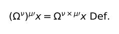\</td>
<td lang="en">\</td>
<td lang="en"><em>外部版本參照：</em> Ludwig Wittgenstein, Tractatus Logico-Philosophicus, trans. D. F. Pears and B. F. McGuinness, 2nd ed. (Routledge, 2001), ISBN 9780415254083.；命題 <code>6.241</code>；<a href="https://www.routledge.com/Tractatus-Logico-Philosophicus/Wittgenstein/p/book/9780415254083">來源</a></td>
<td lang="zh-Hant">第一式定義運算指數的乘法。 <small><strong>哲學解讀：</strong> 第一式提供後續替換所需定義。</small></td>
</tr>
<tr id="segment-6-241-c">
<td lang="de">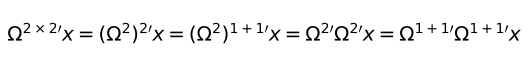\</td>
<td lang="en">\</td>
<td lang="en"><em>外部版本參照：</em> Ludwig Wittgenstein, Tractatus Logico-Philosophicus, trans. D. F. Pears and B. F. McGuinness, 2nd ed. (Routledge, 2001), ISBN 9780415254083.；命題 <code>6.241</code>；<a href="https://www.routledge.com/Tractatus-Logico-Philosophicus/Wittgenstein/p/book/9780415254083">來源</a></td>
<td lang="zh-Hant">第二式把二乘二次運算逐步展開為兩組二次運算。 <small><strong>哲學解讀：</strong> 第二式依定義重寫，不靠量測實物。</small></td>
</tr>
<tr id="segment-6-241-d">
<td lang="de">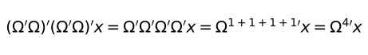\</td>
<td lang="en">\</td>
<td lang="en"><em>外部版本參照：</em> Ludwig Wittgenstein, Tractatus Logico-Philosophicus, trans. D. F. Pears and B. F. McGuinness, 2nd ed. (Routledge, 2001), ISBN 9780415254083.；命題 <code>6.241</code>；<a href="https://www.routledge.com/Tractatus-Logico-Philosophicus/Wittgenstein/p/book/9780415254083">來源</a></td>
<td lang="zh-Hant">第三式再展開為四次 Ω，最後得到四次運算。 <small><strong>哲學解讀：</strong> 末式完成正規化，示範替換法而非經驗驗證。</small></td>
</tr>
<tr class="project-relations">
<td colspan="4">
<strong>Akashic 專案關係</strong>
<ul>
<li><code>not_applicable</code> — Akashic 目前沒有把命題 6.241 所論的「命題二乘二等於四的證明如下。」設為直接軟體行為。 <small>理由：命題 6.241 的直接論旨是「命題二乘二等於四的證明如下。」；這句處理等式、可替換性或數學演算的形式地位；Akashic 的數值運算不會因表面相似就成為該數學方法的哲學實例。</small>
</li>
</ul>
</td>
</tr>
<tr id="proposition-6-3">
<td colspan="4"><strong>6.3</strong></td>
</tr>
<tr id="segment-6-3-a">
<td lang="de">Die Erforschung der Logik bedeutet die Erforschung *aller Gesetzmässigkeit*.</td>
<td lang="en">Logical research means the investigation of *all regularity*.</td>
<td lang="en"><em>外部版本參照：</em> Ludwig Wittgenstein, Tractatus Logico-Philosophicus, trans. D. F. Pears and B. F. McGuinness, 2nd ed. (Routledge, 2001), ISBN 9780415254083.；命題 <code>6.3</code>；<a href="https://www.routledge.com/Tractatus-Logico-Philosophicus/Wittgenstein/p/book/9780415254083">來源</a></td>
<td lang="zh-Hant">研究邏輯，就是研究一切合規律性。 <small><strong>哲學解讀：</strong> 這裡的規律性是邏輯形式，不是統計規律。</small></td>
</tr>
<tr id="segment-6-3-b">
<td lang="de">Und ausserhalb der Logik ist alles Zufall.</td>
<td lang="en">And outside logic all is accident.</td>
<td lang="en"><em>外部版本參照：</em> Ludwig Wittgenstein, Tractatus Logico-Philosophicus, trans. D. F. Pears and B. F. McGuinness, 2nd ed. (Routledge, 2001), ISBN 9780415254083.；命題 <code>6.3</code>；<a href="https://www.routledge.com/Tractatus-Logico-Philosophicus/Wittgenstein/p/book/9780415254083">來源</a></td>
<td lang="zh-Hant">而在邏輯之外，一切都是偶然的。 <small><strong>哲學解讀：</strong> 「偶然」意指非邏輯必然，不等於沒有因果或無法解釋。</small></td>
</tr>
<tr class="project-relations">
<td colspan="4">
<strong>Akashic 專案關係</strong>
<ul>
<li><code>not_applicable</code> — Akashic 目前沒有把命題 6.3 所論的「研究邏輯，就是研究一切合規律性。」設為直接軟體行為。 <small>理由：命題 6.3 的直接論旨是「研究邏輯，就是研究一切合規律性。」；這句處理科學描述、因果形式或邏輯可能性的界線；Akashic 的模型與驗證規則不能把經驗假設升格為邏輯必然。</small>
</li>
</ul>
</td>
</tr>
<tr id="proposition-6-31">
<td colspan="4"><strong>6.31</strong></td>
</tr>
<tr id="segment-6-31-a">
<td lang="de">Das sogenannte Gesetz der Induktion kann jedenfalls kein logisches Gesetz sein, denn es ist offenbar ein sinnvoller Satz.</td>
<td lang="en">The so-called law of induction cannot in any case be a logical law, for it is obviously a significant proposition.</td>
<td lang="en"><em>外部版本參照：</em> Ludwig Wittgenstein, Tractatus Logico-Philosophicus, trans. D. F. Pears and B. F. McGuinness, 2nd ed. (Routledge, 2001), ISBN 9780415254083.；命題 <code>6.31</code>；<a href="https://www.routledge.com/Tractatus-Logico-Philosophicus/Wittgenstein/p/book/9780415254083">來源</a></td>
<td lang="zh-Hant">所謂歸納律無論如何都不可能是邏輯法則，因為它顯然是有意義命題。 <small><strong>哲學解讀：</strong> 歸納律會排除某些可能情況，因而具有實質內容；它的成立不能只由邏輯形式保證。</small></td>
</tr>
<tr id="segment-6-31-b">
<td lang="de">– Und darum kann es auch kein Gesetz a priori sein.</td>
<td lang="en">—And therefore it cannot be a law a priori either.</td>
<td lang="en"><em>外部版本參照：</em> Ludwig Wittgenstein, Tractatus Logico-Philosophicus, trans. D. F. Pears and B. F. McGuinness, 2nd ed. (Routledge, 2001), ISBN 9780415254083.；命題 <code>6.31</code>；<a href="https://www.routledge.com/Tractatus-Logico-Philosophicus/Wittgenstein/p/book/9780415254083">來源</a></td>
<td lang="zh-Hant">——因此，它也不可能是先天法則。 <small><strong>哲學解讀：</strong> 後句把前述有實質內容的理由推到先天地位：若須由經驗評估，就不是此處所說的先天法則。</small></td>
</tr>
<tr class="project-relations">
<td colspan="4">
<strong>Akashic 專案關係</strong>
<ul>
<li><code>not_applicable</code> — Akashic 目前沒有把命題 6.31 對歸納律之非邏輯、非先天地位的主張設為直接軟體行為。 <small>理由：命題 6.31 因歸納律是有實質內容的命題，而否定它是邏輯或先天法則；這是在劃分經驗規律與邏輯形式。Akashic 的模型與驗證規則同樣不能把經驗假設升格為邏輯必然，但這項警戒不是形式邏輯實作。</small>
</li>
</ul>
</td>
</tr>
<tr id="proposition-6-32">
<td colspan="4"><strong>6.32</strong></td>
</tr>
<tr id="segment-6-32-a">
<td lang="de">Das Kausalitätsgesetz ist kein Gesetz, sondern die Form eines Gesetzes.</td>
<td lang="en">The law of causality is not a law but the form of a law.</td>
<td lang="en"><em>外部版本參照：</em> Ludwig Wittgenstein, Tractatus Logico-Philosophicus, trans. D. F. Pears and B. F. McGuinness, 2nd ed. (Routledge, 2001), ISBN 9780415254083.；命題 <code>6.32</code>；<a href="https://www.routledge.com/Tractatus-Logico-Philosophicus/Wittgenstein/p/book/9780415254083">來源</a></td>
<td lang="zh-Hant">因果律不是一條法則，而是一種法則的形式。 <small><strong>哲學解讀：</strong> 「因果律」標示一族經驗法則的形式，不能當成包辦所有事件的單一邏輯命題。</small></td>
</tr>
<tr class="project-relations">
<td colspan="4">
<strong>Akashic 專案關係</strong>
<ul>
<li><code>not_applicable</code> — Akashic 目前沒有把命題 6.32 所論的「因果律不是一條法則，而是一種法則的形式。」設為直接軟體行為。 <small>理由：命題 6.32 的直接論旨是「因果律不是一條法則，而是一種法則的形式。」；這句處理科學描述、因果形式或邏輯可能性的界線；Akashic 的模型與驗證規則不能把經驗假設升格為邏輯必然。</small>
</li>
</ul>
</td>
</tr>
<tr id="proposition-6-321">
<td colspan="4"><strong>6.321</strong></td>
</tr>
<tr id="segment-6-321-a">
<td lang="de">„Kausalitätsgesetz“, das ist ein Gattungsname.</td>
<td lang="en">“Law of Causality” is a class name.</td>
<td lang="en"><em>外部版本參照：</em> Ludwig Wittgenstein, Tractatus Logico-Philosophicus, trans. D. F. Pears and B. F. McGuinness, 2nd ed. (Routledge, 2001), ISBN 9780415254083.；命題 <code>6.321</code>；<a href="https://www.routledge.com/Tractatus-Logico-Philosophicus/Wittgenstein/p/book/9780415254083">來源</a></td>
<td lang="zh-Hant">「因果律」是一個類名。 <small><strong>哲學解讀：</strong> 類名統攝多條具體法則，名稱本身不是額外自然律。</small></td>
</tr>
<tr id="segment-6-321-b">
<td lang="de">Und wie es in der Mechanik, sagen wir, Minimum-Gesetze gibt, – etwa der kleinsten Wirkung – so gibt es in der Physik Kausalitätsgesetze, Gesetze von der Kausalitätsform.</td>
<td lang="en">And as in mechanics there are, for instance, minimum-laws, such as that of least action, so in physics there are causal laws, laws of the causality form.</td>
<td lang="en"><em>外部版本參照：</em> Ludwig Wittgenstein, Tractatus Logico-Philosophicus, trans. D. F. Pears and B. F. McGuinness, 2nd ed. (Routledge, 2001), ISBN 9780415254083.；命題 <code>6.321</code>；<a href="https://www.routledge.com/Tractatus-Logico-Philosophicus/Wittgenstein/p/book/9780415254083">來源</a></td>
<td lang="zh-Hant">正如力學有最小作用量等極小律，物理學也有各種具有因果形式的法則。 <small><strong>哲學解讀：</strong> 具體物理內容仍須分別陳述與檢驗。</small></td>
</tr>
<tr class="project-relations">
<td colspan="4">
<strong>Akashic 專案關係</strong>
<ul>
<li><code>not_applicable</code> — Akashic 目前沒有把命題 6.321 所論的「「因果律」是一個類名。」設為直接軟體行為。 <small>理由：命題 6.321 的直接論旨是「「因果律」是一個類名。」；這句處理科學描述、因果形式或邏輯可能性的界線；Akashic 的模型與驗證規則不能把經驗假設升格為邏輯必然。</small>
</li>
</ul>
</td>
</tr>
<tr id="proposition-6-3211">
<td colspan="4"><strong>6.3211</strong></td>
</tr>
<tr id="segment-6-3211-a">
<td lang="de">Man hat ja auch davon eine Ahnung gehabt, dass es *ein* „Gesetz der kleinsten Wirkung“ geben müsse, ehe man genau wusste, wie es lautete.</td>
<td lang="en">Men had indeed an idea that there must be *a* “law of least action”, before they knew exactly how it ran.</td>
<td lang="en"><em>外部版本參照：</em> Ludwig Wittgenstein, Tractatus Logico-Philosophicus, trans. D. F. Pears and B. F. McGuinness, 2nd ed. (Routledge, 2001), ISBN 9780415254083.；命題 <code>6.3211</code>；<a href="https://www.routledge.com/Tractatus-Logico-Philosophicus/Wittgenstein/p/book/9780415254083">來源</a></td>
<td lang="zh-Hant">人們在確切知道最小作用量定律如何表述前，已預感必定有某一條這樣的定律。 <small><strong>哲學解讀：</strong> 預感法則形式不等於先知其物理內容。</small></td>
</tr>
<tr id="segment-6-3211-b">
<td lang="de">(Hier, wie immer, stellt sich das a priori Gewisse als etwas rein Logisches heraus.)</td>
<td lang="en">(Here, as always, the a priori certain proves to be something purely logical.)</td>
<td lang="en"><em>外部版本參照：</em> Ludwig Wittgenstein, Tractatus Logico-Philosophicus, trans. D. F. Pears and B. F. McGuinness, 2nd ed. (Routledge, 2001), ISBN 9780415254083.；命題 <code>6.3211</code>；<a href="https://www.routledge.com/Tractatus-Logico-Philosophicus/Wittgenstein/p/book/9780415254083">來源</a></td>
<td lang="zh-Hant">（在此一如往常，先天確定的只是純邏輯之物。） <small><strong>哲學解讀：</strong> 括號把先天確定性限制在可能形式。</small></td>
</tr>
<tr class="project-relations">
<td colspan="4">
<strong>Akashic 專案關係</strong>
<ul>
<li><code>not_applicable</code> — Akashic 目前沒有把命題 6.3211 所論的「人們在確切知道最小作用量定律如何表述前，已預感必定有某一條這樣的定律。」設為直接軟體行為。 <small>理由：命題 6.3211 的直接論旨是「人們在確切知道最小作用量定律如何表述前，已預感必定有某一條這樣的定律。」；這句處理科學描述、因果形式或邏輯可能性的界線；Akashic 的模型與驗證規則不能把經驗假設升格為邏輯必然。</small>
</li>
</ul>
</td>
</tr>
<tr id="proposition-6-33">
<td colspan="4"><strong>6.33</strong></td>
</tr>
<tr id="segment-6-33-a">
<td lang="de">Wir *glauben* nicht a priori an ein Erhaltungsgesetz, sondern wir *wissen* a priori die Möglichkeit einer logischen Form.</td>
<td lang="en">We do not *believe* a priori in a law of conservation, but we *know* a priori the possibility of a logical form.</td>
<td lang="en"><em>外部版本參照：</em> Ludwig Wittgenstein, Tractatus Logico-Philosophicus, trans. D. F. Pears and B. F. McGuinness, 2nd ed. (Routledge, 2001), ISBN 9780415254083.；命題 <code>6.33</code>；<a href="https://www.routledge.com/Tractatus-Logico-Philosophicus/Wittgenstein/p/book/9780415254083">來源</a></td>
<td lang="zh-Hant">我們並非先天地相信一條守恆律，而是先天地知道某種邏輯形式的可能性。 <small><strong>哲學解讀：</strong> 守恆律是否成立需經驗支持；先天部分只涉及可表達形式。</small></td>
</tr>
<tr class="project-relations">
<td colspan="4">
<strong>Akashic 專案關係</strong>
<ul>
<li><code>not_applicable</code> — Akashic 目前沒有把命題 6.33 所論的「我們並非先天地相信一條守恆律，而是先天地知道某種邏輯形式的可能性。」設為直接軟體行為。 <small>理由：命題 6.33 的直接論旨是「我們並非先天地相信一條守恆律，而是先天地知道某種邏輯形式的可能性。」；這句處理科學描述、因果形式或邏輯可能性的界線；Akashic 的模型與驗證規則不能把經驗假設升格為邏輯必然。</small>
</li>
</ul>
</td>
</tr>
<tr id="proposition-6-34">
<td colspan="4"><strong>6.34</strong></td>
</tr>
<tr id="segment-6-34-a">
<td lang="de">Alle jene Sätze, wie der Satz vom Grunde, von der Kontinuität in der Natur, vom kleinsten Aufwande in der Natur etc. etc., alle diese sind Einsichten a priori über die mögliche Formgebung der Sätze der Wissenschaft.</td>
<td lang="en">All propositions, such as the law of causation, the law of continuity in nature, the law of least expenditure in nature, etc. etc., all these are a priori intuitions of possible forms of the propositions of science.</td>
<td lang="en"><em>外部版本參照：</em> Ludwig Wittgenstein, Tractatus Logico-Philosophicus, trans. D. F. Pears and B. F. McGuinness, 2nd ed. (Routledge, 2001), ISBN 9780415254083.；命題 <code>6.34</code>；<a href="https://www.routledge.com/Tractatus-Logico-Philosophicus/Wittgenstein/p/book/9780415254083">來源</a></td>
<td lang="zh-Hant">因果律、自然連續律、自然最小耗費律等，都是對科學命題可能形式的先天洞見。 <small><strong>哲學解讀：</strong> 這些原則規定描述網格，不預先決定世界實際填入的內容。</small></td>
</tr>
<tr class="project-relations">
<td colspan="4">
<strong>Akashic 專案關係</strong>
<ul>
<li><code>not_applicable</code> — Akashic 目前沒有把命題 6.34 所論的「因果律、自然連續律、自然最小耗費律等，都是對科學命題可能形式的先天洞見。」設為直接軟體行為。 <small>理由：命題 6.34 的直接論旨是「因果律、自然連續律、自然最小耗費律等，都是對科學命題可能形式的先天洞見。」；這句處理科學描述、因果形式或邏輯可能性的界線；Akashic 的模型與驗證規則不能把經驗假設升格為邏輯必然。</small>
</li>
</ul>
</td>
</tr>
<tr id="proposition-6-341">
<td colspan="4"><strong>6.341</strong></td>
</tr>
<tr id="segment-6-341-a">
<td lang="de">Die Newtonsche Mechanik z. B. bringt die Weltbeschreibung auf eine einheitliche Form.</td>
<td lang="en">Newtonian mechanics, for example, brings the description of the universe to a unified form.</td>
<td lang="en"><em>外部版本參照：</em> Ludwig Wittgenstein, Tractatus Logico-Philosophicus, trans. D. F. Pears and B. F. McGuinness, 2nd ed. (Routledge, 2001), ISBN 9780415254083.；命題 <code>6.341</code>；<a href="https://www.routledge.com/Tractatus-Logico-Philosophicus/Wittgenstein/p/book/9780415254083">來源</a></td>
<td lang="zh-Hant">牛頓力學把世界描述帶入統一形式。 <small><strong>哲學解讀：</strong> 第一句把力學定位成統一表示系統。</small></td>
</tr>
<tr id="segment-6-341-b">
<td lang="de">Denken wir uns eine weisse Fläche, auf der unregelmässige schwarze Flecken wären.</td>
<td lang="en">Let us imagine a white surface with irregular black spots.</td>
<td lang="en"><em>外部版本參照：</em> Ludwig Wittgenstein, Tractatus Logico-Philosophicus, trans. D. F. Pears and B. F. McGuinness, 2nd ed. (Routledge, 2001), ISBN 9780415254083.；命題 <code>6.341</code>；<a href="https://www.routledge.com/Tractatus-Logico-Philosophicus/Wittgenstein/p/book/9780415254083">來源</a></td>
<td lang="zh-Hant">設想白底上有不規則黑斑。 <small><strong>哲學解讀：</strong> 黑斑是待描述內容，不是理論自身。</small></td>
</tr>
<tr id="segment-6-341-c">
<td lang="de">Wir sagen nun: Was für ein Bild immer hierdurch entsteht, immer kann ich seiner Beschreibung beliebig nahe kommen, indem ich die Fläche mit einem entsprechend feinen quadratischen Netzwerk bedecke und nun von jedem Quadrat sage, dass es weiss oder schwarz ist.</td>
<td lang="en">We now say: Whatever kind of picture these make I can always get as near as I like to its description, if I cover the surface with a sufficiently fine square network and now say of every square that it is white or black.</td>
<td lang="en"><em>外部版本參照：</em> Ludwig Wittgenstein, Tractatus Logico-Philosophicus, trans. D. F. Pears and B. F. McGuinness, 2nd ed. (Routledge, 2001), ISBN 9780415254083.；命題 <code>6.341</code>；<a href="https://www.routledge.com/Tractatus-Logico-Philosophicus/Wittgenstein/p/book/9780415254083">來源</a></td>
<td lang="zh-Hant">無論圖像如何，只要覆上夠細的方格並逐格說明黑白，就能任意逼近其描述。 <small><strong>哲學解讀：</strong> 方格示範形式如何容納任意內容。</small></td>
</tr>
<tr id="segment-6-341-d">
<td lang="de">Ich werde auf diese Weise die Beschreibung der Fläche auf eine einheitliche Form gebracht haben.</td>
<td lang="en">In this way I shall have brought the description of the surface to a unified form.</td>
<td lang="en"><em>外部版本參照：</em> Ludwig Wittgenstein, Tractatus Logico-Philosophicus, trans. D. F. Pears and B. F. McGuinness, 2nd ed. (Routledge, 2001), ISBN 9780415254083.；命題 <code>6.341</code>；<a href="https://www.routledge.com/Tractatus-Logico-Philosophicus/Wittgenstein/p/book/9780415254083">來源</a></td>
<td lang="zh-Hant">如此便把平面描述帶入統一形式。 <small><strong>哲學解讀：</strong> 統一性來自共同網格，不代表圖像相同。</small></td>
</tr>
<tr id="segment-6-341-e">
<td lang="de">Diese Form ist beliebig, denn ich hätte mit dem gleichen Erfolge ein Netz aus dreieckigen oder sechseckigen Maschen verwenden können.</td>
<td lang="en">This form is arbitrary, because I could have applied with equal success a net with a triangular or hexagonal mesh.</td>
<td lang="en"><em>外部版本參照：</em> Ludwig Wittgenstein, Tractatus Logico-Philosophicus, trans. D. F. Pears and B. F. McGuinness, 2nd ed. (Routledge, 2001), ISBN 9780415254083.；命題 <code>6.341</code>；<a href="https://www.routledge.com/Tractatus-Logico-Philosophicus/Wittgenstein/p/book/9780415254083">來源</a></td>
<td lang="zh-Hant">這種形式是任意的，也可採三角形或六角形網格。 <small><strong>哲學解讀：</strong> 網格形狀可選，故描述形式含約定成分。</small></td>
</tr>
<tr id="segment-6-341-f">
<td lang="de">Es kann sein, dass die Beschreibung mit Hilfe eines Dreiecks-Netzes einfacher geworden wäre; das heisst, dass wir die Fläche mit einem gröberen Dreiecks-Netz genauer beschreiben könnten, als mit einem feineren quadratischen (oder umgekehrt) u. s. w.</td>
<td lang="en">It can happen that the description would have been simpler with the aid of a triangular mesh; that is to say we might have described the surface more accurately with a triangular, and coarser, than with the finer square mesh, or vice versa, and so on.</td>
<td lang="en"><em>外部版本參照：</em> Ludwig Wittgenstein, Tractatus Logico-Philosophicus, trans. D. F. Pears and B. F. McGuinness, 2nd ed. (Routledge, 2001), ISBN 9780415254083.；命題 <code>6.341</code>；<a href="https://www.routledge.com/Tractatus-Logico-Philosophicus/Wittgenstein/p/book/9780415254083">來源</a></td>
<td lang="zh-Hant">三角網格有時可能以較粗網目得到比細方格更簡潔準確的描述，反之亦然。 <small><strong>哲學解讀：</strong> 簡潔度與所描述圖像相關，不能由網格形式單獨決定。</small></td>
</tr>
<tr id="segment-6-341-g">
<td lang="de">Den verschiedenen Netzen entsprechen verschiedene Systeme der Weltbeschreibung.</td>
<td lang="en">To the different networks correspond different systems of describing the world.</td>
<td lang="en"><em>外部版本參照：</em> Ludwig Wittgenstein, Tractatus Logico-Philosophicus, trans. D. F. Pears and B. F. McGuinness, 2nd ed. (Routledge, 2001), ISBN 9780415254083.；命題 <code>6.341</code>；<a href="https://www.routledge.com/Tractatus-Logico-Philosophicus/Wittgenstein/p/book/9780415254083">來源</a></td>
<td lang="zh-Hant">不同網格對應不同世界描述系統。 <small><strong>哲學解讀：</strong> 不同理論可形成不同描述座標。</small></td>
</tr>
<tr id="segment-6-341-h">
<td lang="de">Die Mechanik bestimmt eine Form der Weltbeschreibung, indem sie sagt: Alle Sätze der Weltbeschreibung müssen aus einer Anzahl gegebener Sätze – den mechanischen Axiomen – auf eine gegebene Art und Weise erhalten werden.</td>
<td lang="en">Mechanics determine a form of description by saying: All propositions in the description of the world must be obtained in a given way from a number of given propositions—the mechanical axioms.</td>
<td lang="en"><em>外部版本參照：</em> Ludwig Wittgenstein, Tractatus Logico-Philosophicus, trans. D. F. Pears and B. F. McGuinness, 2nd ed. (Routledge, 2001), ISBN 9780415254083.；命題 <code>6.341</code>；<a href="https://www.routledge.com/Tractatus-Logico-Philosophicus/Wittgenstein/p/book/9780415254083">來源</a></td>
<td lang="zh-Hant">力學規定描述形式：世界描述命題須以指定方式由力學公理構成。 <small><strong>哲學解讀：</strong> 公理規定可接受描述如何生成。</small></td>
</tr>
<tr id="segment-6-341-i">
<td lang="de">Hierdurch liefert sie die Bausteine zum Bau des wissenschaftlichen Gebäudes und sagt: Welches Gebäude immer du aufführen willst, jedes musst du irgendwie mit diesen und nur diesen Bausteinen zusammenbringen.</td>
<td lang="en">It thus provides the bricks for building the edifice of science, and says: Whatever building thou wouldst erect, thou shalt construct it in some manner with these bricks and these alone.</td>
<td lang="en"><em>外部版本參照：</em> Ludwig Wittgenstein, Tractatus Logico-Philosophicus, trans. D. F. Pears and B. F. McGuinness, 2nd ed. (Routledge, 2001), ISBN 9780415254083.；命題 <code>6.341</code>；<a href="https://www.routledge.com/Tractatus-Logico-Philosophicus/Wittgenstein/p/book/9780415254083">來源</a></td>
<td lang="zh-Hant">它提供科學建築的磚塊，要求任何建築都只用這些磚塊組合。 <small><strong>哲學解讀：</strong> 磚塊比喻說的是表達限制，不保證建成的命題為真。</small></td>
</tr>
<tr id="segment-6-341-j">
<td lang="de">\(Wie man mit dem Zahlensystem jede beliebige Anzahl, so muss man mit dem System der Mechanik jeden beliebigen Satz der Physik hinschreiben können.)</td>
<td lang="en">\(As with the system of numbers one must be able to write down any arbitrary number, so with the system of mechanics one must be able to write down any arbitrary physical proposition.)</td>
<td lang="en"><em>外部版本參照：</em> Ludwig Wittgenstein, Tractatus Logico-Philosophicus, trans. D. F. Pears and B. F. McGuinness, 2nd ed. (Routledge, 2001), ISBN 9780415254083.；命題 <code>6.341</code>；<a href="https://www.routledge.com/Tractatus-Logico-Philosophicus/Wittgenstein/p/book/9780415254083">來源</a></td>
<td lang="zh-Hant">（如同數系應能寫出任意數，力學系統也應能寫出任意物理命題。） <small><strong>哲學解讀：</strong> 括號要求表示完備性，仍不決定哪個物理命題符合世界。</small></td>
</tr>
<tr class="project-relations">
<td colspan="4">
<strong>Akashic 專案關係</strong>
<ul>
<li><code>not_applicable</code> — Akashic 目前沒有把命題 6.341 所論的「牛頓力學把世界描述帶入統一形式。」設為直接軟體行為。 <small>理由：命題 6.341 的直接論旨是「牛頓力學把世界描述帶入統一形式。」；這句處理科學描述、因果形式或邏輯可能性的界線；Akashic 的模型與驗證規則不能把經驗假設升格為邏輯必然。</small>
</li>
</ul>
</td>
</tr>
<tr id="proposition-6-342">
<td colspan="4"><strong>6.342</strong></td>
</tr>
<tr id="segment-6-342-a">
<td lang="de">Und nun sehen wir die gegenseitige Stellung von Logik und Mechanik.</td>
<td lang="en">And now we see the relative position of logic and mechanics.</td>
<td lang="en"><em>外部版本參照：</em> Ludwig Wittgenstein, Tractatus Logico-Philosophicus, trans. D. F. Pears and B. F. McGuinness, 2nd ed. (Routledge, 2001), ISBN 9780415254083.；命題 <code>6.342</code>；<a href="https://www.routledge.com/Tractatus-Logico-Philosophicus/Wittgenstein/p/book/9780415254083">來源</a></td>
<td lang="zh-Hant">由此可看見邏輯與力學的相對位置。 <small><strong>哲學解讀：</strong> 第一句開始區分普遍形式與經驗內容。</small></td>
</tr>
<tr id="segment-6-342-b">
<td lang="de">(Man könnte das Netz auch aus verschiedenartigen Figuren etwa aus Dreiecken und Sechsecken bestehen lassen.)</td>
<td lang="en">(We could construct the network out of figures of different kinds, as out of triangles and hexagons together.)</td>
<td lang="en"><em>外部版本參照：</em> Ludwig Wittgenstein, Tractatus Logico-Philosophicus, trans. D. F. Pears and B. F. McGuinness, 2nd ed. (Routledge, 2001), ISBN 9780415254083.；命題 <code>6.342</code>；<a href="https://www.routledge.com/Tractatus-Logico-Philosophicus/Wittgenstein/p/book/9780415254083">來源</a></td>
<td lang="zh-Hant">（網格也可混用三角形與六角形。） <small><strong>哲學解讀：</strong> 混合網格再次顯示形式選擇可約定。</small></td>
</tr>
<tr id="segment-6-342-c">
<td lang="de">Dass sich ein Bild, wie das vorhin erwähnte, durch ein Netz von gegebener Form beschreiben lässt, sagt über das Bild *nichts* aus.</td>
<td lang="en">That a picture like that instanced above can be described by a network of a given form asserts *nothing* about the picture.</td>
<td lang="en"><em>外部版本參照：</em> Ludwig Wittgenstein, Tractatus Logico-Philosophicus, trans. D. F. Pears and B. F. McGuinness, 2nd ed. (Routledge, 2001), ISBN 9780415254083.；命題 <code>6.342</code>；<a href="https://www.routledge.com/Tractatus-Logico-Philosophicus/Wittgenstein/p/book/9780415254083">來源</a></td>
<td lang="zh-Hant">一幅圖能被某種形狀的網格描述，本身對圖像什麼也沒說。 <small><strong>哲學解讀：</strong> 僅能套用框架不構成關於資料的資訊。</small></td>
</tr>
<tr id="segment-6-342-d">
<td lang="de">(Denn dies gilt für jedes Bild dieser Art.)</td>
<td lang="en">(For this holds of every picture of this kind.)</td>
<td lang="en"><em>外部版本參照：</em> Ludwig Wittgenstein, Tractatus Logico-Philosophicus, trans. D. F. Pears and B. F. McGuinness, 2nd ed. (Routledge, 2001), ISBN 9780415254083.；命題 <code>6.342</code>；<a href="https://www.routledge.com/Tractatus-Logico-Philosophicus/Wittgenstein/p/book/9780415254083">來源</a></td>
<td lang="zh-Hant">（因為同類圖像都可如此。） <small><strong>哲學解讀：</strong> 括號說明該能力對所有同類圖像都成立。</small></td>
</tr>
<tr id="segment-6-342-e">
<td lang="de">*Das* aber charakterisiert das Bild, dass es sich durch ein bestimmtes Netz von *bestimmter* Feinheit *vollständig* beschreiben lässt.</td>
<td lang="en">But *this* does characterize the picture, the fact, namely, that it can be *completely* described by a definite net of *definite* fineness.</td>
<td lang="en"><em>外部版本參照：</em> Ludwig Wittgenstein, Tractatus Logico-Philosophicus, trans. D. F. Pears and B. F. McGuinness, 2nd ed. (Routledge, 2001), ISBN 9780415254083.；命題 <code>6.342</code>；<a href="https://www.routledge.com/Tractatus-Logico-Philosophicus/Wittgenstein/p/book/9780415254083">來源</a></td>
<td lang="zh-Hant">真正刻畫圖像的是它能被某種特定形狀、特定細度的網格完整描述。 <small><strong>哲學解讀：</strong> 具體網格與細度才反映圖像結構。</small></td>
</tr>
<tr id="segment-6-342-f">
<td lang="de">So auch sagt es nichts über die Welt aus, dass sie sich durch die Newtonsche Mechanik beschreiben lässt; wohl aber, dass sie sich *so* durch jene beschreiben lässt, wie dies eben der Fall ist.</td>
<td lang="en">So too the fact that it can be described by Newtonian mechanics asserts nothing about the world; but *this* asserts something, namely, that it can be described in that particular way in which as a matter of fact it is described.</td>
<td lang="en"><em>外部版本參照：</em> Ludwig Wittgenstein, Tractatus Logico-Philosophicus, trans. D. F. Pears and B. F. McGuinness, 2nd ed. (Routledge, 2001), ISBN 9780415254083.；命題 <code>6.342</code>；<a href="https://www.routledge.com/Tractatus-Logico-Philosophicus/Wittgenstein/p/book/9780415254083">來源</a></td>
<td lang="zh-Hant">世界可由牛頓力學描述本身沒說什麼；它實際以何種方式被描述才說出東西。 <small><strong>哲學解讀：</strong> 理論可用性不同於世界實際呈現的參數。</small></td>
</tr>
<tr id="segment-6-342-g">
<td lang="de">Auch das sagt etwas über die Welt, dass sie sich durch die eine Mechanik einfacher beschreiben lässt, als durch die andere.</td>
<td lang="en">The fact, too, that it can be described more simply by one system of mechanics than by another says something about the world.</td>
<td lang="en"><em>外部版本參照：</em> Ludwig Wittgenstein, Tractatus Logico-Philosophicus, trans. D. F. Pears and B. F. McGuinness, 2nd ed. (Routledge, 2001), ISBN 9780415254083.；命題 <code>6.342</code>；<a href="https://www.routledge.com/Tractatus-Logico-Philosophicus/Wittgenstein/p/book/9780415254083">來源</a></td>
<td lang="zh-Hant">某一力學比另一力學能更簡潔描述世界，也說出了世界的某些東西。 <small><strong>哲學解讀：</strong> 相對簡潔性可能成為關於世界的線索，但不是邏輯真理。</small></td>
</tr>
<tr class="project-relations">
<td colspan="4">
<strong>Akashic 專案關係</strong>
<ul>
<li><code>not_applicable</code> — Akashic 目前沒有把命題 6.342 所論的「由此可看見邏輯與力學的相對位置。」設為直接軟體行為。 <small>理由：命題 6.342 的直接論旨是「由此可看見邏輯與力學的相對位置。」；這句處理科學描述、因果形式或邏輯可能性的界線；Akashic 的模型與驗證規則不能把經驗假設升格為邏輯必然。</small>
</li>
</ul>
</td>
</tr>
<tr id="proposition-6-343">
<td colspan="4"><strong>6.343</strong></td>
</tr>
<tr id="segment-6-343-a">
<td lang="de">Die Mechanik ist ein Versuch, alle *wahren* Sätze, die wir zur Weltbeschreibung brauchen, nach Einem Plane zu konstruieren.</td>
<td lang="en">Mechanics is an attempt to construct according to a single plan all *true* propositions which we need for the description of the world.</td>
<td lang="en"><em>外部版本參照：</em> Ludwig Wittgenstein, Tractatus Logico-Philosophicus, trans. D. F. Pears and B. F. McGuinness, 2nd ed. (Routledge, 2001), ISBN 9780415254083.；命題 <code>6.343</code>；<a href="https://www.routledge.com/Tractatus-Logico-Philosophicus/Wittgenstein/p/book/9780415254083">來源</a></td>
<td lang="zh-Hant">力學企圖依單一計畫，構造描述世界所需的所有真命題。 <small><strong>哲學解讀：</strong> 計畫提供統一生成方式；個別命題之真仍取決於世界。</small></td>
</tr>
<tr class="project-relations">
<td colspan="4">
<strong>Akashic 專案關係</strong>
<ul>
<li><code>not_applicable</code> — Akashic 目前沒有把命題 6.343 所論的「力學企圖依單一計畫，構造描述世界所需的所有真命題。」設為直接軟體行為。 <small>理由：命題 6.343 的直接論旨是「力學企圖依單一計畫，構造描述世界所需的所有真命題。」；這句處理科學描述、因果形式或邏輯可能性的界線；Akashic 的模型與驗證規則不能把經驗假設升格為邏輯必然。</small>
</li>
</ul>
</td>
</tr>
<tr id="proposition-6-3431">
<td colspan="4"><strong>6.3431</strong></td>
</tr>
<tr id="segment-6-3431-a">
<td lang="de">Durch den ganzen logischen Apparat hindurch sprechen die physikalischen Gesetze doch von den Gegenständen der Welt.</td>
<td lang="en">Through their whole logical apparatus the physical laws still speak of the objects of the world.</td>
<td lang="en"><em>外部版本參照：</em> Ludwig Wittgenstein, Tractatus Logico-Philosophicus, trans. D. F. Pears and B. F. McGuinness, 2nd ed. (Routledge, 2001), ISBN 9780415254083.；命題 <code>6.3431</code>；<a href="https://www.routledge.com/Tractatus-Logico-Philosophicus/Wittgenstein/p/book/9780415254083">來源</a></td>
<td lang="zh-Hant">物理法則縱使穿過整套邏輯裝置，終究仍談論世界中的對象。 <small><strong>哲學解讀：</strong> 形式化不會把經驗法則變成純邏輯。</small></td>
</tr>
<tr class="project-relations">
<td colspan="4">
<strong>Akashic 專案關係</strong>
<ul>
<li><code>not_applicable</code> — Akashic 目前沒有把命題 6.3431 所論的「物理法則縱使穿過整套邏輯裝置，終究仍談論世界中的對象。」設為直接軟體行為。 <small>理由：命題 6.3431 的直接論旨是「物理法則縱使穿過整套邏輯裝置，終究仍談論世界中的對象。」；這句處理科學描述、因果形式或邏輯可能性的界線；Akashic 的模型與驗證規則不能把經驗假設升格為邏輯必然。</small>
</li>
</ul>
</td>
</tr>
<tr id="proposition-6-3432">
<td colspan="4"><strong>6.3432</strong></td>
</tr>
<tr id="segment-6-3432-a">
<td lang="de">Wir dürfen nicht vergessen, dass die Weltbeschreibung durch die Mechanik immer die ganz allgemeine ist.</td>
<td lang="en">We must not forget that the description of the world by mechanics is always quite general.</td>
<td lang="en"><em>外部版本參照：</em> Ludwig Wittgenstein, Tractatus Logico-Philosophicus, trans. D. F. Pears and B. F. McGuinness, 2nd ed. (Routledge, 2001), ISBN 9780415254083.；命題 <code>6.3432</code>；<a href="https://www.routledge.com/Tractatus-Logico-Philosophicus/Wittgenstein/p/book/9780415254083">來源</a></td>
<td lang="zh-Hant">不可忘記，力學的世界描述總是極一般的。 <small><strong>哲學解讀：</strong> 理論給一般形式。</small></td>
</tr>
<tr id="segment-6-3432-b">
<td lang="de">Es ist in ihr z. B. nie von *bestimmten* materiellen Punkten die Rede, sondern immer nur von *irgend welchen*.</td>
<td lang="en">There is, for example, never any mention of *particular* material points in it, but always only of *some points or other*.</td>
<td lang="en"><em>外部版本參照：</em> Ludwig Wittgenstein, Tractatus Logico-Philosophicus, trans. D. F. Pears and B. F. McGuinness, 2nd ed. (Routledge, 2001), ISBN 9780415254083.；命題 <code>6.3432</code>；<a href="https://www.routledge.com/Tractatus-Logico-Philosophicus/Wittgenstein/p/book/9780415254083">來源</a></td>
<td lang="zh-Hant">其中從不談特定物質點，只談某些物質點。 <small><strong>哲學解讀：</strong> 個別對象與初始條件仍須另外指定。</small></td>
</tr>
<tr class="project-relations">
<td colspan="4">
<strong>Akashic 專案關係</strong>
<ul>
<li><code>not_applicable</code> — Akashic 目前沒有把命題 6.3432 所論的「不可忘記，力學的世界描述總是極一般的。」設為直接軟體行為。 <small>理由：命題 6.3432 的直接論旨是「不可忘記，力學的世界描述總是極一般的。」；這句處理科學描述、因果形式或邏輯可能性的界線；Akashic 的模型與驗證規則不能把經驗假設升格為邏輯必然。</small>
</li>
</ul>
</td>
</tr>
<tr id="proposition-6-35">
<td colspan="4"><strong>6.35</strong></td>
</tr>
<tr id="segment-6-35-a">
<td lang="de">Obwohl die Flecke in unserem Bild geometrische Figuren sind, so kann doch selbstverständlich die Geometrie gar nichts über ihre tatsächliche Form und Lage sagen.</td>
<td lang="en">Although the spots in our picture are geometrical figures, geometry can obviously say nothing about their actual form and position.</td>
<td lang="en"><em>外部版本參照：</em> Ludwig Wittgenstein, Tractatus Logico-Philosophicus, trans. D. F. Pears and B. F. McGuinness, 2nd ed. (Routledge, 2001), ISBN 9780415254083.；命題 <code>6.35</code>；<a href="https://www.routledge.com/Tractatus-Logico-Philosophicus/Wittgenstein/p/book/9780415254083">來源</a></td>
<td lang="zh-Hant">圖中的斑點雖是幾何圖形，幾何學卻無法說出它們實際的形狀與位置。 <small><strong>哲學解讀：</strong> 形式科學不決定偶然配置。</small></td>
</tr>
<tr id="segment-6-35-b">
<td lang="de">Das Netz aber ist *rein* geometrisch, alle seine Eigenschaften können a priori angegeben werden.</td>
<td lang="en">But the network is *purely* geometrical, and all its properties can be given a priori.</td>
<td lang="en"><em>外部版本參照：</em> Ludwig Wittgenstein, Tractatus Logico-Philosophicus, trans. D. F. Pears and B. F. McGuinness, 2nd ed. (Routledge, 2001), ISBN 9780415254083.；命題 <code>6.35</code>；<a href="https://www.routledge.com/Tractatus-Logico-Philosophicus/Wittgenstein/p/book/9780415254083">來源</a></td>
<td lang="zh-Hant">網格是純幾何的，其全部性質都可先天給定。 <small><strong>哲學解讀：</strong> 描述框架的性質可先天分析。</small></td>
</tr>
<tr id="segment-6-35-c">
<td lang="de">Gesetze, wie der Satz vom Grunde, etc., handeln vom Netz, nicht von dem, was das Netz beschreibt.</td>
<td lang="en">Laws, like the law of causation, etc., treat of the network and not of what the network describes.</td>
<td lang="en"><em>外部版本參照：</em> Ludwig Wittgenstein, Tractatus Logico-Philosophicus, trans. D. F. Pears and B. F. McGuinness, 2nd ed. (Routledge, 2001), ISBN 9780415254083.；命題 <code>6.35</code>；<a href="https://www.routledge.com/Tractatus-Logico-Philosophicus/Wittgenstein/p/book/9780415254083">來源</a></td>
<td lang="zh-Hant">因果律等法則談的是網格，不是網格所描述的內容。 <small><strong>哲學解讀：</strong> 把法則放在網格一側，可避免誤認它已解釋具體現象。</small></td>
</tr>
<tr class="project-relations">
<td colspan="4">
<strong>Akashic 專案關係</strong>
<ul>
<li><code>not_applicable</code> — Akashic 目前沒有把命題 6.35 所論的「圖中的斑點雖是幾何圖形，幾何學卻無法說出它們實際的形狀與位置。」設為直接軟體行為。 <small>理由：命題 6.35 的直接論旨是「圖中的斑點雖是幾何圖形，幾何學卻無法說出它們實際的形狀與位置。」；這句處理科學描述、因果形式或邏輯可能性的界線；Akashic 的模型與驗證規則不能把經驗假設升格為邏輯必然。</small>
</li>
</ul>
</td>
</tr>
<tr id="proposition-6-36">
<td colspan="4"><strong>6.36</strong></td>
</tr>
<tr id="segment-6-36-a">
<td lang="de">Wenn es ein Kausalitätsgesetz gäbe, so könnte es lauten: „Es gibt Naturgesetze“.</td>
<td lang="en">If there were a law of causality, it might run: “There are natural laws”.</td>
<td lang="en"><em>外部版本參照：</em> Ludwig Wittgenstein, Tractatus Logico-Philosophicus, trans. D. F. Pears and B. F. McGuinness, 2nd ed. (Routledge, 2001), ISBN 9780415254083.；命題 <code>6.36</code>；<a href="https://www.routledge.com/Tractatus-Logico-Philosophicus/Wittgenstein/p/book/9780415254083">來源</a></td>
<td lang="zh-Hant">假使有一條因果律，它或許會說：「有自然律。」 <small><strong>哲學解讀：</strong> 「有規律」是可描述性的背景，不是另一條同層次法則。</small></td>
</tr>
<tr id="segment-6-36-b">
<td lang="de">Aber freilich kann man das nicht sagen: es zeigt sich.</td>
<td lang="en">But that can clearly not be said: it shows itself.</td>
<td lang="en"><em>外部版本參照：</em> Ludwig Wittgenstein, Tractatus Logico-Philosophicus, trans. D. F. Pears and B. F. McGuinness, 2nd ed. (Routledge, 2001), ISBN 9780415254083.；命題 <code>6.36</code>；<a href="https://www.routledge.com/Tractatus-Logico-Philosophicus/Wittgenstein/p/book/9780415254083">來源</a></td>
<td lang="zh-Hant">但這不能被說出；它顯示自身。 <small><strong>哲學解讀：</strong> 第二句延續說出／顯示的界線。</small></td>
</tr>
<tr class="project-relations">
<td colspan="4">
<strong>Akashic 專案關係</strong>
<ul>
<li><code>not_applicable</code> — Akashic 目前沒有把命題 6.36 所論的「假使有一條因果律，它或許會說：「有自然律。」」設為直接軟體行為。 <small>理由：命題 6.36 的直接論旨是「假使有一條因果律，它或許會說：「有自然律。」」；這句處理科學描述、因果形式或邏輯可能性的界線；Akashic 的模型與驗證規則不能把經驗假設升格為邏輯必然。</small>
</li>
</ul>
</td>
</tr>
<tr id="proposition-6-361">
<td colspan="4"><strong>6.361</strong></td>
</tr>
<tr id="segment-6-361-a">
<td lang="de">In der Ausdrucksweise Hertz’s könnte man sagen: Nur *gesetzmässige* Zusammenhänge sind *denkbar*.</td>
<td lang="en">In the terminology of Hertz we might say: Only *uniform* connexions are *thinkable*.</td>
<td lang="en"><em>外部版本參照：</em> Ludwig Wittgenstein, Tractatus Logico-Philosophicus, trans. D. F. Pears and B. F. McGuinness, 2nd ed. (Routledge, 2001), ISBN 9780415254083.；命題 <code>6.361</code>；<a href="https://www.routledge.com/Tractatus-Logico-Philosophicus/Wittgenstein/p/book/9780415254083">來源</a></td>
<td lang="zh-Hant">用赫茲的說法，只有合乎法則的關聯才是可思的。 <small><strong>哲學解讀：</strong> 可描述事件須落在某種規則形式中；不表示我們已知正確經驗法則。</small></td>
</tr>
<tr class="project-relations">
<td colspan="4">
<strong>Akashic 專案關係</strong>
<ul>
<li><code>not_applicable</code> — Akashic 目前沒有把命題 6.361 所論的「用赫茲的說法，只有合乎法則的關聯才是可思的。」設為直接軟體行為。 <small>理由：命題 6.361 的直接論旨是「用赫茲的說法，只有合乎法則的關聯才是可思的。」；這句處理科學描述、因果形式或邏輯可能性的界線；Akashic 的模型與驗證規則不能把經驗假設升格為邏輯必然。</small>
</li>
</ul>
</td>
</tr>
<tr id="proposition-6-3611">
<td colspan="4"><strong>6.3611</strong></td>
</tr>
<tr id="segment-6-3611-a">
<td lang="de">Wir können keinen Vorgang mit dem „Ablauf der Zeit“ vergleichen – diesen gibt es nicht –, sondern nur mit einem anderen Vorgang (etwa mit dem Gang des Chronometers).</td>
<td lang="en">We cannot compare any process with the “passage of time”—there is no such thing—but only with another process (say, with the movement of the chronometer).</td>
<td lang="en"><em>外部版本參照：</em> Ludwig Wittgenstein, Tractatus Logico-Philosophicus, trans. D. F. Pears and B. F. McGuinness, 2nd ed. (Routledge, 2001), ISBN 9780415254083.；命題 <code>6.3611</code>；<a href="https://www.routledge.com/Tractatus-Logico-Philosophicus/Wittgenstein/p/book/9780415254083">來源</a></td>
<td lang="zh-Hant">我們不能把任何過程與「時間流逝」比較，因為沒有這種獨立過程；只能把它與另一過程比較，例如計時器運行。 <small><strong>哲學解讀：</strong> 時間量測依事件間比較，不依名為時間流的額外對象。</small></td>
</tr>
<tr id="segment-6-3611-b">
<td lang="de">Daher ist die Beschreibung des zeitlichen Verlaufs nur so möglich, dass wir uns auf einen anderen Vorgang stützen.</td>
<td lang="en">Hence the description of the temporal sequence of events is only possible if we support ourselves on another process.</td>
<td lang="en"><em>外部版本參照：</em> Ludwig Wittgenstein, Tractatus Logico-Philosophicus, trans. D. F. Pears and B. F. McGuinness, 2nd ed. (Routledge, 2001), ISBN 9780415254083.；命題 <code>6.3611</code>；<a href="https://www.routledge.com/Tractatus-Logico-Philosophicus/Wittgenstein/p/book/9780415254083">來源</a></td>
<td lang="zh-Hant">所以描述時間進程只能依靠另一個過程。 <small><strong>哲學解讀：</strong> 量測基準本身也是一個過程。</small></td>
</tr>
<tr id="segment-6-3611-c">
<td lang="de">Ganz Analoges gilt für den Raum.</td>
<td lang="en">It is exactly analogous for space.</td>
<td lang="en"><em>外部版本參照：</em> Ludwig Wittgenstein, Tractatus Logico-Philosophicus, trans. D. F. Pears and B. F. McGuinness, 2nd ed. (Routledge, 2001), ISBN 9780415254083.；命題 <code>6.3611</code>；<a href="https://www.routledge.com/Tractatus-Logico-Philosophicus/Wittgenstein/p/book/9780415254083">來源</a></td>
<td lang="zh-Hant">空間也完全類似。 <small><strong>哲學解讀：</strong> 空間描述同樣需要關係基準。</small></td>
</tr>
<tr id="segment-6-3611-d">
<td lang="de">Wo man z. B. sagt, es könne keines von zwei Ereignissen (die sich gegenseitig ausschliessen) eintreten, weil *keine Ursache* vorhanden sei, warum das eine eher als das andere eintreten solle, da handelt es sich in Wirklichkeit darum, dass man gar nicht *eines* der beiden Ereignisse beschreiben kann, wenn nicht irgend eine Asymmetrie vorhanden ist.</td>
<td lang="en">When, for example, we say that neither of two events (which mutually exclude one another) can occur, because there is *no cause* why the one should occur rather than the other, it is really a matter of our being unable to describe *one* of the two events unless there is some sort of asymmetry.</td>
<td lang="en"><em>外部版本參照：</em> Ludwig Wittgenstein, Tractatus Logico-Philosophicus, trans. D. F. Pears and B. F. McGuinness, 2nd ed. (Routledge, 2001), ISBN 9780415254083.；命題 <code>6.3611</code>；<a href="https://www.routledge.com/Tractatus-Logico-Philosophicus/Wittgenstein/p/book/9780415254083">來源</a></td>
<td lang="zh-Hant">若兩個互斥事件都因沒有原因偏向其一而被說成不能發生，真正問題是：缺少不對稱時，根本無法描述其中一個事件。 <small><strong>哲學解讀：</strong> 這句以可描述性重新分析所謂無原因的對稱情況。</small></td>
</tr>
<tr id="segment-6-3611-e">
<td lang="de">Und *wenn* eine solche Asymmetrie vorhanden *ist*, so können wir diese als *Ursache* des Eintreffens des einen und Nicht-Eintreffens des anderen auffassen.</td>
<td lang="en">And if there *is* such an asymmetry, we can regard this as the *cause* of the occurrence of the one and of the non-occurrence of the other.</td>
<td lang="en"><em>外部版本參照：</em> Ludwig Wittgenstein, Tractatus Logico-Philosophicus, trans. D. F. Pears and B. F. McGuinness, 2nd ed. (Routledge, 2001), ISBN 9780415254083.；命題 <code>6.3611</code>；<a href="https://www.routledge.com/Tractatus-Logico-Philosophicus/Wittgenstein/p/book/9780415254083">來源</a></td>
<td lang="zh-Hant">若有不對稱，就可把它視為一者發生而另一者不發生的原因。 <small><strong>哲學解讀：</strong> 不對稱可作原因描述，但不是說任何差異都已構成充分因果證據。</small></td>
</tr>
<tr class="project-relations">
<td colspan="4">
<strong>Akashic 專案關係</strong>
<ul>
<li><code>not_applicable</code> — Akashic 目前沒有把命題 6.3611 所論的「我們不能把任何過程與「時間流逝」比較，因為沒有這種獨立過程；只能把它與另一過程比較，例如計時器運行。」設為直接軟體行為。 <small>理由：命題 6.3611 的直接論旨是「我們不能把任何過程與「時間流逝」比較，因為沒有這種獨立過程；只能把它與另一過程比較，例如計時器運行。」；這句處理科學描述、因果形式或邏輯可能性的界線；Akashic 的模型與驗證規則不能把經驗假設升格為邏輯必然。</small>
</li>
</ul>
</td>
</tr>
<tr id="proposition-6-36111">
<td colspan="4"><strong>6.36111</strong></td>
</tr>
<tr id="segment-6-36111-a">
<td lang="de">Das Kant’sche Problem von der rechten und linken Hand, die man nicht zur Deckung bringen kann, besteht schon in der Ebene, ja im eindimensionalen Raum, wo die beiden kongruenten Figuren *a* und *b* auch nicht zur Deckung gebracht werden können, ohne aus diesem Raum herausbewegt zu werden.</td>
<td lang="en">The Kantian problem of the right and left hand which cannot be made to cover one another already exists in the plane, and even in one-dimensional space; where the two congruent figures *a* and *b* cannot be made to cover one another without moving them out of this space.</td>
<td lang="en"><em>外部版本參照：</em> Ludwig Wittgenstein, Tractatus Logico-Philosophicus, trans. D. F. Pears and B. F. McGuinness, 2nd ed. (Routledge, 2001), ISBN 9780415254083.；命題 <code>6.36111</code>；<a href="https://www.routledge.com/Tractatus-Logico-Philosophicus/Wittgenstein/p/book/9780415254083">來源</a></td>
<td lang="zh-Hant">康德的左右手問題在平面甚至一維空間中便已出現：全等圖形若不移出該空間，也不能重合。 <small><strong>哲學解讀：</strong> 第一句把問題定位為空間內可重合性。</small></td>
</tr>
<tr id="segment-6-36111-b">
<td lang="de">Rechte und linke Hand sind tatsächlich vollkommen kongruent.</td>
<td lang="en">The right and left hand are in fact completely congruent.</td>
<td lang="en"><em>外部版本參照：</em> Ludwig Wittgenstein, Tractatus Logico-Philosophicus, trans. D. F. Pears and B. F. McGuinness, 2nd ed. (Routledge, 2001), ISBN 9780415254083.；命題 <code>6.36111</code>；<a href="https://www.routledge.com/Tractatus-Logico-Philosophicus/Wittgenstein/p/book/9780415254083">來源</a></td>
<td lang="zh-Hant">左右手其實完全全等。 <small><strong>哲學解讀：</strong> 全等只比較形狀尺度。</small></td>
</tr>
<tr id="segment-6-36111-c">
<td lang="de">Und dass man sie nicht zur Deckung bringen kann, hat damit nichts zu tun.</td>
<td lang="en">And the fact that they cannot be made to cover one another has nothing to do with it.</td>
<td lang="en"><em>外部版本參照：</em> Ludwig Wittgenstein, Tractatus Logico-Philosophicus, trans. D. F. Pears and B. F. McGuinness, 2nd ed. (Routledge, 2001), ISBN 9780415254083.；命題 <code>6.36111</code>；<a href="https://www.routledge.com/Tractatus-Logico-Philosophicus/Wittgenstein/p/book/9780415254083">來源</a></td>
<td lang="zh-Hant">它們不能重合，與全等與否無關。 <small><strong>哲學解讀：</strong> 可否重合還涉及定向與允許的運動。</small></td>
</tr>
<tr id="segment-6-36111-d">
<td lang="de">\</td>
<td lang="en">\</td>
<td lang="en"><em>外部版本參照：</em> Ludwig Wittgenstein, Tractatus Logico-Philosophicus, trans. D. F. Pears and B. F. McGuinness, 2nd ed. (Routledge, 2001), ISBN 9780415254083.；命題 <code>6.36111</code>；<a href="https://www.routledge.com/Tractatus-Logico-Philosophicus/Wittgenstein/p/book/9780415254083">來源</a></td>
<td lang="zh-Hant">來源圖示呈現這種定向差異。 <small><strong>哲學解讀：</strong> 圖像是幾何說明，不是另一項論證前提。</small></td>
</tr>
<tr id="segment-6-36111-e">
<td lang="de">Den rechten Handschuh könnte man an die linke Hand ziehen, wenn man ihn im vierdimensionalen Raum umdrehen könnte.</td>
<td lang="en">A right-hand glove could be put on a left hand if it could be turned round in four-dimensional space.</td>
<td lang="en"><em>外部版本參照：</em> Ludwig Wittgenstein, Tractatus Logico-Philosophicus, trans. D. F. Pears and B. F. McGuinness, 2nd ed. (Routledge, 2001), ISBN 9780415254083.；命題 <code>6.36111</code>；<a href="https://www.routledge.com/Tractatus-Logico-Philosophicus/Wittgenstein/p/book/9780415254083">來源</a></td>
<td lang="zh-Hant">右手手套若能在四維空間中翻轉，就可套到左手上。 <small><strong>哲學解讀：</strong> 四維翻轉展示增加維度如何解除定向障礙，與資料欄位交換無關。</small></td>
</tr>
<tr class="project-relations">
<td colspan="4">
<strong>Akashic 專案關係</strong>
<ul>
<li><code>not_applicable</code> — Akashic 目前沒有把命題 6.36111 所論的「康德的左右手問題在平面甚至一維空間中便已出現：全等圖形若不移出該空間，也不能重合。」設為直接軟體行為。 <small>理由：命題 6.36111 的直接論旨是「康德的左右手問題在平面甚至一維空間中便已出現：全等圖形若不移出該空間，也不能重合。」；這句處理科學描述、因果形式或邏輯可能性的界線；Akashic 的模型與驗證規則不能把經驗假設升格為邏輯必然。</small>
</li>
</ul>
</td>
</tr>
<tr id="proposition-6-362">
<td colspan="4"><strong>6.362</strong></td>
</tr>
<tr id="segment-6-362-a">
<td lang="de">Was sich beschreiben lässt, das kann auch geschehen, und was das Kausalitätsgesetz ausschliessen soll, das lässt sich auch nicht beschreiben.</td>
<td lang="en">What can be described can happen too, and what is excluded by the law of causality cannot be described.</td>
<td lang="en"><em>外部版本參照：</em> Ludwig Wittgenstein, Tractatus Logico-Philosophicus, trans. D. F. Pears and B. F. McGuinness, 2nd ed. (Routledge, 2001), ISBN 9780415254083.；命題 <code>6.362</code>；<a href="https://www.routledge.com/Tractatus-Logico-Philosophicus/Wittgenstein/p/book/9780415254083">來源</a></td>
<td lang="zh-Hant">凡可描述者也能發生；因果律意圖排除者，也無法被描述。 <small><strong>哲學解讀：</strong> 可能性由可描述的邏輯形式界定；不能把模型目前未表示者逕判為物理不可能。</small></td>
</tr>
<tr class="project-relations">
<td colspan="4">
<strong>Akashic 專案關係</strong>
<ul>
<li><code>not_applicable</code> — Akashic 目前沒有把命題 6.362 所論的「凡可描述者也能發生；因果律意圖排除者，也無法被描述。」設為直接軟體行為。 <small>理由：命題 6.362 的直接論旨是「凡可描述者也能發生；因果律意圖排除者，也無法被描述。」；這句處理科學描述、因果形式或邏輯可能性的界線；Akashic 的模型與驗證規則不能把經驗假設升格為邏輯必然。</small>
</li>
</ul>
</td>
</tr>
<tr id="proposition-6-363">
<td colspan="4"><strong>6.363</strong></td>
</tr>
<tr id="segment-6-363-a">
<td lang="de">Der Vorgang der Induktion besteht darin, dass wir das *einfachste* Gesetz annehmen, das mit unseren Erfahrungen in Einklang zu bringen ist.</td>
<td lang="en">The process of induction is the process of assuming the *simplest* law that can be made to harmonize with our experience.</td>
<td lang="en"><em>外部版本參照：</em> Ludwig Wittgenstein, Tractatus Logico-Philosophicus, trans. D. F. Pears and B. F. McGuinness, 2nd ed. (Routledge, 2001), ISBN 9780415254083.；命題 <code>6.363</code>；<a href="https://www.routledge.com/Tractatus-Logico-Philosophicus/Wittgenstein/p/book/9780415254083">來源</a></td>
<td lang="zh-Hant">歸納的過程，在於採取能與經驗相符的最簡單法則。 <small><strong>哲學解讀：</strong> 「最簡單」是受經驗約束的選模原則，不是邏輯推出的真理。</small></td>
</tr>
<tr class="project-relations">
<td colspan="4">
<strong>Akashic 專案關係</strong>
<ul>
<li><code>partial</code> / <code>shown_constraint</code> — Akashic 的未來圖像解說把歸納明列為與經驗相容的選模，而不是邏輯演繹。 <small>理由：文件只要求模型標示其經驗假設與相對性；它沒有宣稱已實作通用歸納引擎。</small>
<ul>
<li><code>docs/explainers/logical-picture-future-and-questions.md</code>（heading：<code>## 7. 質疑：既然現在已有 picture，是否可以從現在讀出未來？</code>）— 此節直接區分歸納假設、模型限制、邏輯必然與事實裁決。</li>
</ul>
</li>
</ul>
</td>
</tr>
<tr id="proposition-6-3631">
<td colspan="4"><strong>6.3631</strong></td>
</tr>
<tr id="segment-6-3631-a">
<td lang="de">Dieser Vorgang hat aber keine logische, sondern nur eine psychologische Begründung.</td>
<td lang="en">This process, however, has no logical foundation but only a psychological one.</td>
<td lang="en"><em>外部版本參照：</em> Ludwig Wittgenstein, Tractatus Logico-Philosophicus, trans. D. F. Pears and B. F. McGuinness, 2nd ed. (Routledge, 2001), ISBN 9780415254083.；命題 <code>6.3631</code>；<a href="https://www.routledge.com/Tractatus-Logico-Philosophicus/Wittgenstein/p/book/9780415254083">來源</a></td>
<td lang="zh-Hant">這個過程沒有邏輯根據，只有心理根據。 <small><strong>哲學解讀：</strong> 歸納偏好不能提供邏輯必然。</small></td>
</tr>
<tr id="segment-6-3631-b">
<td lang="de">Es ist klar, dass kein Grund vorhanden ist, zu glauben, es werde nun auch wirklich der einfachste Fall eintreten.</td>
<td lang="en">It is clear that there are no grounds for believing that the simplest course of events will really happen.</td>
<td lang="en"><em>外部版本參照：</em> Ludwig Wittgenstein, Tractatus Logico-Philosophicus, trans. D. F. Pears and B. F. McGuinness, 2nd ed. (Routledge, 2001), ISBN 9780415254083.；命題 <code>6.3631</code>；<a href="https://www.routledge.com/Tractatus-Logico-Philosophicus/Wittgenstein/p/book/9780415254083">來源</a></td>
<td lang="zh-Hant">沒有理由相信最簡單的事態進程就會實際發生。 <small><strong>哲學解讀：</strong> 模型簡潔性也不能替代未來證據。</small></td>
</tr>
<tr class="project-relations">
<td colspan="4">
<strong>Akashic 專案關係</strong>
<ul>
<li><code>partial</code> / <code>shown_constraint</code> — Akashic 拒絕把模型簡潔性當成未來事件的邏輯保證。 <small>理由：這項現況只是一條建模限制，沒有把心理上的歸納偏好實作成真理判準。</small>
<ul>
<li><code>docs/explainers/logical-picture-future-and-questions.md</code>（heading：<code>## 7. 質疑：既然現在已有 picture，是否可以從現在讀出未來？</code>）— 此節直接區分歸納假設、模型限制、邏輯必然與事實裁決。</li>
</ul>
</li>
</ul>
</td>
</tr>
<tr id="proposition-6-36311">
<td colspan="4"><strong>6.36311</strong></td>
</tr>
<tr id="segment-6-36311-a">
<td lang="de">Dass die Sonne morgen aufgehen wird, ist eine Hypothese; und das heisst: wir *wissen* nicht, ob sie aufgehen wird.</td>
<td lang="en">That the sun will rise to-morrow, is an hypothesis; and that means that we do not *know* whether it will rise.</td>
<td lang="en"><em>外部版本參照：</em> Ludwig Wittgenstein, Tractatus Logico-Philosophicus, trans. D. F. Pears and B. F. McGuinness, 2nd ed. (Routledge, 2001), ISBN 9780415254083.；命題 <code>6.36311</code>；<a href="https://www.routledge.com/Tractatus-Logico-Philosophicus/Wittgenstein/p/book/9780415254083">來源</a></td>
<td lang="zh-Hant">明天太陽會升起是一項假設；也就是說，我們並不知道它是否會升起。 <small><strong>哲學解讀：</strong> 過往規律可支持預期，卻不能把未來事件變成由現在邏輯推出的知識。</small></td>
</tr>
<tr class="project-relations">
<td colspan="4">
<strong>Akashic 專案關係</strong>
<ul>
<li><code>partial</code> / <code>shown_constraint</code> — Akashic 把未來陳述保留為 hypothesis 或 assertion，直到證據與裁決使它成為已接受事實。 <small>理由：專案沒有把排程、預測或所有模型分支都滿足誤稱為已知；這正對應明日太陽升起仍是假設的限制。</small>
<ul>
<li><code>docs/explainers/logical-picture-future-and-questions.md</code>（heading：<code>## 7. 質疑：既然現在已有 picture，是否可以從現在讀出未來？</code>）— 此節直接區分歸納假設、模型限制、邏輯必然與事實裁決。</li>
</ul>
</li>
</ul>
</td>
</tr>
<tr id="proposition-6-37">
<td colspan="4"><strong>6.37</strong></td>
</tr>
<tr id="segment-6-37-a">
<td lang="de">Einen Zwang, nach dem Eines geschehen müsste, weil etwas anderes geschehen ist, gibt es nicht.</td>
<td lang="en">A necessity for one thing to happen because another has happened does not exist.</td>
<td lang="en"><em>外部版本參照：</em> Ludwig Wittgenstein, Tractatus Logico-Philosophicus, trans. D. F. Pears and B. F. McGuinness, 2nd ed. (Routledge, 2001), ISBN 9780415254083.；命題 <code>6.37</code>；<a href="https://www.routledge.com/Tractatus-Logico-Philosophicus/Wittgenstein/p/book/9780415254083">來源</a></td>
<td lang="zh-Hant">不存在因某事已發生、另一事就必須發生的強制。 <small><strong>哲學解讀：</strong> 事件先後不自動構成邏輯蘊涵。</small></td>
</tr>
<tr id="segment-6-37-b">
<td lang="de">Es gibt nur eine *logische* Notwendigkeit.</td>
<td lang="en">There is only *logical* necessity.</td>
<td lang="en"><em>外部版本參照：</em> Ludwig Wittgenstein, Tractatus Logico-Philosophicus, trans. D. F. Pears and B. F. McGuinness, 2nd ed. (Routledge, 2001), ISBN 9780415254083.；命題 <code>6.37</code>；<a href="https://www.routledge.com/Tractatus-Logico-Philosophicus/Wittgenstein/p/book/9780415254083">來源</a></td>
<td lang="zh-Hant">只有邏輯必然性。 <small><strong>哲學解讀：</strong> 因果預期、模型必然與邏輯必然必須分開。</small></td>
</tr>
<tr class="project-relations">
<td colspan="4">
<strong>Akashic 專案關係</strong>
<ul>
<li><code>partial</code> / <code>shown_constraint</code> — Akashic 文件區分 logical necessity、model-necessity、因果預期、排程與已發生事實。 <small>理由：這落實 6.37 的核心警戒，但只是語意與建模界線，不是完整模態邏輯系統。</small>
<ul>
<li><code>docs/explainers/logical-picture-future-and-questions.md</code>（heading：<code>### 回應：三種「必然」必須拆開</code>）— 此節直接區分歸納假設、模型限制、邏輯必然與事實裁決。</li>
</ul>
</li>
</ul>
</td>
</tr>
<tr id="proposition-6-371">
<td colspan="4"><strong>6.371</strong></td>
</tr>
<tr id="segment-6-371-a">
<td lang="de">Der ganzen modernen Weltanschauung liegt die Täuschung zugrunde, dass die sogenannten Naturgesetze die Erklärungen der Naturerscheinungen seien.</td>
<td lang="en">At the basis of the whole modern view of the world lies the illusion that the so-called laws of nature are the explanations of natural phenomena.</td>
<td lang="en"><em>外部版本參照：</em> Ludwig Wittgenstein, Tractatus Logico-Philosophicus, trans. D. F. Pears and B. F. McGuinness, 2nd ed. (Routledge, 2001), ISBN 9780415254083.；命題 <code>6.371</code>；<a href="https://www.routledge.com/Tractatus-Logico-Philosophicus/Wittgenstein/p/book/9780415254083">來源</a></td>
<td lang="zh-Hant">現代世界觀的根本錯覺，是把自然律當成自然現象的解釋。 <small><strong>哲學解讀：</strong> 自然律可統整與預測，卻不因此成為世界整體的最終理由。</small></td>
</tr>
<tr class="project-relations">
<td colspan="4">
<strong>Akashic 專案關係</strong>
<ul>
<li><code>not_applicable</code> — Akashic 目前沒有把命題 6.371 所論的「現代世界觀的根本錯覺，是把自然律當成自然現象的解釋。」設為直接軟體行為。 <small>理由：命題 6.371 的直接論旨是「現代世界觀的根本錯覺，是把自然律當成自然現象的解釋。」；這句處理科學描述、因果形式或邏輯可能性的界線；Akashic 的模型與驗證規則不能把經驗假設升格為邏輯必然。</small>
</li>
</ul>
</td>
</tr>
<tr id="proposition-6-372">
<td colspan="4"><strong>6.372</strong></td>
</tr>
<tr id="segment-6-372-a">
<td lang="de">So bleiben sie bei den Naturgesetzen als bei etwas Unantastbarem stehen, wie die Älteren bei Gott und dem Schicksal.</td>
<td lang="en">So people stop short at natural laws as at something unassailable, as did the ancients at God and Fate.</td>
<td lang="en"><em>外部版本參照：</em> Ludwig Wittgenstein, Tractatus Logico-Philosophicus, trans. D. F. Pears and B. F. McGuinness, 2nd ed. (Routledge, 2001), ISBN 9780415254083.；命題 <code>6.372</code>；<a href="https://www.routledge.com/Tractatus-Logico-Philosophicus/Wittgenstein/p/book/9780415254083">來源</a></td>
<td lang="zh-Hant">人們停在自然律前，把它視為不可觸碰之物，就像古人停在上帝與命運前。 <small><strong>哲學解讀：</strong> 不同時代都可能把解釋鏈終點實體化。</small></td>
</tr>
<tr id="segment-6-372-b">
<td lang="de">Und sie haben ja beide Recht, und Unrecht.</td>
<td lang="en">And they both are right and wrong.</td>
<td lang="en"><em>外部版本參照：</em> Ludwig Wittgenstein, Tractatus Logico-Philosophicus, trans. D. F. Pears and B. F. McGuinness, 2nd ed. (Routledge, 2001), ISBN 9780415254083.；命題 <code>6.372</code>；<a href="https://www.routledge.com/Tractatus-Logico-Philosophicus/Wittgenstein/p/book/9780415254083">來源</a></td>
<td lang="zh-Hant">兩者既對又錯。 <small><strong>哲學解讀：</strong> 兩者都看見界線，也都可能誤認界線是解釋。</small></td>
</tr>
<tr id="segment-6-372-c">
<td lang="de">Die Alten sind allerdings insofern klarer, als sie einen klaren Abschluss anerkennen, während es bei dem neuen System scheinen soll, als sei *alles* erklärt.</td>
<td lang="en">But the ancients were clearer, in so far as they recognized one clear terminus, whereas the modern system makes it appear as though *everything* were explained.</td>
<td lang="en"><em>外部版本參照：</em> Ludwig Wittgenstein, Tractatus Logico-Philosophicus, trans. D. F. Pears and B. F. McGuinness, 2nd ed. (Routledge, 2001), ISBN 9780415254083.；命題 <code>6.372</code>；<a href="https://www.routledge.com/Tractatus-Logico-Philosophicus/Wittgenstein/p/book/9780415254083">來源</a></td>
<td lang="zh-Hant">古人較清楚，因為承認明確終點；現代體系卻使人以為一切都已解釋。 <small><strong>哲學解讀：</strong> 批評針對科學語言掩飾自身界線，不是否定自然律的實用性。</small></td>
</tr>
<tr class="project-relations">
<td colspan="4">
<strong>Akashic 專案關係</strong>
<ul>
<li><code>not_applicable</code> — Akashic 目前沒有把命題 6.372 所論的「人們停在自然律前，把它視為不可觸碰之物，就像古人停在上帝與命運前。」設為直接軟體行為。 <small>理由：命題 6.372 的直接論旨是「人們停在自然律前，把它視為不可觸碰之物，就像古人停在上帝與命運前。」；這句處理科學描述、因果形式或邏輯可能性的界線；Akashic 的模型與驗證規則不能把經驗假設升格為邏輯必然。</small>
</li>
</ul>
</td>
</tr>
<tr id="proposition-6-373">
<td colspan="4"><strong>6.373</strong></td>
</tr>
<tr id="segment-6-373-a">
<td lang="de">Die Welt ist unabhängig von meinem Willen.</td>
<td lang="en">The world is independent of my will.</td>
<td lang="en"><em>外部版本參照：</em> Ludwig Wittgenstein, Tractatus Logico-Philosophicus, trans. D. F. Pears and B. F. McGuinness, 2nd ed. (Routledge, 2001), ISBN 9780415254083.；命題 <code>6.373</code>；<a href="https://www.routledge.com/Tractatus-Logico-Philosophicus/Wittgenstein/p/book/9780415254083">來源</a></td>
<td lang="zh-Hant">世界獨立於我的意志。 <small><strong>哲學解讀：</strong> 願望不構成事實成立條件；這不否定行動能以因果方式改變世界。</small></td>
</tr>
<tr class="project-relations">
<td colspan="4">
<strong>Akashic 專案關係</strong>
<ul>
<li><code>not_applicable</code> — Akashic 目前沒有把命題 6.373 所論的「世界獨立於我的意志。」設為直接軟體行為。 <small>理由：命題 6.373 的直接論旨是「世界獨立於我的意志。」；這句處理科學描述、因果形式或邏輯可能性的界線；Akashic 的模型與驗證規則不能把經驗假設升格為邏輯必然。</small>
</li>
</ul>
</td>
</tr>
<tr id="proposition-6-374">
<td colspan="4"><strong>6.374</strong></td>
</tr>
<tr id="segment-6-374-a">
<td lang="de">Auch wenn alles, was wir wünschen, geschähe, so wäre dies doch nur, sozusagen, eine Gnade des Schicksals, denn es ist kein *logischer* Zusammenhang zwischen Willen und Welt, der dies verbürgte, und den angenommenen physikalischen Zusammenhang könnten wir doch nicht selbst wieder wollen.</td>
<td lang="en">Even if everything we wished were to happen, this would only be, so to speak, a favour of fate, for there is no *logical* connexion between will and world, which would guarantee this, and the assumed physical connexion itself we could not again will.</td>
<td lang="en"><em>外部版本參照：</em> Ludwig Wittgenstein, Tractatus Logico-Philosophicus, trans. D. F. Pears and B. F. McGuinness, 2nd ed. (Routledge, 2001), ISBN 9780415254083.；命題 <code>6.374</code>；<a href="https://www.routledge.com/Tractatus-Logico-Philosophicus/Wittgenstein/p/book/9780415254083">來源</a></td>
<td lang="zh-Hant">即使所願一切都發生，也只是命運的恩惠；意志與世界間沒有保證此事的邏輯關聯，而假定的物理關聯也不能再由我們意欲它成立。 <small><strong>哲學解讀：</strong> 意志不能藉邏輯必然支配世界；願望實現仍是偶然事實。</small></td>
</tr>
<tr class="project-relations">
<td colspan="4">
<strong>Akashic 專案關係</strong>
<ul>
<li><code>not_applicable</code> — Akashic 目前沒有把命題 6.374 所論的「即使所願一切都發生，也只是命運的恩惠；意志與世界間沒有保證此事的邏輯關聯，而假定的物理關聯也不能再由我們意欲它成立。」設為直接軟體行為。 <small>理由：命題 6.374 的直接論旨是「即使所願一切都發生，也只是命運的恩惠；意志與世界間沒有保證此事的邏輯關聯，而假定的物理關聯也不能再由我們意欲它成立。」；這句處理科學描述、因果形式或邏輯可能性的界線；Akashic 的模型與驗證規則不能把經驗假設升格為邏輯必然。</small>
</li>
</ul>
</td>
</tr>
<tr id="proposition-6-375">
<td colspan="4"><strong>6.375</strong></td>
</tr>
<tr id="segment-6-375-a">
<td lang="de">Wie es nur eine *logische* Notwendigkeit gibt, so gibt es auch nur eine *logische* Unmöglichkeit.</td>
<td lang="en">As there is only a *logical* necessity, so there is only a *logical* impossibility.</td>
<td lang="en"><em>外部版本參照：</em> Ludwig Wittgenstein, Tractatus Logico-Philosophicus, trans. D. F. Pears and B. F. McGuinness, 2nd ed. (Routledge, 2001), ISBN 9780415254083.；命題 <code>6.375</code>；<a href="https://www.routledge.com/Tractatus-Logico-Philosophicus/Wittgenstein/p/book/9780415254083">來源</a></td>
<td lang="zh-Hant">如同只有邏輯必然，也只有邏輯不可能。 <small><strong>哲學解讀：</strong> 工程限制或低機率事件不能自動稱為邏輯不可能。</small></td>
</tr>
<tr class="project-relations">
<td colspan="4">
<strong>Akashic 專案關係</strong>
<ul>
<li><code>not_applicable</code> — Akashic 目前沒有把命題 6.375 所論的「如同只有邏輯必然，也只有邏輯不可能。」設為直接軟體行為。 <small>理由：命題 6.375 的直接論旨是「如同只有邏輯必然，也只有邏輯不可能。」；這句處理科學描述、因果形式或邏輯可能性的界線；Akashic 的模型與驗證規則不能把經驗假設升格為邏輯必然。</small>
</li>
</ul>
</td>
</tr>
<tr id="proposition-6-3751">
<td colspan="4"><strong>6.3751</strong></td>
</tr>
<tr id="segment-6-3751-a">
<td lang="de">Dass z. B. zwei Farben zugleich an einem Ort des Gesichtsfeldes sind, ist unmöglich und zwar logisch unmöglich, denn es ist durch die logische Struktur der Farbe ausgeschlossen.</td>
<td lang="en">For two colours, *e.g.* to be at one place in the visual field, is impossible, logically impossible, for it is excluded by the logical structure of colour.</td>
<td lang="en"><em>外部版本參照：</em> Ludwig Wittgenstein, Tractatus Logico-Philosophicus, trans. D. F. Pears and B. F. McGuinness, 2nd ed. (Routledge, 2001), ISBN 9780415254083.；命題 <code>6.3751</code>；<a href="https://www.routledge.com/Tractatus-Logico-Philosophicus/Wittgenstein/p/book/9780415254083">來源</a></td>
<td lang="zh-Hant">同一視野位置同時有兩種顏色，是由顏色邏輯結構排除的邏輯不可能。 <small><strong>哲學解讀：</strong> 本節把顏色排斥放進邏輯形式，是早期體系中具爭議的例子。</small></td>
</tr>
<tr id="segment-6-3751-b">
<td lang="de">Denken wir daran, wie sich dieser Widerspruch in der Physik darstellt:</td>
<td lang="en">Let us consider how this contradiction presents itself in physics.</td>
<td lang="en"><em>外部版本參照：</em> Ludwig Wittgenstein, Tractatus Logico-Philosophicus, trans. D. F. Pears and B. F. McGuinness, 2nd ed. (Routledge, 2001), ISBN 9780415254083.；命題 <code>6.3751</code>；<a href="https://www.routledge.com/Tractatus-Logico-Philosophicus/Wittgenstein/p/book/9780415254083">來源</a></td>
<td lang="zh-Hant">讓我們想想這個矛盾在物理學中如何呈現。 <small><strong>哲學解讀：</strong> 這句只把顏色排斥轉向物理案例，尚未把兩種領域宣稱為同一種對象。</small></td>
</tr>
<tr id="segment-6-3751-c">
<td lang="de">Ungefähr so, dass ein Teilchen nicht zu gleicher Zeit zwei Geschwindigkeiten haben kann; das heisst, dass es nicht zu gleicher Zeit an zwei Orten sein kann; das heisst, dass Teilchen an verschiedenen Orten zu Einer Zeit nicht identisch sein können.</td>
<td lang="en">Somewhat as follows: That a particle cannot at the same time have two velocities, *i.e.* that at the same time it cannot be in two places, *i.e.* that particles in different places at the same time cannot be identical.</td>
<td lang="en"><em>外部版本參照：</em> Ludwig Wittgenstein, Tractatus Logico-Philosophicus, trans. D. F. Pears and B. F. McGuinness, 2nd ed. (Routledge, 2001), ISBN 9780415254083.；命題 <code>6.3751</code>；<a href="https://www.routledge.com/Tractatus-Logico-Philosophicus/Wittgenstein/p/book/9780415254083">來源</a></td>
<td lang="zh-Hant">大致如下：粒子不能同時有兩種速度，也就是不能同時位於兩處；同一時刻位於不同位置的粒子不能是同一個。 <small><strong>哲學解讀：</strong> 物理展開把速度、位置與同一性的排斥串起來；它是早期邏輯分析中的類比，不是現代物理定理。</small></td>
</tr>
<tr id="segment-6-3751-d">
<td lang="de">\(Es ist klar, dass das logische Produkt zweier Elementarsätze weder eine Tautologie noch eine Kontradiktion sein kann.</td>
<td lang="en">\(It is clear that the logical product of two elementary propositions can neither be a tautology nor a contradiction.</td>
<td lang="en"><em>外部版本參照：</em> Ludwig Wittgenstein, Tractatus Logico-Philosophicus, trans. D. F. Pears and B. F. McGuinness, 2nd ed. (Routledge, 2001), ISBN 9780415254083.；命題 <code>6.3751</code>；<a href="https://www.routledge.com/Tractatus-Logico-Philosophicus/Wittgenstein/p/book/9780415254083">來源</a></td>
<td lang="zh-Hant">（兩個基本命題的邏輯積既不能是重言式也不能是矛盾式。 <small><strong>哲學解讀：</strong> 括號先重申基本命題獨立性的要求。</small></td>
</tr>
<tr id="segment-6-3751-e">
<td lang="de">Die Aussage, dass ein Punkt des Gesichtsfeldes zu gleicher Zeit zwei verschiedene Farben hat, ist eine Kontradiktion.)</td>
<td lang="en">The assertion that a point in the visual field has two different colours at the same time, is a contradiction.)</td>
<td lang="en"><em>外部版本參照：</em> Ludwig Wittgenstein, Tractatus Logico-Philosophicus, trans. D. F. Pears and B. F. McGuinness, 2nd ed. (Routledge, 2001), ISBN 9780415254083.；命題 <code>6.3751</code>；<a href="https://www.routledge.com/Tractatus-Logico-Philosophicus/Wittgenstein/p/book/9780415254083">來源</a></td>
<td lang="zh-Hant">但「視野中一點同時有兩種顏色」是一個矛盾。） <small><strong>哲學解讀：</strong> 末句顯示顏色命題對該要求造成張力，不能拿來替軟體型別排他性背書。</small></td>
</tr>
<tr class="project-relations">
<td colspan="4">
<strong>Akashic 專案關係</strong>
<ul>
<li><code>not_applicable</code> — Akashic 目前沒有把命題 6.3751 所論的「同一視野位置同時有兩種顏色，是由顏色邏輯結構排除的邏輯不可能。」設為直接軟體行為。 <small>理由：命題 6.3751 的直接論旨是「同一視野位置同時有兩種顏色，是由顏色邏輯結構排除的邏輯不可能。」；這句處理科學描述、因果形式或邏輯可能性的界線；Akashic 的模型與驗證規則不能把經驗假設升格為邏輯必然。</small>
</li>
</ul>
</td>
</tr>
<tr id="proposition-6-4">
<td colspan="4"><strong>6.4</strong></td>
</tr>
<tr id="segment-6-4-a">
<td lang="de">Alle Sätze sind gleichwertig.</td>
<td lang="en">All propositions are of equal value.</td>
<td lang="en"><em>外部版本參照：</em> Ludwig Wittgenstein, Tractatus Logico-Philosophicus, trans. D. F. Pears and B. F. McGuinness, 2nd ed. (Routledge, 2001), ISBN 9780415254083.；命題 <code>6.4</code>；<a href="https://www.routledge.com/Tractatus-Logico-Philosophicus/Wittgenstein/p/book/9780415254083">來源</a></td>
<td lang="zh-Hant">所有命題都具有同等價值。 <small><strong>哲學解讀：</strong> 此處意指事實命題不能由自身承載較高倫理價值，不是要求工程系統取消證據、嚴重度或規範優先級。</small></td>
</tr>
<tr class="project-relations">
<td colspan="4">
<strong>Akashic 專案關係</strong>
<ul>
<li><code>rejected</code> / <code>refusal</code> — Akashic 拒絕把「所有命題同等價值」直接當成工程政策；它必須區分證據、裁決、錯誤嚴重度與規範優先級。 <small>理由：這不是反駁 6.4 的倫理脈絡，而是拒絕把其哲學用語錯置成所有紀錄與驗證結果一律同權。</small>
<ul>
<li><code>docs/design-principles-and-philosophy.md</code>（heading：<code>## 19. 檔案倫理</code>）— 此處是該專案關係目前可解析的直接文件證據，且未把生成文件當作承重來源。</li>
</ul>
</li>
</ul>
</td>
</tr>
<tr id="proposition-6-41">
<td colspan="4"><strong>6.41</strong></td>
</tr>
<tr id="segment-6-41-a">
<td lang="de">Der Sinn der Welt muss ausserhalb ihrer liegen.</td>
<td lang="en">The sense of the world must lie outside the world.</td>
<td lang="en"><em>外部版本參照：</em> Ludwig Wittgenstein, Tractatus Logico-Philosophicus, trans. D. F. Pears and B. F. McGuinness, 2nd ed. (Routledge, 2001), ISBN 9780415254083.；命題 <code>6.41</code>；<a href="https://www.routledge.com/Tractatus-Logico-Philosophicus/Wittgenstein/p/book/9780415254083">來源</a></td>
<td lang="zh-Hant">世界的意義必須在世界之外。 <small><strong>哲學解讀：</strong> 第一句把意義與事實總體分層。</small></td>
</tr>
<tr id="segment-6-41-b">
<td lang="de">In der Welt ist alles wie es ist und geschieht alles wie es geschieht;</td>
<td lang="en">In the world everything is as it is and happens as it does happen.</td>
<td lang="en"><em>外部版本參照：</em> Ludwig Wittgenstein, Tractatus Logico-Philosophicus, trans. D. F. Pears and B. F. McGuinness, 2nd ed. (Routledge, 2001), ISBN 9780415254083.；命題 <code>6.41</code>；<a href="https://www.routledge.com/Tractatus-Logico-Philosophicus/Wittgenstein/p/book/9780415254083">來源</a></td>
<td lang="zh-Hant">世界中一切如其所是地存在、如其所發生地發生。 <small><strong>哲學解讀：</strong> 這句只陳述世界內事實如何存在與發生，沒有由事實本身導出價值排序。</small></td>
</tr>
<tr id="segment-6-41-c">
<td lang="de">es gibt *in* ihr keinen Wert – und wenn es ihn gäbe, so hätte er keinen Wert.</td>
<td lang="en">*In* it there is no value—and if there were, it would be of no value.</td>
<td lang="en"><em>外部版本參照：</em> Ludwig Wittgenstein, Tractatus Logico-Philosophicus, trans. D. F. Pears and B. F. McGuinness, 2nd ed. (Routledge, 2001), ISBN 9780415254083.；命題 <code>6.41</code>；<a href="https://www.routledge.com/Tractatus-Logico-Philosophicus/Wittgenstein/p/book/9780415254083">來源</a></td>
<td lang="zh-Hant">其中沒有價值；即使有，也不會有價值。 <small><strong>哲學解讀：</strong> 價值若只是世界內另一項偶然事實，就無法取得此處所要求的無條件地位。</small></td>
</tr>
<tr id="segment-6-41-d">
<td lang="de">Wenn es einen Wert gibt, der Wert hat, so muss er ausserhalb alles Geschehens und So-Seins liegen.</td>
<td lang="en">If there is a value which is of value, it must lie outside all happening and being-so.</td>
<td lang="en"><em>外部版本參照：</em> Ludwig Wittgenstein, Tractatus Logico-Philosophicus, trans. D. F. Pears and B. F. McGuinness, 2nd ed. (Routledge, 2001), ISBN 9780415254083.；命題 <code>6.41</code>；<a href="https://www.routledge.com/Tractatus-Logico-Philosophicus/Wittgenstein/p/book/9780415254083">來源</a></td>
<td lang="zh-Hant">若真有有價值的價值，它必須在一切發生與如此存在之外。 <small><strong>哲學解讀：</strong> 無條件價值不能只是事件鏈中的一項。</small></td>
</tr>
<tr id="segment-6-41-e">
<td lang="de">Denn alles Geschehen und So-Sein ist zufällig.</td>
<td lang="en">For all happening and being-so is accidental.</td>
<td lang="en"><em>外部版本參照：</em> Ludwig Wittgenstein, Tractatus Logico-Philosophicus, trans. D. F. Pears and B. F. McGuinness, 2nd ed. (Routledge, 2001), ISBN 9780415254083.；命題 <code>6.41</code>；<a href="https://www.routledge.com/Tractatus-Logico-Philosophicus/Wittgenstein/p/book/9780415254083">來源</a></td>
<td lang="zh-Hant">因為一切發生與如此存在都是偶然的。 <small><strong>哲學解讀：</strong> 這句提供排除世界內根基的理由。</small></td>
</tr>
<tr id="segment-6-41-f">
<td lang="de">Was es nicht-zufällig macht, kann nicht *in* der Welt liegen, denn sonst wäre dies wieder zufällig.</td>
<td lang="en">What makes it non-accidental cannot lie *in* the world, for otherwise this would again be accidental.</td>
<td lang="en"><em>外部版本參照：</em> Ludwig Wittgenstein, Tractatus Logico-Philosophicus, trans. D. F. Pears and B. F. McGuinness, 2nd ed. (Routledge, 2001), ISBN 9780415254083.；命題 <code>6.41</code>；<a href="https://www.routledge.com/Tractatus-Logico-Philosophicus/Wittgenstein/p/book/9780415254083">來源</a></td>
<td lang="zh-Hant">使它成為非偶然者的東西不能在世界中，否則它又會偶然。 <small><strong>哲學解讀：</strong> 非偶然性的來源不能再是偶然事實。</small></td>
</tr>
<tr id="segment-6-41-g">
<td lang="de">Es muss ausserhalb der Welt liegen.</td>
<td lang="en">It must lie outside the world.</td>
<td lang="en"><em>外部版本參照：</em> Ludwig Wittgenstein, Tractatus Logico-Philosophicus, trans. D. F. Pears and B. F. McGuinness, 2nd ed. (Routledge, 2001), ISBN 9780415254083.；命題 <code>6.41</code>；<a href="https://www.routledge.com/Tractatus-Logico-Philosophicus/Wittgenstein/p/book/9780415254083">來源</a></td>
<td lang="zh-Hant">它必須在世界之外。 <small><strong>哲學解讀：</strong> 「之外」是邏輯界線用語，不是另一個可定位空間。</small></td>
</tr>
<tr class="project-relations">
<td colspan="4">
<strong>Akashic 專案關係</strong>
<ul>
<li><code>not_applicable</code> — Akashic 目前沒有把命題 6.41 所論的「世界的意義必須在世界之外。」設為直接軟體行為。 <small>理由：命題 6.41 的直接論旨是「世界的意義必須在世界之外。」；這句處理倫理、價值、生命意義或神祕界線；Akashic 只能聲明自身表示限制，不能把資料模型冒充對該論旨的實作或裁決。</small>
</li>
</ul>
</td>
</tr>
<tr id="proposition-6-42">
<td colspan="4"><strong>6.42</strong></td>
</tr>
<tr id="segment-6-42-a">
<td lang="de">Darum kann es auch keine Sätze der Ethik geben.</td>
<td lang="en">Hence also there can be no ethical propositions.</td>
<td lang="en"><em>外部版本參照：</em> Ludwig Wittgenstein, Tractatus Logico-Philosophicus, trans. D. F. Pears and B. F. McGuinness, 2nd ed. (Routledge, 2001), ISBN 9780415254083.；命題 <code>6.42</code>；<a href="https://www.routledge.com/Tractatus-Logico-Philosophicus/Wittgenstein/p/book/9780415254083">來源</a></td>
<td lang="zh-Hant">因此，不可能有倫理命題。 <small><strong>哲學解讀：</strong> 依《論考》的命題觀，倫理價值不能像事實那樣被描繪。</small></td>
</tr>
<tr id="segment-6-42-b">
<td lang="de">Sätze können nichts Höheres ausdrücken.</td>
<td lang="en">Propositions cannot express anything higher.</td>
<td lang="en"><em>外部版本參照：</em> Ludwig Wittgenstein, Tractatus Logico-Philosophicus, trans. D. F. Pears and B. F. McGuinness, 2nd ed. (Routledge, 2001), ISBN 9780415254083.；命題 <code>6.42</code>；<a href="https://www.routledge.com/Tractatus-Logico-Philosophicus/Wittgenstein/p/book/9780415254083">來源</a></td>
<td lang="zh-Hant">命題無法表達較高之物。 <small><strong>哲學解讀：</strong> 「較高」不構成另一類可由更多欄位捕捉的事實。</small></td>
</tr>
<tr class="project-relations">
<td colspan="4">
<strong>Akashic 專案關係</strong>
<ul>
<li><code>intentional_nonconformance</code> / <code>declared_nonconformance</code> — Akashic 刻意保留可明文表述的檔案倫理與 MUST／MUST NOT 規範，不採「不可有倫理命題」作文件政策。 <small>理由：工程規範必須可審查與執行；此不遵循只描述專案實務，並不宣稱駁倒 6.42 的命題觀。</small>
<ul>
<li><code>docs/design-principles-and-philosophy.md</code>（heading：<code>## 19. 檔案倫理</code>）— 此處是該專案關係目前可解析的直接文件證據，且未把生成文件當作承重來源。</li>
</ul>
</li>
</ul>
</td>
</tr>
<tr id="proposition-6-421">
<td colspan="4"><strong>6.421</strong></td>
</tr>
<tr id="segment-6-421-a">
<td lang="de">Es ist klar, dass sich die Ethik nicht aussprechen lässt.</td>
<td lang="en">It is clear that ethics cannot be expressed.</td>
<td lang="en"><em>外部版本參照：</em> Ludwig Wittgenstein, Tractatus Logico-Philosophicus, trans. D. F. Pears and B. F. McGuinness, 2nd ed. (Routledge, 2001), ISBN 9780415254083.；命題 <code>6.421</code>；<a href="https://www.routledge.com/Tractatus-Logico-Philosophicus/Wittgenstein/p/book/9780415254083">來源</a></td>
<td lang="zh-Hant">倫理顯然不能被說出。 <small><strong>哲學解讀：</strong> 第一句承接命題只能描繪事實的限制。</small></td>
</tr>
<tr id="segment-6-421-b">
<td lang="de">Die Ethik ist transcendental.</td>
<td lang="en">Ethics is transcendental.</td>
<td lang="en"><em>外部版本參照：</em> Ludwig Wittgenstein, Tractatus Logico-Philosophicus, trans. D. F. Pears and B. F. McGuinness, 2nd ed. (Routledge, 2001), ISBN 9780415254083.；命題 <code>6.421</code>；<a href="https://www.routledge.com/Tractatus-Logico-Philosophicus/Wittgenstein/p/book/9780415254083">來源</a></td>
<td lang="zh-Hant">倫理是超驗的。 <small><strong>哲學解讀：</strong> 「超驗」指倫理不在世界事實之列，不是超自然資料。</small></td>
</tr>
<tr id="segment-6-421-c">
<td lang="de">\(Ethik und Aesthetik sind Eins.)</td>
<td lang="en">\(Ethics and aesthetics are one.)</td>
<td lang="en"><em>外部版本參照：</em> Ludwig Wittgenstein, Tractatus Logico-Philosophicus, trans. D. F. Pears and B. F. McGuinness, 2nd ed. (Routledge, 2001), ISBN 9780415254083.；命題 <code>6.421</code>；<a href="https://www.routledge.com/Tractatus-Logico-Philosophicus/Wittgenstein/p/book/9780415254083">來源</a></td>
<td lang="zh-Hant">（倫理與美學是一體的。） <small><strong>哲學解讀：</strong> 括號是本書對倫理與美學地位的主張，不是軟體分類建議。</small></td>
</tr>
<tr class="project-relations">
<td colspan="4">
<strong>Akashic 專案關係</strong>
<ul>
<li><code>not_applicable</code> — Akashic 目前沒有把命題 6.421 所論的「倫理顯然不能被說出。」設為直接軟體行為。 <small>理由：命題 6.421 的直接論旨是「倫理顯然不能被說出。」；這句處理倫理、價值、生命意義或神祕界線；Akashic 只能聲明自身表示限制，不能把資料模型冒充對該論旨的實作或裁決。</small>
</li>
</ul>
</td>
</tr>
<tr id="proposition-6-422">
<td colspan="4"><strong>6.422</strong></td>
</tr>
<tr id="segment-6-422-a">
<td lang="de">Der erste Gedanke bei der Aufstellung eines ethischen Gesetzes von der Form „du sollst *. . . .*“ ist: Und was dann, wenn ich es nicht tue?</td>
<td lang="en">The first thought in setting up an ethical law of the form “thou shalt…” is: And what if I do not do it?</td>
<td lang="en"><em>外部版本參照：</em> Ludwig Wittgenstein, Tractatus Logico-Philosophicus, trans. D. F. Pears and B. F. McGuinness, 2nd ed. (Routledge, 2001), ISBN 9780415254083.；命題 <code>6.422</code>；<a href="https://www.routledge.com/Tractatus-Logico-Philosophicus/Wittgenstein/p/book/9780415254083">來源</a></td>
<td lang="zh-Hant">制定「你應當……」形式的倫理法則時，首先會想：若我不照做會怎樣？ <small><strong>哲學解讀：</strong> 第一句提出以外在後果理解規範的直覺。</small></td>
</tr>
<tr id="segment-6-422-b">
<td lang="de">Es ist aber klar, dass die Ethik nichts mit Strafe und Lohn im gewöhnlichen Sinne zu tun hat.</td>
<td lang="en">But it is clear that ethics has nothing to do with punishment and reward in the ordinary sense.</td>
<td lang="en"><em>外部版本參照：</em> Ludwig Wittgenstein, Tractatus Logico-Philosophicus, trans. D. F. Pears and B. F. McGuinness, 2nd ed. (Routledge, 2001), ISBN 9780415254083.；命題 <code>6.422</code>；<a href="https://www.routledge.com/Tractatus-Logico-Philosophicus/Wittgenstein/p/book/9780415254083">來源</a></td>
<td lang="zh-Hant">但倫理顯然與通常意義的獎懲無關。 <small><strong>哲學解讀：</strong> 本節拒絕把倫理化約成一般獎懲機制。</small></td>
</tr>
<tr id="segment-6-422-c">
<td lang="de">Also muss diese Frage nach den *Folgen* einer Handlung belanglos sein.</td>
<td lang="en">This question as to the *consequences* of an action must therefore be irrelevant.</td>
<td lang="en"><em>外部版本參照：</em> Ludwig Wittgenstein, Tractatus Logico-Philosophicus, trans. D. F. Pears and B. F. McGuinness, 2nd ed. (Routledge, 2001), ISBN 9780415254083.；命題 <code>6.422</code>；<a href="https://www.routledge.com/Tractatus-Logico-Philosophicus/Wittgenstein/p/book/9780415254083">來源</a></td>
<td lang="zh-Hant">所以行動的事件性後果無關緊要。 <small><strong>哲學解讀：</strong> 因而不能以結果事件單獨定義倫理價值。</small></td>
</tr>
<tr id="segment-6-422-d">
<td lang="de">– Zum Mindesten dürfen diese Folgen nicht Ereignisse sein.</td>
<td lang="en">At least these consequences will not be events.</td>
<td lang="en"><em>外部版本參照：</em> Ludwig Wittgenstein, Tractatus Logico-Philosophicus, trans. D. F. Pears and B. F. McGuinness, 2nd ed. (Routledge, 2001), ISBN 9780415254083.；命題 <code>6.422</code>；<a href="https://www.routledge.com/Tractatus-Logico-Philosophicus/Wittgenstein/p/book/9780415254083">來源</a></td>
<td lang="zh-Hant">至少這些後果不能是事件。 <small><strong>哲學解讀：</strong> 這句把倫理後果排除於事實序列。</small></td>
</tr>
<tr id="segment-6-422-e">
<td lang="de">Denn etwas muss doch an jener Fragestellung richtig sein.</td>
<td lang="en">For there must be something right in that formulation of the question.</td>
<td lang="en"><em>外部版本參照：</em> Ludwig Wittgenstein, Tractatus Logico-Philosophicus, trans. D. F. Pears and B. F. McGuinness, 2nd ed. (Routledge, 2001), ISBN 9780415254083.；命題 <code>6.422</code>；<a href="https://www.routledge.com/Tractatus-Logico-Philosophicus/Wittgenstein/p/book/9780415254083">來源</a></td>
<td lang="zh-Hant">然而這種問法必有某種正確之處。 <small><strong>哲學解讀：</strong> 維根斯坦仍保留問句中對規範力的要求。</small></td>
</tr>
<tr id="segment-6-422-f">
<td lang="de">Es muss zwar eine Art von ethischem Lohn und ethischer Strafe geben, aber diese müssen in der Handlung selbst liegen.</td>
<td lang="en">There must be some sort of ethical reward and ethical punishment, but this must lie in the action itself.</td>
<td lang="en"><em>外部版本參照：</em> Ludwig Wittgenstein, Tractatus Logico-Philosophicus, trans. D. F. Pears and B. F. McGuinness, 2nd ed. (Routledge, 2001), ISBN 9780415254083.；命題 <code>6.422</code>；<a href="https://www.routledge.com/Tractatus-Logico-Philosophicus/Wittgenstein/p/book/9780415254083">來源</a></td>
<td lang="zh-Hant">必有某種倫理獎懲，但它們必須位於行動本身。 <small><strong>哲學解讀：</strong> 倫理價值被移回行動自身，而非外部事件。</small></td>
</tr>
<tr id="segment-6-422-g">
<td lang="de">\(Und das ist auch klar, dass der Lohn etwas Angenehmes, die Strafe etwas Unangenehmes sein muss.)</td>
<td lang="en">\(And this is clear also that the reward must be something acceptable, and the punishment something unacceptable.)</td>
<td lang="en"><em>外部版本參照：</em> Ludwig Wittgenstein, Tractatus Logico-Philosophicus, trans. D. F. Pears and B. F. McGuinness, 2nd ed. (Routledge, 2001), ISBN 9780415254083.；命題 <code>6.422</code>；<a href="https://www.routledge.com/Tractatus-Logico-Philosophicus/Wittgenstein/p/book/9780415254083">來源</a></td>
<td lang="zh-Hant">（獎賞必為可悅者，懲罰必為不可悅者。） <small><strong>哲學解讀：</strong> 括號描述價值感受，不是權限或錯誤碼設計。</small></td>
</tr>
<tr class="project-relations">
<td colspan="4">
<strong>Akashic 專案關係</strong>
<ul>
<li><code>not_applicable</code> — Akashic 目前沒有把命題 6.422 所論的「制定「你應當……」形式的倫理法則時，首先會想：若我不照做會怎樣？」設為直接軟體行為。 <small>理由：命題 6.422 的直接論旨是「制定「你應當……」形式的倫理法則時，首先會想：若我不照做會怎樣？」；這句處理倫理、價值、生命意義或神祕界線；Akashic 只能聲明自身表示限制，不能把資料模型冒充對該論旨的實作或裁決。</small>
</li>
</ul>
</td>
</tr>
<tr id="proposition-6-423">
<td colspan="4"><strong>6.423</strong></td>
</tr>
<tr id="segment-6-423-a">
<td lang="de">Vom Willen als dem Träger des Ethischen kann nicht gesprochen werden.</td>
<td lang="en">Of the will as the subject of the ethical we cannot speak.</td>
<td lang="en"><em>外部版本參照：</em> Ludwig Wittgenstein, Tractatus Logico-Philosophicus, trans. D. F. Pears and B. F. McGuinness, 2nd ed. (Routledge, 2001), ISBN 9780415254083.；命題 <code>6.423</code>；<a href="https://www.routledge.com/Tractatus-Logico-Philosophicus/Wittgenstein/p/book/9780415254083">來源</a></td>
<td lang="zh-Hant">作為倫理承載者的意志，不能被談論。 <small><strong>哲學解讀：</strong> 倫理主體不屬於可描繪的世界事實。</small></td>
</tr>
<tr id="segment-6-423-b">
<td lang="de">Und der Wille als Phänomen interessiert nur die Psychologie.</td>
<td lang="en">And the will as a phenomenon is only of interest to psychology.</td>
<td lang="en"><em>外部版本參照：</em> Ludwig Wittgenstein, Tractatus Logico-Philosophicus, trans. D. F. Pears and B. F. McGuinness, 2nd ed. (Routledge, 2001), ISBN 9780415254083.；命題 <code>6.423</code>；<a href="https://www.routledge.com/Tractatus-Logico-Philosophicus/Wittgenstein/p/book/9780415254083">來源</a></td>
<td lang="zh-Hant">作為現象的意志，只與心理學有關。 <small><strong>哲學解讀：</strong> 一旦把意志當可觀察現象，它成為心理學對象，而非超驗主體。</small></td>
</tr>
<tr class="project-relations">
<td colspan="4">
<strong>Akashic 專案關係</strong>
<ul>
<li><code>not_applicable</code> — Akashic 目前沒有把命題 6.423 所論的「作為倫理承載者的意志，不能被談論。」設為直接軟體行為。 <small>理由：命題 6.423 的直接論旨是「作為倫理承載者的意志，不能被談論。」；這句處理倫理、價值、生命意義或神祕界線；Akashic 只能聲明自身表示限制，不能把資料模型冒充對該論旨的實作或裁決。</small>
</li>
</ul>
</td>
</tr>
<tr id="proposition-6-43">
<td colspan="4"><strong>6.43</strong></td>
</tr>
<tr id="segment-6-43-a">
<td lang="de">Wenn das gute oder böse Wollen die Welt ändert, so kann es nur die Grenzen der Welt ändern, nicht die Tatsachen; nicht das, was durch die Sprache ausgedrückt werden kann.</td>
<td lang="en">If good or bad willing changes the world, it can only change the limits of the world, not the facts; not the things that can be expressed in language.</td>
<td lang="en"><em>外部版本參照：</em> Ludwig Wittgenstein, Tractatus Logico-Philosophicus, trans. D. F. Pears and B. F. McGuinness, 2nd ed. (Routledge, 2001), ISBN 9780415254083.；命題 <code>6.43</code>；<a href="https://www.routledge.com/Tractatus-Logico-Philosophicus/Wittgenstein/p/book/9780415254083">來源</a></td>
<td lang="zh-Hant">若善或惡的意志改變世界，它只能改變世界的界線，而非事實，也不是語言可表達之物。 <small><strong>哲學解讀：</strong> 倫理改變被置於主體與世界之界線，不是事件清單改寫。</small></td>
</tr>
<tr id="segment-6-43-b">
<td lang="de">Kurz, die Welt muss dann dadurch überhaupt eine andere werden.</td>
<td lang="en">In brief, the world must thereby become quite another.</td>
<td lang="en"><em>外部版本參照：</em> Ludwig Wittgenstein, Tractatus Logico-Philosophicus, trans. D. F. Pears and B. F. McGuinness, 2nd ed. (Routledge, 2001), ISBN 9780415254083.；命題 <code>6.43</code>；<a href="https://www.routledge.com/Tractatus-Logico-Philosophicus/Wittgenstein/p/book/9780415254083">來源</a></td>
<td lang="zh-Hant">簡言之，世界整體會因此成為另一個世界。 <small><strong>哲學解讀：</strong> 「另一個世界」指觀看與生活的整體界線。</small></td>
</tr>
<tr id="segment-6-43-c">
<td lang="de">Sie muss sozusagen als Ganzes abnehmen oder zunehmen.</td>
<td lang="en">It must so to speak wax or wane as a whole.</td>
<td lang="en"><em>外部版本參照：</em> Ludwig Wittgenstein, Tractatus Logico-Philosophicus, trans. D. F. Pears and B. F. McGuinness, 2nd ed. (Routledge, 2001), ISBN 9780415254083.；命題 <code>6.43</code>；<a href="https://www.routledge.com/Tractatus-Logico-Philosophicus/Wittgenstein/p/book/9780415254083">來源</a></td>
<td lang="zh-Hant">它彷彿作為整體縮小或擴大。 <small><strong>哲學解讀：</strong> 縮放是整體比喻，不是資料量變化。</small></td>
</tr>
<tr id="segment-6-43-d">
<td lang="de">Die Welt des Glücklichen ist eine andere als die des Unglücklichen.</td>
<td lang="en">The world of the happy is quite another than that of the unhappy.</td>
<td lang="en"><em>外部版本參照：</em> Ludwig Wittgenstein, Tractatus Logico-Philosophicus, trans. D. F. Pears and B. F. McGuinness, 2nd ed. (Routledge, 2001), ISBN 9780415254083.；命題 <code>6.43</code>；<a href="https://www.routledge.com/Tractatus-Logico-Philosophicus/Wittgenstein/p/book/9780415254083">來源</a></td>
<td lang="zh-Hant">幸福者的世界不同於不幸者的世界。 <small><strong>哲學解讀：</strong> 這句不是 Git branch 或資料庫副本的可能世界模型。</small></td>
</tr>
<tr class="project-relations">
<td colspan="4">
<strong>Akashic 專案關係</strong>
<ul>
<li><code>not_applicable</code> — Akashic 目前沒有把命題 6.43 所論的「若善或惡的意志改變世界，它只能改變世界的界線，而非事實，也不是語言可表達之物。」設為直接軟體行為。 <small>理由：命題 6.43 的直接論旨是「若善或惡的意志改變世界，它只能改變世界的界線，而非事實，也不是語言可表達之物。」；這句處理倫理、價值、生命意義或神祕界線；Akashic 只能聲明自身表示限制，不能把資料模型冒充對該論旨的實作或裁決。</small>
</li>
</ul>
</td>
</tr>
<tr id="proposition-6-431">
<td colspan="4"><strong>6.431</strong></td>
</tr>
<tr id="segment-6-431-a">
<td lang="de">Wie auch beim Tod die Welt sich nicht ändert, sondern aufhört.</td>
<td lang="en">As in death, too, the world does not change, but ceases.</td>
<td lang="en"><em>外部版本參照：</em> Ludwig Wittgenstein, Tractatus Logico-Philosophicus, trans. D. F. Pears and B. F. McGuinness, 2nd ed. (Routledge, 2001), ISBN 9780415254083.；命題 <code>6.431</code>；<a href="https://www.routledge.com/Tractatus-Logico-Philosophicus/Wittgenstein/p/book/9780415254083">來源</a></td>
<td lang="zh-Hant">死亡時，世界也不是改變，而是終止。 <small><strong>哲學解讀：</strong> 死亡不被描繪成世界中再發生的一個人生事件，而是該主體世界的終止。</small></td>
</tr>
<tr class="project-relations">
<td colspan="4">
<strong>Akashic 專案關係</strong>
<ul>
<li><code>not_applicable</code> — Akashic 目前沒有把命題 6.431 所論的「死亡時，世界也不是改變，而是終止。」設為直接軟體行為。 <small>理由：命題 6.431 的直接論旨是「死亡時，世界也不是改變，而是終止。」；這句處理倫理、價值、生命意義或神祕界線；Akashic 只能聲明自身表示限制，不能把資料模型冒充對該論旨的實作或裁決。</small>
</li>
</ul>
</td>
</tr>
<tr id="proposition-6-4311">
<td colspan="4"><strong>6.4311</strong></td>
</tr>
<tr id="segment-6-4311-a">
<td lang="de">Der Tod ist kein Ereignis des Lebens.</td>
<td lang="en">Death is not an event of life.</td>
<td lang="en"><em>外部版本參照：</em> Ludwig Wittgenstein, Tractatus Logico-Philosophicus, trans. D. F. Pears and B. F. McGuinness, 2nd ed. (Routledge, 2001), ISBN 9780415254083.；命題 <code>6.4311</code>；<a href="https://www.routledge.com/Tractatus-Logico-Philosophicus/Wittgenstein/p/book/9780415254083">來源</a></td>
<td lang="zh-Hant">死亡不是生命中的事件。 <small><strong>哲學解讀：</strong> 死亡不是主體可回顧的一段經驗。</small></td>
</tr>
<tr id="segment-6-4311-b">
<td lang="de">Den Tod erlebt man nicht.</td>
<td lang="en">Death is not lived through.</td>
<td lang="en"><em>外部版本參照：</em> Ludwig Wittgenstein, Tractatus Logico-Philosophicus, trans. D. F. Pears and B. F. McGuinness, 2nd ed. (Routledge, 2001), ISBN 9780415254083.；命題 <code>6.4311</code>；<a href="https://www.routledge.com/Tractatus-Logico-Philosophicus/Wittgenstein/p/book/9780415254083">來源</a></td>
<td lang="zh-Hant">人不會經歷死亡。 <small><strong>哲學解讀：</strong> 第二句排除把死亡當成被經歷狀態。</small></td>
</tr>
<tr id="segment-6-4311-c">
<td lang="de">Wenn man unter Ewigkeit nicht unendliche Zeitdauer, sondern Unzeitlichkeit versteht, dann lebt der ewig, der in der Gegenwart lebt.</td>
<td lang="en">If by eternity is understood not endless temporal duration but timelessness, then he lives eternally who lives in the present.</td>
<td lang="en"><em>外部版本參照：</em> Ludwig Wittgenstein, Tractatus Logico-Philosophicus, trans. D. F. Pears and B. F. McGuinness, 2nd ed. (Routledge, 2001), ISBN 9780415254083.；命題 <code>6.4311</code>；<a href="https://www.routledge.com/Tractatus-Logico-Philosophicus/Wittgenstein/p/book/9780415254083">來源</a></td>
<td lang="zh-Hant">若永恆不是無限時間延續，而是無時間性，活在當下者便永恆地活著。 <small><strong>哲學解讀：</strong> 永恆被重解為無時間性，不是無限長紀錄。</small></td>
</tr>
<tr id="segment-6-4311-d">
<td lang="de">Unser Leben ist ebenso endlos, wie unser Gesichtsfeld grenzenlos ist.</td>
<td lang="en">Our life is endless in the way that our visual field is without limit.</td>
<td lang="en"><em>外部版本參照：</em> Ludwig Wittgenstein, Tractatus Logico-Philosophicus, trans. D. F. Pears and B. F. McGuinness, 2nd ed. (Routledge, 2001), ISBN 9780415254083.；命題 <code>6.4311</code>；<a href="https://www.routledge.com/Tractatus-Logico-Philosophicus/Wittgenstein/p/book/9780415254083">來源</a></td>
<td lang="zh-Hant">我們的生命無盡，正如視野沒有可見邊界。 <small><strong>哲學解讀：</strong> 視野比喻說明界線不等於視野內的一個物件。</small></td>
</tr>
<tr class="project-relations">
<td colspan="4">
<strong>Akashic 專案關係</strong>
<ul>
<li><code>not_applicable</code> — Akashic 目前沒有把命題 6.4311 所論的「死亡不是生命中的事件。」設為直接軟體行為。 <small>理由：命題 6.4311 的直接論旨是「死亡不是生命中的事件。」；這句處理倫理、價值、生命意義或神祕界線；Akashic 只能聲明自身表示限制，不能把資料模型冒充對該論旨的實作或裁決。</small>
</li>
</ul>
</td>
</tr>
<tr id="proposition-6-4312">
<td colspan="4"><strong>6.4312</strong></td>
</tr>
<tr id="segment-6-4312-a">
<td lang="de">Die zeitliche Unsterblichkeit der Seele des Menschen, das heisst also ihr ewiges Fortleben auch nach dem Tode, ist nicht nur auf keine Weise verbürgt, sondern vor allem leistet diese Annahme gar nicht das, was man immer mit ihr erreichen wollte.</td>
<td lang="en">The temporal immortality of the human soul, that is to say, its eternal survival after death, is not only in no way guaranteed, but this assumption in the first place will not do for us what we always tried to make it do.</td>
<td lang="en"><em>外部版本參照：</em> Ludwig Wittgenstein, Tractatus Logico-Philosophicus, trans. D. F. Pears and B. F. McGuinness, 2nd ed. (Routledge, 2001), ISBN 9780415254083.；命題 <code>6.4312</code>；<a href="https://www.routledge.com/Tractatus-Logico-Philosophicus/Wittgenstein/p/book/9780415254083">來源</a></td>
<td lang="zh-Hant">人的靈魂死後在時間中永遠延續，不只毫無保證，也不能完成我們一向寄望它完成的事。 <small><strong>哲學解讀：</strong> 第一句既不證成來世，也指出延長時間不是意義解答。</small></td>
</tr>
<tr id="segment-6-4312-b">
<td lang="de">Wird denn dadurch ein Rätsel gelöst, dass ich ewig fortlebe?</td>
<td lang="en">Is a riddle solved by the fact that I survive for ever?</td>
<td lang="en"><em>外部版本參照：</em> Ludwig Wittgenstein, Tractatus Logico-Philosophicus, trans. D. F. Pears and B. F. McGuinness, 2nd ed. (Routledge, 2001), ISBN 9780415254083.；命題 <code>6.4312</code>；<a href="https://www.routledge.com/Tractatus-Logico-Philosophicus/Wittgenstein/p/book/9780415254083">來源</a></td>
<td lang="zh-Hant">我永遠活著就解開謎題了嗎？ <small><strong>哲學解讀：</strong> 單純延續不會改變問題的邏輯形狀。</small></td>
</tr>
<tr id="segment-6-4312-c">
<td lang="de">Ist denn dieses ewige Leben dann nicht ebenso rätselhaft wie das gegenwärtige?</td>
<td lang="en">Is this eternal life not as enigmatic as our present one?</td>
<td lang="en"><em>外部版本參照：</em> Ludwig Wittgenstein, Tractatus Logico-Philosophicus, trans. D. F. Pears and B. F. McGuinness, 2nd ed. (Routledge, 2001), ISBN 9780415254083.；命題 <code>6.4312</code>；<a href="https://www.routledge.com/Tractatus-Logico-Philosophicus/Wittgenstein/p/book/9780415254083">來源</a></td>
<td lang="zh-Hant">永生不會和當下生命同樣難解嗎？ <small><strong>哲學解讀：</strong> 永生仍可保留同一困惑。</small></td>
</tr>
<tr id="segment-6-4312-d">
<td lang="de">Die Lösung des Rätsels des Lebens in Raum und Zeit liegt *ausserhalb* von Raum und Zeit.</td>
<td lang="en">The solution of the riddle of life in space and time lies *outside* space and time.</td>
<td lang="en"><em>外部版本參照：</em> Ludwig Wittgenstein, Tractatus Logico-Philosophicus, trans. D. F. Pears and B. F. McGuinness, 2nd ed. (Routledge, 2001), ISBN 9780415254083.；命題 <code>6.4312</code>；<a href="https://www.routledge.com/Tractatus-Logico-Philosophicus/Wittgenstein/p/book/9780415254083">來源</a></td>
<td lang="zh-Hant">生命在時空中的謎題，其解答位於時空之外。 <small><strong>哲學解讀：</strong> 「之外」標示問題不屬於更多時空事實。</small></td>
</tr>
<tr id="segment-6-4312-e">
<td lang="de">\(Nicht Probleme der Naturwissenschaft sind ja zu lösen.)</td>
<td lang="en">\(It is not problems of natural science which have to be solved.)</td>
<td lang="en"><em>外部版本參照：</em> Ludwig Wittgenstein, Tractatus Logico-Philosophicus, trans. D. F. Pears and B. F. McGuinness, 2nd ed. (Routledge, 2001), ISBN 9780415254083.；命題 <code>6.4312</code>；<a href="https://www.routledge.com/Tractatus-Logico-Philosophicus/Wittgenstein/p/book/9780415254083">來源</a></td>
<td lang="zh-Hant">（要解決的並不是自然科學問題。） <small><strong>哲學解讀：</strong> 括號明確區分生命意義與自然科學可解題。</small></td>
</tr>
<tr class="project-relations">
<td colspan="4">
<strong>Akashic 專案關係</strong>
<ul>
<li><code>not_applicable</code> — Akashic 目前沒有把命題 6.4312 所論的「人的靈魂死後在時間中永遠延續，不只毫無保證，也不能完成我們一向寄望它完成的事。」設為直接軟體行為。 <small>理由：命題 6.4312 的直接論旨是「人的靈魂死後在時間中永遠延續，不只毫無保證，也不能完成我們一向寄望它完成的事。」；這句處理倫理、價值、生命意義或神祕界線；Akashic 只能聲明自身表示限制，不能把資料模型冒充對該論旨的實作或裁決。</small>
</li>
</ul>
</td>
</tr>
<tr id="proposition-6-432">
<td colspan="4"><strong>6.432</strong></td>
</tr>
<tr id="segment-6-432-a">
<td lang="de">*Wie* die Welt ist, ist für das Höhere vollkommen gleichgültig.</td>
<td lang="en">*How* the world is, is completely indifferent for what is higher.</td>
<td lang="en"><em>外部版本參照：</em> Ludwig Wittgenstein, Tractatus Logico-Philosophicus, trans. D. F. Pears and B. F. McGuinness, 2nd ed. (Routledge, 2001), ISBN 9780415254083.；命題 <code>6.432</code>；<a href="https://www.routledge.com/Tractatus-Logico-Philosophicus/Wittgenstein/p/book/9780415254083">來源</a></td>
<td lang="zh-Hant">世界如何存在，對較高之物完全無關。 <small><strong>哲學解讀：</strong> 經驗配置不能單獨決定價值意義。</small></td>
</tr>
<tr id="segment-6-432-b">
<td lang="de">Gott offenbart sich nicht *in* der Welt.</td>
<td lang="en">God does not reveal himself *in* the world.</td>
<td lang="en"><em>外部版本參照：</em> Ludwig Wittgenstein, Tractatus Logico-Philosophicus, trans. D. F. Pears and B. F. McGuinness, 2nd ed. (Routledge, 2001), ISBN 9780415254083.；命題 <code>6.432</code>；<a href="https://www.routledge.com/Tractatus-Logico-Philosophicus/Wittgenstein/p/book/9780415254083">來源</a></td>
<td lang="zh-Hant">上帝不在世界中顯現自身。 <small><strong>哲學解讀：</strong> 這是宗教與語言界線主張，軟體語料不應裁決其真假。</small></td>
</tr>
<tr class="project-relations">
<td colspan="4">
<strong>Akashic 專案關係</strong>
<ul>
<li><code>not_applicable</code> — Akashic 目前沒有把命題 6.432 所論的「世界如何存在，對較高之物完全無關。」設為直接軟體行為。 <small>理由：命題 6.432 的直接論旨是「世界如何存在，對較高之物完全無關。」；這句處理倫理、價值、生命意義或神祕界線；Akashic 只能聲明自身表示限制，不能把資料模型冒充對該論旨的實作或裁決。</small>
</li>
</ul>
</td>
</tr>
<tr id="proposition-6-4321">
<td colspan="4"><strong>6.4321</strong></td>
</tr>
<tr id="segment-6-4321-a">
<td lang="de">Die Tatsachen gehören alle nur zur Aufgabe, nicht zur Lösung.</td>
<td lang="en">The facts all belong only to the task and not to its performance.</td>
<td lang="en"><em>外部版本參照：</em> Ludwig Wittgenstein, Tractatus Logico-Philosophicus, trans. D. F. Pears and B. F. McGuinness, 2nd ed. (Routledge, 2001), ISBN 9780415254083.；命題 <code>6.4321</code>；<a href="https://www.routledge.com/Tractatus-Logico-Philosophicus/Wittgenstein/p/book/9780415254083">來源</a></td>
<td lang="zh-Hant">所有事實都只屬於問題，而不屬於解答。 <small><strong>哲學解讀：</strong> 把事實收集得更完整，仍不等於解決價值與生命意義問題；這不貶低事實對經驗問題的作用。</small></td>
</tr>
<tr class="project-relations">
<td colspan="4">
<strong>Akashic 專案關係</strong>
<ul>
<li><code>not_applicable</code> — Akashic 目前沒有把命題 6.4321 所論的「所有事實都只屬於問題，而不屬於解答。」設為直接軟體行為。 <small>理由：命題 6.4321 的直接論旨是「所有事實都只屬於問題，而不屬於解答。」；這句處理倫理、價值、生命意義或神祕界線；Akashic 只能聲明自身表示限制，不能把資料模型冒充對該論旨的實作或裁決。</small>
</li>
</ul>
</td>
</tr>
<tr id="proposition-6-44">
<td colspan="4"><strong>6.44</strong></td>
</tr>
<tr id="segment-6-44-a">
<td lang="de">Nicht *wie* die Welt ist, ist das Mystische, sondern *dass* sie ist.</td>
<td lang="en">Not *how* the world is, is the mystical, but *that* it is.</td>
<td lang="en"><em>外部版本參照：</em> Ludwig Wittgenstein, Tractatus Logico-Philosophicus, trans. D. F. Pears and B. F. McGuinness, 2nd ed. (Routledge, 2001), ISBN 9780415254083.；命題 <code>6.44</code>；<a href="https://www.routledge.com/Tractatus-Logico-Philosophicus/Wittgenstein/p/book/9780415254083">來源</a></td>
<td lang="zh-Hant">神祕的不是世界如何存在，而是世界竟然存在。 <small><strong>哲學解讀：</strong> 神祕感指向世界之存在本身，不是仍缺少的科學機制。</small></td>
</tr>
<tr class="project-relations">
<td colspan="4">
<strong>Akashic 專案關係</strong>
<ul>
<li><code>not_applicable</code> — Akashic 目前沒有把命題 6.44 所論的「神祕的不是世界如何存在，而是世界竟然存在。」設為直接軟體行為。 <small>理由：命題 6.44 的直接論旨是「神祕的不是世界如何存在，而是世界竟然存在。」；這句處理倫理、價值、生命意義或神祕界線；Akashic 只能聲明自身表示限制，不能把資料模型冒充對該論旨的實作或裁決。</small>
</li>
</ul>
</td>
</tr>
<tr id="proposition-6-45">
<td colspan="4"><strong>6.45</strong></td>
</tr>
<tr id="segment-6-45-a">
<td lang="de">Die Anschauung der Welt sub specie aeterni ist ihre Anschauung als – begrenztes – Ganzes.</td>
<td lang="en">The contemplation of the world sub specie aeterni is its contemplation as a limited whole.</td>
<td lang="en"><em>外部版本參照：</em> Ludwig Wittgenstein, Tractatus Logico-Philosophicus, trans. D. F. Pears and B. F. McGuinness, 2nd ed. (Routledge, 2001), ISBN 9780415254083.；命題 <code>6.45</code>；<a href="https://www.routledge.com/Tractatus-Logico-Philosophicus/Wittgenstein/p/book/9780415254083">來源</a></td>
<td lang="zh-Hant">從永恆觀點觀看世界，就是把它看成一個有界限的整體。 <small><strong>哲學解讀：</strong> 永恆觀點把世界作整體觀看，不是加入無限時間軸。</small></td>
</tr>
<tr id="segment-6-45-b">
<td lang="de">Das Gefühl der Welt als begrenztes Ganzes ist das mystische.</td>
<td lang="en">The feeling of the world as a limited whole is the mystical feeling.</td>
<td lang="en"><em>外部版本參照：</em> Ludwig Wittgenstein, Tractatus Logico-Philosophicus, trans. D. F. Pears and B. F. McGuinness, 2nd ed. (Routledge, 2001), ISBN 9780415254083.；命題 <code>6.45</code>；<a href="https://www.routledge.com/Tractatus-Logico-Philosophicus/Wittgenstein/p/book/9780415254083">來源</a></td>
<td lang="zh-Hant">感受世界為一個有界限的整體，就是神祕感。 <small><strong>哲學解讀：</strong> 神祕感是整體感受，不能轉成可驗證資料欄位。</small></td>
</tr>
<tr class="project-relations">
<td colspan="4">
<strong>Akashic 專案關係</strong>
<ul>
<li><code>not_applicable</code> — Akashic 目前沒有把命題 6.45 所論的「從永恆觀點觀看世界，就是把它看成一個有界限的整體。」設為直接軟體行為。 <small>理由：命題 6.45 的直接論旨是「從永恆觀點觀看世界，就是把它看成一個有界限的整體。」；這句處理倫理、價值、生命意義或神祕界線；Akashic 只能聲明自身表示限制，不能把資料模型冒充對該論旨的實作或裁決。</small>
</li>
</ul>
</td>
</tr>
<tr id="proposition-6-5">
<td colspan="4"><strong>6.5</strong></td>
</tr>
<tr id="segment-6-5-a">
<td lang="de">Zu einer Antwort, die man nicht aussprechen kann, kann man auch die Frage nicht aussprechen.</td>
<td lang="en">For an answer which cannot be expressed the question too cannot be expressed.</td>
<td lang="en"><em>外部版本參照：</em> Ludwig Wittgenstein, Tractatus Logico-Philosophicus, trans. D. F. Pears and B. F. McGuinness, 2nd ed. (Routledge, 2001), ISBN 9780415254083.；命題 <code>6.5</code>；<a href="https://www.routledge.com/Tractatus-Logico-Philosophicus/Wittgenstein/p/book/9780415254083">來源</a></td>
<td lang="zh-Hant">對於不能說出的答案，問題也不能說出。 <small><strong>哲學解讀：</strong> 可表達問題與答案共享表示條件；不表示當下已有資料可回答。</small></td>
</tr>
<tr id="segment-6-5-b">
<td lang="de">*Das Rätsel* gibt es nicht.</td>
<td lang="en">The *riddle* does not exist.</td>
<td lang="en"><em>外部版本參照：</em> Ludwig Wittgenstein, Tractatus Logico-Philosophicus, trans. D. F. Pears and B. F. McGuinness, 2nd ed. (Routledge, 2001), ISBN 9780415254083.；命題 <code>6.5</code>；<a href="https://www.routledge.com/Tractatus-Logico-Philosophicus/Wittgenstein/p/book/9780415254083">來源</a></td>
<td lang="zh-Hant">並不存在「謎」。 <small><strong>哲學解讀：</strong> 「謎不存在」針對超出可說界線的假問題，不否認生活困惑。</small></td>
</tr>
<tr id="segment-6-5-c">
<td lang="de">Wenn sich eine Frage überhaupt stellen lässt, so *kann* sie auch beantwortet werden.</td>
<td lang="en">If a question can be put at all, then it *can* also be answered.</td>
<td lang="en"><em>外部版本參照：</em> Ludwig Wittgenstein, Tractatus Logico-Philosophicus, trans. D. F. Pears and B. F. McGuinness, 2nd ed. (Routledge, 2001), ISBN 9780415254083.；命題 <code>6.5</code>；<a href="https://www.routledge.com/Tractatus-Logico-Philosophicus/Wittgenstein/p/book/9780415254083">來源</a></td>
<td lang="zh-Hant">只要一個問題能被提出，它也就能被回答。 <small><strong>哲學解讀：</strong> 「能回答」指答案可表達，不保證容易、可計算或已知。</small></td>
</tr>
<tr class="project-relations">
<td colspan="4">
<strong>Akashic 專案關係</strong>
<ul>
<li><code>partial</code> / <code>semantic_operation</code> — Akashic 的 YesNoQuestion 保留 bounded PropositionExpression；yes 建立 subject 的 holds valuation，no 建立 not(subject) 的 holds valuation，undetermined 則不捏造 EstablishedAnswer，且問答本身不會自動寫成 AcceptedFact。 <small>理由：6.5 把可提出問題與可表達答案連在一起。現行 slice 已使 determinate 答案不只是 label：canonical author-list witness 可使 authored subject 為 fails 並實際到達 no，其可主張內容是帶完整 recursive trace 的 not(subject)；未知則明確沒有 established expression。這只是一個 bounded unary yes-no vertical slice，並非所有可表達問題的通用可答性理論，故維持狹窄 partial。</small>
<ul>
<li><code>docs/explainers/logical-picture-future-and-questions.md</code>（heading：<code>## 6. 質疑：一幅 picture 可以「問」未來嗎？</code>）— 此處是該專案關係目前可解析的直接文件證據，且未把生成文件當作承重來源。</li>
<li><code>Sources/AkashicProposition/Question.swift</code>（symbol：<code>YesNoQuestion</code>）— `YesNoQuestion` 保存待回答的 expression，並預留一層可表示 no-answer 的 negation budget。</li>
<li><code>Sources/AkashicProposition/Question.swift</code>（symbol：<code>EstablishedAnswer</code>）— `EstablishedAnswer` 將 determinate 答案綁在其確切 holds expression valuation，而非只留 yes／no label。</li>
<li><code>Tests/AkashicPropositionTests/PropositionTests.swift</code>（test：<code>testAnswerSpaceIncludesUndetermined</code>）— 測試確認 yes-no 問句的答案空間保留 undetermined。</li>
<li><code>Tests/AkashicPropositionTests/PropositionTests.swift</code>（test：<code>testQuestionedStanceCannotBecomeFact</code>）— 測試確認 questioned stance 不得升格為 AcceptedFact。</li>
<li><code>Tests/AkashicPropositionTests/AuthorshipCompletenessPropositionTests.swift</code>（test：<code>testCanonicalWitnessProducesNoAndExactNegativeFact</code>）— 測試確認 canonical witnessed exclusion 可達 no，並建立 `not(subject)` 的 holds valuation 與 exact negative fact。</li>
<li><code>Tests/AkashicPropositionTests/NegationTests.swift</code>（test：<code>testNegativeSubjectNoAnswerEstablishesStructuralDoubleNegation</code>）— 測試確認負向 subject 的 no 仍以結構式 `not(subject)` 表達，不把雙重否定偷化簡。</li>
<li><code>Tests/AkashicPropositionTests/NegationTests.swift</code>（test：<code>testUndeterminedAnswerHasNoEstablishedExpression</code>）— 測試確認 undetermined 不會獲得可被後續斷言的虛構答案 expression。</li>
</ul>
</li>
</ul>
<strong>歷史脈絡</strong>
<ul>
<li><code>commit</code> <code>e16c6f6e6d77f7cfe7e9d66323aecb174917872c</code> — <code>revised</code>：e16c6f6 將文件中的問句／答案分層落成 typed yes-no vertical slice；後續 EstablishedAnswer 與 canonical witness-backed no 又補上可表達的負答案，整體仍維持 partial。</li>
<li><code>issue</code> <code>https://github.com/PsychQuant/Akashic-Library/issues/203</code> — <code>revised</code>：此 issue 所追蹤的 typed negative answer、witness-backed no 與 recursive trace 已有直接證據；通用 formula 問答仍不在此 slice。</li>
</ul>
</td>
</tr>
<tr id="proposition-6-51">
<td colspan="4"><strong>6.51</strong></td>
</tr>
<tr id="segment-6-51-a">
<td lang="de">Skeptizismus ist *nicht* unwiderleglich, sondern offenbar unsinnig, wenn er bezweifeln will, wo nicht gefragt werden kann.</td>
<td lang="en">Scepticism is *not* irrefutable, but palpably senseless, if it would doubt where a question cannot be asked.</td>
<td lang="en"><em>外部版本參照：</em> Ludwig Wittgenstein, Tractatus Logico-Philosophicus, trans. D. F. Pears and B. F. McGuinness, 2nd ed. (Routledge, 2001), ISBN 9780415254083.；命題 <code>6.51</code>；<a href="https://www.routledge.com/Tractatus-Logico-Philosophicus/Wittgenstein/p/book/9780415254083">來源</a></td>
<td lang="zh-Hant">懷疑論若想在無法提問之處懷疑，便不是不可反駁，而是顯然無意義。 <small><strong>哲學解讀：</strong> 有意義的懷疑需要可區分的答案條件。</small></td>
</tr>
<tr id="segment-6-51-b">
<td lang="de">Denn Zweifel kann nur bestehen, wo eine Frage besteht; eine Frage nur, wo eine Antwort besteht, und diese nur, wo etwas *gesagt* werden *kann*.</td>
<td lang="en">For doubt can only exist where there is a question; a question only where there is an answer, and this only where something *can be said*.</td>
<td lang="en"><em>外部版本參照：</em> Ludwig Wittgenstein, Tractatus Logico-Philosophicus, trans. D. F. Pears and B. F. McGuinness, 2nd ed. (Routledge, 2001), ISBN 9780415254083.；命題 <code>6.51</code>；<a href="https://www.routledge.com/Tractatus-Logico-Philosophicus/Wittgenstein/p/book/9780415254083">來源</a></td>
<td lang="zh-Hant">只有有問題之處才有懷疑；有答案之處才有問題；而只有某物能被說出之處才有答案。 <small><strong>哲學解讀：</strong> 本句建立可說、答案、問題與懷疑的依存鏈，不要求系統隱藏未決狀態。</small></td>
</tr>
<tr class="project-relations">
<td colspan="4">
<strong>Akashic 專案關係</strong>
<ul>
<li><code>not_applicable</code> — Akashic 目前沒有把命題 6.51 所論的「懷疑論若想在無法提問之處懷疑，便不是不可反駁，而是顯然無意義。」設為直接軟體行為。 <small>理由：命題 6.51 的直接論旨是「懷疑論若想在無法提問之處懷疑，便不是不可反駁，而是顯然無意義。」；這句處理倫理、價值、生命意義或神祕界線；Akashic 只能聲明自身表示限制，不能把資料模型冒充對該論旨的實作或裁決。</small>
</li>
</ul>
</td>
</tr>
<tr id="proposition-6-52">
<td colspan="4"><strong>6.52</strong></td>
</tr>
<tr id="segment-6-52-a">
<td lang="de">Wir fühlen, dass selbst, wenn alle *möglichen* wissenschaftlichen Fragen beantwortet sind, unsere Lebensprobleme noch gar nicht berührt sind.</td>
<td lang="en">We feel that even if *all possible* scientific questions be answered, the problems of life have still not been touched at all.</td>
<td lang="en"><em>外部版本參照：</em> Ludwig Wittgenstein, Tractatus Logico-Philosophicus, trans. D. F. Pears and B. F. McGuinness, 2nd ed. (Routledge, 2001), ISBN 9780415254083.；命題 <code>6.52</code>；<a href="https://www.routledge.com/Tractatus-Logico-Philosophicus/Wittgenstein/p/book/9780415254083">來源</a></td>
<td lang="zh-Hant">即使所有可能的科學問題都已回答，生命問題仍完全未被觸及。 <small><strong>哲學解讀：</strong> 科學完整性與生命意義分屬不同層次。</small></td>
</tr>
<tr id="segment-6-52-b">
<td lang="de">Freilich bleibt dann eben keine Frage mehr; und eben dies ist die Antwort.</td>
<td lang="en">Of course there is then no question left, and just this is the answer.</td>
<td lang="en"><em>外部版本參照：</em> Ludwig Wittgenstein, Tractatus Logico-Philosophicus, trans. D. F. Pears and B. F. McGuinness, 2nd ed. (Routledge, 2001), ISBN 9780415254083.；命題 <code>6.52</code>；<a href="https://www.routledge.com/Tractatus-Logico-Philosophicus/Wittgenstein/p/book/9780415254083">來源</a></td>
<td lang="zh-Hant">那時當然已沒有問題留下；這本身就是答案。 <small><strong>哲學解讀：</strong> 問題消失不是新添一項科學答案。</small></td>
</tr>
<tr class="project-relations">
<td colspan="4">
<strong>Akashic 專案關係</strong>
<ul>
<li><code>not_applicable</code> — Akashic 目前沒有把命題 6.52 所論的「即使所有可能的科學問題都已回答，生命問題仍完全未被觸及。」設為直接軟體行為。 <small>理由：命題 6.52 的直接論旨是「即使所有可能的科學問題都已回答，生命問題仍完全未被觸及。」；這句處理倫理、價值、生命意義或神祕界線；Akashic 只能聲明自身表示限制，不能把資料模型冒充對該論旨的實作或裁決。</small>
</li>
</ul>
</td>
</tr>
<tr id="proposition-6-521">
<td colspan="4"><strong>6.521</strong></td>
</tr>
<tr id="segment-6-521-a">
<td lang="de">Die Lösung des Problems des Lebens merkt man am Verschwinden dieses Problems.</td>
<td lang="en">The solution of the problem of life is seen in the vanishing of this problem.</td>
<td lang="en"><em>外部版本參照：</em> Ludwig Wittgenstein, Tractatus Logico-Philosophicus, trans. D. F. Pears and B. F. McGuinness, 2nd ed. (Routledge, 2001), ISBN 9780415254083.；命題 <code>6.521</code>；<a href="https://www.routledge.com/Tractatus-Logico-Philosophicus/Wittgenstein/p/book/9780415254083">來源</a></td>
<td lang="zh-Hant">生命問題的解答，可從這個問題的消失看出。 <small><strong>哲學解讀：</strong> 解答不以新增一條內容命題呈現，而表現在問題不再逼迫人。</small></td>
</tr>
<tr id="segment-6-521-b">
<td lang="de">\(Ist nicht dies der Grund, warum Menschen, denen der Sinn des Lebens nach langen Zweifeln klar wurde, warum diese dann nicht sagen konnten, worin dieser Sinn bestand.)</td>
<td lang="en">\(Is not this the reason why men to whom after long doubting the sense of life became clear, could not then say wherein this sense consisted?)</td>
<td lang="en"><em>外部版本參照：</em> Ludwig Wittgenstein, Tractatus Logico-Philosophicus, trans. D. F. Pears and B. F. McGuinness, 2nd ed. (Routledge, 2001), ISBN 9780415254083.；命題 <code>6.521</code>；<a href="https://www.routledge.com/Tractatus-Logico-Philosophicus/Wittgenstein/p/book/9780415254083">來源</a></td>
<td lang="zh-Hant">（那些長久懷疑後明白生命意義的人，仍說不出意義何在，不正是因此嗎？） <small><strong>哲學解讀：</strong> 括號是說／顯示之別的例示，不是心理學定律。</small></td>
</tr>
<tr class="project-relations">
<td colspan="4">
<strong>Akashic 專案關係</strong>
<ul>
<li><code>not_applicable</code> — Akashic 目前沒有把命題 6.521 所論的「生命問題的解答，可從這個問題的消失看出。」設為直接軟體行為。 <small>理由：命題 6.521 的直接論旨是「生命問題的解答，可從這個問題的消失看出。」；這句處理倫理、價值、生命意義或神祕界線；Akashic 只能聲明自身表示限制，不能把資料模型冒充對該論旨的實作或裁決。</small>
</li>
</ul>
</td>
</tr>
<tr id="proposition-6-522">
<td colspan="4"><strong>6.522</strong></td>
</tr>
<tr id="segment-6-522-a">
<td lang="de">Es gibt allerdings Unaussprechliches.</td>
<td lang="en">There is indeed the inexpressible.</td>
<td lang="en"><em>外部版本參照：</em> Ludwig Wittgenstein, Tractatus Logico-Philosophicus, trans. D. F. Pears and B. F. McGuinness, 2nd ed. (Routledge, 2001), ISBN 9780415254083.；命題 <code>6.522</code>；<a href="https://www.routledge.com/Tractatus-Logico-Philosophicus/Wittgenstein/p/book/9780415254083">來源</a></td>
<td lang="zh-Hant">確實有不可說之物。 <small><strong>哲學解讀：</strong> 「不可說」不等於不存在。</small></td>
</tr>
<tr id="segment-6-522-b">
<td lang="de">Dies *zeigt* sich, es ist das Mystische.</td>
<td lang="en">This *shows* itself; it is the mystical.</td>
<td lang="en"><em>外部版本參照：</em> Ludwig Wittgenstein, Tractatus Logico-Philosophicus, trans. D. F. Pears and B. F. McGuinness, 2nd ed. (Routledge, 2001), ISBN 9780415254083.；命題 <code>6.522</code>；<a href="https://www.routledge.com/Tractatus-Logico-Philosophicus/Wittgenstein/p/book/9780415254083">來源</a></td>
<td lang="zh-Hant">它顯示自身，它就是神祕者。 <small><strong>哲學解讀：</strong> 也不能因此把任何缺乏證據的斷言升格為神祕真理。</small></td>
</tr>
<tr class="project-relations">
<td colspan="4">
<strong>Akashic 專案關係</strong>
<ul>
<li><code>not_applicable</code> — Akashic 目前沒有把命題 6.522 所論的「確實有不可說之物。」設為直接軟體行為。 <small>理由：命題 6.522 的直接論旨是「確實有不可說之物。」；這句處理倫理、價值、生命意義或神祕界線；Akashic 只能聲明自身表示限制，不能把資料模型冒充對該論旨的實作或裁決。</small>
</li>
</ul>
</td>
</tr>
<tr id="proposition-6-53">
<td colspan="4"><strong>6.53</strong></td>
</tr>
<tr id="segment-6-53-a">
<td lang="de">Die richtige Methode der Philosophie wäre eigentlich die: Nichts zu sagen, als was sich sagen lässt, also Sätze der Naturwissenschaft – also etwas, was mit Philosophie nichts zu tun hat –, und dann immer, wenn ein anderer etwas Metaphysisches sagen wollte, ihm nachzuweisen, dass er gewissen Zeichen in seinen Sätzen keine Bedeutung gegeben hat.</td>
<td lang="en">The right method of philosophy would be this. To say nothing except what can be said, *i.e.* the propositions of natural science, *i.e.* something that has nothing to do with philosophy: and then always, when someone else wished to say something metaphysical, to demonstrate to him that he had given no meaning to certain signs in his propositions.</td>
<td lang="en"><em>外部版本參照：</em> Ludwig Wittgenstein, Tractatus Logico-Philosophicus, trans. D. F. Pears and B. F. McGuinness, 2nd ed. (Routledge, 2001), ISBN 9780415254083.；命題 <code>6.53</code>；<a href="https://www.routledge.com/Tractatus-Logico-Philosophicus/Wittgenstein/p/book/9780415254083">來源</a></td>
<td lang="zh-Hant">哲學的正確方法是只說可說之物，也就是自然科學命題；有人想說形上學之物時，就指出其命題某些記號沒有指涉。 <small><strong>哲學解讀：</strong> 德文第一句對應英譯兩句，將哲學定位為意義澄清而非競爭性理論。</small></td>
</tr>
<tr id="segment-6-53-b">
<td lang="de">Diese Methode wäre für den anderen unbefriedigend – er hätte nicht das Gefühl, dass wir ihn Philosophie lehrten – aber *sie* wäre die einzig streng richtige.</td>
<td lang="en">This method would be unsatisfying to the other—he would not have the feeling that we were teaching him philosophy—but it would be the only strictly correct method.</td>
<td lang="en"><em>外部版本參照：</em> Ludwig Wittgenstein, Tractatus Logico-Philosophicus, trans. D. F. Pears and B. F. McGuinness, 2nd ed. (Routledge, 2001), ISBN 9780415254083.；命題 <code>6.53</code>；<a href="https://www.routledge.com/Tractatus-Logico-Philosophicus/Wittgenstein/p/book/9780415254083">來源</a></td>
<td lang="zh-Hant">這方法會令對方不滿，但它是唯一嚴格正確的方法。 <small><strong>哲學解讀：</strong> 方法的嚴格性來自守住記號意義界線，不來自讓對方滿意。</small></td>
</tr>
<tr class="project-relations">
<td colspan="4">
<strong>Akashic 專案關係</strong>
<ul>
<li><code>intentional_nonconformance</code> / <code>declared_nonconformance</code> — Akashic 刻意保留規範性設計與哲學解說，不把可寫文件限縮為自然科學命題。 <small>理由：專案以哲學作概念澄清並與經驗事實分層；這不把形上學句子寫入 canonical store 當事實。</small>
<ul>
<li><code>docs/design-principles-and-philosophy.md</code>（heading：<code># Part II：哲學基礎</code>）— 此處是該專案關係目前可解析的直接文件證據，且未把生成文件當作承重來源。</li>
</ul>
</li>
</ul>
</td>
</tr>
<tr id="proposition-6-54">
<td colspan="4"><strong>6.54</strong></td>
</tr>
<tr id="segment-6-54-a">
<td lang="de">Meine Sätze erläutern dadurch, dass sie der, welcher mich versteht, am Ende als unsinnig erkennt, wenn er durch sie – auf ihnen – über sie hinausgestiegen ist.</td>
<td lang="en">My propositions are elucidatory in this way: he who understands me finally recognizes them as senseless, when he has climbed out through them, on them, over them.</td>
<td lang="en"><em>外部版本參照：</em> Ludwig Wittgenstein, Tractatus Logico-Philosophicus, trans. D. F. Pears and B. F. McGuinness, 2nd ed. (Routledge, 2001), ISBN 9780415254083.；命題 <code>6.54</code>；<a href="https://www.routledge.com/Tractatus-Logico-Philosophicus/Wittgenstein/p/book/9780415254083">來源</a></td>
<td lang="zh-Hant">我的命題作為闡明：理解者最後會認出它們無意義，因為他已穿過、踏在其上並越過它們。 <small><strong>哲學解讀：</strong> 闡明語句完成工作後不再被當成世界事實；「無意義」不是說它們毫無用途。</small></td>
</tr>
<tr id="segment-6-54-b">
<td lang="de">(Er muss sozusagen die Leiter wegwerfen, nachdem er auf ihr hinaufgestiegen ist.)</td>
<td lang="en">(He must so to speak throw away the ladder, after he has climbed up on it.)</td>
<td lang="en"><em>外部版本參照：</em> Ludwig Wittgenstein, Tractatus Logico-Philosophicus, trans. D. F. Pears and B. F. McGuinness, 2nd ed. (Routledge, 2001), ISBN 9780415254083.；命題 <code>6.54</code>；<a href="https://www.routledge.com/Tractatus-Logico-Philosophicus/Wittgenstein/p/book/9780415254083">來源</a></td>
<td lang="zh-Hant">（他爬上梯子後，必須把梯子丟掉。） <small><strong>哲學解讀：</strong> 梯子是閱讀方法比喻，不是刪除來源或版本歷史的指令。</small></td>
</tr>
<tr id="segment-6-54-c">
<td lang="de">Er muss diese Sätze überwinden, dann sieht er die Welt richtig.</td>
<td lang="en">He must surmount these propositions; then he sees the world rightly.</td>
<td lang="en"><em>外部版本參照：</em> Ludwig Wittgenstein, Tractatus Logico-Philosophicus, trans. D. F. Pears and B. F. McGuinness, 2nd ed. (Routledge, 2001), ISBN 9780415254083.；命題 <code>6.54</code>；<a href="https://www.routledge.com/Tractatus-Logico-Philosophicus/Wittgenstein/p/book/9780415254083">來源</a></td>
<td lang="zh-Hant">他必須克服這些命題，然後才會正確地看世界。 <small><strong>哲學解讀：</strong> 「克服」是哲學閱讀終點，不授權把所得世界觀當成新資料事實。</small></td>
</tr>
<tr class="project-relations">
<td colspan="4">
<strong>Akashic 專案關係</strong>
<ul>
<li><code>intentional_nonconformance</code> / <code>declared_nonconformance</code> — Akashic 不把「丟掉梯子」採作刪除規格、來源或修訂脈絡的工程政策；有意義的理解變化必須可稽核。 <small>理由：梯子比喻處理闡明命題的哲學地位，不是版本控制指令；專案因此刻意保留形成理解所需的文件歷史。</small>
<ul>
<li><code>docs/design-principles-and-philosophy.md</code>（heading：<code>## 6. 有意義的變化必須保存歷史</code>）— 此處是該專案關係目前可解析的直接文件證據，且未把生成文件當作承重來源。</li>
</ul>
</li>
</ul>
</td>
</tr>
</tbody>
</table>

## 命題 7

<table>
<thead>
<tr>
<th scope="col">德文原文</th>
<th scope="col">Ogden／Ramsey 1922</th>
<th scope="col">Pears／McGuinness</th>
<th scope="col">臺灣正體中文</th>
</tr>
</thead>
<tbody>
<tr id="proposition-7">
<td colspan="4"><strong>7</strong></td>
</tr>
<tr id="segment-7-a">
<td lang="de">Wovon man nicht sprechen kann, darüber muss man schweigen.</td>
<td lang="en">Whereof one cannot speak, thereof one must be silent.</td>
<td lang="en"><em>外部版本參照：</em> Ludwig Wittgenstein, Tractatus Logico-Philosophicus, trans. D. F. Pears and B. F. McGuinness, 2nd ed. (Routledge, 2001), ISBN 9780415254083.；命題 <code>7</code>；<a href="https://www.routledge.com/Tractatus-Logico-Philosophicus/Wittgenstein/p/book/9780415254083">來源</a></td>
<td lang="zh-Hant">凡不可說者，必須對之保持沉默。 <small><strong>哲學解讀：</strong> 沉默界線限制可作有意義斷言之物；對資料系統而言，這要求不要把尚無表示規則或證據的內容冒充已裁決命題，並不禁止保存未知原文或未決狀態。</small></td>
</tr>
<tr class="project-relations">
<td colspan="4">
<strong>Akashic 專案關係</strong>
<ul>
<li><code>partial</code> / <code>shown_constraint</code> — Akashic 把可說／可表示的界線落在目前 schema 與裁決語言：無法可靠表示者不得冒充已知事實，但未知原文與未決狀態仍可保存。 <small>理由：命題 7 的沉默約束針對無根據的斷言，不是資料刪除；專案明定未知、歧義與衝突是正式知識狀態，並容許可演化區域保留未知欄位。</small>
<ul>
<li><code>docs/design-principles-and-philosophy.md</code>（heading：<code>## 8. 不確定性是正式資料狀態，不是髒資料</code>）— 此節直接要求未知欄位 tolerant-preserve，避免把無法解讀誤作不存在。</li>
<li><code>Sources/AkashicProposition/Projection.swift</code>（symbol：<code>UnprojectableReason</code>）— `UnprojectableReason` 為無法可靠投射的情況保留可檢查原因。</li>
<li><code>Sources/AkashicProposition/Question.swift</code>（symbol：<code>AdjudicationRefusal</code>）— `AdjudicationRefusal` 明示事實閘門的拒絕原因。</li>
<li><code>Tests/AkashicPropositionTests/PropositionTests.swift</code>（test：<code>testUnprojectableNeverClaimsTruth</code>）— 測試確認不可投射命題絕不宣稱 holds 或 fails。</li>
<li><code>Tests/AkashicPropositionTests/PropositionTests.swift</code>（test：<code>testAdjudicationRefusesUndetermined</code>）— 測試確認 undetermined assertion 不得升格為事實。</li>
</ul>
</li>
</ul>
<strong>歷史脈絡</strong>
<ul>
<li><code>commit</code> <code>e16c6f6e6d77f7cfe7e9d66323aecb174917872c</code> — <code>retained</code>：e16c6f6 以具原因的 unprojectable／undetermined 及 adjudication refusal，提供本筆表示界線的現行實作證據。</li>
</ul>
</td>
</tr>
</tbody>
</table>
